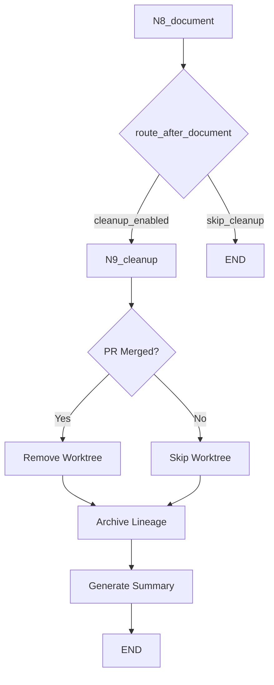
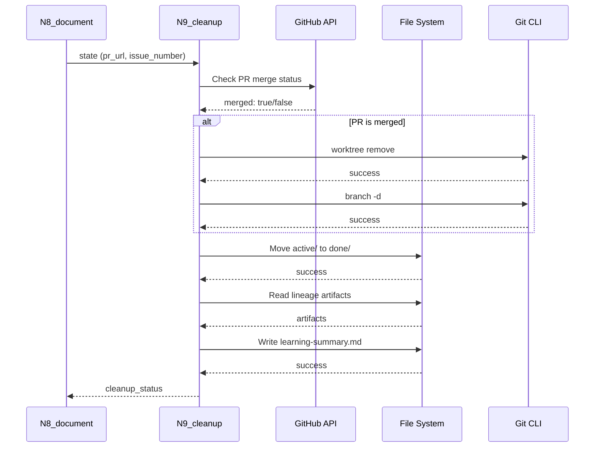

# 1180 - Feature: N9 Cleanup Node - Worktree Removal, Lineage Archival, and Learning Summary

<!-- Template Metadata
Last Updated: 2025-01-XX
Updated By: Initial LLD creation
Update Reason: New feature for post-implementation cleanup
-->

## 1. Context & Goal
* **Issue:** #180
* **Objective:** Add N9_cleanup node to workflow for worktree removal, lineage archival, and learning summary generation after implementation completion.
* **Status:** Draft
* **Related Issues:** #141 (LLD/report archival), #177 (coverage-driven test planning), #139 (workflow rename)

### Open Questions

- [x] ~~Should N9_cleanup be triggered automatically or require explicit invocation?~~ **RESOLVED: Automatic.** The proposed routing logic correctly integrates this as the final step.
- [x] ~~What's the appropriate timeout for PR merge status polling?~~ **RESOLVED: 10 seconds.** Single API check, standard HTTP timeout.
- [x] ~~Should learning summary generation use LLM or be purely template-based?~~ **RESOLVED: Template-based.** Ensures predictable output and $0 running costs.

## 2. Proposed Changes

*This section is the **source of truth** for implementation. Describe exactly what will be built.*

### 2.1 Files Changed

| File | Change Type | Description |
|------|-------------|-------------|
| `agentos/workflows/testing/nodes/cleanup.py` | Add | New N9_cleanup node implementation |
| `agentos/workflows/testing/nodes/__init__.py` | Modify | Export cleanup function |
| `agentos/workflows/testing/graph.py` | Modify | Add N9 node and edges |
| `agentos/workflows/testing/state.py` | Modify | Add pr_url, pr_merged, learning_summary_path fields |
| `agentos/workflows/testing/routers.py` | Modify | Add route_after_document function |

### 2.2 Dependencies

*No new packages required. Uses existing standard library and workflow dependencies.*

```toml
# No pyproject.toml additions needed
```

### 2.3 Data Structures

```python
# Pseudocode - NOT implementation
class TestingWorkflowState(TypedDict, total=False):
    # ... existing fields ...
    pr_url: str  # GitHub PR URL for merge status check
    pr_merged: bool  # True if PR has been merged
    learning_summary_path: str  # Path to generated learning summary
    cleanup_status: CleanupStatus  # Track cleanup progress

class CleanupStatus(TypedDict):
    worktree_removed: bool
    lineage_archived: bool
    summary_generated: bool
    skip_reason: str | None  # Why cleanup was skipped (if applicable)
```

### 2.4 Function Signatures

```python
# Signatures only - implementation in source files
def cleanup(state: TestingWorkflowState) -> dict[str, Any]:
    """N9: Post-implementation cleanup - worktree, lineage archival, learning summary."""
    ...

def check_pr_merged(pr_url: str) -> bool:
    """Check if a GitHub PR has been merged."""
    ...

def remove_worktree(worktree_path: Path, branch_name: str) -> bool:
    """Remove git worktree and associated branch."""
    ...

def archive_lineage(issue_number: int, repo_root: Path) -> Path | None:
    """Move lineage from active/ to done/."""
    ...

def generate_learning_summary(state: TestingWorkflowState, repo_root: Path) -> Path:
    """Generate learning summary from lineage artifacts."""
    ...

def route_after_document(state: TestingWorkflowState) -> str:
    """Route from N8_document to N9_cleanup or END."""
    ...
```

### 2.5 Logic Flow (Pseudocode)

```
N9_cleanup:
1. Receive state from N8_document
2. Initialize cleanup_status

3. CHECK PR MERGE STATUS:
   IF pr_url exists THEN
     - Call GitHub API to check merge status
     - Set pr_merged = True/False
   ELSE
     - Log warning: no PR URL available
     - Set pr_merged = False

4. WORKTREE REMOVAL:
   IF pr_merged AND worktree_path exists THEN
     - Run: git worktree remove {worktree_path}
     - Run: git branch -d {branch_name}
     - Set worktree_removed = True
     - Log success
   ELSE
     - Set worktree_removed = False
     - Set skip_reason = "PR not merged" or "No worktree path"
     - Log skip reason

5. LINEAGE ARCHIVAL:
   IF issue_number exists THEN
     - source = docs/lineage/active/{issue}-testing/
     IF source exists THEN
       - dest = docs/lineage/done/{issue}-testing/
       - Create dest parent if not exists
       - Move source to dest
       - Set lineage_archived = True
     ELSE
       - Log: lineage directory not found
       - Set lineage_archived = False
   ELSE
     - Log warning: no issue number
     - Set lineage_archived = False

6. LEARNING SUMMARY GENERATION:
   IF lineage_archived THEN
     - Read key artifacts from done/ directory
     - Extract outcome (SUCCESS/FAILURE)
     - Extract coverage metrics from iterations
     - Identify stall points
     - Generate recommendations
     - Write {issue}-learning-summary.md
     - Set learning_summary_path
     - Set summary_generated = True
   ELSE
     - Set summary_generated = False

7. RETURN updated state with cleanup_status
```

### 2.6 Technical Approach

* **Module:** `agentos/workflows/testing/nodes/cleanup.py`
* **Pattern:** Node function pattern consistent with N0-N8
* **Key Decisions:**
  - Use GitHub API via existing gh CLI wrapper for merge status check
  - Template-based summary generation (no LLM required for v1)
  - Graceful degradation: each cleanup step independent, failures don't block others

### 2.7 Architecture Decisions

| Decision | Options Considered | Choice | Rationale |
|----------|-------------------|--------|-----------|
| PR status check | Poll API, Webhook, Manual trigger | Poll API once | Simple, no infrastructure needed |
| Summary generation | LLM-based, Template-based, Hybrid | Template-based | Deterministic, fast, sufficient for v1 |
| Cleanup failure handling | Fail fast, Continue on error | Continue on error | Each step is independent, partial cleanup is useful |
| Worktree removal safety | Remove always, Remove if merged only | Remove if merged only | Prevents accidental data loss |

**Architectural Constraints:**
- Must integrate with existing LangGraph workflow structure
- Cannot block workflow if GitHub API is unavailable
- Must preserve all artifacts before archival

## 3. Requirements

1. N9_cleanup node added to workflow graph after N8_document
2. Worktree removed ONLY if PR is confirmed merged
3. Lineage moved from `active/` to `done/` on successful completion
4. Learning summary generated with outcome, coverage gaps, and recommendations
5. Summary format documented for future learning agent consumption
6. Cleanup skipped gracefully if PR not yet merged (log, don't fail)
7. Each cleanup step operates independently (partial success is valid)

## 4. Alternatives Considered

| Option | Pros | Cons | Decision |
|--------|------|------|----------|
| Separate cleanup script (not in workflow) | Simpler, can run manually | Disconnected from workflow state, manual invocation | **Rejected** |
| N9 as part of N8_document | Fewer nodes, simpler graph | Violates single responsibility, harder to test | **Rejected** |
| N9 as standalone node | Clear separation, testable, uses workflow state | Additional node complexity | **Selected** |
| LLM-based summary generation | Richer insights, adaptive | Expensive, non-deterministic, slower | **Rejected** (for v1) |

**Rationale:** Standalone N9 node maintains architectural consistency with existing nodes, enables isolated testing, and uses workflow state for context. Template-based summaries are sufficient for initial learning agent integration.

## 5. Data & Fixtures

### 5.1 Data Sources

| Attribute | Value |
|-----------|-------|
| Source | Local lineage artifacts in `docs/lineage/active/` |
| Format | Markdown files, JSON metadata, plain text logs |
| Size | ~64 files per implementation run, ~500KB-2MB total |
| Refresh | Generated during workflow, read once at cleanup |
| Copyright/License | N/A (internal artifacts) |

### 5.2 Data Pipeline

```
Lineage (active/) ──read──► Summary Generator ──write──► Summary (done/)
                                    │
Lineage (active/) ──────────move────────────────────────► Lineage (done/)
```

### 5.3 Test Fixtures

| Fixture | Source | Notes |
|---------|--------|-------|
| Sample lineage directory | Generated | Complete artifact set for test issue |
| Mock GitHub API response | Hardcoded | PR merged/not merged states |
| Mock worktree state | Generated | Simulated worktree paths |

### 5.4 Deployment Pipeline

Data is local to the repository. No external deployment needed.

## 6. Diagram

### 6.1 Mermaid Quality Gate

Before finalizing any diagram, verify in [Mermaid Live Editor](https://mermaid.live) or GitHub preview:

- [x] **Simplicity:** Similar components collapsed (per 0006 §8.1)
- [x] **No touching:** All elements have visual separation (per 0006 §8.2)
- [x] **No hidden lines:** All arrows fully visible (per 0006 §8.3)
- [x] **Readable:** Labels not truncated, flow direction clear
- [ ] **Auto-inspected:** Agent rendered via mermaid.ink and viewed (per 0006 §8.5)

**Auto-Inspection Results:**
```
- Touching elements: [ ] None / [ ] Found: ___
- Hidden lines: [ ] None / [ ] Found: ___
- Label readability: [ ] Pass / [ ] Issue: ___
- Flow clarity: [ ] Clear / [ ] Issue: ___
```

*Reference: [0006-mermaid-diagrams.md](0006-mermaid-diagrams.md)*

### 6.2 Diagram





## 7. Security & Safety Considerations

### 7.1 Security

| Concern | Mitigation | Status |
|---------|------------|--------|
| GitHub token exposure | Use existing gh CLI auth, no token in state | Addressed |
| Path traversal in lineage paths | Validate issue_number is numeric, use Path.resolve() | Addressed |

### 7.2 Safety

| Concern | Mitigation | Status |
|---------|------------|--------|
| Worktree deleted before PR merge | Only remove if API confirms merged status | Addressed |
| Lineage lost during move | Use atomic move operation, log source/dest | Addressed |
| Partial cleanup state | Track each step independently in cleanup_status | Addressed |
| Git operation failure | Wrap in try/except, log errors, continue | Addressed |

**Fail Mode:** Fail Open - Cleanup failures should not block workflow completion. Log and continue.

**Recovery Strategy:** 
- If worktree removal fails: Manual `git worktree remove` command logged
- If lineage move fails: Directory locations logged for manual move
- If summary fails: Can regenerate from archived lineage

## 8. Performance & Cost Considerations

### 8.1 Performance

| Metric | Budget | Approach |
|--------|--------|----------|
| Latency | < 5s total | Local file operations, single API call |
| Memory | < 50MB | Stream artifact reading, no full load |
| API Calls | 1 per cleanup | Single PR status check |

**Bottlenecks:** GitHub API rate limiting could affect PR status check in high-volume scenarios.

### 8.2 Cost Analysis

| Resource | Unit Cost | Estimated Usage | Monthly Cost |
|----------|-----------|-----------------|--------------|
| GitHub API | Free (within limits) | ~30 calls/month | $0 |
| Local disk | N/A | ~2MB per lineage | $0 |

**Cost Controls:**
- [x] No external paid services used
- [x] GitHub API usage within free tier limits

**Worst-Case Scenario:** If GitHub API is down, worktree removal is skipped but lineage archival and summary generation proceed.

## 9. Legal & Compliance

| Concern | Applies? | Mitigation |
|---------|----------|------------|
| PII/Personal Data | No | Lineage contains only code artifacts |
| Third-Party Licenses | No | Uses existing dependencies only |
| Terms of Service | Yes | GitHub API usage within ToS limits |
| Data Retention | N/A | Archival, not deletion |
| Export Controls | No | No restricted data |

**Data Classification:** Internal

**Compliance Checklist:**
- [x] No PII stored without consent
- [x] All third-party licenses compatible with project license
- [x] External API usage compliant with provider ToS
- [x] Data retention policy documented (archival to done/)

## 10. Verification & Testing

### 10.0 Test Plan (TDD - Complete Before Implementation)

**TDD Requirement:** Tests MUST be written and failing BEFORE implementation begins.

| Test ID | Test Description | Expected Behavior | Status |
|---------|------------------|-------------------|--------|
| T010 | test_cleanup_pr_merged_removes_worktree | Worktree and branch removed when PR merged | RED |
| T020 | test_cleanup_pr_not_merged_skips_worktree | Worktree preserved when PR not merged | RED |
| T030 | test_cleanup_archives_lineage | Lineage moved from active/ to done/ | RED |
| T040 | test_cleanup_generates_summary | Learning summary created with expected sections | RED |
| T050 | test_cleanup_no_pr_url_skips_worktree | Graceful skip when no PR URL in state | RED |
| T060 | test_cleanup_missing_lineage_logs_warning | Warning logged when lineage dir not found | RED |
| T070 | test_route_after_document_to_cleanup | Router returns N9_cleanup when enabled | RED |
| T080 | test_route_after_document_to_end | Router returns END when cleanup disabled | RED |
| T090 | test_summary_extracts_coverage_gaps | Coverage gap table populated correctly | RED |
| T100 | test_cleanup_partial_failure_continues | Other steps run even if one fails | RED |

**Coverage Target:** ≥95% for all new code

**TDD Checklist:**
- [ ] All tests written before implementation
- [ ] Tests currently RED (failing)
- [ ] Test IDs match scenario IDs in 10.1
- [ ] Test file created at: `tests/unit/test_cleanup.py`

### 10.1 Test Scenarios

| ID | Scenario | Type | Input | Expected Output | Pass Criteria |
|----|----------|------|-------|-----------------|---------------|
| 010 | PR merged, cleanup all | Auto | state with merged PR | worktree removed, lineage archived, summary generated | All cleanup_status flags True |
| 020 | PR not merged | Auto | state with unmerged PR | worktree preserved, lineage archived, summary generated | worktree_removed=False, skip_reason set |
| 030 | No PR URL | Auto | state without pr_url | Skip worktree, proceed with archival | Graceful skip logged |
| 040 | Missing lineage directory | Auto | state with nonexistent lineage | Log warning, skip archival | lineage_archived=False |
| 050 | Worktree removal fails | Auto | state with invalid worktree | Log error, continue to archival | Error logged, other steps complete |
| 060 | Summary generation with stall | Auto | lineage with stall iterations | Summary includes stall analysis | "Stall detected" in summary |
| 070 | Full success workflow | Auto | complete valid state | All three cleanup tasks succeed | cleanup_status all True |
| 080 | GitHub API unavailable | Auto | mocked API timeout | Skip worktree, continue archival | Timeout handled gracefully |
| 090 | Lineage with 64 artifacts | Auto | full lineage directory | Summary references key artifacts | Artifact paths in summary |
| 100 | Router enables cleanup | Auto | state with success outcome | Router returns "N9_cleanup" | Correct routing |

### 10.2 Test Commands

```bash
# Run all automated tests
poetry run pytest tests/unit/test_cleanup.py -v

# Run only fast/mocked tests (exclude live)
poetry run pytest tests/unit/test_cleanup.py -v -m "not live"

# Run live integration tests (requires GitHub auth)
poetry run pytest tests/unit/test_cleanup.py -v -m live

# Run with coverage
poetry run pytest tests/unit/test_cleanup.py -v --cov=agentos/workflows/testing/nodes/cleanup --cov-report=term-missing
```

### 10.3 Manual Tests (Only If Unavoidable)

**N/A - All scenarios automated.**

## 11. Risks & Mitigations

| Risk | Impact | Likelihood | Mitigation |
|------|--------|------------|------------|
| GitHub API changes | Med | Low | Abstract API call behind interface |
| Worktree removal corrupts repo | High | Low | Only remove if PR confirmed merged |
| Lineage move loses data | High | Low | Use shutil.move (atomic on same filesystem) |
| Summary format doesn't serve learning agent | Med | Med | Design with future consumer in mind, iterate |
| PR merge status stale | Low | Med | Single check at cleanup time, user can re-run |

## 12. Definition of Done

### Code
- [ ] Implementation complete and linted
- [ ] Code comments reference this LLD (#180)

### Tests
- [ ] All test scenarios pass (T010-T100)
- [ ] Test coverage ≥95% for new code

### Documentation
- [ ] LLD updated with any deviations
- [ ] Implementation Report (0103) completed
- [ ] Learning summary format documented for future learning agent

### Review
- [ ] Code review completed
- [ ] User approval before closing issue

---

## Appendix: Review Log

*Track all review feedback with timestamps and implementation status.*

### Review Summary

| Review | Date | Verdict | Key Issue |
|--------|------|---------|-----------|
| - | - | - | - |

**Final Status:** PENDING