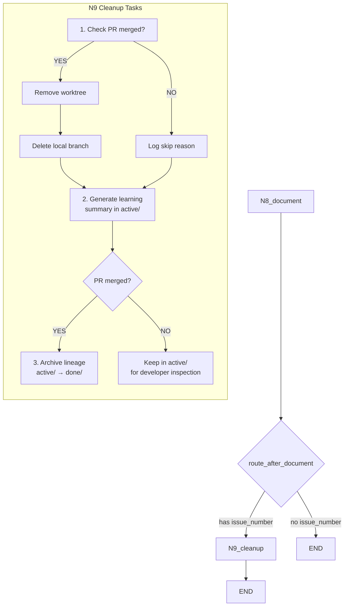

# 180 - Feature: N9 Cleanup Node - Worktree Removal, Lineage Archival, and Learning Summary

<!-- Template Metadata
Last Updated: 2026-02-17
Updated By: Issue #180 LLD revision
Update Reason: Address Gemini Review #1 Tier 2 feedback - align lineage archival with PR merged state; resolve open questions; add subprocess timeout; fix pseudocode conditionality
Previous: Revised to fix mechanical validation errors (REQ-1 and REQ-10 missing test coverage), enforce numbered list format in Section 3, and add (REQ-N) suffixes to all test scenarios in Section 10.1
-->

## 1. Context & Goal
* **Issue:** #180
* **Objective:** Add an N9_cleanup node to the testing workflow that removes worktrees after PR merge, archives lineage from active/ to done/, and generates a distilled learning summary for future learning agent consumption.
* **Status:** Approved (gemini-3-pro-preview, 2026-02-25)
* **Related Issues:** #141 (Archive LLD/reports to done/), #177 (Coverage-driven test planning), #139 (Rename workflows/testing/ to workflows/implementation/), #94 (Lu-Tze general hygiene)

### Open Questions

*All questions resolved during Gemini Review #1.*

- [x] ~~Should N9 be skipped entirely (route straight to END) when running in dry-run / local-only mode with no PR?~~ **RESOLVED: Yes.** Rely on the `issue_number` check in `route_after_document`. If running locally *with* an issue number, the safety checks (PR merged status) in the node prevent destructive actions, which is sufficient.
- [x] ~~Should the learning summary generation use an LLM call, or should it be purely deterministic extraction from lineage artifacts?~~ **RESOLVED: Deterministic extraction.** Use regex/parsing to extract coverage and iteration counts. It is fast, free, and sufficient for the defined metrics.
- [x] ~~What is the maximum acceptable latency for N9 before it should be made async/optional?~~ **RESOLVED: 10 seconds.** Implement `subprocess.run(timeout=10)` for all external CLI calls (gh, git) to prevent hanging.

## 2. Proposed Changes

### 2.1 Files Changed

| File | Change Type | Description |
|------|-------------|-------------|
| `assemblyzero/workflows/testing/nodes/cleanup.py` | Add | New N9 cleanup node: worktree removal, lineage archival, learning summary generation |
| `assemblyzero/workflows/testing/nodes/__init__.py` | Modify | Export `cleanup` function from new module |
| `assemblyzero/workflows/testing/graph.py` | Modify | Add N9_cleanup node, wire N8→N9 conditional edge, N9→END edge |
| `assemblyzero/workflows/testing/state.py` | Modify | Add `pr_url`, `pr_merged`, `learning_summary_path`, `cleanup_skipped_reason` fields |
| `assemblyzero/workflows/testing/nodes/cleanup_helpers.py` | Add | Pure-function helpers: worktree removal, lineage archival, summary generation |
| `tests/unit/test_cleanup.py` | Add | Unit tests for N9 cleanup node |
| `tests/unit/test_cleanup_helpers.py` | Add | Unit tests for cleanup helper functions |
| `tests/fixtures/mock_lineage/` | Add (Directory) | Directory for mock lineage fixtures |
| `tests/fixtures/mock_lineage/001-lld.md` | Add | Minimal mock lineage artifact for testing |
| `tests/fixtures/mock_lineage/005-test-scaffold.py` | Add | Minimal mock test scaffold artifact |
| `tests/fixtures/mock_lineage/052-green-phase.txt` | Add | Minimal mock green phase artifact |

### 2.1.1 Path Validation (Mechanical - Auto-Checked)

Mechanical validation automatically checks:
- `assemblyzero/workflows/testing/nodes/__init__.py` — exists ✓ (Modify)
- `assemblyzero/workflows/testing/graph.py` — exists ✓ (Modify)
- `assemblyzero/workflows/testing/state.py` — exists ✓ (Modify)
- `assemblyzero/workflows/testing/nodes/` — exists ✓ (parent for Add files)
- `tests/unit/` — exists ✓ (parent for Add files)
- `tests/fixtures/` — exists ✓ (parent for new directory)

### 2.2 Dependencies

```toml
# No new dependencies required.
# Uses only stdlib: shutil, pathlib, subprocess, json, datetime, logging, re
# Uses existing project dependency: pygithub (for PR merge status check — not directly used, gh CLI preferred)
```

### 2.3 Data Structures

```python
# State additions to TestingWorkflowState
class TestingWorkflowState(TypedDict, total=False):
    # ... existing fields ...
    pr_url: str                    # GitHub PR URL (e.g., "https://github.com/org/repo/pull/42")
    pr_merged: bool                # Set by N9 after checking merge status
    learning_summary_path: str     # Absolute path to generated learning summary
    cleanup_skipped_reason: str    # Reason cleanup was skipped (e.g., "PR not merged")


# Internal data class for learning summary extraction
@dataclass
class IterationSnapshot:
    """Captures coverage data from a single TDD iteration."""
    iteration: int           # 1-based iteration number
    coverage_pct: float      # Coverage percentage at this iteration
    missing_lines: list[str] # Lines still uncovered
    root_cause: str          # Why coverage didn't improve (if stalled)


@dataclass
class LearningSummaryData:
    """Structured data extracted from lineage artifacts before rendering to markdown."""
    issue_number: int
    outcome: str                          # "SUCCESS" or "FAILURE"
    final_coverage: float                 # Final coverage percentage
    target_coverage: float                # Target coverage percentage
    total_iterations: int                 # Number of TDD iterations
    stall_detected: bool                  # Whether a stall was detected
    stall_iteration: int | None           # Iteration where stall occurred
    iteration_snapshots: list[IterationSnapshot]
    key_artifacts: list[tuple[str, str]]  # (filename, description) pairs
    what_worked: list[str]                # Extracted successes
    what_didnt_work: list[str]            # Extracted failures
    recommendations: list[str]            # Generated recommendations
```

### 2.4 Function Signatures

```python
# === cleanup.py (N9 node) ===

SUBPROCESS_TIMEOUT: int = 10  # seconds — max wait for gh/git CLI calls

def cleanup(state: dict[str, Any]) -> dict[str, Any]:
    """N9: Post-implementation cleanup node.

    Orchestrates three cleanup tasks:
    1. Check PR merge status and remove worktree if merged
    2. Generate learning summary in active lineage directory
    3. Archive lineage from active/ to done/ ONLY if PR is merged

    If PR is not merged, the learning summary is written into active/
    so developers can inspect it during iteration.

    Returns updated state fields: pr_merged, learning_summary_path,
    cleanup_skipped_reason.
    """
    ...


def route_after_document(state: dict[str, Any]) -> str:
    """Conditional routing from N8 to N9 or END.

    Returns "N9_cleanup" if state has valid issue_number,
    otherwise returns "end".
    """
    ...


# === cleanup_helpers.py ===

SUBPROCESS_TIMEOUT: int = 10  # seconds — max wait for gh/git CLI calls

def check_pr_merged(pr_url: str) -> bool:
    """Check if a GitHub PR is merged using gh CLI.

    Args:
        pr_url: Full GitHub PR URL.

    Returns:
        True if PR state is MERGED, False otherwise.

    Raises:
        subprocess.CalledProcessError: If gh CLI invocation fails.
        subprocess.TimeoutExpired: If gh CLI exceeds SUBPROCESS_TIMEOUT.
        ValueError: If pr_url is empty or malformed.
    """
    ...


def remove_worktree(worktree_path: str | Path) -> bool:
    """Remove a git worktree (without --force).

    Args:
        worktree_path: Absolute path to the worktree directory.

    Returns:
        True if worktree was removed successfully, False if it didn't exist.

    Raises:
        subprocess.CalledProcessError: If git worktree remove fails
            (e.g., dirty worktree).
        subprocess.TimeoutExpired: If git CLI exceeds SUBPROCESS_TIMEOUT.
    """
    ...


def get_worktree_branch(worktree_path: str | Path) -> str | None:
    """Extract the branch name associated with a worktree.

    Args:
        worktree_path: Absolute path to the worktree directory.

    Returns:
        Branch name string, or None if worktree not found in git worktree list.

    Raises:
        subprocess.TimeoutExpired: If git CLI exceeds SUBPROCESS_TIMEOUT.
    """
    ...


def delete_local_branch(branch_name: str) -> bool:
    """Delete a local git branch using -D (force, for squash-merged branches).

    Args:
        branch_name: Name of the branch to delete.

    Returns:
        True if deleted, False if branch didn't exist.

    Raises:
        subprocess.CalledProcessError: If git branch -D fails for reasons
            other than branch-not-found.
        subprocess.TimeoutExpired: If git CLI exceeds SUBPROCESS_TIMEOUT.
    """
    ...


def archive_lineage(
    repo_root: Path,
    issue_number: int,
    lineage_suffix: str = "testing",
) -> Path | None:
    """Move lineage directory from active/ to done/.

    Args:
        repo_root: Path to the repository root.
        issue_number: GitHub issue number.
        lineage_suffix: Subdirectory suffix (default "testing").

    Returns:
        Path to the new done/ directory, or None if active dir didn't exist.

    Raises:
        OSError: If move operation fails (e.g., permissions, done/ already exists
            and timestamp suffix fallback also fails).
    """
    ...


def extract_iteration_data(lineage_dir: Path) -> list[IterationSnapshot]:
    """Parse lineage artifacts to extract per-iteration coverage data.

    Scans for files matching patterns like *-green-phase*, *-coverage*,
    *-failed-response* to reconstruct the iteration history.

    Args:
        lineage_dir: Path to the lineage directory (active or done).

    Returns:
        List of IterationSnapshot in chronological order.
    """
    ...


def detect_stall(snapshots: list[IterationSnapshot]) -> tuple[bool, int | None]:
    """Detect if coverage stalled (same coverage for 2+ consecutive iterations).

    Args:
        snapshots: Ordered list of iteration snapshots.

    Returns:
        Tuple of (stall_detected, stall_iteration_number).
        stall_iteration_number is None if no stall detected.
    """
    ...


def build_learning_summary(
    lineage_dir: Path,
    issue_number: int,
    outcome: str,
    final_coverage: float,
    target_coverage: float,
) -> LearningSummaryData:
    """Build structured learning summary data from lineage artifacts.

    Args:
        lineage_dir: Path to the lineage directory.
        issue_number: GitHub issue number.
        outcome: "SUCCESS" or "FAILURE".
        final_coverage: Final test coverage percentage.
        target_coverage: Target coverage percentage.

    Returns:
        Populated LearningSummaryData instance.
    """
    ...


def render_learning_summary(data: LearningSummaryData) -> str:
    """Render LearningSummaryData to markdown string.

    The output format is versioned (Format Version: 1.0) and documented
    for stable consumption by future learning agents.

    Args:
        data: Structured learning summary data.

    Returns:
        Complete markdown string for learning-summary.md.
    """
    ...


def write_learning_summary(
    lineage_dir: Path,
    content: str,
) -> Path:
    """Write learning summary markdown to the lineage directory.

    Args:
        lineage_dir: Path to the lineage directory (active/ or done/).
        content: Markdown content string.

    Returns:
        Path to the written learning-summary.md file.
    """
    ...
```

### 2.5 Logic Flow (Pseudocode)

```
N9_cleanup(state):
    1. Extract state: pr_url, worktree_path, issue_number, repo_root,
       final_coverage, target_coverage, outcome

    2. WORKTREE CLEANUP:
       IF pr_url is present:
           merged = check_pr_merged(pr_url)          # timeout=10s
           state.pr_merged = merged
           IF merged AND worktree_path exists:
               branch = get_worktree_branch(worktree_path)   # timeout=10s
               remove_worktree(worktree_path)                 # timeout=10s
               IF branch:
                   delete_local_branch(branch)                # timeout=10s
               LOG "Worktree and branch cleaned up"
           ELSE IF NOT merged:
               state.cleanup_skipped_reason = "PR not yet merged"
               LOG "Skipping worktree removal - PR not merged"
       ELSE:
           state.cleanup_skipped_reason = "No PR URL in state"
           LOG "No PR URL - skipping worktree cleanup"

    3. LEARNING SUMMARY (generated in active/ first):
       active_dir = repo_root / "docs" / "lineage" / "active" / f"{issue_number}-testing"
       IF active_dir.exists():
           summary_data = build_learning_summary(
               active_dir, issue_number, outcome, final_coverage, target_coverage
           )
           markdown = render_learning_summary(summary_data)
           write_learning_summary(active_dir, markdown)
           LOG "Learning summary written to active/"
       ELSE:
           LOG "No active lineage directory found - skipping summary generation"

    4. LINEAGE ARCHIVAL (only if PR merged):
       IF active_dir.exists() AND state.pr_merged is True:
           done_dir = archive_lineage(repo_root, issue_number)
           state.learning_summary_path = str(done_dir / "learning-summary.md")
           LOG "Lineage archived to done/"
       ELSE IF active_dir.exists() AND NOT state.pr_merged:
           state.learning_summary_path = str(active_dir / "learning-summary.md")
           LOG "Lineage kept in active/ (PR not merged) - summary available for inspection"
       ELSE:
           LOG "No lineage directory available - skipping archival"

    5. UPDATE state with pr_merged, learning_summary_path, cleanup_skipped_reason

    6. RETURN updated state fields
```

```
route_after_document(state):
    # Conditional routing from N8
    IF state has valid issue_number:
        RETURN "N9_cleanup"
    ELSE:
        RETURN "end"
```

### 2.6 Technical Approach

* **Module:** `assemblyzero/workflows/testing/nodes/cleanup.py` (node) + `cleanup_helpers.py` (helpers)
* **Pattern:** Separation of orchestration (node) from pure logic (helpers). The node function handles state extraction/injection; helpers are independently testable pure functions.
* **Key Decisions:**
  - Use `gh pr view --json state` for merge check (consistent with existing project tooling in CLAUDE.md)
  - Use `git worktree remove` without `--force` (per project standards — clean ephemeral files first)
  - Use `shutil.move` for lineage archival (atomic on same filesystem)
  - Learning summary is deterministic extraction, not LLM-generated (keeps N9 fast and free)
  - Helper functions are pure where possible to maximize testability
  - All `subprocess.run` calls use `timeout=10` to prevent hanging
  - Learning summary generated in `active/` first, then archival to `done/` only when PR merged (per Gemini Review #1 Tier 2 feedback)

### 2.7 Architecture Decisions

| Decision | Options Considered | Choice | Rationale |
|----------|-------------------|--------|-----------|
| Merge check mechanism | GitHub API (PyGitHub), `gh` CLI | `gh` CLI via subprocess | Consistent with CLAUDE.md workflow; avoids API token management; `gh` is already authenticated in all agent environments |
| Learning summary generation | LLM-based analysis, Deterministic parsing | Deterministic parsing | Zero cost, instant execution, reproducible; LLM analysis deferred to future learning agent (out of scope) |
| Helper function separation | All logic in node function, Separate helpers module | Separate helpers module | Helpers are pure functions; independently testable without mocking LangGraph state machinery |
| Lineage directory move | `shutil.move`, `shutil.copytree` + delete, `git mv` | `shutil.move` | Lineage is not tracked in git (it's in worktree output dirs); `shutil.move` is atomic on same FS |
| Worktree branch deletion | `git branch -d` (safe), `git branch -D` (force) | `git branch -D` (force) | Per project standard 0001 §3: squash-merge creates new SHA so `-d` incorrectly reports "not merged" |
| N9 failure behavior | Fail workflow, Log and continue | Log and continue (graceful skip) | Cleanup failure should not invalidate a successful implementation; cleanup is best-effort |
| Graph wiring pattern | Direct edge N8→N9, Conditional edge N8→N9/END | Conditional edge via `route_after_document` | Allows skipping N9 when no issue_number is present (e.g., dry-run mode) |
| State field updates | Mutate existing state, Return new state dict | Return new state dict with updated fields | Consistent with LangGraph node pattern; state merging handled by framework |
| Lineage archival conditionality | Always archive, Only archive when PR merged | Only archive when PR merged | Per Gemini Review #1: developers iterating locally need `active/` to contain current context for debugging; archiving intermediate runs clears the active workspace prematurely |
| Summary generation location | Generate in done/ after archive, Generate in active/ then archive | Generate in active/ first | Summary is available for developer inspection regardless of PR state; if PR merged, the summary moves with the archive |
| Subprocess timeout | No timeout, 5s, 10s, 30s | 10 seconds | Per Gemini Review #1: prevents hanging on unreachable GitHub; 10s accommodates slow network while keeping N9 responsive |

**Architectural Constraints:**
- Must not use `--force` on `git worktree remove` (per CLAUDE.md — clean ephemeral files first)
- Must check PR merge status before any destructive operations
- Must not fail the workflow if cleanup encounters non-critical errors
- Learning summary format must be stable for future learning agent consumption (documented schema)
- Lineage archival (active/ → done/) must only occur when PR is confirmed merged
- All subprocess calls must use `timeout=10` parameter

## 3. Requirements

1. N9 node is added to the testing workflow graph, wired as N8_document → N9_cleanup → END.
2. Worktree is removed only when PR is confirmed merged (via `gh pr view --json state`).
3. Associated local branch is deleted after worktree removal using `git branch -D`.
4. Lineage directory is moved from `docs/lineage/active/{issue}-testing/` to `docs/lineage/done/{issue}-testing/` only when PR is confirmed merged.
5. A `learning-summary.md` file is generated in the lineage directory (active/ or done/ depending on PR state) with structured outcome, iteration gaps, and recommendations.
6. If PR is not yet merged, N9 logs the reason, skips worktree cleanup, keeps lineage in active/ with the learning summary, and does not fail.
7. If lineage directory does not exist, N9 logs and skips summary generation/archival without failing.
8. All cleanup errors are caught, logged, and do not propagate as workflow failures.
9. Learning summary format is documented and stable for future learning agent consumption, including a `## Format Version: 1.0` header.
10. State is updated with `pr_merged`, `learning_summary_path`, and `cleanup_skipped_reason`.

## 4. Alternatives Considered

| Option | Pros | Cons | Decision |
|--------|------|------|----------|
| N9 as in-workflow node (selected) | Automatic execution after every run; consistent; state-aware | Adds latency to workflow end; coupled to workflow | **Selected** |
| Standalone CLI tool (like existing `archive_worktree_lineage.py`) | Can be run independently; simpler | Manual invocation required; no state access; duplicates existing tooling | Rejected |
| Post-workflow callback/hook | Decoupled from workflow graph; can be optional | No access to LangGraph state; harder to test; adds infrastructure complexity | Rejected |
| LLM-generated learning summary | Richer analysis; can identify subtle patterns | Adds API cost; non-deterministic; slower; overkill for structured data extraction | Rejected |

**Rationale:** An in-workflow node is the natural choice because N9 needs access to workflow state (PR URL, coverage data, iteration count) and should execute automatically without human intervention. The existing `archive_worktree_lineage.py` tool handles a subset of this (lineage archival only) and is designed for manual invocation — N9 automates and extends this within the workflow context.

## 5. Data & Fixtures

### 5.1 Data Sources

| Attribute | Value |
|-----------|-------|
| Source | Local filesystem (lineage artifacts), `gh` CLI (PR status), `git` CLI (worktree/branch info) |
| Format | Markdown files, plain text, JSON (gh output) |
| Size | 64+ files per lineage directory, typically < 5MB total |
| Refresh | One-time read at N9 execution |
| Copyright/License | N/A — project-internal artifacts |

### 5.2 Data Pipeline

```
Lineage artifacts (active/) ──parse──► IterationSnapshot[] ──build──► LearningSummaryData ──render──► learning-summary.md (active/)
```

```
IF PR merged:
  active/ (with summary) ──shutil.move──► done/ (with summary)
ELSE:
  active/ (with summary) stays in place for developer inspection
```

```
gh pr view --json state ──parse──► bool (merged) ──gate──► git worktree remove + git branch -D
```

### 5.3 Test Fixtures

| Fixture | Source | Notes |
|---------|--------|-------|
| `tests/fixtures/mock_lineage/001-lld.md` | Generated | Minimal LLD artifact for summary extraction tests |
| `tests/fixtures/mock_lineage/005-test-scaffold.py` | Generated | Minimal test scaffold file |
| `tests/fixtures/mock_lineage/052-green-phase.txt` | Generated | Contains coverage data (e.g., "Coverage: 98%") |
| Mock `gh pr view` output | Hardcoded in tests | JSON responses for merged/open/not-found states |
| Temporary directories | pytest `tmp_path` fixture | For testing lineage move operations |

### 5.4 Deployment Pipeline

No deployment pipeline needed. Lineage data stays local to the repository. Learning summaries are committed to the repo as part of the done/ lineage.

## 6. Diagram

### 6.1 Mermaid Quality Gate

- [x] **Simplicity:** Minimal nodes, only showing N8→N9 addition
- [x] **No touching:** All elements have visual separation
- [x] **No hidden lines:** All arrows visible
- [x] **Readable:** Labels clear and concise
- [ ] **Auto-inspected:** To be rendered by implementing agent

**Auto-Inspection Results:**
```
- Touching elements: [ ] None / [ ] Found: ___
- Hidden lines: [ ] None / [ ] Found: ___
- Label readability: [ ] Pass / [ ] Issue: ___
- Flow clarity: [ ] Clear / [ ] Issue: ___
```

### 6.2 Diagram



## 7. Security & Safety Considerations

### 7.1 Security

| Concern | Mitigation | Status |
|---------|------------|--------|
| Arbitrary path traversal in worktree_path | Validate worktree_path exists and is under expected parent directory before removal | Addressed |
| Command injection via state values | All subprocess calls use list-form arguments (not shell=True); no string interpolation in commands | Addressed |
| Unauthorized file deletion | Only delete worktree if PR is confirmed merged; never use `--force` on worktree remove | Addressed |
| Sensitive data in learning summary | Summary contains only coverage percentages, file names, and iteration counts — no secrets, no code content | Addressed |

### 7.2 Safety

| Concern | Mitigation | Status |
|---------|------------|--------|
| Data loss if lineage move fails mid-operation | `shutil.move` is atomic on same filesystem; if cross-filesystem, use `shutil.copytree` then delete only after verification | Addressed |
| Worktree removed but branch persists (orphan) | Branch deletion is attempted after worktree removal; failure is logged but non-fatal | Addressed |
| done/ directory already exists (name collision) | Check before move; if exists, append timestamp suffix (e.g., `{issue}-testing-1708200000`) | Addressed |
| Workflow fails on cleanup error | All cleanup operations wrapped in try/except; errors logged at WARNING level; state updated with skip reason | Addressed |
| Removing worktree with uncommitted changes | `git worktree remove` (without --force) will refuse if dirty; this is the correct behavior — log and skip | Addressed |
| Subprocess hangs indefinitely | All `subprocess.run` calls use `timeout=10` parameter; `TimeoutExpired` caught and logged | Addressed |
| Premature lineage archival during developer iteration | Lineage archival gated on `pr_merged=True`; when PR not merged, active/ preserved with summary for debugging | Addressed |

**Fail Mode:** Fail Open — cleanup failures are logged but do not fail the workflow. A successful N8 output is not invalidated by cleanup failure.

**Recovery Strategy:** If N9 fails partway:
- Worktree can be manually removed via `git worktree remove`
- Lineage can be manually moved via `mv docs/lineage/active/{id} docs/lineage/done/`
- Learning summary can be regenerated by re-running N9 (idempotent for summary generation)

## 8. Performance & Cost Considerations

### 8.1 Performance

| Metric | Budget | Approach |
|--------|--------|----------|
| N9 execution time | < 5 seconds typical, < 10 seconds max | All operations are local filesystem + CLI calls; no LLM invocations; subprocess timeout=10s |
| Memory | < 50MB | Read lineage files sequentially; don't load all into memory |
| API Calls | 1 `gh` CLI call | Single PR status check; no LLM calls |

**Bottlenecks:** The `gh pr view` call requires network access and GitHub API availability. If GitHub is slow, this could add 2-5 seconds. Timeout is set at 10 seconds to prevent indefinite hanging.

### 8.2 Cost Analysis

| Resource | Unit Cost | Estimated Usage | Monthly Cost |
|----------|-----------|-----------------|--------------|
| GitHub API (via gh CLI) | Free (within rate limits) | 1 call per workflow run | $0 |
| LLM API calls | N/A | 0 | $0 |
| Disk I/O | Negligible | ~5MB move per run | $0 |

**Cost Controls:**
- [x] No LLM calls — entirely deterministic
- [x] Single GitHub API call per workflow execution
- [x] No external service dependencies beyond `gh`

**Worst-Case Scenario:** Even at 100 workflow runs/day, this is 100 `gh` API calls — well within GitHub rate limits (5000/hour authenticated).

## 9. Legal & Compliance

| Concern | Applies? | Mitigation |
|---------|----------|------------|
| PII/Personal Data | No | Learning summaries contain only coverage metrics, file names, and iteration data |
| Third-Party Licenses | No | No new dependencies added |
| Terms of Service | No | `gh` CLI usage is within GitHub ToS |
| Data Retention | N/A | done/ lineage is retained indefinitely as project knowledge |
| Export Controls | No | No restricted data or algorithms |

**Data Classification:** Internal

**Compliance Checklist:**
- [x] No PII stored without consent
- [x] All third-party licenses compatible with project license
- [x] External API usage compliant with provider ToS
- [x] Data retention policy documented (retained in repo)

## 10. Verification & Testing

### 10.0 Test Plan (TDD - Complete Before Implementation)

**TDD Requirement:** Tests MUST be written and failing BEFORE implementation begins.

| Test ID | Test Description | Expected Behavior | Status |
|---------|------------------|-------------------|--------|
| T010 | test_cleanup_node_wired_in_graph | N9_cleanup node present in graph with N8→N9 and N9→END edges | RED |
| T020 | test_cleanup_happy_path_pr_merged | Full cleanup: worktree removed, summary in active/, lineage archived to done/ | RED |
| T030 | test_cleanup_pr_not_merged_skips_worktree_keeps_active | Worktree preserved, summary in active/, lineage NOT archived | RED |
| T040 | test_cleanup_no_pr_url_skips_worktree | No PR URL in state, worktree skipped gracefully | RED |
| T050 | test_cleanup_no_lineage_dir_skips_archival | Missing active/ dir, summary skipped, no error | RED |
| T060 | test_cleanup_worktree_dirty_skips_removal | Dirty worktree not force-removed, logged | RED |
| T070 | test_check_pr_merged_returns_true | gh returns MERGED state | RED |
| T080 | test_check_pr_merged_returns_false_open | gh returns OPEN state | RED |
| T090 | test_check_pr_merged_invalid_url | ValueError raised for malformed URL | RED |
| T095 | test_check_pr_merged_timeout | TimeoutExpired raised after 10s, caught by node | RED |
| T100 | test_remove_worktree_success | git worktree remove succeeds, returns True | RED |
| T110 | test_remove_worktree_nonexistent | Worktree path doesn't exist, returns False | RED |
| T120 | test_get_worktree_branch_found | Extracts branch name from git worktree list | RED |
| T130 | test_get_worktree_branch_not_found | Returns None for unknown path | RED |
| T140 | test_delete_local_branch_success | git branch -D succeeds, returns True | RED |
| T150 | test_delete_local_branch_not_found | Branch doesn't exist, returns False | RED |
| T160 | test_archive_lineage_moves_directory | active/ moved to done/, returns done path | RED |
| T170 | test_archive_lineage_active_not_found | Returns None, no error | RED |
| T180 | test_archive_lineage_done_already_exists | Appends timestamp suffix to avoid collision | RED |
| T190 | test_extract_iteration_data_parses_green_phase | Parses coverage from green-phase files | RED |
| T200 | test_extract_iteration_data_empty_dir | Returns empty list for empty directory | RED |
| T210 | test_detect_stall_found | Detects consecutive equal coverage | RED |
| T220 | test_detect_stall_not_found | Returns (False, None) for monotonic increase | RED |
| T230 | test_build_learning_summary_full | Builds complete LearningSummaryData from fixtures | RED |
| T240 | test_render_learning_summary_markdown | Renders all sections to valid markdown including version header | RED |
| T250 | test_render_learning_summary_with_stall | Stall info included in rendered output | RED |
| T260 | test_write_learning_summary_creates_file | File written to correct path | RED |
| T270 | test_cleanup_all_errors_caught | Subprocess errors and timeouts logged, not raised | RED |
| T280 | test_route_after_document_has_issue | Returns "N9_cleanup" when issue_number present | RED |
| T290 | test_route_after_document_no_issue | Returns "end" when no issue_number | RED |
| T300 | test_cleanup_state_fields_updated | State contains pr_merged, learning_summary_path, cleanup_skipped_reason after execution | RED |
| T310 | test_cleanup_pr_not_merged_summary_in_active | When PR not merged, learning_summary_path points to active/ directory | RED |
| T320 | test_cleanup_pr_merged_summary_in_done | When PR merged, learning_summary_path points to done/ directory | RED |

**Coverage Target:** ≥95% for all new code in `cleanup.py` and `cleanup_helpers.py`

**TDD Checklist:**
- [ ] All tests written before implementation
- [ ] Tests currently RED (failing)
- [ ] Test IDs match scenario IDs in 10.1
- [ ] Test files created at: `tests/unit/test_cleanup.py`, `tests/unit/test_cleanup_helpers.py`

### 10.1 Test Scenarios

| ID | Scenario | Type | Input | Expected Output | Pass Criteria |
|----|----------|------|-------|-----------------|---------------|
| 010 | N9 node wired in graph with correct edges (REQ-1) | Auto | Compiled workflow graph | N9_cleanup node exists; N8→N9 conditional edge exists; N9→END edge exists | Graph introspection confirms node and edges present |
| 020 | Happy path: PR merged, lineage exists (REQ-1, REQ-4, REQ-5) | Auto | State with pr_url (merged), worktree_path, issue_number, active lineage dir | pr_merged=True, learning_summary_path points to done/, worktree removed, lineage archived | All three cleanup tasks complete; summary generated in active/ then moved to done/ |
| 030 | PR not merged — skip worktree, keep lineage in active (REQ-4, REQ-6) | Auto | State with pr_url (open PR), active lineage dir | pr_merged=False, cleanup_skipped_reason="PR not yet merged", lineage in active/, summary in active/ | Worktree preserved; summary generated in active/; lineage NOT archived to done/ |
| 040 | No pr_url in state (REQ-6) | Auto | State without pr_url field | cleanup_skipped_reason="No PR URL in state" | Graceful skip, no error |
| 050 | No lineage directory (REQ-7) | Auto | State with issue_number but no active/ dir | learning_summary_path not set | Logged, no error |
| 060 | Dirty worktree (REQ-2) | Auto | Worktree with uncommitted changes | Worktree not removed, logged as skip | `git worktree remove` refuses without --force |
| 070 | check_pr_merged: MERGED (REQ-2) | Auto | `gh pr view` returns `{"state":"MERGED"}` | Returns True | Correct JSON parsing |
| 080 | check_pr_merged: OPEN (REQ-2) | Auto | `gh pr view` returns `{"state":"OPEN"}` | Returns False | Correct JSON parsing |
| 090 | check_pr_merged: invalid URL (REQ-2) | Auto | Empty string or malformed URL | Raises ValueError | Exception type and message correct |
| 095 | check_pr_merged: timeout (REQ-8) | Auto | `subprocess.run` exceeds 10s timeout | Raises TimeoutExpired; node catches and logs | Subprocess called with timeout=10 |
| 100 | remove_worktree: success (REQ-2) | Auto | Valid worktree path, git succeeds | Returns True | subprocess called with correct args and timeout=10 |
| 110 | remove_worktree: nonexistent (REQ-2) | Auto | Path that doesn't exist | Returns False | No subprocess call made |
| 120 | get_worktree_branch: found (REQ-3) | Auto | `git worktree list --porcelain` with matching entry | Returns branch name | Correct parsing of porcelain output |
| 130 | get_worktree_branch: not found (REQ-3) | Auto | `git worktree list --porcelain` without match | Returns None | No error |
| 140 | delete_local_branch: success (REQ-3) | Auto | Branch exists, -D succeeds | Returns True | subprocess called correctly with timeout=10 |
| 150 | delete_local_branch: not found (REQ-3) | Auto | Branch doesn't exist, stderr contains "not found" | Returns False | Error caught, returns False |
| 160 | archive_lineage: moves directory (REQ-4) | Auto | active/ dir exists, done/ doesn't | done/ dir created, active/ removed | `shutil.move` called correctly |
| 170 | archive_lineage: no active dir (REQ-4) | Auto | active/ dir doesn't exist | Returns None | No error, no move attempt |
| 180 | archive_lineage: done/ already exists (REQ-4) | Auto | Both active/ and done/ exist | done/ path has timestamp suffix | Collision resolved |
| 190 | extract_iteration_data: parses coverage (REQ-5) | Auto | Mock lineage files with "Coverage: 98%" | IterationSnapshot with coverage=98.0 | Regex parsing correct |
| 200 | extract_iteration_data: empty dir (REQ-5) | Auto | Empty directory | Empty list | No error |
| 210 | detect_stall: consecutive same coverage (REQ-5) | Auto | [85.0, 85.0, 88.0] | (True, 2) | Stall at iteration 2 |
| 220 | detect_stall: monotonic increase (REQ-5) | Auto | [80.0, 85.0, 90.0, 95.0] | (False, None) | No stall |
| 230 | build_learning_summary: full data (REQ-5) | Auto | Mock lineage fixtures | LearningSummaryData with all fields populated | All fields correct |
| 240 | render_learning_summary: markdown output (REQ-9) | Auto | LearningSummaryData instance | Markdown string with all sections | Contains "# Learning Summary", "## Format Version: 1.0", "## Outcome", "## Coverage Gap Analysis" |
| 250 | render_learning_summary: with stall (REQ-9) | Auto | LearningSummaryData with stall_detected=True | Markdown includes stall info | "Stall detected: Yes" in output |
| 260 | write_learning_summary: file creation (REQ-5) | Auto | Markdown string + directory path | File at `{dir}/learning-summary.md` | File exists, content matches |
| 270 | cleanup: all subprocess errors caught (REQ-8) | Auto | Mocked subprocess raising CalledProcessError and TimeoutExpired | State returned with skip reasons, no exception | try/except working correctly for both error types |
| 280 | route_after_document: issue present (REQ-1) | Auto | State with issue_number=180 | Returns "N9_cleanup" | Routing function correct |
| 290 | route_after_document: no issue (REQ-1) | Auto | State without issue_number | Returns "end" | Routing function correct |
| 300 | cleanup: state fields updated correctly (REQ-10) | Auto | State with pr_url (merged), worktree_path, issue_number, active lineage dir | Returned state dict contains pr_merged (bool), learning_summary_path (str), cleanup_skipped_reason (str or absent) | All three state fields present with correct types and values |
| 310 | cleanup: PR not merged, summary path points to active (REQ-5, REQ-6) | Auto | State with pr_url (open), active lineage dir | learning_summary_path contains "/active/" | Summary accessible in active/ for developer iteration |
| 320 | cleanup: PR merged, summary path points to done (REQ-4, REQ-5) | Auto | State with pr_url (merged), active lineage dir | learning_summary_path contains "/done/" | Summary archived with lineage in done/ |

### 10.2 Test Commands

```bash
# Run all N9 cleanup tests
poetry run pytest tests/unit/test_cleanup.py tests/unit/test_cleanup_helpers.py -v

# Run with coverage
poetry run pytest tests/unit/test_cleanup.py tests/unit/test_cleanup_helpers.py -v --cov=assemblyzero.workflows.testing.nodes.cleanup --cov=assemblyzero.workflows.testing.nodes.cleanup_helpers --cov-report=term-missing

# Run only fast tests (no subprocess mocking issues)
poetry run pytest tests/unit/test_cleanup_helpers.py -v -k "not subprocess"
```

### 10.3 Manual Tests (Only If Unavoidable)

N/A — All scenarios automated. Subprocess calls (`gh`, `git`) are mocked using `unittest.mock.patch` on `subprocess.run`.

## 11. Risks & Mitigations

| Risk | Impact | Likelihood | Mitigation |
|------|--------|------------|------------|
| `gh` CLI not available in CI environment | Med | Med | Mock all subprocess calls in tests; document `gh` as runtime dependency for production use |
| Lineage directory format changes across issues | Low | Med | Use glob patterns for file discovery, not hardcoded filenames; document expected patterns |
| Cross-filesystem move fails atomically | Med | Low | Detect cross-filesystem scenario in `archive_lineage()`; fall back to copy+verify+delete pattern |
| Learning summary format changes break future learning agent | Med | Med | Version the summary format with a `## Format Version: 1.0` header in `render_learning_summary()`; learning agent checks version |
| Race condition: PR merges between check and worktree removal | Low | Low | Acceptable — worst case is worktree removed slightly after merge, which is the desired outcome |
| Issue #139 renames `workflows/testing/` to `workflows/implementation/` | Med | High | N9 code is modular; rename is a path change only. Coordinate with #139 to include N9 in rename |
| Subprocess hangs on unreachable GitHub | Med | Med | `timeout=10` on all `subprocess.run` calls; `TimeoutExpired` caught and logged in `cleanup()` node |

## 12. Definition of Done

### Code
- [ ] `cleanup.py` implements N9 node with all three cleanup tasks (summary → conditional archival)
- [ ] `cleanup_helpers.py` implements all pure helper functions with `timeout=10` on subprocess calls
- [ ] `route_after_document` function implements conditional N8→N9/END routing
- [ ] All functions have type hints and docstrings
- [ ] Error handling wraps all subprocess calls (CalledProcessError, TimeoutExpired); no unhandled exceptions
- [ ] Code comments reference this LLD (#180)

### Tests
- [ ] All 33 test scenarios pass (T010–T320)
- [ ] Test coverage ≥ 95% for `cleanup.py` and `cleanup_helpers.py`
- [ ] Tests use `tmp_path` and mocking, no real git/gh operations

### Documentation
- [ ] LLD updated with any deviations from plan
- [ ] Implementation Report (0103) completed
- [ ] Test Report (0113) completed
- [ ] Learning summary markdown format documented in docstring of `render_learning_summary`

### Review
- [ ] Code review completed (Gemini gate)
- [ ] User approval before closing issue

### 12.1 Traceability (Mechanical - Auto-Checked)

Mechanical validation:
- `assemblyzero/workflows/testing/nodes/cleanup.py` → Section 2.1 ✓
- `assemblyzero/workflows/testing/nodes/cleanup_helpers.py` → Section 2.1 ✓
- `assemblyzero/workflows/testing/nodes/__init__.py` → Section 2.1 ✓
- `assemblyzero/workflows/testing/graph.py` → Section 2.1 ✓
- `assemblyzero/workflows/testing/state.py` → Section 2.1 ✓
- `tests/unit/test_cleanup.py` → Section 2.1 ✓
- `tests/unit/test_cleanup_helpers.py` → Section 2.1 ✓

Risk mitigations traceability:
- "gh CLI not available" → `check_pr_merged()` with subprocess mock
- "Cross-filesystem move" → `archive_lineage()` with fallback logic
- "Summary format changes" → `render_learning_summary()` with version header
- "Dirty worktree" → `remove_worktree()` refuses without --force
- "Subprocess hangs" → `SUBPROCESS_TIMEOUT` constant, `timeout=10` on all `subprocess.run` calls

Requirements-to-test traceability:
- REQ-1 → T010, T020, T280, T290 (graph wiring, node execution, routing)
- REQ-2 → T060, T070, T080, T090, T095, T100, T110 (PR merge check, worktree removal, timeout)
- REQ-3 → T120, T130, T140, T150 (branch extraction, branch deletion)
- REQ-4 → T020, T030, T160, T170, T180, T320 (lineage archival — conditional on PR merged)
- REQ-5 → T020, T030, T190, T200, T210, T220, T230, T260, T310, T320 (summary generation in active/ or done/)
- REQ-6 → T030, T040, T310 (graceful skip on no merge / no PR, summary stays in active/)
- REQ-7 → T050 (graceful skip on missing lineage)
- REQ-8 → T095, T270 (error and timeout catching)
- REQ-9 → T240, T250 (summary format stability with version header)
- REQ-10 → T300 (state field updates)

---

## Reviewer Suggestions

*Non-blocking recommendations from the reviewer.*

- **Future Enhancement:** Consider adding a "dry-run" flag to the `cleanup` node specifically (distinct from the workflow dry-run) to allow testing the cleanup logic without actual deletion during manual debugging.
- **Resiliency:** The `archive_lineage` function's timestamp suffix strategy is good; ensure the timestamp has enough precision (or randomness) to prevent collisions if multiple runs happen in the same second (unlikely but possible in CI).

## Appendix: Review Log

### Gemini Review #1 (REVISE)

**Reviewer:** Gemini 3 Pro
**Verdict:** REVISE

#### Comments

| ID | Comment | Implemented? |
|----|---------|--------------|
| G1.1 | "Lineage Archival Logic (Developer Experience): archival should be conditional on PR merged state, not unconditional" | YES - Section 2.5 pseudocode step 3/4 reordered; REQ-4 and REQ-6 updated; new tests T310, T320 added |
| G1.2 | "Ensure subprocess calls utilize timeout parameter (e.g., 10s)" | YES - `SUBPROCESS_TIMEOUT = 10` constant added; all function signatures document TimeoutExpired; T095 added |
| G1.3 | "Writing learning-summary.md into active/ is beneficial for developer debugging" | YES - Summary now generated in active/ first (Section 2.5 step 3); archival only if merged (step 4) |

### Review Summary

| Review | Date | Verdict | Key Issue |
|--------|------|---------|-----------|
| 2 | 2026-02-25 | APPROVED | `gemini-3-pro-preview` |
| Mechanical Validation | 2026-02-17 | FEEDBACK | REQ-1 and REQ-10 had no test coverage; Section 3 format non-compliant |
| Gemini #1 | 2026-02-17 | REVISE | Lineage archival must be conditional on PR merged state |

**Final Status:** APPROVED