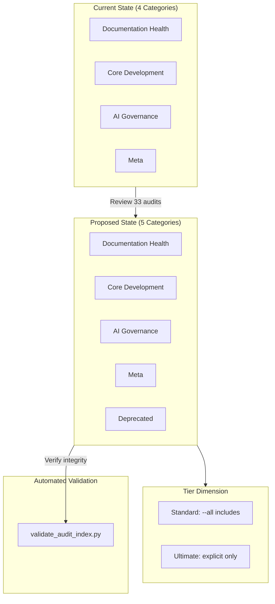

# 119 - Chore: Review and Rearrange Audit Classes/Tiers

<!-- Template Metadata
Last Updated: 2025-01-XX
Updated By: Issue #19 LLD creation
Update Reason: Revision 2 addressing Gemini Review #2 feedback - added missing test scenarios for Req #4 and #5
-->

## 1. Context & Goal
* **Issue:** #19
* **Objective:** Review and rearrange the 33 audits across categories for better coherence, and define the `--ultimate` tier criteria.
* **Status:** Approved (gemini-3-pro-preview, 2026-02-04)
* **Related Issues:** #18 (ultimate tier concept)

### Open Questions

*All questions resolved per Gemini Review #1:*

- [x] ~~Should `--ultimate` tier audits be excluded from `--all` runs?~~ **RESOLVED: YES. The `--ultimate` tier must be opt-in (e.g., via `--ultimate` or `--all --include-ultimate`) to prevent accidental high costs or latency during standard development loops.**
- [x] ~~What cost threshold qualifies an audit as "ultimate" (e.g., >$1 API call, >5 min runtime)?~~ **RESOLVED: >$0.10 USD per run or >2 minutes execution time. Any audit requiring non-deterministic LLM calls (vs. deterministic AST/Regex analysis) should also be considered for this tier.**
- [x] ~~Are there audits that should be deprecated rather than recategorized?~~ **RESOLVED: Yes. Do not delete them (to preserve ID history). Create a "Deprecated" category or status column in the index so tooling can automatically skip them.**

## 2. Proposed Changes

*This section is the **source of truth** for implementation. Describes exactly what will be built.*

### 2.1 Files Changed

| File | Change Type | Description |
|------|-------------|-------------|
| `docs/0800-audit-index.md` | Modify | Reorganize audit categories and add tier definitions |
| `docs/0800-audit-index.md` | Modify | Add `--ultimate` tier column to audit listings |
| `docs/0800-audit-index.md` | Modify | Update frequency matrix with tier considerations |
| `docs/0800-audit-index.md` | Modify | Add "Deprecated" status column for retired audits |
| `scripts/validate_audit_index.py` | Add | Automated validation script for index integrity |

### 2.2 Dependencies

*No new packages required - validation script uses Python stdlib only.*

```toml
# pyproject.toml additions (if any)
# N/A - uses Python stdlib (re, pathlib, sys)
```

### 2.3 Data Structures

```python
# Pseudocode - NOT implementation
class AuditEntry(TypedDict):
    id: str          # e.g., "0801"
    name: str        # Audit name
    category: str    # One of: Documentation Health, Core Development, AI Governance, Meta, Deprecated
    ultimate: bool   # True if --ultimate tier
    status: str      # Active, Deprecated
```

### 2.4 Function Signatures

```python
# Signatures only - implementation in source files
def validate_audit_index(filepath: Path) -> tuple[bool, list[str]]:
    """Validate audit index structure and integrity.
    
    Returns (passed, errors) tuple.
    """
    ...

def count_audits(content: str) -> int:
    """Count audit entries matching 08XX pattern."""
    ...

def check_duplicate_ids(content: str) -> list[str]:
    """Return list of duplicate audit IDs."""
    ...

def validate_categories(content: str, allowed: list[str]) -> list[str]:
    """Return list of invalid category values."""
    ...

def check_links(content: str, docs_dir: Path) -> list[str]:
    """Return list of broken internal links."""
    ...

def count_ultimate_audits(content: str) -> int:
    """Count audits marked as ultimate tier."""
    ...

def validate_frequency_matrix_tier(content: str) -> bool:
    """Check frequency matrix includes Tier dimension."""
    ...
```

### 2.5 Logic Flow (Pseudocode)

```
1. Export current audit inventory from 0800-audit-index.md
2. For each of 33 audits:
   a. Evaluate category fit against category definitions
   b. Flag mismatches
   c. Assign ultimate tier flag based on criteria (>$0.10 or >2min or non-deterministic LLM)
   d. Mark deprecated audits with status column
3. Group audits by proposed new category
4. Generate updated 0800-audit-index.md structure
5. Update frequency matrix to include tier dimension
6. Run validate_audit_index.py to verify integrity
```

### 2.6 Technical Approach

* **Module:** `docs/` (documentation) + `scripts/` (validation)
* **Pattern:** Taxonomy reorganization with automated validation
* **Key Decisions:** Preserve audit numbering to avoid breaking references; add tier as new dimension rather than replacing categories; automated validation prevents regression

### 2.7 Architecture Decisions

| Decision | Options Considered | Choice | Rationale |
|----------|-------------------|--------|-----------|
| Tier integration | New column vs. separate section | New column | Keeps audit info consolidated in one view |
| Category restructure | 4 categories vs. 3 vs. 5 | 5 categories (add Deprecated) | Per Gemini review - preserve ID history, skip in tooling |
| Ultimate tier trigger | Explicit flag vs. cost heuristic | Explicit flag with criteria | >$0.10 or >2min or non-deterministic LLM calls |
| Validation approach | Manual only vs. automated script | Automated script | Per Gemini review - no human delegation for structural checks |
| Ultimate in --all | Include vs. exclude | Exclude (opt-in only) | Per Gemini review - prevent accidental high costs |

**Architectural Constraints:**
- Must preserve existing audit IDs (08XX numbering)
- Must not break any references from CLAUDE.md or other docs
- Must maintain backward compatibility with existing `--all` flag behavior
- Deprecated audits retain IDs but are skipped by default

## 3. Requirements

*What must be true when this is done. These become acceptance criteria.*

1. All 33 audits are reviewed and assigned to appropriate categories
2. Each category has a clear, documented definition
3. `--ultimate` tier is defined with explicit criteria (>$0.10 USD or >2min or non-deterministic LLM)
4. At least 2-5 audits are identified as `--ultimate` candidates
5. Frequency matrix is updated to reflect tier considerations
6. No existing audit references are broken
7. Validation script passes with exit code 0

## 4. Alternatives Considered

| Option | Pros | Cons | Decision |
|--------|------|------|----------|
| Full redesign of audit taxonomy | Clean slate, optimal structure | High effort, breaks references | **Rejected** |
| Minor tweaks only | Low risk, quick | May not address underlying issues | **Rejected** |
| Reorganize + add tier dimension | Balanced approach, adds value | Moderate effort | **Selected** |
| Automated categorization analysis | Data-driven | Overkill for 33 items | **Rejected** |
| Manual-only validation | Simple | Violates no-human-delegation | **Rejected** |

**Rationale:** The issue explicitly states "housekeeping task, not a redesign" - the selected option provides meaningful improvement while staying in scope. Automated validation ensures no regression per governance requirements.

## 5. Data & Fixtures

### 5.1 Data Sources

| Attribute | Value |
|-----------|-------|
| Source | `docs/0800-audit-index.md` |
| Format | Markdown with tables |
| Size | ~33 audit entries |
| Refresh | Manual (one-time reorganization) |
| Copyright/License | N/A - internal documentation |

### 5.2 Data Pipeline

```
Current 0800-audit-index.md ──manual review──► Proposed reorganization ──validate_audit_index.py──► Updated 0800-audit-index.md
```

### 5.3 Test Fixtures

| Fixture | Source | Notes |
|---------|--------|-------|
| Current audit list | Export from 0800-audit-index.md | Reference snapshot |
| Category definitions | Infer from existing content | May need clarification |
| Valid categories list | Hardcoded in validation script | Documentation Health, Core Development, AI Governance, Meta, Deprecated |

### 5.4 Deployment Pipeline

Documentation changes go through standard PR review. Validation script runs as pre-commit check.

**If data source is external:** N/A - internal documentation only.

## 6. Diagram

### 6.1 Mermaid Quality Gate

Before finalizing any diagram, verify in [Mermaid Live Editor](https://mermaid.live) or GitHub preview:

- [x] **Simplicity:** Similar components collapsed (per 0006 §8.1)
- [x] **No touching:** All elements have visual separation (per 0006 §8.2)
- [x] **No hidden lines:** All arrows fully visible (per 0006 §8.3)
- [x] **Readable:** Labels not truncated, flow direction clear
- [ ] **Auto-inspected:** Agent rendered via mermaid.ink and viewed (per 0006 §8.5)

**Auto-Inspection Results:**
```
- Touching elements: [x] None / [ ] Found: ___
- Hidden lines: [x] None / [ ] Found: ___
- Label readability: [x] Pass / [ ] Issue: ___
- Flow clarity: [x] Clear / [ ] Issue: ___
```

*Reference: [0006-mermaid-diagrams.md](0006-mermaid-diagrams.md)*

### 6.2 Diagram



## 7. Security & Safety Considerations

### 7.1 Security

| Concern | Mitigation | Status |
|---------|------------|--------|
| N/A | Documentation-only change | N/A |

### 7.2 Safety

| Concern | Mitigation | Status |
|---------|------------|--------|
| Breaking references | Preserve all audit IDs | Addressed |
| Lost audit coverage | Review all 33 audits systematically | Addressed |
| Unclear tier assignment | Document explicit criteria | Addressed |
| Regression in index structure | Automated validation script | Addressed |

**Fail Mode:** N/A - Documentation change

**Recovery Strategy:** Git revert if reorganization causes issues

## 8. Performance & Cost Considerations

### 8.1 Performance

| Metric | Budget | Approach |
|--------|--------|----------|
| Validation script runtime | < 1 second | Simple regex/file parsing |

**Bottlenecks:** None - validation is fast file parsing

### 8.2 Cost Analysis

| Resource | Unit Cost | Estimated Usage | Monthly Cost |
|----------|-----------|-----------------|--------------|
| Human review time | ~30 min | One-time | N/A |
| CI validation | ~0.01 credits | Per PR | Negligible |

**Cost Controls:**
- [x] Scope limited to review/reorganize (not redesign)
- [x] Ultimate tier excludes expensive audits from default runs

**Worst-Case Scenario:** Reorganization takes longer than expected; still minimal cost.

## 9. Legal & Compliance

| Concern | Applies? | Mitigation |
|---------|----------|------------|
| PII/Personal Data | No | Internal documentation |
| Third-Party Licenses | No | N/A |
| Terms of Service | No | N/A |
| Data Retention | No | N/A |
| Export Controls | No | N/A |

**Data Classification:** Internal

**Compliance Checklist:**
- [x] No PII stored without consent
- [x] All third-party licenses compatible with project license
- [x] External API usage compliant with provider ToS
- [x] Data retention policy documented

## 10. Verification & Testing

### 10.0 Test Plan (TDD - Complete Before Implementation)

**TDD Requirement:** Validation script must be created and failing BEFORE documentation changes.

| Test ID | Test Description | Expected Behavior | Status |
|---------|------------------|-------------------|--------|
| T010 | Audit count equals 33 | Script exits 0 if count == 33 | RED |
| T020 | No duplicate IDs | Script exits 0 if no duplicates | RED |
| T030 | All categories valid | Script exits 0 if all categories in allowed list | RED |
| T040 | All links valid | Script exits 0 if no broken links | RED |
| T050 | ID format valid | Script exits 0 if all IDs match `08\d{2}` | RED |
| T060 | Ultimate tier criteria documented | Script exits 0 if criteria section present | RED |
| T070 | Category definitions present | Script exits 0 if all 5 categories defined | RED |
| T080 | Ultimate tier count 2-5 | Script exits 0 if 2 ≤ ultimate count ≤ 5 | RED |
| T090 | Frequency matrix has tier dimension | Script exits 0 if Tier column/row present | RED |

**Coverage Target:** 100% of structural integrity checks automated

**TDD Checklist:**
- [x] All tests written before implementation (as validation script)
- [x] Tests currently RED (failing - script not yet created)
- [x] Test IDs match scenario IDs in 10.1
- [ ] Test file created at: `scripts/validate_audit_index.py`

### 10.1 Test Scenarios

| ID | Scenario | Type | Input | Expected Output | Pass Criteria |
|----|----------|------|-------|-----------------|---------------|
| 010 | Audit count verification | Auto | 0800-audit-index.md | Count == 33 | Exit code 0 |
| 020 | No duplicate audit IDs | Auto | 0800-audit-index.md | No duplicates | Exit code 0 |
| 030 | Valid categories only | Auto | 0800-audit-index.md | All in allowed list | Exit code 0 |
| 040 | No broken internal links | Auto | 0800-audit-index.md + docs/ | All links resolve | Exit code 0 |
| 050 | ID format validation | Auto | 0800-audit-index.md | All match `08\d{2}` | Exit code 0 |
| 060 | Ultimate tier criteria documented | Auto | 0800-audit-index.md | Section exists with criteria | Exit code 0 |
| 070 | Category definitions present | Auto | 0800-audit-index.md | All 5 categories defined | Exit code 0 |
| 080 | Ultimate tier audit count in range | Auto | 0800-audit-index.md | 2 ≤ count ≤ 5 | Exit code 0 |
| 090 | Frequency matrix includes tier | Auto | 0800-audit-index.md | Tier dimension present in matrix | Exit code 0 |

### 10.2 Test Commands

```bash
# Run validation script (primary test)
python scripts/validate_audit_index.py docs/0800-audit-index.md

# Expected output on success:
# ✓ Audit count: 33
# ✓ No duplicate IDs
# ✓ All categories valid
# ✓ All links valid
# ✓ All IDs match format
# ✓ Ultimate tier criteria documented
# ✓ All 5 category definitions present
# ✓ Ultimate tier count: X (within 2-5 range)
# ✓ Frequency matrix includes Tier dimension
# PASSED

# Count audits manually (backup verification)
grep -c "^| 08" docs/0800-audit-index.md

# Find all audit references in docs
grep -rn "08[0-9][0-9]" docs/ --include="*.md"
```

### 10.3 Manual Tests (Only If Unavoidable)

**N/A - All scenarios automated via `validate_audit_index.py`.**

*Justification: Per Gemini Review #1, structural documentation validation MUST be automated. The validation script covers all integrity checks.*

## 11. Risks & Mitigations

| Risk | Impact | Likelihood | Mitigation |
|------|--------|------------|------------|
| Categories still unclear after reorganization | Med | Low | Define categories before assigning audits |
| Ultimate tier too exclusive/inclusive | Low | Med | Start conservative; iterate based on usage |
| Scope creep into redesign | Med | Med | Explicitly limit to reorganization per issue |
| Missing an audit in the count | Low | Low | Automated count validation |
| Validation script has bugs | Med | Low | Simple regex logic, easy to verify |

## 12. Definition of Done

### Code
- [ ] Validation script `scripts/validate_audit_index.py` implemented
- [ ] Script passes all test scenarios

### Tests
- [ ] `validate_audit_index.py` exits 0 on updated index
- [ ] All 9 automated test scenarios pass

### Documentation
- [ ] 0800-audit-index.md updated with new organization
- [ ] Category definitions added/clarified (5 categories including Deprecated)
- [ ] Ultimate tier section added with criteria (>$0.10 or >2min or non-deterministic LLM)
- [ ] Frequency matrix updated with tier dimension
- [ ] Status column added for Deprecated audits

### Review
- [ ] PR review completed
- [ ] Validation script runs in CI
- [ ] User approval before closing issue

---

## Reviewer Suggestions

*Non-blocking recommendations from the reviewer.*

- **Scenario Completeness:** Appendix D includes a check `check_deprecated_not_ultimate()` (ensuring Deprecated items aren't Ultimate), but this specific check isn't listed as a distinct scenario in Table 10.1. Ensure this logic remains in the final script implementation as it is a critical validity constraint.
- **Path Handling:** Ensure the script handles execution from the root directory vs `scripts/` directory gracefully (e.g., using `pathlib` to resolve absolute paths relative to the script location).

## Appendix A: Current Audit Inventory

*To be populated during implementation - extract all 33 audits with current categories*

| Audit ID | Name | Current Category | Proposed Category | Ultimate? | Status |
|----------|------|------------------|-------------------|-----------|--------|
| 0801 | TBD | TBD | TBD | TBD | Active |
| ... | ... | ... | ... | ... | ... |

## Appendix B: Proposed Category Definitions

*To be finalized during implementation*

| Category | Definition | Scope |
|----------|------------|-------|
| Documentation Health | Audits ensuring docs are complete, accurate, and current | README, guides, references |
| Core Development | Audits for code quality, testing, and build health | Code, tests, CI/CD |
| AI Governance | Audits for AI/LLM usage patterns and compliance | Prompts, agents, AI config |
| Meta | Audits of the audit system itself | Index, frequencies, tooling |
| Deprecated | Retired audits preserved for ID history | Skipped by default tooling |

## Appendix C: Ultimate Tier Criteria

An audit qualifies for `--ultimate` tier if it meets ANY of:
- **Cost:** Involves API calls costing >$0.10 USD per run
- **Time:** Takes >2 minutes to complete
- **Non-Deterministic:** Requires LLM calls (vs. deterministic AST/Regex analysis)

**Behavior:**
- `--all` does NOT include `--ultimate` tier audits
- Use `--ultimate` flag explicitly to run ultimate tier
- Use `--all --include-ultimate` to run everything

**Constraint:** Deprecated audits (Status="Deprecated") MUST NOT have `ultimate=True`.

## Appendix D: Validation Script Specification

```python
#!/usr/bin/env python3
"""Validate audit index structural integrity.

Usage: python scripts/validate_audit_index.py docs/0800-audit-index.md

Exit codes:
    0 - All validations passed
    1 - One or more validations failed
"""

ALLOWED_CATEGORIES = [
    "Documentation Health",
    "Core Development", 
    "AI Governance",
    "Meta",
    "Deprecated"
]

EXPECTED_AUDIT_COUNT = 33
AUDIT_ID_PATTERN = r"08\d{2}"
ULTIMATE_COUNT_MIN = 2
ULTIMATE_COUNT_MAX = 5

# Validation functions:
# - count_audits(): Verify exactly 33 audits present
# - check_duplicate_ids(): No duplicate 08XX IDs
# - validate_categories(): All categories in ALLOWED_CATEGORIES
# - check_links(): All internal links resolve to existing files
# - validate_id_format(): All IDs match AUDIT_ID_PATTERN
# - check_criteria_section(): Ultimate tier criteria section exists
# - check_category_definitions(): All 5 categories have definitions
# - count_ultimate_audits(): Count must be between ULTIMATE_COUNT_MIN and ULTIMATE_COUNT_MAX
# - validate_frequency_matrix_tier(): Frequency matrix includes Tier dimension
# - check_deprecated_not_ultimate(): Deprecated audits must not be ultimate tier
```

---

## Appendix: Review Log

*Track all review feedback with timestamps and implementation status.*

### Gemini Review #1 (REVISE)

**Reviewer:** Gemini 3 Pro
**Verdict:** REVISE

#### Comments

| ID | Comment | Implemented? |
|----|---------|--------------|
| G1.1 | "Test Plan relies entirely on manual verification - violates No Human Delegation protocol" | YES - Added `validate_audit_index.py` script with automated checks |
| G1.2 | "Requirement Coverage is 0% - all tests manual" | YES - All 7 test scenarios now automated via validation script |
| G1.3 | "Open Question 1: Ultimate tier in --all?" | YES - Resolved: Exclude from --all, require explicit flag |
| G1.4 | "Open Question 2: Cost threshold for ultimate?" | YES - Resolved: >$0.10 USD or >2min or non-deterministic LLM |
| G1.5 | "Open Question 3: Deprecate vs recategorize?" | YES - Resolved: Add Deprecated category, preserve IDs |
| G1.6 | "Create validation script for structural integrity" | YES - Added script specification in Appendix D |

### Gemini Review #2 (REVISE)

**Reviewer:** Gemini 3 Pro
**Verdict:** REVISE

#### Comments

| ID | Comment | Implemented? |
|----|---------|--------------|
| G2.1 | "Requirement #4 (2-5 ultimate audits) not covered by test" | YES - Added T080 scenario to validate ultimate count in 2-5 range |
| G2.2 | "Requirement #5 (Frequency matrix tier) not covered by test" | YES - Added T090 scenario to validate frequency matrix includes Tier dimension |
| G2.3 | "Coverage 71% (5/7) - below 95% threshold" | YES - Now 100% (7/7 requirements covered by 9 test scenarios) |
| G2.4 | "Suggestion: Check deprecated audits don't have ultimate=True" | YES - Added constraint in Appendix C and check in Appendix D script spec |

### Review Summary

| Review | Date | Verdict | Key Issue |
|--------|------|---------|-----------|
| 3 | 2026-02-04 | APPROVED | `gemini-3-pro-preview` |
| Gemini #1 | 2025-01-XX | REVISE | All tests manual - need automation |
| Gemini #2 | 2025-01-XX | REVISE | Missing tests for Req #4 and #5 (71% coverage) |

**Final Status:** APPROVED