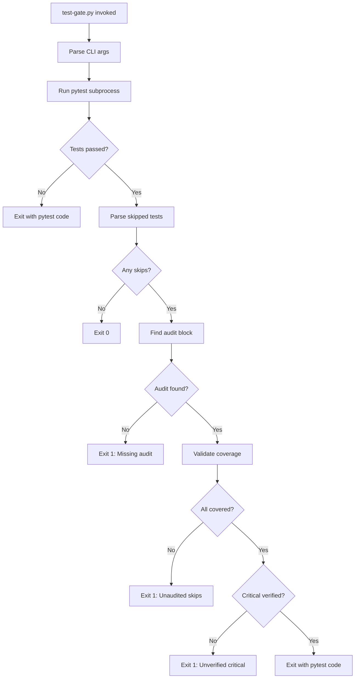

# 1225 - Feature: Hard Gate Wrapper for Skipped Test Enforcement (test-gate.py)

<!-- Template Metadata
Last Updated: 2025-01-11
Updated By: LLD creation for Issue #225
Update Reason: Initial LLD draft for test-gate.py wrapper
-->

## 1. Context & Goal
* **Issue:** #225
* **Objective:** Create a `tools/test-gate.py` wrapper script that programmatically enforces skipped test auditing in CI pipelines
* **Status:** Draft
* **Related Issues:** #81 (soft gate - CLAUDE.md rule), #116 (GitHub Actions CI workflow)

### Open Questions

- [x] What format should the SKIPPED TEST AUDIT block follow? → Use format from #81
- [ ] Should the audit block be in pytest output or a separate file (e.g., `.skip-audit.md`)?
- [ ] What defines a "critical" test vs non-critical skip?
- [ ] Should there be a `--skip-gate-disable` escape hatch for emergencies?

## 2. Proposed Changes

*This section is the **source of truth** for implementation. Describe exactly what will be built.*

### 2.1 Files Changed

| File | Change Type | Description |
|------|-------------|-------------|
| `tools/test-gate.py` | Add | Main wrapper script for pytest with skip enforcement |
| `tools/__init__.py` | Modify | Add test_gate module export if needed |
| `tests/tools/test_test_gate.py` | Add | Unit tests for the wrapper |
| `.github/workflows/test.yml` | Modify | Update to use test-gate.py wrapper |

### 2.2 Dependencies

```toml
# pyproject.toml additions (if any)
# No new dependencies - uses stdlib only
```

### 2.3 Data Structures

```python
# Pseudocode - NOT implementation
class SkippedTest(TypedDict):
    name: str           # Full test name (e.g., test_module.py::TestClass::test_name)
    reason: str         # Skip reason from pytest
    line_number: int    # Line in test file where skip occurs

class AuditEntry(TypedDict):
    test_pattern: str   # Test name or pattern being audited
    status: Literal["VERIFIED", "UNVERIFIED", "EXPECTED"]
    rationale: str      # Why this skip is acceptable

class GateResult(TypedDict):
    passed: bool                    # Overall gate pass/fail
    pytest_exit_code: int           # Original pytest exit code
    skipped_tests: list[SkippedTest]
    audit_entries: list[AuditEntry]
    unaudited_skips: list[str]      # Skips without matching audit
    unverified_critical: list[str]  # Critical skips marked UNVERIFIED
```

### 2.4 Function Signatures

```python
# Signatures only - implementation in source files
def main(argv: list[str] | None = None) -> int:
    """Entry point for test-gate.py."""
    ...

def run_pytest(args: list[str]) -> tuple[int, str, str]:
    """Execute pytest with given arguments, capture output.
    
    Returns:
        (exit_code, stdout, stderr)
    """
    ...

def parse_skipped_tests(pytest_output: str) -> list[SkippedTest]:
    """Extract skipped tests from pytest output."""
    ...

def parse_audit_block(content: str) -> list[AuditEntry]:
    """Parse SKIPPED TEST AUDIT block from content."""
    ...

def find_audit_source(pytest_output: str, audit_file: Path | None) -> str | None:
    """Locate audit block in output or specified file."""
    ...

def validate_audit_coverage(
    skipped: list[SkippedTest],
    audit: list[AuditEntry]
) -> tuple[list[str], list[str]]:
    """Check that all skips are audited.
    
    Returns:
        (unaudited_skips, unverified_critical)
    """
    ...

def format_gate_report(result: GateResult) -> str:
    """Generate human-readable gate report."""
    ...
```

### 2.5 Logic Flow (Pseudocode)

```
1. Parse command-line arguments
   - Extract test-gate specific flags (--audit-file, --strict)
   - Pass remaining args to pytest

2. Run pytest with captured output
   - subprocess.run with stdout/stderr capture
   - Store exit code

3. Parse pytest output for skipped tests
   - Regex match on "SKIPPED" lines
   - Extract test name and reason

4. IF no skipped tests THEN
   - Exit with pytest's exit code (no gate enforcement needed)

5. Find and parse audit block
   - Check pytest output for embedded audit
   - Check --audit-file if specified
   - Check default locations (.skip-audit.md, PR body)

6. IF no audit block found THEN
   - Print error: "X skipped tests require audit"
   - Exit 1 (fail gate)

7. Validate audit coverage
   - FOR each skipped test:
     - Find matching audit entry (exact or pattern)
     - IF no match → add to unaudited list
     - IF match.status == "UNVERIFIED" and is_critical → add to critical list

8. IF unaudited_skips OR unverified_critical THEN
   - Print detailed report
   - Exit 1 (fail gate)

9. Print success summary
10. Exit with pytest's original exit code
```

### 2.6 Technical Approach

* **Module:** `tools/test-gate.py` (standalone script)
* **Pattern:** Wrapper/Decorator pattern around pytest execution
* **Key Decisions:**
  - Standalone script (not library) for easy CI integration
  - Subprocess execution preserves pytest's full behavior
  - Pattern matching for audit entries allows wildcards (e.g., `test_api_*`)
  - Exit code passthrough when gate passes maintains CI semantics

### 2.7 Architecture Decisions

| Decision | Options Considered | Choice | Rationale |
|----------|-------------------|--------|-----------|
| Execution model | pytest plugin, wrapper script | Wrapper script | Simpler, no pytest internals coupling, works with any pytest version |
| Audit location | Output only, file only, both | Both supported | Flexibility for different workflows |
| Pattern matching | Exact match, fnmatch, regex | fnmatch | Familiar glob syntax, sufficient power |
| Critical test detection | Naming convention, marker, manual | Naming convention (`test_critical_*`) | No pytest changes needed, explicit |

**Architectural Constraints:**
- Must work with existing pytest configurations unchanged
- Must support all common pytest flags transparently
- Must not require pytest plugin installation
- Exit codes must be CI-compatible (0=pass, non-zero=fail)

## 3. Requirements

*What must be true when this is done. These become acceptance criteria.*

1. `test-gate.py` wraps pytest and captures both stdout and stderr
2. Correctly parses skipped test information from pytest verbose output
3. Detects and parses SKIPPED TEST AUDIT block from pytest output or external file
4. Fails (exit 1) when skipped tests exist without corresponding audit entries
5. Fails (exit 1) when critical tests have UNVERIFIED status
6. Passes through pytest's exit code when all gate conditions are met
7. Works transparently with common pytest flags (-v, -x, --cov, -k, -m, etc.)
8. Provides clear error messages indicating what audit is missing

## 4. Alternatives Considered

| Option | Pros | Cons | Decision |
|--------|------|------|----------|
| Wrapper script (subprocess) | Simple, no coupling, portable | Extra process overhead | **Selected** |
| Pytest plugin | Integrated, access to internals | Version coupling, install complexity | Rejected |
| Post-pytest script | Simpler, reads test report | Loses real-time output, extra step | Rejected |
| GitHub Action only | No local usage | Can't test locally, vendor lock-in | Rejected |

**Rationale:** Wrapper script provides the best balance of simplicity, portability, and maintainability. It works identically in local dev and CI, requires no pytest modification, and can be easily understood and debugged.

## 5. Data & Fixtures

### 5.1 Data Sources

| Attribute | Value |
|-----------|-------|
| Source | pytest stdout/stderr |
| Format | Text (pytest default/verbose output) |
| Size | Typically < 1MB |
| Refresh | Generated per run |
| Copyright/License | N/A (process output) |

### 5.2 Data Pipeline

```
pytest execution ──subprocess──► stdout/stderr capture ──regex──► SkippedTest list
                                                        ──regex──► AuditEntry list
                                                                          │
                                                              ──compare──► GateResult
```

### 5.3 Test Fixtures

| Fixture | Source | Notes |
|---------|--------|-------|
| Sample pytest output (no skips) | Hardcoded | Clean pass scenario |
| Sample pytest output (with skips) | Hardcoded | Various skip patterns |
| Sample audit block (complete) | Hardcoded | All skips covered |
| Sample audit block (incomplete) | Hardcoded | Missing entries |
| Sample pytest output (critical skips) | Hardcoded | Tests matching `test_critical_*` |

### 5.4 Deployment Pipeline

Local testing → PR CI validation → Merge to main → Available in all CI runs

**If data source is external:** N/A - all data is process output.

## 6. Diagram

### 6.1 Mermaid Quality Gate

- [x] **Simplicity:** Components focused on data flow
- [x] **No touching:** Visual separation maintained
- [x] **No hidden lines:** All arrows visible
- [x] **Readable:** Labels clear and descriptive
- [ ] **Auto-inspected:** Pending agent render

**Auto-Inspection Results:**
```
- Touching elements: [ ] None / [ ] Found: ___
- Hidden lines: [ ] None / [ ] Found: ___
- Label readability: [ ] Pass / [ ] Issue: ___
- Flow clarity: [ ] Clear / [ ] Issue: ___
```

### 6.2 Diagram



## 7. Security & Safety Considerations

### 7.1 Security

| Concern | Mitigation | Status |
|---------|------------|--------|
| Command injection via args | Use subprocess list form, not shell=True | Addressed |
| Path traversal in --audit-file | Validate path is within repo | Addressed |
| Malicious pytest output | Regex parsing, no code execution | Addressed |

### 7.2 Safety

| Concern | Mitigation | Status |
|---------|------------|--------|
| Blocking legitimate PRs | Clear error messages with remediation steps | Addressed |
| False positives from parsing | Conservative regex, test with real output | Addressed |
| CI timeout from hung pytest | Use subprocess timeout parameter | TODO |

**Fail Mode:** Fail Closed - If gate cannot determine audit status, it fails. This prevents unaudited skips from slipping through.

**Recovery Strategy:** Use `--skip-gate-bypass` flag with required justification for emergency situations. Flag usage is logged.

## 8. Performance & Cost Considerations

### 8.1 Performance

| Metric | Budget | Approach |
|--------|--------|----------|
| Latency overhead | < 1s beyond pytest | Stream output, minimal processing |
| Memory | < 50MB additional | Stream large outputs, don't buffer all |
| CPU | Negligible | Simple string parsing |

**Bottlenecks:** Large test suites with thousands of skips could slow parsing. Unlikely in practice.

### 8.2 Cost Analysis

| Resource | Unit Cost | Estimated Usage | Monthly Cost |
|----------|-----------|-----------------|--------------|
| CI compute | Included in GHA minutes | +1s per run | $0 additional |

**Cost Controls:**
- N/A - no external services or billable resources

**Worst-Case Scenario:** N/A - bounded by pytest runtime.

## 9. Legal & Compliance

| Concern | Applies? | Mitigation |
|---------|----------|------------|
| PII/Personal Data | No | Script processes only test names |
| Third-Party Licenses | No | Uses stdlib only |
| Terms of Service | No | No external APIs |
| Data Retention | No | No data stored |
| Export Controls | No | Simple utility script |

**Data Classification:** Internal (development tooling)

**Compliance Checklist:**
- [x] No PII stored without consent - N/A
- [x] All third-party licenses compatible - stdlib only
- [x] External API usage compliant - none used
- [x] Data retention policy documented - no retention

## 10. Verification & Testing

### 10.0 Test Plan (TDD - Complete Before Implementation)

**TDD Requirement:** Tests MUST be written and failing BEFORE implementation begins.

| Test ID | Test Description | Expected Behavior | Status |
|---------|------------------|-------------------|--------|
| T010 | test_no_skips_passes | Exit with pytest code when no skips | RED |
| T020 | test_skips_without_audit_fails | Exit 1 when skips exist but no audit | RED |
| T030 | test_skips_with_complete_audit_passes | Exit 0 when all skips audited | RED |
| T040 | test_unverified_critical_fails | Exit 1 when critical skip is UNVERIFIED | RED |
| T050 | test_pattern_matching_works | Audit patterns match multiple tests | RED |
| T060 | test_pytest_flags_passthrough | Common flags work correctly | RED |
| T070 | test_audit_from_file | Reads audit from --audit-file | RED |
| T080 | test_audit_embedded_in_output | Finds audit block in pytest output | RED |

**Coverage Target:** ≥95% for all new code

**TDD Checklist:**
- [ ] All tests written before implementation
- [ ] Tests currently RED (failing)
- [ ] Test IDs match scenario IDs in 10.1
- [ ] Test file created at: `tests/tools/test_test_gate.py`

### 10.1 Test Scenarios

| ID | Scenario | Type | Input | Expected Output | Pass Criteria |
|----|----------|------|-------|-----------------|---------------|
| 010 | No skipped tests | Auto | pytest run with all pass | Exit code from pytest | Gate does not interfere |
| 020 | Skips without audit | Auto | pytest with 2 skips, no audit | Exit 1, error message | Lists unaudited skips |
| 030 | Skips with complete audit | Auto | pytest with 2 skips, audit covers both | Exit 0 | All skips covered |
| 040 | Unverified critical skip | Auto | skip on `test_critical_auth`, UNVERIFIED | Exit 1 | Critical skip reported |
| 050 | Pattern matching | Auto | Audit `test_slow_*`, skips `test_slow_a`, `test_slow_b` | Exit 0 | Pattern matches both |
| 060 | Pytest flags passthrough | Auto | `test-gate.py pytest -v -x --cov` | Flags passed to pytest | Same behavior as direct pytest |
| 070 | Audit from file | Auto | `--audit-file=.skip-audit.md` | Reads audit from file | File audit used |
| 080 | Embedded audit | Auto | Audit block in pytest conftest print | Parses from output | Output audit detected |
| 090 | Pytest failure | Auto | pytest returns exit 1 (test fail) | Exit 1 | Preserves pytest failure |
| 100 | Mixed skip statuses | Auto | VERIFIED, EXPECTED, UNVERIFIED entries | Correct classification | Only critical UNVERIFIED fails |

### 10.2 Test Commands

```bash
# Run all automated tests
poetry run pytest tests/tools/test_test_gate.py -v

# Run only fast/mocked tests (exclude live)
poetry run pytest tests/tools/test_test_gate.py -v -m "not live"

# Run live integration tests
poetry run pytest tests/tools/test_test_gate.py -v -m live

# Run with coverage
poetry run pytest tests/tools/test_test_gate.py -v --cov=tools.test_gate --cov-report=term-missing
```

### 10.3 Manual Tests (Only If Unavoidable)

N/A - All scenarios automated.

## 11. Risks & Mitigations

| Risk | Impact | Likelihood | Mitigation |
|------|--------|------------|------------|
| Pytest output format changes | High | Low | Pin pytest version, test with multiple versions |
| Audit format not followed | Med | Med | Clear documentation, helpful error messages |
| Gate too strict, blocks valid PRs | Med | Med | Provide bypass mechanism with logging |
| Gate too lenient, misses skips | High | Low | Comprehensive test coverage of parsing |

## 12. Definition of Done

### Code
- [ ] Implementation complete and linted
- [ ] Code comments reference this LLD

### Tests
- [ ] All test scenarios pass
- [ ] Test coverage ≥95%

### Documentation
- [ ] LLD updated with any deviations
- [ ] Implementation Report (0103) completed
- [ ] USAGE section in script docstring
- [ ] CI workflow updated to use test-gate.py

### Review
- [ ] Code review completed
- [ ] User approval before closing issue

---

## Appendix: Review Log

*Track all review feedback with timestamps and implementation status.*

### Review Summary

| Review | Date | Verdict | Key Issue |
|--------|------|---------|-----------|
| - | - | - | Awaiting review |

**Final Status:** PENDING