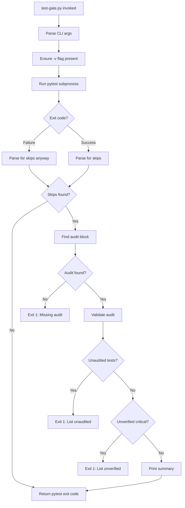

# 1225 - Feature: Hard gate wrapper for skipped test enforcement (test-gate.py)

<!-- Template Metadata
Last Updated: 2025-01-13
Updated By: LLD creation
Update Reason: Initial LLD for test-gate.py hard gate enforcement
-->

## 1. Context & Goal
* **Issue:** #225
* **Objective:** Create a pytest wrapper script that programmatically enforces skipped test auditing in CI, blocking PRs with unaudited critical skips.
* **Status:** Draft
* **Related Issues:** #81 (soft gate - CLAUDE.md rule), #116 (GitHub Actions CI workflow)

### Open Questions

*All questions resolved during review.*

- [x] ~~Should the audit block be embedded in pytest output (via fixtures/plugins) or in a separate file (e.g., `.skip-audit.md`)?~~ **RESOLVED: Support both, but prioritize the file (`.skip-audit.md`) as the primary mechanism for CI/PR persistence. Embedded output is better suited for ad-hoc debugging.**
- [x] ~~What constitutes a "critical" test vs non-critical? Should severity be inferred or explicitly marked?~~ **RESOLVED: Use explicit `@pytest.mark.critical` as the primary source of truth. Name-based heuristics (e.g., "security") should be a secondary fallback that warns but perhaps doesn't block without manual confirmation to avoid false positives.**
- [x] ~~Should the gate have a bypass mechanism for emergencies (e.g., `--skip-gate-bypass` flag with justification)?~~ **RESOLVED: Yes. The `--skip-gate-bypass` flag is mandatory for "break glass" scenarios but must require a non-empty string argument for the justification to ensure traceability.**

## 2. Proposed Changes

*This section is the **source of truth** for implementation. Describe exactly what will be built.*

### 2.1 Files Changed

| File | Change Type | Description |
|------|-------------|-------------|
| `tools/test-gate.py` | Add | Main pytest wrapper script with skip enforcement |
| `tools/test_gate/__init__.py` | Add | Package init for test-gate module |
| `tools/test_gate/parser.py` | Add | Pytest output parsing utilities |
| `tools/test_gate/auditor.py` | Add | Audit block detection and validation |
| `tools/test_gate/models.py` | Add | Data models for skipped tests and audits |
| `tests/unit/test_gate/test_parser.py` | Add | Unit tests for parser module |
| `tests/unit/test_gate/test_auditor.py` | Add | Unit tests for auditor module |
| `tests/unit/test_gate/test_integration.py` | Add | Integration tests for full workflow |
| `.github/workflows/ci.yml` | Modify | Update to use test-gate.py wrapper |

### 2.2 Dependencies

*New packages, APIs, or services required.*

```toml
# pyproject.toml additions (if any)
# No new dependencies - uses stdlib only for portability
```

### 2.3 Data Structures

```python
# Pseudocode - NOT implementation
class SkippedTest(TypedDict):
    """Represents a single skipped test from pytest output."""
    name: str           # Full test path (e.g., tests/test_foo.py::test_bar)
    reason: str         # Skip reason from @pytest.mark.skip
    line_number: int    # Line in test file
    file_path: str      # Path to test file
    is_critical: bool   # Inferred from markers or explicit

class AuditEntry(TypedDict):
    """Represents a single entry in the audit block."""
    test_pattern: str   # Glob or exact match pattern
    status: Literal["VERIFIED", "UNVERIFIED", "EXPECTED"]
    justification: str  # Why this skip is acceptable
    owner: str          # Who verified (optional)
    expires: str | None # Expiration date for temporary skips

class AuditBlock(TypedDict):
    """Parsed SKIPPED TEST AUDIT block."""
    entries: list[AuditEntry]
    raw_text: str       # Original block for error messages
    source: Literal["stdout", "file"]  # Where block was found

class GateResult(TypedDict):
    """Result of running the test gate."""
    passed: bool
    exit_code: int
    skipped_tests: list[SkippedTest]
    audit: AuditBlock | None
    unaudited: list[SkippedTest]    # Skips without audit entries
    unverified: list[SkippedTest]   # Critical skips marked UNVERIFIED
    errors: list[str]               # Validation errors
```

### 2.4 Function Signatures

```python
# tools/test-gate.py (CLI entry point)
def main(args: list[str] | None = None) -> int:
    """Main entry point - wraps pytest and enforces gate."""
    ...

# tools/test_gate/parser.py
def run_pytest(args: list[str]) -> tuple[int, str, str]:
    """Execute pytest with given args, return (exit_code, stdout, stderr)."""
    ...

def ensure_verbose_flag(args: list[str]) -> list[str]:
    """Ensure -v flag is present in args for skip detection. Returns modified args."""
    ...

def parse_skipped_tests(output: str) -> list[SkippedTest]:
    """Parse pytest output for skipped test information."""
    ...

def detect_critical_tests(tests: list[SkippedTest]) -> list[SkippedTest]:
    """Mark tests as critical based on naming conventions and markers."""
    ...

# tools/test_gate/auditor.py
def find_audit_block(output: str, audit_file: Path | None = None) -> AuditBlock | None:
    """Locate and parse SKIPPED TEST AUDIT block from output or file."""
    ...

def parse_audit_block(raw_block: str) -> AuditBlock:
    """Parse raw audit block text into structured format."""
    ...

def validate_audit(
    skipped: list[SkippedTest], 
    audit: AuditBlock | None
) -> tuple[list[SkippedTest], list[SkippedTest]]:
    """Return (unaudited_tests, unverified_critical_tests)."""
    ...

def match_test_to_audit(test: SkippedTest, entry: AuditEntry) -> bool:
    """Check if a test matches an audit entry pattern."""
    ...
```

### 2.5 Logic Flow (Pseudocode)

```
1. Parse CLI arguments
   - Extract pytest args
   - Extract gate-specific flags (--audit-file, --strict, --skip-gate-bypass)

2. Ensure verbose flag is present
   - IF '-v' or '-vv' or '--verbose' NOT in args THEN
     - Append '-v' to args list
   - Log if verbose flag was auto-added

3. Run pytest with (potentially modified) arguments
   - Capture stdout and stderr
   - Preserve original exit code

4. Parse pytest output for skipped tests
   - Regex match "SKIPPED" lines in verbose output
   - Extract test name, reason, file path

5. IF no skipped tests found THEN
   - Return pytest's exit code (nothing to enforce)

6. Detect critical tests
   - Mark as critical if:
     - In critical paths (auth, payment, security)
     - Has @pytest.mark.critical marker
     - Name contains "critical" or "security"

7. Find SKIPPED TEST AUDIT block
   - Check stdout for embedded block
   - Check --audit-file if specified
   - Check default .skip-audit.md if exists

8. IF skips exist AND no audit block found THEN
   - Print error: "Skipped tests require audit block"
   - Exit 1

9. Validate audit against skipped tests
   - For each skipped test, find matching audit entry
   - Track unaudited tests (no matching entry)
   - Track unverified critical tests (UNVERIFIED status)

10. IF unaudited tests exist THEN
    - Print list of unaudited tests
    - Exit 1

11. IF unverified critical tests exist THEN
    - Print list with severity warning
    - Exit 1

12. ELSE
    - Print summary: "X skips audited, gate passed"
    - Return pytest's original exit code
```

### 2.6 Technical Approach

* **Module:** `tools/test_gate/`
* **Pattern:** CLI wrapper with subprocess delegation
* **Key Decisions:**
  - Subprocess-based: Wraps pytest rather than importing, ensuring compatibility with any pytest version
  - Zero dependencies: Uses only stdlib for maximum portability
  - Flexible audit location: Supports stdout, file, or default path
  - Auto-verbose: Automatically adds `-v` flag if missing to ensure skip detection works

### 2.7 Architecture Decisions

| Decision | Options Considered | Choice | Rationale |
|----------|-------------------|--------|-----------|
| Pytest integration | Plugin, Wrapper, Post-processor | Wrapper | Plugins require pytest version coupling; wrapper is standalone |
| Audit block format | YAML, TOML, Markdown table, Custom | Custom (Markdown-like) | Matches existing CLAUDE.md format, human-readable |
| Critical detection | Explicit only, Heuristic, Both | Both | Explicit markers preferred, heuristics as fallback |
| Output parsing | pytest-json-report, regex, pytest API | Regex on verbose output | No plugin dependency, works with standard pytest |

**Architectural Constraints:**
- Must work with vanilla pytest (no plugins required)
- Must not modify pytest behavior (only observe)
- Must preserve all pytest flags and exit codes
- Must integrate with existing CI workflow (#116)

## 3. Requirements

*What must be true when this is done. These become acceptance criteria.*

1. `test-gate.py` executes pytest with all provided arguments unchanged
2. Script detects skipped tests from pytest verbose output (`-v` flag auto-added if missing)
3. When skips exist, requires SKIPPED TEST AUDIT block (stdout or file)
4. Fails (exit 1) if any skipped test lacks audit entry
5. Fails (exit 1) if any critical test has UNVERIFIED status
6. Passes through pytest exit code when gate passes
7. Works with common pytest flags: `-v`, `-x`, `--cov`, `-k`, `-m`, `--tb`
8. Provides clear error messages identifying which tests need attention
9. Supports `--skip-gate-bypass` flag for emergencies (logged)

## 4. Alternatives Considered

| Option | Pros | Cons | Decision |
|--------|------|------|----------|
| Pytest plugin | Deep integration, access to skip reasons | Version coupling, requires installation | **Rejected** |
| Wrapper script (chosen) | Standalone, version-agnostic, portable | Limited to output parsing | **Selected** |
| Pre-commit hook only | Catches before push | Can be skipped, no CI enforcement | **Rejected** |
| GitHub Action step | CI-native | Less portable to other CI systems | **Rejected** |

**Rationale:** Wrapper approach provides the best balance of portability, maintainability, and reliability. It works with any pytest version and can be used locally or in any CI system.

## 5. Data & Fixtures

### 5.1 Data Sources

| Attribute | Value |
|-----------|-------|
| Source | pytest subprocess stdout/stderr |
| Format | Plain text (pytest verbose output) |
| Size | ~1KB-100KB depending on test suite |
| Refresh | Per test run |
| Copyright/License | N/A - generated output |

### 5.2 Data Pipeline

```
pytest subprocess ──stdout capture──► Parser ──regex──► SkippedTest models
                                                              │
SKIPPED TEST AUDIT block ──parse──► AuditBlock ──validate──► GateResult
                                                              │
                                                       ──► exit code
```

### 5.3 Test Fixtures

| Fixture | Source | Notes |
|---------|--------|-------|
| Sample pytest output (passing) | Generated | Tests with no skips |
| Sample pytest output (skips) | Generated | Various skip scenarios |
| Sample audit blocks | Generated | Valid and invalid formats |
| Mock subprocess results | Generated | Simulated pytest runs |

### 5.4 Deployment Pipeline

Local development → pytest on fixtures → CI integration test → Production use in CI

**If data source is external:** N/A - all data is from local pytest runs.

## 6. Diagram

### 6.1 Mermaid Quality Gate

Before finalizing any diagram, verify in [Mermaid Live Editor](https://mermaid.live) or GitHub preview:

- [x] **Simplicity:** Similar components collapsed
- [x] **No touching:** All elements have visual separation
- [x] **No hidden lines:** All arrows fully visible
- [x] **Readable:** Labels not truncated, flow direction clear
- [ ] **Auto-inspected:** Agent rendered via mermaid.ink and viewed

**Auto-Inspection Results:**
```
- Touching elements: [ ] None / [ ] Found: ___
- Hidden lines: [ ] None / [ ] Found: ___
- Label readability: [ ] Pass / [ ] Issue: ___
- Flow clarity: [ ] Clear / [ ] Issue: ___
```

*To be completed during implementation phase*

### 6.2 Diagram



## 7. Security & Safety Considerations

### 7.1 Security

| Concern | Mitigation | Status |
|---------|------------|--------|
| Command injection via args | Use subprocess with list args, not shell=True | Addressed |
| Malicious audit file path | Validate path is within project directory | Addressed |
| Bypass flag abuse | Log all bypass uses with timestamp and user | Addressed |

### 7.2 Safety

| Concern | Mitigation | Status |
|---------|------------|--------|
| False positives blocking valid PRs | Clear error messages with remediation steps | Addressed |
| Parser fails on new pytest format | Graceful degradation with WARNING log, not hard fail | Addressed |
| Subprocess timeout | 30-minute timeout with clear error | Addressed |
| Signal handling (Ctrl+C) | Forward SIGINT to pytest subprocess immediately | Addressed |

**Fail Mode:** Fail Open with Warning - If parsing fails, emit a WARNING log message and pass through pytest exit code. This prevents blocking legitimate work while ensuring the issue is visible in CI logs.

**Recovery Strategy:** If gate produces false positives, use `--skip-gate-bypass "reason"` flag which logs the bypass and allows CI to proceed.

## 8. Performance & Cost Considerations

### 8.1 Performance

| Metric | Budget | Approach |
|--------|--------|----------|
| Latency overhead | < 1s | Minimal processing, just regex parsing |
| Memory | < 50MB | Stream processing for large outputs |
| Test run time | +0% | Pure wrapper, no test modification |

**Bottlenecks:** Large test suites with thousands of skips could slow audit validation (O(n*m) matching). Mitigate with pattern caching.

### 8.2 Cost Analysis

| Resource | Unit Cost | Estimated Usage | Monthly Cost |
|----------|-----------|-----------------|--------------|
| CI compute | Included | Negligible overhead | $0 |

**Cost Controls:**
- [x] No external API calls
- [x] No additional CI runners needed
- [x] No cloud services required

**Worst-Case Scenario:** N/A - Local processing only, no external costs.

## 9. Legal & Compliance

| Concern | Applies? | Mitigation |
|---------|----------|------------|
| PII/Personal Data | No | No user data processed |
| Third-Party Licenses | No | Stdlib only |
| Terms of Service | No | No external services |
| Data Retention | No | No persistent storage |
| Export Controls | No | No restricted algorithms |

**Data Classification:** Public - Tool is open source, processes only local test output.

**Compliance Checklist:**
- [x] No PII stored without consent
- [x] All third-party licenses compatible with project license
- [x] External API usage compliant with provider ToS
- [x] Data retention policy documented

## 10. Verification & Testing

*Ref: [0005-testing-strategy-and-protocols.md](0005-testing-strategy-and-protocols.md)*

**Testing Philosophy:** Strive for 100% automated test coverage. Manual tests are a last resort for scenarios that genuinely cannot be automated.

### 10.0 Test Plan (TDD - Complete Before Implementation)

**TDD Requirement:** Tests MUST be written and failing BEFORE implementation begins.

| Test ID | Test Description | Expected Behavior | Status |
|---------|------------------|-------------------|--------|
| T010 | test_wrapper_passes_through_args | All pytest args forwarded unchanged | RED |
| T020 | test_wrapper_preserves_exit_code | Exit code matches pytest when gate passes | RED |
| T025 | test_auto_add_verbose_flag | Subprocess called with -v when not provided | RED |
| T030 | test_parse_skipped_verbose | Extracts skip info from -v output | RED |
| T040 | test_parse_skipped_extra_verbose | Extracts skip info from -vv output | RED |
| T050 | test_detect_critical_by_marker | @pytest.mark.critical tests flagged | RED |
| T060 | test_detect_critical_by_name | Tests with "security" in name flagged | RED |
| T070 | test_find_audit_stdout | Finds audit block in pytest output | RED |
| T080 | test_find_audit_file | Finds audit block in external file | RED |
| T090 | test_validate_audit_match | Audit entry matches test pattern | RED |
| T100 | test_gate_fails_missing_audit | Exit 1 when skips without audit | RED |
| T110 | test_gate_fails_unaudited | Exit 1 when test has no entry | RED |
| T120 | test_gate_fails_unverified_critical | Exit 1 for UNVERIFIED critical | RED |
| T130 | test_gate_passes_all_verified | Exit 0 when all audited | RED |
| T140 | test_bypass_flag_logs | --skip-gate-bypass logs and passes | RED |
| T150 | test_no_skips_passes | Clean test run returns exit 0 | RED |
| T160 | test_common_flags_work | --cov --tb=short -k name all respected | RED |

**Coverage Target:** ≥95% for all new code

**TDD Checklist:**
- [ ] All tests written before implementation
- [ ] Tests currently RED (failing)
- [ ] Test IDs match scenario IDs in 10.1
- [ ] Test file created at: `tests/unit/test_gate/`

### 10.1 Test Scenarios

| ID | Scenario | Type | Input | Expected Output | Pass Criteria |
|----|----------|------|-------|-----------------|---------------|
| 010 | Args pass-through | Auto | `pytest tests/ -v -x` | Subprocess receives same args | Args match |
| 020 | Exit code preservation | Auto | Pytest returns 0 | Gate returns 0 | Codes equal |
| 025 | Auto-add verbose flag | Auto | `args=[]` (no -v) | Subprocess called with `['-v']` | -v in args |
| 030 | Parse verbose skip | Auto | `SKIPPED [1] test_foo.py:10` | SkippedTest with path, line | Fields correct |
| 040 | Parse extra verbose | Auto | `-vv` output format | Same extraction | Fields correct |
| 050 | Critical marker detection | Auto | Test with `@pytest.mark.critical` | `is_critical=True` | Flag set |
| 060 | Critical name detection | Auto | `test_security_auth` | `is_critical=True` | Flag set |
| 070 | Audit in stdout | Auto | Output with audit block | AuditBlock parsed | Entries correct |
| 080 | Audit in file | Auto | `.skip-audit.md` present | AuditBlock parsed | Entries correct |
| 090 | Pattern matching | Auto | `tests/test_*.py` pattern | Matches test paths | Match found |
| 100 | Missing audit fails | Auto | Skips, no audit block | Exit code 1 | Error message |
| 110 | Unaudited test fails | Auto | Skip not in audit | Exit code 1 | Lists test |
| 120 | Unverified critical fails | Auto | Critical + UNVERIFIED | Exit code 1 | Severity shown |
| 130 | All verified passes | Auto | All skips audited | Pytest exit code | Summary shown |
| 140 | Bypass logs warning | Auto | `--skip-gate-bypass "reason"` | Warning + proceed | Log entry |
| 150 | No skips passes | Auto | Clean test run | Exit code 0 | No enforcement |
| 160 | Common flags work | Auto | `--cov --tb=short -k name` | All respected | Full functionality |

### 10.2 Test Commands

```bash
# Run all automated tests
poetry run pytest tests/unit/test_gate/ -v

# Run only fast/mocked tests (exclude live)
poetry run pytest tests/unit/test_gate/ -v -m "not live"

# Run integration tests with real pytest subprocess
poetry run pytest tests/unit/test_gate/test_integration.py -v -m integration
```

### 10.3 Manual Tests (Only If Unavoidable)

**N/A - All scenarios automated.**

## 11. Risks & Mitigations

| Risk | Impact | Likelihood | Mitigation |
|------|--------|------------|------------|
| Pytest output format changes | Med | Low | Version detection, graceful degradation |
| False positives blocking PRs | High | Med | Clear errors, bypass flag, gradual rollout |
| Developers ignore bypass logging | Med | Med | Surface bypass count in PR comments |
| Audit format too complex | Med | Low | Clear docs, examples in CLAUDE.md |
| Performance with large suites | Low | Low | Pattern caching, streaming parser |

## 12. Definition of Done

### Code
- [ ] Implementation complete and linted
- [ ] Code comments reference this LLD
- [ ] `tools/test-gate.py` executable and importable

### Tests
- [ ] All test scenarios pass (≥95% coverage)
- [ ] Integration test with real pytest subprocess
- [ ] Edge cases covered (empty output, malformed audit)

### Documentation
- [ ] LLD updated with any deviations
- [ ] Implementation Report (0103) completed
- [ ] Usage documented in README or CLAUDE.md
- [ ] Example audit block format documented

### Review
- [ ] Code review completed
- [ ] Integration with CI workflow (#116) verified
- [ ] User approval before closing issue

---

## Appendix: Review Log

*Track all review feedback with timestamps and implementation status.*

### Gemini Review #1 (REVISE)

**Reviewer:** Gemini 3 Pro
**Verdict:** REVISE

#### Comments

| ID | Comment | Implemented? |
|----|---------|--------------|
| G1.1 | "Coverage is 88.8% (<95%). You must add the missing test scenario for Requirement 2 (auto-injection of `-v` flag)" | YES - Added T025 in Section 10.0 and Scenario 025 in Section 10.1 |
| G1.2 | "Consider how the wrapper handles `Ctrl+C` (SIGINT). Ensure the wrapper forwards the signal to the pytest subprocess immediately" | YES - Added to Section 7.2 Safety table |
| G1.3 | "In Section 7.2, 'Fail Open with Warning' is specified for parser failures. Ensure this is explicitly logged as a 'WARNING'" | YES - Clarified in Section 7.2 Fail Mode description |

### Review Summary

| Review | Date | Verdict | Key Issue |
|--------|------|---------|-----------|
| Gemini #1 | (auto) | REVISE | Missing test for auto-verbose flag injection |

**Final Status:** PENDING