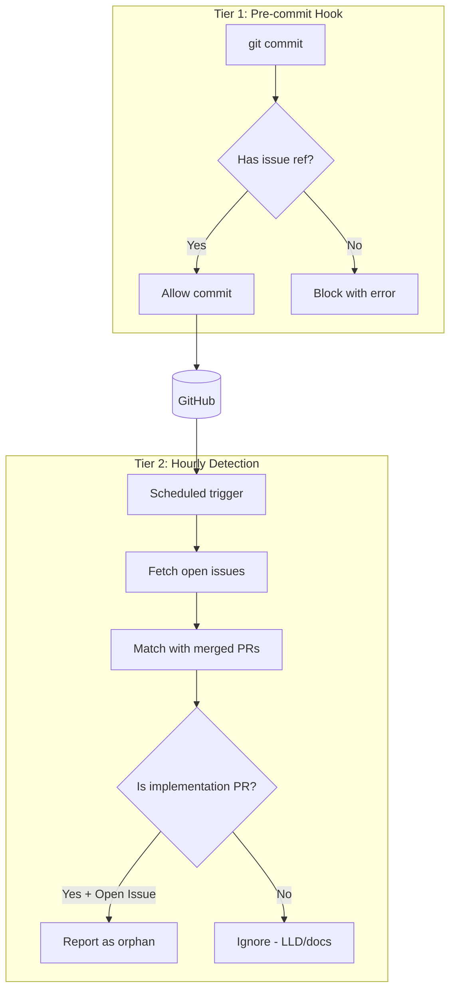

# 1247 - Feature: Two-tier Commit Validation with Hourly Orphan Issue Detection

<!-- Template Metadata
Last Updated: 2025-01-09
Updated By: LLD creation for Issue #247
Update Reason: Initial LLD draft
-->

## 1. Context & Goal
* **Issue:** #247
* **Objective:** Implement a two-tier commit validation system that blocks orphaned commits (Tier 1) and detects orphaned issues where implementation PRs merged without closing the issue (Tier 2).
* **Status:** Draft
* **Related Issues:** N/A

### Open Questions
*Questions that need clarification before or during implementation. Remove when resolved.*

- [ ] Should the orphan detection report go to Slack, GitHub Issues, or both?
- [ ] What is the threshold for "implementation PR" - just file extensions or also minimum lines changed?
- [ ] Should we create auto-fix functionality that closes orphan issues automatically or just report them?

## 2. Proposed Changes

*This section is the **source of truth** for implementation. Describe exactly what will be built.*

### 2.1 Files Changed

| File | Change Type | Description |
|------|-------------|-------------|
| `.githooks/commit-msg` | Add | Tier 1 pre-commit hook for issue reference validation |
| `tools/orphan_issue_detector.py` | Add | Tier 2 detection script for orphaned issues |
| `.github/workflows/orphan-detection.yml` | Add | GitHub Actions workflow for hourly orphan detection |
| `tools/setup_hooks.sh` | Add | Helper script to install git hooks |
| `pyproject.toml` | Modify | Add PyGithub dependency for API access |

### 2.2 Dependencies

*New packages, APIs, or services required.*

```toml
# pyproject.toml additions
PyGithub = "^2.1.0"
```

### 2.3 Data Structures

```python
# Pseudocode - NOT implementation
class OrphanIssue(TypedDict):
    issue_number: int        # GitHub issue number
    issue_title: str         # Issue title for report
    merged_pr_number: int    # PR that should have closed it
    merged_pr_title: str     # PR title for context
    merged_at: datetime      # When PR was merged
    detection_reason: str    # Why we think this is orphaned

class DetectionReport(TypedDict):
    generated_at: datetime    # Report generation timestamp
    repo: str                 # Repository name
    orphan_count: int         # Total orphans found
    orphans: list[OrphanIssue]  # List of detected orphans
```

### 2.4 Function Signatures

```python
# Signatures only - implementation in source files

# .githooks/commit-msg (shell script converted to pseudo-Python)
def validate_commit_message(commit_msg: str) -> bool:
    """Validate commit references an issue. Exit 1 if invalid."""
    ...

# tools/orphan_issue_detector.py
def is_implementation_pr(pr: PullRequest) -> bool:
    """Determine if PR is implementation (not just docs/LLD)."""
    ...

def find_merged_prs_for_issue(repo: Repository, issue_number: int) -> list[PullRequest]:
    """Find all merged PRs that reference a specific issue."""
    ...

def detect_orphan_issues(repo: Repository) -> list[OrphanIssue]:
    """Main detection function. Returns list of orphaned issues."""
    ...

def generate_report(orphans: list[OrphanIssue], output_format: str) -> str:
    """Generate report in specified format (markdown, json)."""
    ...

def main() -> None:
    """CLI entry point for orphan detection."""
    ...
```

### 2.5 Logic Flow (Pseudocode)

**Tier 1: Pre-commit Hook**
```
1. Receive commit message from git
2. Extract message content
3. Search for issue reference patterns:
   - "Ref #N" OR "ref #N"
   - "fixes #N" OR "Fixes #N"
   - "closes #N" OR "Closes #N"
   - "resolves #N" OR "Resolves #N"
4. IF no pattern found THEN
   - Print error message with guidance
   - Exit with code 1 (block commit)
5. ELSE
   - Exit with code 0 (allow commit)
```

**Tier 2: Orphan Detection**
```
1. Authenticate to GitHub API
2. Fetch all open issues for repository
3. FOR each open issue:
   a. Search merged PRs for issue reference in title/body
   b. FOR each merged PR referencing this issue:
      - IF is_implementation_pr(pr) THEN
        - Add to orphan list with detection reason
4. Generate report from orphan list
5. IF orphans found THEN
   - Output report (stdout for Actions)
   - Exit with code 1 (signal findings)
6. ELSE
   - Output "No orphans found"
   - Exit with code 0
```

**is_implementation_pr Heuristics**
```
1. Get list of files changed in PR
2. Check file extensions:
   - IF any file ends in .py, .ts, .js, .tsx, .jsx THEN
     - Mark as code change
3. Check PR title prefix:
   - IF starts with "fix:" or "feat:" THEN
     - Mark as implementation intent
   - IF starts with "docs:" or "chore:" THEN
     - Mark as non-implementation
4. Check branch name:
   - IF contains issue number (e.g., "247-" or "/247-") THEN
     - Increase implementation likelihood
5. RETURN true IF code_change AND implementation_intent
```

### 2.6 Technical Approach

* **Module:** `tools/orphan_issue_detector.py`
* **Pattern:** Script with CLI interface, stateless detection
* **Key Decisions:** 
  - Use shell script for git hook (no Python dependency in git hook path)
  - Use PyGithub for API access (well-maintained, type hints available)
  - Hourly schedule balances freshness vs. API quota consumption

### 2.7 Architecture Decisions

| Decision | Options Considered | Choice | Rationale |
|----------|-------------------|--------|-----------|
| Hook language | Python, Shell, Node | Shell | Git hooks should be fast, no runtime dependencies, portable |
| API library | PyGithub, httpx + raw API, gh CLI | PyGithub | Type hints, pagination handling, well-documented |
| Detection frequency | On-push, Hourly, Daily | Hourly | Balances timeliness with API rate limits |
| Report output | Slack, GitHub Issue, Stdout | Stdout + GitHub summary | Simplest, integrates with Actions, no secrets needed for Slack |

**Architectural Constraints:**
- Must work with existing GitHub Actions infrastructure
- Cannot require additional secrets beyond GITHUB_TOKEN (auto-provided)
- Pre-commit hook must work offline (no API calls)

## 3. Requirements

*What must be true when this is done. These become acceptance criteria.*

1. Pre-commit hook rejects commits without issue reference (`Ref #N`, `fixes #N`, `closes #N`, `resolves #N`)
2. Pre-commit hook accepts valid commits with any supported reference format (case-insensitive)
3. Pre-commit hook provides clear error message explaining required format
4. Orphan detector identifies open issues with merged implementation PRs
5. Orphan detector distinguishes implementation PRs from documentation/LLD PRs
6. Orphan detector runs hourly via GitHub Actions
7. Orphan detector outputs machine-readable report (JSON) and human-readable summary (Markdown)
8. Setup script installs git hook correctly on dev machines

## 4. Alternatives Considered

| Option | Pros | Cons | Decision |
|--------|------|------|----------|
| Single-tier strict validation (always require `fixes #N`) | Simple, catches everything | Blocks legitimate `Ref #N` use for LLDs | **Rejected** |
| Two-tier with hourly detection | Flexible, catches intent mismatches | Delayed detection (up to 1 hour) | **Selected** |
| Real-time PR webhook validation | Immediate detection | Complex setup, requires webhook endpoint | **Rejected** |
| Daily batch detection | Lower API usage | Too slow to be useful | **Rejected** |

**Rationale:** The two-tier approach allows legitimate workflows (LLD with `Ref`, implementation with `fixes`) while still catching orphaned issues within an hour of merge.

## 5. Data & Fixtures

### 5.1 Data Sources

| Attribute | Value |
|-----------|-------|
| Source | GitHub API v3 (REST) |
| Format | JSON API responses |
| Size | ~50-200 issues, ~100-500 PRs typical |
| Refresh | Real-time API calls per detection run |
| Copyright/License | N/A - repository metadata |

### 5.2 Data Pipeline

```
GitHub API ──list_issues──► Open Issues List ──filter──► Candidate Issues
                                    │
GitHub API ──search_prs──► Merged PRs ──match──► Issue-PR Pairs
                                    │
                          ──heuristics──► Orphan Classification
                                    │
                          ──format──► Report (JSON/Markdown)
```

### 5.3 Test Fixtures

| Fixture | Source | Notes |
|---------|--------|-------|
| Mock GitHub Issue objects | Generated | Simulate open issues with various states |
| Mock PR objects | Generated | Simulate merged PRs with different file types |
| Sample commit messages | Hardcoded | Test valid/invalid patterns |

### 5.4 Deployment Pipeline

- **Dev:** Run `tools/setup_hooks.sh` to install local git hook
- **CI:** GitHub Actions workflow runs orphan detector hourly
- **Production:** Same as CI (no separate environment)

**External data source:** GitHub API - no separate utility needed.

## 6. Diagram

### 6.1 Mermaid Quality Gate

- [x] **Simplicity:** Components represent distinct system elements
- [x] **No touching:** All elements have visual separation
- [x] **No hidden lines:** All arrows fully visible
- [x] **Readable:** Labels clear, flow direction obvious
- [ ] **Auto-inspected:** Agent rendered via mermaid.ink and viewed

**Auto-Inspection Results:**
```
- Touching elements: [ ] None / [ ] Found: ___
- Hidden lines: [ ] None / [ ] Found: ___
- Label readability: [ ] Pass / [ ] Issue: ___
- Flow clarity: [ ] Clear / [ ] Issue: ___
```

### 6.2 Diagram



## 7. Security & Safety Considerations

### 7.1 Security

| Concern | Mitigation | Status |
|---------|------------|--------|
| GitHub token exposure | Use GITHUB_TOKEN auto-provided by Actions, never log | Addressed |
| Injection in commit message parsing | Use regex matching, no shell interpretation | Addressed |
| API rate limiting abuse | Hourly schedule stays well under limits | Addressed |

### 7.2 Safety

| Concern | Mitigation | Status |
|---------|------------|--------|
| False positive blocking commits | Clear error message, easy to add reference | Addressed |
| False positive orphan detection | Report-only, no auto-close, human reviews | Addressed |
| API failures crash detector | Catch exceptions, report partial results | Addressed |

**Fail Mode:** Fail Open - If detection fails, report error but don't block anything. Commits continue; orphans wait for next run.

**Recovery Strategy:** If hourly run fails, next hour's run will catch the same orphans. No persistent state to corrupt.

## 8. Performance & Cost Considerations

### 8.1 Performance

| Metric | Budget | Approach |
|--------|--------|----------|
| Hook latency | < 50ms | Pure regex, no API calls, no file I/O |
| Detection runtime | < 5 min | Batched API calls, pagination |
| Memory | < 256MB | Stream processing, no full repo clone |

**Bottlenecks:** Large repos with many open issues may hit pagination limits. Addressed with proper cursor handling.

### 8.2 Cost Analysis

| Resource | Unit Cost | Estimated Usage | Monthly Cost |
|----------|-----------|-----------------|--------------|
| GitHub Actions minutes | Free (public) / $0.008/min (private) | 24 runs/day × 2 min = 48 min/day | $0 - $12 |
| GitHub API calls | Free up to 5000/hour | ~50-100 calls/run | $0 |

**Cost Controls:**
- [x] Hourly schedule limits maximum runs
- [x] No external paid services required
- [x] Uses free GITHUB_TOKEN, no PAT needed

**Worst-Case Scenario:** Even at 100x usage (every 36 seconds), would hit API rate limits before costs become significant.

## 9. Legal & Compliance

| Concern | Applies? | Mitigation |
|---------|----------|------------|
| PII/Personal Data | No | Only accesses issue numbers and PR metadata |
| Third-Party Licenses | Yes | PyGithub is LGPL-3.0, compatible with project |
| Terms of Service | Yes | GitHub API usage well within acceptable use |
| Data Retention | No | No data stored, computed fresh each run |
| Export Controls | No | No restricted algorithms |

**Data Classification:** Public (issue/PR metadata is already public)

**Compliance Checklist:**
- [x] No PII stored without consent
- [x] All third-party licenses compatible with project license
- [x] External API usage compliant with provider ToS
- [x] Data retention policy documented (N/A - no retention)

## 10. Verification & Testing

### 10.0 Test Plan (TDD - Complete Before Implementation)

**TDD Requirement:** Tests MUST be written and failing BEFORE implementation begins.

| Test ID | Test Description | Expected Behavior | Status |
|---------|------------------|-------------------|--------|
| T010 | Hook accepts `Ref #123` | Exit code 0 | RED |
| T020 | Hook accepts `fixes #456` | Exit code 0 | RED |
| T030 | Hook rejects no reference | Exit code 1, error message | RED |
| T040 | Detector finds orphan with merged impl PR | OrphanIssue in result | RED |
| T050 | Detector ignores LLD-only PR | No OrphanIssue | RED |
| T060 | is_implementation_pr detects .py files | Returns True | RED |
| T070 | is_implementation_pr rejects .md only | Returns False | RED |

**Coverage Target:** ≥95% for all new code

**TDD Checklist:**
- [ ] All tests written before implementation
- [ ] Tests currently RED (failing)
- [ ] Test IDs match scenario IDs in 10.1
- [ ] Test file created at: `tests/unit/test_commit_validation.py`, `tests/unit/test_orphan_detector.py`

### 10.1 Test Scenarios

| ID | Scenario | Type | Input | Expected Output | Pass Criteria |
|----|----------|------|-------|-----------------|---------------|
| 010 | Hook accepts Ref #N | Auto | `"feat: Add widget Ref #247"` | Exit 0 | Commit allowed |
| 020 | Hook accepts fixes #N | Auto | `"fix: bug fixes #100"` | Exit 0 | Commit allowed |
| 030 | Hook accepts closes #N | Auto | `"feat: done closes #50"` | Exit 0 | Commit allowed |
| 040 | Hook accepts case variants | Auto | `"FIXES #1"`, `"ReF #2"` | Exit 0 | Case insensitive match |
| 050 | Hook rejects no reference | Auto | `"feat: Add widget"` | Exit 1 | Error message shown |
| 060 | Hook rejects malformed reference | Auto | `"feat: #123"` (no keyword) | Exit 1 | Requires Ref/fixes/closes |
| 070 | Detector finds orphan | Auto | Open issue, merged impl PR | 1 orphan in report | Correct issue/PR linked |
| 080 | Detector ignores docs PR | Auto | Open issue, merged docs PR | 0 orphans | LLD not flagged |
| 090 | Detector handles no issues | Auto | No open issues | 0 orphans | Clean exit |
| 100 | is_impl_pr true for .py | Auto | PR with src/main.py | True | Code file detected |
| 110 | is_impl_pr false for .md only | Auto | PR with docs/lld.md | False | Docs excluded |
| 120 | is_impl_pr true for fix: prefix | Auto | PR titled "fix: bug" | True | Intent detected |
| 130 | is_impl_pr false for docs: prefix | Auto | PR titled "docs: update" | False | Docs excluded |

### 10.2 Test Commands

```bash
# Run all automated tests
poetry run pytest tests/unit/test_commit_validation.py tests/unit/test_orphan_detector.py -v

# Run only fast/mocked tests (exclude live)
poetry run pytest tests/unit/ -v -m "not live"

# Run live integration tests (requires GITHUB_TOKEN)
poetry run pytest tests/unit/ -v -m live

# Test the git hook directly
echo "feat: no reference" | .githooks/commit-msg && echo "FAIL" || echo "PASS"
echo "feat: with Ref #247" | .githooks/commit-msg && echo "PASS" || echo "FAIL"
```

### 10.3 Manual Tests (Only If Unavoidable)

**N/A - All scenarios automated.** The git hook can be tested via shell, and the detector uses mocked GitHub API responses.

## 11. Risks & Mitigations

| Risk | Impact | Likelihood | Mitigation |
|------|--------|------------|------------|
| Developers bypass hook with `--no-verify` | Low | Medium | Document policy, trust developers, Tier 2 catches issues |
| False positives annoy developers | Medium | Low | Clear error messages, easy to add reference |
| API rate limits hit during detection | Medium | Low | Hourly schedule, pagination, early exit |
| Heuristics misclassify PR type | Low | Medium | Report-only (no auto-action), human reviews |
| Hook not installed on new dev machines | Low | Medium | Add to onboarding docs, setup script in repo |

## 12. Definition of Done

### Code
- [ ] Implementation complete and linted
- [ ] Code comments reference this LLD

### Tests
- [ ] All test scenarios pass
- [ ] Test coverage meets threshold (≥95%)

### Documentation
- [ ] LLD updated with any deviations
- [ ] Implementation Report (0103) completed
- [ ] README updated with hook installation instructions

### Review
- [ ] Code review completed
- [ ] User approval before closing issue

---

## Appendix: Review Log

*Track all review feedback with timestamps and implementation status.*

### Review Summary

| Review | Date | Verdict | Key Issue |
|--------|------|---------|-----------|
| - | - | - | Awaiting initial review |

**Final Status:** PENDING