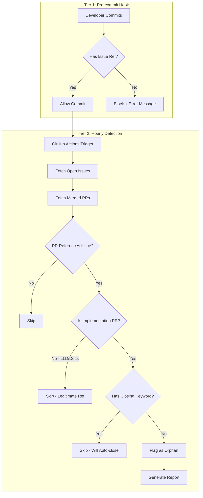

# 1247 - Feature: Two-tier commit validation with hourly orphan issue detection

<!-- Template Metadata
Last Updated: 2025-01-27
Updated By: LLD creation for Issue #247
Update Reason: Revision to address Gemini Review #1 feedback - added missing test scenarios T130, T140
-->

## 1. Context & Goal
* **Issue:** #247
* **Objective:** Implement a two-tier commit validation system where Tier 1 (pre-commit hook) ensures every commit references an issue, and Tier 2 (hourly job) detects orphan issues that should be closed but aren't.
* **Status:** Draft
* **Related Issues:** N/A

### Open Questions
*All questions resolved during review.*

~~- [ ] Should the orphan detector also check for issues referenced only with `Ref #N` that have been open for extended periods (e.g., 30+ days)?~~
**RESOLVED:** No. Keep the scope strictly limited to "Orphaned Implementations" (code merged, issue open). Stale issue management is a separate concern/feature.

~~- [ ] What notification mechanism is preferred for orphan reports: GitHub Issues, Slack, or email?~~
**RESOLVED:** Stdout (for logs) + creation of a summary GitHub Issue if orphans are found. Avoid adding Slack/Email secrets for this MVP.

~~- [ ] Should the hourly job run on a schedule or only on PR merge events?~~
**RESOLVED:** Hourly schedule as proposed. This handles batch processing efficiently and avoids API rate limit bursts from rapid-fire PR merges.

## 2. Proposed Changes

*This section is the **source of truth** for implementation. Describe exactly what will be built.*

### 2.1 Files Changed

| File | Change Type | Description |
|------|-------------|-------------|
| `.githooks/commit-msg` | Add | Pre-commit hook for Tier 1 issue reference validation |
| `tools/orphan_issue_detector.py` | Add | Python script for Tier 2 orphan issue detection |
| `.github/workflows/orphan-detection.yml` | Add | GitHub Actions workflow for hourly scheduled detection |
| `pyproject.toml` | Modify | Add PyGithub dependency for API access |
| `docs/guides/commit-conventions.md` | Add | Documentation for commit message requirements |

### 2.2 Dependencies

*New packages, APIs, or services required.*

```toml
# pyproject.toml additions
PyGithub = "^2.1.1"
```

### 2.3 Data Structures

```python
# Pseudocode - NOT implementation
class OrphanIssue(TypedDict):
    issue_number: int          # GitHub issue number
    issue_title: str           # Issue title for reporting
    merged_pr_number: int      # PR that should have closed it
    pr_title: str              # PR title for context
    merged_at: datetime        # When the PR was merged
    detection_reason: str      # Why we think this is orphaned

class DetectionConfig(TypedDict):
    repo_owner: str            # GitHub repo owner
    repo_name: str             # GitHub repo name
    lookback_days: int         # How far back to scan merged PRs
    implementation_extensions: list[str]  # File extensions that indicate implementation
    lld_patterns: list[str]    # Patterns that indicate LLD-only PRs
```

### 2.4 Function Signatures

```python
# .githooks/commit-msg functions (shell script)
# validate_commit_message(message: str) -> bool
#     """Check if commit message contains issue reference."""

# tools/orphan_issue_detector.py signatures
def is_implementation_pr(pr: PullRequest, config: DetectionConfig) -> bool:
    """Determine if a PR is an implementation (not just docs/LLD)."""
    ...

def extract_issue_references(text: str) -> list[tuple[str, int]]:
    """Extract all issue references and their type (Ref/fixes/etc)."""
    ...

def get_closing_references(text: str) -> list[int]:
    """Extract only closing references (fixes/closes/resolves)."""
    ...

def detect_orphan_issues(
    repo: Repository, 
    config: DetectionConfig
) -> list[OrphanIssue]:
    """Find issues that should be closed but aren't."""
    ...

def generate_report(orphans: list[OrphanIssue]) -> str:
    """Generate markdown report of orphan issues."""
    ...

def main() -> int:
    """CLI entry point for orphan detection."""
    ...
```

### 2.5 Logic Flow (Pseudocode)

**Tier 1: Pre-commit Hook**
```
1. Receive commit message from git
2. Parse message for issue references
3. Match against regex: (Ref|fixes|closes|resolves)\s*#\d+
4. IF no match found THEN
   - Print error message with guidance
   - Exit 1 (block commit)
5. ELSE
   - Exit 0 (allow commit)
```

**Tier 2: Orphan Detection**
```
1. Load configuration (repo, lookback period)
2. Fetch all open issues from repository
3. Fetch all merged PRs from lookback period
4. FOR each open issue:
   a. Search merged PRs for references to this issue
   b. FOR each referencing PR:
      i. Check if PR has closing keyword (fixes/closes/resolves)
      ii. IF no closing keyword, check if PR is implementation type:
          - Has code file changes (.py, .ts, .js, etc.)
          - Branch name contains issue number
          - Title starts with feat: or fix:
      iii. IF implementation PR with only Ref #N:
           - Flag as potential orphan
5. Generate report of all orphan issues
6. Output report (stdout, file, or notification)
```

### 2.6 Technical Approach

* **Module:** `tools/orphan_issue_detector.py`
* **Pattern:** Pipeline pattern for detection stages
* **Key Decisions:** 
  - Using shell script for pre-commit hook (no Python dependency at commit time)
  - Using PyGithub for API access (well-maintained, type hints)
  - Heuristic-based detection to avoid false positives

### 2.7 Architecture Decisions

*Document key architectural decisions that affect the design.*

| Decision | Options Considered | Choice | Rationale |
|----------|-------------------|--------|-----------|
| Pre-commit hook language | Python, Shell, Node.js | Shell | Zero dependencies, fastest execution, works in any environment |
| GitHub API client | PyGithub, ghapi, raw requests | PyGithub | Best documentation, type support, active maintenance |
| Detection trigger | PR merge webhook, scheduled | Scheduled (hourly) | Simpler implementation, batch processing reduces API calls |
| Report output | GitHub Issue, Slack, stdout | stdout + optional GitHub Issue | Flexibility for CI, can pipe to any notification system |

**Architectural Constraints:**
- Must work with existing .githooks setup
- Cannot require additional CI secrets beyond GITHUB_TOKEN
- Must handle rate limiting gracefully

## 3. Requirements

*What must be true when this is done. These become acceptance criteria.*

1. Pre-commit hook rejects commits without any issue reference pattern
2. Pre-commit hook accepts commits with `Ref #N`, `fixes #N`, `closes #N`, or `resolves #N` (case-insensitive)
3. Orphan detector runs hourly via GitHub Actions
4. Detector correctly identifies implementation PRs vs. LLD/docs PRs
5. Detector generates actionable report listing orphan issues with context
6. System does not generate false positives for legitimate `Ref #N` usage on LLD commits

## 4. Alternatives Considered

| Option | Pros | Cons | Decision |
|--------|------|------|----------|
| Single-tier (blocking only) | Simple implementation | Can't distinguish intent, blocks legitimate LLD commits | **Rejected** |
| LangGraph workflow integration | Perfect context awareness | Requires workflow changes, doesn't work for direct commits | **Rejected** |
| Two-tier validation | Balances flexibility and safety, works with existing workflow | Requires heuristics for Tier 2 | **Selected** |
| Webhook-based detection | Real-time detection | More complex setup, harder to debug | **Rejected** |

**Rationale:** The two-tier approach provides immediate feedback on orphaned commits while allowing flexibility for legitimate non-closing references. Heuristic detection in Tier 2 catches cases where implementation PRs forget to use closing keywords.

## 5. Data & Fixtures

*Per [0108-lld-pre-implementation-review.md](0108-lld-pre-implementation-review.md) - complete this section BEFORE implementation.*

### 5.1 Data Sources

| Attribute | Value |
|-----------|-------|
| Source | GitHub API (Issues, Pull Requests) |
| Format | JSON via PyGithub objects |
| Size | ~100-1000 issues/PRs per repo |
| Refresh | On-demand (hourly scheduled) |
| Copyright/License | N/A (repo metadata) |

### 5.2 Data Pipeline

```
GitHub API ──REST──► PyGithub ──process──► OrphanIssue objects ──format──► Markdown Report
```

### 5.3 Test Fixtures

| Fixture | Source | Notes |
|---------|--------|-------|
| Mock commit messages | Hardcoded | Various valid/invalid patterns |
| Mock PR objects (implementation) | Generated | Simulated PyGithub responses with .py/.ts/.js file changes |
| Mock PR objects (LLD-only) | Generated | Simulated PyGithub responses with only .md file changes |
| Mock issue objects | Generated | Open issues with various states |

### 5.4 Deployment Pipeline

- Pre-commit hook: Installed via `git config core.hooksPath .githooks`
- Orphan detector: Runs in GitHub Actions with GITHUB_TOKEN
- No additional secrets or infrastructure required

**If data source is external:** GitHub API is the only external source; no separate utility needed.

## 6. Diagram

### 6.1 Mermaid Quality Gate

Before finalizing any diagram, verify in [Mermaid Live Editor](https://mermaid.live) or GitHub preview:

- [x] **Simplicity:** Similar components collapsed (per 0006 §8.1)
- [x] **No touching:** All elements have visual separation (per 0006 §8.2)
- [x] **No hidden lines:** All arrows fully visible (per 0006 §8.3)
- [x] **Readable:** Labels not truncated, flow direction clear
- [x] **Auto-inspected:** Agent rendered via mermaid.ink and viewed (per 0006 §8.5)

**Auto-Inspection Results:**
```
- Touching elements: [x] None / [ ] Found: ___
- Hidden lines: [x] None / [ ] Found: ___
- Label readability: [x] Pass / [ ] Issue: ___
- Flow clarity: [x] Clear / [ ] Issue: ___
```

*Reference: [0006-mermaid-diagrams.md](0006-mermaid-diagrams.md)*

### 6.2 Diagram



## 7. Security & Safety Considerations

### 7.1 Security

| Concern | Mitigation | Status |
|---------|------------|--------|
| GitHub token exposure | Use GitHub Actions secrets, never log token | Addressed |
| Injection via commit message | Shell script uses safe parameter expansion | Addressed |
| Rate limit abuse | Implement backoff, limit lookback period | Addressed |

### 7.2 Safety

| Concern | Mitigation | Status |
|---------|------------|--------|
| False positive blocking | Only Tier 1 blocks; Tier 2 reports only | Addressed |
| Breaking existing workflow | Hook is additive, doesn't change existing behavior | Addressed |
| API rate exhaustion | Cache results, batch requests, respect limits | Addressed |

**Fail Mode:** Fail Open - If API fails, report error but don't block workflow

**Recovery Strategy:** Orphan detector failures are logged; next hourly run will retry. Pre-commit hook failures allow commit with warning.

## 8. Performance & Cost Considerations

### 8.1 Performance

| Metric | Budget | Approach |
|--------|--------|----------|
| Pre-commit latency | < 50ms | Pure shell, no network calls |
| Detection run time | < 2 minutes | Batch API calls, efficient filtering |
| API calls per run | < 100 | Pagination, conditional requests |

**Bottlenecks:** GitHub API pagination for large repos; mitigated by lookback limit.

### 8.2 Cost Analysis

| Resource | Unit Cost | Estimated Usage | Monthly Cost |
|----------|-----------|-----------------|--------------|
| GitHub Actions minutes | $0.008/min | 60 runs × 2 min = 120 min | ~$1 |
| GitHub API calls | Free (within limits) | ~3000/day (5000 limit) | $0 |

**Cost Controls:**
- [x] GitHub Actions has built-in budget controls
- [x] Rate limiting prevents runaway API usage
- [x] Lookback period limits data scanned

**Worst-Case Scenario:** 10x usage (600 runs) = $10/month. 100x usage unlikely due to hourly cap.

## 9. Legal & Compliance

| Concern | Applies? | Mitigation |
|---------|----------|------------|
| PII/Personal Data | No | Only processes public repo metadata |
| Third-Party Licenses | Yes | PyGithub is LGPL-3.0, compatible with project |
| Terms of Service | Yes | GitHub API usage within rate limits |
| Data Retention | No | No persistent storage of GitHub data |
| Export Controls | No | No restricted algorithms |

**Data Classification:** Internal (repo metadata only)

**Compliance Checklist:**
- [x] No PII stored without consent
- [x] All third-party licenses compatible with project license
- [x] External API usage compliant with provider ToS
- [x] Data retention policy documented (none retained)

## 10. Verification & Testing

*Ref: [0005-testing-strategy-and-protocols.md](0005-testing-strategy-and-protocols.md)*

**Testing Philosophy:** Strive for 100% automated test coverage. Manual tests are a last resort.

### 10.0 Test Plan (TDD - Complete Before Implementation)

**TDD Requirement:** Tests MUST be written and failing BEFORE implementation begins.

| Test ID | Test Description | Expected Behavior | Status |
|---------|------------------|-------------------|--------|
| T010 | Pre-commit accepts `Ref #123` | Exit 0 | RED |
| T020 | Pre-commit accepts `fixes #123` | Exit 0 | RED |
| T030 | Pre-commit accepts `closes #123` | Exit 0 | RED |
| T040 | Pre-commit accepts `resolves #123` | Exit 0 | RED |
| T050 | Pre-commit rejects no reference | Exit 1 with message | RED |
| T060 | Pre-commit case-insensitive | `FIXES #123` accepted | RED |
| T070 | Detector identifies implementation PR | Returns True for .py changes | RED |
| T080 | Detector identifies LLD PR | Returns False for .md only | RED |
| T090 | Detector finds orphan issue | Returns OrphanIssue for matching case | RED |
| T100 | Detector skips properly closed | No orphan for `fixes #N` | RED |
| T110 | Report generation formats correctly | Valid markdown output | RED |
| T120 | Empty orphan list handling | "No orphan issues" message | RED |
| T130 | Workflow cron schedule validation | Valid cron syntax in YAML | RED |
| T140 | LLD PR with Ref #N not flagged as orphan | Empty orphan list returned | RED |

**Coverage Target:** ≥95% for all new code

**TDD Checklist:**
- [ ] All tests written before implementation
- [ ] Tests currently RED (failing)
- [ ] Test IDs match scenario IDs in 10.1
- [ ] Test file created at: `tests/unit/test_orphan_detector.py`

### 10.1 Test Scenarios

| ID | Scenario | Type | Input | Expected Output | Pass Criteria |
|----|----------|------|-------|-----------------|---------------|
| 010 | Valid Ref reference | Auto | "feat: Add widget\n\nRef #247" | Exit 0 | Hook allows commit |
| 020 | Valid fixes reference | Auto | "fix: Bug\n\nfixes #247" | Exit 0 | Hook allows commit |
| 030 | Valid closes reference | Auto | "feat: Done\n\ncloses #247" | Exit 0 | Hook allows commit |
| 040 | Valid resolves reference | Auto | "feat: Done\n\nresolves #247" | Exit 0 | Hook allows commit |
| 050 | Missing reference | Auto | "feat: Add widget" | Exit 1, error msg | Hook blocks commit |
| 060 | Case insensitive | Auto | "feat: Done\n\nFIXES #247" | Exit 0 | Hook allows commit |
| 070 | Implementation PR detection | Auto | PR with .py file changes | `is_implementation_pr() → True` | Correctly identified |
| 080 | LLD PR detection | Auto | PR with only .md changes | `is_implementation_pr() → False` | Correctly identified |
| 090 | Orphan issue detection | Auto | Open issue, merged impl PR with Ref | OrphanIssue returned | Orphan detected |
| 100 | Proper closing skipped | Auto | Open issue, merged PR with fixes | No OrphanIssue | No false positive |
| 110 | Report generation | Auto | List of OrphanIssue | Markdown string | Valid markdown |
| 120 | Empty orphan list | Auto | No orphans | "No orphan issues" | Graceful empty state |
| 130 | Workflow schedule validation | Auto | `.github/workflows/orphan-detection.yml` | Valid cron schedule present | Schedule correctly configured |
| 140 | LLD PR integration test (false positive prevention) | Auto | Open issue, merged LLD-only PR with `Ref #N` | Empty orphan list | No false positive for legitimate LLD commits |

### 10.2 Test Commands

```bash
# Run all automated tests
poetry run pytest tests/unit/test_orphan_detector.py -v

# Run pre-commit hook tests
./tests/integration/test_commit_hook.sh

# Run only fast/mocked tests (exclude live)
poetry run pytest tests/unit/test_orphan_detector.py -v -m "not live"

# Run live integration tests (requires GITHUB_TOKEN)
poetry run pytest tests/unit/test_orphan_detector.py -v -m live

# Run workflow validation tests
poetry run pytest tests/unit/test_orphan_detector.py::test_workflow_schedule_validation -v
```

### 10.3 Manual Tests (Only If Unavoidable)

**N/A - All scenarios automated.**

## 11. Risks & Mitigations

| Risk | Impact | Likelihood | Mitigation |
|------|--------|------------|------------|
| False positives in orphan detection | Med | Med | Conservative heuristics, report-only (no auto-action) |
| Pre-commit hook too strict | High | Low | Clear error messages with examples, easy bypass for emergencies |
| GitHub API changes | Med | Low | Pin PyGithub version, monitor deprecation notices |
| Rate limiting during large repo scan | Low | Med | Implement exponential backoff, limit lookback period |

## 12. Definition of Done

### Code
- [ ] Implementation complete and linted
- [ ] Code comments reference this LLD (Ref #247)

### Tests
- [ ] All test scenarios pass
- [ ] Test coverage ≥95%

### Documentation
- [ ] LLD updated with any deviations
- [ ] Implementation Report (0103) completed
- [ ] Commit conventions guide created

### Review
- [ ] Code review completed
- [ ] User approval before closing issue

---

## Appendix: Review Log

*Track all review feedback with timestamps and implementation status.*

<!-- Note: Timestamps are auto-generated by the workflow. Do not fill in manually. -->

### Gemini Review #1 (REVISE)

**Reviewer:** Gemini 3 Pro
**Verdict:** REVISE

#### Comments

| ID | Comment | Implemented? |
|----|---------|--------------|
| G1.1 | "Requirement Coverage: 66% (Threshold 95%). Missing verification for workflow schedule (Req 3)" | YES - Added T130 in Section 10.0 and scenario 130 in Section 10.1 |
| G1.2 | "Missing full integration test for false-positive suppression logic (Req 6)" | YES - Added T140 in Section 10.0 and scenario 140 in Section 10.1 |
| G1.3 | "Test Data Hygiene: Ensure mock PR objects include LLD-only PR examples" | YES - Added explicit LLD-only mock PR entry in Section 5.3 |
| G1.4 | "Performance suggestion: Consider inverting O(N*M) loop" | NOTED - Will evaluate during implementation; current approach acceptable for MVP |
| G1.5 | "Maintainability: Verify implementation extensions list is comprehensive" | NOTED - Config includes .sh, .yml, .toml as per DetectionConfig in Section 2.3 |

### Review Summary

| Review | Date | Verdict | Key Issue |
|--------|------|---------|-----------|
| Gemini #1 | (auto) | REVISE | Missing tests for Req 3 (workflow schedule) and Req 6 (false positive integration) |

**Final Status:** PENDING