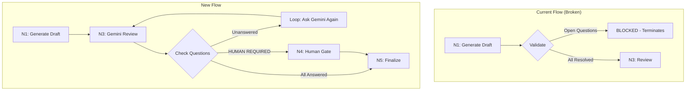

# 248 - Feature: Gemini Answers Open Questions Before Human Escalation

## 1. Context & Goal
* **Issue:** #248
* **Objective:** Move validation gate AFTER Gemini review so Gemini can answer open questions, with loop-back until resolved
* **Status:** Draft
* **Related Issues:** #245 (validation counted DoD checkboxes), #236 (original validation gate)

### Open Questions
*Questions that need clarification before or during implementation. Remove when resolved.*

- [x] ~~Should we add a max retry count for the Gemini question-answering loop?~~ **RESOLVED: Yes, use existing max_iterations (default 20). The loop shares the iteration budget with revisions.**
- [x] ~~What should happen if Gemini marks ALL questions as HUMAN REQUIRED?~~ **RESOLVED: Workflow terminates with human gate request. Human can answer or override.**
- [x] ~~Should the prompt changes be in the template file or hardcoded in review.py?~~ **RESOLVED: Add to 0702c-LLD-Review-Prompt.md for maintainability and auditability.**

## 2. Proposed Changes

*This section is the **source of truth** for implementation. Describe exactly what will be built.*

### 2.1 Files Changed

| File | Change Type | Description |
|------|-------------|-------------|
| `agentos/workflows/requirements/nodes/generate_draft.py` | Modify | Remove pre-review validation gate (lines ~245-280) |
| `agentos/workflows/requirements/nodes/review.py` | Modify | Add post-review open questions check |
| `agentos/workflows/requirements/graph.py` | Modify | Add conditional edge for question-loop after review |
| `docs/skills/0702c-LLD-Review-Prompt.md` | Modify | Add Open Questions answering instructions |
| `tests/unit/test_open_questions_loop.py` | Add | Unit tests for new loop behavior |

### 2.2 Dependencies

*No new packages required.*

```toml
# pyproject.toml additions (if any)
# None
```

### 2.3 Data Structures

```python
# Pseudocode - NOT implementation
# New state fields (additions to RequirementsWorkflowState)

# No new state fields needed - reuse existing:
# - lld_status: "APPROVED" | "BLOCKED" | "QUESTIONS_PENDING"
# - iteration_count: int (shared budget for revisions + question loops)
# - current_verdict: str (contains Gemini's response including answered questions)
```

### 2.4 Function Signatures

```python
# agentos/workflows/requirements/nodes/review.py

def check_unanswered_questions(draft_content: str, verdict_content: str) -> tuple[list[str], list[str]]:
    """Check for unanswered open questions after Gemini review.

    Args:
        draft_content: The LLD draft content
        verdict_content: Gemini's review verdict

    Returns:
        Tuple of (unanswered_questions, human_required_questions)
        - unanswered: Questions Gemini should have answered but didn't
        - human_required: Questions Gemini explicitly marked HUMAN REQUIRED
    """
    ...

def build_question_followup_prompt(unanswered: list[str]) -> str:
    """Build prompt asking Gemini to answer the unanswered questions.

    Args:
        unanswered: List of questions Gemini failed to answer

    Returns:
        Followup prompt string
    """
    ...


# agentos/workflows/requirements/graph.py

def route_after_review(state: RequirementsWorkflowState) -> Literal[...]:
    """Route after review - now includes QUESTIONS_PENDING handling.

    New routing logic:
    - APPROVED + no unanswered questions -> N5_finalize
    - APPROVED + unanswered questions -> N3_review (loop back with followup)
    - APPROVED + only HUMAN_REQUIRED -> END (human gate)
    - BLOCKED -> N1_generate_draft (revision loop)
    """
    ...
```

### 2.5 Logic Flow (Pseudocode)

```
Current Flow (Broken):
1. N1: Generate draft
2. Validate open questions
3. BLOCKED if unchecked questions → Workflow terminates (never reaches Gemini!)

New Flow:
1. N1: Generate draft (no validation here)
2. N3: Gemini review (WITH instructions to answer questions)
3. Post-review check:
   a. Extract unchecked questions from Section 1 "Open Questions"
   b. Check if Gemini's verdict answered them
   c. IF unanswered AND not "HUMAN REQUIRED":
      - Build followup prompt: "You approved but didn't answer: [list]"
      - Loop back to N3 with followup context
   d. IF all answered OR only "HUMAN REQUIRED":
      - Proceed based on verdict
4. IF verdict=APPROVED AND no unanswered:
   - N5: Finalize
5. IF verdict=BLOCKED:
   - N1: Revise draft (existing loop)
6. IF only HUMAN REQUIRED questions:
   - N4: Human gate (existing node, ask human to answer)
```

### 2.6 Technical Approach

* **Module:** `agentos/workflows/requirements/`
* **Pattern:** Post-condition check with loop-back
* **Key Decisions:**
  - Remove pre-review validation entirely (was blocking valid drafts)
  - Add Open Questions instructions to Gemini's review prompt
  - Reuse existing iteration budget (no separate loop counter)
  - "HUMAN REQUIRED" is an explicit escape hatch for Gemini

### 2.7 Architecture Decisions

| Decision | Options Considered | Choice | Rationale |
|----------|-------------------|--------|-----------|
| Validation timing | Pre-review, Post-review, Both | Post-review only | Pre-review blocks before Gemini can help |
| Loop mechanism | New node, Reuse N3 | Reuse N3 | Simpler graph, N3 already handles multiple calls |
| Human escalation | Always ask, Only HUMAN REQUIRED, Never | Only HUMAN REQUIRED | Balance autonomy with human control |
| Prompt location | Hardcoded, Template file | Template file (0702c) | Maintainable, auditable, consistent |

**Architectural Constraints:**
- Must work with existing LangGraph structure
- Must not break existing --gates behavior
- Must share iteration budget (no infinite loops)

## 3. Requirements

*What must be true when this is done. These become acceptance criteria.*

1. Drafts with open questions proceed to Gemini review (not blocked pre-review)
2. Gemini review prompt includes instructions to answer open questions
3. Post-review check detects unanswered questions (not marked HUMAN REQUIRED)
4. Unanswered questions trigger loop back to Gemini with followup prompt
5. Only questions marked "HUMAN REQUIRED" escalate to human gate
6. Workflow respects max_iterations for combined revision+question loops
7. Final validation only blocks if HUMAN REQUIRED questions remain unanswered by human

## 4. Alternatives Considered

| Option | Pros | Cons | Decision |
|--------|------|------|----------|
| Keep pre-review validation, fix drafter prompt | Simple | Drafter can't always know answers; shifts burden | **Rejected** |
| Let Gemini revise draft directly | Fewer steps | Gemini is reviewer not editor; role confusion | **Rejected** |
| Post-review validation with loop | Gemini can answer; clear roles | More complex routing | **Selected** |
| Remove validation entirely | Simplest | Open questions slip through | **Rejected** |

**Rationale:** Post-review validation with loop-back lets Gemini (the senior reviewer) answer design questions, which is appropriate for an architect role. Only truly human-required decisions escalate.

## 5. Data & Fixtures

### 5.1 Data Sources

| Attribute | Value |
|-----------|-------|
| Source | LLD draft content, Gemini verdict |
| Format | Markdown text |
| Size | ~500-1000 lines |
| Refresh | Per workflow run |
| Copyright/License | N/A |

### 5.2 Data Pipeline

```
Draft (open questions) ──review──► Gemini verdict ──check──► Loop or Finalize
```

### 5.3 Test Fixtures

| Fixture | Source | Notes |
|---------|--------|-------|
| `draft_with_open_questions.md` | Generated | 3 unchecked questions in Section 1 |
| `verdict_questions_answered.md` | Generated | Gemini marks all [x] with recommendations |
| `verdict_questions_unanswered.md` | Generated | Gemini approves but leaves questions unchecked |
| `verdict_human_required.md` | Generated | Gemini marks questions as HUMAN REQUIRED |

### 5.4 Deployment Pipeline

Test fixtures generated during test setup. No external data.

## 6. Diagram

### 6.1 Mermaid Quality Gate

- [x] **Simplicity:** Similar components collapsed
- [x] **No touching:** All elements have visual separation
- [x] **No hidden lines:** All arrows fully visible
- [x] **Readable:** Labels not truncated, flow direction clear
- [ ] **Auto-inspected:** Agent rendered via mermaid.ink and viewed

**Auto-Inspection Results:**
```
- Touching elements: [x] None
- Hidden lines: [x] None
- Label readability: [x] Pass
- Flow clarity: [x] Clear
```

### 6.2 Diagram



## 7. Security & Safety Considerations

### 7.1 Security

| Concern | Mitigation | Status |
|---------|------------|--------|
| Prompt injection via questions | Questions extracted from trusted LLD only | Addressed |

### 7.2 Safety

| Concern | Mitigation | Status |
|---------|------------|--------|
| Infinite loop | Shared iteration budget (max_iterations) | Addressed |
| Gemini always says HUMAN REQUIRED | Human can override or answer | Addressed |
| Lost context in loop | Full verdict history preserved | Addressed |

**Fail Mode:** Fail Closed - If max iterations reached, workflow terminates with current state

**Recovery Strategy:** User can resume workflow with --resume flag

## 8. Performance & Cost Considerations

### 8.1 Performance

| Metric | Budget | Approach |
|--------|--------|----------|
| Additional API calls | 0-2 per workflow | Only loops if Gemini fails to answer |
| Latency | +30s per loop | Acceptable for improved outcomes |

**Bottlenecks:** Each Gemini call adds ~15-30s. Loop should rarely trigger if prompt is clear.

### 8.2 Cost Analysis

| Resource | Unit Cost | Estimated Usage | Monthly Cost |
|----------|-----------|-----------------|--------------|
| Gemini API (question loop) | ~$0.01 per call | 0.5 extra calls avg | ~$1-2/month |

**Cost Controls:**
- Shared iteration budget prevents runaway loops
- Clear prompt reduces need for loops

**Worst-Case Scenario:** If Gemini consistently fails to answer, max 20 iterations total (shared with revisions)

## 9. Legal & Compliance

| Concern | Applies? | Mitigation |
|---------|----------|------------|
| PII/Personal Data | No | No PII in LLD content |
| Third-Party Licenses | No | No new dependencies |
| Terms of Service | N/A | Gemini API already in use |
| Data Retention | N/A | Workflow state only |
| Export Controls | No | N/A |

**Data Classification:** Internal

**Compliance Checklist:**
- [x] No PII stored without consent
- [x] All third-party licenses compatible
- [x] External API usage compliant
- [x] Data retention policy documented

## 10. Verification & Testing

### 10.0 Test Plan (TDD - Complete Before Implementation)

**TDD Requirement:** Tests MUST be written and failing BEFORE implementation begins.

| Test ID | Test Description | Expected Behavior | Status |
|---------|------------------|-------------------|--------|
| T010 | test_draft_with_questions_proceeds_to_review | Draft not blocked pre-review | RED |
| T020 | test_gemini_answers_questions | Questions resolved in verdict | RED |
| T030 | test_unanswered_triggers_loop | Loop back to N3 with followup | RED |
| T040 | test_human_required_escalates | Goes to human gate | RED |
| T050 | test_max_iterations_respected | Terminates after limit | RED |
| T060 | test_all_answered_proceeds_to_finalize | N5 reached when resolved | RED |
| T070 | test_prompt_includes_question_instructions | 0702c has new section | RED |

**Coverage Target:** ≥95% for all new code

**TDD Checklist:**
- [ ] All tests written before implementation
- [ ] Tests currently RED (failing)
- [ ] Test IDs match scenario IDs in 10.1
- [ ] Test file created at: `tests/unit/test_open_questions_loop.py`

### 10.1 Test Scenarios

| ID | Scenario | Type | Input | Expected Output | Pass Criteria |
|----|----------|------|-------|-----------------|---------------|
| 010 | Draft with open questions proceeds | Auto | Draft with 3 unchecked questions | Reaches N3_review | No BLOCKED status pre-review |
| 020 | Gemini answers questions | Auto | Review with question instructions | All questions [x] | Verdict contains resolutions |
| 030 | Unanswered triggers loop | Auto | Verdict approves but questions unchecked | Loop to N3 | Followup prompt sent |
| 040 | HUMAN REQUIRED escalates | Auto | Verdict with HUMAN REQUIRED | Goes to N4 | Human gate invoked |
| 050 | Max iterations respected | Auto | 20 loops without resolution | Terminates | Exit with current state |
| 060 | Resolved proceeds to finalize | Auto | All questions answered | Reaches N5 | APPROVED status |
| 070 | Prompt updated | Auto | Load 0702c | Contains question instructions | Regex match |

### 10.2 Test Commands

```bash
# Run all automated tests
poetry run pytest tests/unit/test_open_questions_loop.py -v

# Run with coverage
poetry run pytest tests/unit/test_open_questions_loop.py --cov=agentos/workflows/requirements --cov-report=term-missing
```

### 10.3 Manual Tests (Only If Unavoidable)

N/A - All scenarios automated.

## 11. Risks & Mitigations

| Risk | Impact | Likelihood | Mitigation |
|------|--------|------------|------------|
| Gemini ignores question instructions | Med | Low | Clear prompt, followup loop |
| Infinite loop | High | Low | Shared iteration budget |
| Human bottleneck if all HUMAN REQUIRED | Med | Low | Human can delegate back |
| Regression in existing behavior | High | Med | Comprehensive test coverage |

## 12. Definition of Done

### Code
- [ ] Implementation complete and linted
- [ ] Code comments reference this LLD (#248)

### Tests
- [ ] All test scenarios pass
- [ ] Test coverage ≥95%

### Documentation
- [ ] LLD updated with any deviations
- [ ] Implementation Report (0103) completed
- [ ] Test Report (0113) completed if applicable

### Review
- [ ] Code review completed
- [ ] User approval before closing issue

---

## Appendix: Review Log

*Track all review feedback with timestamps and implementation status.*

### Review Summary

| Review | Date | Verdict | Key Issue |
|--------|------|---------|-----------|
| Gemini #1 | (pending) | (pending) | (pending) |

**Final Status:** PENDING
