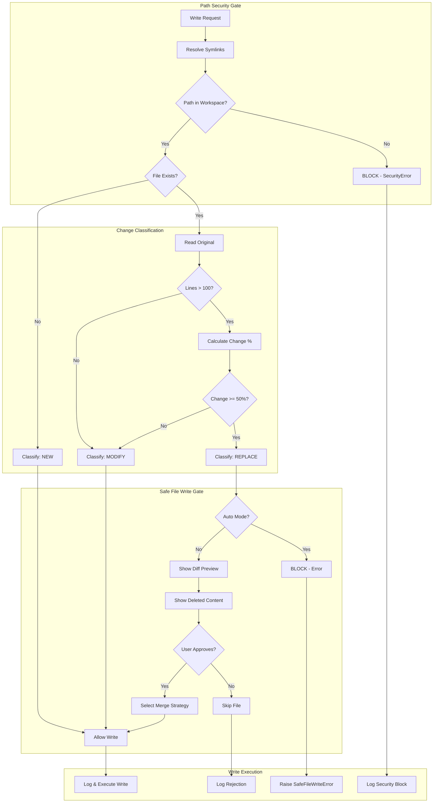

# 256 - Feature: Safe File Write Gate

<!-- Template Metadata
Last Updated: 2025-01-13
Updated By: LLD Generation
Update Reason: Revised to address Gemini Review #1 feedback - added Path Traversal protection, Audit Log test, Symlink handling
-->

## 1. Context & Goal
* **Issue:** #256
* **Objective:** Prevent silent file overwrites by adding a LangGraph workflow node that detects destructive changes and requires approval before replacing files with significant content.
* **Status:** Draft
* **Related Issues:** Replaces #173 (closed - wrong project paths), Original bug: PR #165

### Open Questions
*Questions that need clarification before or during implementation. Remove when resolved.*

- [x] ~~Should the 100-line threshold be configurable via workflow config?~~ **RESOLVED: No.** Keep as constants (`constants.py`) for MVP to reduce complexity.
- [x] ~~Should we track approval history for audit purposes?~~ **RESOLVED: Yes.** Essential for debugging. Implementation in `WriteApprovalState.approval_log`.
- [x] ~~What merge strategies should be available via CLI flags vs interactive prompts?~~ **RESOLVED: Prompt-first.** User selects strategy at the prompt; CLI flags are secondary/advanced features.

## 2. Proposed Changes

*This section is the **source of truth** for implementation. Describe exactly what will be built.*

### 2.1 Files Changed

| File | Change Type | Description |
|------|-------------|-------------|
| `agentos/workflows/testing/nodes/safe_file_write.py` | Add | New gate node implementing file safety checks |
| `agentos/workflows/testing/graph.py` | Modify | Insert safe_file_write gate before file write operations |
| `agentos/workflows/testing/state.py` | Modify | Add approval state fields for write operations |
| `agentos/workflows/testing/constants.py` | Modify | Add threshold constants and change classifications |
| `tests/unit/test_safe_file_write.py` | Add | Unit tests for safe file write gate |
| `tests/integration/test_safe_file_write_workflow.py` | Add | Integration tests for workflow integration |

### 2.2 Dependencies

*New packages, APIs, or services required.*

```toml
# pyproject.toml additions (if any)
# No new dependencies - uses existing difflib from stdlib
```

### 2.3 Data Structures

```python
# Pseudocode - NOT implementation
from enum import Enum
from typing import TypedDict, Optional, List

class ChangeClassification(Enum):
    NEW = "new"           # File does not exist
    MODIFY = "modify"     # Less than 50% changed
    REPLACE = "replace"   # More than 50% changed, requires approval

class MergeStrategy(Enum):
    APPEND = "append"     # Add new code to end
    INSERT = "insert"     # Add at specific location
    EXTEND = "extend"     # Add methods to existing class
    REPLACE = "replace"   # Full replacement (requires approval)

class FileWriteRequest(TypedDict):
    target_path: str                    # Path to file being written
    new_content: str                    # Content to write
    merge_strategy: Optional[MergeStrategy]  # User-specified strategy

class FileWriteAnalysis(TypedDict):
    target_path: str                    # Path to file
    exists: bool                        # Whether file exists
    original_lines: int                 # Line count of existing file
    new_lines: int                      # Line count of new content
    change_classification: ChangeClassification
    change_percentage: float            # Percentage of lines changed
    deleted_content: Optional[str]      # Content that will be lost
    diff_preview: str                   # Unified diff for review
    requires_approval: bool             # Whether approval is needed
    auto_mode_blocked: bool             # Whether --auto mode is blocked

class WriteApprovalState(TypedDict):
    pending_writes: List[FileWriteAnalysis]
    approved_writes: List[str]          # Paths approved for write
    rejected_writes: List[str]          # Paths rejected
    approval_log: List[dict]            # Audit trail with timestamps and decisions
```

### 2.4 Function Signatures

```python
# Signatures only - implementation in source files

# safe_file_write.py
def validate_path_security(
    target_path: str,
    workspace_root: str
) -> bool:
    """
    Validate that target_path is within workspace_root.
    Resolves symlinks and prevents path traversal attacks.
    Raises SecurityError if path escapes workspace.
    """
    ...

def analyze_file_write(
    target_path: str,
    new_content: str,
    workspace_root: str,
    line_threshold: int = 100,
    change_threshold: float = 0.5
) -> FileWriteAnalysis:
    """Analyze a file write operation for potential destructive changes."""
    ...

def generate_diff_preview(
    original_content: str,
    new_content: str,
    context_lines: int = 3,
    max_lines: int = 50
) -> str:
    """Generate a unified diff preview for user review. Truncates if exceeds max_lines."""
    ...

def calculate_change_percentage(
    original_content: str,
    new_content: str
) -> float:
    """Calculate percentage of lines changed between versions."""
    ...

def classify_change(
    exists: bool,
    original_lines: int,
    change_percentage: float,
    line_threshold: int = 100,
    change_threshold: float = 0.5
) -> ChangeClassification:
    """Classify the change as NEW, MODIFY, or REPLACE."""
    ...

def extract_deleted_content(
    original_content: str,
    new_content: str
) -> str:
    """Extract content that will be deleted in a replacement."""
    ...

def safe_file_write_gate(state: WorkflowState) -> WorkflowState:
    """LangGraph node that gates file writes requiring approval."""
    ...

def request_user_approval(
    analysis: FileWriteAnalysis,
    auto_mode: bool
) -> tuple[bool, Optional[MergeStrategy]]:
    """Request user approval for destructive write. Blocks in --auto mode."""
    ...

def apply_merge_strategy(
    original_content: str,
    new_content: str,
    strategy: MergeStrategy,
    insert_location: Optional[int] = None
) -> str:
    """Apply the selected merge strategy to combine content."""
    ...
```

### 2.5 Logic Flow (Pseudocode)

```
SAFE FILE WRITE GATE NODE:

1. Receive file write request from workflow state
2. FOR EACH pending file write:
   a. VALIDATE PATH SECURITY:
      - Resolve symlinks in target_path
      - Verify resolved path is within workspace_root
      - IF path escapes workspace:
         - Raise SecurityError("Path traversal blocked")
         - Log to approval_log with reason="security_blocked"
   b. Check if target file exists
   c. IF file does not exist:
      - Classify as NEW
      - Allow write without approval
   d. IF file exists:
      - Read original content
      - Count original lines
      - IF original_lines <= 100:
         - Classify as MODIFY
         - Allow write without approval
      - IF original_lines > 100:
         - Calculate change percentage
         - IF change_percentage < 50%:
            - Classify as MODIFY
            - Allow write without approval
         - IF change_percentage >= 50%:
            - Classify as REPLACE
            - Generate diff preview (truncate at 50 lines)
            - Extract deleted content preview
            - Mark requires_approval = True
            - IF auto_mode:
               - Block write (auto_mode_blocked = True)
               - Raise SafeFileWriteError
            - ELSE:
               - Display diff and deleted content
               - Prompt user for approval
               - IF approved:
                  - Log to approval_log: {path, decision="approved", timestamp, strategy}
                  - Ask for merge strategy (or accept REPLACE)
                  - Apply merge strategy
                  - Execute write
               - IF rejected:
                  - Log to approval_log: {path, decision="rejected", timestamp}
                  - Add to rejected_writes
                  - Skip this file
3. Update workflow state with approval results
4. Return updated state
```

### 2.6 Technical Approach

* **Module:** `agentos/workflows/testing/nodes/safe_file_write.py`
* **Pattern:** Gate Pattern - intercepts file writes before execution
* **Key Decisions:** 
  - Uses Python's `difflib` for diff generation (no external deps)
  - Thresholds (100 lines, 50% change) are constants but could be configurable
  - Hard blocks `--auto` mode for REPLACE operations (non-negotiable safety)
  - Preserves all analysis for audit trail
  - **Path security validation is mandatory first step** (not optional)
  - Diff preview truncated at 50 lines to prevent terminal flooding

### 2.7 Architecture Decisions

*Document key architectural decisions that affect the design. This section addresses the most common category of governance feedback (23 patterns).*

| Decision | Options Considered | Choice | Rationale |
|----------|-------------------|--------|-----------|
| Gate placement | Pre-write check, Post-write rollback | Pre-write check | Prevention > recovery; avoid data loss entirely |
| Diff library | difflib (stdlib), unidiff (external), git diff (subprocess) | difflib | No external deps, sufficient for line-by-line comparison |
| Threshold configuration | Hardcoded, Config file, CLI args | Hardcoded constants | Simplicity; can expand to config in future |
| Auto-mode blocking | Soft warning, Hard block, Skip file | Hard block | Safety-critical; cannot allow silent destructive changes |
| Merge strategy selection | Auto-select, Always prompt, Prompt only for REPLACE | Prompt only for REPLACE | Balance UX with safety |
| Path security | Optional check, Mandatory first step | Mandatory first step | Core safety requirement; cannot be bypassed |
| Symlink handling | Ignore, Resolve before check | Resolve before check | Prevents symlink-based sandbox escape |

**Architectural Constraints:**
- Must integrate with existing LangGraph workflow graph structure
- Cannot introduce new external dependencies
- Must work with existing `WorkflowState` type
- Cannot bypass approval in `--auto` mode for destructive changes
- **Must validate all paths are within workspace before any file operation**

## 3. Requirements

*What must be true when this is done. These become acceptance criteria.*

1. System MUST detect when a file exists before attempting to write
2. System MUST classify changes as NEW, MODIFY, or REPLACE based on thresholds
3. Files with >100 lines AND >50% changed MUST require explicit user approval
4. System MUST display unified diff preview showing what will change
5. System MUST show content that will be DELETED in replacement scenarios
6. System MUST NOT allow silent replacement in `--auto` mode (hard block)
7. System MUST offer merge strategies (APPEND, INSERT, EXTEND, REPLACE) when approval requested
8. System MUST maintain audit log of all approval decisions with timestamps
9. System MUST integrate with TDD implementation workflow
10. System MUST handle edge cases (empty files, binary files, permission errors)
11. **System MUST prevent writes outside the project root (Path Traversal protection)**
12. **System MUST resolve symlinks before path validation**

## 4. Alternatives Considered

| Option | Pros | Cons | Decision |
|--------|------|------|----------|
| Pre-write gate (selected) | Prevents data loss, clean UX, integrates with LangGraph | Adds latency to writes | **Selected** |
| Post-write rollback | Simpler implementation, works retroactively | Data loss window, requires backup storage | Rejected |
| Git-based detection | Leverages existing VCS, automatic history | Requires git, fails on new/untracked files | Rejected |
| Hash-based change detection | Fast comparison | Doesn't show what changed, poor UX | Rejected |

**Rationale:** Pre-write gate prevents data loss entirely rather than attempting recovery. It integrates cleanly with LangGraph's node-based architecture and provides the best user experience for reviewing changes before they happen.

## 5. Data & Fixtures

*Per [0108-lld-pre-implementation-review.md](0108-lld-pre-implementation-review.md) - complete this section BEFORE implementation.*

### 5.1 Data Sources

| Attribute | Value |
|-----------|-------|
| Source | Local filesystem (target files being written) |
| Format | Plain text source code files |
| Size | Typically 50-500 lines per file |
| Refresh | Real-time (read on each write attempt) |
| Copyright/License | N/A - operates on user's own code |

### 5.2 Data Pipeline

```
Workflow State ──extract──► FileWriteRequest ──validate_path──► Security Check ──analyze──► FileWriteAnalysis ──gate──► Approved/Blocked
                                   │                                    │
                              File System                          File System
                              (read existing)                    (resolve symlinks)
```

### 5.3 Test Fixtures

| Fixture | Source | Notes |
|---------|--------|-------|
| `fixtures/large_file.py` | Generated | 270-line Python file simulating state.py |
| `fixtures/small_file.py` | Generated | 50-line Python file (below threshold) |
| `fixtures/replacement_file.py` | Generated | 56-line file simulating bad replacement |
| `fixtures/partial_change.py` | Generated | File with 30% modifications |
| `fixtures/symlink_target.py` | Generated | Target for symlink tests |

### 5.4 Deployment Pipeline

Tests run against fixture files in `tests/fixtures/`. No external data sources. All fixtures generated during test setup or committed to repo. **Unit tests mock filesystem interactions to avoid actual disk writes.**

## 6. Diagram

### 6.1 Mermaid Quality Gate

Before finalizing any diagram, verify in [Mermaid Live Editor](https://mermaid.live) or GitHub preview:

- [x] **Simplicity:** Similar components collapsed (per 0006 §8.1)
- [x] **No touching:** All elements have visual separation (per 0006 §8.2)
- [x] **No hidden lines:** All arrows fully visible (per 0006 §8.3)
- [x] **Readable:** Labels not truncated, flow direction clear
- [ ] **Auto-inspected:** Agent rendered via mermaid.ink and viewed (per 0006 §8.5)

**Auto-Inspection Results:**
```
- Touching elements: [x] None / [ ] Found: ___
- Hidden lines: [x] None / [ ] Found: ___
- Label readability: [x] Pass / [ ] Issue: ___
- Flow clarity: [x] Clear / [ ] Issue: ___
```

*Reference: [0006-mermaid-diagrams.md](0006-mermaid-diagrams.md)*

### 6.2 Diagram



## 7. Security & Safety Considerations

*This section addresses security (10 patterns) and safety (9 patterns) concerns from governance feedback.*

### 7.1 Security

| Concern | Mitigation | Status |
|---------|------------|--------|
| Path traversal | `validate_path_security()` checks all paths are within workspace using `os.path.realpath()` | **Addressed** |
| Symlink attacks | Resolve symlinks with `os.path.realpath()` before any path validation | **Addressed** |
| Race conditions | Use atomic file operations where possible | TODO |

### 7.2 Safety

*Safety concerns focus on preventing data loss, ensuring fail-safe behavior, and protecting system integrity.*

| Concern | Mitigation | Status |
|---------|------------|--------|
| Accidental data loss (primary concern) | Pre-write gate with mandatory approval for REPLACE | Addressed |
| Silent overwrites in automation | Hard block in --auto mode, no bypass | Addressed |
| Partial write failures | Atomic write pattern (write to temp, rename) | TODO |
| User bypasses safety | No programmatic override for REPLACE approval | Addressed |
| Large file memory issues | Stream large files, don't load entirely | TODO |
| Writes outside workspace | Mandatory path validation as first step | **Addressed** |

**Fail Mode:** Fail Closed - If any safety check fails, block the write operation. Data preservation is prioritized over workflow completion.

**Recovery Strategy:** 
- Rejected writes logged with original content hash for reference
- User can re-run with explicit approval
- No automatic retry of blocked operations
- Security blocks logged with full path attempted for audit

## 8. Performance & Cost Considerations

*This section addresses performance and cost concerns (6 patterns) from governance feedback.*

### 8.1 Performance

| Metric | Budget | Approach |
|--------|--------|----------|
| Latency | < 100ms per file | Line counting before full diff; lazy diff generation |
| Memory | < 50MB per file | Stream processing for very large files |
| I/O | 1 read per write request | Single read of original file |

**Bottlenecks:** 
- Diff generation for very large files (>10K lines) - mitigated by streaming
- Multiple concurrent write requests - handled sequentially by LangGraph
- Diff preview truncated at 50 lines to prevent terminal flooding

### 8.2 Cost Analysis

| Resource | Unit Cost | Estimated Usage | Monthly Cost |
|----------|-----------|-----------------|--------------|
| Compute | N/A (local) | Per workflow run | $0 |
| Storage | N/A (existing) | Audit log only | Negligible |

**Cost Controls:**
- [x] No external API calls
- [x] No cloud resources required
- [x] Local processing only

**Worst-Case Scenario:** Processing hundreds of files in a single workflow run adds ~10 seconds total overhead. Acceptable.

## 9. Legal & Compliance

*This section addresses legal concerns (8 patterns) from governance feedback.*

| Concern | Applies? | Mitigation |
|---------|----------|------------|
| PII/Personal Data | No | Operates only on source code files |
| Third-Party Licenses | No | Uses only Python stdlib |
| Terms of Service | N/A | No external services |
| Data Retention | No | Audit logs contain only metadata, not content |
| Export Controls | N/A | No restricted algorithms |

**Data Classification:** Internal - operates on user's source code locally

**Compliance Checklist:**
- [x] No PII stored without consent
- [x] All third-party licenses compatible with project license
- [x] External API usage compliant with provider ToS (none used)
- [x] Data retention policy documented (audit logs only)

## 10. Verification & Testing

*Ref: [0005-testing-strategy-and-protocols.md](0005-testing-strategy-and-protocols.md)*

**Testing Philosophy:** Strive for 100% automated test coverage. Manual tests are a last resort for scenarios that genuinely cannot be automated (e.g., visual inspection, hardware interaction). Every scenario marked "Manual" requires justification.

### 10.0 Test Plan (TDD - Complete Before Implementation)

**TDD Requirement:** Tests MUST be written and failing BEFORE implementation begins.

| Test ID | Test Description | Expected Behavior | Status |
|---------|------------------|-------------------|--------|
| T010 | test_new_file_classification | NEW files bypass approval | RED |
| T020 | test_small_file_classification | Files <= 100 lines classified as MODIFY | RED |
| T030 | test_minor_change_classification | Changes < 50% classified as MODIFY | RED |
| T040 | test_major_change_classification | Changes >= 50% on large files classified as REPLACE | RED |
| T050 | test_auto_mode_blocks_replace | --auto mode raises error for REPLACE | RED |
| T060 | test_diff_preview_generation | Unified diff correctly generated | RED |
| T070 | test_deleted_content_extraction | Deleted lines correctly identified | RED |
| T080 | test_merge_strategy_append | APPEND adds to end of file | RED |
| T090 | test_merge_strategy_extend | EXTEND adds methods to class | RED |
| T100 | test_workflow_integration | Gate integrates with LangGraph | RED |
| T110 | test_path_traversal_blocked | Paths outside workspace raise SecurityError | RED |
| T120 | test_symlink_resolution | Symlinks resolved before path validation | RED |
| T130 | test_audit_log_entries | Approval/rejection logged with timestamps | RED |
| T140 | test_diff_preview_truncation | Diff preview truncated at 50 lines | RED |

**Coverage Target:** ≥95% for all new code

**TDD Checklist:**
- [ ] All tests written before implementation
- [ ] Tests currently RED (failing)
- [ ] Test IDs match scenario IDs in 10.1
- [ ] Test file created at: `tests/unit/test_safe_file_write.py`

*Note: Update Status from RED to GREEN as implementation progresses. All tests should be RED at LLD review time.*

### 10.1 Test Scenarios

| ID | Scenario | Type | Input | Expected Output | Pass Criteria |
|----|----------|------|-------|-----------------|---------------|
| 010 | New file write (happy path) | Auto | Non-existent path, content | classification=NEW, requires_approval=False | File written |
| 020 | Small file overwrite | Auto | 50-line existing file | classification=MODIFY | Write allowed |
| 030 | Large file minor change | Auto | 270-line file, 20% change | classification=MODIFY | Write allowed |
| 040 | Large file major change | Auto | 270-line file, 80% change | classification=REPLACE, requires_approval=True | Approval prompted |
| 050 | Replace in auto mode | Auto | REPLACE classification, auto=True | auto_mode_blocked=True | SafeFileWriteError raised |
| 060 | User approves replace | Auto | REPLACE, user confirms | Write executed | File contains new content |
| 070 | User rejects replace | Auto | REPLACE, user rejects | Write skipped | Original preserved |
| 080 | Append merge strategy | Auto | APPEND selected | Original + new at end | Both contents present |
| 090 | Extend merge strategy | Auto | EXTEND, class file | New methods added | Class has all methods |
| 100 | Empty file edge case | Auto | 0-line existing file | classification=MODIFY | Write allowed |
| 110 | Binary file detection | Auto | Binary file path | Error or skip | Appropriate handling |
| 120 | Permission denied | Auto | Read-only file | Error with message | Clear error surfaced |
| 130 | Workflow state update | Auto | Multiple files | State updated correctly | All files tracked |
| 140 | Path traversal attempt | Auto | `../outside.py`, `/etc/hosts` | SecurityError raised | Write blocked, logged |
| 150 | Symlink to outside workspace | Auto | Symlink pointing to `/tmp/file.py` | SecurityError raised | Write blocked after symlink resolution |
| 160 | Audit log verification | Auto | Approve then reject files | approval_log contains entries | Log has path, decision, timestamp |
| 170 | Diff preview truncation | Auto | 200-line diff | Diff truncated with "[truncated]" | Output <= 50 lines |

### 10.2 Test Commands

```bash
# Run all automated tests
poetry run pytest tests/unit/test_safe_file_write.py -v

# Run only fast/mocked tests (exclude live)
poetry run pytest tests/unit/test_safe_file_write.py -v -m "not live"

# Run integration tests
poetry run pytest tests/integration/test_safe_file_write_workflow.py -v

# Run with coverage
poetry run pytest tests/unit/test_safe_file_write.py --cov=agentos.workflows.testing.nodes.safe_file_write --cov-report=term-missing
```

### 10.3 Manual Tests (Only If Unavoidable)

N/A - All scenarios automated.

## 11. Risks & Mitigations

| Risk | Impact | Likelihood | Mitigation |
|------|--------|------------|------------|
| False positives blocking legitimate writes | Med | Med | Clear messaging, easy approval flow, threshold tuning |
| False negatives allowing destructive writes | High | Low | Conservative thresholds, extensive test coverage |
| User fatigue from too many prompts | Med | Med | Only prompt for REPLACE, smart thresholds |
| Performance impact on large repos | Low | Low | Lazy evaluation, streaming for large files |
| Integration breaks existing workflows | Med | Med | Feature flag during rollout, comprehensive integration tests |
| Path traversal bypass | High | Low | Mandatory first-step validation, symlink resolution |

## 12. Definition of Done

### Code
- [ ] Implementation complete and linted
- [ ] Code comments reference this LLD (Issue #256)
- [ ] Path security validation implemented as first step

### Tests
- [ ] All test scenarios pass (including T110-T170)
- [ ] Test coverage ≥95% for new code

### Documentation
- [ ] LLD updated with any deviations
- [ ] Implementation Report (0103) completed
- [ ] CHANGELOG updated

### Review
- [ ] Code review completed
- [ ] Integration tested with TDD workflow
- [ ] User approval before closing issue

---

## Appendix: Review Log

*Track all review feedback with timestamps and implementation status.*

### Initial Draft

**Reviewer:** Agent
**Verdict:** DRAFT

#### Comments

| ID | Comment | Implemented? |
|----|---------|--------------|
| A1.1 | Initial LLD creation from Issue #256 | YES - this document |

### Gemini Review #1 (REVISE)

**Reviewer:** Gemini 3 Pro
**Verdict:** REVISE

#### Comments

| ID | Comment | Implemented? |
|----|---------|--------------|
| G1.1 | "Path Traversal marked as TODO - This is a blocker. A feature named 'Safe File Write' must inherently prevent writing outside the sandbox" | YES - Added `validate_path_security()` to Section 2.4, mandatory path check in Section 2.5 Step 2a, Requirements 11-12 in Section 3, Test scenarios T110/T140/T150 |
| G1.2 | "Missing Test Case for Symlinks - Section 7.1 mentions 'Resolve symlinks before analysis' as TODO" | YES - Changed to Addressed in Section 7.1, added T120/T150 test scenarios |
| G1.3 | "Test 130 checks state update but needs to explicitly verify log entries" | YES - Added T160 test scenario for audit log verification |
| G1.4 | "Consider adding a requirement to truncate the Diff Preview" | YES - Added max_lines parameter to `generate_diff_preview()`, added T140/T170 test scenarios |
| G1.5 | "Ensure tests mock the filesystem interactions" | YES - Added note in Section 5.4 about unit test mocking |

### Review Summary

| Review | Date | Verdict | Key Issue |
|--------|------|---------|-----------|
| Initial Draft | 2025-01-13 | DRAFT | N/A - initial creation |
| Gemini #1 | 2025-01-13 | REVISE | Path Traversal protection marked as TODO |

**Final Status:** PENDING