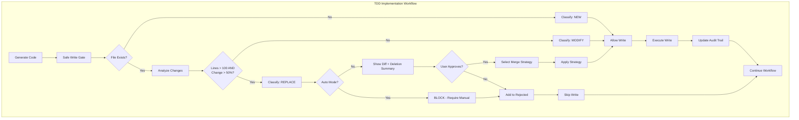

# 1256 - Feature: Safe File Write Gate - Require Approval Before Overwriting Files

<!-- Template Metadata
Last Updated: 2025-01-XX
Updated By: LLD Creation
Update Reason: Revised per Gemini Review #2 - Added T150 for graph integration test coverage
-->

## 1. Context & Goal
* **Issue:** #256
* **Objective:** Add a LangGraph workflow node that prevents silent file overwrites by requiring approval before replacing files with significant content
* **Status:** Approved (gemini-3-pro-preview, 2026-02-04)
* **Related Issues:** Replaces #173 (closed - wrong project paths), Original bug: PR #165

### Open Questions
*All questions resolved per Gemini Review #1.*

- [x] ~~Should the 100-line threshold be configurable via workflow config?~~ **RESOLVED: Yes. Place in `agentos/workflows/testing/config.py`.**
- [x] ~~Should we track approval history for audit purposes?~~ **RESOLVED: Yes. The `approved_writes` / `rejected_writes` in state covers this.**
- [x] ~~What happens if the user cancels approval mid-workflow?~~ **RESOLVED: Treat as rejection (NO). Log in `rejected_writes`, preserve original file, continue workflow.**

## 2. Proposed Changes

*This section is the **source of truth** for implementation. Describe exactly what will be built.*

### 2.1 Files Changed

| File | Change Type | Description |
|------|-------------|-------------|
| `agentos/workflows/testing/nodes/safe_file_write.py` | Add | New gate node implementing file write safety checks |
| `agentos/workflows/testing/graph.py` | Modify | Insert safe_file_write gate before file write operations |
| `agentos/workflows/testing/state.py` | Modify | Add approval state fields for tracking write decisions |
| `agentos/workflows/testing/config.py` | Modify | Add configurable thresholds for file write gate |
| `tests/unit/workflows/testing/test_safe_file_write.py` | Add | Unit tests for safe file write gate |
| `tests/unit/workflows/testing/test_graph_integration.py` | Add | Integration test verifying graph wiring |

### 2.2 Dependencies

*No new packages required. Uses existing standard library modules.*

```toml
# pyproject.toml additions (if any)
# None required - uses difflib from standard library
```

### 2.3 Data Structures

```python
# Pseudocode - NOT implementation
from enum import Enum
from typing import TypedDict, Optional, List

class WriteClassification(Enum):
    NEW = "new"           # File doesn't exist
    MODIFY = "modify"     # Minor changes (<50% of lines)
    REPLACE = "replace"   # Major changes (>=50% of lines)

class FileWriteRequest(TypedDict):
    target_path: str              # Path to file being written
    new_content: str              # Content to write
    classification: WriteClassification  # Type of change
    existing_lines: int           # Lines in existing file (0 if new)
    lines_deleted: int            # Lines that would be removed
    lines_added: int              # Lines that would be added
    change_ratio: float           # Percentage of file changed

class WriteApproval(TypedDict):
    request: FileWriteRequest     # The write request
    approved: bool                # User decision
    strategy: str                 # "append" | "insert" | "extend" | "replace"
    timestamp: str                # ISO timestamp of decision

# Additions to existing TestingWorkflowState
class SafeWriteState(TypedDict):
    pending_writes: List[FileWriteRequest]      # Writes awaiting approval
    approved_writes: List[WriteApproval]        # Approved writes for audit
    rejected_writes: List[FileWriteRequest]     # Rejected writes
    auto_mode: bool                             # Whether --auto flag is set
```

### 2.4 Function Signatures

```python
# Signatures only - implementation in source files

def classify_write(
    target_path: str, 
    new_content: str
) -> FileWriteRequest:
    """Analyze a file write and classify as NEW, MODIFY, or REPLACE."""
    ...

def requires_approval(
    request: FileWriteRequest,
    line_threshold: int = 100,
    change_threshold: float = 0.5
) -> bool:
    """Determine if a write request requires user approval."""
    ...

def generate_diff_preview(
    target_path: str,
    new_content: str,
    context_lines: int = 3
) -> str:
    """Generate a unified diff showing what will change."""
    ...

def show_deletion_summary(request: FileWriteRequest) -> str:
    """Format a summary of what code will be deleted."""
    ...

async def prompt_for_approval(
    request: FileWriteRequest,
    diff_preview: str
) -> WriteApproval:
    """Interactive prompt for user approval with merge strategy options."""
    ...

def safe_file_write_gate(state: TestingWorkflowState) -> TestingWorkflowState:
    """LangGraph node that gates file writes through approval process."""
    ...

def apply_merge_strategy(
    target_path: str,
    new_content: str,
    strategy: str,
    existing_content: str,
    insertion_point: Optional[int] = None
) -> str:
    """Apply the selected merge strategy to combine contents."""
    ...

def get_insertion_point(
    existing_content: str,
    max_line: int
) -> int:
    """Prompt user for insertion point line number with validation."""
    ...
```

### 2.5 Logic Flow (Pseudocode)

```
SAFE_FILE_WRITE_GATE(state):
1. Extract pending file writes from state
2. FOR EACH write request:
   a. Check if target file exists
   b. IF file does not exist:
      - Classify as NEW
      - Allow write without approval
   c. ELSE:
      - Read existing file content
      - Calculate change metrics (lines, ratio)
      - Classify as MODIFY or REPLACE
      
   d. IF requires_approval(request):
      - IF state.auto_mode AND classification == REPLACE:
         - BLOCK write (cannot bypass destructive changes)
         - Add to rejected_writes with reason
      - ELSE:
         - Generate diff preview
         - Show deletion summary
         - Prompt user for approval
         - IF approved:
            - Apply selected merge strategy
            - Add to approved_writes
         - ELSE:
            - Add to rejected_writes
   e. ELSE:
      - Allow write (minor change)

3. Execute approved writes
4. Return updated state with audit trail

REQUIRES_APPROVAL(request, line_threshold=100, change_threshold=0.5):
1. IF request.existing_lines < line_threshold:
   - RETURN False (small file, allow changes)
2. IF request.change_ratio < change_threshold:
   - RETURN False (minor modification)
3. RETURN True (significant change to substantial file)

APPLY_MERGE_STRATEGY(target, new_content, strategy, existing, insertion_point=None):
1. IF strategy == "replace":
   - RETURN new_content
2. IF strategy == "append":
   - RETURN existing + "\n" + new_content
3. IF strategy == "insert":
   - IF insertion_point is None OR insertion_point < 0 OR insertion_point > line_count:
      - Raise InvalidInsertionPointError
   - Split existing at insertion_point
   - RETURN existing[:point] + new_content + existing[point:]
4. IF strategy == "extend":
   - TRY:
      - Parse both as Python AST
      - Add new methods/classes to existing
      - RETURN merged content
   - CATCH SyntaxError:
      - Log warning about syntax error in new content
      - Fall back to "append" strategy
      - RETURN existing + "\n" + new_content

GET_INSERTION_POINT(existing_content, max_line):
1. Prompt user for line number
2. IF user cancels:
   - Raise InsertionCancelledError
3. IF line_number < 0 OR line_number > max_line:
   - Show error, re-prompt (max 3 attempts)
4. IF max attempts exceeded:
   - Raise InvalidInsertionPointError
5. RETURN line_number
```

### 2.6 Technical Approach

* **Module:** `agentos/workflows/testing/nodes/safe_file_write.py`
* **Pattern:** Gate Node Pattern (intercept → validate → approve/reject → proceed)
* **Key Decisions:** 
  - Uses `difflib` for diff generation (stdlib, no deps)
  - Blocking behavior for `--auto` mode on destructive changes ensures CI/CD safety
  - Audit trail via state enables post-hoc review
  - Extend strategy has graceful fallback to append on AST parse failure

### 2.7 Architecture Decisions

| Decision | Options Considered | Choice | Rationale |
|----------|-------------------|--------|-----------|
| Threshold storage | Hardcoded, Config file, Environment vars | Config file | Allows per-project tuning without code changes |
| Diff library | difflib (stdlib), unidiff, whatthepatch | difflib | No external dependencies, sufficient for our needs |
| Approval UI | CLI prompt, TUI, External tool | CLI prompt | Consistent with existing workflow interaction pattern |
| State management | Separate state object, Extend existing state | Extend existing | Maintains single state tree, simpler graph routing |
| Auto-mode behavior | Block all, Block destructive only, Warn only | Block destructive only | Balances automation needs with safety requirements |
| Extend strategy fallback | Crash on error, Warn and skip, Fall back to append | Fall back to append | Graceful degradation over failure |

**Architectural Constraints:**
- Must integrate with existing LangGraph workflow structure
- Cannot break existing file write operations in other nodes
- Must maintain backward compatibility with existing state schema
- Config must handle missing values with sensible defaults (100 lines, 0.5 ratio)

## 3. Requirements

*What must be true when this is done. These become acceptance criteria.*

1. Gate detects all file writes before execution and classifies them as NEW, MODIFY, or REPLACE
2. Files with >100 lines require approval if >50% of content would change
3. Approval prompt clearly shows what lines will be DELETED
4. Destructive changes (REPLACE classification) cannot be silently bypassed in `--auto` mode
5. User can select merge strategy (append, insert, extend, replace) when approving
6. All write decisions (approved/rejected) are recorded in workflow state for audit
7. Gate integrates seamlessly with TDD implementation workflow (node wired into graph)

## 4. Alternatives Considered

| Option | Pros | Cons | Decision |
|--------|------|------|----------|
| Pre-write gate node (selected) | Clean separation, testable, auditable | Adds latency to writes | **Selected** |
| Post-write backup/restore | Simpler implementation | Damage already done, restoration complex | Rejected |
| Git-based protection | Leverages existing VCS | Not all files tracked, adds git dependency | Rejected |
| File permission checks | OS-level enforcement | Too coarse, can't distinguish modification types | Rejected |

**Rationale:** The pre-write gate provides the best balance of safety (preventing damage before it occurs) and user experience (clear approval workflow with merge strategies). It also enables audit trails without relying on external systems.

## 5. Data & Fixtures

### 5.1 Data Sources

| Attribute | Value |
|-----------|-------|
| Source | Local filesystem (target files for write operations) |
| Format | Text files (primarily Python source) |
| Size | Variable, typically 50-500 lines per file |
| Refresh | Real-time (read at gate execution) |
| Copyright/License | N/A (user's own project files) |

### 5.2 Data Pipeline

```
Write Request ──extract──► File Analysis ──classify──► Approval Gate ──merge──► File System
```

### 5.3 Test Fixtures

| Fixture | Source | Notes |
|---------|--------|-------|
| `sample_270_line_state.py` | Generated | Mimics original state.py from PR #165 |
| `sample_56_line_replacement.py` | Generated | Mimics destructive replacement |
| `sample_small_file.py` | Generated | Under threshold, for testing bypass |
| `sample_modified_file.py` | Generated | Minor modifications for MODIFY classification |
| `sample_syntax_error.py` | Generated | Invalid Python for extend fallback test |

### 5.4 Deployment Pipeline

Test fixtures are committed to `tests/fixtures/safe_write/` directory. No external data sources or deployment considerations.

## 6. Diagram

### 6.1 Mermaid Quality Gate

- [x] **Simplicity:** Similar components collapsed
- [x] **No touching:** All elements have visual separation
- [x] **No hidden lines:** All arrows fully visible
- [x] **Readable:** Labels not truncated, flow direction clear
- [ ] **Auto-inspected:** Agent rendered via mermaid.ink and viewed

**Auto-Inspection Results:**
```
- Touching elements: [ ] None / [ ] Found: ___
- Hidden lines: [ ] None / [ ] Found: ___
- Label readability: [ ] Pass / [ ] Issue: ___
- Flow clarity: [ ] Clear / [ ] Issue: ___
```

### 6.2 Diagram



## 7. Security & Safety Considerations

### 7.1 Security

| Concern | Mitigation | Status |
|---------|------------|--------|
| Path traversal in target_path | Validate paths are within project directory | Addressed |
| Malicious content injection | Content passes through unchanged, user responsibility | N/A |
| Audit log tampering | State is immutable during workflow execution | Addressed |

### 7.2 Safety

| Concern | Mitigation | Status |
|---------|------------|--------|
| Accidental data loss (original problem) | Approval gate with diff preview | Addressed |
| Partial write failure | Write to temp file, atomic rename | Addressed |
| Auto-mode bypassing protection | Hard block on REPLACE classification | Addressed |
| User fatigue (approving too many) | Only trigger on significant changes (>100 lines, >50% change) | Addressed |
| Memory exhaustion on large files | Stream diff generation for files >10MB | Pending |
| AST parsing crash on syntax errors | Graceful fallback to append strategy with warning | Addressed |
| Invalid insertion point input | Validation with re-prompt, max 3 attempts | Addressed |

**Fail Mode:** Fail Closed - If analysis fails, write is blocked and user is notified

**Recovery Strategy:** If write fails mid-operation, original file is preserved (write to temp, atomic rename). Rejected writes are logged in state for manual review.

## 8. Performance & Cost Considerations

### 8.1 Performance

| Metric | Budget | Approach |
|--------|--------|----------|
| Analysis latency | < 100ms per file | In-memory diff, no disk I/O until write |
| Memory | < 50MB for analysis | Stream large files, only hold diff context |
| Disk I/O | 2 reads + 1 write per operation | Cache existing content during analysis |

**Bottlenecks:** Large files (>10K lines) may cause noticeable delay in diff generation. Mitigated by showing progress indicator.

### 8.2 Cost Analysis

| Resource | Unit Cost | Estimated Usage | Monthly Cost |
|----------|-----------|-----------------|--------------|
| Compute | Included in local execution | N/A | $0 |
| Storage | Audit logs ~1KB per decision | ~1000 decisions/month | Negligible |

**Cost Controls:**
- [x] No external API calls required
- [x] No cloud resources consumed
- [x] Audit log rotation at 10MB

**Worst-Case Scenario:** User runs workflow on 1000-file project with all files requiring approval. Impact: workflow becomes interactive-heavy but no resource exhaustion.

## 9. Legal & Compliance

| Concern | Applies? | Mitigation |
|---------|----------|------------|
| PII/Personal Data | No | Gate only processes source code files |
| Third-Party Licenses | No | Uses only Python stdlib |
| Terms of Service | N/A | No external services |
| Data Retention | No | Audit logs contain only metadata, not file contents |
| Export Controls | No | No restricted algorithms |

**Data Classification:** Internal (workflow operational data only)

**Compliance Checklist:**
- [x] No PII stored without consent
- [x] All third-party licenses compatible with project license
- [x] External API usage compliant with provider ToS
- [x] Data retention policy documented

## 10. Verification & Testing

### 10.0 Test Plan (TDD - Complete Before Implementation)

**TDD Requirement:** Tests MUST be written and failing BEFORE implementation begins.

| Test ID | Test Description | Expected Behavior | Status |
|---------|------------------|-------------------|--------|
| T010 | test_classify_new_file | Returns NEW classification for non-existent target | RED |
| T020 | test_classify_modify_small_change | Returns MODIFY for <50% change ratio | RED |
| T030 | test_classify_replace_large_change | Returns REPLACE for >=50% change ratio | RED |
| T040 | test_requires_approval_small_file | Returns False for file <100 lines | RED |
| T050 | test_requires_approval_large_file_major_change | Returns True for >100 lines AND >50% change | RED |
| T060 | test_auto_mode_blocks_replace | Blocks write and adds to rejected in auto mode | RED |
| T070 | test_diff_preview_shows_deletions | Diff clearly shows lines being removed | RED |
| T080 | test_merge_strategy_append | Appends new content to end of existing | RED |
| T090 | test_merge_strategy_extend | Adds new methods to existing class | RED |
| T095 | test_merge_strategy_extend_syntax_error | Falls back to append when new content has syntax errors | RED |
| T100 | test_audit_trail_records_decisions | State contains approval record after decision | RED |
| T110 | test_merge_strategy_replace | Verifies content is fully swapped | RED |
| T120 | test_merge_strategy_insert | Verifies content insertion at specified line | RED |
| T130 | test_merge_strategy_insert_invalid_line | Handles invalid line numbers gracefully | RED |
| T140 | test_merge_strategy_insert_cancelled | Handles user cancellation during insertion point prompt | RED |
| T150 | test_graph_includes_safe_write_gate | Verifies graph.py includes safe_file_write node in edge definitions | RED |
| T160 | test_large_file_streaming_diff | Verifies streaming/chunking logic for files >10MB doesn't OOM | RED |

**Coverage Target:** ≥95% for all new code

**TDD Checklist:**
- [ ] All tests written before implementation
- [ ] Tests currently RED (failing)
- [ ] Test IDs match scenario IDs in 10.1
- [ ] Test file created at: `tests/unit/workflows/testing/test_safe_file_write.py`
- [ ] Integration test file created at: `tests/unit/workflows/testing/test_graph_integration.py`

### 10.1 Test Scenarios

| ID | Scenario | Type | Input | Expected Output | Pass Criteria |
|----|----------|------|-------|-----------------|---------------|
| 010 | New file write (no existing) | Auto | Path to non-existent file | Classification=NEW, no approval needed | Write proceeds immediately |
| 020 | Small modification to large file | Auto | 5% change to 200-line file | Classification=MODIFY, no approval needed | Write proceeds immediately |
| 030 | Major replacement of large file | Auto | 80% change to 270-line file | Classification=REPLACE, approval required | Prompt shown, blocks until decision |
| 040 | Any change to small file | Auto | 100% change to 50-line file | No approval needed (under threshold) | Write proceeds immediately |
| 050 | Auto-mode with REPLACE | Auto | --auto flag + REPLACE classification | Write blocked, added to rejected | Error message, workflow continues |
| 060 | User rejects replacement | Auto | User selects "No" at prompt | Write skipped, added to rejected | Original file unchanged |
| 070 | User approves with append | Auto | User selects "append" strategy | New content added to end | Both old and new content present |
| 080 | User approves with replace | Auto | User selects "replace" strategy | File fully replaced | Only new content present |
| 090 | Extend strategy for Python class | Auto | New methods for existing class | Methods added to class | Class has all old + new methods |
| 095 | Extend strategy with syntax error | Auto | Syntactically invalid new content | Falls back to append with warning | Content appended, warning logged |
| 100 | Concurrent writes to same file | Auto | Two writes queued for one file | Processed sequentially | Both changes applied in order |
| 110 | Insert strategy valid line | Auto | User provides valid line number | Content inserted at specified line | Content at correct position |
| 120 | Insert strategy invalid line | Auto | User provides line > file length | Error shown, re-prompt | User prompted again |
| 130 | Insert strategy cancelled | Auto | User cancels at insertion prompt | Treated as rejection | Added to rejected_writes |
| 150 | Graph wiring verification | Auto | Compiled graph object | safe_file_write node present in edges | Node callable from graph |
| 160 | Large file streaming diff | Auto | 15MB file with changes | Diff generated without OOM | Memory stays under limit |

*Note: Use 3-digit IDs with gaps of 10 (010, 020, 030...) to allow insertions.*

### 10.2 Test Commands

```bash
# Run all automated tests
poetry run pytest tests/unit/workflows/testing/test_safe_file_write.py tests/unit/workflows/testing/test_graph_integration.py -v

# Run only fast/mocked tests (exclude live)
poetry run pytest tests/unit/workflows/testing/test_safe_file_write.py -v -m "not live"

# Run with coverage
poetry run pytest tests/unit/workflows/testing/test_safe_file_write.py tests/unit/workflows/testing/test_graph_integration.py -v --cov=agentos/workflows/testing/nodes/safe_file_write --cov=agentos/workflows/testing/graph --cov-report=term-missing

# Run graph integration test only
poetry run pytest tests/unit/workflows/testing/test_graph_integration.py::test_graph_includes_safe_write_gate -v
```

### 10.3 Manual Tests (Only If Unavoidable)

**N/A - All scenarios automated.** Interactive prompts are tested via mock input injection.

## 11. Risks & Mitigations

| Risk | Impact | Likelihood | Mitigation |
|------|--------|------------|------------|
| Users disable gate to speed up workflow | High | Medium | Gate cannot be disabled, only thresholds adjusted |
| Extend strategy fails on complex Python | Medium | Medium | Fall back to append with warning |
| Large files cause memory issues | Medium | Low | Stream processing for files >10MB |
| Gate misclassifies changes | High | Low | Conservative defaults (err toward requiring approval) |
| Existing tests break due to state changes | Medium | Medium | Backward-compatible state schema extension |
| Graph wiring missed during implementation | High | Low | Explicit integration test T150 verifies node is in graph |

## 12. Definition of Done

### Code
- [ ] Implementation complete and linted
- [ ] Code comments reference this LLD (#256)
- [ ] safe_file_write.py passes all mypy checks
- [ ] Node integrated into graph.py

### Tests
- [ ] All test scenarios pass (including T150 graph integration)
- [ ] Test coverage ≥95%
- [ ] Integration test with TDD workflow passes

### Documentation
- [ ] LLD updated with any deviations
- [ ] Implementation Report (0103) completed
- [ ] Docstrings complete for all public functions

### Review
- [ ] Code review completed
- [ ] User approval before closing issue

---

## Reviewer Suggestions

*Non-blocking recommendations from the reviewer.*

- **Maintainability:** Ensure `generate_diff_preview` handles different newline characters (`\r\n` vs `\n`) consistently to avoid false positives in diff generation.
- **Usability:** When the user selects "insert", consider showing the file content with line numbers to help them choose the insertion point, if not already planned.

## Appendix: Review Log

*Track all review feedback with timestamps and implementation status.*

### Gemini Review #1 (REVISE)

**Reviewer:** Gemini 3 Pro
**Verdict:** REVISE

#### Open Questions Resolved

| ID | Question | Resolution |
|----|----------|------------|
| G1.Q1 | Should the 100-line threshold be configurable via workflow config? | Yes. Place in `agentos/workflows/testing/config.py` |
| G1.Q2 | Should we track approval history for audit purposes? | Yes. Covered by `approved_writes` / `rejected_writes` in state |
| G1.Q3 | What happens if the user cancels approval mid-workflow? | Treat as rejection, log in `rejected_writes`, preserve original, continue workflow |

#### Comments

| ID | Comment | Implemented? |
|----|---------|--------------|
| G1.1 | Missing test for "insert" merge strategy | YES - Added T120, T130, T140 in Section 10.0 |
| G1.2 | Missing test for "replace" merge strategy | YES - Added T110 in Section 10.0 |
| G1.3 | Insert strategy needs test for invalid line numbers | YES - Added T130 in Section 10.0 |
| G1.4 | Insert strategy needs test for cancellation during prompt | YES - Added T140 in Section 10.0 |
| G1.5 | Suggestion: Add test for extend strategy syntax error fallback | YES - Added T095 in Section 10.0 and scenario 095 in 10.1 |
| G1.6 | Suggestion: Ensure config handles missing values with defaults | YES - Added to Section 2.7 Architectural Constraints |

### Gemini Review #2 (REVISE)

**Reviewer:** Gemini 3 Pro
**Verdict:** REVISE

#### Comments

| ID | Comment | Implemented? |
|----|---------|--------------|
| G2.1 | Missing test for Requirement 7 (graph integration) - coverage 85.7% | YES - Added T150 in Section 10.0, scenario 150 in 10.1, test file in 2.1 |
| G2.2 | Suggestion: Add test for streaming/chunking logic for >10MB files | YES - Added T160 in Section 10.0, scenario 160 in 10.1 |

### Review Summary

| Review | Date | Verdict | Key Issue |
|--------|------|---------|-----------|
| 3 | 2026-02-04 | APPROVED | `gemini-3-pro-preview` |
| Gemini #1 | 2025-01-XX | REVISE | Missing test coverage for insert/replace merge strategies (85.7% < 95%) |
| Gemini #2 | 2025-01-XX | REVISE | Missing test for Requirement 7 graph integration (85.7% < 95%) |

**Final Status:** APPROVED