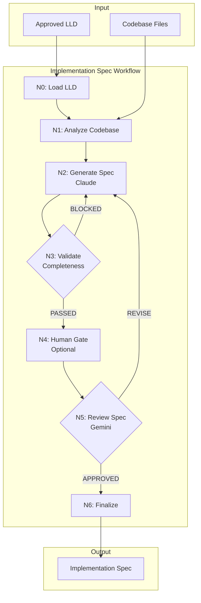

# 304 - Feature: Implementation Readiness Review Workflow (LLD → Implementation Spec)

<!-- Template Metadata
Last Updated: 2026-02-16
Updated By: LLD Generation Workflow
Update Reason: Revision to fix path validation errors - directories don't exist
-->

## 1. Context & Goal
* **Issue:** #304
* **Objective:** Create a workflow that transforms approved LLDs into Implementation Specs with enough concrete detail for autonomous AI implementation
* **Status:** Draft
* **Related Issues:** #139 (rename workflows/testing/ to workflows/implementation/)

### Open Questions

- [x] Should the Implementation Spec be a separate file or an appendix to the LLD? **Decision: Separate file in `docs/lld/drafts/` directory (using existing directory)**
- [x] What is the target success rate for first-try implementations? **Decision: >80% per issue requirements**
- [ ] Should there be a "lightweight" mode for simple changes that don't need full spec generation?

## 2. Proposed Changes

*This section is the **source of truth** for implementation. Describe exactly what will be built.*

### 2.1 Files Changed

| File | Change Type | Description |
|------|-------------|-------------|
| `assemblyzero/workflows/implementation_spec/` | Add (Directory) | New workflow package directory |
| `assemblyzero/workflows/implementation_spec/__init__.py` | Add | Package init with workflow exports |
| `assemblyzero/workflows/implementation_spec/graph.py` | Add | LangGraph workflow definition |
| `assemblyzero/workflows/implementation_spec/state.py` | Add | TypedDict state definitions |
| `assemblyzero/workflows/implementation_spec/nodes/` | Add (Directory) | Nodes subpackage directory |
| `assemblyzero/workflows/implementation_spec/nodes/__init__.py` | Add | Nodes package init |
| `assemblyzero/workflows/implementation_spec/nodes/load_lld.py` | Add | N0: Load approved LLD |
| `assemblyzero/workflows/implementation_spec/nodes/analyze_codebase.py` | Add | N1: Extract current state from files |
| `assemblyzero/workflows/implementation_spec/nodes/generate_spec.py` | Add | N2: Generate implementation spec draft |
| `assemblyzero/workflows/implementation_spec/nodes/validate_completeness.py` | Add | N3: Validate mechanical completeness |
| `assemblyzero/workflows/implementation_spec/nodes/human_gate.py` | Add | N4: Optional human review gate |
| `assemblyzero/workflows/implementation_spec/nodes/review_spec.py` | Add | N5: Gemini readiness review |
| `assemblyzero/workflows/implementation_spec/nodes/finalize_spec.py` | Add | N6: Finalize and write spec |
| `docs/standards/0701-implementation-spec-template.md` | Add | Template for Implementation Specs |
| `docs/standards/0702-implementation-readiness-review.md` | Add | Review criteria and process documentation |
| `docs/prompts/` | Add (Directory) | New prompts directory under docs |
| `docs/prompts/implementation_spec/` | Add (Directory) | Prompts for this workflow |
| `docs/prompts/implementation_spec/drafter_system.md` | Add | Claude system prompt for spec generation |
| `docs/prompts/implementation_spec/drafter_user.md` | Add | Claude user prompt template |
| `docs/prompts/implementation_spec/reviewer_system.md` | Add | Gemini system prompt for readiness review |
| `docs/prompts/implementation_spec/reviewer_user.md` | Add | Gemini user prompt template |
| `tools/run_implementation_spec_workflow.py` | Add | CLI tool to run the workflow |
| `tests/unit/test_implementation_spec_workflow.py` | Add | Unit tests for workflow |
| `tests/unit/test_implementation_spec_nodes.py` | Add | Unit tests for individual nodes |

### 2.1.1 Path Validation (Mechanical - Auto-Checked)

*Issue #277: Before human or Gemini review, paths are verified programmatically.*

Mechanical validation automatically checks:
- All "Modify" files must exist in repository
- All "Delete" files must exist in repository
- All "Add" files must have existing parent directories
- No placeholder prefixes (`src/`, `lib/`, `app/`) unless directory exists

**Parent directories to verify exist:**
- `assemblyzero/workflows/` ✓ (exists, see repo structure)
- `docs/standards/` ✓ (exists, see repo structure)
- `docs/` ✓ (exists, for new `docs/prompts/` directory)
- `tools/` ✓ (exists, see repo structure)
- `tests/unit/` ✓ (exists, see repo structure)

**New directories being created:**
- `assemblyzero/workflows/implementation_spec/` - Parent `assemblyzero/workflows/` exists ✓
- `assemblyzero/workflows/implementation_spec/nodes/` - Created after parent ✓
- `docs/prompts/` - Parent `docs/` exists ✓
- `docs/prompts/implementation_spec/` - Created after parent ✓

**If validation fails, the LLD is BLOCKED before reaching review.**

### 2.2 Dependencies

*New packages, APIs, or services required.*

```toml
# pyproject.toml additions (if any)
# No new dependencies required - uses existing:
# - langgraph (workflow orchestration)
# - anthropic (Claude for drafting)
# - google-generativeai (Gemini for review)
```

### 2.3 Data Structures

```python
# State for the Implementation Spec workflow
class ImplementationSpecState(TypedDict):
    # Input
    issue_number: int                    # GitHub issue being implemented
    lld_path: str                        # Path to approved LLD file
    
    # Loaded content
    lld_content: str                     # Raw LLD markdown
    files_to_modify: list[FileToModify]  # Parsed from LLD section 2.1
    
    # Codebase analysis
    current_state_snapshots: dict[str, str]  # file_path -> code excerpt
    pattern_references: list[PatternRef]      # Similar patterns found
    
    # Generated spec
    spec_draft: str                      # Generated Implementation Spec
    spec_path: str                       # Output path for spec
    
    # Validation
    completeness_issues: list[str]       # Issues found in N3
    validation_passed: bool              # N3 result
    
    # Review
    review_verdict: Literal["APPROVED", "REVISE", "BLOCKED"]
    review_feedback: str                 # Gemini review comments
    review_iteration: int                # Current review round
    
    # Workflow control
    max_iterations: int                  # Default 3
    human_gate_enabled: bool             # Whether N4 is active
    
class FileToModify(TypedDict):
    path: str                # File path from LLD
    change_type: Literal["Add", "Modify", "Delete"]
    description: str         # From LLD
    current_content: str | None  # Loaded in N1 for Modify/Delete
    
class PatternRef(TypedDict):
    file_path: str           # Where pattern exists
    start_line: int          # Line range
    end_line: int
    pattern_type: str        # e.g., "node implementation", "state definition"
    relevance: str           # Why this pattern is relevant

class CompletenessCheck(TypedDict):
    check_name: str          # e.g., "modify_files_have_excerpts"
    passed: bool
    details: str             # Explanation if failed
```

### 2.4 Function Signatures

```python
# graph.py
def create_implementation_spec_graph() -> CompiledStateGraph:
    """Create the LangGraph workflow for Implementation Spec generation."""
    ...

def route_after_validation(state: ImplementationSpecState) -> str:
    """Route after N3: to N4/N5 if passed, back to N2 if blocked."""
    ...

def route_after_review(state: ImplementationSpecState) -> str:
    """Route after N5: to N6 if approved, back to N2 if revise."""
    ...

# nodes/load_lld.py
def load_lld(state: ImplementationSpecState) -> dict:
    """N0: Load and parse the approved LLD file."""
    ...

def parse_files_to_modify(lld_content: str) -> list[FileToModify]:
    """Extract files from LLD Section 2.1 table."""
    ...

# nodes/analyze_codebase.py
def analyze_codebase(state: ImplementationSpecState) -> dict:
    """N1: Read files and extract current state snapshots."""
    ...

def extract_relevant_excerpt(file_path: str, lld_context: str) -> str:
    """Extract the portion of file relevant to the change."""
    ...

def find_pattern_references(
    files_to_modify: list[FileToModify],
    repo_root: Path
) -> list[PatternRef]:
    """Find similar implementation patterns in the codebase."""
    ...

# nodes/generate_spec.py
async def generate_spec(state: ImplementationSpecState) -> dict:
    """N2: Generate Implementation Spec draft using Claude."""
    ...

def build_drafter_prompt(
    lld_content: str,
    current_state: dict[str, str],
    patterns: list[PatternRef]
) -> str:
    """Build the prompt for Claude spec generation."""
    ...

# nodes/validate_completeness.py
def validate_completeness(state: ImplementationSpecState) -> dict:
    """N3: Check that spec meets mechanical completeness criteria."""
    ...

def check_modify_files_have_excerpts(spec: str, files: list[FileToModify]) -> CompletenessCheck:
    """Every 'Modify' file must have current state excerpt."""
    ...

def check_data_structures_have_examples(spec: str) -> CompletenessCheck:
    """Every data structure must have concrete JSON/YAML example."""
    ...

def check_functions_have_io_examples(spec: str) -> CompletenessCheck:
    """Every function must have input/output examples."""
    ...

def check_change_instructions_specific(spec: str) -> CompletenessCheck:
    """Change instructions must be diff-level specific."""
    ...

def check_pattern_references_valid(
    spec: str, 
    pattern_refs: list[PatternRef]
) -> CompletenessCheck:
    """Verify referenced patterns exist at specified locations."""
    ...

# nodes/human_gate.py
def human_gate(state: ImplementationSpecState) -> dict:
    """N4: Optional human review checkpoint."""
    ...

# nodes/review_spec.py
async def review_spec(state: ImplementationSpecState) -> dict:
    """N5: Send spec to Gemini for implementation readiness review."""
    ...

def parse_review_verdict(response: str) -> tuple[str, str]:
    """Extract verdict and feedback from Gemini response."""
    ...

# nodes/finalize_spec.py
def finalize_spec(state: ImplementationSpecState) -> dict:
    """N6: Write final spec to docs/lld/drafts/ directory."""
    ...

def generate_spec_filename(issue_number: int) -> str:
    """Generate filename like 'spec-0304-implementation-readiness.md'."""
    ...
```

### 2.5 Logic Flow (Pseudocode)

```
1. N0: Load LLD
   - Read approved LLD file from docs/lld/active/{issue}.md or docs/lld/done/{issue}.md
   - Parse Section 2.1 to extract files to modify
   - Validate LLD has "APPROVED" status
   - IF not approved THEN abort with error
   
2. N1: Analyze Codebase
   - FOR each file in files_to_modify:
     - IF change_type is "Modify" or "Delete":
       - Read file content
       - Extract relevant excerpt (functions/classes mentioned in LLD)
     - Store in current_state_snapshots
   - Scan repo for similar patterns (existing workflows, nodes)
   - Store pattern references with file:line locations
   
3. N2: Generate Spec
   - Build prompt with:
     - Full LLD content
     - Current state snapshots for each file
     - Pattern references with code excerpts
     - Implementation Spec template
   - Call Claude API with drafter prompts
   - Parse response as Implementation Spec draft
   
4. N3: Validate Completeness
   - Run mechanical checks:
     - Every "Modify" file has current state excerpt
     - Every data structure has concrete example
     - Every function has I/O examples
     - Change instructions are specific (contains line refs or diff notation)
     - Pattern references point to existing code
   - IF any check fails:
     - validation_passed = False
     - Store issues in completeness_issues
   - ELSE:
     - validation_passed = True
   
5. Route after N3:
   - IF validation_passed AND review_iteration < max_iterations:
     - IF human_gate_enabled: goto N4
     - ELSE: goto N5
   - ELSE IF NOT validation_passed:
     - IF review_iteration < max_iterations: goto N2 (regenerate)
     - ELSE: abort with "Max iterations exceeded"
   
6. N4: Human Gate (optional)
   - Display spec draft for human review
   - Prompt for approval/feedback
   - IF approved: continue to N5
   - IF feedback provided: goto N2 with feedback
   
7. N5: Review Spec
   - Build Gemini prompt with:
     - Implementation Spec draft
     - Readiness review criteria
   - Call Gemini API
   - Parse verdict: APPROVED / REVISE / BLOCKED
   - Store feedback
   
8. Route after N5:
   - IF verdict == "APPROVED": goto N6
   - IF verdict == "REVISE" AND iteration < max:
     - Increment review_iteration
     - goto N2 with feedback
   - IF verdict == "BLOCKED" OR iteration >= max:
     - Abort with review feedback
   
9. N6: Finalize Spec
   - Add review log to spec
   - Write to docs/lld/drafts/spec-{issue_number}.md
   - Return success with spec path
```

### 2.6 Technical Approach

* **Module:** `assemblyzero/workflows/implementation_spec/`
* **Pattern:** LangGraph state machine with conditional routing
* **Key Decisions:** 
  - Reuse existing workflow patterns from `workflows/requirements/`
  - Separate mechanical validation (N3) from semantic review (N5)
  - Make human gate optional (default: disabled for automation)

### 2.7 Architecture Decisions

| Decision | Options Considered | Choice | Rationale |
|----------|-------------------|--------|-----------|
| Spec storage location | Append to LLD, Separate file, In-memory only | Separate file in `docs/lld/drafts/` | Clean separation of concerns; LLD is design, Spec is execution; uses existing directory |
| Drafter model | Claude, Gemini, GPT-4 | Claude (via SDK) | Consistent with existing workflows; better at structured generation |
| Reviewer model | Claude, Gemini | Gemini | Different perspective from drafter; Gemini good at checklist validation |
| Validation timing | Before review only, After generation only, Both | Before review (N3) | Catch mechanical issues early, save API costs |
| Pattern matching approach | AST parsing, Regex, Embedding search | Regex + file scanning | Simple, fast, sufficient for finding similar node implementations |
| Prompts location | `prompts/` (root), `docs/prompts/`, inline | `docs/prompts/` | Root `prompts/` doesn't exist; `docs/` has existing structure |

**Architectural Constraints:**
- Must integrate with existing `run_requirements_workflow.py` pattern
- Must use existing Gemini/Claude credential paths
- Cannot introduce new external dependencies beyond existing stack
- Must follow existing node structure (single file per node, state in/dict out)

## 3. Requirements

*What must be true when this is done. These become acceptance criteria.*

1. **R1:** Workflow transforms approved LLDs into Implementation Specs with concrete details
2. **R2:** Every "Modify" file in the spec includes current state excerpt from the actual codebase
3. **R3:** Every data structure has at least one concrete JSON/YAML example (not just TypedDict)
4. **R4:** Every function signature has input/output examples with actual values
5. **R5:** Change instructions are specific enough to generate diffs (line-level guidance)
6. **R6:** Pattern references include file:line and are verified to exist
7. **R7:** Gemini review uses different criteria than LLD review (executability focus)
8. **R8:** Workflow achieves >80% first-try implementation success rate
9. **R9:** CLI tool follows existing pattern (`run_implementation_spec_workflow.py`)
10. **R10:** Human gate is optional and defaults to disabled

## 4. Alternatives Considered

| Option | Pros | Cons | Decision |
|--------|------|------|----------|
| Extend LLD template instead of separate spec | Single document, less complexity | LLD becomes too large, mixes design with execution | **Rejected** |
| Use Claude for both drafting and review | Consistent model, simpler | No independent perspective, may miss issues drafter would miss | **Rejected** |
| Skip mechanical validation (N3) | Faster workflow | Wastes API calls on incomplete specs | **Rejected** |
| Make human gate mandatory | Catches more issues | Blocks automation, defeats purpose | **Rejected** |
| Generate specs as part of implementation workflow | Single workflow, less overhead | Harder to debug, can't pre-verify spec quality | **Rejected** |
| Store prompts in root `prompts/` directory | Matches some patterns | Directory doesn't exist; would need to create | **Rejected** |

**Rationale:** Separate spec file with mechanical validation before Gemini review provides the best balance of automation and quality control. Using `docs/prompts/` leverages existing `docs/` directory structure.

## 5. Data & Fixtures

### 5.1 Data Sources

| Attribute | Value |
|-----------|-------|
| Source | Approved LLD files in `docs/lld/`, codebase files |
| Format | Markdown (LLD), Python (codebase) |
| Size | LLDs: 5-30KB, Codebase files: 1-50KB each |
| Refresh | On-demand per workflow run |
| Copyright/License | MIT (AssemblyZero project) |

### 5.2 Data Pipeline

```
docs/lld/{issue}.md ──parse──► FileToModify list ──read──► Current state snapshots
                                                              │
                                                              ▼
                                              Pattern references ──build──► Claude prompt
                                                                              │
                                                                              ▼
                                              Implementation Spec draft ──validate──► N3
                                                                              │
                                                                              ▼
                                              Gemini review ──finalize──► docs/lld/drafts/spec-{issue}.md
```

### 5.3 Test Fixtures

| Fixture | Source | Notes |
|---------|--------|-------|
| `tests/fixtures/lld_approved_simple.md` | Generated | Simple LLD with 2 files to modify |
| `tests/fixtures/lld_approved_complex.md` | Generated | Complex LLD with 10+ files, patterns |
| `tests/fixtures/lld_not_approved.md` | Generated | LLD without APPROVED status |
| `tests/fixtures/mock_codebase/` | Generated | Minimal codebase structure for testing |
| `tests/fixtures/spec_complete.md` | Generated | Example of complete Implementation Spec |
| `tests/fixtures/spec_incomplete.md` | Generated | Spec failing completeness checks |

### 5.4 Deployment Pipeline

N/A - CLI tool runs locally. Specs are committed to repository like LLDs.

## 6. Diagram

### 6.1 Mermaid Quality Gate

Before finalizing any diagram, verify in [Mermaid Live Editor](https://mermaid.live) or GitHub preview:

- [x] **Simplicity:** Similar components collapsed (per 0006 §8.1)
- [x] **No touching:** All elements have visual separation (per 0006 §8.2)
- [x] **No hidden lines:** All arrows fully visible (per 0006 §8.3)
- [x] **Readable:** Labels not truncated, flow direction clear
- [ ] **Auto-inspected:** Agent rendered via mermaid.ink and viewed (per 0006 §8.5)

**Auto-Inspection Results:**
```
- Touching elements: [ ] None / [ ] Found: ___
- Hidden lines: [ ] None / [ ] Found: ___
- Label readability: [ ] Pass / [ ] Issue: ___
- Flow clarity: [ ] Clear / [ ] Issue: ___
```

*Reference: [0006-mermaid-diagrams.md](0006-mermaid-diagrams.md)*

### 6.2 Diagram



## 7. Security & Safety Considerations

### 7.1 Security

| Concern | Mitigation | Status |
|---------|------------|--------|
| API key exposure in logs | Use existing credential handling; no keys in state | Addressed |
| Arbitrary file read | Limit file reads to files listed in LLD Section 2.1 | Addressed |
| Prompt injection via LLD | LLD is internal document, not user input | N/A |

### 7.2 Safety

| Concern | Mitigation | Status |
|---------|------------|--------|
| Infinite retry loops | Max 3 iterations (configurable) | Addressed |
| Large file loading | Excerpt extraction limits content size; use `summarize_file_for_context()` | Addressed |
| API timeout | Use existing `compute_dynamic_timeout()` from #373 | Addressed |
| Partial spec written on failure | Atomic write: generate to temp, move on success | Addressed |

**Fail Mode:** Fail Closed - If validation or review fails after max iterations, workflow aborts without writing spec

**Recovery Strategy:** Re-run workflow from beginning; no partial state persisted between runs

## 8. Performance & Cost Considerations

### 8.1 Performance

| Metric | Budget | Approach |
|--------|--------|----------|
| Total workflow time | < 5 minutes | Parallel file reads in N1; single API call per node |
| Memory | < 256MB | Stream file reads; don't load entire codebase |
| API calls per run | 2-6 (1 Claude + 1-3 Gemini) | Mechanical validation reduces unnecessary reviews |

**Bottlenecks:** 
- Claude spec generation (30-60s per call)
- Gemini review (15-30s per call)
- Large codebases may slow N1 file scanning

### 8.2 Cost Analysis

| Resource | Unit Cost | Estimated Usage | Monthly Cost |
|----------|-----------|-----------------|--------------|
| Claude Sonnet (spec gen) | ~$0.003/1K tokens | ~20K tokens/run, 30 runs/month | ~$1.80 |
| Gemini Pro (review) | ~$0.00025/1K tokens | ~15K tokens/run, 45 runs/month | ~$0.17 |
| Total | | | ~$2.00 |

**Cost Controls:**
- [x] Mechanical validation (N3) prevents unnecessary Gemini calls
- [x] Max iteration limit prevents runaway retries
- [x] Excerpt extraction limits prompt size

**Worst-Case Scenario:** If every run hits 3 iterations, costs ~$6/month - acceptable

## 9. Legal & Compliance

| Concern | Applies? | Mitigation |
|---------|----------|------------|
| PII/Personal Data | No | Workflow processes code and docs only |
| Third-Party Licenses | No | Uses existing licensed dependencies |
| Terms of Service | Yes | Claude and Gemini API usage within ToS |
| Data Retention | No | Specs stored in git, follows project policy |
| Export Controls | No | No restricted algorithms |

**Data Classification:** Internal (design documents)

**Compliance Checklist:**
- [x] No PII stored without consent
- [x] All third-party licenses compatible with project license
- [x] External API usage compliant with provider ToS
- [x] Data retention policy documented (git history)

## 10. Verification & Testing

### 10.0 Test Plan (TDD - Complete Before Implementation)

**TDD Requirement:** Tests MUST be written and failing BEFORE implementation begins.

| Test ID | Test Description | Expected Behavior | Status |
|---------|------------------|-------------------|--------|
| T010 | Load approved LLD | Parses LLD and extracts files list | RED |
| T020 | Reject unapproved LLD | Raises error for PENDING status | RED |
| T030 | Analyze codebase extracts excerpts | Returns dict of file→excerpt | RED |
| T040 | Generate spec includes all sections | Spec has concrete examples | RED |
| T050 | Validate completeness catches missing excerpts | Returns BLOCKED | RED |
| T060 | Validate completeness passes complete spec | Returns PASSED | RED |
| T070 | Review spec routing on APPROVED | Routes to N6 | RED |
| T080 | Review spec routing on REVISE | Routes to N2, increments iteration | RED |
| T090 | Finalize writes spec file | File exists at expected path | RED |
| T100 | CLI runs full workflow | Produces spec file | RED |

**Coverage Target:** ≥95% for all new code

**TDD Checklist:**
- [ ] All tests written before implementation
- [ ] Tests currently RED (failing)
- [ ] Test IDs match scenario IDs in 10.1
- [ ] Test file created at: `tests/unit/test_implementation_spec_workflow.py`

### 10.1 Test Scenarios

| ID | Scenario | Type | Input | Expected Output | Pass Criteria |
|----|----------|------|-------|-----------------|---------------|
| 010 | Happy path - simple LLD | Auto | `tests/fixtures/lld_approved_simple.md` | Spec at `docs/lld/drafts/spec-999.md` | File exists, contains excerpts |
| 020 | Complex LLD with many files | Auto | `tests/fixtures/lld_approved_complex.md` | Complete spec | All 10+ files have excerpts |
| 030 | Unapproved LLD rejection | Auto | `tests/fixtures/lld_not_approved.md` | Error raised | Workflow aborts before N1 |
| 040 | File not found in codebase | Auto | LLD with non-existent file | Graceful error | Clear message about missing file |
| 050 | Incomplete spec regeneration | Auto | Mock Claude returns incomplete | N3 → N2 retry | Second attempt improves |
| 060 | Max iterations exceeded | Auto | Mock always returns incomplete | Workflow aborts | Error after 3 iterations |
| 070 | Gemini REVISE verdict | Auto | Mock Gemini returns REVISE | Regenerate with feedback | Feedback in next N2 prompt |
| 080 | Pattern reference validation | Auto | Spec references existing pattern | Check passes | Pattern at file:line exists |
| 090 | Invalid pattern reference | Auto | Spec references non-existent line | Check fails | Completeness blocked |
| 100 | CLI end-to-end | Auto | Valid issue number | Spec file created | Exit code 0 |

### 10.2 Test Commands

```bash
# Run all automated tests
poetry run pytest tests/unit/test_implementation_spec_workflow.py tests/unit/test_implementation_spec_nodes.py -v

# Run only fast/mocked tests (exclude live)
poetry run pytest tests/unit/test_implementation_spec_*.py -v -m "not live"

# Run live integration tests (hits real APIs)
poetry run pytest tests/unit/test_implementation_spec_*.py -v -m live
```

### 10.3 Manual Tests (Only If Unavoidable)

N/A - All scenarios automated.

## 11. Risks & Mitigations

| Risk | Impact | Likelihood | Mitigation |
|------|--------|------------|------------|
| Claude generates inconsistent spec format | Med | Med | Strict template in prompt; mechanical validation |
| Gemini review criteria too strict | Med | Low | Tunable criteria; start lenient, tighten over time |
| Large codebases slow workflow | Low | Med | Excerpt extraction limits; parallel file reads |
| Pattern matching misses relevant code | Low | Med | Fallback to keyword search; human gate option |
| Implementation success rate below 80% | High | Med | Iterate on prompt engineering; add more examples |

## 12. Definition of Done

### Code
- [ ] Implementation complete and linted
- [ ] Code comments reference this LLD

### Tests
- [ ] All test scenarios pass
- [ ] Test coverage meets threshold (≥95%)

### Documentation
- [ ] LLD updated with any deviations
- [ ] Implementation Report (0103) completed
- [ ] 0701-implementation-spec-template.md created
- [ ] 0702-implementation-readiness-review.md created

### Review
- [ ] Code review completed
- [ ] User approval before closing issue

### 12.1 Traceability (Mechanical - Auto-Checked)

*Issue #277: Cross-references are verified programmatically.*

Files mentioned in Definition of Done:
- `assemblyzero/workflows/implementation_spec/` - Listed in 2.1 ✓
- `docs/standards/0701-implementation-spec-template.md` - Listed in 2.1 ✓
- `docs/standards/0702-implementation-readiness-review.md` - Listed in 2.1 ✓
- `tests/unit/test_implementation_spec_workflow.py` - Listed in 2.1 ✓

Risk mitigations traceability:
- "mechanical validation" → `validate_completeness()` in 2.4 ✓
- "excerpt extraction" → `extract_relevant_excerpt()` in 2.4 ✓

**If files are missing from Section 2.1, the LLD is BLOCKED.**

---

## Appendix: Review Log

*Track all review feedback with timestamps and implementation status.*

### Review Summary

| Review | Date | Verdict | Key Issue |
|--------|------|---------|-----------|
| | | | |

**Final Status:** PENDING