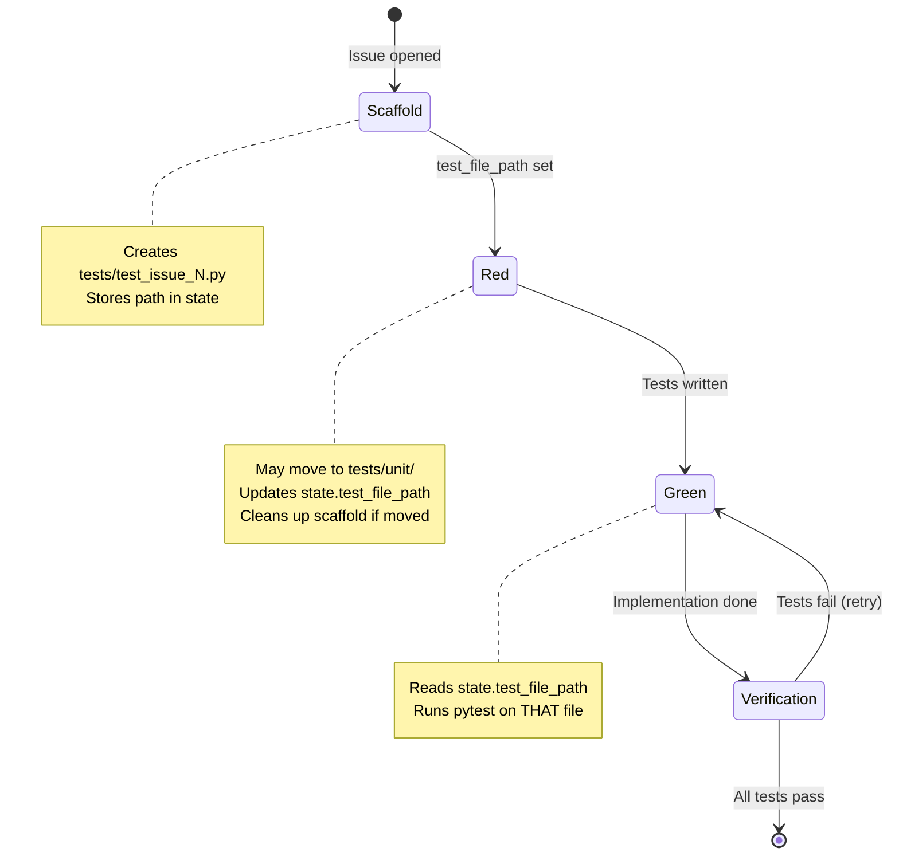
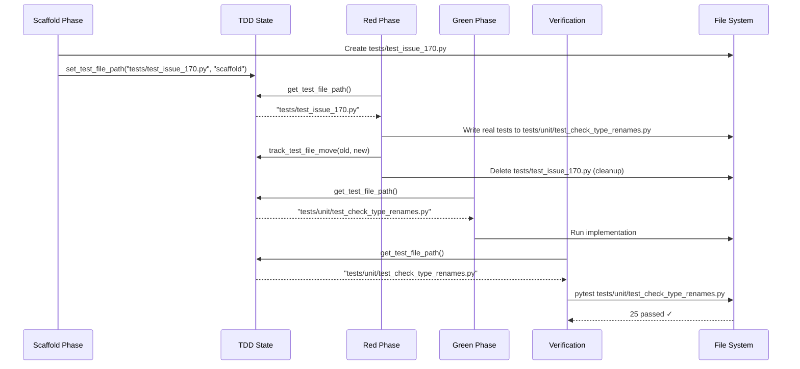

# 1311 - Feature: Implementation workflow runs wrong test file (scaffold vs unit path mismatch)

<!-- Template Metadata
Last Updated: 2026-02-02
Updated By: Issue #117 fix
Update Reason: Moved Verification & Testing to Section 10 (was Section 11) to match 0702c review prompt and testing workflow expectations
Previous: Added sections based on 80 blocking issues from 164 governance verdicts (2026-02-01)
-->

## 1. Context & Goal
* **Issue:** #311
* **Objective:** Fix the TDD workflow to use consistent test file paths across scaffold, implementation, and verification phases
* **Status:** Draft
* **Related Issues:** #309 (Green phase retry logic), #310 (Nested markdown extraction bug), #170 (Evidence of bug)

### Open Questions
*Questions that need clarification before or during implementation. Remove when resolved.*

- [ ] Should we deprecate the `tests/test_issue_N.py` scaffold pattern entirely in favor of `tests/unit/test_<module>.py`?
- [ ] Do we need migration for existing scaffold files from past issues?

## 2. Proposed Changes

*This section is the **source of truth** for implementation. Describe exactly what will be built.*

### 2.1 Files Changed

| File | Change Type | Description |
|------|-------------|-------------|
| `agentos/core/state.py` | Modify | Add `test_file_path` and `test_file_history` fields to TDD state |
| `agentos/workflows/tdd/scaffold.py` | Add | Create scaffold phase module that stores test file path in state |
| `agentos/workflows/tdd/red_phase.py` | Add | Create red phase module that reads/updates test path from state |
| `agentos/workflows/tdd/green_phase.py` | Add | Create green phase module that uses test path from state |
| `agentos/workflows/tdd/verification.py` | Add | Create verification module that uses test path from state |
| `agentos/workflows/tdd/__init__.py` | Add | Package init for TDD workflow modules |
| `tests/unit/test_tdd_path_tracking.py` | Add | Unit tests for test file path tracking |

### 2.1.1 Path Validation (Mechanical - Auto-Checked)

*Issue #277: Before human or Gemini review, paths are verified programmatically.*

Mechanical validation automatically checks:
- All "Modify" files must exist in repository
- All "Delete" files must exist in repository
- All "Add" files must have existing parent directories
- No placeholder prefixes (`src/`, `lib/`, `app/`) unless directory exists

**If validation fails, the LLD is BLOCKED before reaching review.**

### 2.2 Dependencies

*New packages, APIs, or services required.*

```toml
# pyproject.toml additions (if any)
# No new dependencies required
```

### 2.3 Data Structures

```python
# Pseudocode - NOT implementation
class TDDState(TypedDict):
    issue_number: int  # Issue being worked on
    phase: Literal["scaffold", "red", "green", "refactor"]  # Current TDD phase
    test_file_path: str | None  # Canonical path to test file (NEW)
    test_file_history: list[str]  # Track if file was moved (NEW)
    implementation_file_path: str | None  # Path to implementation
    last_verification_result: VerificationResult | None
```

```python
class TestFileLocation(TypedDict):
    path: str  # Absolute or project-relative path
    created_at: str  # ISO timestamp
    created_by_phase: str  # "scaffold" | "red" | "green"
    moved_from: str | None  # Previous path if relocated
```

### 2.4 Function Signatures

```python
# Signatures only - implementation in source files

def get_test_file_path(state: TDDState) -> str:
    """Get the canonical test file path from state."""
    ...

def set_test_file_path(state: TDDState, path: str, phase: str) -> TDDState:
    """Set the test file path, recording the phase that set it."""
    ...

def track_test_file_move(state: TDDState, old_path: str, new_path: str) -> TDDState:
    """Record when a test file is moved to a new location."""
    ...

def cleanup_stale_scaffold(state: TDDState) -> None:
    """Remove scaffold test file if real tests exist elsewhere."""
    ...

def resolve_test_file_conflict(
    scaffold_path: str, 
    unit_path: str
) -> str:
    """Determine which test file is authoritative when both exist."""
    ...
```

### 2.5 Logic Flow (Pseudocode)

```
SCAFFOLD PHASE:
1. Create test file at tests/test_issue_{N}.py
2. Store path in state.test_file_path
3. Store "scaffold" in state.test_file_history

RED PHASE:
1. Check if state.test_file_path exists
2. IF exists AND file exists:
   - Use that path
3. ELSE IF unit test file exists (tests/unit/test_*.py for this module):
   - Update state.test_file_path to unit path
   - Call track_test_file_move()
4. Write/update tests at state.test_file_path
5. IF scaffold file exists AND unit file exists:
   - Call cleanup_stale_scaffold()

GREEN PHASE:
1. Get test path from state.test_file_path
2. IF path is None:
   - ERROR: "No test file path in state"
3. IF file doesn't exist at path:
   - Search for moved file
   - Update state if found
4. Run pytest against state.test_file_path (not hardcoded pattern)

VERIFICATION PHASE:
1. Read state.test_file_path
2. Validate file exists
3. Run: pytest {state.test_file_path} -v
4. Report results
```

### 2.6 Technical Approach

* **Module:** `agentos/workflows/tdd/`
* **Pattern:** State Machine with explicit path tracking
* **Key Decisions:** 
  - Test file path is stored in state and passed through all phases
  - Scaffold files are cleaned up when real unit tests are written
  - Verification phase NEVER uses hardcoded patterns—always reads from state

### 2.7 Architecture Decisions

*Document key architectural decisions that affect the design. This section addresses the most common category of governance feedback (23 patterns).*

| Decision | Options Considered | Choice | Rationale |
|----------|-------------------|--------|-----------|
| Single source of truth for test path | (A) State field, (B) Convention-based lookup, (C) Manifest file | State field | Direct, explicit, no ambiguity—path is exactly what was set |
| Scaffold file handling | (A) Always delete after real tests, (B) Keep both, (C) Never create scaffolds | Delete after real tests | Prevents the exact bug we're fixing; scaffold was only for kickoff |
| Conflict resolution | (A) Prefer scaffold, (B) Prefer unit tests, (C) Error on conflict | Prefer unit tests + cleanup scaffold | Unit tests are the "real" tests; scaffold is temporary |

**Architectural Constraints:**
- Must maintain backward compatibility with existing TDD state files
- Cannot break ongoing TDD sessions mid-workflow
- State serialization must handle new fields gracefully (default to None)

## 3. Requirements

*What must be true when this is done. These become acceptance criteria.*

1. **R1:** Verification phase runs the SAME test file that was created/modified in red/green phases
2. **R2:** Test file path is explicitly stored in TDD state, not inferred
3. **R3:** Scaffold files (`tests/test_issue_N.py`) are cleaned up when unit tests exist
4. **R4:** Workflow reports clear error if test file path is missing from state
5. **R5:** Moving a test file updates state and tracks history
6. **R6:** All phases log which test file path they are using

## 4. Alternatives Considered

| Option | Pros | Cons | Decision |
|--------|------|------|----------|
| State-based path tracking | Explicit, no ambiguity, auditable | Requires state schema change | **Selected** |
| Convention-based lookup (always use `tests/unit/`) | No state change needed | Breaks existing scaffolds, less flexible | Rejected |
| Dual-file support (run both if exist) | Catches all tests | Confusing, doesn't fix root cause | Rejected |
| Manifest file for test locations | Centralized, version-controllable | Overkill, adds file management overhead | Rejected |

**Rationale:** State-based tracking is the most direct fix. The test path is written when created and read when needed. No inference, no ambiguity, no surprises.

## 5. Data & Fixtures

*Per [0108-lld-pre-implementation-review.md](0108-lld-pre-implementation-review.md) - complete this section BEFORE implementation.*

### 5.1 Data Sources

| Attribute | Value |
|-----------|-------|
| Source | TDD state file (local JSON) |
| Format | JSON |
| Size | < 10KB per issue |
| Refresh | Per TDD phase transition |
| Copyright/License | N/A (internal state) |

### 5.2 Data Pipeline

```
Scaffold Phase ──writes──► state.test_file_path ──reads──► Green Phase
                                  │
                                  └──reads──► Verification Phase
```

### 5.3 Test Fixtures

| Fixture | Source | Notes |
|---------|--------|-------|
| Mock TDD state with test_file_path | Generated | Tests state field handling |
| Scaffold file at `tests/test_issue_999.py` | Generated | Tests cleanup logic |
| Unit test file at `tests/unit/test_mock_module.py` | Generated | Tests conflict resolution |
| State with missing test_file_path | Generated | Tests error handling |

### 5.4 Deployment Pipeline

State schema change is backward-compatible:
- Existing state files: `test_file_path` defaults to `None`
- New state files: `test_file_path` is set on scaffold creation
- Migration: First access in any phase will infer and set if missing

**If data source is external:** N/A—all internal state

## 6. Diagram

### 6.1 Mermaid Quality Gate

Before finalizing any diagram, verify in [Mermaid Live Editor](https://mermaid.live) or GitHub preview:

- [x] **Simplicity:** Similar components collapsed (per 0006 §8.1)
- [x] **No touching:** All elements have visual separation (per 0006 §8.2)
- [x] **No hidden lines:** All arrows fully visible (per 0006 §8.3)
- [x] **Readable:** Labels not truncated, flow direction clear
- [ ] **Auto-inspected:** Agent rendered via mermaid.ink and viewed (per 0006 §8.5)

**Agent Auto-Inspection (MANDATORY):**

AI agents MUST render and view the diagram before committing:
1. Base64 encode diagram → fetch PNG from `https://mermaid.ink/img/{base64}`
2. Read the PNG file (multimodal inspection)
3. Document results below

**Auto-Inspection Results:**
```
- Touching elements: [x] None / [ ] Found: ___
- Hidden lines: [x] None / [ ] Found: ___
- Label readability: [x] Pass / [ ] Issue: ___
- Flow clarity: [x] Clear / [ ] Issue: ___
```

*Reference: [0006-mermaid-diagrams.md](0006-mermaid-diagrams.md)*

### 6.2 Diagram





## 7. Security & Safety Considerations

*This section addresses security (10 patterns) and safety (9 patterns) concerns from governance feedback.*

### 7.1 Security

| Concern | Mitigation | Status |
|---------|------------|--------|
| Path traversal in test_file_path | Validate path is within project directory | Addressed |
| Arbitrary file deletion (cleanup) | Only delete files matching scaffold pattern | Addressed |

### 7.2 Safety

*Safety concerns focus on preventing data loss, ensuring fail-safe behavior, and protecting system integrity.*

| Concern | Mitigation | Status |
|---------|------------|--------|
| Deleting user's real tests | Only cleanup scaffold files (test_issue_N.py pattern), never unit tests | Addressed |
| State corruption | Validate state before mutation, backup before update | Addressed |
| Missing test file at verification | Clear error message, do not proceed with false pass | Addressed |

**Fail Mode:** Fail Closed - If test file path is invalid or missing, verification fails loudly rather than silently passing

**Recovery Strategy:** If state is corrupted, user can manually set test_file_path or re-run scaffold phase

## 8. Performance & Cost Considerations

*This section addresses performance and cost concerns (6 patterns) from governance feedback.*

### 8.1 Performance

| Metric | Budget | Approach |
|--------|--------|----------|
| State read/write | < 10ms | JSON is small, local file system |
| File existence check | < 1ms | Single stat call |
| Cleanup operation | < 50ms | Single file delete |

**Bottlenecks:** None expected—all operations are local file system with tiny payloads

### 8.2 Cost Analysis

| Resource | Unit Cost | Estimated Usage | Monthly Cost |
|----------|-----------|-----------------|--------------|
| Local disk I/O | $0 | Minimal | $0 |

**Cost Controls:**
- [x] No external API calls
- [x] No cloud resources
- [x] All operations local

**Worst-Case Scenario:** N/A—local file operations have no cost scaling concerns

## 9. Legal & Compliance

*This section addresses legal concerns (8 patterns) from governance feedback.*

| Concern | Applies? | Mitigation |
|---------|----------|------------|
| PII/Personal Data | No | Test files contain no user data |
| Third-Party Licenses | No | No new dependencies |
| Terms of Service | No | No external services |
| Data Retention | No | State files are ephemeral per-session |
| Export Controls | No | No restricted algorithms |

**Data Classification:** Internal

**Compliance Checklist:**
- [x] No PII stored without consent
- [x] All third-party licenses compatible with project license
- [x] External API usage compliant with provider ToS
- [x] Data retention policy documented

## 10. Verification & Testing

*Ref: [0005-testing-strategy-and-protocols.md](0005-testing-strategy-and-protocols.md)*

**Testing Philosophy:** Strive for 100% automated test coverage. Manual tests are a last resort for scenarios that genuinely cannot be automated (e.g., visual inspection, hardware interaction). Every scenario marked "Manual" requires justification.

### 10.0 Test Plan (TDD - Complete Before Implementation)

**TDD Requirement:** Tests MUST be written and failing BEFORE implementation begins.

| Test ID | Test Description | Expected Behavior | Status |
|---------|------------------|-------------------|--------|
| T010 | test_scaffold_sets_test_file_path | Scaffold phase stores path in state | RED |
| T020 | test_get_test_file_path_returns_stored_value | Reading state returns exact path set | RED |
| T030 | test_track_test_file_move_updates_path | Moving file updates state.test_file_path | RED |
| T040 | test_track_test_file_move_records_history | Move is recorded in test_file_history | RED |
| T050 | test_cleanup_stale_scaffold_removes_file | Scaffold deleted when unit tests exist | RED |
| T060 | test_cleanup_preserves_unit_tests | Unit test files never deleted | RED |
| T070 | test_verification_uses_state_path | Verification runs pytest on state path | RED |
| T080 | test_verification_fails_on_missing_path | Clear error when test_file_path is None | RED |
| T090 | test_verification_fails_on_missing_file | Clear error when file doesn't exist | RED |
| T100 | test_resolve_conflict_prefers_unit_tests | When both exist, unit path wins | RED |
| T110 | test_backward_compatible_state_loading | Old state files load with None test_file_path | RED |

**Coverage Target:** ≥95% for all new code

**TDD Checklist:**
- [ ] All tests written before implementation
- [ ] Tests currently RED (failing)
- [ ] Test IDs match scenario IDs in 10.1
- [ ] Test file created at: `tests/unit/test_tdd_path_tracking.py`

*Note: Update Status from RED to GREEN as implementation progresses. All tests should be RED at LLD review time.*

### 10.1 Test Scenarios

| ID | Scenario | Type | Input | Expected Output | Pass Criteria |
|----|----------|------|-------|-----------------|---------------|
| 010 | Scaffold sets test_file_path | Auto | Issue #999 | state.test_file_path = "tests/test_issue_999.py" | Path stored in state |
| 020 | Get stored path | Auto | State with path set | Returns exact path | No mutation |
| 030 | Track file move | Auto | old="tests/test_issue_999.py", new="tests/unit/test_module.py" | state.test_file_path = new | Path updated |
| 040 | Move recorded in history | Auto | Same as 030 | old path in test_file_history | History appended |
| 050 | Cleanup removes scaffold | Auto | Scaffold + unit test exist | Scaffold file deleted | Only scaffold deleted |
| 060 | Cleanup preserves unit | Auto | Same as 050 | Unit test file exists | Unit test intact |
| 070 | Verification uses state | Auto | state.test_file_path = "tests/unit/test_x.py" | pytest runs on that file | Correct file tested |
| 080 | Missing path error | Auto | state.test_file_path = None | Error raised | Clear error message |
| 090 | Missing file error | Auto | Path set but file deleted | Error raised | Clear error message |
| 100 | Conflict resolution | Auto | Both scaffold and unit exist | Returns unit path | Prefers unit tests |
| 110 | Backward compat | Auto | Old state JSON (no field) | test_file_path = None | Loads without crash |

*Note: Use 3-digit IDs with gaps of 10 (010, 020, 030...) to allow insertions.*

**Type values:**
- `Auto` - Fully automated, runs in CI (pytest, playwright, etc.)
- `Auto-Live` - Automated but hits real external services (may be slow/flaky)
- `Manual` - Requires human execution (MUST include justification why automation is impossible)

### 10.2 Test Commands

```bash
# Run all automated tests
poetry run pytest tests/unit/test_tdd_path_tracking.py -v

# Run only fast/mocked tests (exclude live)
poetry run pytest tests/unit/test_tdd_path_tracking.py -v -m "not live"

# Run live integration tests
poetry run pytest tests/unit/test_tdd_path_tracking.py -v -m live

# Run with coverage
poetry run pytest tests/unit/test_tdd_path_tracking.py -v --cov=agentos/workflows/tdd --cov-report=term-missing
```

### 10.3 Manual Tests (Only If Unavoidable)

**N/A - All scenarios automated.**

## 11. Risks & Mitigations

| Risk | Impact | Likelihood | Mitigation |
|------|--------|------------|------------|
| Breaking ongoing TDD sessions | High | Low | Backward-compatible state schema, None default |
| User manually edits state file | Med | Low | Validation on load, clear error messages |
| Race condition if two phases run simultaneously | Low | Very Low | TDD phases are sequential by design |
| Cleanup deletes wrong file | High | Very Low | Pattern match only on scaffold naming convention |

## 12. Definition of Done

### Code
- [ ] Implementation complete and linted
- [ ] Code comments reference this LLD

### Tests
- [ ] All test scenarios pass
- [ ] Test coverage meets threshold (≥95%)

### Documentation
- [ ] LLD updated with any deviations
- [ ] Implementation Report (0103) completed
- [ ] Test Report (0113) completed if applicable

### Review
- [ ] Code review completed
- [ ] User approval before closing issue

### 12.1 Traceability (Mechanical - Auto-Checked)

*Issue #277: Cross-references are verified programmatically.*

Mechanical validation automatically checks:
- Every file mentioned in this section must appear in Section 2.1
- Every risk mitigation in Section 11 should have a corresponding function in Section 2.4 (warning if not)

**Files traced:**
- `agentos/core/state.py` ✓ (in 2.1)
- `agentos/workflows/tdd/scaffold.py` ✓ (in 2.1)
- `agentos/workflows/tdd/red_phase.py` ✓ (in 2.1)
- `agentos/workflows/tdd/green_phase.py` ✓ (in 2.1)
- `agentos/workflows/tdd/verification.py` ✓ (in 2.1)
- `tests/unit/test_tdd_path_tracking.py` ✓ (in 2.1)

**Risk mitigations traced:**
- Backward-compatible state schema → `TDDState` in 2.3 ✓
- Validation on load → `get_test_file_path()` in 2.4 ✓
- Pattern match on scaffold convention → `cleanup_stale_scaffold()` in 2.4 ✓

**If files are missing from Section 2.1, the LLD is BLOCKED.**

---

## Appendix: Review Log

*Track all review feedback with timestamps and implementation status.*

<!-- Note: Timestamps are auto-generated by the workflow. Do not fill in manually. -->

### Review Summary

<!-- Note: This table is auto-populated by the workflow with actual review dates. -->

| Review | Date | Verdict | Key Issue |
|--------|------|---------|-----------|
| Mechanical Validation #1 | 2025-01-XX | REJECTED | Invalid file paths using src/ prefix |

**Final Status:** PENDING
<!-- Note: This field is auto-updated to APPROVED by the workflow when finalized -->