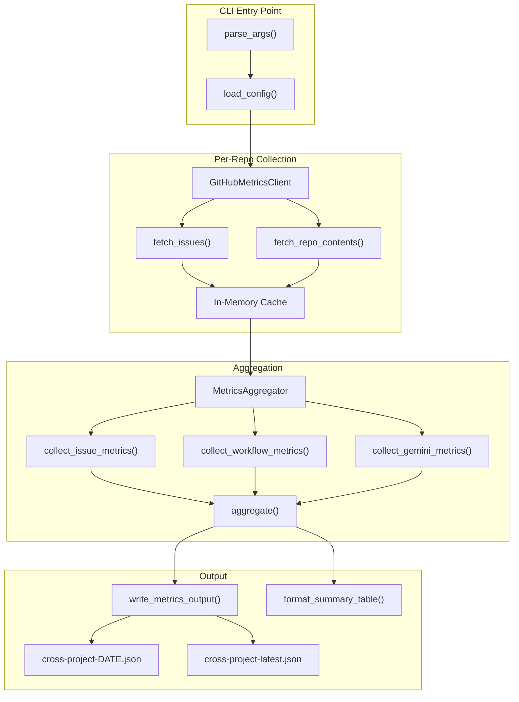
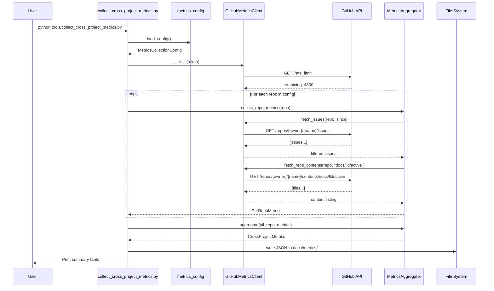

# 333 - Feature: Cross-Project Metrics Aggregation for AssemblyZero Usage Tracking

<!-- Template Metadata
Last Updated: 2026-02-17
Updated By: Issue #333 creation
Update Reason: Initial LLD for cross-project metrics aggregation
Previous: N/A
-->

## 1. Context & Goal
* **Issue:** #333
* **Objective:** Build a cross-project metrics aggregation system that collects issue velocity, workflow usage, and Gemini review outcomes across all repositories using AssemblyZero governance workflows, outputting unified metrics dashboards.
* **Status:** Draft
* **Related Issues:** None

### Open Questions
*Questions that need clarification before or during implementation. Remove when resolved.*

- [ ] Should we support GitHub Enterprise Server endpoints or just github.com?
- [ ] What is the maximum number of tracked repos we should design for (10? 50? 100+)?
- [ ] Should historical data be backfilled on first run, and if so, how far back?
- [ ] Do we need real-time webhook-based updates, or is periodic batch collection sufficient for v1?
- [ ] Should the wiki update be automated or manual for this initial implementation?

## 2. Proposed Changes

*This section is the **source of truth** for implementation. Describe exactly what will be built.*

### 2.1 Files Changed

| File | Change Type | Description |
|------|-------------|-------------|
| `tools/collect_cross_project_metrics.py` | Add | Main metrics collector script — fetches, aggregates, and outputs cross-project metrics |
| `assemblyzero/utils/metrics_config.py` | Add | Configuration loader for tracked repos list and collection settings |
| `assemblyzero/utils/github_metrics_client.py` | Add | GitHub API client wrapper for fetching issues, labels, and repo metadata with caching |
| `assemblyzero/utils/metrics_aggregator.py` | Add | Aggregation engine that combines per-repo data into unified cross-project metrics |
| `assemblyzero/utils/metrics_models.py` | Add | Pydantic-style TypedDict data structures for all metrics entities |
| `docs/metrics/` | Add (Directory) | Output directory for generated cross-project metrics JSON files |
| `docs/metrics/.gitkeep` | Add | Placeholder to ensure directory is tracked |
| `tests/unit/test_metrics_config.py` | Add | Unit tests for configuration loading and validation |
| `tests/unit/test_github_metrics_client.py` | Add | Unit tests for GitHub API client with mocked responses |
| `tests/unit/test_metrics_aggregator.py` | Add | Unit tests for aggregation logic |
| `tests/unit/test_collect_cross_project_metrics.py` | Add | Unit tests for the main collector orchestration |
| `tests/fixtures/metrics/` | Add (Directory) | Test fixtures directory for mock API responses and config files |
| `tests/fixtures/metrics/tracked_repos.json` | Add | Sample tracked repos configuration for testing |
| `tests/fixtures/metrics/mock_issues_assemblyzero.json` | Add | Mock GitHub API response for AssemblyZero issues |
| `tests/fixtures/metrics/mock_issues_rca_pdf.json` | Add | Mock GitHub API response for RCA-PDF issues |
| `tests/fixtures/metrics/expected_aggregated_output.json` | Add | Expected aggregation output for snapshot testing |
| `tests/integration/test_github_metrics_integration.py` | Add | Integration tests that hit real GitHub API (marked `integration`) |

### 2.1.1 Path Validation (Mechanical - Auto-Checked)

*Issue #277: Before human or Gemini review, paths are verified programmatically.*

Mechanical validation automatically checks:
- All "Modify" files must exist in repository — N/A (no modified files)
- All "Delete" files must exist in repository — N/A (no deleted files)
- All "Add" files must have existing parent directories — `tools/`, `assemblyzero/utils/`, `tests/unit/`, `tests/fixtures/`, `tests/integration/` all exist; `docs/metrics/` and `tests/fixtures/metrics/` are explicitly created as new directories
- No placeholder prefixes (`src/`, `lib/`, `app/`) unless directory exists — Confirmed

**If validation fails, the LLD is BLOCKED before reaching review.**

### 2.2 Dependencies

*No new packages required. All needed libraries are already in pyproject.toml:*

```toml
# Already present — no additions needed
pygithub = ">=2.8.1,<3.0.0"   # GitHub API client
orjson = ">=3.11.7,<4.0.0"     # Fast JSON serialization
tenacity = ">=9.1.3,<10.0.0"   # Retry logic for API calls
```

`PyGithub` provides the authenticated GitHub API access. `orjson` handles fast JSON serialization for metrics output. `tenacity` provides retry-with-backoff for rate-limited API calls.

### 2.3 Data Structures

```python
# assemblyzero/utils/metrics_models.py

from typing import TypedDict, Optional

class TrackedRepoConfig(TypedDict):
    """Configuration for a single tracked repository."""
    owner: str            # e.g., "martymcenroe"
    name: str             # e.g., "AssemblyZero"
    full_name: str        # e.g., "martymcenroe/AssemblyZero"
    enabled: bool         # Whether to include in collection

class MetricsCollectionConfig(TypedDict):
    """Top-level configuration for the metrics collector."""
    repos: list[TrackedRepoConfig]
    lookback_days: int              # How far back to fetch (default: 30)
    output_dir: str                 # Path for output files
    cache_ttl_seconds: int          # How long to cache API responses (default: 300)
    github_token_env: str           # Environment variable name for token

class RepoIssueMetrics(TypedDict):
    """Issue velocity metrics for a single repository."""
    repo: str                       # Full repo name
    period_start: str               # ISO 8601 date
    period_end: str                 # ISO 8601 date
    issues_opened: int
    issues_closed: int
    issues_open_current: int        # Currently open
    avg_close_time_hours: Optional[float]  # Average time to close
    issues_by_label: dict[str, int]        # Label -> count

class RepoWorkflowMetrics(TypedDict):
    """Workflow usage metrics for a single repository."""
    repo: str
    lld_count: int                  # Count of docs/lld/ folders or files
    requirements_workflows: int     # Issues with requirements workflow evidence
    implementation_workflows: int   # Issues with implementation evidence
    tdd_workflows: int              # Issues with TDD evidence
    report_count: int               # Count of docs/reports/ entries

class RepoGeminiMetrics(TypedDict):
    """Gemini review outcome metrics for a single repository."""
    repo: str
    total_reviews: int
    approvals: int
    blocks: int
    approval_rate: Optional[float]  # approvals / total_reviews

class PerRepoMetrics(TypedDict):
    """Combined metrics for a single repository."""
    repo: str
    issues: RepoIssueMetrics
    workflows: RepoWorkflowMetrics
    gemini: RepoGeminiMetrics

class CrossProjectMetrics(TypedDict):
    """Aggregated metrics across all tracked repositories."""
    generated_at: str               # ISO 8601 timestamp
    period_start: str               # ISO 8601 date
    period_end: str                 # ISO 8601 date
    repos_tracked: int
    repos_collected: int            # repos successfully fetched
    repos_failed: list[str]         # repos that failed collection
    totals: "AggregateTotals"
    per_repo: list[PerRepoMetrics]

class AggregateTotals(TypedDict):
    """Aggregate totals across all repos."""
    issues_opened: int
    issues_closed: int
    issues_open_current: int
    avg_close_time_hours: Optional[float]
    lld_count: int
    total_workflows: int
    gemini_reviews: int
    gemini_approval_rate: Optional[float]
    report_count: int
```

### 2.4 Function Signatures

```python
# assemblyzero/utils/metrics_config.py

def load_config(config_path: str | None = None) -> MetricsCollectionConfig:
    """Load and validate tracked repos configuration.

    Searches in order:
    1. Explicit config_path argument
    2. ASSEMBLYZERO_METRICS_CONFIG environment variable
    3. ~/.assemblyzero/tracked_repos.json
    4. ./tracked_repos.json (project root)

    Raises:
        FileNotFoundError: If no config file found at any location.
        ValueError: If config file is malformed or fails validation.
    """
    ...

def validate_config(config: dict) -> MetricsCollectionConfig:
    """Validate raw config dict against expected schema.

    Checks:
    - 'repos' key exists and is a non-empty list
    - Each repo entry has owner/name or full_name
    - lookback_days is positive integer
    - output_dir is writable

    Raises:
        ValueError: On validation failure with descriptive message.
    """
    ...

def parse_repo_string(repo_str: str) -> TrackedRepoConfig:
    """Parse 'owner/name' string into TrackedRepoConfig.

    Args:
        repo_str: Repository identifier like 'martymcenroe/AssemblyZero'

    Returns:
        TrackedRepoConfig with owner, name, full_name, enabled=True

    Raises:
        ValueError: If string doesn't match 'owner/name' format.
    """
    ...
```

```python
# assemblyzero/utils/github_metrics_client.py

from github import Github
from tenacity import retry, stop_after_attempt, wait_exponential

class GitHubMetricsClient:
    """GitHub API client for metrics collection with caching and rate-limit awareness."""

    def __init__(self, token: str | None = None, cache_ttl: int = 300) -> None:
        """Initialize client with optional token and cache TTL.

        Args:
            token: GitHub personal access token. If None, reads from
                   GITHUB_TOKEN or GH_TOKEN environment variables.
            cache_ttl: Cache time-to-live in seconds.

        Raises:
            ValueError: If no token available and accessing private repos.
        """
        ...

    @retry(stop=stop_after_attempt(3), wait=wait_exponential(multiplier=1, max=30))
    def fetch_issues(
        self,
        repo_full_name: str,
        since: str,
        state: str = "all",
    ) -> list[dict]:
        """Fetch issues from a repository within a date range.

        Args:
            repo_full_name: 'owner/name' format
            since: ISO 8601 date string for lookback start
            state: 'open', 'closed', or 'all'

        Returns:
            List of issue dicts with: number, title, state, created_at,
            closed_at, labels, pull_request (to distinguish PRs)

        Raises:
            github.GithubException: On API errors after retries exhausted.
        """
        ...

    @retry(stop=stop_after_attempt(3), wait=wait_exponential(multiplier=1, max=30))
    def fetch_repo_contents(
        self,
        repo_full_name: str,
        path: str,
    ) -> list[dict]:
        """Fetch directory contents from a repository.

        Used to count LLD files, report directories, and verdict files.

        Args:
            repo_full_name: 'owner/name' format
            path: Repository-relative path (e.g., 'docs/lld/active')

        Returns:
            List of content dicts with: name, type, path, size

        Raises:
            github.GithubException: On API errors (404 returns empty list).
        """
        ...

    def get_rate_limit_remaining(self) -> dict:
        """Get current GitHub API rate limit status.

        Returns:
            Dict with 'remaining', 'limit', 'reset_at' keys.
        """
        ...

    def _filter_issues_only(self, items: list[dict]) -> list[dict]:
        """Filter out pull requests from issue list.

        GitHub API returns PRs in the issues endpoint. This filters them out
        by checking for the 'pull_request' key.
        """
        ...
```

```python
# assemblyzero/utils/metrics_aggregator.py

class MetricsAggregator:
    """Aggregates per-repo metrics into cross-project totals."""

    def __init__(self, client: "GitHubMetricsClient", config: MetricsCollectionConfig) -> None:
        """Initialize aggregator with API client and config.

        Args:
            client: Configured GitHubMetricsClient instance.
            config: Validated MetricsCollectionConfig.
        """
        ...

    def collect_repo_metrics(self, repo: TrackedRepoConfig) -> PerRepoMetrics:
        """Collect all metrics for a single repository.

        Orchestrates calls to collect issue, workflow, and Gemini metrics.
        If any sub-collection fails, that section returns zero/empty values
        rather than failing the entire repo collection.

        Args:
            repo: Repository configuration.

        Returns:
            PerRepoMetrics with all collected data.
        """
        ...

    def collect_issue_metrics(
        self, repo_full_name: str, since: str, until: str
    ) -> RepoIssueMetrics:
        """Collect issue velocity metrics for a repository.

        Args:
            repo_full_name: 'owner/name' format
            since: Period start (ISO 8601)
            until: Period end (ISO 8601)

        Returns:
            RepoIssueMetrics with counts, averages, and label breakdowns.
        """
        ...

    def collect_workflow_metrics(self, repo_full_name: str) -> RepoWorkflowMetrics:
        """Collect workflow usage metrics by inspecting repo contents.

        Checks for:
        - docs/lld/active/ or docs/lld/ (LLD files)
        - docs/reports/ (report directories)
        - Workflow labels on issues (requirements, implementation, tdd)

        Args:
            repo_full_name: 'owner/name' format

        Returns:
            RepoWorkflowMetrics with counts per workflow type.
        """
        ...

    def collect_gemini_metrics(self, repo_full_name: str) -> RepoGeminiMetrics:
        """Collect Gemini review outcome metrics.

        Inspects verdict files in the repository for APPROVE/BLOCK counts.
        Looks in standard locations:
        - docs/lld/active/*.md (for embedded verdicts)
        - docs/reports/*/gemini-verdict.json
        - .gemini-reviews/ (if present)

        Args:
            repo_full_name: 'owner/name' format

        Returns:
            RepoGeminiMetrics with review counts and approval rate.
        """
        ...

    def aggregate(self, per_repo_results: list[PerRepoMetrics]) -> CrossProjectMetrics:
        """Aggregate per-repo metrics into cross-project totals.

        Args:
            per_repo_results: List of successfully collected repo metrics.

        Returns:
            CrossProjectMetrics with totals and per-repo breakdown.
        """
        ...

    def _calculate_aggregate_close_time(
        self, per_repo: list[PerRepoMetrics]
    ) -> float | None:
        """Calculate weighted average close time across repos.

        Weights by number of closed issues per repo.
        Returns None if no closed issues across all repos.
        """
        ...
```

```python
# tools/collect_cross_project_metrics.py

def main(
    config_path: str | None = None,
    output_path: str | None = None,
    lookback_days: int | None = None,
    dry_run: bool = False,
) -> int:
    """Main entry point for cross-project metrics collection.

    Args:
        config_path: Override config file location.
        output_path: Override output file location.
        lookback_days: Override lookback period from config.
        dry_run: If True, print config and exit without collecting.

    Returns:
        Exit code: 0 for success, 1 for partial failure, 2 for total failure.
    """
    ...

def write_metrics_output(
    metrics: "CrossProjectMetrics",
    output_dir: str,
    output_path: str | None = None,
) -> str:
    """Write aggregated metrics to JSON file.

    Default filename: cross-project-{YYYY-MM-DD}.json
    Also writes/overwrites cross-project-latest.json as a symlink/copy.

    Args:
        metrics: Aggregated cross-project metrics.
        output_dir: Base directory for output.
        output_path: Explicit full path override.

    Returns:
        Path to the written file.

    Raises:
        OSError: If output directory is not writable.
    """
    ...

def format_summary_table(metrics: "CrossProjectMetrics") -> str:
    """Format metrics as a human-readable summary table for stdout.

    Args:
        metrics: Aggregated cross-project metrics.

    Returns:
        Formatted multi-line string with aligned columns.
    """
    ...

def parse_args(argv: list[str] | None = None) -> "argparse.Namespace":
    """Parse command-line arguments.

    Args:
        argv: Argument list (defaults to sys.argv[1:]).

    Returns:
        Parsed namespace with config_path, output, lookback_days, dry_run, verbose.
    """
    ...
```

### 2.5 Logic Flow (Pseudocode)

```
MAIN COLLECTION FLOW:
1. Parse CLI arguments (--config, --output, --lookback-days, --dry-run, --verbose)
2. Load and validate config from file
   - Search config file locations in priority order
   - Parse JSON, validate schema
   - IF dry_run: print config summary, exit 0
3. Initialize GitHubMetricsClient
   - Read token from GITHUB_TOKEN or GH_TOKEN env var
   - Verify authentication with rate limit check
   - IF no token AND private repos configured: exit 2 with error
4. Check rate limit budget
   - GET /rate_limit
   - IF remaining < (repos * 10): warn about potential rate limiting
5. FOR each enabled repo in config:
   a. TRY collect_repo_metrics(repo)
      i.   Fetch issues since (today - lookback_days)
      ii.  Filter out pull requests
      iii. Calculate issue velocity (opened, closed, avg close time)
      iv.  Group issues by label for workflow detection
      v.   Fetch repo contents for LLD/report/verdict counting
      vi.  Collect Gemini verdict files and parse APPROVE/BLOCK
   b. CATCH API errors:
      - Log warning with repo name and error
      - Add repo to repos_failed list
      - Continue to next repo (partial failure is acceptable)
   c. Append PerRepoMetrics to results list
6. Aggregate per-repo results into CrossProjectMetrics
   - Sum totals across repos
   - Calculate weighted averages
   - Build per_repo breakdown
7. Write output
   - JSON to docs/metrics/cross-project-{date}.json
   - Copy to docs/metrics/cross-project-latest.json
   - Print summary table to stdout
8. Return exit code
   - 0: all repos collected successfully
   - 1: some repos failed (partial success)
   - 2: all repos failed or config error

WORKFLOW DETECTION LOGIC:
1. Check for LLD files:
   - Try docs/lld/active/ first
   - Fallback to docs/lld/
   - Count .md files
2. Check for reports:
   - List docs/reports/ subdirectories
   - Count directories (each represents one issue's reports)
3. Check for workflow labels on issues:
   - "requirements" or "lld" label → requirements workflow
   - "implementation" label → implementation workflow
   - "tdd" or "testing" label → TDD workflow
4. Check for Gemini verdicts:
   - Search docs/reports/*/gemini-verdict* files
   - Parse JSON for "verdict" field
   - Count APPROVE vs BLOCK

CACHING STRATEGY:
1. In-memory dict keyed by (repo, endpoint, params_hash)
2. TTL-based expiration (default 300s)
3. Cache hit → return cached, skip API call
4. Cache miss or expired → make API call, store result
5. Cache is session-scoped (not persisted to disk in v1)
```

### 2.6 Technical Approach

* **Module:** `assemblyzero/utils/` for reusable components, `tools/` for CLI entry point
* **Pattern:** Collector → Aggregator → Writer pipeline, with per-repo fault isolation
* **Key Decisions:**
  - **PyGithub over raw requests:** PyGithub is already a dependency and handles pagination, auth, and rate limiting natively
  - **TypedDict over dataclass:** Consistent with existing AssemblyZero patterns (e.g., LangGraph state types)
  - **In-memory caching over disk:** Simpler for v1; disk caching can be added later
  - **orjson over json:** Already a dependency, faster serialization for metrics output
  - **Fault isolation per repo:** One failing repo should never block collection of others

### 2.7 Architecture Decisions

*Document key architectural decisions that affect the design.*

| Decision | Options Considered | Choice | Rationale |
|----------|-------------------|--------|-----------|
| Config location | Env var only, CLI arg only, multi-location search | Multi-location search with CLI override | Flexible for CI, local dev, and scripted use |
| API client | Raw `requests`, `httpx`, `PyGithub` | `PyGithub` | Already a dependency; handles pagination and auth |
| Metrics output format | CSV, JSON, SQLite | JSON | Human-readable, parseable, compatible with wiki/dashboard |
| Failure mode | Fail-fast on first error, Partial collection | Partial collection | Cross-project aggregation should degrade gracefully |
| Workflow detection | Label-only, Content-only, Both | Both (labels + content) | Labels are fast (issue metadata), content provides ground truth |
| Caching layer | None, In-memory, Disk-based (shelve/sqlite) | In-memory with TTL | Simplest for batch runs; disk caching is premature optimization |

**Architectural Constraints:**
- Must work with existing `pygithub` dependency version (>=2.8.1,<3.0.0)
- Must not store GitHub tokens in any output or log file
- Must handle repositories that don't follow AssemblyZero conventions (missing dirs = zero counts, not errors)
- Must be runnable standalone (`python tools/collect_cross_project_metrics.py`) without full LangGraph setup

## 3. Requirements

*What must be true when this is done. These become acceptance criteria.*

1. **R1 — Config-driven repo list:** The collector reads a JSON configuration file listing repositories to track, supporting `owner/name` format
2. **R2 — Issue velocity aggregation:** Collects issues opened and closed across all configured repos within a configurable lookback period
3. **R3 — Workflow detection:** Identifies which AssemblyZero workflows (requirements, implementation, TDD) are used per repo via labels and content inspection
4. **R4 — Gemini metrics:** Counts Gemini review verdicts (APPROVE/BLOCK) per repo from verdict files in standard locations
5. **R5 — Combined output:** Produces a single JSON file with per-repo breakdown and cross-project aggregate totals
6. **R6 — Fault isolation:** Failure to collect from one repo does not prevent collection from others; partial results are output with failures listed
7. **R7 — Rate limit awareness:** Checks available API budget before starting; warns if insufficient; uses retry-with-backoff on 429 errors
8. **R8 — Private repo support:** Works with private repositories when a valid GitHub token is provided via environment variable
9. **R9 — Minimal API calls:** Batches requests where possible; caches responses within a session to avoid redundant calls
10. **R10 — CLI interface:** Supports `--config`, `--output`, `--lookback-days`, `--dry-run`, and `--verbose` flags
11. **R11 — Latest symlink:** Writes both a dated file and a `cross-project-latest.json` for easy consumption by dashboards/wiki
12. **R12 — Human-readable summary:** Prints a formatted summary table to stdout after collection completes

## 4. Alternatives Considered

| Option | Pros | Cons | Decision |
|--------|------|------|----------|
| A: Python script with PyGithub | Uses existing dependency; full pagination support; handles auth natively; typed API | Adds complexity vs raw HTTP | **Selected** |
| B: Shell script with `gh api` | Simple; uses existing `gh` CLI; no Python dependencies | No pagination control; harder to parse/aggregate; no caching; brittle JSON parsing with jq | Rejected |
| C: GitHub Actions workflow with artifact collection | Runs on schedule; no local setup needed | Harder to debug; requires Actions minutes; complex cross-repo artifact passing; delayed feedback | Rejected |
| D: GraphQL API (direct) | Fewer API calls via batched queries; can fetch multiple repos in one call | PyGithub doesn't support GraphQL; would need separate client; more complex query construction | Rejected for v1 — consider for v2 |

**Rationale:** Option A was selected because PyGithub is already a dependency, provides robust pagination and authentication handling, and the Python ecosystem allows clean separation of collection/aggregation/output concerns. The shell script approach (B) would be brittle for the complex aggregation logic needed. GitHub Actions (C) adds CI complexity without local developer experience. GraphQL (D) is a valid optimization for v2 but introduces unnecessary complexity for the initial implementation.

## 5. Data & Fixtures

*Per [0108-lld-pre-implementation-review.md](0108-lld-pre-implementation-review.md) - complete this section BEFORE implementation.*

### 5.1 Data Sources

| Attribute | Value |
|-----------|-------|
| Source | GitHub REST API v3 via PyGithub |
| Format | JSON (API responses → TypedDict in Python → orjson output) |
| Size | ~50-500 issues per repo per 30-day window; ~10-50 content entries per directory listing |
| Refresh | On-demand (CLI invocation); could be scheduled via cron or GitHub Actions |
| Copyright/License | GitHub API Terms of Service; data is user's own repositories |

### 5.2 Data Pipeline

```
GitHub API ──PyGithub──► Per-Repo Raw Data ──MetricsAggregator──► CrossProjectMetrics ──orjson──► JSON File
                              │                                          │
                              └── In-memory cache (TTL)                  └── stdout summary table
```

### 5.3 Test Fixtures

| Fixture | Source | Notes |
|---------|--------|-------|
| `tests/fixtures/metrics/tracked_repos.json` | Handcrafted | Sample config with 3 repos (1 enabled, 1 disabled, 1 nonexistent) |
| `tests/fixtures/metrics/mock_issues_assemblyzero.json` | Generated from real API shape | 15 issues: mix of open/closed, various labels, some PRs to filter |
| `tests/fixtures/metrics/mock_issues_rca_pdf.json` | Generated from real API shape | 8 issues: smaller repo, fewer workflow labels |
| `tests/fixtures/metrics/expected_aggregated_output.json` | Derived from mock inputs | Snapshot of expected CrossProjectMetrics for the mock data |

### 5.4 Deployment Pipeline

- **Dev:** Run locally: `python tools/collect_cross_project_metrics.py --config ./tracked_repos.json`
- **CI:** Can be added as a scheduled GitHub Actions workflow (out of scope for this issue, noted for follow-up)
- **Production:** Output files committed to `docs/metrics/` on main branch; wiki updated manually for v1

**If data source is external:** No separate utility needed. GitHub API is accessed directly via PyGithub with authenticated tokens.

## 6. Diagram

### 6.1 Mermaid Quality Gate

Before finalizing any diagram, verify in [Mermaid Live Editor](https://mermaid.live) or GitHub preview:

- [x] **Simplicity:** Similar components collapsed (per 0006 §8.1)
- [x] **No touching:** All elements have visual separation (per 0006 §8.2)
- [x] **No hidden lines:** All arrows fully visible (per 0006 §8.3)
- [x] **Readable:** Labels not truncated, flow direction clear
- [ ] **Auto-inspected:** Agent rendered via mermaid.ink and viewed (per 0006 §8.5)

**Auto-Inspection Results:**
```
- Touching elements: [ ] None / [ ] Found: ___
- Hidden lines: [ ] None / [ ] Found: ___
- Label readability: [ ] Pass / [ ] Issue: ___
- Flow clarity: [ ] Clear / [ ] Issue: ___
```

*Reference: [0006-mermaid-diagrams.md](0006-mermaid-diagrams.md)*

### 6.2 Diagram





## 7. Security & Safety Considerations

### 7.1 Security

| Concern | Mitigation | Status |
|---------|------------|--------|
| GitHub token exposure in logs | Token is read from env var only; never logged, never written to output files; `repr()` on client object masks token | Addressed |
| GitHub token exposure in config | Config file stores repo names only, never tokens; token sourced from `GITHUB_TOKEN` / `GH_TOKEN` env var | Addressed |
| Token in output JSON | `CrossProjectMetrics` TypedDict has no field for tokens; serialization only includes defined fields | Addressed |
| Unauthorized repo access | PyGithub raises `UnknownObjectException` (404) for repos the token can't access; caught and added to `repos_failed` | Addressed |
| API rate limit abuse | Pre-flight rate limit check; exponential backoff on 429; warn if budget is insufficient for planned requests | Addressed |
| Config file injection | Config is JSON-parsed (no code execution); repo names are validated against `^[a-zA-Z0-9._-]+/[a-zA-Z0-9._-]+$` regex | Addressed |

### 7.2 Safety

| Concern | Mitigation | Status |
|---------|------------|--------|
| Partial data on API failure | Per-repo fault isolation; failed repos tracked in `repos_failed` list; exit code 1 signals partial failure | Addressed |
| Output file overwrite | Dated filenames prevent overwrites; `latest.json` is intentionally overwritten as a convenience pointer | Addressed |
| Large API response handling | PyGithub handles pagination internally; we process issues iteratively, not loading all into memory at once | Addressed |
| Stale cache serving wrong data | Cache is session-scoped (in-memory only); new invocation starts fresh; TTL prevents intra-session staleness | Addressed |
| Config file not found | Clear FileNotFoundError with message listing all searched locations | Addressed |

**Fail Mode:** Fail Open (partial results) — If individual repos fail, we still produce output with available data. Total failure (no repos succeed or config error) returns exit code 2.

**Recovery Strategy:** Re-run the script. All operations are read-only against GitHub API and idempotent for file output. No state to corrupt.

## 8. Performance & Cost Considerations

### 8.1 Performance

| Metric | Budget | Approach |
|--------|--------|----------|
| API calls per repo | ≤ 10 | 1 for issues (paginated), 2-4 for content listings (lld, reports, verdicts), 1 for rate limit |
| Total API calls (3 repos) | ≤ 35 | 10 per repo + 1 rate limit check + buffer |
| Execution time (3 repos) | < 30 seconds | Pagination is the bottleneck; repos with <100 issues need 1 page |
| Memory usage | < 50 MB | Issues are processed per-repo; only aggregated result held in memory |

**Bottlenecks:**
- Repos with many issues (>500) will require multiple paginated API calls
- Content listing API calls are sequential (one per directory path)
- Network latency is the primary constraint, not computation

### 8.2 Cost Analysis

| Resource | Unit Cost | Estimated Usage | Monthly Cost |
|----------|-----------|-----------------|--------------|
| GitHub API (authenticated) | Free (5000 req/hour) | ~35 requests per run | $0 |
| GitHub API (unauthenticated) | Free (60 req/hour) | N/A (auth required for private repos) | $0 |
| Disk storage (JSON output) | ~10-50 KB per file | ~1-2 files per run | Negligible |
| Compute | Local machine | On-demand | $0 |

**Cost Controls:**
- [x] Budget alerts: Pre-flight rate limit check warns if < 100 remaining
- [x] Rate limiting: tenacity retry with exponential backoff prevents burst abuse
- [x] In-memory caching prevents redundant calls within a single run

**Worst-Case Scenario:**
- 10x repos (30 repos): ~350 API calls, still well within 5000/hour limit, execution ~2-3 minutes
- 100x repos: ~3500 API calls, approaching limit; would need to add sequential delays or spread across multiple runs. This is beyond current design scope.

## 9. Legal & Compliance

| Concern | Applies? | Mitigation |
|---------|----------|------------|
| PII/Personal Data | No | Issue metadata (titles, labels, dates) does not contain PII. Usernames are public GitHub identifiers. |
| Third-Party Licenses | No | PyGithub is LGPL-3.0 (compatible). No new dependencies added. |
| Terms of Service | Yes | GitHub API usage follows API Terms of Service; authenticated access; respecting rate limits |
| Data Retention | N/A | Output JSON files are committed to repo; retention follows git history. No separate data store. |
| Export Controls | No | No restricted algorithms or data |

**Data Classification:** Internal (metrics about our own repos)

**Compliance Checklist:**
- [x] No PII stored without consent — N/A, no PII collected
- [x] All third-party licenses compatible with project license — PyGithub LGPL-3.0 compatible
- [x] External API usage compliant with provider ToS — GitHub API rate limits respected
- [x] Data retention policy documented — JSON files in git, subject to repo retention

## 10. Verification & Testing

*Ref: [0005-testing-strategy-and-protocols.md](0005-testing-strategy-and-protocols.md)*

**Testing Philosophy:** Strive for 100% automated test coverage. All GitHub API interactions are mocked in unit tests. Integration tests are marked with `integration` marker and excluded from default CI runs.

### 10.0 Test Plan (TDD - Complete Before Implementation)

**TDD Requirement:** Tests MUST be written and failing BEFORE implementation begins.

| Test ID | Test Description | Expected Behavior | Status |
|---------|------------------|-------------------|--------|
| T010 | Config loading from explicit path | Returns valid MetricsCollectionConfig | RED |
| T020 | Config loading fallback chain | Searches locations in priority order | RED |
| T030 | Config validation rejects empty repos | Raises ValueError | RED |
| T040 | Config validation rejects malformed repo string | Raises ValueError for "invalid" | RED |
| T050 | parse_repo_string parses valid input | Returns correct TrackedRepoConfig | RED |
| T060 | GitHubMetricsClient filters out PRs | Issues-only list returned | RED |
| T070 | GitHubMetricsClient handles 404 gracefully | Returns empty list for missing content | RED |
| T080 | GitHubMetricsClient retries on 429 | Succeeds after retry with backoff | RED |
| T090 | Issue metrics calculation (happy path) | Correct opened/closed/avg counts | RED |
| T100 | Issue metrics with zero issues | Returns zero counts, None avg time | RED |
| T110 | Workflow detection from labels | Correct workflow type counts | RED |
| T120 | Workflow detection from content listing | Correct LLD and report counts | RED |
| T130 | Gemini metrics from verdict files | Correct approve/block counts and rate | RED |
| T140 | Gemini metrics with no verdicts | Returns zeros and None rate | RED |
| T150 | Aggregation across multiple repos | Correct totals and weighted averages | RED |
| T160 | Aggregation with failed repos | Failed repos listed, successful ones aggregated | RED |
| T170 | Main function dry-run mode | Prints config, exits 0, no API calls | RED |
| T180 | Main function partial failure exit code | Returns 1 when some repos fail | RED |
| T190 | Main function total failure exit code | Returns 2 when all repos fail | RED |
| T200 | Output file naming | Correct date-stamped filename | RED |
| T210 | Output latest.json creation | latest.json exists alongside dated file | RED |
| T220 | Summary table formatting | Readable aligned output | RED |
| T230 | Rate limit pre-flight warning | Logs warning when remaining < threshold | RED |

**Coverage Target:** ≥95% for all new code

**TDD Checklist:**
- [ ] All tests written before implementation
- [ ] Tests currently RED (failing)
- [ ] Test IDs match scenario IDs in 10.1
- [ ] Test files created at:
  - `tests/unit/test_metrics_config.py`
  - `tests/unit/test_github_metrics_client.py`
  - `tests/unit/test_metrics_aggregator.py`
  - `tests/unit/test_collect_cross_project_metrics.py`

### 10.1 Test Scenarios

| ID | Scenario | Type | Input | Expected Output | Pass Criteria |
|----|----------|------|-------|-----------------|---------------|
| 010 | Config load from explicit path | Auto | Path to valid fixture JSON | MetricsCollectionConfig with 3 repos | Config returned with correct repo count |
| 020 | Config fallback to env var | Auto | ASSEMBLYZERO_METRICS_CONFIG env var set | Config loaded from env var path | Config matches expected fixture |
| 030 | Config rejects empty repos list | Auto | JSON with `"repos": []` | ValueError raised | Exception message mentions "repos" |
| 040 | Config rejects invalid repo format | Auto | JSON with `"repos": ["not-valid"]` | ValueError raised | Exception message mentions format |
| 050 | parse_repo_string happy path | Auto | `"martymcenroe/AssemblyZero"` | TrackedRepoConfig(owner="martymcenroe", name="AssemblyZero", ...) | All fields correctly populated |
| 060 | Client filters PRs from issues | Auto | Mock response with 10 issues, 3 PRs | List of 7 items | All items lack `pull_request` key |
| 070 | Client returns empty on 404 | Auto | Mock 404 response for content listing | Empty list `[]` | No exception raised, empty list returned |
| 080 | Client retries on rate limit | Auto | Mock 429 then 200 responses | Successful result after retry | tenacity retries exactly once before success |
| 090 | Issue metrics happy path | Auto | 15 mock issues (10 closed, 5 open) | RepoIssueMetrics with opened=15, closed=10 | Counts match, avg_close_time is float |
| 100 | Issue metrics zero issues | Auto | Empty issues list | RepoIssueMetrics all zeros | avg_close_time is None |
| 110 | Workflow detection from labels | Auto | Issues with "requirements", "tdd" labels | requirements_workflows=3, tdd_workflows=2 | Counts match label occurrences |
| 120 | Workflow detection from content | Auto | Mock content listing for docs/lld/active/ with 5 .md files | lld_count=5 | Count matches directory listing |
| 130 | Gemini verdict counting | Auto | Mock verdict files: 4 APPROVE, 1 BLOCK | total=5, approvals=4, blocks=1, rate=0.8 | All counts and rate correct |
| 140 | Gemini no verdicts | Auto | Empty verdict directory | total=0, approvals=0, rate=None | Zero counts, None rate |
| 150 | Cross-repo aggregation | Auto | 2 PerRepoMetrics fixtures | Correct summed totals | Total opened = sum of per-repo opened |
| 160 | Aggregation with failures | Auto | 1 success, 1 failure repo | repos_collected=1, repos_failed=["owner/failed"] | Successful repo data present, failed repo listed |
| 170 | Dry run mode | Auto | `--dry-run` flag | Exit code 0, config printed to stdout | No GitHubMetricsClient instantiated |
| 180 | Partial failure exit code | Auto | 2 repos: 1 succeeds, 1 raises exception | Exit code 1 | Output file still written with partial data |
| 190 | Total failure exit code | Auto | All repos raise exceptions | Exit code 2 | No output file written, error printed |
| 200 | Output file naming | Auto | Metrics with generated_at="2026-02-17T..." | Filename: `cross-project-2026-02-17.json` | File exists at expected path |
| 210 | Latest JSON creation | Auto | Any valid metrics | `cross-project-latest.json` exists | Content matches dated file |
| 220 | Summary table format | Auto | Sample CrossProjectMetrics | Multi-line string with repo names and counts | Contains all repo names and total row |
| 230 | Rate limit warning | Auto | Mock rate_limit returning remaining=50 | Warning logged | Log message contains "rate limit" |

### 10.2 Test Commands

```bash
# Run all unit tests for this feature
poetry run pytest tests/unit/test_metrics_config.py tests/unit/test_github_metrics_client.py tests/unit/test_metrics_aggregator.py tests/unit/test_collect_cross_project_metrics.py -v

# Run with coverage
poetry run pytest tests/unit/test_metrics_config.py tests/unit/test_github_metrics_client.py tests/unit/test_metrics_aggregator.py tests/unit/test_collect_cross_project_metrics.py -v --cov=assemblyzero.utils --cov-report=term-missing

# Run integration tests (requires GITHUB_TOKEN)
poetry run pytest tests/integration/test_github_metrics_integration.py -v -m integration

# Run everything except integration and e2e (default CI)
poetry run pytest -v
```

### 10.3 Manual Tests (Only If Unavoidable)

**N/A - All scenarios automated.**

The integration test (`test_github_metrics_integration.py`) validates real API access with the `integration` marker. All unit tests use mocked GitHub responses. No manual testing is required.

## 11. Risks & Mitigations

| Risk | Impact | Likelihood | Mitigation |
|------|--------|------------|------------|
| GitHub API rate limit exhaustion during collection | Med — Collection fails mid-run | Low — 5000 req/hour is generous for <10 repos | Pre-flight rate limit check; exponential backoff; warn user before starting if budget is low |
| Repos don't follow AssemblyZero directory conventions | Low — Workflow/Gemini metrics show zeros | Med — RCA-PDF and dispatch may differ | Graceful handling: missing dirs return empty lists, not errors; document expected conventions |
| PyGithub version incompatibility | High — Client doesn't work | Low — Version is pinned | Pinned to >=2.8.1,<3.0.0; tested in CI |
| Token not available for private repos | Med — Private repos return 404 | Med — Token may not be set in all environments | Clear error message listing env vars checked; `--dry-run` validates config without token |
| GitHub API response format changes | Med — Parsing breaks | Low — REST v3 is stable | TypedDict contracts catch shape mismatches; integration tests catch real API changes |
| Config file grows stale (repos renamed/deleted) | Low — Failed repos listed in output | Med — Repos may be archived | `repos_failed` list in output makes staleness visible; periodic config review recommended |
| Large repos with thousands of issues cause slowness | Med — Collection takes minutes | Low — Current repos are small | `lookback_days` limits scope; pagination handles large result sets without memory issues |

## 12. Definition of Done

### Code
- [ ] Implementation complete and linted (`mypy`, PEP 8)
- [ ] Code comments reference this LLD (#333)
- [ ] All four source modules created in `assemblyzero/utils/`
- [ ] CLI entry point functional at `tools/collect_cross_project_metrics.py`
- [ ] Config file example created at project root or documented in README

### Tests
- [ ] All 23 test scenarios pass (T010–T230)
- [ ] Test coverage ≥ 95% for all new code
- [ ] Integration test passes with real GitHub token
- [ ] Fixtures created in `tests/fixtures/metrics/`

### Documentation
- [ ] LLD updated with any deviations from design
- [ ] Implementation Report (0103) completed
- [ ] Test Report (0113) completed
- [ ] `tools/collect_cross_project_metrics.py --help` provides usage documentation

### Review
- [ ] Gemini LLD review passed
- [ ] Code review completed
- [ ] User approval before closing issue

### 12.1 Traceability (Mechanical - Auto-Checked)

*Issue #277: Cross-references are verified programmatically.*

Mechanical validation automatically checks:
- Every file mentioned in this section must appear in Section 2.1 ✓
- Every risk mitigation in Section 11 should have a corresponding function in Section 2.4:
  - Rate limit: `get_rate_limit_remaining()` ✓
  - Graceful missing dirs: `fetch_repo_contents()` returns empty on 404 ✓
  - Fault isolation: `collect_repo_metrics()` try/catch ✓
  - Token validation: `GitHubMetricsClient.__init__()` ✓
  - Config validation: `validate_config()` ✓
  - Lookback limit: `main(lookback_days=)` parameter ✓

**If files are missing from Section 2.1, the LLD is BLOCKED.**

---

## Appendix: Review Log

*Track all review feedback with timestamps and implementation status.*

### Review Summary

| Review | Date | Verdict | Key Issue |
|--------|------|---------|-----------|
| — | — | — | Pending first review |

**Final Status:** PENDING