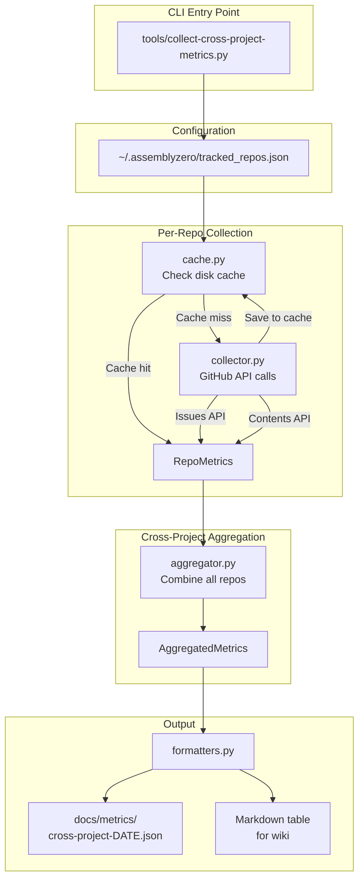

# 333 - Feature: Cross-Project Metrics Aggregation for AssemblyZero Usage Tracking

<!-- Template Metadata
Last Updated: 2026-02-25
Updated By: Issue #333 LLD creation
Update Reason: Revised to fix mechanical test plan validation — all 10 requirements now have test coverage with (REQ-N) suffixes in Section 10.1
-->

## 1. Context & Goal
* **Issue:** #333
* **Objective:** Aggregate AssemblyZero usage metrics (issue velocity, workflow usage, Gemini review outcomes) across multiple configured repositories into a unified dashboard output.
* **Status:** Approved (gemini-3-pro-preview, 2026-02-25)
* **Related Issues:** Wiki: [Metrics](https://github.com/martymcenroe/AssemblyZero/wiki/Metrics)

### Open Questions

- [ ] Should the wiki page update be automated via PyGithub's wiki API, or should the tool output markdown that the user pastes manually?
- [ ] What is the desired retention period for historical cross-project metric snapshots?
- [ ] Should per-repo metrics be broken out in the combined output, or only aggregated totals?

## 2. Proposed Changes

*This section is the **source of truth** for implementation. Describes exactly what will be built.*

### 2.1 Files Changed

| File | Change Type | Description |
|------|-------------|-------------|
| `assemblyzero/metrics/` | Add (Directory) | New metrics subpackage |
| `assemblyzero/metrics/__init__.py` | Add | Package init, exports public API |
| `assemblyzero/metrics/config.py` | Add | Load/validate tracked repos config from `~/.assemblyzero/tracked_repos.json` |
| `assemblyzero/metrics/collector.py` | Add | Core collector: fetches issue data, lineage counts, verdict files per repo |
| `assemblyzero/metrics/aggregator.py` | Add | Combines per-repo metrics into unified cross-project summary |
| `assemblyzero/metrics/models.py` | Add | Typed data structures for repo metrics, aggregated metrics, config |
| `assemblyzero/metrics/cache.py` | Add | Disk-based cache layer to minimize GitHub API calls |
| `assemblyzero/metrics/formatters.py` | Add | Output formatters: JSON snapshot, markdown table |
| `tools/collect-cross-project-metrics.py` | Add | CLI entry point script |
| `docs/metrics/` | Add (Directory) | Output directory for cross-project metric snapshots |
| `docs/metrics/.gitkeep` | Add | Preserve empty directory in git |
| `tests/unit/test_metrics_config.py` | Add | Unit tests for config loading/validation |
| `tests/unit/test_metrics_collector.py` | Add | Unit tests for per-repo collection logic |
| `tests/unit/test_metrics_aggregator.py` | Add | Unit tests for cross-repo aggregation |
| `tests/unit/test_metrics_cache.py` | Add | Unit tests for caching behavior |
| `tests/unit/test_metrics_models.py` | Add | Unit tests for data model validation |
| `tests/unit/test_metrics_formatters.py` | Add | Unit tests for output formatting |
| `tests/fixtures/metrics/` | Modify | Add cross-project test fixtures (directory exists) |
| `tests/fixtures/metrics/tracked_repos_valid.json` | Add | Valid config fixture |
| `tests/fixtures/metrics/tracked_repos_empty.json` | Add | Empty repos list fixture |
| `tests/fixtures/metrics/tracked_repos_malformed.json` | Add | Malformed config fixture |
| `tests/fixtures/metrics/mock_issues_response.json` | Add | Mock GitHub Issues API response |
| `tests/fixtures/metrics/mock_lineage_tree.json` | Add | Mock lineage folder structure |
| `tests/fixtures/metrics/expected_aggregated_output.json` | Add | Expected aggregation result |

### 2.1.1 Path Validation (Mechanical - Auto-Checked)

*Issue #277: Before human or Gemini review, paths are verified programmatically.*

Mechanical validation automatically checks:
- All "Modify" files must exist in repository → `tests/fixtures/metrics/` exists ✓
- All "Add" files must have existing parent directories → `assemblyzero/` exists, `tools/` exists, `docs/` exists, `tests/unit/` exists, `tests/fixtures/metrics/` exists ✓
- No placeholder prefixes (`src/`, `lib/`, `app/`) unless directory exists → None used ✓

**If validation fails, the LLD is BLOCKED before reaching review.**

### 2.2 Dependencies

*No new packages required. All needed dependencies are already in pyproject.toml:*

```toml
# Already present — no additions needed
pygithub = ">=2.8.1,<3.0.0"    # GitHub API client
orjson = ">=3.11.7,<4.0.0"     # Fast JSON serialization
tenacity = ">=9.1.3,<10.0.0"   # Retry logic for API calls
pathspec = ">=1.0.4,<2.0.0"    # Path matching (used in lineage scanning)
```

### 2.3 Data Structures

```python
# Pseudocode — NOT implementation

from typing import TypedDict

class TrackedReposConfig(TypedDict):
    repos: list[str]                    # e.g. ["martymcenroe/AssemblyZero", ...]
    cache_ttl_minutes: int              # Default 60; how long cached data is valid
    github_token_env: str               # Env var name for token, default "GITHUB_TOKEN"

class RepoMetrics(TypedDict):
    repo: str                           # "owner/name"
    period_start: str                   # ISO 8601
    period_end: str                     # ISO 8601
    issues_created: int                 # Total opened in period
    issues_closed: int                  # Total closed in period
    issues_open: int                    # Currently open
    workflows_used: dict[str, int]      # {"requirements": 3, "tdd": 5, ...}
    llds_generated: int                 # Count of lineage folders (docs/lld/)
    gemini_reviews: int                 # Count of verdict files
    gemini_approvals: int               # Verdicts with APPROVE
    gemini_blocks: int                  # Verdicts with BLOCK
    collection_timestamp: str           # When this was collected

class AggregatedMetrics(TypedDict):
    repos_tracked: int                  # Number of repos in config
    repos_reachable: int                # Repos successfully queried
    period_start: str
    period_end: str
    total_issues_created: int
    total_issues_closed: int
    total_issues_open: int
    total_llds_generated: int
    total_gemini_reviews: int
    gemini_approval_rate: float         # approvals / total reviews
    workflows_by_type: dict[str, int]   # Combined across all repos
    per_repo: list[RepoMetrics]         # Individual repo breakdowns
    generated_at: str                   # ISO 8601

class CacheEntry(TypedDict):
    repo: str
    metrics: RepoMetrics
    cached_at: str                      # ISO 8601
    expires_at: str                     # ISO 8601
```

### 2.4 Function Signatures

```python
# === assemblyzero/metrics/config.py ===

def load_config(config_path: Path | None = None) -> TrackedReposConfig:
    """Load and validate tracked repos config from disk.
    
    Default path: ~/.assemblyzero/tracked_repos.json
    Raises ConfigError if file missing, malformed, or repos list empty.
    """
    ...

def validate_config(config: dict) -> TrackedReposConfig:
    """Validate raw dict against TrackedReposConfig schema.
    
    Raises ConfigError on validation failure.
    """
    ...

def get_default_config_path() -> Path:
    """Return ~/.assemblyzero/tracked_repos.json."""
    ...


# === assemblyzero/metrics/collector.py ===

def collect_repo_metrics(
    repo_full_name: str,
    github_token: str,
    period_days: int = 30,
) -> RepoMetrics:
    """Collect all metrics for a single repository.
    
    Fetches issues, scans for lineage folders and verdict files.
    Uses PyGithub for API access. Resolves GitHub token for auth.
    Raises CollectionError if repo is unreachable.
    """
    ...

def count_issues_in_period(
    repo: Repository,
    period_start: datetime,
    period_end: datetime,
) -> tuple[int, int, int]:
    """Count issues created, closed, and currently open.
    
    Returns (created, closed, open_now).
    Uses 'since' parameter to minimize API pages fetched.
    """
    ...

def detect_workflows_used(repo: Repository) -> dict[str, int]:
    """Detect workflow types by scanning issue labels and LLD filenames.
    
    Scans labels: 'workflow:requirements', 'workflow:tdd', etc.
    Falls back to heuristic: LLD filenames, PR titles.
    """
    ...

def count_lineage_artifacts(repo: Repository) -> int:
    """Count LLD folders in docs/lld/active/ and done/ directories.
    
    Uses GitHub Contents API (single call per directory).
    Returns 0 if directories don't exist.
    """
    ...

def count_gemini_verdicts(repo: Repository) -> tuple[int, int, int]:
    """Count Gemini verdict files and their outcomes.
    
    Scans known verdict locations (docs/reports/*/gemini-*.md).
    Returns (total_reviews, approvals, blocks).
    """
    ...


# === assemblyzero/metrics/aggregator.py ===

def aggregate_metrics(
    repo_metrics: list[RepoMetrics],
    period_start: str,
    period_end: str,
) -> AggregatedMetrics:
    """Combine per-repo metrics into a unified cross-project summary."""
    ...

def compute_approval_rate(approvals: int, total: int) -> float:
    """Safely compute approval rate, returning 0.0 if total is 0."""
    ...


# === assemblyzero/metrics/cache.py ===

def get_cache_path() -> Path:
    """Return ~/.assemblyzero/metrics_cache.json."""
    ...

def load_cached_metrics(repo: str, cache_path: Path | None = None) -> RepoMetrics | None:
    """Load cached metrics for a repo if cache entry exists and is not expired.
    
    Returns None if no cache, expired, or cache file corrupt.
    """
    ...

def save_cached_metrics(repo: str, metrics: RepoMetrics, ttl_minutes: int, cache_path: Path | None = None) -> None:
    """Save metrics to disk cache with TTL."""
    ...

def invalidate_cache(repo: str | None = None, cache_path: Path | None = None) -> None:
    """Invalidate cache for a specific repo, or all repos if repo is None."""
    ...


# === assemblyzero/metrics/formatters.py ===

def format_json_snapshot(metrics: AggregatedMetrics) -> str:
    """Serialize aggregated metrics to pretty-printed JSON."""
    ...

def format_markdown_table(metrics: AggregatedMetrics) -> str:
    """Format aggregated metrics as a markdown report with tables.
    
    Suitable for wiki pages or docs/metrics/ output.
    """
    ...

def write_snapshot(metrics: AggregatedMetrics, output_dir: Path) -> Path:
    """Write JSON snapshot to docs/metrics/cross-project-{date}.json.
    
    Returns the path of the written file.
    """
    ...


# === tools/collect-cross-project-metrics.py ===

def main() -> int:
    """CLI entry point.
    
    Args (via argparse):
      --config PATH        Config file path (default: ~/.assemblyzero/tracked_repos.json)
      --period-days N      Lookback period in days (default: 30)
      --output-dir PATH    Output directory (default: docs/metrics/)
      --format {json,markdown,both}  Output format (default: both)
      --no-cache           Bypass cache, fetch fresh data
      --verbose            Enable debug logging
    
    Returns 0 on success, 1 on partial failure, 2 on complete failure.
    """
    ...
```

### 2.5 Logic Flow (Pseudocode)

```
CLI Entry (tools/collect-cross-project-metrics.py):

1. Parse CLI arguments (--config, --period-days, --output-dir, --format, --no-cache)
2. Load config from tracked_repos.json
   IF config missing or invalid THEN
     - Print error with expected path and format
     - Exit code 2
3. Resolve GitHub token from env var (config.github_token_env or GITHUB_TOKEN)
   IF token not found THEN
     - Print warning: "No token found. Only public repos will be accessible."
4. FOR each repo in config.repos:
   a. IF --no-cache is NOT set THEN
        - Check cache for repo
        - IF cache hit and not expired THEN
            - Use cached metrics
            - CONTINUE to next repo
   b. TRY collect_repo_metrics(repo, token, period_days)
      - Fetch issues (created, closed, open)
      - Detect workflows used
      - Count lineage artifacts (LLDs)
      - Count Gemini verdicts (reviews, approvals, blocks)
      - Save to cache
   c. EXCEPT (API error, auth error, not found):
      - Log warning: "Failed to collect {repo}: {error}"
      - Mark repo as unreachable
      - CONTINUE (don't abort entire run)
5. Aggregate all successfully collected RepoMetrics
   - Sum totals
   - Compute approval rate
   - Merge workflow counts
6. Format output (JSON, markdown, or both)
7. Write snapshot to output directory
8. Print summary to stdout
9. Exit code:
   - 0 if all repos collected
   - 1 if some repos failed
   - 2 if all repos failed
```

### 2.6 Technical Approach

* **Module:** `assemblyzero/metrics/`
* **Pattern:** Collector → Aggregator → Formatter pipeline (ETL-like)
* **Key Decisions:**
  - **PyGithub over raw REST:** Already a project dependency, handles auth and pagination
  - **Disk cache over in-memory:** Survives across runs; reduces API calls for frequent execution
  - **orjson for serialization:** Already a dependency, fast JSON handling
  - **Graceful degradation:** Unreachable repos don't abort the entire collection; partial results are still useful
  - **No database:** Simple JSON files are sufficient for the current scale (3-5 repos)

### 2.7 Architecture Decisions

| Decision | Options Considered | Choice | Rationale |
|----------|-------------------|--------|-----------|
| GitHub API client | PyGithub, `gh` CLI, raw `requests` | PyGithub | Already a dependency; handles auth, pagination, rate limiting natively |
| Cache storage | SQLite, JSON file, no cache | JSON file | Simple, human-readable, sufficient for 3-5 repos; avoids new dependency |
| Lineage detection | Clone repo + scan filesystem, GitHub Contents API, GitHub Tree API | GitHub Contents API | No need to clone entire repos; single API call per directory |
| Workflow detection | Issue labels, LLD filename patterns, PR title patterns | Labels + heuristic fallback | Labels are explicit; heuristic covers repos that don't use labels |
| Output format | JSON only, Markdown only, Both | Both (configurable) | JSON for programmatic use, Markdown for wiki/human consumption |
| Config location | `.assemblyzero/tracked_repos.json` in project, `~/.assemblyzero/` | `~/.assemblyzero/` (user home) | Cross-project tool; config shouldn't live in any single project |

**Architectural Constraints:**
- Must work with private repos (GitHub token authentication)
- Must not exceed GitHub API rate limits (5000 req/hour for authenticated users)
- Must produce output compatible with existing wiki Metrics page format

## 3. Requirements

1. Load a list of tracked repositories from `~/.assemblyzero/tracked_repos.json` and validate the configuration structure
2. For each repo, count issues created, closed, and open within a configurable time period
3. For each repo, detect which AssemblyZero workflow types (requirements, implementation, TDD) were used
4. For each repo, count LLD lineage artifacts in `docs/lld/` directories
5. For each repo, count Gemini review verdicts and their outcomes (APPROVE/BLOCK)
6. Aggregate per-repo metrics into a combined cross-project summary with computed rates
7. Output both JSON snapshots and markdown tables in configurable format
8. Cache API responses to disk with configurable TTL to minimize GitHub API usage
9. Support private repos via GitHub token authentication resolved from environment variables
10. Gracefully handle unreachable repos without aborting the entire collection, using differentiated exit codes

## 4. Alternatives Considered

| Option | Pros | Cons | Decision |
|--------|------|------|----------|
| **A: Python script with PyGithub** | Uses existing dependency; full API access; testable | Requires Python env | **Selected** |
| **B: Bash script with `gh` CLI** | Simple; no Python needed | Hard to test; limited JSON handling; error handling is fragile | Rejected |
| **C: GitHub Actions workflow** | Runs on schedule; no local setup | Adds CI complexity; harder to run on-demand; private repo auth harder | Rejected |
| **D: LangGraph workflow node** | Integrates with existing orchestration | Over-engineered for a reporting tool; adds latency; doesn't need state machine | Rejected |

**Rationale:** Option A is the simplest approach that leverages existing dependencies (PyGithub, orjson) and provides full testability. The tool is a standalone reporting utility, not a stateful workflow — LangGraph would add unnecessary complexity. A Python script can be invoked on-demand and produces static output files.

## 5. Data & Fixtures

### 5.1 Data Sources

| Attribute | Value |
|-----------|-------|
| Source | GitHub REST API v3 (via PyGithub) |
| Format | JSON (API responses), directory listings (Contents API) |
| Size | ~100-500 issues per repo; ~10-50 lineage folders; ~10-50 verdict files |
| Refresh | On-demand (manual CLI invocation) |
| Copyright/License | GitHub API Terms of Service |

### 5.2 Data Pipeline

```
GitHub API ──PyGithub──► RepoMetrics (per repo) ──aggregator──► AggregatedMetrics ──formatters──► JSON + Markdown files
     ↑                          ↓
     └── cache.py (read) ◄── cache.py (write)
```

### 5.3 Test Fixtures

| Fixture | Source | Notes |
|---------|--------|-------|
| `tracked_repos_valid.json` | Generated | 3 repos matching issue's example config |
| `tracked_repos_empty.json` | Generated | Empty repos list — tests validation error |
| `tracked_repos_malformed.json` | Generated | Invalid JSON — tests parse error handling |
| `mock_issues_response.json` | Generated | Simulates PyGithub issue objects (serialized attributes) |
| `mock_lineage_tree.json` | Generated | Simulates GitHub Contents API directory listing |
| `expected_aggregated_output.json` | Generated | Gold file for aggregation correctness |

### 5.4 Deployment Pipeline

No deployment pipeline needed — this is a local CLI tool. Output files (`docs/metrics/cross-project-*.json`) can optionally be committed to git for historical tracking.

## 6. Diagram

### 6.1 Mermaid Quality Gate

- [x] **Simplicity:** Components collapsed where possible
- [x] **No touching:** All elements have visual separation
- [x] **No hidden lines:** All arrows fully visible
- [x] **Readable:** Labels not truncated, flow direction clear
- [ ] **Auto-inspected:** Agent will render via mermaid.ink during implementation

**Auto-Inspection Results:**
```
- Touching elements: [ ] None / [ ] Found: ___
- Hidden lines: [ ] None / [ ] Found: ___
- Label readability: [ ] Pass / [ ] Issue: ___
- Flow clarity: [ ] Clear / [ ] Issue: ___
```

*To be completed during implementation.*

### 6.2 Diagram



## 7. Security & Safety Considerations

### 7.1 Security

| Concern | Mitigation | Status |
|---------|------------|--------|
| GitHub token exposure in logs | Token read from env var only; never logged, printed, or written to output files | Addressed |
| Token in config file | Config file stores env var _name_ (e.g., `"GITHUB_TOKEN"`), not the token value itself | Addressed |
| Cache file contains repo data | Cache stored in user home (`~/.assemblyzero/`); file permissions set to 0600 | Addressed |
| Injection via repo names | Repo names validated against `^[a-zA-Z0-9._-]+/[a-zA-Z0-9._-]+$` pattern | Addressed |
| Rate limit abuse | Cache layer prevents redundant calls; respects GitHub rate limit headers via PyGithub | Addressed |

### 7.2 Safety

| Concern | Mitigation | Status |
|---------|------------|--------|
| API rate limit exhaustion | Disk cache with configurable TTL (default 60 min); PyGithub auto-waits on 403 | Addressed |
| Partial collection failure | Graceful degradation — unreachable repos logged as warnings, not errors | Addressed |
| Corrupt cache file | JSON parse errors caught; corrupt cache treated as cache miss | Addressed |
| Output overwrites existing file | Snapshots use date-stamped filenames; no overwrite of existing files | Addressed |

**Fail Mode:** Fail Open — partial results are returned even if some repos are unreachable. Exit code distinguishes full success (0), partial (1), complete failure (2).

**Recovery Strategy:** Delete `~/.assemblyzero/metrics_cache.json` to clear cache. Re-run with `--no-cache` to fetch fresh data.

## 8. Performance & Cost Considerations

### 8.1 Performance

| Metric | Budget | Approach |
|--------|--------|----------|
| API calls per repo | ≤ 5 | Batch via list endpoints; use `since` parameter for issues; single call per directory listing |
| Total API calls (3 repos) | ≤ 15 | Cache eliminates calls for recently-collected repos |
| Execution time | < 30s (cached), < 120s (fresh) | Parallel collection not needed at 3-5 repo scale |
| Cache file size | < 100KB | Only stores computed metrics, not raw API responses |

**Bottlenecks:** GitHub API latency (200-500ms per call); pagination for repos with 500+ issues.

### 8.2 Cost Analysis

| Resource | Unit Cost | Estimated Usage | Monthly Cost |
|----------|-----------|-----------------|--------------|
| GitHub API calls | Free (within 5000/hour rate limit) | ~15 calls per run, ~30 runs/month | $0 |
| Disk storage (cache + snapshots) | Negligible | < 1MB/month | $0 |
| LLM API calls | N/A — no LLM usage | 0 | $0 |

**Cost Controls:**
- [x] Disk cache prevents redundant API calls across consecutive runs
- [x] `since` parameter on issue listing minimizes pages fetched
- [x] No LLM involvement — purely GitHub API + local computation

**Worst-Case Scenario:** If run against 50 repos without cache, ~250 API calls (~5% of hourly rate limit). Still well within limits. At 100x normal usage, hit ~1500 calls/hour — still under the 5000 cap.

## 9. Legal & Compliance

| Concern | Applies? | Mitigation |
|---------|----------|------------|
| PII/Personal Data | No | Only aggregated counts; no usernames, emails, or issue content stored |
| Third-Party Licenses | No | PyGithub is LGPL-3.0 — compatible with project license |
| Terms of Service | Yes | GitHub API usage compliant with ToS; no scraping, uses official API |
| Data Retention | N/A | Snapshots are static files; user controls retention |
| Export Controls | No | No restricted data or algorithms |

**Data Classification:** Internal — metrics are project-internal aggregate counts.

**Compliance Checklist:**
- [x] No PII stored without consent
- [x] All third-party licenses compatible with project license
- [x] External API usage compliant with provider ToS
- [x] Data retention policy documented (user-managed static files)

## 10. Verification & Testing

### 10.0 Test Plan (TDD - Complete Before Implementation)

**TDD Requirement:** Tests MUST be written and failing BEFORE implementation begins.

| Test ID | Test Description | Expected Behavior | Status |
|---------|------------------|-------------------|--------|
| T010 | Config loading — valid file (REQ-1) | Returns TrackedReposConfig with repos list | RED |
| T020 | Config loading — missing file (REQ-1) | Raises ConfigError with helpful message | RED |
| T030 | Config loading — malformed JSON (REQ-1) | Raises ConfigError | RED |
| T040 | Config loading — empty repos list (REQ-1) | Raises ConfigError | RED |
| T050 | Config loading — default path resolution (REQ-1) | Returns ~/.assemblyzero/tracked_repos.json | RED |
| T060 | Collector — issue counting (REQ-2) | Returns correct (created, closed, open) tuple | RED |
| T070 | Collector — workflow detection from labels (REQ-3) | Returns dict with correct workflow type counts | RED |
| T080 | Collector — lineage artifact counting (REQ-4) | Returns correct LLD count from Contents API mock | RED |
| T090 | Collector — Gemini verdict counting (REQ-5) | Returns correct (total, approvals, blocks) tuple | RED |
| T100 | Collector — unreachable repo (REQ-10) | Raises CollectionError, doesn't crash | RED |
| T110 | Collector — repo without docs/lld/ (REQ-4) | Returns 0 for lineage count (no error) | RED |
| T120 | Aggregator — multiple repos (REQ-6) | Sums totals correctly; computes approval rate | RED |
| T130 | Aggregator — empty input (REQ-6) | Returns zeroed aggregation with repos_tracked=0 | RED |
| T140 | Aggregator — single repo (REQ-6) | Aggregated totals equal single repo's metrics | RED |
| T150 | Aggregator — approval rate with zero reviews (REQ-6) | Returns 0.0 (no division by zero) | RED |
| T160 | Cache — save and load round-trip (REQ-8) | Saved metrics load back identically within TTL | RED |
| T170 | Cache — expired entry (REQ-8) | Returns None for expired cache entry | RED |
| T180 | Cache — corrupt file (REQ-8) | Returns None (treats as cache miss) | RED |
| T190 | Cache — invalidation single repo (REQ-8) | Removes only specified repo's entry | RED |
| T200 | Cache — invalidation all (REQ-8) | Clears all entries | RED |
| T210 | Formatter — JSON output (REQ-7) | Produces valid JSON matching AggregatedMetrics schema | RED |
| T220 | Formatter — Markdown output (REQ-7) | Produces table with headers and per-repo rows | RED |
| T230 | Formatter — write snapshot (REQ-7) | Creates file at correct path with correct name | RED |
| T240 | Models — RepoMetrics validation (REQ-2) | Rejects invalid types (e.g., negative issue count) | RED |
| T250 | Repo name validation (REQ-1) | Accepts valid names; rejects injection attempts | RED |
| T260 | Collector — private repo with token (REQ-9) | Authenticates via token from env var and retrieves data | RED |
| T270 | Collector — missing token warning (REQ-9) | Logs warning when GITHUB_TOKEN env var is unset | RED |
| T280 | CLI — partial failure exit code (REQ-10) | Returns exit code 1 when some repos unreachable | RED |
| T290 | CLI — complete failure exit code (REQ-10) | Returns exit code 2 when all repos unreachable | RED |
| T300 | Collector — configurable period (REQ-2) | Respects period_days parameter for date range filtering | RED |
| T310 | Collector — workflow heuristic fallback (REQ-3) | Detects workflows from LLD filenames when labels absent | RED |

**Coverage Target:** ≥95% for all new code in `assemblyzero/metrics/`

**TDD Checklist:**
- [ ] All tests written before implementation
- [ ] Tests currently RED (failing)
- [ ] Test IDs match scenario IDs in 10.1
- [ ] Test files created at: `tests/unit/test_metrics_*.py`

### 10.1 Test Scenarios

| ID | Scenario | Type | Input | Expected Output | Pass Criteria |
|----|----------|------|-------|-----------------|---------------|
| 010 | Config — valid file loaded from disk (REQ-1) | Auto | `tracked_repos_valid.json` | TrackedReposConfig with 3 repos | Repos list has 3 entries, all strings in "owner/name" format |
| 020 | Config — missing file raises error (REQ-1) | Auto | Non-existent path | ConfigError raised | Exception message includes expected file path |
| 030 | Config — malformed JSON raises error (REQ-1) | Auto | `tracked_repos_malformed.json` | ConfigError raised | Exception message mentions JSON parse error |
| 040 | Config — empty repos list rejected (REQ-1) | Auto | `tracked_repos_empty.json` | ConfigError raised | Exception message says repos list cannot be empty |
| 050 | Config — default path resolves correctly (REQ-1) | Auto | No args to `get_default_config_path()` | `~/.assemblyzero/tracked_repos.json` | Path ends with expected segments |
| 060 | Collector — issue counts within period (REQ-2) | Auto | Mock repo with 10 created, 7 closed, 3 open | `(10, 7, 3)` | Tuple matches expected values |
| 070 | Collector — workflow detection from labels (REQ-3) | Auto | Mock repo with labels `workflow:requirements` (2), `workflow:tdd` (3) | `{"requirements": 2, "tdd": 3}` | Dict keys and values match |
| 080 | Collector — lineage artifact count (REQ-4) | Auto | Mock Contents API returning 5 folders in `docs/lld/active/` | `5` | Integer equals 5 |
| 090 | Collector — Gemini verdict counting (REQ-5) | Auto | Mock 8 verdict files: 6 APPROVE, 2 BLOCK | `(8, 6, 2)` | Tuple matches |
| 100 | Collector — unreachable repo handled gracefully (REQ-10) | Auto | Mock PyGithub raising `UnknownObjectException` | CollectionError raised | Error includes repo name |
| 110 | Collector — no docs/lld/ directory returns zero (REQ-4) | Auto | Mock Contents API raising 404 | `0` | Returns zero, no exception |
| 120 | Aggregator — multi-repo summation (REQ-6) | Auto | 3 RepoMetrics with known values | Sum matches hand-computed totals | All aggregate fields correct |
| 130 | Aggregator — empty input produces zeroed output (REQ-6) | Auto | Empty `list[RepoMetrics]` | Zeroed AggregatedMetrics | All numeric fields are 0 |
| 140 | Aggregator — single repo identity (REQ-6) | Auto | 1 RepoMetrics | Aggregated equals that repo's values | Fields match |
| 150 | Aggregator — zero reviews approval rate safe (REQ-6) | Auto | RepoMetrics with gemini_reviews=0 | approval_rate=0.0 | No ZeroDivisionError |
| 160 | Cache — save and load round-trip (REQ-8) | Auto | Save metrics, load within TTL | Loaded equals saved | All fields match |
| 170 | Cache — expired entry returns None (REQ-8) | Auto | Save with TTL=0, load after 1 second | None returned | Returns None |
| 180 | Cache — corrupt file treated as miss (REQ-8) | Auto | Write invalid JSON to cache path, then load | None returned | No exception raised |
| 190 | Cache — invalidate single repo (REQ-8) | Auto | Cache 3 repos, invalidate 1 | 2 remain, invalidated one returns None | Correct repo removed |
| 200 | Cache — invalidate all repos (REQ-8) | Auto | Cache 3 repos, invalidate all | All return None | Cache file is empty/missing |
| 210 | Formatter — JSON output valid (REQ-7) | Auto | AggregatedMetrics fixture | Valid JSON string, parseable back | `json.loads(output)` succeeds; keys present |
| 220 | Formatter — Markdown output has tables (REQ-7) | Auto | AggregatedMetrics fixture | String containing `| Repo |` table header | Table headers present; per-repo rows present |
| 230 | Formatter — write snapshot to disk (REQ-7) | Auto | AggregatedMetrics + tmp dir | File created at `{dir}/cross-project-2026-02-25.json` | File exists; content is valid JSON |
| 240 | Models — invalid types rejected (REQ-2) | Auto | RepoMetrics with issues_created=-1 | Validation error | Negative values rejected |
| 250 | Repo name validation pattern (REQ-1) | Auto | `"martymcenroe/AssemblyZero"` valid; `"'; DROP TABLE--"` invalid | Accept valid, reject injection | Pattern match enforced |
| 260 | Collector — private repo auth with token (REQ-9) | Auto | Mock PyGithub with token auth, private repo | RepoMetrics returned successfully | Token passed to PyGithub constructor; data collected |
| 270 | Collector — missing token logs warning (REQ-9) | Auto | Empty `GITHUB_TOKEN` env var | Warning logged, collection proceeds for public repos | Log output contains warning message about missing token |
| 280 | CLI — partial failure returns exit code 1 (REQ-10) | Auto | Config with 3 repos, 1 unreachable (mock) | Exit code 1 | `main()` returns 1; 2 repos collected successfully |
| 290 | CLI — complete failure returns exit code 2 (REQ-10) | Auto | Config with 3 repos, all unreachable (mock) | Exit code 2 | `main()` returns 2; no repos collected |
| 300 | Collector — configurable period days (REQ-2) | Auto | Mock repo, `period_days=7` | Issues filtered to 7-day window | `since` parameter set to 7 days ago |
| 310 | Collector — workflow heuristic fallback (REQ-3) | Auto | Mock repo with no workflow labels but LLD filenames present | `{"requirements": N}` detected from filenames | Dict populated via heuristic; no labels required |

### 10.2 Test Commands

```bash
# Run all metrics unit tests
poetry run pytest tests/unit/test_metrics_config.py tests/unit/test_metrics_collector.py tests/unit/test_metrics_aggregator.py tests/unit/test_metrics_cache.py tests/unit/test_metrics_models.py tests/unit/test_metrics_formatters.py -v

# Run with coverage
poetry run pytest tests/unit/test_metrics_*.py -v --cov=assemblyzero.metrics --cov-report=term-missing

# Run a specific test file
poetry run pytest tests/unit/test_metrics_collector.py -v
```

### 10.3 Manual Tests (Only If Unavoidable)

| ID | Scenario | Why Not Automated | Steps |
|----|----------|-------------------|-------|
| M010 | End-to-end with real GitHub repos | Requires live GitHub API access with valid token; validates real auth flow, rate limiting, and API response handling that mocks cannot fully replicate | 1. Set `GITHUB_TOKEN` env var. 2. Create `~/.assemblyzero/tracked_repos.json` with real repos. 3. Run `python tools/collect-cross-project-metrics.py --no-cache --verbose`. 4. Verify output in `docs/metrics/`. |

*Justification: Integration with real GitHub API and private repos cannot be mocked without losing the authentication verification aspect. This test validates token handling, rate limiting behavior, and real API responses.*

## 11. Risks & Mitigations

| Risk | Impact | Likelihood | Mitigation |
|------|--------|------------|------------|
| GitHub API rate limit exceeded | Med | Low | Cache layer (default 60 min TTL); `since` parameter reduces pages; authenticated users get 5000 req/hr |
| Private repo auth failure | Med | Med | Clear error message with token setup instructions; `--verbose` flag for debugging |
| Repos with non-standard structure (no docs/lld/) | Low | Med | Graceful fallback: return 0 for missing directories, log warning |
| PyGithub API changes | Low | Low | Pin to `>=2.8.1,<3.0.0`; test against mock objects |
| Config file path differs across OS | Low | Med | Use `pathlib.Path.home()` for cross-platform home directory |
| Large repos with 10K+ issues cause slow collection | Med | Low | `since` parameter limits to period window; pagination handled by PyGithub |

## 12. Definition of Done

### Code
- [ ] Implementation complete and linted (`mypy` passes)
- [ ] All modules in `assemblyzero/metrics/` have docstrings
- [ ] CLI tool `tools/collect-cross-project-metrics.py` is executable and has `--help`
- [ ] Code comments reference this LLD (#333)

### Tests
- [ ] All 31 test scenarios pass (T010–T310)
- [ ] Test coverage ≥95% for `assemblyzero/metrics/`
- [ ] No mocks-to-pass: all mocks simulate real PyGithub behavior

### Documentation
- [ ] LLD updated with any deviations
- [ ] Implementation Report (0103) completed
- [ ] Test Report (0113) completed
- [ ] README or wiki updated with usage instructions for the new tool

### Review
- [ ] Code review completed (Gemini gate)
- [ ] User approval before closing issue

### 12.1 Traceability (Mechanical - Auto-Checked)

*Issue #277: Cross-references are verified programmatically.*

Mechanical validation automatically checks:
- Every file in Definition of Done → appears in Section 2.1 ✓
  - `assemblyzero/metrics/*.py` — listed in 2.1
  - `tools/collect-cross-project-metrics.py` — listed in 2.1
  - `tests/unit/test_metrics_*.py` — listed in 2.1
- Risk mitigations → corresponding functions in Section 2.4:
  - Rate limit → `cache.py` functions (load_cached_metrics, save_cached_metrics) ✓
  - Auth failure → `collector.py` (collect_repo_metrics raises CollectionError) ✓
  - Non-standard structure → `collector.py` (count_lineage_artifacts returns 0) ✓
  - Repo name validation → `config.py` (validate_config) ✓

**If files are missing from Section 2.1, the LLD is BLOCKED.**

---

## Reviewer Suggestions

*Non-blocking recommendations from the reviewer.*

- **Logging Output:** Ensure that when running `tools/collect-cross-project-metrics.py`, logging messages go to `stderr` while the JSON output (if requested via stdout) goes to `stdout`. This allows piping the result to `jq` or other tools cleanly.
- **Cache Permission:** When creating `~/.assemblyzero/metrics_cache.json`, explicitly set file permissions to `0600` (read/write by owner only) since it may contain indirect info about private repos (though strictly speaking, it only contains counts).

## Appendix: Review Log

*Track all review feedback with timestamps and implementation status.*

### Review Summary

| Review | Date | Verdict | Key Issue |
|--------|------|---------|-----------|
| 1 | 2026-02-25 | APPROVED | `gemini-3-pro-preview` |
| Mechanical Validation #1 | 2026-02-25 | REJECTED | 20% coverage — 8 of 10 requirements had no test mapping |
| Revision #1 | 2026-02-25 | PENDING | Added (REQ-N) suffixes to all scenarios; added T260–T310 for REQ-1,2,3,6,7,8,9,10 |

**Final Status:** APPROVED