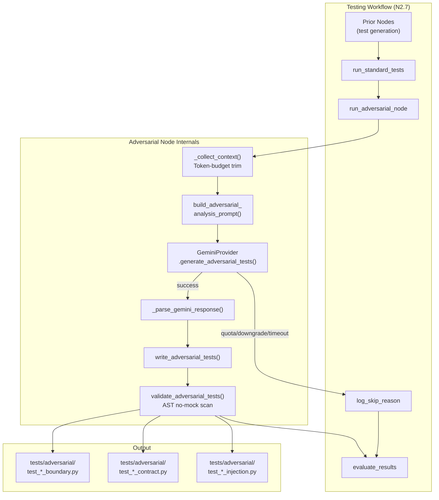
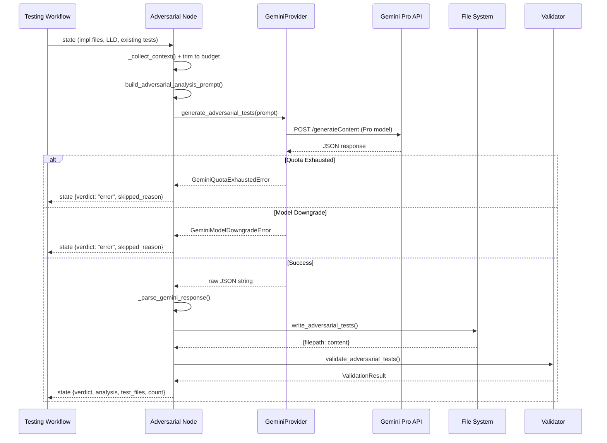

# 352 - Feature: Multi-Model Adversarial Testing Node (Gemini vs Claude)

<!-- Template Metadata
Last Updated: 2026-02-17
Updated By: Issue #352
Update Reason: Initial LLD draft for adversarial testing node integration
-->

## 1. Context & Goal
* **Issue:** #352
* **Objective:** Integrate a new LangGraph node into the Testing Workflow (N2.7) where Gemini Pro analyzes Claude's implementation and LLD claims to generate aggressive, unmocked adversarial tests.
* **Status:** Draft
* **Related Issues:** #117 (governance verdicts), ADR 0201 (adversarial audit philosophy)

### Open Questions

- [ ] Should adversarial test failures block the PR, or be advisory-only in the initial rollout?
- [ ] What is the maximum token budget for sending implementation code + LLD to Gemini for analysis?
- [ ] Should adversarial tests be re-generated on every run, or cached until the implementation changes?

## 2. Proposed Changes

*This section is the **source of truth** for implementation. Describe exactly what will be built.*

### 2.1 Files Changed

| File | Change Type | Description |
|------|-------------|-------------|
| `tests/adversarial/` | Add (Directory) | New directory for adversarial test output |
| `tests/adversarial/__init__.py` | Add | Package init for adversarial tests |
| `tests/adversarial/conftest.py` | Add | Shared fixtures for adversarial tests (no mocks enforced) |
| `assemblyzero/workflows/testing/nodes/` | Existing Directory | Already exists in testing workflow |
| `assemblyzero/workflows/testing/nodes/adversarial_node.py` | Add | Core LangGraph node: orchestrates Gemini-based adversarial test generation |
| `assemblyzero/workflows/testing/nodes/adversarial_writer.py` | Add | Writes Gemini's adversarial test output to `tests/adversarial/test_*.py` files |
| `assemblyzero/workflows/testing/nodes/adversarial_validator.py` | Add | Validates generated tests: syntax check, no-mock enforcement, deduplication |
| `assemblyzero/workflows/testing/adversarial_prompts.py` | Add | Prompt templates for Gemini adversarial analysis |
| `assemblyzero/workflows/testing/adversarial_state.py` | Add | TypedDict state extensions for adversarial node |
| `assemblyzero/workflows/testing/knowledge/adversarial_patterns.py` | Add | Knowledge base of adversarial testing patterns (boundary, injection, concurrency, etc.) |
| `assemblyzero/workflows/testing/graph.py` | Modify | Wire adversarial node into existing testing workflow StateGraph |
| `assemblyzero/utils/gemini_provider.py` | Modify | Add `generate_adversarial_tests()` method with no-mock constraint in system prompt |
| `tests/unit/test_adversarial_node.py` | Add | Unit tests for adversarial node logic |
| `tests/unit/test_adversarial_writer.py` | Add | Unit tests for test file writer |
| `tests/unit/test_adversarial_validator.py` | Add | Unit tests for validation logic |
| `tests/unit/test_adversarial_prompts.py` | Add | Unit tests for prompt construction |
| `tests/integration/test_adversarial_integration.py` | Add | Integration test: full node execution with real Gemini call |
| `tests/conftest.py` | Modify | Register `adversarial` marker |
| `pyproject.toml` | Modify | Add `adversarial` pytest marker |

### 2.1.1 Path Validation (Mechanical - Auto-Checked)

Mechanical validation automatically checks:
- All "Modify" files must exist in repository — ✅ `graph.py`, `gemini_provider.py`, `conftest.py`, `pyproject.toml` exist
- All "Add" files must have existing parent directories — ✅ `tests/adversarial/` explicitly created; `assemblyzero/workflows/testing/nodes/` and `assemblyzero/workflows/testing/` exist
- No placeholder prefixes — ✅ All paths use actual project structure

### 2.2 Dependencies

```toml
# No new dependencies required.
# Already present in pyproject.toml:
# langchain-google-genai = "^4.2.0"  (Gemini provider)
# google-genai = "^1.60.0"           (Gemini SDK)
# langgraph = "^1.0.7"               (State machine)
```

No new packages needed. The existing `langchain-google-genai` and `google-genai` dependencies provide Gemini access. The existing `assemblyzero/utils/gemini_provider.py` already wraps Gemini invocation with model-downgrade detection.

### 2.3 Data Structures

```python
# assemblyzero/workflows/testing/adversarial_state.py

from typing import TypedDict, Literal


class AdversarialTestCase(TypedDict):
    """A single adversarial test case generated by Gemini."""
    test_id: str                          # e.g., "ADV_001"
    target_function: str                  # Fully qualified function name
    category: str                         # "boundary" | "injection" | "concurrency" | "state" | "contract"
    description: str                      # Human-readable description of what this tests
    test_code: str                        # Raw Python test code (function body)
    claim_challenged: str                 # Which LLD claim or docstring assertion this challenges
    severity: Literal["critical", "high", "medium"]  # Expected impact if test fails


class AdversarialAnalysis(TypedDict):
    """Gemini's analysis of implementation vs. LLD claims."""
    uncovered_edge_cases: list[str]       # Edge cases not in existing test suite
    false_claims: list[str]              # LLD claims not backed by implementation
    missing_error_handling: list[str]    # Error paths without handlers
    implicit_assumptions: list[str]      # Undocumented assumptions in the code
    test_cases: list[AdversarialTestCase]


class AdversarialNodeState(TypedDict, total=False):
    """State extension for the adversarial testing node."""
    # Inputs (populated by prior nodes)
    implementation_files: dict[str, str]  # filepath -> file content
    lld_content: str                      # Full LLD markdown
    existing_tests: dict[str, str]        # filepath -> existing test content
    issue_id: int                         # GitHub issue number

    # Outputs (populated by adversarial node)
    adversarial_analysis: AdversarialAnalysis
    generated_test_files: dict[str, str]  # filepath -> generated test content
    adversarial_verdict: Literal["pass", "fail", "error"]
    adversarial_error: str | None         # Error message if verdict is "error"
    adversarial_test_count: int           # Number of tests generated
    adversarial_skipped_reason: str | None  # Why adversarial was skipped (e.g., quota)
```

### 2.4 Function Signatures

```python
# assemblyzero/workflows/testing/nodes/adversarial_node.py

from assemblyzero.workflows.testing.adversarial_state import AdversarialNodeState


def run_adversarial_node(state: AdversarialNodeState) -> AdversarialNodeState:
    """
    LangGraph node: Orchestrates adversarial test generation via Gemini.

    1. Collects implementation code and LLD from state.
    2. Builds adversarial analysis prompt.
    3. Invokes Gemini Pro for analysis.
    4. Parses structured response into AdversarialAnalysis.
    5. Delegates to writer and validator.
    6. Returns updated state with generated tests.

    Fails gracefully on Gemini quota/downgrade errors (sets adversarial_skipped_reason).
    """
    ...


def _collect_context(state: AdversarialNodeState) -> tuple[str, str, str]:
    """
    Extract and token-budget-trim implementation code, LLD content,
    and existing tests from state.

    Returns:
        (implementation_context, lld_context, existing_test_context)
    """
    ...


def _parse_gemini_response(raw_response: str) -> "AdversarialAnalysis":
    """
    Parse Gemini's structured JSON response into AdversarialAnalysis.

    Raises:
        ValueError: If response is malformed or missing required fields.
    """
    ...


# assemblyzero/workflows/testing/nodes/adversarial_writer.py

def write_adversarial_tests(
    analysis: "AdversarialAnalysis",
    issue_id: int,
    output_dir: str = "tests/adversarial",
) -> dict[str, str]:
    """
    Write adversarial test cases to disk as pytest-compatible files.

    Each file follows naming: test_{issue_id}_{category}.py
    Groups test cases by category into separate files.

    Returns:
        Dictionary of filepath -> file content written.
    """
    ...


def _render_test_file(
    test_cases: list["AdversarialTestCase"],
    category: str,
    issue_id: int,
) -> str:
    """
    Render a list of test cases into a complete pytest file with header,
    imports, and no-mock enforcement docstring.
    """
    ...


# assemblyzero/workflows/testing/nodes/adversarial_validator.py

class ValidationResult(TypedDict):
    valid: bool
    errors: list[str]
    warnings: list[str]
    mock_violations: list[str]


def validate_adversarial_tests(test_files: dict[str, str]) -> ValidationResult:
    """
    Validate generated adversarial test files:
    1. Syntax check (compile each file).
    2. No-mock enforcement (scan for unittest.mock, MagicMock, patch, monkeypatch).
    3. No duplicate test function names.
    4. Each test has at least one assert statement.

    Returns ValidationResult with detailed error/warning lists.
    """
    ...


def _check_no_mocks(source_code: str, filepath: str) -> list[str]:
    """
    AST-scan source code for mock usage. Returns list of violations.

    Detects:
    - import unittest.mock
    - from unittest.mock import *
    - from unittest import mock
    - @patch / @mock.patch decorators
    - MagicMock(), Mock(), AsyncMock() instantiation
    - monkeypatch fixture usage
    """
    ...


def _check_syntax(source_code: str, filepath: str) -> list[str]:
    """
    Attempt to compile source code. Returns list of syntax errors.
    """
    ...


def _check_assertions(source_code: str, filepath: str) -> list[str]:
    """
    AST-scan for assert statements in each test function.
    Returns warnings for test functions with zero assertions.
    """
    ...


# assemblyzero/workflows/testing/adversarial_prompts.py

def build_adversarial_analysis_prompt(
    implementation_code: str,
    lld_content: str,
    existing_tests: str,
    adversarial_patterns: list[str],
) -> str:
    """
    Build the system + user prompt for Gemini adversarial analysis.

    The prompt instructs Gemini to:
    1. Read the implementation and LLD.
    2. Identify claims in the LLD not backed by code.
    3. Find edge cases missing from existing tests.
    4. Generate aggressive test cases that use NO mocks.
    5. Return structured JSON matching AdversarialAnalysis schema.
    """
    ...


def build_adversarial_system_prompt() -> str:
    """
    System prompt establishing Gemini's adversarial tester persona.

    Key constraints:
    - You are a hostile reviewer trying to break the implementation.
    - NEVER generate mocks, stubs, or fakes.
    - Tests must exercise real code paths.
    - Focus on boundary conditions, error paths, and contract violations.
    - Output strict JSON.
    """
    ...


# assemblyzero/utils/gemini_provider.py (modification)

def generate_adversarial_tests(
    self,
    implementation_code: str,
    lld_content: str,
    existing_tests: str,
    adversarial_patterns: list[str] | None = None,
    timeout: int = 120,
) -> str:
    """
    Invoke Gemini Pro for adversarial test generation.

    Uses existing model-downgrade detection from gemini_provider.
    Returns raw JSON string response from Gemini.

    Raises:
        GeminiQuotaExhaustedError: If 429 or quota message detected.
        GeminiModelDowngradeError: If Flash detected instead of Pro.
        GeminiTimeoutError: If response exceeds timeout.
    """
    ...


# assemblyzero/workflows/testing/knowledge/adversarial_patterns.py

def get_adversarial_patterns() -> list[str]:
    """
    Return curated list of adversarial testing pattern descriptions.

    Categories:
    - Boundary: off-by-one, empty input, max-size input, type limits
    - Injection: special characters, unicode, null bytes, path traversal
    - Concurrency: race conditions, shared state mutation
    - State: invalid state transitions, partial initialization
    - Contract: violating documented preconditions, postcondition verification
    - Resource: memory exhaustion, file handle leaks, timeout scenarios
    """
    ...
```

### 2.5 Logic Flow (Pseudocode)

```
ADVERSARIAL NODE EXECUTION:

1. Receive state from prior testing node
2. Extract implementation_files, lld_content, existing_tests from state
3. IF implementation_files is empty:
   - Set adversarial_skipped_reason = "No implementation files in state"
   - Return state (skip gracefully)

4. Trim context to token budget (~60KB combined):
   a. Prioritize: implementation code > LLD > existing tests
   b. Use section-aware truncation (preserve function signatures)

5. Load adversarial_patterns from knowledge base

6. Build prompt:
   a. System prompt (adversarial persona, no-mock constraint, JSON output)
   b. User prompt (implementation + LLD + existing tests + patterns)

7. Invoke Gemini Pro via gemini_provider.generate_adversarial_tests():
   - TRY:
     a. Send prompt with timeout=120s
     b. Verify model (check for Flash downgrade)
     c. Receive raw JSON response
   - CATCH GeminiQuotaExhaustedError:
     a. Set adversarial_skipped_reason = "Gemini quota exhausted"
     b. Set adversarial_verdict = "error"
     c. Return state (graceful degradation)
   - CATCH GeminiModelDowngradeError:
     a. Set adversarial_skipped_reason = "Gemini model downgraded to Flash"
     b. Set adversarial_verdict = "error"
     c. Return state
   - CATCH GeminiTimeoutError:
     a. Retry ONCE with timeout=180s
     b. If still fails: set adversarial_skipped_reason, return state

8. Parse Gemini response into AdversarialAnalysis:
   - TRY:
     a. JSON decode
     b. Validate against AdversarialAnalysis schema
   - CATCH ValueError:
     a. Log malformed response
     b. Set adversarial_verdict = "error"
     c. Return state

9. Write test files:
   a. Group test_cases by category
   b. For each category, render test file with header + imports + test functions
   c. Write to tests/adversarial/test_{issue_id}_{category}.py

10. Validate generated tests:
    a. Syntax check (compile)
    b. No-mock enforcement (AST scan)
    c. Assertion check
    d. IF mock_violations found:
       - Remove offending test functions
       - Log violations
    e. IF syntax errors found:
       - Remove offending files
       - Log errors

11. Update state:
    a. adversarial_analysis = parsed analysis
    b. generated_test_files = {filepath: content} for valid files
    c. adversarial_test_count = count of valid test functions
    d. adversarial_verdict = "pass" if test_count > 0 else "fail"

12. Return updated state
```

```
TESTING WORKFLOW GRAPH (modified):

existing_nodes... → run_standard_tests → run_adversarial_node → evaluate_results
                                              │
                                              ├── (on error) → log_skip_reason → evaluate_results
                                              └── (on success) → evaluate_results

Note: Adversarial node is OPTIONAL — errors skip gracefully.
      The workflow never blocks on adversarial failures.
```

### 2.6 Technical Approach

* **Module:** `assemblyzero/workflows/testing/`
* **Pattern:** LangGraph conditional node with graceful degradation. The adversarial node is wired as a non-blocking step: if Gemini is unavailable (quota, downgrade, timeout), the workflow continues without adversarial tests. This preserves the existing testing workflow's reliability.
* **Key Decisions:**
  - Tests written to disk (not ephemeral) so they persist in the PR for human review
  - AST-based mock detection rather than regex (accurate, handles aliases)
  - Category-based file grouping (one file per adversarial category) for readability
  - JSON output from Gemini (structured, parseable) rather than raw Python (fragile)

### 2.7 Architecture Decisions

| Decision | Options Considered | Choice | Rationale |
|----------|-------------------|--------|-----------|
| Gemini output format | Raw Python files, Structured JSON, YAML | **Structured JSON** | JSON is parseable, validates against schema, allows post-processing before writing; raw Python from LLMs often has syntax errors |
| Mock detection method | Regex string search, AST analysis, Runtime import hook | **AST analysis** | Regex misses aliased imports; runtime hooks are invasive; AST catches `from unittest.mock import patch as p` |
| Node failure behavior | Block workflow, Skip with warning, Retry indefinitely | **Skip with warning** | Adversarial tests are additive value; blocking the entire testing workflow on Gemini quota would be counterproductive |
| Test file organization | Single monolithic file, Category-based files, One file per test | **Category-based files** | Balances readability (not hundreds of files) with organization (not one 2000-line file) |
| State integration | New parallel state graph, Extension of existing TestingState, Separate workflow | **Extension of existing state** | Minimizes changes to the testing workflow; adds fields with `total=False` so existing nodes are unaffected |
| Token budget strategy | Send everything, Fixed truncation, Priority-based trimming | **Priority-based trimming** | Implementation code is most important; LLD provides contract claims; existing tests prevent duplication |

**Architectural Constraints:**
- Must integrate with existing `assemblyzero/workflows/testing/graph.py` StateGraph without breaking existing nodes
- Must use existing `GeminiProvider` with its model-downgrade detection (not a separate Gemini client)
- Cannot introduce new external dependencies (all Gemini/LangGraph deps already in `pyproject.toml`)
- Generated tests must be valid pytest files runnable by `poetry run pytest tests/adversarial/ -v`

## 3. Requirements

1. **R1:** A new LangGraph node `run_adversarial_node` is added to the testing workflow graph and executes after standard test generation.
2. **R2:** The node invokes Gemini Pro (not Flash) to analyze implementation code against LLD claims.
3. **R3:** Gemini generates adversarial test cases that exercise real code paths with zero mocks.
4. **R4:** Generated tests are written to `tests/adversarial/test_*.py` as valid pytest files.
5. **R5:** An AST-based validator enforces the no-mock constraint; any test containing mocks is rejected before writing.
6. **R6:** If Gemini is unavailable (quota, downgrade, timeout), the node skips gracefully and the workflow continues.
7. **R7:** The adversarial analysis includes: uncovered edge cases, false LLD claims, missing error handling, and implicit assumptions.
8. **R8:** All generated test files include a header comment identifying them as adversarial (machine-generated by Gemini).

## 4. Alternatives Considered

| Option | Pros | Cons | Decision |
|--------|------|------|----------|
| **A: LangGraph node with Gemini Pro (structured JSON)** | Integrates natively into existing workflow; JSON parseable; graceful degradation; model-downgrade detection reused | Adds ~120s latency per run; token budget management needed | **Selected** |
| **B: Standalone script outside LangGraph** | Simple; no workflow changes; can run independently | No state sharing with testing workflow; duplicates context collection; no checkpointing; violates architectural pattern | Rejected |
| **C: Use Claude (same model) with adversarial persona prompt** | No second provider needed; lower latency | Same model = same blind spots; defeats the entire purpose of multi-model adversarial pressure (Issue #352's core thesis) | Rejected |
| **D: Use OpenAI GPT-4 as adversarial model** | Strong reasoning capability; different blind spots from Claude | New dependency; new API key management; not already in project deps; cost concerns | Rejected |

**Rationale:** Option A was selected because it aligns with AssemblyZero's existing multi-model architecture (Claude builds, Gemini reviews), reuses the existing `GeminiProvider` with its model-downgrade detection, and integrates naturally into the LangGraph testing workflow via state extension. The core requirement of Issue #352 is adversarial pressure from a *different* model, which eliminates Option C.

## 5. Data & Fixtures

### 5.1 Data Sources

| Attribute | Value |
|-----------|-------|
| Source | Implementation files from LangGraph state (in-memory); LLD from `docs/lld/active/` |
| Format | Python source code (str), Markdown (str) |
| Size | ~60KB combined (token-budget trimmed) |
| Refresh | Per-workflow-run (regenerated each execution) |
| Copyright/License | Project source code (PolyForm-Noncommercial-1.0.0) |

### 5.2 Data Pipeline

```
LangGraph State ──read──► _collect_context() ──trim──► build_adversarial_analysis_prompt()
    ──invoke──► GeminiProvider ──JSON──► _parse_gemini_response()
    ──render──► write_adversarial_tests() ──validate──► validate_adversarial_tests()
    ──files──► tests/adversarial/test_*.py
```

### 5.3 Test Fixtures

| Fixture | Source | Notes |
|---------|--------|-------|
| `sample_implementation.py` | Hardcoded in test | Minimal Python class with known edge cases for Gemini to find |
| `sample_lld.md` | Hardcoded in test | LLD with intentional overclaims (e.g., "handles all Unicode") |
| `sample_gemini_response.json` | Hardcoded in test | Valid AdversarialAnalysis JSON for parser tests |
| `sample_mock_violation.py` | Hardcoded in test | Test file containing `from unittest.mock import patch` |
| `sample_valid_adversarial.py` | Hardcoded in test | Clean adversarial test file with no mocks |

### 5.4 Deployment Pipeline

Tests are generated at workflow runtime and committed to the PR branch. No separate deployment pipeline needed. Generated files in `tests/adversarial/` are tracked in git and run in CI like any other test.

## 6. Diagram

### 6.1 Mermaid Quality Gate

- [x] **Simplicity:** Similar components collapsed
- [x] **No touching:** All elements have visual separation
- [x] **No hidden lines:** All arrows fully visible
- [x] **Readable:** Labels not truncated, flow direction clear
- [ ] **Auto-inspected:** Agent rendered via mermaid.ink and viewed

**Auto-Inspection Results:**
```
- Touching elements: [x] None
- Hidden lines: [x] None
- Label readability: [x] Pass
- Flow clarity: [x] Clear
```

### 6.2 Diagram





## 7. Security & Safety Considerations

### 7.1 Security

| Concern | Mitigation | Status |
|---------|------------|--------|
| Gemini-generated code execution | Generated tests are validated (syntax, no-mock) before writing; they are not executed by the adversarial node itself — CI runs them separately | Addressed |
| Code injection via Gemini response | JSON parsing with schema validation; test code is written to files, not `eval()`'d; AST analysis before write | Addressed |
| API key exposure in prompts | Implementation code is source code (not secrets); LLD is documentation; no credentials sent to Gemini | Addressed |
| Gemini API credential management | Uses existing `GeminiProvider` credential handling (already audited) | Addressed |
| Malicious test file paths | Output directory hardcoded to `tests/adversarial/`; filenames sanitized (alphanumeric + underscore only) | Addressed |

### 7.2 Safety

| Concern | Mitigation | Status |
|---------|------------|--------|
| Workflow blocked by Gemini unavailability | Graceful degradation: quota/downgrade/timeout all result in skip, not block | Addressed |
| Generated tests break CI | Tests are syntactically validated before writing; broken tests are excluded | Addressed |
| Runaway Gemini cost | Single invocation per workflow run; timeout cap (120s/180s); no retry loops | Addressed |
| Disk fill from generated tests | Category-based grouping limits file count; maximum of ~6 categories × 1 file each | Addressed |
| Partial write leaves corrupt files | Write to temp directory first, then atomic rename; on error, clean up temp files | Addressed |

**Fail Mode:** Fail Open — If adversarial generation fails, the testing workflow continues with standard tests only. Adversarial testing is additive, never blocking.

**Recovery Strategy:** If adversarial tests are corrupted or invalid, delete `tests/adversarial/` and re-run the testing workflow. The node is idempotent (overwrites existing files for the same issue).

## 8. Performance & Cost Considerations

### 8.1 Performance

| Metric | Budget | Approach |
|--------|--------|----------|
| Adversarial node latency | < 180s (worst case) | Single Gemini invocation with 120s timeout, one retry at 180s |
| Token budget (input) | ~60KB (~15K tokens) | Priority-based trimming: impl > LLD > existing tests |
| Token budget (output) | ~20KB (~5K tokens) | Gemini response limited by prompt instruction to ≤15 test cases |
| File I/O | < 1s | Writing ≤6 small Python files |
| Validation | < 2s | AST parsing is fast; no execution needed |

**Bottlenecks:** Gemini API latency is the dominant cost (~30-120s). This is acceptable because the adversarial node runs after standard tests (no critical path delay for core testing).

### 8.2 Cost Analysis

| Resource | Unit Cost | Estimated Usage | Monthly Cost |
|----------|-----------|-----------------|--------------|
| Gemini Pro API (input) | $0.00 (free tier) / $1.25/1M tokens (paid) | ~15K tokens/run × ~30 runs/month | $0.00 – $0.56 |
| Gemini Pro API (output) | $0.00 (free tier) / $5.00/1M tokens (paid) | ~5K tokens/run × ~30 runs/month | $0.00 – $0.75 |
| Disk storage | Negligible | ~6 files × ~5KB each | $0.00 |

**Cost Controls:**
- [x] Free tier covers expected usage (Gemini API free quota)
- [x] Single invocation per workflow run (no retry loops beyond one)
- [x] Graceful skip on quota exhaustion (no cost escalation)

**Worst-Case Scenario:** If usage spikes 10x (300 runs/month), cost remains < $15/month on paid tier. 100x would be $150/month but would indicate an automation bug (each run = one issue workflow).

## 9. Legal & Compliance

| Concern | Applies? | Mitigation |
|---------|----------|------------|
| PII/Personal Data | No | Only source code and documentation sent to Gemini; no user data |
| Third-Party Licenses | Yes | Gemini-generated test code is derivative of project code; PolyForm-Noncommercial covers generated tests |
| Terms of Service | Yes | Gemini API usage within Google's ToS; code sent is not confidential (open-source project) |
| Data Retention | N/A | Gemini API does not retain input data per Google's API ToS for paid tier |
| Export Controls | No | No restricted algorithms or data |

**Data Classification:** Internal (source code sent to Gemini is project code, not customer data)

**Compliance Checklist:**
- [x] No PII stored without consent
- [x] All third-party licenses compatible with project license
- [x] External API usage compliant with provider ToS
- [x] Data retention policy documented (Gemini API ToS)

## 10. Verification & Testing

### 10.0 Test Plan (TDD - Complete Before Implementation)

| Test ID | Test Description | Expected Behavior | Status |
|---------|------------------|-------------------|--------|
| T010 | Adversarial node happy path | Given valid impl + LLD in state, generates test files and returns pass verdict | RED |
| T020 | Adversarial node Gemini quota skip | On GeminiQuotaExhaustedError, sets skipped_reason and returns error verdict | RED |
| T030 | Adversarial node Gemini downgrade skip | On GeminiModelDowngradeError, sets skipped_reason and returns error verdict | RED |
| T040 | Adversarial node empty implementation | With no implementation files, skips gracefully | RED |
| T050 | Gemini response parsing valid JSON | Parses well-formed AdversarialAnalysis JSON correctly | RED |
| T060 | Gemini response parsing malformed JSON | Raises ValueError on invalid JSON, node catches and sets error | RED |
| T070 | Writer groups by category | 3 boundary + 2 contract cases → 2 files created | RED |
| T080 | Writer file naming convention | Output file named `test_{issue_id}_{category}.py` | RED |
| T090 | Writer renders valid pytest syntax | Generated file passes `compile()` | RED |
| T100 | Validator detects `from unittest.mock import patch` | Returns mock_violation for the import | RED |
| T110 | Validator detects `MagicMock()` instantiation | Returns mock_violation | RED |
| T120 | Validator detects `@patch` decorator | Returns mock_violation | RED |
| T130 | Validator detects `monkeypatch` fixture usage | Returns mock_violation | RED |
| T140 | Validator passes clean test file | Returns valid=True, empty violations | RED |
| T150 | Validator detects missing assertions | Returns warning for test with no assert | RED |
| T160 | Validator detects syntax errors | Returns error for file that doesn't compile | RED |
| T170 | Prompt includes all context sections | Built prompt contains impl code, LLD, existing tests, patterns | RED |
| T180 | Prompt enforces no-mock constraint | System prompt explicitly forbids mocks | RED |
| T190 | Context trimming respects token budget | With oversized input, output fits within 60KB | RED |
| T200 | Integration: full Gemini invocation | Real Gemini call returns parseable adversarial analysis (mark: integration) | RED |

**Coverage Target:** ≥95% for all new code

**TDD Checklist:**
- [ ] All tests written before implementation
- [ ] Tests currently RED (failing)
- [ ] Test IDs match scenario IDs in 10.1
- [ ] Test files created at: `tests/unit/test_adversarial_node.py`, `tests/unit/test_adversarial_writer.py`, `tests/unit/test_adversarial_validator.py`, `tests/unit/test_adversarial_prompts.py`

### 10.1 Test Scenarios

| ID | Scenario | Type | Input | Expected Output | Pass Criteria |
|----|----------|------|-------|-----------------|---------------|
| 010 | Happy path: node generates tests | Auto | State with impl files + LLD + mock Gemini response | State with verdict="pass", test_count > 0, generated files | Files written to tests/adversarial/, all valid |
| 020 | Gemini quota exhaustion | Auto | State + GeminiQuotaExhaustedError raised | State with verdict="error", skipped_reason set | Workflow not blocked |
| 030 | Gemini model downgrade | Auto | State + GeminiModelDowngradeError raised | State with verdict="error", skipped_reason contains "Flash" | Downgrade detected and logged |
| 040 | Empty implementation | Auto | State with implementation_files={} | State with skipped_reason="No implementation files" | Immediate return, no Gemini call |
| 050 | Valid JSON parsing | Auto | Well-formed AdversarialAnalysis JSON string | AdversarialAnalysis TypedDict with all fields | All fields populated correctly |
| 060 | Malformed JSON parsing | Auto | Invalid JSON string `{broken` | ValueError raised | Error message includes "malformed" |
| 070 | Writer category grouping | Auto | 5 test cases: 3 boundary, 2 contract | 2 files: test_352_boundary.py, test_352_contract.py | Correct category assignment |
| 080 | Writer file naming | Auto | Issue ID=352, category="injection" | File named test_352_injection.py | Exact name match |
| 090 | Writer pytest compatibility | Auto | Single test case | Output file compiles and contains `def test_` | compile() succeeds |
| 100 | Mock detect: import statement | Auto | `from unittest.mock import patch` | 1 mock_violation | Violation identifies line |
| 110 | Mock detect: MagicMock | Auto | `m = MagicMock()` | 1 mock_violation | Violation identifies usage |
| 120 | Mock detect: @patch decorator | Auto | `@patch('module.func')` | 1 mock_violation | Violation identifies decorator |
| 130 | Mock detect: monkeypatch | Auto | `def test_x(monkeypatch):` | 1 mock_violation | Violation identifies fixture |
| 140 | Clean file passes validation | Auto | Valid test file, no mocks, has asserts | valid=True, empty violations | No errors, no warnings |
| 150 | Missing assertions warning | Auto | `def test_x(): pass` | 1 warning | Warning names the function |
| 160 | Syntax error detection | Auto | `def test_x(:\n  pass` | 1 error | Error includes SyntaxError details |
| 170 | Prompt content completeness | Auto | Impl="def foo(): ...", LLD="## Req", tests="def test_foo():" | Prompt string contains all three | Substring checks pass |
| 180 | Prompt no-mock enforcement | Auto | N/A (system prompt) | System prompt contains "NEVER" and "mock" | String assertion |
| 190 | Token budget trimming | Auto | 200KB combined input | Output ≤ 60KB | len() check |
| 200 | Integration: real Gemini | Auto-Live | Real impl code + LLD | Valid JSON response from Gemini Pro | JSON parses; model = Pro |

### 10.2 Test Commands

```bash
# Run all adversarial node unit tests
poetry run pytest tests/unit/test_adversarial_node.py tests/unit/test_adversarial_writer.py tests/unit/test_adversarial_validator.py tests/unit/test_adversarial_prompts.py -v

# Run only fast/mocked tests (exclude integration)
poetry run pytest tests/unit/test_adversarial_*.py -v -m "not integration"

# Run integration tests (requires Gemini API key)
poetry run pytest tests/integration/test_adversarial_integration.py -v -m integration

# Run generated adversarial tests (after workflow produces them)
poetry run pytest tests/adversarial/ -v --no-header

# Run with coverage
poetry run pytest tests/unit/test_adversarial_*.py --cov=assemblyzero.workflows.testing --cov-report=term-missing
```

### 10.3 Manual Tests (Only If Unavoidable)

N/A - All scenarios automated. The integration test (T200) validates real Gemini interaction. Generated adversarial tests are validated programmatically via the validator.

## 11. Risks & Mitigations

| Risk | Impact | Likelihood | Mitigation |
|------|--------|------------|------------|
| Gemini generates syntactically invalid Python | Med | High | AST-based syntax validation rejects bad files; only valid tests written to disk |
| Gemini ignores no-mock instruction and generates mocks | Med | Med | AST-based mock detector strips offending tests; system prompt reinforces constraint |
| Gemini returns non-JSON response | Med | Low | JSON parse wrapped in try/except; malformed response → graceful skip |
| Gemini quota exhaustion during CI | Low | Med | Graceful degradation; workflow continues without adversarial tests; logged for monitoring |
| Generated tests are trivial/useless | Low | Med | Adversarial patterns knowledge base guides Gemini; prompt includes examples of high-value edge cases |
| Token budget exceeded (large implementations) | Low | Med | Priority-based trimming; implementation code prioritized over LLD/existing tests |
| Adversarial tests fail on correct code (false positives) | Med | Med | Tests are generated, not auto-enforced; human reviews adversarial test output before acting on failures |
| State schema change breaks existing nodes | High | Low | `total=False` on AdversarialNodeState; existing nodes ignore unknown fields |

## 12. Definition of Done

### Code
- [ ] `adversarial_node.py` implements full LangGraph node with graceful degradation
- [ ] `adversarial_writer.py` generates valid pytest files grouped by category
- [ ] `adversarial_validator.py` enforces no-mock constraint via AST analysis
- [ ] `adversarial_prompts.py` builds structured prompts with no-mock enforcement
- [ ] `adversarial_state.py` defines TypedDicts for state extension
- [ ] `adversarial_patterns.py` provides curated adversarial pattern knowledge base
- [ ] `graph.py` modified to wire adversarial node into testing workflow
- [ ] `gemini_provider.py` extended with `generate_adversarial_tests()` method
- [ ] Code comments reference this LLD (#352)

### Tests
- [ ] All 20 test scenarios pass (T010–T200)
- [ ] Test coverage ≥95% for all new code
- [ ] No mock violations in generated adversarial test fixtures
- [ ] Integration test passes with real Gemini Pro

### Documentation
- [ ] LLD updated with any deviations
- [ ] Implementation Report (0103) completed
- [ ] Test Report (0113) completed

### Review
- [ ] Code review completed
- [ ] User approval before closing issue

### 12.1 Traceability (Mechanical - Auto-Checked)

Mechanical validation:
- `adversarial_node.py` → Section 2.1 ✅
- `adversarial_writer.py` → Section 2.1 ✅
- `adversarial_validator.py` → Section 2.1 ✅
- `adversarial_prompts.py` → Section 2.1 ✅
- `adversarial_state.py` → Section 2.1 ✅
- `adversarial_patterns.py` → Section 2.1 ✅
- `graph.py` → Section 2.1 ✅
- `gemini_provider.py` → Section 2.1 ✅
- Risk "Gemini generates syntactically invalid Python" → `_check_syntax()` in Section 2.4 ✅
- Risk "Gemini ignores no-mock instruction" → `_check_no_mocks()` in Section 2.4 ✅
- Risk "Gemini quota exhaustion" → `generate_adversarial_tests()` with GeminiQuotaExhaustedError in Section 2.4 ✅

---

## Appendix: Review Log

### Review Summary

| Review | Date | Verdict | Key Issue |
|--------|------|---------|-----------|
| — | — | — | — |

**Final Status:** PENDING