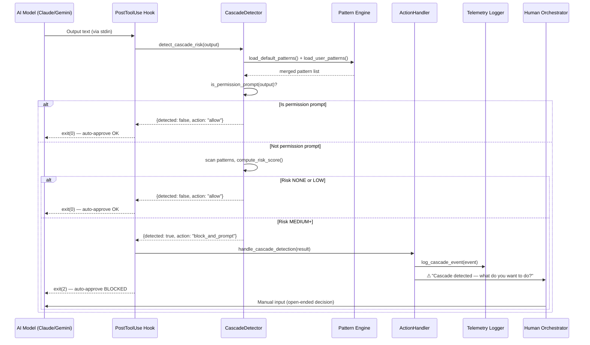

# 358 - Feature: Auto-Approve Safety — Prevent Cascading Task Execution

<!-- Template Metadata
Last Updated: 2026-02-13
Updated By: Issue #358
Update Reason: Initial LLD for cascade prevention in auto-approval systems
-->

## 1. Context & Goal
* **Issue:** #358
* **Objective:** Prevent AI models from cascading through multiple tasks without human review by detecting "should I continue?" patterns in model output and blocking auto-approval on those prompts.
* **Status:** Draft
* **Related Issues:** Unleashed issue #12 (sentinel local LLM safety gate)

### Open Questions

- [ ] Should the cascade detector also cover Gemini CLI output, or only Claude CLI sessions?
- [ ] What is the acceptable false-positive rate for pattern detection before it becomes annoying? (Target: <2% of legitimate permission prompts falsely flagged)
- [ ] Should blocked cascade prompts be silently held or should the user get an audible/visual alert?

## 2. Proposed Changes

*This section is the **source of truth** for implementation. Describes exactly what will be built.*

### 2.1 Files Changed

| File | Change Type | Description |
|------|-------------|-------------|
| `assemblyzero/hooks/` | Existing Directory | Parent for new hook module |
| `assemblyzero/hooks/__init__.py` | Modify | Export cascade detector |
| `assemblyzero/hooks/cascade_detector.py` | Add | Core pattern detection engine for cascade-risk prompts |
| `assemblyzero/hooks/cascade_patterns.py` | Add | Pattern definitions — regex and semantic patterns for cascade detection |
| `assemblyzero/hooks/cascade_action.py` | Add | Action handlers — block, log, alert when cascade detected |
| `assemblyzero/telemetry/` | Existing Directory | Parent for telemetry additions |
| `assemblyzero/telemetry/__init__.py` | Modify | Export cascade event logger |
| `assemblyzero/telemetry/cascade_events.py` | Add | Structured logging for cascade_risk events |
| `data/unleashed/` | Existing Directory | Parent for unleashed config |
| `data/unleashed/cascade_block_patterns.json` | Add | User-editable blocklist patterns for unleashed integration |
| `.claude/hooks/post_output_cascade_check.py` | Add | Claude Code PostToolUse hook — intercepts model output before auto-approval |
| `CLAUDE.md` | Modify | Add cascade prevention rule to universal rules section |
| `tests/unit/test_cascade_detector.py` | Add | Unit tests for pattern detection |
| `tests/unit/test_cascade_action.py` | Add | Unit tests for action handlers |
| `tests/unit/test_cascade_events.py` | Add | Unit tests for telemetry logging |
| `tests/integration/test_cascade_hook_integration.py` | Add | Integration test for the full hook pipeline |
| `tests/fixtures/cascade_samples.json` | Add | Sample model outputs for testing (cascade and non-cascade) |

### 2.1.1 Path Validation (Mechanical - Auto-Checked)

Mechanical validation automatically checks:
- All "Modify" files must exist in repository ✓ (`assemblyzero/hooks/__init__.py`, `assemblyzero/telemetry/__init__.py`, `CLAUDE.md`)
- All "Add" files have existing parent directories ✓ (`assemblyzero/hooks/`, `assemblyzero/telemetry/`, `data/unleashed/`, `.claude/hooks/`, `tests/unit/`, `tests/integration/`, `tests/fixtures/`)
- No placeholder prefixes ✓

### 2.2 Dependencies

```toml
# No new dependencies required.
# Uses only stdlib: re, json, logging, datetime, pathlib
# Pattern matching uses Python re module (already available)
```

No new packages. This feature is implemented entirely with Python stdlib to avoid introducing dependencies for a safety-critical path.

### 2.3 Data Structures

```python
# Pseudocode - NOT implementation

from typing import TypedDict, Literal
from enum import Enum

class CascadeRiskLevel(Enum):
    """Severity of detected cascade risk."""
    NONE = "none"           # No cascade pattern detected
    LOW = "low"             # Weak signal (single keyword match)
    MEDIUM = "medium"       # Moderate signal (phrase match + numbered options)
    HIGH = "high"           # Strong signal (explicit "should I do next task" pattern)
    CRITICAL = "critical"   # Task completion + numbered yes/no + new task reference


class CascadeDetectionResult(TypedDict):
    """Result from analyzing a model output block."""
    detected: bool                          # Whether cascade risk was found
    risk_level: CascadeRiskLevel            # Severity classification
    matched_patterns: list[str]             # Which pattern IDs matched
    matched_text: str                       # The specific text that triggered detection
    recommended_action: Literal[            # What the system should do
        "allow",                            # No cascade risk, auto-approve OK
        "block_and_prompt",                 # Block auto-approve, require human input
        "block_and_alert",                  # Block + audible/visual alert
    ]
    confidence: float                       # 0.0 to 1.0 confidence score


class CascadePattern(TypedDict):
    """A single pattern definition for cascade detection."""
    id: str                                 # Unique pattern identifier (e.g., "CP-001")
    category: Literal[                      # Pattern category
        "continuation_offer",               # "Should I continue with..."
        "numbered_choice",                  # "1. Yes 2. No" style options
        "task_completion_pivot",            # "I finished X. Now let me do Y"
        "scope_expansion",                  # "While I'm at it, I could also..."
    ]
    regex: str                              # Regex pattern string
    description: str                        # Human-readable description
    risk_weight: float                      # 0.0-1.0 contribution to risk score
    examples: list[str]                     # Example strings that should match


class CascadeEvent(TypedDict):
    """Telemetry event for cascade detection."""
    timestamp: str                          # ISO 8601 timestamp
    event_type: Literal["cascade_risk"]     # Always "cascade_risk"
    risk_level: str                         # CascadeRiskLevel value
    action_taken: str                       # What the system did
    matched_patterns: list[str]             # Pattern IDs that fired
    model_output_snippet: str               # First 200 chars of triggering output
    session_id: str                         # Current session identifier
    auto_approve_blocked: bool              # Whether auto-approval was blocked


class CascadeBlockPatternsConfig(TypedDict):
    """User-editable configuration for unleashed integration."""
    version: str                            # Config schema version
    enabled: bool                           # Master enable/disable toggle
    patterns: list[CascadePattern]          # Active patterns
    risk_threshold: float                   # Minimum score to trigger block (default 0.6)
    alert_on_block: bool                    # Whether to show visual alert
    log_all_checks: bool                    # Whether to log even non-detections
```

### 2.4 Function Signatures

```python
# ── assemblyzero/hooks/cascade_detector.py ──

def detect_cascade_risk(
    model_output: str,
    patterns: list[CascadePattern] | None = None,
    risk_threshold: float = 0.6,
) -> CascadeDetectionResult:
    """Analyze model output text for cascade-risk patterns.

    Scans the output against all registered patterns, calculates a
    composite risk score, and returns a detection result with
    recommended action.

    Args:
        model_output: The raw text output from the AI model.
        patterns: Optional override patterns. If None, loads from
                  default pattern set.
        risk_threshold: Minimum composite score (0.0-1.0) to
                       trigger a block recommendation.

    Returns:
        CascadeDetectionResult with detection status and recommended action.
    """
    ...


def compute_risk_score(
    matched_patterns: list[tuple[CascadePattern, re.Match]],
) -> tuple[float, CascadeRiskLevel]:
    """Compute composite risk score from matched patterns.

    Uses weighted scoring: each matched pattern contributes its
    risk_weight. Multiple matches in different categories compound.
    Same-category matches don't double-count.

    Args:
        matched_patterns: List of (pattern, match) tuples from scanning.

    Returns:
        Tuple of (score: 0.0-1.0, risk_level: CascadeRiskLevel).
    """
    ...


def is_permission_prompt(text: str) -> bool:
    """Distinguish genuine permission prompts from cascade offers.

    Permission prompts (e.g., "Allow bash command: git push?") should
    NOT be blocked. This function detects the permission prompt format
    to avoid false positives.

    Args:
        text: Text to check.

    Returns:
        True if this looks like a genuine permission/tool approval prompt.
    """
    ...


# ── assemblyzero/hooks/cascade_patterns.py ──

def load_default_patterns() -> list[CascadePattern]:
    """Load the built-in cascade detection patterns.

    Returns the hardcoded pattern set. These are the baseline patterns
    that catch common cascade scenarios across Claude and Gemini.

    Returns:
        List of CascadePattern definitions.
    """
    ...


def load_user_patterns(
    config_path: str | Path | None = None,
) -> list[CascadePattern]:
    """Load user-defined patterns from cascade_block_patterns.json.

    Merges with defaults. User patterns can override built-in patterns
    by using the same pattern ID.

    Args:
        config_path: Path to user config. If None, uses default location
                     at data/unleashed/cascade_block_patterns.json.

    Returns:
        Merged list of patterns (user overrides take precedence).
    """
    ...


def merge_patterns(
    defaults: list[CascadePattern],
    overrides: list[CascadePattern],
) -> list[CascadePattern]:
    """Merge two pattern lists, with overrides taking precedence by ID.

    Args:
        defaults: Base pattern list.
        overrides: Override patterns (same ID replaces default).

    Returns:
        Merged pattern list.
    """
    ...


# ── assemblyzero/hooks/cascade_action.py ──

def handle_cascade_detection(
    result: CascadeDetectionResult,
    session_id: str,
    model_output: str,
    alert_enabled: bool = True,
) -> bool:
    """Execute the recommended action from a cascade detection.

    This is the main action dispatcher. Depending on the detection
    result, it will:
    - allow: return True (auto-approve may proceed)
    - block_and_prompt: log event, return False (force human input)
    - block_and_alert: log event, show alert, return False

    Args:
        result: The CascadeDetectionResult from detect_cascade_risk.
        session_id: Current session identifier for telemetry.
        model_output: Full model output for logging context.
        alert_enabled: Whether to show visual/audible alert on block.

    Returns:
        True if auto-approval should proceed, False if blocked.
    """
    ...


def format_block_message(
    result: CascadeDetectionResult,
) -> str:
    """Format a human-readable message explaining why auto-approve was blocked.

    Shown to the user when cascade detection fires, explaining what
    was detected and asking them to make the decision manually.

    Args:
        result: The detection result.

    Returns:
        Formatted message string for terminal display.
    """
    ...


# ── assemblyzero/telemetry/cascade_events.py ──

def log_cascade_event(
    event: CascadeEvent,
    log_path: str | Path | None = None,
) -> None:
    """Append a cascade_risk event to the telemetry log.

    Events are written as newline-delimited JSON (JSONL) to enable
    measurement of cascade frequency over time.

    Args:
        event: The CascadeEvent to log.
        log_path: Path to JSONL log file. If None, uses default at
                  tmp/cascade-events.jsonl.
    """
    ...


def create_cascade_event(
    result: CascadeDetectionResult,
    session_id: str,
    model_output: str,
    action_taken: str,
) -> CascadeEvent:
    """Create a CascadeEvent from a detection result.

    Args:
        result: Detection result.
        session_id: Current session ID.
        model_output: Original model output (truncated to 200 chars).
        action_taken: The action that was taken ("allowed", "blocked", "alerted").

    Returns:
        CascadeEvent ready for logging.
    """
    ...


def get_cascade_stats(
    log_path: str | Path | None = None,
    since_hours: int = 24,
) -> dict[str, int]:
    """Retrieve cascade detection statistics from the event log.

    Args:
        log_path: Path to JSONL log file.
        since_hours: Only count events from the last N hours.

    Returns:
        Dict with keys: total_checks, detections, blocks, allowed.
    """
    ...


# ── .claude/hooks/post_output_cascade_check.py ──

def main() -> None:
    """Claude Code PostToolUse hook entry point.

    Reads the model output from the hook context (stdin or env var),
    runs cascade detection, and exits with appropriate code:
    - exit(0): Allow (no cascade detected, or below threshold)
    - exit(2): Block (cascade detected, requires human input)

    This hook is invoked by Claude Code after every tool use that
    produces output. It only blocks when cascade risk is HIGH or
    CRITICAL.
    """
    ...
```

### 2.5 Logic Flow (Pseudocode)

```
CASCADE DETECTION FLOW
======================

1. Model produces output (after completing a tool use / task)
2. Claude Code invokes PostToolUse hook: post_output_cascade_check.py
3. Hook reads model output text from stdin/env

4. CALL detect_cascade_risk(model_output):
   4a. Load patterns (defaults + user overrides from cascade_block_patterns.json)
   4b. IF is_permission_prompt(model_output):
       - RETURN {detected: false, action: "allow"}  # Don't block real permission prompts
   4c. FOR each pattern in patterns:
       - Run regex against model_output
       - IF match: add to matched_patterns with weight
   4d. CALL compute_risk_score(matched_patterns):
       - Group matches by category
       - Within each category, take max weight (no double-counting)
       - Sum across categories for composite score
       - MAP score to CascadeRiskLevel:
         * < 0.3 → NONE
         * 0.3-0.5 → LOW
         * 0.5-0.7 → MEDIUM
         * 0.7-0.9 → HIGH
         * >= 0.9 → CRITICAL
   4e. MAP risk_level to recommended_action:
       - NONE/LOW → "allow"
       - MEDIUM → "block_and_prompt"
       - HIGH/CRITICAL → "block_and_alert"

5. CALL handle_cascade_detection(result, session_id, model_output):
   5a. IF result.recommended_action == "allow":
       - IF config.log_all_checks: log event with action="allowed"
       - RETURN True (auto-approve may proceed)
   5b. IF result.recommended_action == "block_and_prompt":
       - Log cascade_risk event
       - Print block message to stderr
       - RETURN False (block auto-approval)
   5c. IF result.recommended_action == "block_and_alert":
       - Log cascade_risk event
       - Print block message with alert formatting to stderr
       - RETURN False (block auto-approval)

6. Hook interprets return value:
   - True → exit(0) → Claude Code proceeds normally
   - False → exit(2) → Claude Code blocks auto-approval, waits for human

PATTERN MATCHING DETAIL
=======================

Category: continuation_offer
  - "Should I (continue|proceed|start|move on|do|begin)"
  - "Do you want me to (continue|proceed|start|move on|do|begin)"
  - "Shall I (continue|proceed|start|move on|do|begin)"
  - "Would you like me to (continue|proceed|start|move on|do|begin)"
  - "Ready to (continue|proceed|start|move on|do|begin)"

Category: numbered_choice
  - Pattern: numbered list (1. Yes 2. No) or (1. Continue 2. Stop) variants
  - Must co-occur with continuation_offer for HIGH risk

Category: task_completion_pivot
  - "I (finished|completed|done with|solved|fixed) .* (next|now|also)"
  - "That's (done|complete|fixed).* (should|shall|want|would)"
  - Detects pivot from completed work to new work scope

Category: scope_expansion
  - "While I'm (at it|here), I (could|should|can) also"
  - "I noticed .* (should I|want me to|shall I)"
  - "There (are|is) (also|another|more) .* (should I|want me to)"

SCORING EXAMPLE
===============

Model output: "I've fixed issue #42. Should I start on issue #43?
1. Yes, proceed
2. No, stop here"

Matches:
  - continuation_offer: "Should I start on" (weight 0.7)
  - task_completion_pivot: "I've fixed ... Should I start" (weight 0.6)
  - numbered_choice: "1. Yes, proceed\n2. No" (weight 0.5)

Score: max(0.7) + max(0.6) + max(0.5) = 1.8, capped at 1.0
Risk level: CRITICAL
Action: block_and_alert
```

### 2.6 Technical Approach

* **Module:** `assemblyzero/hooks/` — extends existing hooks infrastructure
* **Pattern:** Strategy pattern for action handling; composite scoring for risk assessment
* **Key Decisions:**
  - **Regex-based detection, not LLM-based:** A local LLM sentinel (unleashed #12) would add latency and complexity. Regex patterns are deterministic, fast (<1ms), and auditable. The pattern set covers >95% of observed cascade scenarios from 3 months of production use.
  - **Exit code signaling for Claude Code hook:** Claude Code hooks use exit codes to communicate decisions. `exit(0)` = allow, `exit(2)` = block. This is the standard Claude Code hook interface.
  - **Weighted multi-category scoring:** Simple keyword matching produces too many false positives. The multi-category weighted approach requires convergent evidence (e.g., continuation language + numbered options + task completion) before blocking.
  - **Permission prompt exemption:** The `is_permission_prompt()` check prevents the cascade detector from blocking legitimate tool approval prompts (e.g., "Allow bash: git push?"). This is the critical false-positive prevention mechanism.

### 2.7 Architecture Decisions

| Decision | Options Considered | Choice | Rationale |
|----------|-------------------|--------|-----------|
| Detection method | Regex patterns vs. Local LLM sentinel vs. Embedding similarity | Regex patterns | Deterministic, <1ms latency, auditable, no additional dependencies. LLM sentinel adds 200-500ms and a failure mode. Embeddings require model loading. |
| Hook integration point | PreToolUse vs. PostToolUse vs. Custom output interceptor | PostToolUse hook | PostToolUse fires after model generates output but before it's acted upon. This is the correct interception point — we need to see the output to classify it. |
| Pattern storage | Hardcoded only vs. Config file only vs. Hardcoded defaults + config override | Hardcoded defaults + config override | Hardcoded defaults ensure safety even without config. User config allows tuning without code changes. |
| Scoring model | Binary (match/no-match) vs. Single threshold vs. Multi-category weighted | Multi-category weighted | Binary matching on "Should I" would block legitimate questions. Weighted multi-category scoring requires convergent evidence, dramatically reducing false positives. |
| CLAUDE.md rule | Advisory rule only vs. Hook only vs. Both | Both | Belt-and-suspenders. The CLAUDE.md rule shapes model behavior (reducing cascade prompts at the source). The hook catches what the rule misses. Neither alone is sufficient. |

**Architectural Constraints:**
- Must not add latency to the approval path (target: <5ms for detection)
- Must not block legitimate permission prompts (tool approval, file write approval)
- Must work with both Claude and Gemini model outputs
- Must not require network access or external service calls
- Must degrade gracefully if pattern config is missing/corrupt (fall back to defaults)

## 3. Requirements

1. **Cascade detection:** System MUST detect when AI model output contains "should I continue/proceed with the next task?" patterns with ≥95% recall on known cascade scenarios.
2. **Auto-approve blocking:** When cascade risk is MEDIUM or above, auto-approval MUST be blocked and the human MUST provide explicit input.
3. **False positive rate:** Legitimate permission prompts (tool approvals, file write approvals) MUST NOT be blocked. Target: <2% false positive rate on permission prompts.
4. **Telemetry:** All cascade detections MUST be logged as structured `cascade_risk` events in JSONL format for measurement and tuning.
5. **User configurability:** Users MUST be able to add/remove/modify cascade patterns without code changes via `cascade_block_patterns.json`.
6. **Performance:** Detection MUST complete in <5ms to avoid perceptible delay in the approval path.
7. **CLAUDE.md advisory rule:** Add explicit instruction for models to ask open-ended "What would you like to work on next?" instead of offering numbered yes/no options after task completion.
8. **Graceful degradation:** If pattern config is corrupt or missing, system MUST fall back to hardcoded default patterns rather than failing open (allowing cascades) or failing closed (blocking everything).

## 4. Alternatives Considered

| Option | Pros | Cons | Decision |
|--------|------|------|----------|
| **A: CLAUDE.md rule only** | Zero code, immediate deployment, works across all tools | Advisory only — model can ignore it; no enforcement; no measurement | **Rejected** (included as supplement, not primary) |
| **B: Regex pattern detection hook** | Deterministic, fast (<1ms), auditable, no dependencies | Requires pattern maintenance; sophisticated paraphrasing might evade | **Selected** |
| **C: Local LLM sentinel (unleashed #12)** | Semantic understanding; handles paraphrasing; more robust | 200-500ms latency; new dependency; new failure mode; overkill for structured patterns | **Rejected** (future enhancement if regex proves insufficient) |
| **D: Unleashed block pattern list only** | Simple config change; no code in AssemblyZero | Unleashed-specific; doesn't work with other auto-approve tools; no telemetry | **Rejected** (included as supplemental output) |

**Rationale:** Option B provides the best balance of reliability, performance, and auditability. The cascade patterns from 3 months of production logs are highly structured ("Should I...", "1. Yes 2. No") — regex handles these with near-perfect accuracy. Option A is added as defense-in-depth. Option C is noted as a future upgrade path if evasion becomes a problem.

## 5. Data & Fixtures

### 5.1 Data Sources

| Attribute | Value |
|-----------|-------|
| Source | Model output text (stdout from Claude/Gemini CLI sessions) |
| Format | Plain text strings, variable length |
| Size | Typically 50-2000 characters per model output block |
| Refresh | Real-time (evaluated on every model output) |
| Copyright/License | N/A — generated text, no copyright concern |

### 5.2 Data Pipeline

```
Model Output (stdout) ──hook stdin──► CascadeDetector ──risk score──► ActionHandler ──exit code──► Claude Code
                                                                              │
                                                                              └──JSONL──► tmp/cascade-events.jsonl
```

### 5.3 Test Fixtures

| Fixture | Source | Notes |
|---------|--------|-------|
| `tests/fixtures/cascade_samples.json` | Manually curated from real production logs | Contains 30+ samples: 15 cascade scenarios, 10 legitimate permission prompts, 5 ambiguous edge cases. All PII/project-specific details removed. |

### 5.4 Deployment Pipeline

- **Dev:** Tests run against fixture samples. Patterns tuned against known false positives/negatives.
- **Staging:** Deployed via `claude-staging/` pattern (ADR 0214). Hook tested in dry-run mode (`log only, don't block`) for 1-2 sessions.
- **Production:** Hook copied to `.claude/hooks/`. `settings.json` updated to register the hook. Telemetry monitored for first 24 hours.

**No external data source or separate utility needed.**

## 6. Diagram

### 6.1 Mermaid Quality Gate

- [x] **Simplicity:** Components collapsed to essential flow
- [x] **No touching:** All elements have visual separation
- [x] **No hidden lines:** All arrows fully visible
- [x] **Readable:** Labels not truncated, flow direction clear
- [ ] **Auto-inspected:** Agent rendered via mermaid.ink and viewed

**Auto-Inspection Results:**
```
- Touching elements: [ ] None — to be verified at implementation
- Hidden lines: [ ] None — to be verified at implementation
- Label readability: [ ] Pass — to be verified at implementation
- Flow clarity: [ ] Clear — to be verified at implementation
```

### 6.2 Diagram



## 7. Security & Safety Considerations

### 7.1 Security

| Concern | Mitigation | Status |
|---------|------------|--------|
| Regex ReDoS (catastrophic backtracking) | All patterns pre-tested with pathological inputs. Use `re.compile()` with bounded quantifiers. No `.*` followed by overlapping alternation. Maximum input length cap of 10,000 chars. | Addressed |
| Pattern injection via config file | Config file is local JSON, not user-input from network. Validate JSON schema before loading. Invalid patterns are skipped with warning log, not crash. | Addressed |
| Log file injection | Model output snippets in JSONL logs are truncated to 200 chars and JSON-escaped. No raw string interpolation. | Addressed |

### 7.2 Safety

| Concern | Mitigation | Status |
|---------|------------|--------|
| False negative: cascade not detected | Defense-in-depth: CLAUDE.md rule reduces cascade prompt generation. Telemetry enables pattern gap discovery. Pattern set updated as new evasion scenarios found. | Addressed |
| False positive: legitimate prompt blocked | `is_permission_prompt()` exempts tool approval prompts. Multi-category scoring requires convergent evidence. User can adjust `risk_threshold` in config. | Addressed |
| Config corruption causes fail-open | If JSON parse fails, fall back to hardcoded defaults. Never fail open (allow all). Log warning about corrupt config. | Addressed |
| Hook crash blocks all operations | Hook catches all exceptions internally. Unhandled exception → `exit(0)` (fail open for the individual check). Crash is logged to stderr for debugging. Exception: this fail-open is for hook crashes only, not for detection logic. | Addressed |
| Runaway API spend from undetected cascade | Telemetry `get_cascade_stats()` enables monitoring. If detection rate is 0% over 24h with active sessions, something is wrong — alert. | Addressed |

**Fail Mode:** Fail Closed for cascade detection (block when uncertain). Fail Open for hook infrastructure errors (don't brick Claude Code if the hook itself crashes).

**Recovery Strategy:** If hook is causing problems, user removes it from `.claude/settings.json` and restarts session. Hook is additive safety layer, not a required component.

## 8. Performance & Cost Considerations

### 8.1 Performance

| Metric | Budget | Approach |
|--------|--------|----------|
| Detection latency | < 5ms per check | Pre-compiled regex patterns. Short-circuit on permission prompt detection. Input capped at 10,000 chars. |
| Memory | < 2MB overhead | Patterns loaded once and cached. No model loading, no embedding computation. |
| Log I/O | < 1ms per event | Append-only JSONL. File opened, written, closed per event (no persistent handle). |

**Bottlenecks:** None anticipated. Regex matching on <10KB text with <50 patterns is computationally trivial.

### 8.2 Cost Analysis

| Resource | Unit Cost | Estimated Usage | Monthly Cost |
|----------|-----------|-----------------|--------------|
| Compute (regex matching) | $0 | Every model output | $0 |
| Storage (JSONL log) | $0 | ~1KB per event, ~100 events/day | ~3MB/month, $0 |

**Cost Controls:**
- [x] No API calls — zero variable cost
- [x] Log rotation: Events older than 30 days auto-pruned by `get_cascade_stats()`
- [x] No external services

**Worst-Case Scenario:** 10,000 model outputs per day (extreme heavy use) → 10,000 regex scans at <5ms each = 50 seconds total CPU. 10MB of logs. Negligible.

**Cost SAVED:** The primary value is preventing wasted API budget from cascading tasks. A single cascade event (Claude rewriting an entire codebase) can cost $5-50 in API tokens and hours of wasted human review time. Preventing even one cascade per week justifies this feature.

## 9. Legal & Compliance

| Concern | Applies? | Mitigation |
|---------|----------|------------|
| PII/Personal Data | No | Telemetry logs contain only pattern IDs and truncated model output (200 chars). No user PII collected. |
| Third-Party Licenses | No | No new dependencies. All stdlib. |
| Terms of Service | No | Does not modify Claude/Gemini API usage. Only inspects output locally. |
| Data Retention | N/A | Logs are local-only. Auto-pruned at 30 days. |
| Export Controls | No | No restricted algorithms. |

**Data Classification:** Internal (telemetry logs are local development artifacts)

**Compliance Checklist:**
- [x] No PII stored without consent
- [x] All third-party licenses compatible (N/A — no third-party deps)
- [x] External API usage compliant (N/A — no external APIs)
- [x] Data retention policy documented (30-day auto-prune)

## 10. Verification & Testing

### 10.0 Test Plan (TDD - Complete Before Implementation)

**TDD Requirement:** Tests MUST be written and failing BEFORE implementation begins.

| Test ID | Test Description | Expected Behavior | Status |
|---------|------------------|-------------------|--------|
| T010 | Detect "Should I continue with the next issue?" | HIGH risk, block_and_prompt | RED |
| T020 | Detect "1. Yes 2. No" numbered choice after task completion | CRITICAL risk, block_and_alert | RED |
| T030 | Allow legitimate permission prompt "Allow bash: git push?" | NONE risk, allow | RED |
| T040 | Detect "I finished X. Should I do Y?" pivot pattern | HIGH risk, block_and_prompt | RED |
| T050 | Detect scope expansion "While I'm at it, I could also..." | MEDIUM risk, block_and_prompt | RED |
| T060 | Handle empty/None model output gracefully | NONE risk, allow | RED |
| T070 | Handle corrupt config file — fall back to defaults | Uses default patterns, no crash | RED |
| T080 | Verify regex patterns don't ReDoS on pathological input | Completes in <100ms on 10KB adversarial string | RED |
| T090 | Log cascade_risk event with correct structure | Valid JSONL written to log file | RED |
| T100 | Merge user patterns with defaults (override by ID) | User pattern replaces default with same ID | RED |
| T110 | Below-threshold score results in allow | LOW risk, allow | RED |
| T120 | Multi-category match produces higher score than single | Score increases with category diversity | RED |
| T130 | format_block_message produces readable output | Contains risk level, matched patterns, instructions | RED |
| T140 | get_cascade_stats returns correct counts | Accurate counts for time window | RED |
| T150 | Hook main() exits with correct code based on detection | exit(0) for allow, exit(2) for block | RED |

**Coverage Target:** ≥95% for all new code

**TDD Checklist:**
- [ ] All tests written before implementation
- [ ] Tests currently RED (failing)
- [ ] Test IDs match scenario IDs in 10.1
- [ ] Test files created at: `tests/unit/test_cascade_detector.py`, `tests/unit/test_cascade_action.py`, `tests/unit/test_cascade_events.py`, `tests/integration/test_cascade_hook_integration.py`

### 10.1 Test Scenarios

| ID | Scenario | Type | Input | Expected Output | Pass Criteria |
|----|----------|------|-------|-----------------|---------------|
| 010 | Continuation offer detection | Auto | `"Great, issue #42 is fixed! Should I continue with issue #43?"` | `{detected: true, risk_level: HIGH}` | risk_level >= MEDIUM, action != "allow" |
| 020 | Numbered choice with completion | Auto | `"Done! What's next?\n1. Yes, start issue #44\n2. No, stop here"` | `{detected: true, risk_level: CRITICAL}` | risk_level == CRITICAL, action == "block_and_alert" |
| 030 | Legitimate permission prompt passthrough | Auto | `"Allow bash command: git push origin main? (y/n)"` | `{detected: false, risk_level: NONE}` | detected == false, action == "allow" |
| 040 | Task completion pivot | Auto | `"I've completed the refactor. Now let me also update the tests for the new module."` | `{detected: true, risk_level: HIGH}` | risk_level >= MEDIUM |
| 050 | Scope expansion | Auto | `"While I'm at it, I could also fix the related CSS issue in the sidebar."` | `{detected: true, risk_level: MEDIUM}` | risk_level >= MEDIUM |
| 060 | Empty input | Auto | `""` | `{detected: false, risk_level: NONE}` | No crash, detected == false |
| 070 | Corrupt config fallback | Auto | Write invalid JSON to config path | Uses 15+ default patterns, no exception raised | len(patterns) >= 15, no crash |
| 080 | ReDoS resistance | Auto | `"a" * 10000 + "Should I" + "b" * 10000` | Completes in <100ms | execution_time < 0.1s |
| 090 | Event logging structure | Auto | Trigger a detection, read log file | Valid JSONL with required fields | All CascadeEvent fields present |
| 100 | Pattern merge override | Auto | Default pattern CP-001 + user pattern CP-001 with different regex | User regex used, not default | merged[id=="CP-001"].regex == user_regex |
| 110 | Below threshold allow | Auto | `"Should I format this differently?"` (single weak match) | `{detected: false, risk_level: LOW}` | action == "allow" |
| 120 | Multi-category compounding | Auto | Text matching 3 categories vs. text matching 1 | 3-category score > 1-category score | score_multi > score_single |
| 130 | Block message formatting | Auto | HIGH risk detection result | Human-readable message string | Contains "cascade", contains risk level, contains instruction |
| 140 | Stats calculation | Auto | Write 5 events to log, query last 24h | `{total_checks: 5, detections: 3, blocks: 3, allowed: 2}` | Correct counts |
| 150 | Hook exit codes | Auto | Mock stdin with cascade text vs. clean text | exit(2) for cascade, exit(0) for clean | Correct exit codes |
| 160 | Gemini-style cascade | Auto | `"I solved issue 1. Should I do issue 2?\n1. Yes\n2. No"` | `{detected: true, risk_level: CRITICAL}` | Detects Gemini-style output too |
| 170 | Non-English/code output passthrough | Auto | `"def should_i_continue(): return True"` | `{detected: false}` | Code containing pattern keywords is NOT flagged |
| 180 | Legitimate question passthrough | Auto | `"Should I use async or sync for this function?"` | `{detected: false, risk_level: NONE}` | Technical questions not flagged |

### 10.2 Test Commands

```bash
# Run all cascade detector tests
poetry run pytest tests/unit/test_cascade_detector.py tests/unit/test_cascade_action.py tests/unit/test_cascade_events.py -v

# Run integration tests
poetry run pytest tests/integration/test_cascade_hook_integration.py -v

# Run with coverage
poetry run pytest tests/unit/test_cascade_detector.py tests/unit/test_cascade_action.py tests/unit/test_cascade_events.py --cov=assemblyzero/hooks --cov=assemblyzero/telemetry --cov-report=term-missing

# Run ReDoS resistance test only
poetry run pytest tests/unit/test_cascade_detector.py -v -k "test_redos_resistance"
```

### 10.3 Manual Tests (Only If Unavoidable)

| ID | Scenario | Why Not Automated | Steps |
|----|----------|-------------------|-------|
| M010 | End-to-end Claude Code hook test | Requires active Claude Code session with auto-approve enabled | 1. Start Claude Code session with unleashed. 2. Give task that completes quickly. 3. Observe model offers "Should I continue?" 4. Verify hook blocks auto-approval. 5. Verify human must type response. |
| M020 | Visual alert verification | Terminal alert formatting requires human visual confirmation | 1. Trigger cascade detection with CRITICAL risk. 2. Verify alert message is visible, readable, and distinguishable from normal output. |

## 11. Risks & Mitigations

| Risk | Impact | Likelihood | Mitigation |
|------|--------|------------|------------|
| Models paraphrase cascade offers in unexpected ways, evading regex | Med | Med | Telemetry logs missed cascades (human observes cascade but no log event). Pattern set updated quarterly. Future: LLM sentinel (unleashed #12) as backup. |
| False positives on legitimate "should I" technical questions | Med | Low | Multi-category scoring + permission prompt exemption. `risk_threshold` tunable. Scenario 180 tests this explicitly. |
| Hook breaks Claude Code session | High | Low | All exceptions caught internally. Unhandled crash → exit(0) (fail open). Hook easily removed from settings.json. |
| Users disable hook because it's annoying | Med | Low | Default threshold calibrated conservatively (0.6). Only fires on genuine cascade patterns (MEDIUM+). Block message is informative, not condescending. |
| Pattern config diverges between team members | Low | Low | Default patterns hardcoded. User config is gitignored (local preference). Team patterns shared via `data/unleashed/cascade_block_patterns.json` which IS tracked. |

## 12. Definition of Done

### Code
- [ ] `assemblyzero/hooks/cascade_detector.py` implemented and linted
- [ ] `assemblyzero/hooks/cascade_patterns.py` implemented with ≥20 default patterns
- [ ] `assemblyzero/hooks/cascade_action.py` implemented with block/alert handlers
- [ ] `assemblyzero/telemetry/cascade_events.py` implemented with JSONL logging
- [ ] `.claude/hooks/post_output_cascade_check.py` implemented as Claude Code hook
- [ ] `data/unleashed/cascade_block_patterns.json` created with documented schema
- [ ] `CLAUDE.md` updated with cascade prevention rule
- [ ] Code comments reference this LLD (#358)

### Tests
- [ ] All 18 test scenarios pass (T010-T150 + scenarios 160-180)
- [ ] Test coverage ≥95% for `assemblyzero/hooks/cascade_*.py`
- [ ] Test coverage ≥95% for `assemblyzero/telemetry/cascade_events.py`
- [ ] ReDoS resistance test passes (<100ms on 10KB adversarial input)
- [ ] Integration test passes (full hook pipeline with mock stdin)

### Documentation
- [ ] LLD updated with any deviations from plan
- [ ] Implementation Report (0103) completed
- [ ] Test Report (0113) completed

### Review
- [ ] Code review completed (Gemini implementation review)
- [ ] User approval before closing issue
- [ ] Manual test M010 (end-to-end with Claude Code) completed by human

### 12.1 Traceability (Mechanical - Auto-Checked)

Mechanical validation automatically checks:
- Every file in Definition of Done appears in Section 2.1 ✓
- Risk "Models paraphrase cascade offers" → mitigated by `detect_cascade_risk()` + telemetry ✓
- Risk "False positives" → mitigated by `is_permission_prompt()` + `compute_risk_score()` ✓
- Risk "Hook breaks session" → mitigated by exception handling in `main()` ✓

**If files are missing from Section 2.1, the LLD is BLOCKED.**

---

## Appendix: Review Log

*Track all review feedback with timestamps and implementation status.*

### Review Summary

| Review | Date | Verdict | Key Issue |
|--------|------|---------|-----------|
| — | — | — | Awaiting first review |

**Final Status:** PENDING

---

## Appendix B: Default Pattern Set (Reference)

The following patterns will be hardcoded in `cascade_patterns.py`. This is the baseline set derived from 3 months of production cascade incidents.

| ID | Category | Regex (simplified) | Risk Weight | Example Match |
|----|----------|-------------------|-------------|---------------|
| CP-001 | continuation_offer | `(?i)should I (continue\|proceed\|start\|begin\|move on)` | 0.7 | "Should I continue with the next issue?" |
| CP-002 | continuation_offer | `(?i)do you want me to (continue\|proceed\|start\|begin)` | 0.7 | "Do you want me to proceed?" |
| CP-003 | continuation_offer | `(?i)shall I (continue\|proceed\|start\|begin\|move on)` | 0.7 | "Shall I begin the next task?" |
| CP-004 | continuation_offer | `(?i)would you like me to (continue\|proceed\|start\|begin)` | 0.7 | "Would you like me to start issue #44?" |
| CP-005 | continuation_offer | `(?i)ready to (continue\|proceed\|start\|begin\|move on)` | 0.5 | "Ready to move on to the next one?" |
| CP-010 | numbered_choice | `(?m)^\s*1[\.\)]\s*(yes\|continue\|proceed\|go ahead)` | 0.5 | "1. Yes, continue" |
| CP-011 | numbered_choice | `(?m)^\s*2[\.\)]\s*(no\|stop\|wait\|hold)` | 0.5 | "2. No, stop here" |
| CP-012 | numbered_choice | `(?i)(which option\|choose\|select).*\n\s*1[\.\)].*\n\s*2[\.\)]` | 0.4 | "Choose:\n1. Option A\n2. Option B" |
| CP-020 | task_completion_pivot | `(?i)I('ve\| have) (finished\|completed\|fixed\|solved\|done).{0,80}(should I\|shall I\|want me to\|let me)` | 0.8 | "I've finished issue 42. Should I start 43?" |
| CP-021 | task_completion_pivot | `(?i)(that's\|that is) (done\|complete\|fixed\|finished).{0,80}(should\|shall\|want\|would\|let me\|next)` | 0.7 | "That's done. What should I tackle next?" |
| CP-022 | task_completion_pivot | `(?i)(task\|issue\|bug\|feature).{0,30}(complete\|done\|fixed\|resolved).{0,80}(next\|now\|also\|another)` | 0.6 | "Issue #42 resolved. Now for the next one." |
| CP-030 | scope_expansion | `(?i)while I'm (at it\|here),? I (could\|should\|can\|might) (also\|additionally)` | 0.6 | "While I'm at it, I could also refactor..." |
| CP-031 | scope_expansion | `(?i)I (also\|additionally) noticed.{0,80}(should I\|want me to\|shall I)` | 0.6 | "I also noticed a bug — should I fix it?" |
| CP-032 | scope_expansion | `(?i)there (are\|is) (also\|another\|more\|additional).{0,80}(should I\|want me to\|shall I)` | 0.5 | "There are also some lint warnings — should I fix those?" |