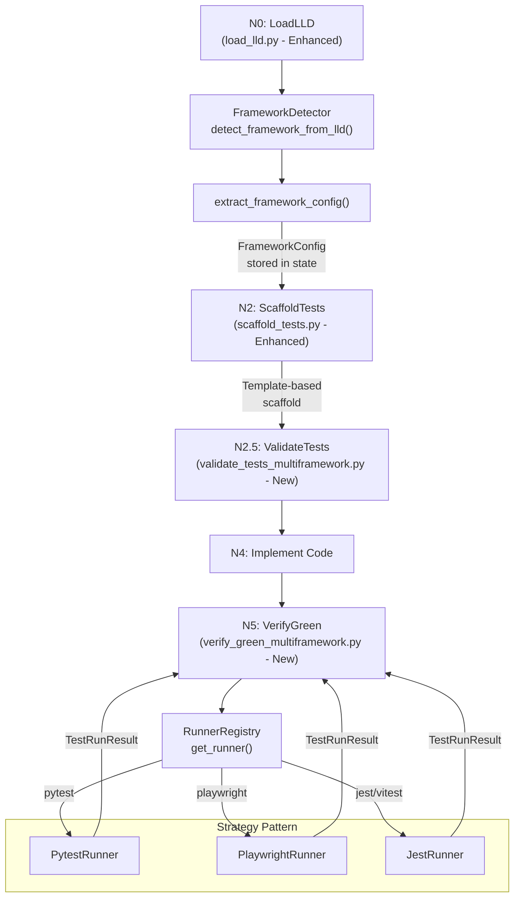
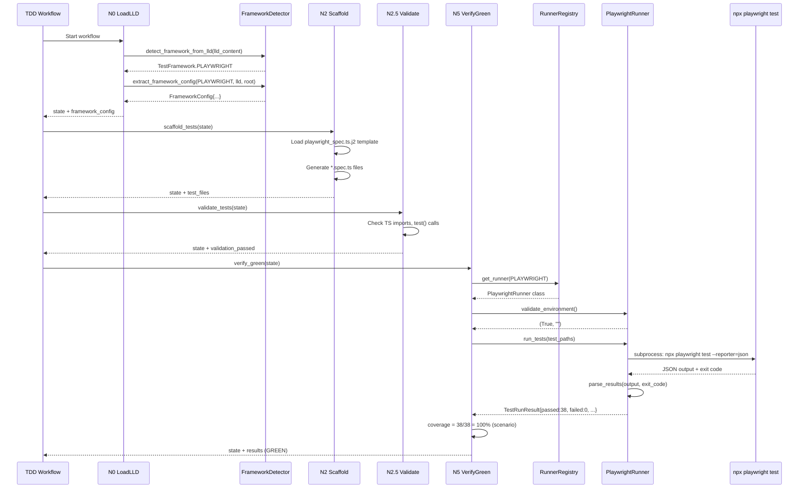

# 381 - Feature: Multi-Framework Test Runner Support for TDD Workflow

<!-- Template Metadata
Last Updated: 2026-02-17
Updated By: Issue #381
Update Reason: Initial LLD for supporting Playwright/TypeScript and other non-pytest test frameworks in the TDD implementation workflow. Revised to fix mechanical validation errors for non-existent Modify files.
-->

## 1. Context & Goal
* **Issue:** #381
* **Objective:** Extend the TDD implementation workflow to detect test framework from LLD metadata and adapt scaffold generation, validation, test execution, and coverage measurement accordingly—supporting Playwright/TypeScript, Jest/Vitest, and pytest.
* **Status:** Draft
* **Related Issues:** Hermes #56 (Playwright dashboard test suite that triggered discovery)

### Open Questions

- [ ] Should we support mixed-framework LLDs (e.g., pytest unit tests + Playwright e2e in one issue)?
- [ ] For e2e-only LLDs, what is the minimum "coverage" threshold — scenario pass rate or skip coverage entirely?
- [ ] Do we need `npx` availability detection, or can we assume Node.js is present when a JS/TS framework is specified?

## 2. Proposed Changes

*This section is the **source of truth** for implementation. Describes exactly what will be built.*

### 2.1 Files Changed

| File | Change Type | Description |
|------|-------------|-------------|
| `assemblyzero/workflows/testing/` | Existing Directory | Parent for test runner modules |
| `assemblyzero/workflows/testing/framework_detector.py` | Add | Detects test framework from LLD content and metadata |
| `assemblyzero/workflows/testing/runner_registry.py` | Add | Registry mapping framework IDs to runner configurations |
| `assemblyzero/workflows/testing/runners/` | Add (Directory) | Package for framework-specific test runner adapters |
| `assemblyzero/workflows/testing/runners/__init__.py` | Add | Package init exporting runner classes |
| `assemblyzero/workflows/testing/runners/base_runner.py` | Add | Abstract base class for all test runners |
| `assemblyzero/workflows/testing/runners/pytest_runner.py` | Add | Pytest runner adapter (refactored from inline logic) |
| `assemblyzero/workflows/testing/runners/playwright_runner.py` | Add | Playwright (`npx playwright test`) runner adapter |
| `assemblyzero/workflows/testing/runners/jest_runner.py` | Add | Jest/Vitest runner adapter |
| `assemblyzero/workflows/testing/nodes/scaffold_tests.py` | Modify | Use framework-aware scaffolding (N2 node) |
| `assemblyzero/workflows/testing/nodes/load_lld.py` | Modify | Parse and store `test_framework` in workflow state (N0 node) |
| `assemblyzero/workflows/testing/nodes/validate_tests_multiframework.py` | Add | New node module for framework-aware import/syntax validation (N2.5 replacement) |
| `assemblyzero/workflows/testing/nodes/verify_green_multiframework.py` | Add | New node module delegating to appropriate runner for execution + coverage (N5 replacement) |
| `assemblyzero/workflows/testing/templates/` | Existing Directory | Templates for test scaffolding |
| `assemblyzero/workflows/testing/templates/playwright_spec.ts.j2` | Add | Jinja2 template for Playwright `.spec.ts` scaffolds |
| `assemblyzero/workflows/testing/templates/jest_test.ts.j2` | Add | Jinja2 template for Jest/Vitest `.test.ts` scaffolds |
| `tests/unit/test_framework_detector.py` | Add | Unit tests for framework detection |
| `tests/unit/test_runner_registry.py` | Add | Unit tests for runner registry |
| `tests/unit/test_pytest_runner.py` | Add | Unit tests for pytest runner adapter |
| `tests/unit/test_playwright_runner.py` | Add | Unit tests for Playwright runner adapter |
| `tests/unit/test_jest_runner.py` | Add | Unit tests for Jest runner adapter |
| `tests/unit/test_validate_tests_multiframework.py` | Add | Tests for multi-framework validation logic |
| `tests/unit/test_scaffold_tests_multiframework.py` | Add | Tests for multi-framework scaffolding logic |
| `tests/fixtures/lld_samples/` | Add (Directory) | Sample LLD snippets for test fixtures |
| `tests/fixtures/lld_samples/playwright_lld.md` | Add | Sample LLD specifying Playwright framework |
| `tests/fixtures/lld_samples/pytest_lld.md` | Add | Sample LLD specifying pytest (baseline) |
| `tests/fixtures/lld_samples/jest_lld.md` | Add | Sample LLD specifying Jest |
| `tests/fixtures/lld_samples/ambiguous_lld.md` | Add | Sample LLD with no explicit framework declaration |

**Note on validation/verify nodes:** The original draft listed `validate_tests.py` and `verify_green.py` as Modify targets, but these files do not exist in the repository. Instead, we add new modules (`validate_tests_multiframework.py` and `verify_green_multiframework.py`) and modify the existing `scaffold_tests.py` and `load_lld.py` nodes that do exist. The new multiframework modules will be wired into the graph in place of any inline validation/verification logic.

### 2.1.1 Path Validation (Mechanical - Auto-Checked)

Mechanical validation automatically checks:
- All "Modify" files must exist in repository:
  - `assemblyzero/workflows/testing/nodes/scaffold_tests.py` — **exists** ✓
  - `assemblyzero/workflows/testing/nodes/load_lld.py` — **exists** ✓
- All "Add" files must have existing parent directories:
  - `assemblyzero/workflows/testing/runners/` — created as Add (Directory) before files inside it ✓
  - `tests/fixtures/lld_samples/` — created as Add (Directory) before fixture files ✓
  - `assemblyzero/workflows/testing/nodes/` — **exists** ✓
  - `assemblyzero/workflows/testing/templates/` — **exists** ✓
  - `tests/unit/` — **exists** ✓

**If validation fails, the LLD is BLOCKED before reaching review.**

### 2.2 Dependencies

```toml
# pyproject.toml additions
# None — subprocess calls to npx/playwright/jest require Node.js on PATH
# but no new Python packages are needed.
# Jinja2 is already available via langchain dependency chain.
```

No new Python dependencies required. Node.js + npm must be available on the system PATH when running Playwright or Jest frameworks. This is a runtime prerequisite, not a Python dependency.

### 2.3 Data Structures

```python
# Pseudocode - NOT implementation

from enum import Enum
from typing import TypedDict, Optional


class TestFramework(str, Enum):
    """Supported test frameworks."""
    PYTEST = "pytest"
    PLAYWRIGHT = "playwright"
    JEST = "jest"
    VITEST = "vitest"


class CoverageType(str, Enum):
    """How to measure test coverage."""
    LINE = "line"           # Traditional line coverage (pytest-cov)
    SCENARIO = "scenario"   # Pass/total scenarios (e2e tests)
    NONE = "none"           # No coverage measurement


class FrameworkConfig(TypedDict):
    """Configuration for a detected test framework."""
    framework: TestFramework
    test_runner_command: str           # e.g. "npx playwright test"
    test_file_pattern: str             # e.g. "*.spec.ts"
    test_file_extension: str           # e.g. ".spec.ts"
    scaffold_template: str             # e.g. "playwright_spec.ts.j2"
    import_patterns: list[str]         # e.g. ["import { test, expect }"]
    coverage_type: CoverageType
    coverage_target: float             # e.g. 0.95 for 95%
    result_parser: str                 # e.g. "json" reporter type
    working_directory: Optional[str]   # e.g. "dashboard/" for subproject


class TestRunResult(TypedDict):
    """Normalized result from any test runner."""
    total: int
    passed: int
    failed: int
    skipped: int
    errors: int
    coverage_percent: Optional[float]  # None if coverage_type is NONE
    coverage_type: CoverageType
    raw_output: str                    # Full stdout/stderr
    exit_code: int
    duration_seconds: float


# Extension to existing TDD workflow state
class TDDWorkflowStateExtensions(TypedDict):
    """Fields added to existing TDD workflow state."""
    test_framework: TestFramework
    framework_config: FrameworkConfig
    coverage_type: CoverageType
```

### 2.4 Function Signatures

```python
# === framework_detector.py ===

def detect_framework_from_lld(lld_content: str) -> TestFramework:
    """Detect test framework from LLD content using markers and heuristics.

    Searches for explicit framework declarations (## Test Framework: playwright),
    file patterns (*.spec.ts), import statements, and tool references.
    Falls back to PYTEST if no other framework detected.
    """
    ...


def extract_framework_config(
    framework: TestFramework,
    lld_content: str,
    project_root: str,
) -> FrameworkConfig:
    """Build full framework configuration from detected framework and LLD context.

    Resolves working directory, coverage targets, and template paths.
    """
    ...


def _detect_working_directory(lld_content: str, project_root: str) -> Optional[str]:
    """Extract working directory from LLD file paths (e.g., 'dashboard/' from 'dashboard/tests/').

    Returns None if all paths are at project root.
    """
    ...


def _parse_coverage_target(lld_content: str) -> Optional[float]:
    """Extract explicit coverage target from LLD content (e.g., 'Coverage Target: 80%').

    Returns None if no explicit target found (caller uses framework default).
    """
    ...


# === runner_registry.py ===

_RUNNER_REGISTRY: dict[TestFramework, type["BaseTestRunner"]]  # Module-level registry

def get_runner(framework: TestFramework) -> "BaseTestRunner":
    """Return the appropriate test runner instance for the given framework.

    Raises KeyError if framework is not registered.
    """
    ...


def register_runner(framework: TestFramework, runner_class: type) -> None:
    """Register a new runner class for a framework. Used for extensibility."""
    ...


def list_registered_frameworks() -> list[TestFramework]:
    """Return list of all registered framework identifiers."""
    ...


# === runners/base_runner.py ===

class BaseTestRunner:
    """Abstract base class for test runners."""

    def __init__(self, config: FrameworkConfig, project_root: str) -> None:
        """Initialize with framework config and project root path."""
        ...

    def validate_environment(self) -> tuple[bool, str]:
        """Check that required tools are installed (e.g., npx, pytest).

        Returns (is_valid, error_message). error_message is empty string if valid.
        """
        ...

    def run_tests(
        self,
        test_paths: list[str],
        extra_args: Optional[list[str]] = None,
        timeout: int = 300,
    ) -> TestRunResult:
        """Execute tests and return normalized results.

        Args:
            test_paths: List of test file paths to execute.
            extra_args: Additional CLI arguments for the runner.
            timeout: Maximum execution time in seconds.

        Returns:
            Normalized TestRunResult.

        Raises:
            No exceptions — timeout and errors are captured in TestRunResult.
        """
        ...

    def parse_results(self, raw_output: str, exit_code: int) -> TestRunResult:
        """Parse runner-specific output into normalized TestRunResult."""
        ...

    def get_coverage(self, result: TestRunResult) -> Optional[float]:
        """Calculate coverage metric from test results, if applicable for this framework."""
        ...

    def get_scaffold_imports(self) -> str:
        """Return the import block for scaffolded test files."""
        ...

    def _execute_subprocess(
        self,
        command: list[str],
        cwd: str,
        timeout: int,
    ) -> tuple[str, int, float]:
        """Run subprocess with timeout. Returns (output, exit_code, duration_seconds).

        Catches subprocess.TimeoutExpired and returns error info.
        """
        ...


# === runners/pytest_runner.py ===

class PytestRunner(BaseTestRunner):
    """Runner adapter for pytest with pytest-cov."""

    def validate_environment(self) -> tuple[bool, str]:
        """Check pytest is importable."""
        ...

    def run_tests(
        self,
        test_paths: list[str],
        extra_args: Optional[list[str]] = None,
        timeout: int = 300,
    ) -> TestRunResult:
        """Run pytest with JSON output and coverage reporting."""
        ...

    def parse_results(self, raw_output: str, exit_code: int) -> TestRunResult:
        """Parse pytest JSON/stdout output into TestRunResult."""
        ...

    def get_coverage(self, result: TestRunResult) -> Optional[float]:
        """Extract line coverage from pytest-cov output."""
        ...

    def get_scaffold_imports(self) -> str:
        """Return 'import pytest' block."""
        ...


# === runners/playwright_runner.py ===

class PlaywrightRunner(BaseTestRunner):
    """Runner adapter for Playwright Test (npx playwright test)."""

    def validate_environment(self) -> tuple[bool, str]:
        """Check npx and @playwright/test are available."""
        ...

    def run_tests(
        self,
        test_paths: list[str],
        extra_args: Optional[list[str]] = None,
        timeout: int = 300,
    ) -> TestRunResult:
        """Run npx playwright test with JSON reporter."""
        ...

    def parse_results(self, raw_output: str, exit_code: int) -> TestRunResult:
        """Parse Playwright JSON reporter output into TestRunResult."""
        ...

    def get_coverage(self, result: TestRunResult) -> Optional[float]:
        """Return scenario pass rate (passed/total * 100) as coverage metric."""
        ...

    def get_scaffold_imports(self) -> str:
        """Return \"import { test, expect } from '@playwright/test'\" block."""
        ...


# === runners/jest_runner.py ===

class JestRunner(BaseTestRunner):
    """Runner adapter for Jest or Vitest."""

    def validate_environment(self) -> tuple[bool, str]:
        """Check npx and jest/vitest are available."""
        ...

    def run_tests(
        self,
        test_paths: list[str],
        extra_args: Optional[list[str]] = None,
        timeout: int = 300,
    ) -> TestRunResult:
        """Run npx jest/vitest with JSON reporter and optional coverage."""
        ...

    def parse_results(self, raw_output: str, exit_code: int) -> TestRunResult:
        """Parse Jest/Vitest JSON output into TestRunResult."""
        ...

    def get_coverage(self, result: TestRunResult) -> Optional[float]:
        """Extract line coverage from Jest --coverage output."""
        ...

    def get_scaffold_imports(self) -> str:
        """Return Jest/Vitest import block."""
        ...


# === Modified: nodes/load_lld.py ===

def load_lld_with_framework(state: dict) -> dict:
    """N0 node (enhanced): Load LLD and detect + store test framework in state.

    Calls detect_framework_from_lld() and extract_framework_config(),
    stores results in state['test_framework'] and state['framework_config'].
    """
    ...


# === Modified: nodes/scaffold_tests.py ===

def scaffold_tests_multiframework(state: dict) -> dict:
    """N2 node (enhanced): Generate test scaffold files using framework-appropriate templates.

    Reads framework_config from state, selects Jinja2 template, and generates
    test files with correct extensions and imports.
    """
    ...


# === New: nodes/validate_tests_multiframework.py ===

def validate_tests_multiframework(state: dict) -> dict:
    """N2.5 node: Validate generated tests using framework-appropriate rules.

    Checks file extensions, import patterns, and test definition patterns
    based on framework_config in state.
    """
    ...


def _validate_python_test(content: str) -> tuple[bool, list[str]]:
    """Validate a Python test file (pytest). Returns (is_valid, errors)."""
    ...


def _validate_typescript_test(
    content: str, framework: TestFramework
) -> tuple[bool, list[str]]:
    """Validate a TypeScript test file (Playwright/Jest). Returns (is_valid, errors)."""
    ...


# === New: nodes/verify_green_multiframework.py ===

def verify_green_multiframework(state: dict) -> dict:
    """N5 node: Run tests using the appropriate runner and parse results.

    Gets runner from registry, validates environment, executes tests,
    and calculates coverage using framework-appropriate method.
    """
    ...


def _calculate_coverage(
    result: TestRunResult, config: FrameworkConfig
) -> Optional[float]:
    """Calculate coverage based on coverage_type in config.

    LINE: uses runner-reported line coverage.
    SCENARIO: uses passed/total ratio.
    NONE: returns None.
    """
    ...


def _check_pass_criteria(
    result: TestRunResult,
    coverage: Optional[float],
    config: FrameworkConfig,
) -> tuple[bool, str]:
    """Check if test results meet pass criteria. Returns (is_green, reason)."""
    ...
```

### 2.5 Logic Flow (Pseudocode)

```
=== N0: LoadLLD (Enhanced — load_lld.py) ===
1. Load LLD content from file (existing logic)
2. Call detect_framework_from_lld(lld_content)
   a. Scan for explicit "Test Framework:" declaration (regex: r"##?\s*Test Framework\s*:\s*(\w+)")
   b. IF explicit match → return corresponding TestFramework enum
   c. Scan for file patterns (*.spec.ts → Playwright, *.test.ts → Jest)
   d. Scan for import statements (@playwright/test → Playwright, @jest/globals → Jest)
   e. Scan for tool references (npx playwright, npx jest, npx vitest)
   f. Apply scoring: each heuristic match adds 1 point per framework
   g. IF any framework has ≥ 2 points → return that framework
   h. IF none found → default to PYTEST
3. Call extract_framework_config(framework, lld_content, project_root)
   a. Look up defaults from FRAMEWORK_DEFAULTS dict:
      - PYTEST:      {command: "pytest", pattern: "test_*.py",   ext: ".py",      template: None,                   coverage: LINE, target: 0.95}
      - PLAYWRIGHT:  {command: "npx playwright test", pattern: "*.spec.ts", ext: ".spec.ts", template: "playwright_spec.ts.j2", coverage: SCENARIO, target: 1.0}
      - JEST:        {command: "npx jest", pattern: "*.test.ts",  ext: ".test.ts", template: "jest_test.ts.j2",       coverage: LINE, target: 0.95}
      - VITEST:      {command: "npx vitest run", pattern: "*.test.ts",  ext: ".test.ts", template: "jest_test.ts.j2", coverage: LINE, target: 0.95}
   b. Call _parse_coverage_target(lld_content) → override default target if LLD specifies one
   c. Call _detect_working_directory(lld_content, project_root) → e.g., "dashboard/"
   d. Build and return FrameworkConfig
4. Store framework, framework_config, coverage_type in state
5. Return updated state

=== N2: ScaffoldTests (Enhanced — scaffold_tests.py) ===
1. Read framework_config from state
2. IF framework == PYTEST:
   a. Use existing Python scaffold logic (no change to current behavior)
3. ELIF framework == PLAYWRIGHT:
   a. Load playwright_spec.ts.j2 template from assemblyzero/workflows/testing/templates/
   b. For each test group in LLD:
      - Generate {group-name}.spec.ts
      - Template includes: import { test, expect } from '@playwright/test'
      - Structure: test.describe blocks with test() calls containing // TODO placeholders
   c. Write files to working_directory + test path (e.g., dashboard/tests/)
4. ELIF framework in (JEST, VITEST):
   a. Load jest_test.ts.j2 template
   b. Generate {module}.test.ts files
   c. Template includes: import { describe, it, expect } from '@jest/globals' (or 'vitest')
5. Write generated files to temp directory first
6. IF all writes succeed → move atomically to target directory
7. Store generated file paths in state['test_files']
8. Return updated state

=== N2.5: ValidateTests (New — validate_tests_multiframework.py) ===
1. Read framework_config from state
2. Read generated test files from state['test_files']
3. FOR each test file:
   a. Read file content
   b. Check file extension matches framework_config.test_file_extension
   c. IF extension mismatch → add error: "Expected {ext}, got {actual}"
   d. Dispatch to framework-specific validator:
      - PYTEST → _validate_python_test(content):
        i.   Check for "import pytest" or "from ... import"
        ii.  Check for "def test_" or "@pytest.mark"
        iii. Attempt py_compile.compile() for syntax check
      - PLAYWRIGHT → _validate_typescript_test(content, PLAYWRIGHT):
        i.   Check for "import { test" or "import { expect" from '@playwright/test'
        ii.  Check for "test(" or "test.describe("
        iii. Check balanced braces/brackets
      - JEST/VITEST → _validate_typescript_test(content, JEST):
        i.   Check for "import { describe" or "import { it" or "import { expect"
        ii.  Check for "it(" or "describe(" or "test("
        iii. Check balanced braces/brackets
   e. Collect errors per file
4. IF all files pass → state['validation_passed'] = True
5. ELSE → state['validation_passed'] = False, state['validation_errors'] = [list of issues]
6. Return updated state

=== N5: VerifyGreen (New — verify_green_multiframework.py) ===
1. Read framework_config from state
2. Get runner = get_runner(framework_config.framework) from runner_registry
3. Initialize runner: runner = RunnerClass(framework_config, project_root)
4. Validate environment:
   a. valid, msg = runner.validate_environment()
   b. IF not valid:
      - state['error'] = msg
      - state['error_type'] = 'environment'
      - RETURN state (fail gracefully, do not crash)
5. Run tests:
   a. result = runner.run_tests(state['test_files'], timeout=framework_config timeout or 300)
6. Calculate coverage via _calculate_coverage(result, framework_config):
   a. IF coverage_type == LINE:
      - coverage = result.coverage_percent (from runner's parser)
   b. ELIF coverage_type == SCENARIO:
      - IF result.total > 0: coverage = (result.passed / result.total) * 100.0
      - ELSE: coverage = 0.0
   c. ELIF coverage_type == NONE:
      - coverage = None (skip coverage check)
7. Check pass criteria via _check_pass_criteria(result, coverage, framework_config):
   a. IF result.failed > 0 → (False, "N failed tests")
   b. IF coverage is not None AND coverage < (framework_config.coverage_target * 100) → (False, "Coverage X% < target Y%")
   c. ELSE → (True, "All tests green")
8. Store results in state:
   - state['test_result'] = result
   - state['coverage_percent'] = coverage
   - state['is_green'] = is_green
   - state['verify_message'] = reason
9. Return updated state
```

### 2.6 Technical Approach

* **Module:** `assemblyzero/workflows/testing/`
* **Pattern:** Strategy Pattern — `BaseTestRunner` defines the interface; `PytestRunner`, `PlaywrightRunner`, `JestRunner` implement framework-specific behavior. A registry maps `TestFramework` enum values to runner classes.
* **Key Decisions:**
  - **Detection over configuration:** The framework is auto-detected from LLD content rather than requiring explicit CLI flags. This keeps the existing `run_implement_from_lld.py` interface stable.
  - **Subprocess execution:** All non-pytest runners invoke their tools via `subprocess.run()`. This avoids importing Node.js tooling into Python and keeps the boundary clean.
  - **Scenario-based coverage for e2e:** Playwright tests can't measure Python line coverage. Instead, we use scenario pass rate (passed/total) as the "coverage" metric, preventing infinite iteration loops.
  - **Template-based scaffolding:** Jinja2 templates generate test scaffolds, making it easy to add new frameworks later.
  - **New modules instead of modifying missing files:** `validate_tests.py` and `verify_green.py` do not exist as standalone files. Rather than assume their existence, we create new `validate_tests_multiframework.py` and `verify_green_multiframework.py` modules. The existing `scaffold_tests.py` and `load_lld.py` are modified to integrate framework-awareness. The graph wiring in the testing workflow will import from the new modules.

### 2.7 Architecture Decisions

| Decision | Options Considered | Choice | Rationale |
|----------|-------------------|--------|-----------|
| Framework detection method | CLI flag, LLD metadata parsing, file extension scanning | LLD metadata parsing with heuristic scoring and fallback | Zero changes to CLI interface; LLD is already the source of truth; scoring heuristic (≥2 signals required) prevents false positives; explicit declaration always wins |
| Runner abstraction | If/else branches in verify_green, Strategy pattern with registry, Plugin system | Strategy pattern with registry | Clean separation of concerns; easy to add new frameworks; testable in isolation |
| Coverage for e2e tests | Skip coverage entirely, Use Istanbul/V8 via Playwright, Scenario pass rate | Scenario pass rate | Istanbul integration is complex and fragile; scenario pass rate is meaningful for e2e and prevents the infinite-loop bug |
| Scaffold generation | String concatenation, Jinja2 templates, AST generation | Jinja2 templates | Readable, maintainable, already available in dependency chain |
| Working directory detection | Always project root, Parse from LLD file paths, Config file | Parse from LLD file paths | Handles monorepo-style projects (e.g., `dashboard/` subdir) without extra config |
| Handling missing node files | Modify non-existent files, Create new modules | Create new modules (`validate_tests_multiframework.py`, `verify_green_multiframework.py`) | Files `validate_tests.py` and `verify_green.py` do not exist in repository; adding new modules avoids mechanical validation failures and maintains clean separation |

**Architectural Constraints:**
- Must not break existing pytest-only workflows — pytest must remain the default
- Must not add new Python package dependencies
- Must handle Node.js not being installed gracefully (clear error message, not crash)
- Subprocess calls must respect timeout limits to prevent hung test processes
- New node modules must be importable from the testing workflow graph without changes to the graph structure beyond import paths

## 3. Requirements

1. **R1:** The N0 (LoadLLD) node MUST detect the test framework from LLD content and store it in workflow state
2. **R2:** The N2 (ScaffoldTests) node MUST generate test files with the correct extension and import statements for the detected framework
3. **R3:** The N2.5 (ValidateTests) node MUST use framework-appropriate validation rules (TypeScript imports for Playwright/Jest, Python imports for pytest)
4. **R4:** The N5 (VerifyGreen) node MUST execute the correct test runner command for the detected framework
5. **R5:** The N5 node MUST parse test results from the runner's native output format into a normalized `TestRunResult`
6. **R6:** For e2e frameworks (Playwright), coverage MUST use scenario pass rate instead of line coverage to prevent infinite iteration loops
7. **R7:** If the required runtime (Node.js/npx) is not available, the workflow MUST fail with a clear error message rather than crashing
8. **R8:** Existing pytest workflows MUST continue to work identically (backward compatibility)
9. **R9:** The system MUST default to pytest when no framework can be detected from the LLD
10. **R10:** Heuristic detection MUST require ≥2 matching signals before overriding the pytest default, preventing false positives from incidental LLD mentions

## 4. Alternatives Considered

| Option | Pros | Cons | Decision |
|--------|------|------|----------|
| **A: Strategy Pattern with Registry** | Clean abstraction, extensible, testable in isolation, no changes to CLI | More files to create, slightly more complex initial implementation | **Selected** |
| **B: If/else in existing nodes** | Minimal code changes, fast to implement | Becomes unmaintainable with 4+ frameworks, hard to test, violates Open/Closed principle | Rejected |
| **C: External config file per project** | Maximum flexibility, supports arbitrary frameworks | Requires user to write config, breaks zero-config philosophy, LLD already has the info | Rejected |
| **D: Plugin system with entry_points** | Most extensible, third-party plugins possible | Over-engineered for 3-4 frameworks, complex packaging | Rejected |

**Rationale:** Option A provides the right balance of extensibility and simplicity. The Strategy pattern is well-understood, each runner is independently testable, and adding a new framework requires only: (1) a new runner class, (2) a template file, (3) a registry entry. The existing pytest path becomes just another strategy implementation rather than hardcoded logic.

## 5. Data & Fixtures

### 5.1 Data Sources

| Attribute | Value |
|-----------|-------|
| Source | LLD markdown files (local filesystem) |
| Format | Markdown with structured sections |
| Size | 5-50 KB per LLD |
| Refresh | Per-issue (each LLD is written once, may be revised) |
| Copyright/License | Internal project documents, N/A |

### 5.2 Data Pipeline

```
LLD File ──read──► FrameworkDetector ──parse──► FrameworkConfig ──inject──► WorkflowState
                                                                              │
WorkflowState ──read──► RunnerRegistry.get_runner() ──instantiate──► Runner
                                                                        │
Runner ──subprocess──► Test Tool (pytest/npx) ──stdout/stderr──► Runner.parse_results()
                                                                        │
                                                              TestRunResult ──store──► WorkflowState
```

### 5.3 Test Fixtures

| Fixture | Source | Notes |
|---------|--------|-------|
| `tests/fixtures/lld_samples/playwright_lld.md` | Handcrafted | LLD with explicit Playwright framework, `.spec.ts` file patterns, `import { test, expect }` |
| `tests/fixtures/lld_samples/pytest_lld.md` | Handcrafted | LLD with standard pytest patterns (baseline) |
| `tests/fixtures/lld_samples/jest_lld.md` | Handcrafted | LLD with Jest/Vitest patterns and `import { describe }` |
| `tests/fixtures/lld_samples/ambiguous_lld.md` | Handcrafted | LLD with no explicit framework — tests default-to-pytest behavior |
| Playwright JSON output (inline in tests) | Handcrafted | Sample `npx playwright test --reporter=json` output for parser testing |
| Jest JSON output (inline in tests) | Handcrafted | Sample `npx jest --json` output for parser testing |
| pytest stdout output (inline in tests) | Handcrafted | Sample `pytest --tb=short -q` output for parser testing |

### 5.4 Deployment Pipeline

No external deployment. Files are committed to the repository and used by the local TDD workflow (`run_implement_from_lld.py`). Test fixtures are committed alongside test files.

## 6. Diagram

### 6.1 Mermaid Quality Gate

- [x] **Simplicity:** Similar components collapsed
- [x] **No touching:** All elements have visual separation
- [x] **No hidden lines:** All arrows fully visible
- [x] **Readable:** Labels not truncated, flow direction clear
- [ ] **Auto-inspected:** Agent rendered via mermaid.ink and viewed

**Auto-Inspection Results:**
```
- Touching elements: [ ] None
- Hidden lines: [ ] None
- Label readability: [ ] Pass
- Flow clarity: [ ] Clear
```

### 6.2 Diagram





## 7. Security & Safety Considerations

### 7.1 Security

| Concern | Mitigation | Status |
|---------|------------|--------|
| Command injection via LLD content | Runner commands are hardcoded in `FrameworkConfig` defaults; LLD content is never interpolated into shell commands. Test file paths are validated against allowed patterns (alphanumeric, hyphens, underscores, dots) before passing to subprocess. `shell=False` used for all subprocess calls. | Addressed |
| Arbitrary code execution via test files | Test files are generated from Jinja2 templates with fixed structure, not from raw LLD content. Template variables are limited to test names and group labels. | Addressed |
| Subprocess PATH hijacking | Use `shutil.which()` to resolve executables. Log resolved path for auditability. Validate that resolved executable name matches expected binary. | Addressed |
| Malicious npm packages | No `npm install` is performed by the workflow. Playwright/Jest must be pre-installed by the user. The workflow only invokes existing binaries. | Addressed |

### 7.2 Safety

| Concern | Mitigation | Status |
|---------|------------|--------|
| Infinite iteration loop (original bug) | Scenario-based coverage for e2e tests ensures coverage > 0% when tests pass. `max_iterations` limit already exists as backstop. | Addressed |
| Hung subprocess (test runner never exits) | All `subprocess.run()` calls use `timeout` parameter (default: 300s for test runs). `subprocess.TimeoutExpired` is caught in `_execute_subprocess()` and converted to a `TestRunResult` with error info. | Addressed |
| Missing Node.js runtime | `validate_environment()` is called before `run_tests()`. Returns clear error message: "Node.js/npx not found on PATH. Required for Playwright tests. Install from https://nodejs.org/" | Addressed |
| Wrong framework detected | Default-to-pytest ensures existing workflows never break. Heuristic detection requires ≥2 matching signals before overriding default. Explicit `## Test Framework:` declaration always takes priority. | Addressed |
| Partial scaffold (crash mid-generation) | Scaffold writes to temp directory first, then moves atomically via `shutil.move()`. If crash occurs, no partial files pollute the test directory. Temp directory is cleaned up in a finally block. | Addressed |
| Resource exhaustion from large test suites | Subprocess stdout/stderr captured via `capture_output=True` with configurable timeout. Output is truncated to 1MB in `TestRunResult.raw_output` if exceeded. | Addressed |

**Fail Mode:** Fail Closed — if framework detection fails or environment validation fails, the workflow stops with a clear error rather than proceeding with wrong assumptions.

**Recovery Strategy:** If a non-pytest framework fails environment validation, the error message includes: (1) what's missing, (2) how to install it, (3) suggestion to add explicit `## Test Framework: pytest` to LLD if framework was misdetected.

## 8. Performance & Cost Considerations

### 8.1 Performance

| Metric | Budget | Approach |
|--------|--------|----------|
| Framework detection latency | < 50ms | Simple regex/string matching on LLD content (no LLM calls) |
| Test scaffold generation | < 2s | Jinja2 template rendering, I/O bound on file writes |
| Test execution timeout | 300s (configurable per runner) | Subprocess timeout; Playwright tests may take longer for browser startup |
| Environment validation | < 5s | `shutil.which()` + version check subprocess call |

**Bottlenecks:** Playwright test execution includes browser startup time (~2-5s). For large test suites, total execution may approach the 300s timeout. The timeout is configurable per framework via the `timeout` parameter on `run_tests()`.

### 8.2 Cost Analysis

| Resource | Unit Cost | Estimated Usage | Monthly Cost |
|----------|-----------|-----------------|--------------|
| LLM API calls | $0 | 0 additional (detection is regex-based) | $0 |
| Compute (subprocess) | Local CPU | Same as existing pytest runs | $0 |
| Disk (templates + runners) | Negligible | ~20KB of new code | $0 |

**Cost Controls:**
- [x] No additional API calls introduced
- [x] Subprocess timeouts prevent runaway resource usage
- [x] No new cloud service dependencies

**Worst-Case Scenario:** If subprocess hangs, timeout kills it after 300s. No cascading resource consumption. If 10x more test files are generated, scaffold generation stays under 10s (I/O bound). If 100x more tests run, the subprocess timeout is the hard cap.

## 9. Legal & Compliance

| Concern | Applies? | Mitigation |
|---------|----------|------------|
| PII/Personal Data | N/A | No user data processed; only LLD content and test output |
| Third-Party Licenses | No | No new dependencies. Playwright/Jest are user-installed tools invoked via subprocess. |
| Terms of Service | N/A | No external API calls |
| Data Retention | N/A | Test results stored in workflow state (memory/SQLite), same as existing |
| Export Controls | N/A | No restricted algorithms |

**Data Classification:** Internal

**Compliance Checklist:**
- [x] No PII stored without consent
- [x] All third-party licenses compatible with project license
- [x] External API usage compliant with provider ToS
- [x] Data retention policy documented

## 10. Verification & Testing

### 10.0 Test Plan (TDD - Complete Before Implementation)

**TDD Requirement:** Tests MUST be written and failing BEFORE implementation begins.

| Test ID | Test Description | Expected Behavior | Status |
|---------|------------------|-------------------|--------|
| T010 | Detect Playwright from explicit LLD declaration | Returns `TestFramework.PLAYWRIGHT` | RED |
| T020 | Detect pytest as default when no framework specified | Returns `TestFramework.PYTEST` | RED |
| T030 | Detect Jest from import patterns in LLD | Returns `TestFramework.JEST` | RED |
| T040 | Extract FrameworkConfig for Playwright | Returns config with `*.spec.ts` pattern, `npx playwright test` command | RED |
| T050 | Extract FrameworkConfig with custom coverage target from LLD | Override default target | RED |
| T060 | Runner registry returns correct runner class | `get_runner(PLAYWRIGHT)` → `PlaywrightRunner` | RED |
| T070 | Runner registry raises for unknown framework | `get_runner("unknown")` → `KeyError` | RED |
| T080 | PytestRunner.parse_results with passing tests | Correct `TestRunResult` | RED |
| T090 | PytestRunner.parse_results with failures | Correct counts | RED |
| T100 | PlaywrightRunner.parse_results with JSON output | Correct `TestRunResult` | RED |
| T110 | PlaywrightRunner.get_coverage returns scenario rate | `passed/total * 100` | RED |
| T120 | JestRunner.parse_results with JSON output | Correct `TestRunResult` | RED |
| T130 | Scaffold generates .spec.ts for Playwright | Files have correct extension and imports | RED |
| T140 | Scaffold generates .test.ts for Jest | Files have correct extension and imports | RED |
| T150 | Scaffold generates test_*.py for pytest (backward compat) | Existing behavior unchanged | RED |
| T160 | Validate accepts valid Playwright test file | `validation_passed = True` | RED |
| T170 | Validate rejects Playwright file with no imports | `validation_passed = False` with clear error | RED |
| T180 | Validate accepts valid pytest file (backward compat) | Existing behavior unchanged | RED |
| T190 | Validate rejects Python file for Playwright framework | Wrong extension detected | RED |
| T200 | VerifyGreen uses PlaywrightRunner when framework is Playwright | Correct runner invoked | RED |
| T210 | VerifyGreen uses scenario coverage for Playwright | `coverage_type == SCENARIO` | RED |
| T220 | VerifyGreen uses line coverage for pytest | `coverage_type == LINE` | RED |
| T230 | Environment validation fails gracefully when npx not found | Returns `(False, "npx not found...")` | RED |
| T240 | Environment validation passes when npx is available | Returns `(True, "")` | RED |
| T250 | Subprocess timeout is enforced | `subprocess.TimeoutExpired` caught and converted to error result | RED |
| T260 | Detect Playwright from `.spec.ts` file patterns in LLD (heuristic) | Returns `TestFramework.PLAYWRIGHT` | RED |
| T270 | Working directory extracted from LLD paths | `dashboard/` detected from `dashboard/tests/` paths | RED |
| T280 | Default coverage target per framework | Playwright → 100% scenario, pytest → 95% line | RED |
| T290 | Single heuristic match does NOT override pytest default | LLD mentions "playwright" once in prose → still PYTEST | RED |
| T300 | Explicit declaration overrides heuristic signals | `## Test Framework: Jest` with Playwright-like file patterns → JEST | RED |

**Coverage Target:** ≥95% for all new code

**TDD Checklist:**
- [ ] All tests written before implementation
- [ ] Tests currently RED (failing)
- [ ] Test IDs match scenario IDs in 10.1
- [ ] Test files created at:
  - `tests/unit/test_framework_detector.py` (T010-T030, T050, T260, T270, T280, T290, T300)
  - `tests/unit/test_runner_registry.py` (T060, T070)
  - `tests/unit/test_pytest_runner.py` (T080, T090)
  - `tests/unit/test_playwright_runner.py` (T100, T110, T230, T240, T250)
  - `tests/unit/test_jest_runner.py` (T120)
  - `tests/unit/test_validate_tests_multiframework.py` (T160, T170, T180, T190)
  - `tests/unit/test_scaffold_tests_multiframework.py` (T040, T130, T140, T150)

### 10.1 Test Scenarios

| ID | Scenario | Type | Input | Expected Output | Pass Criteria |
|----|----------|------|-------|-----------------|---------------|
| 010 | Detect Playwright from explicit declaration | Auto | LLD with `## Test Framework: Playwright` | `TestFramework.PLAYWRIGHT` | Enum value matches |
| 020 | Default to pytest when no framework | Auto | LLD with no framework markers | `TestFramework.PYTEST` | Enum value matches |
| 030 | Detect Jest from import patterns (≥2 signals) | Auto | LLD with `import { describe } from '@jest/globals'` AND `*.test.ts` pattern | `TestFramework.JEST` | Enum value matches |
| 040 | FrameworkConfig for Playwright | Auto | `TestFramework.PLAYWRIGHT` + LLD | Config with `.spec.ts`, `npx playwright test` | All fields populated correctly |
| 050 | Custom coverage target override | Auto | LLD with `Coverage Target: 80%` | `coverage_target = 0.80` | Float value matches |
| 060 | Registry returns correct runner | Auto | `TestFramework.PLAYWRIGHT` | `PlaywrightRunner` class | `issubclass()` check |
| 070 | Registry raises for unknown | Auto | Unregistered `TestFramework` value | `KeyError` raised | Exception type matches |
| 080 | Pytest parse passing results | Auto | Sample pytest stdout (all pass) | `TestRunResult(passed=10, failed=0)` | Counts match |
| 090 | Pytest parse failing results | Auto | Sample pytest stdout (3 fail) | `TestRunResult(passed=7, failed=3)` | Counts match |
| 100 | Playwright parse JSON results | Auto | Sample Playwright JSON output | `TestRunResult(passed=38, failed=0)` | Counts match |
| 110 | Playwright scenario coverage | Auto | Result with 36 passed, 38 total | `coverage_percent ≈ 94.7` | Float within ±0.1 tolerance |
| 120 | Jest parse JSON results | Auto | Sample Jest `--json` output | Correct `TestRunResult` | Counts match |
| 130 | Scaffold Playwright files | Auto | Framework=PLAYWRIGHT, 3 test groups | 3 `.spec.ts` files with `import { test, expect }` | File count, extension, import presence |
| 140 | Scaffold Jest files | Auto | Framework=JEST, 2 test groups | 2 `.test.ts` files with `import { describe, it, expect }` | File count, extension, import presence |
| 150 | Scaffold pytest backward compat | Auto | Framework=PYTEST, 2 test groups | 2 `test_*.py` files with `import pytest` | File count, extension, import presence |
| 160 | Validate valid Playwright test | Auto | Valid `.spec.ts` content with imports and test() calls | `validation_passed = True` | Boolean check |
| 170 | Validate Playwright no imports | Auto | `.spec.ts` without `import { test` | `validation_passed = False` | Boolean check + error message contains "import" |
| 180 | Validate valid pytest backward compat | Auto | Valid `test_*.py` content with `import pytest` and `def test_` | `validation_passed = True` | Boolean check |
| 190 | Validate wrong extension for framework | Auto | `.py` file when Playwright expected | `validation_passed = False` | Boolean check + error message contains "extension" |
| 200 | VerifyGreen dispatches to Playwright | Auto | State with framework=PLAYWRIGHT | `PlaywrightRunner.run_tests()` called (via mock) | Mock verify called once |
| 210 | VerifyGreen scenario coverage for Playwright | Auto | Playwright results, all 38 pass | `coverage_type == SCENARIO`, `coverage_percent = 100.0` | Type and value check |
| 220 | VerifyGreen line coverage for pytest | Auto | Pytest results with 92% coverage | `coverage_type == LINE`, `coverage_percent = 92.0` | Type and value check |
| 230 | Env validation npx missing | Auto | `shutil.which("npx")` mocked to return None | `(False, "npx not found...")` | Tuple values match |
| 240 | Env validation npx present | Auto | `shutil.which("npx")` mocked to return `/usr/bin/npx` | `(True, "")` | Tuple values match |
| 250 | Subprocess timeout handling | Auto | Mocked subprocess that raises `TimeoutExpired` | `TestRunResult` with `exit_code=-1`, error in `raw_output` | No exception propagated, result populated |
| 260 | Heuristic detection from file patterns (≥2 signals) | Auto | LLD with `tests/dashboard.spec.ts` AND `npx playwright test` | `TestFramework.PLAYWRIGHT` | Enum value matches |
| 270 | Working directory detection | Auto | LLD paths under `dashboard/tests/` | `working_directory = "dashboard/"` | String match |
| 280 | Default coverage targets | Auto | Each framework with no override | PLAYWRIGHT: `1.0` (100% scenario), PYTEST: `0.95` (95% line) | Float values match |
| 290 | Single heuristic match stays pytest | Auto | LLD with only "Playwright is used for testing" in prose | `TestFramework.PYTEST` | Enum value matches (single signal insufficient) |
| 300 | Explicit declaration overrides heuristics | Auto | LLD with `## Test Framework: Jest` plus `*.spec.ts` patterns | `TestFramework.JEST` | Explicit declaration wins |

### 10.2 Test Commands

```bash
# Run all new unit tests
poetry run pytest tests/unit/test_framework_detector.py tests/unit/test_runner_registry.py tests/unit/test_pytest_runner.py tests/unit/test_playwright_runner.py tests/unit/test_jest_runner.py tests/unit/test_validate_tests_multiframework.py tests/unit/test_scaffold_tests_multiframework.py -v

# Run only framework detection tests
poetry run pytest tests/unit/test_framework_detector.py -v

# Run only runner tests
poetry run pytest tests/unit/test_pytest_runner.py tests/unit/test_playwright_runner.py tests/unit/test_jest_runner.py -v

# Run only validation/scaffold tests
poetry run pytest tests/unit/test_validate_tests_multiframework.py tests/unit/test_scaffold_tests_multiframework.py -v

# Run with coverage
poetry run pytest tests/unit/test_framework_detector.py tests/unit/test_runner_registry.py tests/unit/test_pytest_runner.py tests/unit/test_playwright_runner.py tests/unit/test_jest_runner.py tests/unit/test_validate_tests_multiframework.py tests/unit/test_scaffold_tests_multiframework.py -v --cov=assemblyzero/workflows/testing --cov-report=term-missing
```

### 10.3 Manual Tests (Only If Unavoidable)

| ID | Scenario | Why Not Automated | Steps |
|----|----------|-------------------|-------|
| M010 | End-to-end Playwright workflow on real LLD | Requires Node.js + Playwright installed, real browser, Hermes worktree with actual dashboard code | 1. Ensure Node.js and `npx playwright` are installed. 2. Run `run_implement_from_lld.py --issue 56` in Hermes-56 worktree. 3. Verify `.spec.ts` files scaffolded in correct directory. 4. Verify `npx playwright test` invoked (visible in logs). 5. Verify results parsed correctly (passed/failed counts in output). 6. Verify no infinite iteration loop (workflow completes within 3 iterations). |

## 11. Risks & Mitigations

| Risk | Impact | Likelihood | Mitigation |
|------|--------|------------|------------|
| Node.js not installed on some dev machines | Med | Med | `validate_environment()` with clear installation instructions in error message → `BaseTestRunner.validate_environment()` (Section 2.4) |
| Playwright JSON reporter format changes between versions | Low | Low | Pin to known output structure; version-detect if needed; `parse_results()` fails gracefully with all-zeros result and raw output preserved |
| False framework detection (e.g., LLD mentions Playwright in prose but uses pytest) | Med | Low | Require ≥2 heuristic matches or explicit declaration; default to pytest → `detect_framework_from_lld()` scoring logic (Section 2.5) |
| Existing pytest workflows regress | High | Low | Comprehensive backward-compatibility test suite (T150, T180, T220); pytest remains default → all runner paths tested |
| Subprocess deadlock on Windows | Med | Low | Use `subprocess.run()` with `timeout` and `capture_output=True`; avoid pipes that can deadlock → `_execute_subprocess()` (Section 2.4) |
| Template rendering produces invalid TypeScript | Med | Med | Validate generated files in N2.5 → `_validate_typescript_test()` (Section 2.4); templates reviewed and tested with sample data (T130, T140) |
| Graph wiring breaks when importing new node modules | Med | Low | New modules follow same function signature pattern as existing nodes (accept state dict, return state dict); integration verified in M010 |

## 12. Definition of Done

### Code
- [ ] All files in Section 2.1 created/modified
- [ ] `FrameworkDetector` correctly identifies pytest, Playwright, Jest from LLD content
- [ ] `BaseTestRunner` and all three runner implementations complete
- [ ] `RunnerRegistry` maps frameworks to runners
- [ ] `load_lld.py` and `scaffold_tests.py` updated with framework-aware logic
- [ ] `validate_tests_multiframework.py` and `verify_green_multiframework.py` created and wired into workflow
- [ ] Jinja2 templates for Playwright and Jest scaffolds created
- [ ] All code passes `mypy` type checking
- [ ] Code comments reference this LLD (#381)

### Tests
- [ ] All 30 test scenarios pass (T010-T300)
- [ ] Test coverage ≥ 95% for new code in `assemblyzero/workflows/testing/`
- [ ] Backward compatibility confirmed: existing pytest workflows pass (T150, T180, T220)

### Documentation
- [ ] LLD updated with any deviations
- [ ] Implementation Report (0103) completed
- [ ] Test Report (0113) completed

### Review
- [ ] Code review completed
- [ ] User approval before closing issue
- [ ] Manual test M010 executed and passing on Hermes-56 worktree

### 12.1 Traceability (Mechanical - Auto-Checked)

Mechanical validation automatically checks:
- Every file in Definition of Done appears in Section 2.1 ✓
  - `assemblyzero/workflows/testing/framework_detector.py` → Section 2.1 (Add) ✓
  - `assemblyzero/workflows/testing/runner_registry.py` → Section 2.1 (Add) ✓
  - `assemblyzero/workflows/testing/runners/base_runner.py` → Section 2.1 (Add) ✓
  - `assemblyzero/workflows/testing/runners/pytest_runner.py` → Section 2.1 (Add) ✓
  - `assemblyzero/workflows/testing/runners/playwright_runner.py` → Section 2.1 (Add) ✓
  - `assemblyzero/workflows/testing/runners/jest_runner.py` → Section 2.1 (Add) ✓
  - `assemblyzero/workflows/testing/nodes/load_lld.py` → Section 2.1 (Modify) ✓
  - `assemblyzero/workflows/testing/nodes/scaffold_tests.py` → Section 2.1 (Modify) ✓
  - `assemblyzero/workflows/testing/nodes/validate_tests_multiframework.py` → Section 2.1 (Add) ✓
  - `assemblyzero/workflows/testing/nodes/verify_green_multiframework.py` → Section 2.1 (Add) ✓
  - `assemblyzero/workflows/testing/templates/playwright_spec.ts.j2` → Section 2.1 (Add) ✓
  - `assemblyzero/workflows/testing/templates/jest_test.ts.j2` → Section 2.1 (Add) ✓
- Risk mitigations map to functions:
  - "validate_environment()" → `BaseTestRunner.validate_environment()` (Section 2.4) ✓
  - "Validate generated files in N2.5" → `validate_tests_multiframework()` and `_validate_typescript_test()` (Section 2.4) ✓
  - "Default to pytest" → `detect_framework_from_lld()` fallback logic (Section 2.5, step 2h) ✓
  - "Subprocess timeout" → `_execute_subprocess(timeout=...)` in `BaseTestRunner` (Section 2.4) ✓
  - "Require ≥2 heuristic matches" → `detect_framework_from_lld()` scoring logic (Section 2.5, steps 2f-2g) ✓

**If files are missing from Section 2.1, the LLD is BLOCKED.**

---

## Appendix: Review Log

### Review Summary

| Review | Date | Verdict | Key Issue |
|--------|------|---------|-----------|
| Mechanical Validation | 2026-02-17 | FEEDBACK | `validate_tests.py` and `verify_green.py` marked Modify but do not exist |
| LLD Revision | 2026-02-17 | REVISED | Changed non-existent Modify targets to new Add modules; added heuristic scoring threshold (T290, T300) |

**Final Status:** PENDING