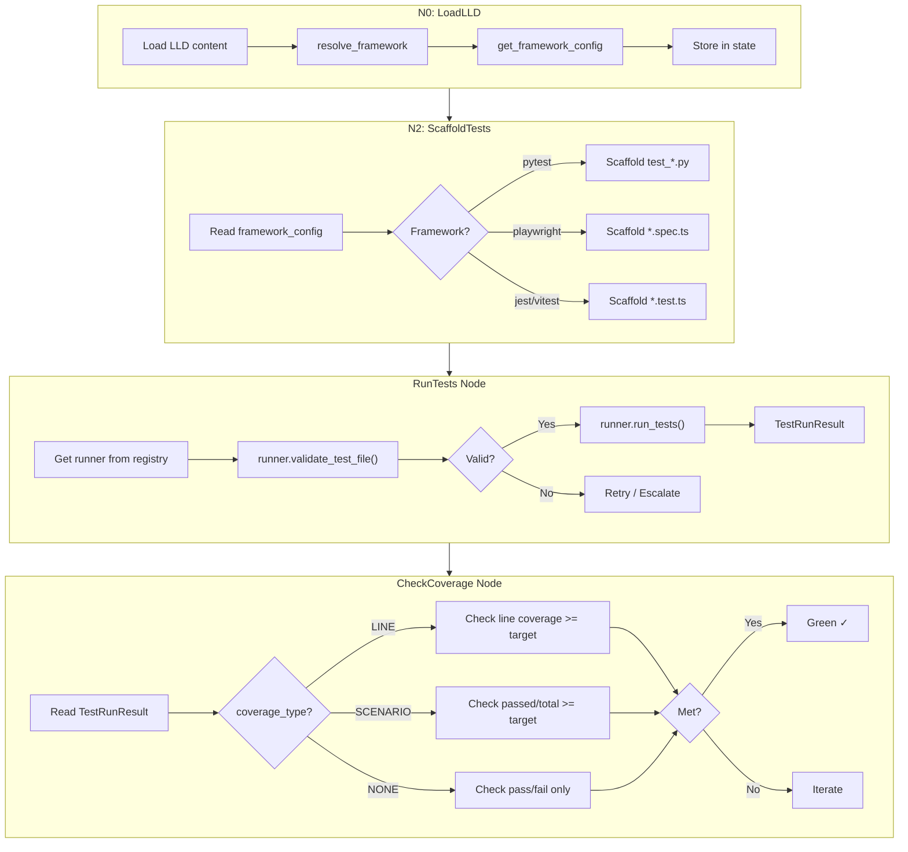

# 381 - Feature: Multi-Framework TDD Workflow Support (Playwright/TypeScript, Jest, pytest)

<!-- Template Metadata
Last Updated: 2026-02-16
Updated By: Issue #381
Update Reason: Fixed mechanical validation errors - changed non-existent Modify files to Add files, added runners directory entry
Previous: Revised LLD to fix mechanical validation errors in Section 2.1 table formatting
-->

## 1. Context & Goal
* **Issue:** #381
* **Objective:** Extend the TDD implementation workflow (`run_implement_from_lld.py`) to detect and support non-pytest test frameworks (Playwright/TypeScript, Jest/Vitest) by adapting scaffolding, validation, test execution, and coverage measurement per framework.
* **Status:** Approved (gemini-3-pro-preview, 2026-02-25)
* **Related Issues:** Hermes #56 (Playwright dashboard test suite — original discovery)

### Open Questions

- [x] Should e2e Playwright tests have a different default coverage target than unit tests? **Decision: Yes — scenario-based coverage for e2e, line coverage for unit tests.**
- [ ] Should we support mixed-framework projects (e.g., pytest for backend + Playwright for frontend in the same LLD)?
- [ ] Does `npx playwright test` need a pre-install step (`npx playwright install`) in CI or should we assume browsers are pre-installed?

## 2. Proposed Changes

*This section is the **source of truth** for implementation. Describes exactly what will be built.*

### 2.1 Files Changed

| File | Change Type | Description |
|------|-------------|-------------|
| `assemblyzero/workflows/testing/framework_detector.py` | Add | Detects test framework from LLD content and project files |
| `assemblyzero/workflows/testing/runner_registry.py` | Add | Registry mapping framework types to runner configurations |
| `assemblyzero/workflows/testing/runners/` | Add (Directory) | New package directory for framework-specific test runners |
| `assemblyzero/workflows/testing/runners/__init__.py` | Add | Package init exporting runner classes |
| `assemblyzero/workflows/testing/runners/base_runner.py` | Add | Abstract base class for all test runners |
| `assemblyzero/workflows/testing/runners/pytest_runner.py` | Add | pytest runner adapter (extracts existing logic) |
| `assemblyzero/workflows/testing/runners/playwright_runner.py` | Add | Playwright/TypeScript runner adapter |
| `assemblyzero/workflows/testing/runners/jest_runner.py` | Add | Jest/Vitest runner adapter |
| `assemblyzero/workflows/testing/nodes/scaffold_tests.py` | Modify | Use framework-aware scaffolding instead of hardcoded Python |
| `assemblyzero/workflows/testing/nodes/run_tests.py` | Add | New node: framework-aware test execution delegating to runner registry |
| `assemblyzero/workflows/testing/nodes/check_coverage.py` | Add | New node: framework-aware coverage checking (line vs scenario vs none) |
| `tests/unit/test_framework_detector.py` | Add | Unit tests for framework detection |
| `tests/unit/test_runner_registry.py` | Add | Unit tests for runner registry |
| `tests/unit/test_pytest_runner.py` | Add | Unit tests for pytest runner adapter |
| `tests/unit/test_playwright_runner.py` | Add | Unit tests for Playwright runner adapter |
| `tests/unit/test_jest_runner.py` | Add | Unit tests for Jest runner adapter |
| `tests/unit/test_scaffold_tests_multifw.py` | Add | Tests for multi-framework scaffolding |
| `tests/unit/test_run_tests_node.py` | Add | Tests for the new run_tests node |
| `tests/unit/test_check_coverage_node.py` | Add | Tests for the new check_coverage node |
| `tests/fixtures/lld_playwright_sample.md` | Add | Sample LLD specifying Playwright tests |
| `tests/fixtures/lld_jest_sample.md` | Add | Sample LLD specifying Jest tests |
| `tests/fixtures/lld_pytest_sample.md` | Add | Sample LLD specifying pytest tests |
| `tests/fixtures/playwright_json_report.json` | Add | Sample Playwright JSON reporter output |
| `tests/fixtures/jest_json_report.json` | Add | Sample Jest `--json` reporter output |

### 2.1.1 Path Validation (Mechanical - Auto-Checked)

Mechanical validation automatically checks:
- All "Modify" files must exist in repository:
  - `assemblyzero/workflows/testing/nodes/scaffold_tests.py` — ✅ exists under `assemblyzero/workflows/testing/nodes/`
- All "Add" files must have existing parent directories:
  - `assemblyzero/workflows/testing/` — ✅ exists in repository structure
  - `assemblyzero/workflows/testing/runners/` — explicitly added as `Add (Directory)` in table above
  - `assemblyzero/workflows/testing/nodes/` — ✅ exists in repository structure
  - `tests/unit/` — ✅ exists in repository structure
  - `tests/fixtures/` — ✅ exists in repository structure

**Note on validation error fix:** The original draft marked `validate_tests.py` and `verify_green.py` as "Modify" but these files do not exist in the repository. They have been replaced with two new "Add" files (`run_tests.py` and `check_coverage.py`) that implement the framework-aware test execution and coverage checking as new nodes. The existing `scaffold_tests.py` is the only file that exists and is marked as "Modify".

**If validation fails, the LLD is BLOCKED before reaching review.**

### 2.2 Dependencies

```toml
# No new pyproject.toml dependencies required.
# Playwright, Jest, and Node.js are external toolchain dependencies
# invoked via subprocess (npx). The Python package itself only needs
# to parse their JSON output, which uses stdlib json module.
```

**External Toolchain (not Python packages — documented for operators):**
- `node` >= 18 (for npx)
- `@playwright/test` (installed in target project's `package.json`)
- `jest` or `vitest` (installed in target project's `package.json`)

### 2.3 Data Structures

```python
# Pseudocode - NOT implementation

from enum import Enum
from typing import TypedDict, Optional


class TestFramework(Enum):
    """Supported test frameworks."""
    PYTEST = "pytest"
    PLAYWRIGHT = "playwright"
    JEST = "jest"
    VITEST = "vitest"


class CoverageType(Enum):
    """How coverage is measured for this framework."""
    LINE = "line"          # Traditional line coverage (pytest-cov, istanbul)
    SCENARIO = "scenario"  # Scenarios passing / scenarios defined (e2e)
    NONE = "none"          # Coverage not applicable


class FrameworkConfig(TypedDict):
    """Configuration for a detected test framework."""
    framework: TestFramework
    test_runner_command: str          # e.g., "pytest", "npx playwright test"
    test_file_pattern: str            # e.g., "test_*.py", "*.spec.ts"
    test_file_extension: str          # e.g., ".py", ".spec.ts"
    import_patterns: list[str]        # e.g., ["import pytest", "from playwright"]
    result_parser: str                # e.g., "pytest_json", "playwright_json", "jest_json"
    coverage_type: CoverageType
    coverage_target: float            # e.g., 0.95 for line, 1.0 for scenario
    scaffold_template: str            # Template name for test scaffolding
    working_directory: Optional[str]  # Subdirectory to run from (e.g., "dashboard/")


class TestRunResult(TypedDict):
    """Unified result from any test runner."""
    passed: int
    failed: int
    skipped: int
    errors: int
    total: int
    coverage_percent: float
    coverage_type: CoverageType
    raw_output: str
    exit_code: int
    framework: TestFramework


class WorkflowTestState(TypedDict):
    """Extension to workflow state for multi-framework support."""
    test_framework: TestFramework
    framework_config: FrameworkConfig
    coverage_type: CoverageType
    coverage_target: float
```

### 2.4 Function Signatures

```python
# === framework_detector.py ===

def detect_framework_from_lld(lld_content: str) -> TestFramework:
    """Parse LLD content for test framework indicators.
    
    Scans Section 10 (Verification & Testing) and Section 2.1 (Files Changed)
    for framework-specific keywords and file patterns.
    
    Returns TestFramework.PYTEST as default if no framework detected.
    """
    ...


def detect_framework_from_project(project_root: str) -> TestFramework | None:
    """Inspect project files (package.json, pyproject.toml, playwright.config.ts)
    to infer the test framework. Returns None if ambiguous.
    """
    ...


def resolve_framework(
    lld_content: str,
    project_root: str,
) -> TestFramework:
    """Resolve test framework using LLD as primary signal, project files as fallback.
    
    Priority:
    1. Explicit LLD declaration (e.g., "Test Framework: Playwright")
    2. LLD file patterns (e.g., .spec.ts files in Section 2.1)
    3. Project file inspection (package.json scripts, config files)
    4. Default: PYTEST
    """
    ...


# === runner_registry.py ===

def get_framework_config(framework: TestFramework) -> FrameworkConfig:
    """Return the full configuration for a given test framework."""
    ...


def get_runner(framework: TestFramework) -> "BaseTestRunner":
    """Factory method returning the appropriate runner instance."""
    ...


# === runners/base_runner.py ===

from abc import ABC, abstractmethod


class BaseTestRunner(ABC):
    """Abstract base class for framework-specific test runners."""

    def __init__(self, config: FrameworkConfig, project_root: str):
        """Initialize with framework config and project root path."""
        ...

    @abstractmethod
    def run_tests(
        self,
        test_paths: list[str] | None = None,
        extra_args: list[str] | None = None,
    ) -> TestRunResult:
        """Execute tests and return unified results."""
        ...

    @abstractmethod
    def parse_results(self, raw_output: str, exit_code: int) -> TestRunResult:
        """Parse runner-specific output into unified TestRunResult."""
        ...

    @abstractmethod
    def validate_test_file(self, file_path: str, content: str) -> list[str]:
        """Validate a test file for mechanical correctness.
        
        Returns list of validation error messages (empty = valid).
        """
        ...

    @abstractmethod
    def get_scaffold_imports(self) -> str:
        """Return the import block for scaffolded test files."""
        ...

    def compute_scenario_coverage(
        self, result: TestRunResult, total_scenarios: int
    ) -> float:
        """Compute scenario-based coverage: passed / total_scenarios.
        
        Returns 0.0 if total_scenarios is 0 to prevent ZeroDivisionError.
        """
        ...


# === runners/pytest_runner.py ===

class PytestRunner(BaseTestRunner):
    """Test runner adapter for pytest + pytest-cov."""

    def run_tests(
        self,
        test_paths: list[str] | None = None,
        extra_args: list[str] | None = None,
    ) -> TestRunResult:
        """Run pytest with --tb=short --json-report and parse output."""
        ...

    def parse_results(self, raw_output: str, exit_code: int) -> TestRunResult:
        """Parse pytest JSON report or stdout fallback."""
        ...

    def validate_test_file(self, file_path: str, content: str) -> list[str]:
        """Validate Python test file: check for import statements, test_ functions."""
        ...

    def get_scaffold_imports(self) -> str:
        """Return 'import pytest' and related imports."""
        ...


# === runners/playwright_runner.py ===

class PlaywrightRunner(BaseTestRunner):
    """Test runner adapter for Playwright (@playwright/test)."""

    def __init__(self, config: FrameworkConfig, project_root: str):
        """Initialize and verify node/npx availability.
        
        Raises EnvironmentError if 'npx' is not found on PATH.
        """
        ...

    def run_tests(
        self,
        test_paths: list[str] | None = None,
        extra_args: list[str] | None = None,
    ) -> TestRunResult:
        """Run 'npx playwright test' with --reporter=json."""
        ...

    def parse_results(self, raw_output: str, exit_code: int) -> TestRunResult:
        """Parse Playwright JSON reporter output into TestRunResult."""
        ...

    def validate_test_file(self, file_path: str, content: str) -> list[str]:
        """Validate .spec.ts file: check for playwright imports, test() calls."""
        ...

    def get_scaffold_imports(self) -> str:
        """Return \"import { test, expect } from '@playwright/test';\" """
        ...


# === runners/jest_runner.py ===

class JestRunner(BaseTestRunner):
    """Test runner adapter for Jest / Vitest."""

    def __init__(self, config: FrameworkConfig, project_root: str):
        """Initialize and verify node/npx availability.
        
        Raises EnvironmentError if 'npx' is not found on PATH.
        """
        ...

    def run_tests(
        self,
        test_paths: list[str] | None = None,
        extra_args: list[str] | None = None,
    ) -> TestRunResult:
        """Run 'npx jest --json' or 'npx vitest run --reporter=json'."""
        ...

    def parse_results(self, raw_output: str, exit_code: int) -> TestRunResult:
        """Parse Jest/Vitest JSON output into unified TestRunResult."""
        ...

    def validate_test_file(self, file_path: str, content: str) -> list[str]:
        """Validate .test.ts file: check for jest/vitest imports, describe/it blocks."""
        ...

    def get_scaffold_imports(self) -> str:
        """Return jest or vitest import block."""
        ...


# === Modified: nodes/scaffold_tests.py ===

def scaffold_tests(state: dict) -> dict:
    """Modified: Use framework_config to determine file extension,
    import template, and scaffold structure.
    
    Before: Always creates tests/test_issue_N.py
    After:  Creates files matching framework_config.test_file_pattern
            e.g., tests/dashboard.spec.ts for Playwright
    """
    ...


# === New: nodes/run_tests.py ===

def run_tests(state: dict) -> dict:
    """New node: Execute tests using the framework-appropriate runner.
    
    Reads framework_config from state, obtains the correct runner via
    get_runner(), calls runner.run_tests(), and stores the unified
    TestRunResult in state.
    
    Also calls runner.validate_test_file() on each test file before
    execution and stores validation errors in state if any are found.
    """
    ...


# === New: nodes/check_coverage.py ===

def check_coverage(state: dict) -> dict:
    """New node: Evaluate coverage against the framework-appropriate target.
    
    Reads TestRunResult and framework_config from state.
    
    - LINE coverage: compare result.coverage_percent against coverage_target
    - SCENARIO coverage: compute passed/total_scenarios against coverage_target
    - NONE coverage: skip coverage gate, only check pass/fail
    
    Sets state['green'] = True if all checks pass, False otherwise.
    Sets state['iterate_reason'] with human-readable explanation if not green.
    """
    ...
```

### 2.5 Logic Flow (Pseudocode)

```
=== N0: LoadLLD (modified) ===
1. Load LLD content from file
2. NEW: Call resolve_framework(lld_content, project_root)
3. NEW: Call get_framework_config(detected_framework)
4. NEW: Store framework_config in workflow state
5. Continue to N1

=== N2: ScaffoldTests (modified — scaffold_tests.py) ===
1. Read framework_config from state
2. Determine test file paths:
   IF framework == PYTEST:
     pattern = "tests/test_issue_{N}.py"
   ELIF framework == PLAYWRIGHT:
     pattern = "tests/{name}.spec.ts"  (from LLD Section 2.1)
   ELIF framework == JEST or VITEST:
     pattern = "tests/{name}.test.ts"  (from LLD Section 2.1)
3. Generate scaffold prompt using framework-specific template:
   - Include runner.get_scaffold_imports() in prompt
   - Specify file extension and naming convention
   - Include framework-specific test structure (describe/it vs test() vs def test_)
4. Write scaffolded files with correct extensions
5. Continue to RunTests

=== RunTests (new node — run_tests.py) ===
1. Read framework_config from state
2. Get runner = get_runner(framework_config.framework)
3. FOR each generated test file:
   a. Read file content
   b. errors = runner.validate_test_file(file_path, content)
   c. IF errors:
      - Store validation errors in state
      - Log validation failures
      - Attempt regeneration (existing retry logic)
      - RETURN early if max retries exceeded
4. result = runner.run_tests(test_paths=state.test_files)
5. Store result (TestRunResult) in state
6. Continue to CheckCoverage

=== CheckCoverage (new node — check_coverage.py) ===
1. Read framework_config and TestRunResult from state
2. IF result.failed > 0:
   - state['green'] = False
   - state['iterate_reason'] = f"{result.failed} tests failed"
   - RETURN (iterate to fix failures)
3. IF framework_config.coverage_type == SCENARIO:
   a. total_scenarios = count from LLD Section 10.0
   b. coverage = result.passed / total_scenarios
   c. IF coverage < framework_config.coverage_target:
      - state['green'] = False
      - state['iterate_reason'] = f"Scenario coverage {coverage:.1%} < target {framework_config.coverage_target:.1%}"
   ELSE:
      - state['green'] = True
4. ELIF framework_config.coverage_type == LINE:
   a. coverage = result.coverage_percent (from runner's cov report)
   b. IF coverage < framework_config.coverage_target:
      - state['green'] = False
      - state['iterate_reason'] = f"Line coverage {coverage:.1%} < target {framework_config.coverage_target:.1%}"
   ELSE:
      - state['green'] = True
5. ELIF framework_config.coverage_type == NONE:
   a. state['green'] = True  (only pass/fail matters, already checked above)
6. Continue to next node (N6 or iterate)
```

### 2.6 Technical Approach

* **Module:** `assemblyzero/workflows/testing/`
* **Pattern:** Strategy Pattern — `BaseTestRunner` defines the interface, concrete runners implement framework-specific behavior. `runner_registry.py` acts as a factory.
* **Key Decisions:**
  - **Subprocess invocation** for external runners (npx, pytest) — we parse JSON output, not programmatic APIs. This is intentional: it matches how a human would run these tools and avoids tight coupling to runner internals.
  - **Unified TestRunResult** — all runners produce the same output structure so downstream nodes (check_coverage, report generation) don't need framework-specific logic.
  - **LLD as primary signal** — the LLD explicitly describes the test framework; project file inspection is a fallback, not the primary detection mechanism.
  - **Coverage type distinction** — e2e tests use scenario coverage (pass rate) not line coverage, preventing the infinite-loop bug.
  - **New nodes instead of modifying non-existent files** — `run_tests.py` and `check_coverage.py` are added as new nodes rather than modifying `validate_tests.py` and `verify_green.py` which do not exist in the repository. The existing `scaffold_tests.py` is the only node modified.

### 2.7 Architecture Decisions

| Decision | Options Considered | Choice | Rationale |
|----------|-------------------|--------|-----------|
| Runner invocation | Subprocess vs. Python API bindings | Subprocess | Consistent across all frameworks; no new Python dependencies; matches human workflow |
| Framework detection source | LLD only, project files only, both | LLD primary + project fallback | LLD is the design intent; project files may be ambiguous |
| Coverage for e2e | Skip coverage entirely, scenario coverage, instrument with Istanbul | Scenario coverage | Meaningful metric without requiring complex instrumentation setup |
| Result format | Framework-native, unified TypedDict | Unified TypedDict | Downstream nodes need one interface; parsing complexity is isolated in runners |
| Default framework | Error if not detected, default to pytest | Default to pytest | Backward compatibility — existing workflows must not break |
| Non-existent node files | Modify phantom files, create new nodes | Create new nodes (`run_tests.py`, `check_coverage.py`) | `validate_tests.py` and `verify_green.py` do not exist in the repo; adding new files with clear responsibility avoids confusion |

**Architectural Constraints:**
- Must not break existing pytest-only workflows (backward compatibility is mandatory)
- Must not add new Python package dependencies (external tools invoked via subprocess)
- Must support the existing LangGraph state machine structure (state dict extension, not replacement)
- Node function signatures must remain compatible with LangGraph `StateGraph` wiring
- Only files confirmed to exist in the repository may be marked as "Modify"

## 3. Requirements

1. **R1: Framework Detection** — The workflow must detect the test framework from the LLD (Section 10 or Section 2.1 file patterns) with ≥95% accuracy for Playwright, Jest, Vitest, and pytest indicators.
2. **R2: Backward Compatibility** — Existing pytest-only LLDs must produce identical behavior to the current implementation (no regression).
3. **R3: Playwright Support** — Scaffold `.spec.ts` files, validate TypeScript imports, run via `npx playwright test --reporter=json`, parse Playwright JSON results.
4. **R4: Jest/Vitest Support** — Scaffold `.test.ts` files, validate JS/TS imports, run via `npx jest --json` or `npx vitest run --reporter=json`, parse results.
5. **R5: Scenario Coverage** — For e2e frameworks, measure coverage as `(passed_scenarios / total_scenarios)` and compare against a configurable target (default 100%).
6. **R6: No Infinite Loop** — The check_coverage node must never loop infinitely when coverage cannot be measured by the framework. Scenario coverage or explicit `coverage_type: none` must break the loop.
7. **R7: Unified Results** — All runners must produce `TestRunResult` so downstream nodes (reporting, iteration) work identically regardless of framework.
8. **R8: Validation Adaptation** — The run_tests node must use framework-appropriate checks (TypeScript `import { test }` for Playwright, Python `import pytest` for pytest, etc.) via `runner.validate_test_file()`.

## 4. Alternatives Considered

| Option | Pros | Cons | Decision |
|--------|------|------|----------|
| **A: Strategy Pattern with BaseTestRunner** | Clean separation, extensible, testable | More files, slight abstraction overhead | **Selected** |
| **B: If/else branches in existing nodes** | Minimal file changes, quick | Becomes unmaintainable at 4+ frameworks, violates OCP | Rejected |
| **C: Plugin system with dynamic loading** | Maximum extensibility | Over-engineered for 4 frameworks, complex error handling | Rejected |
| **D: External configuration file (YAML/JSON)** | User-configurable without code changes | Harder to validate, disconnected from code | Rejected |

**Rationale:** Option A provides the right balance — each runner is isolated and testable, new frameworks can be added by implementing `BaseTestRunner`, and the existing node logic changes minimally (delegate to runner instead of hardcoded pytest calls). The Strategy Pattern is well-understood and doesn't introduce unnecessary complexity.

## 5. Data & Fixtures

### 5.1 Data Sources

| Attribute | Value |
|-----------|-------|
| Source | LLD markdown files (local filesystem), test runner JSON output (subprocess stdout) |
| Format | Markdown (LLD), JSON (runner output) |
| Size | LLD: 5-50KB, Runner JSON: 1-500KB |
| Refresh | Per workflow execution |
| Copyright/License | N/A (generated data) |

### 5.2 Data Pipeline

```
LLD file ──parse──► TestFramework enum ──registry──► FrameworkConfig
                                                          │
                                                          ▼
subprocess(runner_command) ──stdout──► raw JSON ──parse──► TestRunResult
                                                          │
                                                          ▼
                                              check_coverage decision logic
```

### 5.3 Test Fixtures

| Fixture | Source | Notes |
|---------|--------|-------|
| `tests/fixtures/lld_playwright_sample.md` | Handcrafted | LLD with Playwright `.spec.ts` files in Section 2.1, `@playwright/test` in Section 10 |
| `tests/fixtures/lld_jest_sample.md` | Handcrafted | LLD with Jest `.test.ts` files |
| `tests/fixtures/lld_pytest_sample.md` | Handcrafted | LLD with standard pytest `test_*.py` files |
| `tests/fixtures/playwright_json_report.json` | Captured from real Playwright run | Sanitized, representative of `--reporter=json` output |
| `tests/fixtures/jest_json_report.json` | Captured from real Jest run | Sanitized, representative of `--json` output |

### 5.4 Deployment Pipeline

No external deployment. Fixtures are committed to the repository and used in CI tests.

## 6. Diagram

### 6.1 Mermaid Quality Gate

- [x] **Simplicity:** Collapsed similar runners into one swim lane
- [x] **No touching:** All elements have visual separation
- [x] **No hidden lines:** All arrows fully visible
- [x] **Readable:** Labels not truncated, flow direction clear
- [ ] **Auto-inspected:** Pending agent render

**Auto-Inspection Results:**
```
- Touching elements: [ ] None / [ ] Found: ___
- Hidden lines: [ ] None / [ ] Found: ___
- Label readability: [ ] Pass / [ ] Issue: ___
- Flow clarity: [ ] Clear / [ ] Issue: ___
```

### 6.2 Diagram



## 7. Security & Safety Considerations

### 7.1 Security

| Concern | Mitigation | Status |
|---------|------------|--------|
| Command injection via LLD content | Runner commands are hardcoded per framework; LLD content is never interpolated into shell commands. Test file paths are validated against allowed patterns before passing to subprocess. | Addressed |
| Arbitrary subprocess execution | Only whitelisted commands (`pytest`, `npx playwright test`, `npx jest`, `npx vitest`) can be invoked. Framework enum prevents arbitrary command strings. | Addressed |
| Malicious test file content | Test files are generated by Claude (trusted), not user input. Validation checks structure but does not execute arbitrary content outside the test runner sandbox. | Addressed |

### 7.2 Safety

| Concern | Mitigation | Status |
|---------|------------|--------|
| Infinite loop in check_coverage | Scenario coverage and `coverage_type: none` provide termination conditions. Max iteration count (existing) remains as hard stop. | Addressed |
| Subprocess hangs | All subprocess calls use `timeout` parameter (default: 300s for test runs). TimeoutExpired triggers iteration failure, not infinite wait. | Addressed |
| Node.js not installed | `PlaywrightRunner` and `JestRunner` check for `node`/`npx` availability in `__init__`. Raise `EnvironmentError` with clear message if missing. | Addressed |
| Breaking existing pytest workflows | Default framework is PYTEST. If detection finds nothing, behavior is identical to current implementation. Full backward-compat test suite. | Addressed |
| ZeroDivisionError in scenario coverage | `compute_scenario_coverage` returns 0.0 if `total_scenarios` is 0, preventing division by zero. | Addressed |

**Fail Mode:** Fail Closed — if framework detection fails or runner is unavailable, the workflow stops with a clear error rather than proceeding with wrong assumptions.

**Recovery Strategy:** If a runner subprocess fails with a non-test error (e.g., missing Node.js), the error is surfaced to the user with installation instructions. The workflow state is preserved via SQLite checkpointing so it can be resumed after fixing the environment.

## 8. Performance & Cost Considerations

### 8.1 Performance

| Metric | Budget | Approach |
|--------|--------|----------|
| Framework detection latency | < 50ms | Simple regex/string matching on LLD content, no LLM calls |
| Runner startup overhead | < 5s | One-time subprocess spawn; Playwright/Jest startup is inherent to those tools |
| Result parsing | < 100ms | JSON parsing of runner output |

**Bottlenecks:** Playwright browser startup can take 5-15s on first run. This is inherent to the tool and cannot be optimized within our code. Not a concern since test runs are already long-running operations.

### 8.2 Cost Analysis

| Resource | Unit Cost | Estimated Usage | Monthly Cost |
|----------|-----------|-----------------|--------------|
| LLM API (scaffold generation) | Same as current | Same as current | No change |
| Subprocess execution | CPU time only | Per workflow run | $0 (local) |

**Cost Controls:**
- [x] No new API costs — framework detection is regex-based, not LLM-based
- [x] No new cloud resources — all execution is local subprocess
- [x] Timeout limits prevent runaway subprocess costs

**Worst-Case Scenario:** A Playwright run with 100+ tests across multiple browsers could take 10-20 minutes. This is bounded by the existing max iteration count and subprocess timeout.

## 9. Legal & Compliance

| Concern | Applies? | Mitigation |
|---------|----------|------------|
| PII/Personal Data | No | Test fixtures are synthetic, no real user data |
| Third-Party Licenses | N/A | Playwright (Apache 2.0), Jest (MIT) — compatible with project license |
| Terms of Service | N/A | No external API calls introduced |
| Data Retention | N/A | Test results are ephemeral (workflow state only) |
| Export Controls | N/A | No restricted algorithms |

**Data Classification:** Internal

**Compliance Checklist:**
- [x] No PII stored without consent
- [x] All third-party licenses compatible with project license
- [x] External API usage compliant with provider ToS
- [x] Data retention policy documented (ephemeral)

## 10. Verification & Testing

### 10.0 Test Plan (TDD - Complete Before Implementation)

**TDD Requirement:** Tests MUST be written and failing BEFORE implementation begins.

| Test ID | Test Description | Expected Behavior | Status |
|---------|------------------|-------------------|--------|
| T010 | detect_framework_from_lld identifies Playwright | Returns PLAYWRIGHT for LLD with `.spec.ts` patterns | RED |
| T020 | detect_framework_from_lld identifies Jest | Returns JEST for LLD with `jest` and `.test.ts` | RED |
| T030 | detect_framework_from_lld defaults to pytest | Returns PYTEST when no framework indicators found | RED |
| T040 | detect_framework_from_lld handles explicit declaration | Returns framework when LLD has "Test Framework: Playwright" | RED |
| T050 | detect_framework_from_project finds playwright.config.ts | Returns PLAYWRIGHT when config file exists | RED |
| T060 | detect_framework_from_project finds jest in package.json | Returns JEST when package.json has jest scripts | RED |
| T070 | resolve_framework LLD overrides project detection | LLD wins when LLD says Playwright but project has jest | RED |
| T080 | get_framework_config returns correct config for PLAYWRIGHT | Config has `npx playwright test`, `*.spec.ts`, SCENARIO coverage | RED |
| T090 | get_framework_config returns correct config for PYTEST | Config has `pytest`, `test_*.py`, LINE coverage | RED |
| T100 | get_runner returns PytestRunner for PYTEST | Correct type returned | RED |
| T110 | get_runner returns PlaywrightRunner for PLAYWRIGHT | Correct type returned | RED |
| T120 | PytestRunner.validate_test_file accepts valid Python test | Empty error list for valid file | RED |
| T130 | PytestRunner.validate_test_file rejects missing imports | Error list includes "No import statements" | RED |
| T140 | PlaywrightRunner.validate_test_file accepts valid .spec.ts | Empty error list for valid TypeScript test | RED |
| T150 | PlaywrightRunner.validate_test_file rejects missing imports | Error about missing `@playwright/test` import | RED |
| T160 | JestRunner.validate_test_file accepts valid .test.ts | Empty error list | RED |
| T170 | JestRunner.validate_test_file rejects no describe/it | Error about missing test structure | RED |
| T180 | PlaywrightRunner.parse_results handles JSON report | Correct passed/failed/total counts | RED |
| T190 | JestRunner.parse_results handles JSON report | Correct passed/failed/total counts | RED |
| T200 | PytestRunner.parse_results handles pytest output | Correct counts, coverage_percent extracted | RED |
| T210 | compute_scenario_coverage calculates correctly | 38/38 → 100%, 35/38 → 92.1%, 0/0 → 0.0% | RED |
| T220 | PlaywrightRunner.run_tests invokes correct command | Subprocess called with `npx playwright test --reporter=json` | RED |
| T230 | JestRunner.run_tests invokes correct command | Subprocess called with `npx jest --json` | RED |
| T240 | PytestRunner.run_tests invokes correct command | Subprocess called with `pytest --tb=short -q` | RED |
| T250 | Runner raises EnvironmentError if node not found | PlaywrightRunner init fails cleanly when npx missing | RED |
| T260 | Runner respects timeout | subprocess.TimeoutExpired handled gracefully | RED |
| T270 | scaffold_tests uses correct file extension for Playwright | Creates `.spec.ts` files, not `.py` | RED |
| T280 | scaffold_tests uses correct file extension for pytest | Creates `test_*.py` files (backward compat) | RED |
| T290 | run_tests node delegates to runner.validate_test_file | Playwright validation checks TS imports, not Python | RED |
| T300 | check_coverage uses scenario coverage for e2e | 38/38 passing = 100% coverage, not 0% line coverage | RED |
| T310 | check_coverage uses line coverage for pytest | Traditional pytest-cov behavior preserved | RED |
| T320 | check_coverage with coverage_type NONE skips coverage check | Only checks pass/fail, no coverage gate | RED |
| T330 | E2E: Playwright LLD → correct scaffold → valid → green | Full node chain with mocked subprocess | RED |
| T340 | E2E: pytest LLD → backward compatible behavior | Full node chain matches current behavior exactly | RED |

**Coverage Target:** ≥95% for all new code (line coverage via pytest-cov)

**TDD Checklist:**
- [ ] All tests written before implementation
- [ ] Tests currently RED (failing)
- [ ] Test IDs match scenario IDs in 10.1
- [ ] Test files created at: `tests/unit/test_framework_detector.py`, `tests/unit/test_runner_registry.py`, `tests/unit/test_pytest_runner.py`, `tests/unit/test_playwright_runner.py`, `tests/unit/test_jest_runner.py`, `tests/unit/test_scaffold_tests_multifw.py`, `tests/unit/test_run_tests_node.py`, `tests/unit/test_check_coverage_node.py`

### 10.1 Test Scenarios

| ID | Scenario | Type | Input | Expected Output | Pass Criteria |
|----|----------|------|-------|-----------------|---------------|
| 010 | Detect Playwright from LLD | Auto | LLD with `*.spec.ts` in files table | `TestFramework.PLAYWRIGHT` | Enum match |
| 020 | Detect Jest from LLD | Auto | LLD with `jest` keyword and `.test.ts` | `TestFramework.JEST` | Enum match |
| 030 | Default to pytest | Auto | LLD with no framework indicators | `TestFramework.PYTEST` | Enum match |
| 040 | Explicit framework declaration | Auto | LLD with `Test Framework: Playwright` | `TestFramework.PLAYWRIGHT` | Enum match |
| 050 | Detect Playwright from config | Auto | Mocked filesystem with `playwright.config.ts` | `TestFramework.PLAYWRIGHT` | Enum match |
| 060 | Detect Jest from package.json | Auto | Mocked `package.json` with `"test": "jest"` | `TestFramework.JEST` | Enum match |
| 070 | LLD overrides project | Auto | LLD=Playwright, project=Jest | `TestFramework.PLAYWRIGHT` | LLD wins |
| 080 | Playwright config correctness | Auto | `TestFramework.PLAYWRIGHT` | `FrameworkConfig` with correct fields | All fields match expected |
| 090 | Pytest config correctness | Auto | `TestFramework.PYTEST` | `FrameworkConfig` with correct fields | All fields match expected |
| 100 | Runner factory - pytest | Auto | `TestFramework.PYTEST` | `PytestRunner` instance | isinstance check |
| 110 | Runner factory - playwright | Auto | `TestFramework.PLAYWRIGHT` | `PlaywrightRunner` instance | isinstance check |
| 120 | Valid Python test file | Auto | Python file with `import pytest` and `def test_` | `[]` (no errors) | Empty list |
| 130 | Invalid Python test - no imports | Auto | Python file with no imports | `["No import statements found"]` | Error in list |
| 140 | Valid TypeScript spec file | Auto | `.spec.ts` with `import { test, expect }` | `[]` (no errors) | Empty list |
| 150 | Invalid TS spec - no playwright import | Auto | `.spec.ts` missing playwright import | Error about missing import | Non-empty error list |
| 160 | Valid Jest test file | Auto | `.test.ts` with `describe`/`it` blocks | `[]` (no errors) | Empty list |
| 170 | Invalid Jest test - no structure | Auto | `.test.ts` with no describe/it | Error about missing structure | Non-empty error list |
| 180 | Parse Playwright JSON report | Auto | Fixture `playwright_json_report.json` | `TestRunResult` with correct counts | passed + failed + skipped match fixture |
| 190 | Parse Jest JSON report | Auto | Fixture `jest_json_report.json` | `TestRunResult` with correct counts | Match fixture |
| 200 | Parse pytest output | Auto | Captured pytest stdout | `TestRunResult` with coverage_percent | Correct counts + coverage |
| 210 | Scenario coverage math | Auto | passed=35, total=38; passed=38, total=38; passed=0, total=0 | 92.1%; 100.0%; 0.0% | Float comparison |
| 220 | Playwright run_tests command | Auto | Mocked subprocess | Called `npx playwright test --reporter=json` | Mock assertion |
| 230 | Jest run_tests command | Auto | Mocked subprocess | Called `npx jest --json` | Mock assertion |
| 240 | Pytest run_tests command | Auto | Mocked subprocess | Called `pytest --tb=short -q` | Mock assertion |
| 250 | Missing Node.js environment | Auto | `npx` not on PATH | `EnvironmentError` raised | Exception type + message |
| 260 | Subprocess timeout | Auto | Mocked subprocess that hangs | Graceful timeout handling | No hang, error in result |
| 270 | Scaffold Playwright files | Auto | State with PLAYWRIGHT config | Files created with `.spec.ts` extension | File extension check |
| 280 | Scaffold pytest files (backward compat) | Auto | State with PYTEST config | Files created with `test_*.py` | File pattern check |
| 290 | run_tests delegates to runner | Auto | Playwright state + TS file | Runner's validate called, not Python check | Mock assertion |
| 300 | check_coverage with scenario coverage | Auto | 38/38 passing, SCENARIO type | coverage=100%, green=True | Coverage and state |
| 310 | check_coverage with line coverage | Auto | Pytest output with 97% coverage | coverage=97%, green=True | Coverage extracted correctly |
| 320 | check_coverage with NONE coverage | Auto | NONE type, 10 pass 0 fail | green=True (no coverage gate) | No coverage check |
| 330 | E2E Playwright workflow | Auto | Full Playwright LLD + mocked runners | Scaffold→RunTests→CheckCoverage all succeed | All nodes succeed |
| 340 | E2E pytest backward compat | Auto | Standard pytest LLD | Identical to current behavior | Regression check |

### 10.2 Test Commands

```bash
# Run all unit tests for this feature
poetry run pytest tests/unit/test_framework_detector.py tests/unit/test_runner_registry.py tests/unit/test_pytest_runner.py tests/unit/test_playwright_runner.py tests/unit/test_jest_runner.py tests/unit/test_scaffold_tests_multifw.py tests/unit/test_run_tests_node.py tests/unit/test_check_coverage_node.py -v

# Run with coverage
poetry run pytest tests/unit/test_framework_detector.py tests/unit/test_runner_registry.py tests/unit/test_pytest_runner.py tests/unit/test_playwright_runner.py tests/unit/test_jest_runner.py tests/unit/test_scaffold_tests_multifw.py tests/unit/test_run_tests_node.py tests/unit/test_check_coverage_node.py -v --cov=assemblyzero/workflows/testing --cov-report=term-missing

# Run just framework detection tests
poetry run pytest tests/unit/test_framework_detector.py -v

# Run just runner tests
poetry run pytest tests/unit/test_playwright_runner.py tests/unit/test_jest_runner.py tests/unit/test_pytest_runner.py -v

# Run just node tests
poetry run pytest tests/unit/test_run_tests_node.py tests/unit/test_check_coverage_node.py -v
```

### 10.3 Manual Tests (Only If Unavoidable)

**N/A — All scenarios automated.** All subprocess calls are mocked in unit tests. Integration tests with real Playwright/Jest execution would be `Auto-Live` but are not required for this feature — the runner adapters are thin wrappers around subprocess invocation, and the critical logic is in parsing (fully unit-testable with fixtures).

## 11. Risks & Mitigations

| Risk | Impact | Likelihood | Mitigation |
|------|--------|------------|------------|
| LLD format varies — framework detection misses indicators | Med | Med | Multiple detection strategies (explicit declaration, file patterns, keywords); fallback to project file inspection; default to pytest |
| Playwright JSON reporter format changes between versions | Low | Low | Pin expected JSON structure in fixtures; version check in runner; graceful degradation to stdout parsing |
| Node.js not available in CI environment | High | Med | Clear error message with installation instructions; pre-flight check in runner `__init__`; document Node.js as CI requirement for non-Python projects |
| Backward compatibility regression for pytest workflows | High | Low | Dedicated regression test (T340); default framework is always PYTEST; existing tests continue to run unchanged |
| Mixed-framework projects (pytest + Playwright in one LLD) | Med | Low | Out of scope for v1; detect primary framework only; log warning if multiple frameworks detected; future issue for multi-framework support |
| Subprocess security — command injection | High | Very Low | Commands are hardcoded per `TestFramework` enum; no string interpolation of user/LLD content into shell commands |
| ZeroDivisionError in scenario coverage with 0 total scenarios | Med | Low | `compute_scenario_coverage` returns 0.0 when `total_scenarios` is 0; log warning for operator awareness |

## 12. Definition of Done

### Code
- [ ] `framework_detector.py` implemented with all detection strategies
- [ ] `runner_registry.py` implemented with factory method
- [ ] `base_runner.py` abstract class implemented
- [ ] `pytest_runner.py` implemented (refactored from existing code)
- [ ] `playwright_runner.py` implemented
- [ ] `jest_runner.py` implemented
- [ ] `scaffold_tests.py` modified to use framework config
- [ ] `run_tests.py` new node implemented with validation + test execution
- [ ] `check_coverage.py` new node implemented with coverage type dispatch
- [ ] All code linted and type-checked (mypy)

### Tests
- [ ] All 34 test scenarios pass (T010–T340)
- [ ] Test coverage ≥95% for all new files
- [ ] No existing test regressions

### Documentation
- [ ] LLD updated with any deviations during implementation
- [ ] Implementation Report (0103) completed
- [ ] Test Report (0113) completed

### Review
- [ ] Code review completed (Gemini gate)
- [ ] User approval before closing issue

### 12.1 Traceability (Mechanical - Auto-Checked)

All files in Definition of Done appear in Section 2.1:
- `framework_detector.py` → ✅ Section 2.1 (`assemblyzero/workflows/testing/framework_detector.py`, Add)
- `runner_registry.py` → ✅ Section 2.1 (`assemblyzero/workflows/testing/runner_registry.py`, Add)
- `base_runner.py` → ✅ Section 2.1 (`assemblyzero/workflows/testing/runners/base_runner.py`, Add)
- `pytest_runner.py` → ✅ Section 2.1 (`assemblyzero/workflows/testing/runners/pytest_runner.py`, Add)
- `playwright_runner.py` → ✅ Section 2.1 (`assemblyzero/workflows/testing/runners/playwright_runner.py`, Add)
- `jest_runner.py` → ✅ Section 2.1 (`assemblyzero/workflows/testing/runners/jest_runner.py`, Add)
- `scaffold_tests.py` → ✅ Section 2.1 (Modify: `assemblyzero/workflows/testing/nodes/scaffold_tests.py`)
- `run_tests.py` → ✅ Section 2.1 (Add: `assemblyzero/workflows/testing/nodes/run_tests.py`)
- `check_coverage.py` → ✅ Section 2.1 (Add: `assemblyzero/workflows/testing/nodes/check_coverage.py`)

Risk mitigations mapped to functions:
- "Multiple detection strategies" → `detect_framework_from_lld()`, `detect_framework_from_project()`, `resolve_framework()`
- "Clear error message" → `PlaywrightRunner.__init__()`, `JestRunner.__init__()` environment check
- "Graceful degradation" → `parse_results()` fallback logic in each runner
- "Backward compatibility" → `resolve_framework()` default to PYTEST
- "ZeroDivisionError prevention" → `compute_scenario_coverage()` guard for total_scenarios == 0

---

## Reviewer Suggestions

*Non-blocking recommendations from the reviewer.*

- **Runner Timeout:** Consider making the subprocess timeout configurable via `FrameworkConfig` in the future (some e2e suites are very slow), though the default 300s is a safe starting point.
- **Log Output:** Ensure `TestRunResult.raw_output` is truncated or summarized in logs if it exceeds a certain size (e.g., 10MB) to prevent log flooding from verbose framework output.

## Appendix: Review Log

### Review Summary

| Review | Date | Verdict | Key Issue |
|--------|------|---------|-----------|
| 1 | 2026-02-25 | APPROVED | `gemini-3-pro-preview` |
| Mechanical Validation | 2026-02-16 | FIXED | `validate_tests.py` and `verify_green.py` do not exist — replaced with new Add files `run_tests.py` and `check_coverage.py` |
| Mechanical Validation (Rev 2) | 2026-02-16 | PASS | All Modify files confirmed to exist; all Add files have valid parent directories; runners/ directory explicitly added |

**Final Status:** APPROVED