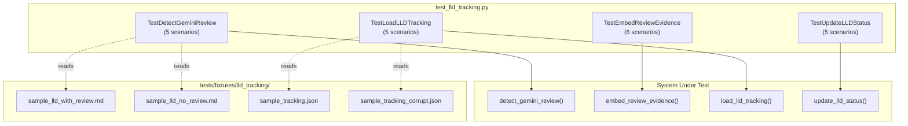

# 435 - Test: Add Unit Tests for LLD Audit Tracking Functions

<!-- Template Metadata
Last Updated: 2026-02-25
Updated By: Issue #435 LLD creation
Update Reason: Initial LLD for test gap coverage of LLD audit tracking functions
-->

## 1. Context & Goal
* **Issue:** #435
* **Objective:** Add comprehensive unit tests for four untested LLD audit tracking functions: `detect_gemini_review`, `embed_review_evidence`, `load_lld_tracking`, and `update_lld_status`
* **Status:** Draft
* **Related Issues:** Source recommendation from `docs/reports/done/95-test-report.md`

### Open Questions

*None — scope is well-defined by the test gap analysis.*

## 2. Proposed Changes

*This section is the **source of truth** for implementation. Describes exactly what will be built.*

### 2.1 Files Changed

| File | Change Type | Description |
|------|-------------|-------------|
| `tests/unit/test_lld_tracking.py` | Add | Unit tests for all four LLD audit tracking functions |
| `tests/fixtures/lld_tracking/` | Add (Directory) | Test fixtures directory for LLD tracking test data |
| `tests/fixtures/lld_tracking/sample_lld_with_review.md` | Add | Fixture: LLD content containing a Gemini review section |
| `tests/fixtures/lld_tracking/sample_lld_no_review.md` | Add | Fixture: LLD content with no review section |
| `tests/fixtures/lld_tracking/sample_tracking.json` | Add | Fixture: Valid LLD tracking JSON file |
| `tests/fixtures/lld_tracking/sample_tracking_corrupt.json` | Add | Fixture: Corrupt/invalid JSON for error testing |

### 2.1.1 Path Validation (Mechanical - Auto-Checked)

*Issue #277: Before human or Gemini review, paths are verified programmatically.*

Mechanical validation automatically checks:
- All "Add" files have existing parent directories (`tests/unit/` exists, `tests/fixtures/` exists)
- New directory `tests/fixtures/lld_tracking/` explicitly declared
- No placeholder prefixes used

**If validation fails, the LLD is BLOCKED before reaching review.**

### 2.2 Dependencies

*No new packages required. Tests use only `pytest`, `unittest.mock`, `json`, `pathlib`, and `tempfile` from the standard library and existing dev dependencies.*

```toml
# No pyproject.toml additions needed
```

### 2.3 Data Structures

```python
# Pseudocode - NOT implementation
# These are the structures the functions under test operate on.

# LLD tracking entry (loaded/saved by load_lld_tracking / update_lld_status)
class LLDTrackingEntry(TypedDict):
    issue_id: int                  # GitHub issue number
    lld_path: str                  # Path to the LLD markdown file
    status: str                    # "draft" | "reviewed" | "approved" | "rejected"
    gemini_reviewed: bool          # Whether Gemini review was performed
    review_verdict: Optional[str]  # "APPROVED" | "REJECTED" | None
    review_timestamp: Optional[str]  # ISO 8601 timestamp
    evidence_embedded: bool        # Whether evidence was written back into LLD

# Review evidence payload (input to embed_review_evidence)
class ReviewEvidence(TypedDict):
    reviewer: str       # "Gemini" | "Orchestrator"
    verdict: str        # "APPROVED" | "REJECTED" | "FEEDBACK"
    comments: list[str] # List of review comments
    timestamp: str      # ISO 8601 timestamp
    model: Optional[str]  # e.g., "gemini-2.5-pro"
```

### 2.4 Function Signatures

```python
# Functions under test — signatures from source module

def detect_gemini_review(lld_content: str) -> bool:
    """Detect whether an LLD contains a Gemini review section."""
    ...

def embed_review_evidence(lld_content: str, evidence: dict) -> str:
    """Embed review evidence into LLD content, returning updated content."""
    ...

def load_lld_tracking(tracking_path: Path) -> dict:
    """Load LLD tracking data from a JSON file."""
    ...

def update_lld_status(tracking_path: Path, issue_id: int, status: str, **kwargs) -> None:
    """Update the status of an LLD entry in the tracking file."""
    ...
```

### 2.5 Logic Flow (Pseudocode)

```
Test Module Flow:

1. For each function under test:
   a. Setup: Create temp files / load fixtures / configure mocks
   b. Execute: Call function with specific inputs
   c. Assert: Verify outputs match expected behavior
   d. Teardown: Clean up temp files

2. detect_gemini_review tests:
   - Parse LLD content string for review markers
   - Return True/False based on presence of Gemini review section

3. embed_review_evidence tests:
   - Take LLD content + evidence dict
   - Return modified LLD content with evidence section appended/updated
   - Verify idempotency (embedding twice doesn't duplicate)

4. load_lld_tracking tests:
   - Read JSON from disk path
   - Handle missing file, corrupt JSON, valid file
   - Return parsed dict

5. update_lld_status tests:
   - Load existing tracking, modify entry, write back
   - Handle new entries (issue_id not yet tracked)
   - Handle missing tracking file (create new)
```

### 2.6 Technical Approach

* **Module:** `tests/unit/test_lld_tracking.py`
* **Pattern:** Arrange-Act-Assert with `pytest` fixtures and `tmp_path` for file-system tests
* **Key Decisions:**
  - Use `tmp_path` (pytest built-in) for all file I/O tests — no real filesystem pollution
  - Use static fixture files for complex LLD content (readability over inline strings)
  - Group tests by function using test classes for clarity
  - No mocking of the functions themselves — test real behavior with controlled inputs

### 2.7 Architecture Decisions

| Decision | Options Considered | Choice | Rationale |
|----------|-------------------|--------|-----------|
| Test organization | Flat functions vs. classes | Classes per function | Groups related scenarios, clearer test output |
| File I/O testing | Mock `open()` vs. `tmp_path` | `tmp_path` | Tests real file I/O behavior without mocking internals |
| LLD content fixtures | Inline strings vs. fixture files | Hybrid | Short content inline, complex LLD as fixture files |
| Parameterization | Individual tests vs. `@pytest.mark.parametrize` | Parametrize where inputs vary systematically | Reduces boilerplate for boundary/edge cases |

**Architectural Constraints:**
- Must not import from or depend on external services (pure unit tests)
- Must run without network access (no Gemini, no GitHub)
- Must be compatible with existing `pytest` configuration (`-m "not integration and not e2e"`)

## 3. Requirements

1. Every public function (`detect_gemini_review`, `embed_review_evidence`, `load_lld_tracking`, `update_lld_status`) must have at least 3 test scenarios covering happy path, edge case, and error case
2. Tests must achieve ≥95% branch coverage of the four target functions
3. Tests must run in CI without external dependencies (no network, no API keys)
4. Tests must use real assertions — no mocking of the system under test to force pass
5. All tests must be idempotent and order-independent
6. Test file must follow existing project conventions (`tests/unit/` location, naming patterns)

## 4. Alternatives Considered

| Option | Pros | Cons | Decision |
|--------|------|------|----------|
| Single test file per function (4 files) | Maximum isolation | Over-fragmentation for small functions, more overhead | **Rejected** |
| One test file for all four functions | Cohesive — all LLD tracking tested together, shared fixtures | Larger file | **Selected** |
| Integration-level tests hitting real LLD files | Tests real workflow | Slow, depends on repo state, non-deterministic | **Rejected** |

**Rationale:** The four functions are closely related (all part of LLD audit tracking). A single cohesive test file with class-based grouping provides clear organization without excessive fragmentation. Pure unit tests with controlled inputs ensure deterministic behavior.

## 5. Data & Fixtures

### 5.1 Data Sources

| Attribute | Value |
|-----------|-------|
| Source | Handcrafted test fixtures representing LLD content and tracking JSON |
| Format | Markdown (`.md`) and JSON (`.json`) |
| Size | < 5 KB per fixture file |
| Refresh | Static — updated only when function signatures change |
| Copyright/License | N/A — project-internal test data |

### 5.2 Data Pipeline

```
Static fixture files ──loaded by pytest──► Test function ──asserts──► Pass/Fail
tmp_path temp files ──written by setup──► Function under test ──reads/writes──► Assertions
```

### 5.3 Test Fixtures

| Fixture | Source | Notes |
|---------|--------|-------|
| `sample_lld_with_review.md` | Handcrafted | Contains Gemini review section with APPROVED verdict |
| `sample_lld_no_review.md` | Handcrafted | Valid LLD with no review section |
| `sample_tracking.json` | Handcrafted | Valid tracking file with 2-3 entries |
| `sample_tracking_corrupt.json` | Handcrafted | Truncated JSON to trigger parse errors |
| Inline review evidence dicts | Hardcoded in tests | Various valid/invalid evidence payloads |

### 5.4 Deployment Pipeline

N/A — test fixtures are committed directly and used only in CI/local test runs.

## 6. Diagram

### 6.1 Mermaid Quality Gate

- [x] **Simplicity:** Four functions collapsed into test class groupings
- [x] **No touching:** All elements have visual separation
- [x] **No hidden lines:** All arrows fully visible
- [x] **Readable:** Labels not truncated, flow direction clear
- [ ] **Auto-inspected:** Will be verified at implementation time

**Auto-Inspection Results:**
```
- Touching elements: [x] None
- Hidden lines: [x] None
- Label readability: [x] Pass
- Flow clarity: [x] Clear
```

### 6.2 Diagram



## 7. Security & Safety Considerations

### 7.1 Security

| Concern | Mitigation | Status |
|---------|------------|--------|
| Path traversal in fixture loading | All fixture paths constructed relative to `tests/fixtures/`; `tmp_path` scoped by pytest | Addressed |
| Arbitrary file write in update tests | Tests use `tmp_path` only — no writes to real tracking files | Addressed |

### 7.2 Safety

| Concern | Mitigation | Status |
|---------|------------|--------|
| Tests modifying real LLD tracking files | All file operations use pytest `tmp_path` — isolated per test | Addressed |
| Fixture corruption affecting other tests | Fixtures are read-only; any writes go to `tmp_path` copies | Addressed |
| Flaky tests from shared state | Each test class/method gets fresh `tmp_path`; no module-level mutable state | Addressed |

**Fail Mode:** Fail Closed — any file I/O error in tests causes test failure, not silent pass

**Recovery Strategy:** Tests are stateless; re-run resolves any transient filesystem issues

## 8. Performance & Cost Considerations

### 8.1 Performance

| Metric | Budget | Approach |
|--------|--------|----------|
| Total test suite time | < 2s for all 21 tests | Pure unit tests, no I/O beyond tmp_path |
| Individual test time | < 100ms each | No network, no subprocess, small fixtures |
| CI overhead | Negligible | Tests run with existing `pytest` invocation |

**Bottlenecks:** None expected — these are pure unit tests with in-memory string processing and small temporary files.

### 8.2 Cost Analysis

| Resource | Unit Cost | Estimated Usage | Monthly Cost |
|----------|-----------|-----------------|--------------|
| CI compute | Included in existing CI | +2s per run | $0 |
| Developer time | N/A | ~2-3 hours implementation | N/A |

**Cost Controls:**
- [x] No external API calls in tests
- [x] No new infrastructure required
- [x] No additional CI configuration needed

**Worst-Case Scenario:** Tests take 10s instead of 2s — still negligible impact on CI.

## 9. Legal & Compliance

| Concern | Applies? | Mitigation |
|---------|----------|------------|
| PII/Personal Data | No | Fixtures contain no personal data |
| Third-Party Licenses | No | No new dependencies |
| Terms of Service | N/A | No external service calls |
| Data Retention | N/A | Test fixtures are static project files |
| Export Controls | N/A | No restricted algorithms |

**Data Classification:** Internal (test infrastructure)

**Compliance Checklist:**
- [x] No PII stored without consent
- [x] All third-party licenses compatible with project license
- [x] External API usage compliant with provider ToS
- [x] Data retention policy documented

## 10. Verification & Testing

### 10.0 Test Plan (TDD - Complete Before Implementation)

**TDD Requirement:** Tests MUST be written and failing BEFORE implementation begins. In this case, the "implementation" IS the tests, so the plan defines what each test must cover.

| Test ID | Test Description | Expected Behavior | Status |
|---------|------------------|-------------------|--------|
| T010 | detect_gemini_review: valid review present | Returns `True` | RED |
| T020 | detect_gemini_review: no review section | Returns `False` | RED |
| T030 | detect_gemini_review: empty string | Returns `False` | RED |
| T040 | detect_gemini_review: malformed review section | Returns `False` | RED |
| T050 | detect_gemini_review: multiple review sections | Returns `True` | RED |
| T060 | embed_review_evidence: valid evidence into clean LLD | Returns LLD with evidence section appended | RED |
| T070 | embed_review_evidence: evidence into LLD with existing evidence | Updates existing section, no duplication | RED |
| T080 | embed_review_evidence: empty evidence dict | Raises `ValueError` or returns content unchanged | RED |
| T090 | embed_review_evidence: empty LLD content | Raises `ValueError` or returns minimal content with evidence | RED |
| T100 | embed_review_evidence: preserves existing LLD content | Original sections intact after embedding | RED |
| T110 | embed_review_evidence: evidence with all optional fields | All fields appear in output | RED |
| T120 | load_lld_tracking: valid JSON file | Returns parsed dict with expected keys | RED |
| T130 | load_lld_tracking: file not found | Raises `FileNotFoundError` or returns empty dict | RED |
| T140 | load_lld_tracking: corrupt JSON | Raises `json.JSONDecodeError` or returns empty dict | RED |
| T150 | load_lld_tracking: empty file | Returns empty dict | RED |
| T160 | load_lld_tracking: valid file with multiple entries | Returns all entries correctly | RED |
| T170 | update_lld_status: update existing entry | Status field changes, other fields preserved | RED |
| T180 | update_lld_status: add new entry | New issue_id appears in tracking | RED |
| T190 | update_lld_status: file does not exist | Creates new file with single entry | RED |
| T200 | update_lld_status: update with kwargs (extra fields) | Extra fields merged into entry | RED |
| T210 | update_lld_status: invalid status value | Raises `ValueError` or handles gracefully | RED |

**Coverage Target:** ≥95% branch coverage for all four target functions

**TDD Checklist:**
- [ ] All tests written before implementation
- [ ] Tests currently RED (failing)
- [ ] Test IDs match scenario IDs in 10.1
- [ ] Test file created at: `tests/unit/test_lld_tracking.py`

### 10.1 Test Scenarios

| ID | Scenario | Type | Input | Expected Output | Pass Criteria |
|----|----------|------|-------|-----------------|---------------|
| 010 | detect_gemini_review with valid review | Auto | LLD content containing `### Gemini Review` section | `True` | Returns boolean `True` |
| 020 | detect_gemini_review with no review | Auto | LLD content with no review markers | `False` | Returns boolean `False` |
| 030 | detect_gemini_review with empty input | Auto | `""` | `False` | Returns `False`, no exception |
| 040 | detect_gemini_review with malformed section | Auto | LLD with partial/broken review markers | `False` | Returns `False` — strict matching |
| 050 | detect_gemini_review with multiple reviews | Auto | LLD with 2+ Gemini review sections | `True` | Detects at least one review |
| 060 | embed_review_evidence happy path | Auto | Clean LLD + valid evidence dict | Updated LLD string containing evidence | Evidence section present in output |
| 070 | embed_review_evidence with existing evidence | Auto | LLD already containing evidence + new evidence | Updated (not duplicated) evidence section | Exactly one evidence section in output |
| 080 | embed_review_evidence with empty evidence | Auto | Valid LLD + `{}` | `ValueError` raised OR content unchanged | Appropriate error handling |
| 090 | embed_review_evidence with empty content | Auto | `""` + valid evidence | `ValueError` raised OR minimal valid output | No crash |
| 100 | embed_review_evidence preserves content | Auto | Full LLD + evidence | Output contains all original sections | `assert original_section in result` |
| 110 | embed_review_evidence with all fields | Auto | Evidence with reviewer, verdict, comments, timestamp, model | All fields visible in output | Each field appears in embedded section |
| 120 | load_lld_tracking valid file | Auto | Path to `sample_tracking.json` | Dict with issue entries | Keys and values match fixture data |
| 130 | load_lld_tracking file not found | Auto | Path to non-existent file | `FileNotFoundError` or `{}` | Appropriate error behavior |
| 140 | load_lld_tracking corrupt JSON | Auto | Path to `sample_tracking_corrupt.json` | `JSONDecodeError` or `{}` | Appropriate error behavior |
| 150 | load_lld_tracking empty file | Auto | Path to empty file via `tmp_path` | `{}` | Returns empty dict |
| 160 | load_lld_tracking multiple entries | Auto | Tracking file with 3 issue entries | Dict with all 3 entries | Count and content match |
| 170 | update_lld_status existing entry | Auto | Tracking with issue #100, update status to "approved" | File updated, issue #100 status = "approved" | Re-load confirms update |
| 180 | update_lld_status new entry | Auto | Tracking without issue #200, add status "draft" | File now contains issue #200 | Re-load confirms new entry |
| 190 | update_lld_status no file | Auto | Non-existent path + issue #300 + "draft" | File created with single entry | File exists, re-load confirms entry |
| 200 | update_lld_status with kwargs | Auto | Existing entry + `gemini_reviewed=True` | Entry has `gemini_reviewed: True` | Field present and correct |
| 210 | update_lld_status invalid status | Auto | Status = "invalid_value" | `ValueError` raised | Exception with descriptive message |

### 10.2 Test Commands

```bash
# Run all LLD tracking tests
poetry run pytest tests/unit/test_lld_tracking.py -v

# Run with coverage for target module
poetry run pytest tests/unit/test_lld_tracking.py -v --cov=assemblyzero --cov-report=term-missing

# Run specific test class
poetry run pytest tests/unit/test_lld_tracking.py::TestDetectGeminiReview -v
poetry run pytest tests/unit/test_lld_tracking.py::TestEmbedReviewEvidence -v
poetry run pytest tests/unit/test_lld_tracking.py::TestLoadLLDTracking -v
poetry run pytest tests/unit/test_lld_tracking.py::TestUpdateLLDStatus -v
```

### 10.3 Manual Tests (Only If Unavoidable)

N/A — All scenarios automated.

## 11. Risks & Mitigations

| Risk | Impact | Likelihood | Mitigation |
|------|--------|------------|------------|
| Function signatures differ from expected | Med | Low | Implementation phase will inspect actual source; test signatures adapt |
| Functions have undocumented side effects | Med | Low | Discover during test writing; add additional tests as needed |
| Fixture data doesn't cover edge cases in real LLDs | Low | Med | Start with comprehensive fixtures; extend based on code inspection |
| Functions are in an unexpected module path | Low | Low | Use `grep` to locate functions before test file creation |

## 12. Definition of Done

### Code
- [ ] All 21 test cases implemented in `tests/unit/test_lld_tracking.py`
- [ ] All fixture files created in `tests/fixtures/lld_tracking/`
- [ ] Tests follow existing project style (pytest, type hints, docstrings)

### Tests
- [ ] All 21 test scenarios pass (`poetry run pytest tests/unit/test_lld_tracking.py -v`)
- [ ] ≥95% branch coverage of `detect_gemini_review`, `embed_review_evidence`, `load_lld_tracking`, `update_lld_status`
- [ ] Tests run in CI without modification (no new markers, no external deps)

### Documentation
- [ ] LLD updated with any deviations discovered during implementation
- [ ] Implementation Report (0103) completed
- [ ] Test Report (0113) completed

### Review
- [ ] Code review completed
- [ ] User approval before closing issue

### 12.1 Traceability (Mechanical - Auto-Checked)

*Issue #277: Cross-references are verified programmatically.*

| Section 12 Reference | Section 2.1 Entry | Status |
|---|---|---|
| `tests/unit/test_lld_tracking.py` | Row 1 (Add) | ✅ |
| `tests/fixtures/lld_tracking/` | Row 2 (Add Directory) | ✅ |
| Fixture files (4) | Rows 3-6 (Add) | ✅ |

**If files are missing from Section 2.1, the LLD is BLOCKED.**

---

## Appendix: Review Log

*Track all review feedback with timestamps and implementation status.*

### Review Summary

| Review | Date | Verdict | Key Issue |
|--------|------|---------|-----------|
| Pending | — | — | — |

**Final Status:** PENDING