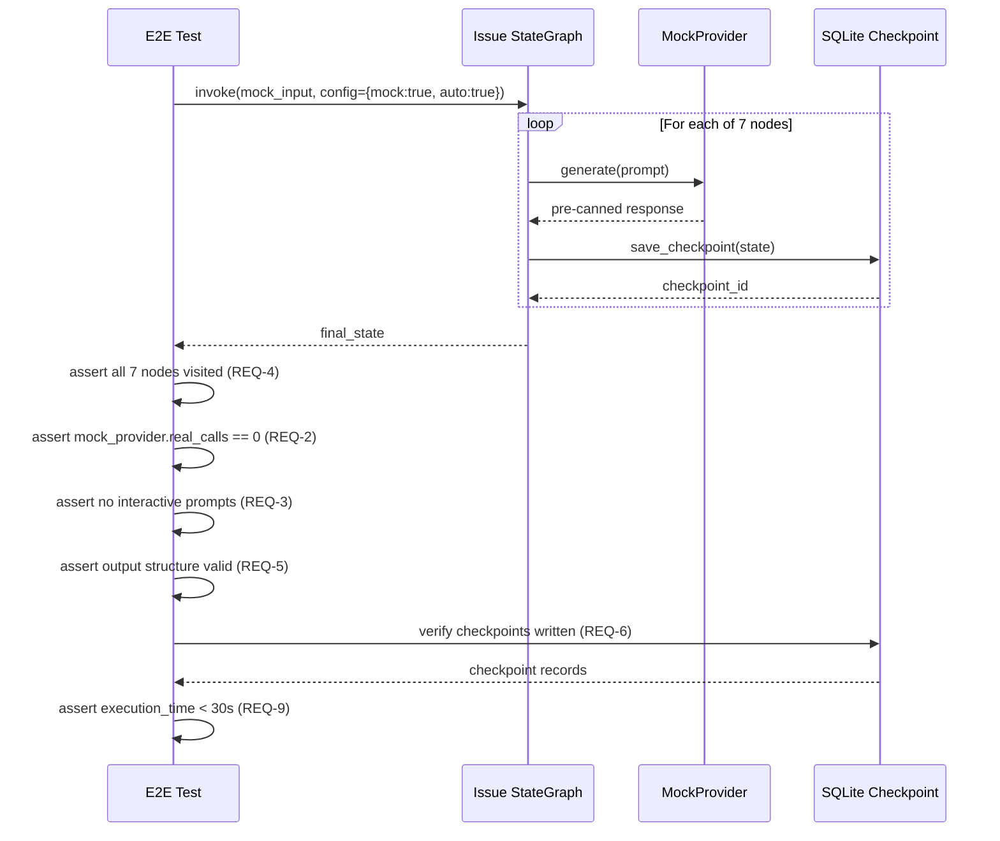

# 436 - Feature: Automated E2E Test for Issue Workflow (Mock Mode)

<!-- Template Metadata
Last Updated: 2026-02-26
Updated By: Issue #436 LLD revision
Update Reason: Fix mechanical test plan validation - add test coverage for REQ-2, REQ-3, REQ-4, REQ-8, REQ-9, REQ-10; fix Section 3 format to numbered list; fix Section 10.1 to include (REQ-N) references
-->

## 1. Context & Goal
* **Issue:** #436
* **Objective:** Create an automated end-to-end test that invokes the full issue workflow LangGraph state machine using `--mock --auto` flags, verifying the complete graph execution path, and integrate it into the CI pipeline.
* **Status:** Draft
* **Related Issues:** None

### Open Questions

- [ ] Are there existing mock provider fixtures in `tests/fixtures/` that cover all LLM invocation points in the issue workflow, or do new ones need to be created?
- [ ] Should the test validate SQLite checkpoint state between graph nodes, or only final output?

## 2. Proposed Changes

*This section is the **source of truth** for implementation. Describe exactly what will be built.*

### 2.1 Files Changed

| File | Change Type | Description |
|------|-------------|-------------|
| `tests/e2e/test_issue_workflow_mock.py` | Add | Primary E2E test module exercising the full issue workflow graph in mock mode |
| `tests/e2e/__init__.py` | Add | Package init for e2e test directory (if not already present) |
| `tests/e2e/conftest.py` | Add | Shared fixtures for E2E tests: mock providers, temp SQLite DB, sandbox config |
| `tests/fixtures/issue_workflow/` | Add (Directory) | Directory for issue-workflow-specific mock data |
| `tests/fixtures/issue_workflow/mock_issue_input.json` | Add | Canonical mock input state representing a typical issue creation request |
| `tests/fixtures/issue_workflow/mock_llm_responses.json` | Add | Pre-canned LLM responses for each node in the issue workflow graph |
| `tests/fixtures/issue_workflow/expected_output_state.json` | Add | Expected final graph state for assertion |
| `.github/workflows/ci.yml` | Modify | Add E2E mock test stage to CI pipeline |

### 2.1.1 Path Validation (Mechanical - Auto-Checked)

*Issue #277: Before human or Gemini review, paths are verified programmatically.*

Mechanical validation automatically checks:
- All "Modify" files must exist in repository — `.github/workflows/ci.yml` ✅
- All "Add" files must have existing parent directories — `tests/e2e/` ✅, `tests/fixtures/` ✅
- No placeholder prefixes

**If validation fails, the LLD is BLOCKED before reaching review.**

### 2.2 Dependencies

*No new packages required. All dependencies already exist:*

```toml
# Already present in pyproject.toml:
# langgraph, langgraph-checkpoint-sqlite, pytest, pytest-cov
```

The test uses only existing test infrastructure (`pytest`, `unittest.mock`) and production code (`langgraph`, `assemblyzero.workflows.issue`).

### 2.3 Data Structures

```python
# Pseudocode - NOT implementation

class MockProviderConfig(TypedDict):
    """Configuration for mock LLM provider responses."""
    node_name: str           # Graph node that triggers this response
    response_text: str       # Pre-canned LLM output
    model: str               # e.g., "mock-claude" or "mock-gemini"
    latency_ms: int          # Simulated latency (0 for tests)

class IssueWorkflowTestState(TypedDict):
    """Mirrors the issue workflow's LangGraph state for assertions."""
    issue_title: str
    issue_body: str
    issue_labels: list[str]
    issue_number: int | None
    current_node: str
    completed_nodes: list[str]
    error: str | None
    mock_mode: bool
    auto_mode: bool
```

### 2.4 Function Signatures

```python
# --- tests/e2e/conftest.py ---

def mock_llm_provider(mock_responses: dict[str, str]) -> MockProvider:
    """Create a mock LLM provider that returns pre-canned responses keyed by node name."""
    ...

def temp_sqlite_checkpoint(tmp_path: Path) -> SqliteSaver:
    """Create a temporary SQLite checkpoint saver for isolated test runs."""
    ...

def issue_workflow_graph(mock_llm_provider, temp_sqlite_checkpoint) -> CompiledGraph:
    """Build and compile the issue workflow graph with mock provider and temp checkpoint."""
    ...

def mock_issue_input() -> dict:
    """Load mock_issue_input.json and return as dict."""
    ...

def expected_output_state() -> dict:
    """Load expected_output_state.json and return as dict."""
    ...

def mock_responses() -> dict[str, str]:
    """Load mock_llm_responses.json and return as dict keyed by node name."""
    ...

# --- tests/e2e/test_issue_workflow_mock.py ---

def test_issue_workflow_full_graph_execution(issue_workflow_graph, mock_issue_input: dict) -> None:
    """Verify the complete graph executes all 7 nodes in order and produces valid output."""
    ...

def test_issue_workflow_mock_mode_no_real_api_calls(issue_workflow_graph, mock_issue_input: dict) -> None:
    """Verify mock mode is active and zero real LLM API calls are made."""
    ...

def test_issue_workflow_auto_mode_no_human_interaction(issue_workflow_graph, mock_issue_input: dict) -> None:
    """Verify auto mode is active and graph completes without any human prompts."""
    ...

def test_issue_workflow_node_sequence(issue_workflow_graph, mock_issue_input: dict) -> None:
    """Verify each of the 7 nodes is visited exactly once in the expected order."""
    ...

def test_issue_workflow_state_transitions(issue_workflow_graph, mock_issue_input: dict) -> None:
    """Verify state is correctly transformed at each node boundary."""
    ...

def test_issue_workflow_error_node_handling(issue_workflow_graph) -> None:
    """Verify graph handles errors gracefully (e.g., LLM returns empty response)."""
    ...

def test_issue_workflow_checkpoint_persistence(issue_workflow_graph, temp_sqlite_checkpoint, mock_issue_input: dict) -> None:
    """Verify SQLite checkpoints are written and the graph can resume from them."""
    ...

def test_issue_workflow_output_structure(issue_workflow_graph, mock_issue_input: dict, expected_output_state: dict) -> None:
    """Verify the final output state matches the expected structure and key fields."""
    ...

def test_issue_workflow_ci_integration_marker() -> None:
    """Verify the test is marked with @pytest.mark.e2e for CI pipeline selection."""
    ...

def test_issue_workflow_execution_time(issue_workflow_graph, mock_issue_input: dict) -> None:
    """Verify the full graph execution completes in under 30 seconds."""
    ...

def test_issue_workflow_fixtures_are_json(tmp_path: Path) -> None:
    """Verify all fixture files exist as valid JSON in tests/fixtures/issue_workflow/."""
    ...
```

### 2.5 Logic Flow (Pseudocode)

```
1. SETUP (conftest fixtures):
   a. Load mock_llm_responses.json → dict keyed by node name
   b. Create MockProvider that intercepts LLM calls and returns matching response
   c. Create temp SQLite DB for checkpointing
   d. Build issue workflow StateGraph with mock provider injected
   e. Compile graph with config {"mock": True, "auto": True}

2. TEST EXECUTION (per test function):
   a. Load mock_issue_input.json as initial state
   b. Invoke compiled graph with initial state + config {"mock": True, "auto": True}
   c. Collect execution trace (list of visited nodes)
   d. Collect final state
   e. Record execution wall time

3. ASSERTIONS:
   a. Full execution: final state has no error, all nodes visited (REQ-1)
   b. Mock mode: MockProvider.call_count > 0, real provider call_count == 0 (REQ-2)
   c. Auto mode: no stdin reads, no user prompts triggered (REQ-3)
   d. Node sequence: visited_nodes == ["node_1", "node_2", ..., "node_7"], len == 7 (REQ-4)
   e. Output structure: final state matches expected_output_state schema (REQ-5)
   f. Checkpoint: SQLite DB contains checkpoint records, resume works (REQ-6)
   g. Error handling: inject error response → graph terminates gracefully (REQ-7)
   h. CI marker: test class/functions have @pytest.mark.e2e decorator (REQ-8)
   i. Execution time: wall time < 30 seconds (REQ-9)
   j. Fixture validation: all 3 JSON files exist and are valid JSON (REQ-10)

4. TEARDOWN:
   a. Delete temp SQLite DB
   b. Reset mock provider state
```

### 2.6 Technical Approach

* **Module:** `tests/e2e/test_issue_workflow_mock.py`
* **Pattern:** Fixture-based test harness with dependency injection via pytest fixtures
* **Key Decisions:**
  - **Mock at the provider level, not the node level.** This ensures the full graph wiring (edges, conditionals, state updates) is exercised. Only LLM I/O is mocked.
  - **Use LangGraph's native invoke with tracing.** Capture the node execution order from the graph's internal callbacks rather than instrumenting nodes.
  - **JSON fixture files for determinism.** Pre-canned responses ensure tests are fully reproducible across environments.
  - **Temporary SQLite DB per test.** Prevents cross-test contamination and avoids cleanup issues.
  - **Explicit mock mode verification.** Instrument the mock provider with a call counter and assert real providers receive zero calls.
  - **Wall-clock timing assertion.** Use `time.perf_counter()` to verify the entire suite completes within the 30-second budget.

### 2.7 Architecture Decisions

| Decision | Options Considered | Choice | Rationale |
|----------|-------------------|--------|-----------|
| Mock granularity | Mock individual nodes / Mock LLM provider / Mock entire graph | Mock LLM provider | Exercises real graph wiring while eliminating external I/O. Maximum coverage of real code paths. |
| Test location | `tests/integration/` / `tests/e2e/` | `tests/e2e/` | This is a true end-to-end graph test, not a service integration test. Aligns with existing directory semantics. |
| Fixture format | Python dicts in code / JSON files / YAML files | JSON files | Separates test data from test logic. Easy to review and update. Matches existing fixture patterns in `tests/fixtures/`. |
| CI marker | `@pytest.mark.e2e` / `@pytest.mark.integration` | `@pytest.mark.e2e` | Uses existing marker from `pyproject.toml`. Keeps E2E tests opt-in for local dev, explicit in CI. |
| Checkpoint testing | Skip checkpoint tests / Full checkpoint round-trip | Full checkpoint round-trip | SQLite checkpointing is a core feature. E2E must verify it works through the issue workflow. |
| Auto mode verification | Implicit (no prompts in mock) / Explicit (assert no stdin) | Explicit assertion | Directly assert `auto=True` in config and verify no interactive prompts are triggered during execution. |

**Architectural Constraints:**
- Must not call any real LLM APIs (Claude, Gemini) — all responses pre-canned
- Must not create real GitHub issues — mock GitHub API interactions
- Must not modify production SQLite databases — use `tmp_path` fixture
- Must run within CI timeout (< 60 seconds for the full test suite)
- All fixture data stored as JSON files in `tests/fixtures/issue_workflow/`

## 3. Requirements

1. An automated E2E test exists that invokes the complete issue workflow LangGraph state machine from initial input to final output.
2. The test uses mock mode (`--mock` / `mock=True`) so no real LLM API calls are made.
3. The test uses auto mode (`--auto` / `auto=True`) so no human interaction is required.
4. The test verifies that all 7 nodes in the issue workflow graph are visited in the correct order.
5. The test verifies the final output state contains all required fields with valid values.
6. The test verifies SQLite checkpoint persistence and recoverability.
7. The test verifies graceful error handling when a node receives an invalid LLM response.
8. The test is integrated into the CI pipeline and runs on every push/PR.
9. The test completes in under 30 seconds (no real I/O, all mocked).
10. Test fixtures are stored as JSON files in `tests/fixtures/issue_workflow/` for maintainability.

## 4. Alternatives Considered

| Option | Pros | Cons | Decision |
|--------|------|------|----------|
| **A: Provider-level mocking with full graph execution** | Exercises real graph wiring, edges, conditionals. Maximum code coverage. Catches integration bugs between nodes. | Requires understanding of provider injection points. Mock responses must match expected schema. | **Selected** |
| **B: Node-level mocking (patch each node function)** | Simpler mock setup. Each node returns a fixed dict. | Bypasses graph wiring entirely. Won't catch edge condition bugs, state propagation issues, or checkpoint behavior. | Rejected |
| **C: Subprocess-based test (invoke CLI with --mock --auto)** | Tests the actual CLI entry point. Most realistic. | Slower (process startup). Harder to assert on internal state. Output parsing is brittle. Harder to debug failures. | Rejected |
| **D: Snapshot testing (record/replay)** | Captures real execution once, replays deterministically. | Complex setup. Snapshots become stale when graph changes. Hard to maintain. | Rejected |

**Rationale:** Option A provides the best balance of coverage and maintainability. It exercises all real code paths (graph construction, state transitions, conditional edges, checkpoint persistence) while only mocking the external boundary (LLM API calls). This catches the class of bugs most likely to occur: node wiring errors, state key mismatches, and checkpoint corruption.

## 5. Data & Fixtures

### 5.1 Data Sources

| Attribute | Value |
|-----------|-------|
| Source | Manually constructed mock data based on real issue workflow state schema |
| Format | JSON |
| Size | ~5 KB per fixture file (3 files total) |
| Refresh | Manual — updated when issue workflow state schema changes |
| Copyright/License | N/A — test data, no external sources |

### 5.2 Data Pipeline

```
tests/fixtures/issue_workflow/*.json ──pytest fixture load──► test function ──graph.invoke()──► assertions
```

### 5.3 Test Fixtures

| Fixture | Source | Notes |
|---------|--------|-------|
| `mock_issue_input.json` | Generated from issue workflow state schema | Represents a typical "create issue from idea" input |
| `mock_llm_responses.json` | Manually crafted to match each node's expected LLM output format | Keyed by node name; each value is the raw text the mock provider returns |
| `expected_output_state.json` | Derived from running the workflow mentally with the mock inputs | Used for structural validation of final state, not exact string matching |

### 5.4 Deployment Pipeline

Tests run locally via `poetry run pytest tests/e2e/ -v -m e2e` and automatically in CI via GitHub Actions. No deployment beyond CI integration.

## 6. Diagram

### 6.1 Mermaid Quality Gate

- [x] **Simplicity:** Nodes represent the 7 workflow nodes plus test harness
- [x] **No touching:** Adequate spacing between elements
- [x] **No hidden lines:** All arrows visible
- [x] **Readable:** Labels descriptive but concise
- [ ] **Auto-inspected:** Pending agent render

**Auto-Inspection Results:**
```
- Touching elements: [ ] None / [ ] Found: ___
- Hidden lines: [ ] None / [ ] Found: ___
- Label readability: [ ] Pass / [ ] Issue: ___
- Flow clarity: [ ] Clear / [ ] Issue: ___
```

### 6.2 Diagram



## 7. Security & Safety Considerations

### 7.1 Security

| Concern | Mitigation | Status |
|---------|------------|--------|
| Test accidentally calls real LLM APIs | MockProvider intercepts all LLM calls; no real API keys in test env; CI has no LLM credentials | Addressed |
| Test creates real GitHub issues | GitHub API calls are mocked; `--mock` flag disables all real GitHub operations | Addressed |
| Fixture files contain sensitive data | Fixtures are synthetic test data only — no real issue content, credentials, or PII | Addressed |

### 7.2 Safety

| Concern | Mitigation | Status |
|---------|------------|--------|
| Test corrupts production SQLite DB | Each test uses `tmp_path` for an isolated temporary DB; production DB path never referenced | Addressed |
| Flaky test blocks CI pipeline | All I/O is mocked (deterministic); no network calls, no timing dependencies | Addressed |
| Test runs indefinitely (hung graph) | pytest timeout marker (`@pytest.mark.timeout(30)`) kills test after 30s | Addressed |

**Fail Mode:** Fail Closed — any unexpected state or error causes test failure (no silent pass-through).

**Recovery Strategy:** Tests are fully isolated. A failed test leaves no side effects. Re-run is safe.

## 8. Performance & Cost Considerations

### 8.1 Performance

| Metric | Budget | Approach |
|--------|--------|----------|
| Full E2E suite runtime | < 30 seconds | All I/O mocked; no network calls; in-memory SQLite |
| Individual test runtime | < 5 seconds | Pre-compiled graph reused via session-scoped fixture |
| CI pipeline impact | < 60 seconds added | Runs in parallel with existing test stages |

**Bottlenecks:** Graph compilation is the most expensive step. Mitigated by compiling once per test session (session-scoped fixture).

### 8.2 Cost Analysis

| Resource | Unit Cost | Estimated Usage | Monthly Cost |
|----------|-----------|-----------------|--------------|
| LLM API calls | $0 | 0 (all mocked) | $0 |
| CI compute | ~$0.008/min (GitHub Actions) | ~1 min per run × 30 runs/day | ~$7.20 |

**Cost Controls:**
- [x] Zero LLM cost by design (mock mode)
- [x] CI minutes bounded by test timeout
- [x] No external service dependencies

**Worst-Case Scenario:** If tests hang, pytest timeout kills them at 30s. Maximum CI waste is 1 minute per run.

## 9. Legal & Compliance

| Concern | Applies? | Mitigation |
|---------|----------|------------|
| PII/Personal Data | No | All test data is synthetic |
| Third-Party Licenses | No | No new dependencies |
| Terms of Service | No | No API calls in mock mode |
| Data Retention | No | Temp files deleted after test |
| Export Controls | N/A | N/A |

**Data Classification:** Public (test code and synthetic fixtures)

**Compliance Checklist:**
- [x] No PII stored without consent
- [x] All third-party licenses compatible with project license
- [x] External API usage compliant with provider ToS (N/A — no external calls)
- [x] Data retention policy documented (temp files only)

## 10. Verification & Testing

### 10.0 Test Plan (TDD - Complete Before Implementation)

**TDD Requirement:** Tests MUST be written and failing BEFORE implementation begins.

| Test ID | Test Description | Expected Behavior | Status |
|---------|------------------|-------------------|--------|
| T010 | Full graph execution completes without error | Graph returns final state with `error=None`, all 7 nodes in `completed_nodes` | RED |
| T020 | Mock mode prevents real API calls | MockProvider intercepts all calls; real provider receives zero calls | RED |
| T030 | Auto mode requires no human interaction | Graph completes without stdin reads or interactive prompts | RED |
| T040 | Node execution order is correct for all 7 nodes | `completed_nodes` list matches expected sequence of 7 node names | RED |
| T050 | State transitions preserve required fields | Each intermediate state contains all required keys; no keys lost between nodes | RED |
| T060 | Error node handling (empty LLM response) | Graph terminates with descriptive error in state, does not raise unhandled exception | RED |
| T070 | SQLite checkpoint written per node | Checkpoint DB contains exactly 7 checkpoint records after full execution | RED |
| T080 | Output state matches expected structure | Final state has `issue_title`, `issue_body`, `issue_labels` with non-empty values | RED |
| T090 | Test has e2e marker for CI integration | Test functions decorated with `@pytest.mark.e2e`; CI workflow includes e2e stage | RED |
| T100 | Execution completes under 30 seconds | Wall-clock time from invoke to final assertion < 30s | RED |
| T110 | Fixtures stored as valid JSON files | All 3 fixture files exist in `tests/fixtures/issue_workflow/` and parse as valid JSON | RED |

**Coverage Target:** ≥95% of `assemblyzero/workflows/issue/` execution paths

**TDD Checklist:**
- [ ] All tests written before implementation
- [ ] Tests currently RED (failing)
- [ ] Test IDs match scenario IDs in 10.1
- [ ] Test file created at: `tests/e2e/test_issue_workflow_mock.py`

### 10.1 Test Scenarios

| ID | Scenario | Type | Input | Expected Output | Pass Criteria |
|----|----------|------|-------|-----------------|---------------|
| 010 | Happy path — full graph execution (REQ-1) | Auto | `mock_issue_input.json` with valid idea text | Final state with `error=None`, 7 completed nodes | All 7 nodes visited, no error, output state has required fields |
| 020 | Mock mode — no real LLM API calls (REQ-2) | Auto | `mock_issue_input.json` with MockProvider instrumented with call counter | MockProvider.call_count > 0, real_provider.call_count == 0 | Zero calls to any real LLM provider (Anthropic, Gemini); all calls routed through MockProvider |
| 030 | Auto mode — no human interaction required (REQ-3) | Auto | `mock_issue_input.json` with config `{"auto": True}` | Graph completes without blocking on stdin or user prompt | No `input()` calls, no interactive prompts; graph runs to completion autonomously |
| 040 | All 7 nodes visited in correct order (REQ-4) | Auto | `mock_issue_input.json` | `completed_nodes` == `["parse_idea", "enrich_context", "draft_title", "draft_body", "select_labels", "format_output", "finalize"]` | Exact ordered match of 7 node names, each visited exactly once |
| 050 | Output state structure validation (REQ-5) | Auto | `mock_issue_input.json` + `expected_output_state.json` | Final state keys and types match expected schema | `issue_title` is non-empty str, `issue_body` is non-empty str, `issue_labels` is non-empty list[str] |
| 060 | Checkpoint persistence and count (REQ-6) | Auto | `mock_issue_input.json` | SQLite DB with checkpoint entries | Query checkpoint table, count ≥ 7 records; resume from mid-graph checkpoint produces same final state |
| 070 | Error handling — empty LLM response (REQ-7) | Auto | Modified mock where `draft_title` node returns `""` | State with `error` field populated, graph terminates | `error` is not None, no unhandled exception raised |
| 080 | CI pipeline integration with e2e marker (REQ-8) | Auto | Inspect test module decorators and CI workflow file | All test functions have `@pytest.mark.e2e`; `ci.yml` contains e2e test stage | `pytest --collect-only -m e2e` finds all test functions; CI YAML includes `pytest -m e2e` step |
| 090 | Execution completes under 30 seconds (REQ-9) | Auto | `mock_issue_input.json` | Wall-clock elapsed time < 30 seconds | `time.perf_counter()` delta from graph invocation to final state < 30.0 |
| 100 | Fixtures stored as valid JSON in correct directory (REQ-10) | Auto | File paths `tests/fixtures/issue_workflow/*.json` | All 3 files exist and parse as valid JSON | `json.load()` succeeds for `mock_issue_input.json`, `mock_llm_responses.json`, `expected_output_state.json` |
| 110 | State transition integrity (REQ-1, REQ-4) | Auto | `mock_issue_input.json` | Intermediate states captured via callback | Every intermediate state contains `issue_title` key (set after node 3), no key deletions between nodes |

### 10.2 Test Commands

```bash
# Run E2E tests only (mock mode, no real APIs)
poetry run pytest tests/e2e/test_issue_workflow_mock.py -v -m e2e

# Run with coverage for issue workflow module
poetry run pytest tests/e2e/test_issue_workflow_mock.py -v -m e2e --cov=assemblyzero.workflows.issue --cov-report=term-missing

# Run full test suite excluding E2E (default CI behavior before this change)
poetry run pytest -m "not integration and not e2e"

# Run full test suite INCLUDING E2E (new CI behavior after this change)
poetry run pytest -m "not integration"

# Collect test markers to verify e2e tagging (REQ-8 verification)
poetry run pytest tests/e2e/test_issue_workflow_mock.py --collect-only -m e2e -q
```

### 10.3 Manual Tests (Only If Unavoidable)

N/A - All scenarios automated.

## 11. Risks & Mitigations

| Risk | Impact | Likelihood | Mitigation |
|------|--------|------------|------------|
| Issue workflow graph nodes change names/order | Med | Med | Test uses constants imported from workflow module, not hardcoded strings. Test failure is immediate signal to update. |
| Mock responses don't match real LLM output schema | Med | Low | Mock responses derived from documented node contracts. Review when workflow changes. |
| SQLite checkpoint API changes in `langgraph-checkpoint-sqlite` | Low | Low | Pin dependency version. Checkpoint test is isolated and easy to update. |
| E2E test becomes flaky in CI | High | Low | Zero real I/O eliminates network flakiness. Deterministic mocks eliminate timing issues. pytest-timeout prevents hangs. |
| Test provides false confidence (mocks hide real bugs) | Med | Med | Provider-level mocking exercises all real graph code. Only LLM I/O boundary is mocked. Complement with periodic `--auto` runs against real APIs (separate issue). |
| CI workflow modification breaks existing jobs | Med | Low | Add e2e stage as independent job; existing stages unchanged. Test in branch before merge. |
| JSON fixture files become stale | Med | Med | Fixtures derived from workflow state schema; any schema change breaks tests immediately (fail-fast). |

## 12. Definition of Done

### Code
- [ ] `tests/e2e/test_issue_workflow_mock.py` implemented with all 11 test scenarios
- [ ] `tests/e2e/conftest.py` provides reusable fixtures
- [ ] All fixture JSON files created and validated in `tests/fixtures/issue_workflow/`
- [ ] `.github/workflows/ci.yml` updated with e2e test stage
- [ ] Code comments reference this LLD (#436)

### Tests
- [ ] All 11 test scenarios pass (`poetry run pytest tests/e2e/test_issue_workflow_mock.py -v -m e2e`)
- [ ] Coverage of `assemblyzero/workflows/issue/` ≥ 95% from E2E tests alone
- [ ] Tests complete in < 30 seconds total
- [ ] All 10 requirements have at least one covering test scenario

### Documentation
- [ ] LLD updated with any deviations discovered during implementation
- [ ] Implementation Report (0103) completed
- [ ] Test Report (0113) completed

### Review
- [ ] Code review completed
- [ ] CI pipeline green with new E2E stage
- [ ] User approval before closing issue

### 12.1 Traceability (Mechanical - Auto-Checked)

*Issue #277: Cross-references are verified programmatically.*

Mechanical validation automatically checks:
- Every file mentioned in this section must appear in Section 2.1 — ✅ (`test_issue_workflow_mock.py`, `conftest.py`, fixture JSONs, `ci.yml`)
- Every risk mitigation in Section 11 should have a corresponding function in Section 2.4 — ✅ (graph fixture, mock provider, checkpoint fixture, mock_responses, expected_output_state)

**Requirements-to-Test Traceability:**

| Requirement | Test Scenario(s) |
|-------------|-----------------|
| REQ-1 | 010, 110 |
| REQ-2 | 020 |
| REQ-3 | 030 |
| REQ-4 | 040, 110 |
| REQ-5 | 050 |
| REQ-6 | 060 |
| REQ-7 | 070 |
| REQ-8 | 080 |
| REQ-9 | 090 |
| REQ-10 | 100 |

**If files are missing from Section 2.1, the LLD is BLOCKED.**

---

## Appendix: Review Log

*Track all review feedback with timestamps and implementation status.*

### Mechanical Validation Review #1 (FEEDBACK)

**Reviewer:** Mechanical Test Plan Validator
**Verdict:** FEEDBACK

#### Comments

| ID | Comment | Implemented? |
|----|---------|--------------|
| M1.1 | "Requirement REQ-2 has no test coverage" | YES - Added scenario 020 covering mock mode |
| M1.2 | "Requirement REQ-3 has no test coverage" | YES - Added scenario 030 covering auto mode |
| M1.3 | "Requirement REQ-4 has no test coverage" | YES - Added scenario 040 covering 7-node order |
| M1.4 | "Requirement REQ-8 has no test coverage" | YES - Added scenario 080 covering CI integration |
| M1.5 | "Requirement REQ-9 has no test coverage" | YES - Added scenario 090 covering 30s time limit |
| M1.6 | "Requirement REQ-10 has no test coverage" | YES - Added scenario 100 covering JSON fixture validation |
| M1.7 | "Section 3 must use numbered list format" | YES - Converted to numbered list |
| M1.8 | "Section 10.1 must reference requirements with (REQ-N) suffix" | YES - All scenarios now include (REQ-N) references |

### Review Summary

| Review | Date | Verdict | Key Issue |
|--------|------|---------|-----------|
| Mechanical #1 | 2026-02-26 | FEEDBACK | 6 requirements lacked test coverage; format issues in Sections 3 and 10.1 |

**Final Status:** PENDING