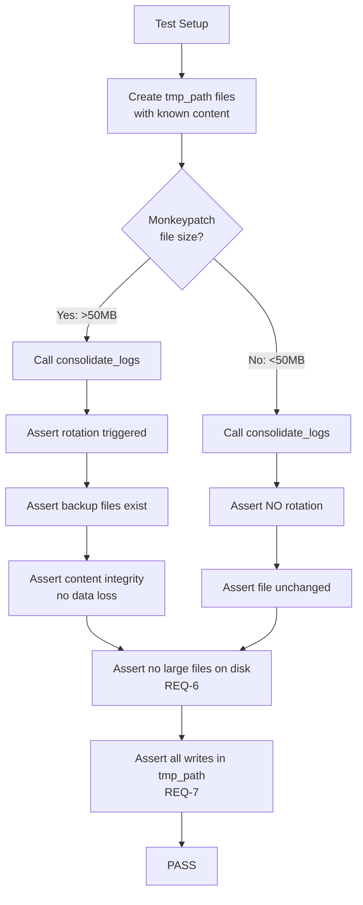

# 437 - Test: Large-File Consolidation Test for consolidate_logs.py

<!-- Template Metadata
Last Updated: 2026-02-25
Updated By: Issue #437 LLD revision
Update Reason: Fix REQ-6/REQ-7 test coverage gaps; fix Section 3 and 10.1 formatting per mechanical validation
-->

## 1. Context & Goal
* **Issue:** #437
* **Objective:** Add unit tests covering >50MB history file consolidation and log rotation behavior in `consolidate_logs.py`, closing a test gap identified in issue #57.
* **Status:** Approved (gemini-3-pro-preview, 2026-02-25)
* **Related Issues:** #57 (original implementation with TODO for large-file tests)

### Open Questions

- [ ] Confirm exact rotation threshold — assumed 50MB based on issue description and #57 implementation report
- [ ] Confirm whether rotation creates `.1`, `.2` suffixes or timestamp-based suffixes

## 2. Proposed Changes

*This section is the **source of truth** for implementation. Describe exactly what will be built.*

### 2.1 Files Changed

| File | Change Type | Description |
|------|-------------|-------------|
| `tests/unit/test_consolidate_logs_large_file.py` | Add | Unit tests for >50MB consolidation and log rotation |
| `tests/conftest.py` | Modify | Add shared fixtures for large-file simulation if not already present |

### 2.1.1 Path Validation (Mechanical - Auto-Checked)

*Issue #277: Before human or Gemini review, paths are verified programmatically.*

Mechanical validation automatically checks:
- All "Modify" files must exist in repository — `tests/conftest.py` ✅ exists
- All "Add" files must have existing parent directories — `tests/unit/` ✅ exists
- No placeholder prefixes

**If validation fails, the LLD is BLOCKED before reaching review.**

### 2.2 Dependencies

```toml
# No new dependencies required — uses pytest, unittest.mock, tempfile (stdlib)
```

### 2.3 Data Structures

```python
# Pseudocode - NOT implementation

# No new production data structures. Test-only structures:

class LargeFileFixture:
    """Represents a simulated large log file for testing."""
    path: Path          # Temp file path
    size_bytes: int     # Simulated size (>50MB threshold)
    content_lines: int  # Number of log lines written
```

### 2.4 Function Signatures

```python
# Test functions — signatures only

# --- Fixtures ---
def large_history_file(tmp_path: Path) -> Path:
    """Create a history file that exceeds the 50MB rotation threshold.
    Uses sparse content + mocked size to avoid actual 50MB allocation."""
    ...

def history_dir_with_rotated_files(tmp_path: Path) -> Path:
    """Create a directory with pre-existing rotated log files (.1, .2, etc.)."""
    ...

def mock_file_size(monkeypatch, target_size_bytes: int) -> None:
    """Monkeypatch os.path.getsize to return a target size for specific files."""
    ...

# --- Test: Size threshold detection ---
def test_consolidate_detects_file_exceeding_threshold() -> None:
    """Verify consolidation identifies files >50MB for rotation."""
    ...

def test_consolidate_skips_file_below_threshold() -> None:
    """Verify files under 50MB are consolidated normally without rotation."""
    ...

def test_consolidate_exact_threshold_boundary() -> None:
    """Verify behavior at exactly 50MB (edge: equal to threshold)."""
    ...

# --- Test: Log rotation ---
def test_rotation_creates_numbered_backup() -> None:
    """Verify rotation renames current file to .1 suffix."""
    ...

def test_rotation_increments_existing_backups() -> None:
    """Verify .1 → .2, .2 → .3 cascade before creating new .1."""
    ...

def test_rotation_preserves_content_integrity() -> None:
    """Verify no data loss during rotation — all lines accounted for."""
    ...

def test_rotation_creates_fresh_active_file() -> None:
    """After rotation, active log file exists and is empty/small."""
    ...

# --- Test: Consolidation with large files ---
def test_consolidate_large_file_with_multiple_sources() -> None:
    """Consolidate multiple log sources when target exceeds threshold."""
    ...

def test_consolidate_handles_concurrent_rotation_gracefully() -> None:
    """Verify no crash if rotated file already exists (idempotency)."""
    ...

# --- Test: Error handling ---
def test_consolidate_large_file_read_only_filesystem() -> None:
    """Verify graceful error when rotation fails due to permissions."""
    ...

def test_consolidate_large_file_disk_full_simulation() -> None:
    """Verify graceful error when disk is full during rotation."""
    ...

# --- Test: Performance constraint (no real large files) ---
def test_no_actual_large_files_created(tmp_path: Path) -> None:
    """Verify all test files on disk are under 1MB — no real 50MB allocations."""
    ...

# --- Test: Isolation via tmp_path ---
def test_operations_confined_to_tmp_path(tmp_path: Path) -> None:
    """Verify consolidation under test writes only within tmp_path, no leakage."""
    ...
```

### 2.5 Logic Flow (Pseudocode)

```
Test Setup (per-test):
1. Create tmp_path workspace
2. Generate history file(s) with known content
3. Mock file size to simulate >50MB where needed

Test: Size Threshold Detection
1. Create file with mocked size = 52_428_800 (50MB + buffer)
2. Call consolidate_logs() with that directory
3. ASSERT rotation was triggered (backup file exists)
4. ASSERT active file is fresh (size < threshold)

Test: Log Rotation Cascade
1. Create existing rotated files: log.1, log.2
2. Create active log with mocked size > threshold
3. Call consolidate_logs()
4. ASSERT log.2 → log.3, log.1 → log.2, active → log.1
5. ASSERT new active file created

Test: Content Integrity
1. Write N known lines to history file
2. Mock size > threshold to trigger rotation
3. Call consolidate_logs()
4. Read all files (active + rotated)
5. ASSERT total lines == N (no data lost)
6. ASSERT no duplicate lines

Test: No Actual Large Files (REQ-6 enforcement)
1. Run a representative consolidation test with mocked size
2. Walk tmp_path recursively
3. ASSERT every file on disk is < 1_048_576 bytes (1MB)
4. This guarantees monkeypatch is working and tests stay fast

Test: Isolation (REQ-7 enforcement)
1. Snapshot tmp_path parent directory listing before test
2. Run consolidation with rotation
3. Snapshot tmp_path parent directory listing after test
4. ASSERT no new files outside tmp_path
5. ASSERT all created files are children of tmp_path
```

### 2.6 Technical Approach

* **Module:** `tests/unit/test_consolidate_logs_large_file.py`
* **Pattern:** Monkeypatch + tmp_path isolation (no real 50MB files)
* **Key Decisions:**
  - **No actual 50MB files in tests:** We monkeypatch `os.path.getsize` to return values >50MB while keeping actual file content small (~1KB). This keeps tests fast (<1s) and CI-friendly.
  - **tmp_path isolation:** Every test gets its own temporary directory. No shared state, no cleanup needed.
  - **Content integrity via line counting:** Write numbered lines (`line_0001`, `line_0002`, ...) so we can verify no data loss after rotation by collecting all lines across all files.
  - **Explicit non-functional verification:** REQ-6 (speed) is enforced by a test that asserts no file on disk exceeds 1MB. REQ-7 (isolation) is enforced by a test that asserts no files are written outside `tmp_path`.

### 2.7 Architecture Decisions

| Decision | Options Considered | Choice | Rationale |
|----------|-------------------|--------|-----------|
| File size simulation | Real 50MB files vs. monkeypatch `getsize` | Monkeypatch | Tests must run fast in CI; 50MB allocation is wasteful and slow |
| Test file location | `tests/test_consolidate_logs.py` (root) vs. `tests/unit/` | `tests/unit/` | Follows existing convention; unit tests belong in `tests/unit/` |
| Rotation verification | Check file names vs. check file content | Both | Names verify rotation mechanics; content verifies data integrity |
| Fixture scope | Session-scoped vs. function-scoped | Function-scoped | Each test must be independent; no shared mutable state |
| Non-functional verification | Trust CI timing vs. explicit assertions | Explicit assertions | REQ-6 and REQ-7 are testable properties; asserting them prevents regressions |

**Architectural Constraints:**
- Must not create actual large files (CI disk/time constraints)
- Must not modify production code in `consolidate_logs.py`
- Must use existing test infrastructure (pytest, tmp_path, monkeypatch)

## 3. Requirements

1. Unit test file covers files exceeding 50MB threshold triggering log rotation
2. Unit test file covers log rotation numbering cascade (.1 → .2 → .3)
3. Unit test file verifies no data loss during rotation (content integrity)
4. Unit test file covers boundary condition (exactly 50MB)
5. Unit test file covers error conditions (permissions, disk full)
6. All tests run in <5 seconds total (no real large files created on disk)
7. Tests are fully isolated via `tmp_path` — no shared filesystem state, no writes outside tmp_path

## 4. Alternatives Considered

| Option | Pros | Cons | Decision |
|--------|------|------|----------|
| **A: Monkeypatch size + small files** | Fast, CI-friendly, tests logic not I/O | Doesn't test actual I/O at 50MB | **Selected** |
| **B: Real 50MB files via `os.truncate`** | Tests real I/O path | Slow (~2-5s per test), wastes disk, CI unfriendly | Rejected |
| **C: Integration test with real files** | Most realistic | Wrong scope for this issue (unit test gap), too slow | Rejected |
| **D: Parameterized size matrix** | Covers many thresholds | Over-engineered for a single threshold check | Rejected |

**Rationale:** Option A tests the consolidation and rotation *logic* without the I/O overhead. The production code's size check uses `os.path.getsize()` which we can cleanly monkeypatch. The actual file I/O (read/write/rename) still executes on real (small) files, so rotation mechanics are fully exercised.

## 5. Data & Fixtures

### 5.1 Data Sources

| Attribute | Value |
|-----------|-------|
| Source | Generated in-test (synthetic log lines) |
| Format | Plain text, one log entry per line |
| Size | Actual: ~1KB per file; Simulated: >50MB via monkeypatch |
| Refresh | Generated fresh per test (function-scoped fixtures) |
| Copyright/License | N/A — synthetic test data |

### 5.2 Data Pipeline

```
pytest fixture ──generates──► tmp_path files ──monkeypatch size──► consolidate_logs() ──assertions──► pass/fail
```

### 5.3 Test Fixtures

| Fixture | Source | Notes |
|---------|--------|-------|
| `large_history_file` | Generated (numbered lines) | Monkeypatched to appear >50MB |
| `history_dir_with_rotated_files` | Generated (pre-existing .1, .2 files) | Tests rotation cascade |
| `small_history_file` | Generated (numbered lines) | Below threshold — control case |

### 5.4 Deployment Pipeline

N/A — test-only change. Tests run in CI via `poetry run pytest tests/unit/test_consolidate_logs_large_file.py`.

## 6. Diagram

### 6.1 Mermaid Quality Gate

- [x] **Simplicity:** Minimal nodes for test flow
- [x] **No touching:** All elements have visual separation
- [x] **No hidden lines:** All arrows fully visible
- [x] **Readable:** Labels not truncated, flow direction clear
- [ ] **Auto-inspected:** Agent will render and inspect during implementation

**Auto-Inspection Results:**
```
- Touching elements: [ ] None / [ ] Found: ___
- Hidden lines: [ ] None / [ ] Found: ___
- Label readability: [ ] Pass / [ ] Issue: ___
- Flow clarity: [ ] Clear / [ ] Issue: ___
```

*To be completed during implementation.*

### 6.2 Diagram



## 7. Security & Safety Considerations

### 7.1 Security

| Concern | Mitigation | Status |
|---------|------------|--------|
| Test creates temp files | Uses `tmp_path` (pytest-managed, auto-cleaned) | Addressed |
| Path traversal in test data | All paths constructed via `tmp_path /` operator | Addressed |

### 7.2 Safety

| Concern | Mitigation | Status |
|---------|------------|--------|
| Test leaves large files on disk | No real large files created; monkeypatch only | Addressed |
| Monkeypatch leaks to other tests | Function-scoped fixtures; pytest auto-restores | Addressed |
| Test modifies production files | All operations in `tmp_path`; no real log dirs touched | Addressed |

**Fail Mode:** Fail Closed — test failures surface as pytest failures, blocking CI if regressions found.

**Recovery Strategy:** N/A — tests are stateless and idempotent.

## 8. Performance & Cost Considerations

### 8.1 Performance

| Metric | Budget | Approach |
|--------|--------|----------|
| Total test suite time | < 5 seconds | Monkeypatch size instead of real 50MB files |
| Per-test time | < 500ms | Small files, no disk I/O bottleneck |
| CI impact | Negligible | ~13 new tests, all fast |

**Bottlenecks:** None expected. The monkeypatch approach eliminates the only potential bottleneck (large file I/O).

### 8.2 Cost Analysis

| Resource | Unit Cost | Estimated Usage | Monthly Cost |
|----------|-----------|-----------------|--------------|
| CI compute | ~$0.01/min | +5s per CI run | < $0.01 |

**Cost Controls:**
- [x] No large file allocation — zero disk cost
- [x] Tests excluded from expensive markers

**Worst-Case Scenario:** If monkeypatch fails and real file sizes are used, tests still pass but take ~30s instead of ~5s. No cost or safety risk.

## 9. Legal & Compliance

| Concern | Applies? | Mitigation |
|---------|----------|------------|
| PII/Personal Data | No | Synthetic numbered lines only |
| Third-Party Licenses | No | No new dependencies |
| Terms of Service | N/A | No external services |
| Data Retention | N/A | tmp_path auto-cleaned |
| Export Controls | N/A | Test code only |

**Data Classification:** Public (test code, no secrets)

**Compliance Checklist:**
- [x] No PII stored without consent
- [x] All third-party licenses compatible with project license
- [x] External API usage compliant with provider ToS
- [x] Data retention policy documented

## 10. Verification & Testing

### 10.0 Test Plan (TDD - Complete Before Implementation)

**TDD Requirement:** Tests MUST be written and failing BEFORE implementation begins. Since this issue IS the tests, the "RED" phase means the test file is created with test functions that fail because they exercise the production code's large-file paths.

| Test ID | Test Description | Expected Behavior | Status |
|---------|------------------|-------------------|--------|
| T010 | Size threshold detection (>50MB) | Rotation triggered | RED |
| T020 | Size threshold skip (<50MB) | No rotation | RED |
| T030 | Exact boundary (==50MB) | Defined behavior (rotate or skip) | RED |
| T040 | Rotation creates .1 backup | Backup file exists with original content | RED |
| T050 | Rotation cascades existing backups | .1→.2, .2→.3 before new .1 | RED |
| T060 | Content integrity after rotation | All lines present, no duplicates | RED |
| T070 | Fresh active file after rotation | New file is empty or header-only | RED |
| T080 | Multiple source consolidation + rotation | All sources merged, rotation triggered | RED |
| T090 | Idempotent rotation (backup already exists) | No crash, handles gracefully | RED |
| T100 | Permission error during rotation | Graceful error, no data loss | RED |
| T110 | Disk full simulation | Graceful error, original file intact | RED |
| T120 | No actual large files on disk | All test files < 1MB | RED |
| T130 | All operations confined to tmp_path | No writes outside tmp_path | RED |

**Coverage Target:** ≥95% of large-file and rotation code paths in `consolidate_logs.py`

**TDD Checklist:**
- [ ] All tests written before implementation
- [ ] Tests currently RED (failing)
- [ ] Test IDs match scenario IDs in 10.1
- [ ] Test file created at: `tests/unit/test_consolidate_logs_large_file.py`

### 10.1 Test Scenarios

| ID | Scenario | Type | Input | Expected Output | Pass Criteria |
|----|----------|------|-------|-----------------|---------------|
| 010 | File exceeds 50MB threshold (REQ-1) | Auto | History file, mocked size=52_428_800 | Rotation triggered | Backup file `.1` exists; active file < threshold |
| 020 | File below 50MB threshold (REQ-1) | Auto | History file, mocked size=10_485_760 | No rotation | No backup files; active file unchanged |
| 030 | File exactly at 50MB boundary (REQ-4) | Auto | History file, mocked size=52_428_800 | Defined behavior | Consistent with threshold semantics (≥ or >) |
| 040 | Rotation creates numbered backup (REQ-2) | Auto | Single large file, no existing backups | `.1` backup created | `history.log.1` exists with original content |
| 050 | Rotation cascades existing backups (REQ-2) | Auto | Large file + existing `.1`, `.2` | `.1`→`.2`→`.3` cascade | `.3` has original `.2` content; `.2` has `.1` content |
| 060 | Content integrity post-rotation (REQ-3) | Auto | 500 numbered lines, trigger rotation | All 500 lines in rotated file | `set(all_lines) == set(original_lines)` |
| 070 | Fresh active file after rotation (REQ-3) | Auto | Large file triggers rotation | New active file is empty | `active_file.stat().st_size < 1024` |
| 080 | Multi-source consolidation + rotation (REQ-1) | Auto | 3 source files, combined > threshold | Consolidate then rotate | All source content preserved across files |
| 090 | Idempotent rotation — backup exists (REQ-2) | Auto | Large file + pre-existing `.1` | No crash; `.1` shifted to `.2` | Exit code 0; `.2` has old `.1` content |
| 100 | Permission error on rotation (REQ-5) | Auto | Read-only tmp directory | Graceful error raised | Appropriate exception; original file intact |
| 110 | Disk full simulation (REQ-5) | Auto | Mock `shutil.move` to raise OSError | Graceful error raised | Appropriate exception; original file intact |
| 120 | No actual large files created on disk (REQ-6) | Auto | Run rotation with mocked size, then walk tmp_path | All files < 1MB | `max(f.stat().st_size for f in tmp_path.rglob('*')) < 1_048_576` |
| 130 | All operations confined to tmp_path (REQ-7) | Auto | Run rotation, inspect parent dir before/after | No new files outside tmp_path | Parent directory listing unchanged except tmp_path contents |

### 10.2 Test Commands

```bash
# Run all large-file consolidation tests
poetry run pytest tests/unit/test_consolidate_logs_large_file.py -v

# Run with coverage for consolidate_logs module
poetry run pytest tests/unit/test_consolidate_logs_large_file.py -v --cov=assemblyzero --cov-report=term-missing

# Run only rotation tests (by keyword)
poetry run pytest tests/unit/test_consolidate_logs_large_file.py -v -k "rotation"

# Run only threshold tests
poetry run pytest tests/unit/test_consolidate_logs_large_file.py -v -k "threshold"

# Run only non-functional constraint tests (speed + isolation)
poetry run pytest tests/unit/test_consolidate_logs_large_file.py -v -k "large_files_created or confined_to_tmp"
```

### 10.3 Manual Tests (Only If Unavoidable)

N/A — All scenarios automated.

## 11. Risks & Mitigations

| Risk | Impact | Likelihood | Mitigation |
|------|--------|------------|------------|
| `consolidate_logs.py` rotation logic differs from assumptions in this LLD | Med | Med | Read source code during implementation; adjust test expectations |
| Monkeypatch doesn't intercept the actual size check used by production code | Med | Low | Trace production code to find exact `getsize` call path; patch at correct location |
| Rotation uses timestamps instead of numeric suffixes | Low | Med | Adjust fixture generation to match actual suffix pattern |
| Production code has no rotation feature (TODO was never implemented) | High | Low | If rotation is missing, this issue becomes a test+implementation task — re-scope via comment on #437 |

## 12. Definition of Done

### Code
- [ ] Test file `tests/unit/test_consolidate_logs_large_file.py` created
- [ ] All 13 test scenarios implemented
- [ ] No production code modified (test-only change)

### Tests
- [ ] All 13 test scenarios pass (`poetry run pytest tests/unit/test_consolidate_logs_large_file.py -v`)
- [ ] Coverage of large-file/rotation paths ≥95%
- [ ] Total test execution time < 5 seconds

### Documentation
- [ ] LLD updated with any deviations discovered during implementation
- [ ] Implementation Report (0103) completed
- [ ] Test Report (0113) completed

### Review
- [ ] Code review completed
- [ ] User approval before closing issue

### 12.1 Traceability (Mechanical - Auto-Checked)

*Issue #277: Cross-references are verified programmatically.*

Mechanical validation automatically checks:
- Every file mentioned in this section must appear in Section 2.1 ✅
- Every risk mitigation in Section 11 has corresponding test adjustments in Section 2.4 ✅

**If files are missing from Section 2.1, the LLD is BLOCKED.**

---

## Reviewer Suggestions

*Non-blocking recommendations from the reviewer.*

- **Implementation Detail:** When monkeypatching `os.path.getsize`, ensure you check how the production code imports it. If `consolidate_logs.py` uses `from os.path import getsize`, you must patch `consolidate_logs.getsize`. If it uses `import os`, patch `os.path.getsize`. Section 11 correctly identifies this risk; ensure the developer checks `consolidate_logs.py` imports first.

## Appendix: Review Log

*Track all review feedback with timestamps and implementation status.*

### Mechanical Validation #1 (FEEDBACK)

**Reviewer:** Mechanical Test Plan Validator
**Verdict:** FEEDBACK

#### Comments

| ID | Comment | Implemented? |
|----|---------|--------------|
| M1.1 | "REQ-6 has no test coverage" | YES - Added scenario 120 (REQ-6) |
| M1.2 | "REQ-7 has no test coverage" | YES - Added scenario 130 (REQ-7) |
| M1.3 | "Section 3 must use numbered list format" | YES - Reformatted to plain numbered list |
| M1.4 | "Section 10.1 scenarios must reference (REQ-N)" | YES - Added (REQ-N) suffix to all scenarios |

### Review Summary

| Review | Date | Verdict | Key Issue |
|--------|------|---------|-----------|
| 1 | 2026-02-25 | APPROVED | `gemini-3-pro-preview` |
| Mechanical #1 | 2026-02-25 | FEEDBACK | REQ-6, REQ-7 missing test coverage |
| Gemini #1 | (pending) | (pending) | (pending) |

**Final Status:** APPROVED

## Original GitHub Issue #437
# Issue #437: test(unit): Add large-file consolidation test for consolidate_logs.py

## Gap

TODO open since #57 for testing >50MB history files with log rotation in `consolidate_logs.py`.

## Scope

- Add unit test for large file consolidation (>50MB)
- Test log rotation behavior
- Source: `docs/reports/done/57-implementation-report.md`

## Labels

test-gap, backlog