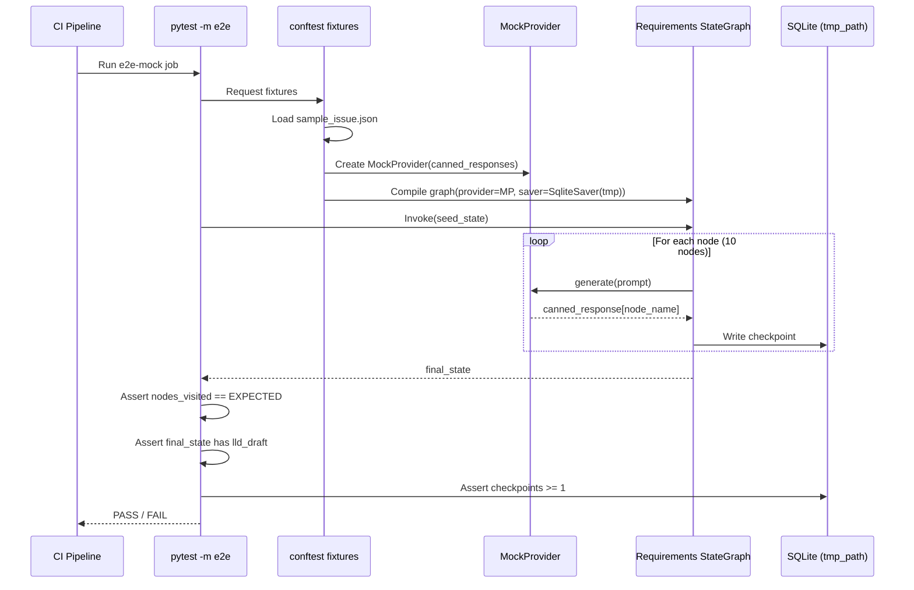

# 438 - Test: Automated E2E Test for LLD Workflow (Mock Mode)

<!-- Template Metadata
Last Updated: 2026-02-26
Updated By: Issue #438 LLD creation
Update Reason: Initial LLD draft for automated E2E test covering the LLD (requirements) workflow in mock+auto mode
-->

## 1. Context & Goal
* **Issue:** #438
* **Objective:** Create an automated E2E test that exercises the full LangGraph execution path of the LLD (requirements) workflow using `--mock --auto` flags, and integrate it into CI.
* **Status:** Draft
* **Related Issues:** None (source: `docs/reports/done/95-test-report.md`)

### Open Questions

- [ ] Are there any existing mock fixtures in `tests/fixtures/` that cover requirements workflow state, or do we need to create them from scratch?
- [ ] Should the test validate SQLite checkpoint writes, or just the final graph state?

## 2. Proposed Changes

*This section is the **source of truth** for implementation. Describe exactly what will be built.*

### 2.1 Files Changed

| File | Change Type | Description |
|------|-------------|-------------|
| `tests/e2e/test_lld_workflow_mock.py` | Add | E2E test module for LLD workflow in mock mode |
| `tests/e2e/__init__.py` | Add | Package init (if not present) |
| `tests/e2e/conftest.py` | Add | Shared fixtures for E2E tests (temp dirs, mock config, cleanup) |
| `tests/fixtures/lld_workflow/` | Add (Directory) | Fixture directory for LLD workflow test data |
| `tests/fixtures/lld_workflow/sample_issue.json` | Add | Minimal mock issue payload to seed the workflow |
| `tests/fixtures/lld_workflow/expected_state.json` | Add | Expected final state schema for assertion |
| `.github/workflows/ci.yml` | Modify | Add `e2e-mock` job that runs `pytest -m e2e` with mock flag |

### 2.1.1 Path Validation (Mechanical - Auto-Checked)

*Issue #277: Before human or Gemini review, paths are verified programmatically.*

Mechanical validation automatically checks:
- `tests/e2e/` — exists in repository ✅
- `tests/fixtures/` — exists in repository ✅
- `.github/workflows/ci.yml` — exists in repository ✅
- `tests/fixtures/lld_workflow/` — new directory, parent `tests/fixtures/` exists ✅

**If validation fails, the LLD is BLOCKED before reaching review.**

### 2.2 Dependencies

*No new packages required.* All dependencies (langgraph, langgraph-checkpoint-sqlite, pytest) are already in `pyproject.toml`.

```toml
# No pyproject.toml additions needed
```

### 2.3 Data Structures

```python
# Pseudocode - NOT implementation

class LLDWorkflowFixture(TypedDict):
    """Fixture data seeded into the requirements workflow graph."""
    issue_number: int          # Mock issue number
    issue_title: str           # Mock issue title
    issue_body: str            # Mock issue description
    repo_context: str          # Minimal codebase summary
    mock_llm_responses: dict   # Node name → canned response mapping

class WorkflowRunResult(TypedDict):
    """Captured result of a single E2E workflow run."""
    final_state: dict          # Terminal graph state
    nodes_visited: list[str]   # Ordered list of executed node names
    error: str | None          # None if successful
    duration_seconds: float    # Wall-clock runtime
    checkpoints_written: int   # Number of SQLite checkpoints persisted
```

### 2.4 Function Signatures

```python
# --- tests/e2e/conftest.py ---

@pytest.fixture
def mock_workflow_config(tmp_path: Path) -> dict:
    """Provide a workflow config dict with mock=True, auto=True, and a temp SQLite DB."""
    ...

@pytest.fixture
def lld_workflow_fixture() -> LLDWorkflowFixture:
    """Load sample_issue.json and mock LLM responses for every node in the requirements graph."""
    ...

@pytest.fixture
def run_lld_workflow(mock_workflow_config, lld_workflow_fixture) -> Callable[..., WorkflowRunResult]:
    """Return a callable that compiles and invokes the requirements graph end-to-end."""
    ...


# --- tests/e2e/test_lld_workflow_mock.py ---

def test_lld_workflow_happy_path(run_lld_workflow: Callable) -> None:
    """Full graph traversal: all nodes execute and final state contains an LLD draft."""
    ...

def test_lld_workflow_visits_all_nodes(run_lld_workflow: Callable) -> None:
    """Assert every expected node in the requirements graph is visited exactly once."""
    ...

def test_lld_workflow_final_state_schema(run_lld_workflow: Callable) -> None:
    """Assert the terminal state matches the expected_state.json schema."""
    ...

def test_lld_workflow_checkpoint_persistence(run_lld_workflow: Callable, tmp_path: Path) -> None:
    """Assert at least one SQLite checkpoint is written during execution."""
    ...

def test_lld_workflow_mock_no_network(run_lld_workflow: Callable, monkeypatch) -> None:
    """Ensure zero real HTTP calls are made (socket patched to raise)."""
    ...

def test_lld_workflow_idempotent_rerun(run_lld_workflow: Callable) -> None:
    """Running the same input twice yields equivalent final states."""
    ...
```

### 2.5 Logic Flow (Pseudocode)

```
1. Load fixture data (sample_issue.json + expected_state.json)
2. Build mock LLM provider that returns canned responses per node
3. Construct requirements StateGraph with mock provider injected
4. Attach SqliteSaver to a tmp_path database
5. Compile graph
6. Invoke graph with seed state (issue_number, issue_body, etc.)
7. Capture:
   a. nodes_visited (via callback or state inspection)
   b. final_state
   c. checkpoints_written (query SQLite file)
   d. duration_seconds
8. Return WorkflowRunResult
9. Test functions assert against result:
   - Happy path: final_state["lld_draft"] is non-empty string
   - Node coverage: nodes_visited == EXPECTED_NODES
   - Schema: final_state keys match expected_state.json
   - Checkpoint: checkpoints_written >= 1
   - No network: socket.create_connection raises if called
   - Idempotency: run1.final_state == run2.final_state
```

### 2.6 Technical Approach

* **Module:** `tests/e2e/test_lld_workflow_mock.py`
* **Pattern:** Fixture-driven graph execution with dependency injection for LLM provider
* **Key Decisions:**
  - **Mock at the provider level, not at individual nodes.** This ensures the full LangGraph wiring (edges, conditionals, state merging) is exercised while avoiding any real LLM calls.
  - **Use SqliteSaver with a temp directory** so checkpoint persistence is tested without polluting the project database.
  - **Capture node visitation via LangGraph callbacks** (or by inspecting state history from checkpoints) rather than patching individual node functions.
  - **Socket-level network guard** (`monkeypatch` on `socket.create_connection`) ensures zero network leakage even if mock injection is misconfigured.

### 2.7 Architecture Decisions

| Decision | Options Considered | Choice | Rationale |
|----------|-------------------|--------|-----------|
| Mock injection point | (A) Patch each node function, (B) Inject mock LLM provider | **B — Mock LLM provider** | Exercises real graph wiring; only the LLM calls are faked. More realistic. |
| Node visitation tracking | (A) Wrap each node, (B) Query checkpoint history, (C) LangGraph callbacks | **B — Checkpoint history** | No wrappers needed; checkpoints already record node transitions. Uses existing infra. |
| Test isolation | (A) Shared DB, (B) Per-test tmp_path DB | **B — Per-test tmp_path** | Full isolation; no cleanup needed; parallel-safe. |
| CI integration | (A) Same job as unit tests, (B) Separate `e2e-mock` job | **B — Separate job** | Clear signal; can set different timeout; matches existing marker separation in `pyproject.toml`. |

**Architectural Constraints:**
- Must not introduce any new external dependencies
- Must use the existing `--mock` mode infrastructure in the requirements workflow
- Must be runnable on CI without API keys or network access

## 3. Requirements

1. **R1:** A single `pytest` invocation with `-m e2e` runs the new test and passes in < 30 seconds with zero network access.
2. **R2:** The test exercises the complete LangGraph node sequence of the requirements workflow (all 10 nodes as documented in README).
3. **R3:** The test validates that the final graph state contains a non-empty LLD draft.
4. **R4:** The test confirms at least one SQLite checkpoint is persisted during execution.
5. **R5:** The test proves no real HTTP/HTTPS calls are made (socket guard).
6. **R6:** CI pipeline includes a dedicated `e2e-mock` job that runs these tests on every PR.
7. **R7:** Running the test twice with identical input produces equivalent final states (idempotency).

## 4. Alternatives Considered

| Option | Pros | Cons | Decision |
|--------|------|------|----------|
| **A: E2E via mock provider injection** | Exercises real graph wiring; fast; no API keys needed; deterministic | Requires understanding provider injection point; mock responses must be realistic enough | **Selected** |
| **B: E2E via subprocess (`poetry run python -m assemblyzero ...`)** | Tests real CLI entry point end-to-end | Slower; harder to capture internal state; harder to inject mocks; subprocess timeout management | Rejected |
| **C: Integration test (single-node focus)** | Simpler; faster per test | Doesn't test node-to-node wiring or state propagation — the actual gap | Rejected |
| **D: Record/replay with VCR.py** | Captures real responses for deterministic replay | Introduces new dependency; recorded responses become stale; doesn't test mock mode itself | Rejected |

**Rationale:** Option A directly addresses the gap (no CI coverage for `--mock --auto` path) while exercising the full LangGraph execution path. Options B–D either miss the graph wiring or introduce unnecessary complexity.

## 5. Data & Fixtures

### 5.1 Data Sources

| Attribute | Value |
|-----------|-------|
| Source | Manually crafted JSON fixtures |
| Format | JSON |
| Size | ~2 KB per fixture file |
| Refresh | Manual (updated when workflow nodes change) |
| Copyright/License | N/A (project-internal test data) |

### 5.2 Data Pipeline

```
tests/fixtures/lld_workflow/sample_issue.json ──load──► conftest fixture ──inject──► StateGraph seed state
tests/fixtures/lld_workflow/expected_state.json ──load──► test assertions
Mock LLM responses (inline in conftest) ──inject──► MockProvider ──called by──► graph nodes
```

### 5.3 Test Fixtures

| Fixture | Source | Notes |
|---------|--------|-------|
| `sample_issue.json` | Handcrafted | Minimal valid issue: number, title, body, labels |
| `expected_state.json` | Handcrafted | Schema-level expectations (key names + types, not exact values) |
| Mock LLM responses | Inline in `conftest.py` | One canned response per node; kept minimal but structurally valid |

### 5.4 Deployment Pipeline

Test fixtures are committed to `tests/fixtures/lld_workflow/` and deployed with the test suite. No external data pipeline required.

## 6. Diagram

### 6.1 Mermaid Quality Gate

- [x] **Simplicity:** Nodes collapsed where similar
- [x] **No touching:** All elements have visual separation
- [x] **No hidden lines:** All arrows fully visible
- [x] **Readable:** Labels not truncated, flow direction clear
- [ ] **Auto-inspected:** Agent rendered via mermaid.ink and viewed

**Auto-Inspection Results:**
```
- Touching elements: [ ] None (pending render)
- Hidden lines: [ ] None (pending render)
- Label readability: [ ] Pass (pending render)
- Flow clarity: [ ] Clear (pending render)
```

### 6.2 Diagram



## 7. Security & Safety Considerations

### 7.1 Security

| Concern | Mitigation | Status |
|---------|------------|--------|
| Accidental real API calls in CI | Socket-level guard (`monkeypatch` on `socket.create_connection`) raises on any connection attempt | Addressed |
| API keys leaking into test logs | Mock mode never reads or uses API keys; fixtures contain no secrets | Addressed |
| Fixture data containing PII | All fixture data is synthetic and handcrafted | Addressed |

### 7.2 Safety

| Concern | Mitigation | Status |
|---------|------------|--------|
| Test writes to production SQLite DB | Uses `tmp_path` fixture (pytest-managed temp directory); production DB path never referenced | Addressed |
| Test modifies repository state (git) | Test does not invoke any git commands; graph runs entirely in-memory + tmp SQLite | Addressed |
| Runaway test hangs CI | pytest timeout marker (`@pytest.mark.timeout(60)`) + CI job-level timeout of 120s | Addressed |

**Fail Mode:** Fail Closed — if any assertion fails or an unexpected exception occurs, the test reports FAIL. No partial-pass state.

**Recovery Strategy:** Tests are fully isolated via `tmp_path`; no cleanup needed. Delete and re-run.

## 8. Performance & Cost Considerations

### 8.1 Performance

| Metric | Budget | Approach |
|--------|--------|----------|
| Test execution time | < 30 seconds total | Mock provider returns instantly; no I/O except tmp SQLite |
| Memory | < 64 MB | Single graph execution with minimal state |
| API Calls | 0 (zero) | Mock mode + socket guard |

**Bottlenecks:** Graph compilation is the heaviest operation (~1–2s). Node execution with mock responses is sub-millisecond per node.

### 8.2 Cost Analysis

| Resource | Unit Cost | Estimated Usage | Monthly Cost |
|----------|-----------|-----------------|--------------|
| CI compute (GitHub Actions) | ~$0.008/min | ~1 min per run × ~60 runs/mo | ~$0.48 |
| LLM API calls | $0 | 0 (mock mode) | $0 |
| Storage | $0 | Temp files only | $0 |

**Cost Controls:**
- [x] Mock mode eliminates all API costs
- [x] Test runs in < 30s, minimizing CI minutes
- [x] No persistent storage; `tmp_path` auto-cleaned

**Worst-Case Scenario:** Even at 10× CI run frequency (600 runs/mo), cost is < $5/month.

## 9. Legal & Compliance

| Concern | Applies? | Mitigation |
|---------|----------|------------|
| PII/Personal Data | No | All test data is synthetic |
| Third-Party Licenses | No | No new dependencies |
| Terms of Service | No | Zero API calls in mock mode |
| Data Retention | No | `tmp_path` is ephemeral |
| Export Controls | No | No restricted algorithms |

**Data Classification:** Internal (test infrastructure)

**Compliance Checklist:**
- [x] No PII stored without consent
- [x] All third-party licenses compatible with project license
- [x] External API usage compliant with provider ToS (N/A — none used)
- [x] Data retention policy documented (ephemeral only)

## 10. Verification & Testing

### 10.0 Test Plan (TDD - Complete Before Implementation)

**TDD Requirement:** Tests MUST be written and failing BEFORE implementation begins.

| Test ID | Test Description | Expected Behavior | Status |
|---------|------------------|-------------------|--------|
| T010 | Happy path — full graph traversal | `final_state["lld_draft"]` is non-empty string | RED |
| T020 | Node coverage — all nodes visited | `nodes_visited` matches expected 10-node sequence | RED |
| T030 | State schema validation | Terminal state keys match `expected_state.json` schema | RED |
| T040 | Checkpoint persistence | At least 1 SQLite checkpoint exists after run | RED |
| T050 | Network isolation | `socket.create_connection` is never called | RED |
| T060 | Idempotent rerun | Two runs with same input produce equivalent final states | RED |

**Coverage Target:** ≥ 95% of `test_lld_workflow_mock.py` (the test file itself is the deliverable; coverage of workflow code is a bonus signal, not the target)

**TDD Checklist:**
- [ ] All tests written before implementation
- [ ] Tests currently RED (failing)
- [ ] Test IDs match scenario IDs in 10.1
- [ ] Test file created at: `tests/e2e/test_lld_workflow_mock.py`

### 10.1 Test Scenarios

| ID | Scenario | Type | Input | Expected Output | Pass Criteria |
|----|----------|------|-------|-----------------|---------------|
| 010 | Happy path: full LLD workflow | Auto | `sample_issue.json` + mock responses | `WorkflowRunResult` with non-empty `lld_draft` | `assert len(result.final_state["lld_draft"]) > 100` |
| 020 | All 10 nodes visited | Auto | Same as 010 | `nodes_visited` list has 10 entries matching expected names | `assert result.nodes_visited == EXPECTED_NODES` |
| 030 | Final state schema | Auto | Same as 010 | State dict keys match `expected_state.json` | All expected keys present with correct types |
| 040 | Checkpoint written | Auto | Same as 010 | SQLite file in tmp_path has ≥1 row in checkpoints table | `SELECT COUNT(*) FROM checkpoints >= 1` |
| 050 | No network calls | Auto | Same as 010 + `monkeypatch` socket | Zero calls to `socket.create_connection` | Test completes without `ConnectionError` from guard |
| 060 | Idempotent rerun | Auto | Same input run twice | `run1.final_state == run2.final_state` | Deep equality on state dicts |

### 10.2 Test Commands

```bash
# Run all E2E tests (mock mode)
poetry run pytest tests/e2e/test_lld_workflow_mock.py -v -m e2e

# Run with coverage
poetry run pytest tests/e2e/test_lld_workflow_mock.py -v -m e2e --cov=assemblyzero.workflows.requirements --cov-report=term-missing

# Run a specific test
poetry run pytest tests/e2e/test_lld_workflow_mock.py::test_lld_workflow_happy_path -v
```

### 10.3 Manual Tests (Only If Unavoidable)

N/A - All scenarios automated.

## 11. Risks & Mitigations

| Risk | Impact | Likelihood | Mitigation |
|------|--------|------------|------------|
| Mock responses diverge from real LLM output structure | Med | Med | Derive mock response shapes from actual workflow state schemas; review on workflow changes |
| Requirements workflow node list changes | Low | Med | Define `EXPECTED_NODES` as a constant imported from the workflow module itself, not hardcoded |
| SQLite checkpoint schema changes between langgraph versions | Med | Low | Pin `langgraph-checkpoint-sqlite` version; test checkpoint query is simple `COUNT(*)` |
| Test becomes flaky due to timing | Low | Low | No time-dependent logic; mock responses are instant; no sleeps |
| Graph compilation breaks in CI environment | Med | Low | CI job uses same Poetry environment as local dev; `poetry install` in CI step |

## 12. Definition of Done

### Code
- [ ] `tests/e2e/test_lld_workflow_mock.py` — 6 test functions implemented and passing
- [ ] `tests/e2e/conftest.py` — fixtures for mock config, fixture loading, workflow runner
- [ ] `tests/e2e/__init__.py` — package init
- [ ] `tests/fixtures/lld_workflow/sample_issue.json` — seed data
- [ ] `tests/fixtures/lld_workflow/expected_state.json` — schema expectations

### Tests
- [ ] All 6 test scenarios pass (`pytest -m e2e` green)
- [ ] Zero network calls confirmed (socket guard test passes)
- [ ] Total E2E test runtime < 30 seconds

### CI
- [ ] `.github/workflows/ci.yml` updated with `e2e-mock` job
- [ ] CI pipeline runs green on PR

### Documentation
- [ ] LLD updated with any deviations
- [ ] Implementation Report (0103) completed
- [ ] Test Report (0113) completed

### Review
- [ ] Code review completed
- [ ] User approval before closing issue

### 12.1 Traceability (Mechanical - Auto-Checked)

*Issue #277: Cross-references are verified programmatically.*

| Section 12 Item | Section 2.1 Entry | Match |
|-----------------|-------------------|-------|
| `tests/e2e/test_lld_workflow_mock.py` | Row 1 | ✅ |
| `tests/e2e/conftest.py` | Row 3 | ✅ |
| `tests/e2e/__init__.py` | Row 2 | ✅ |
| `tests/fixtures/lld_workflow/sample_issue.json` | Row 5 | ✅ |
| `tests/fixtures/lld_workflow/expected_state.json` | Row 6 | ✅ |
| `.github/workflows/ci.yml` | Row 7 | ✅ |

Risk mitigations traceability:
- "Mock responses diverge" → `lld_workflow_fixture()` fixture (Section 2.4)
- "Node list changes" → `EXPECTED_NODES` constant derived from workflow module (Section 2.5, step 7b)
- "SQLite schema changes" → Simple `COUNT(*)` query in `test_lld_workflow_checkpoint_persistence` (Section 2.4)

**If files are missing from Section 2.1, the LLD is BLOCKED.**

---

## Appendix: Review Log

*Track all review feedback with timestamps and implementation status.*

### Review Summary

| Review | Date | Verdict | Key Issue |
|--------|------|---------|-----------|
| — | — | — | Awaiting first review |

**Final Status:** PENDING