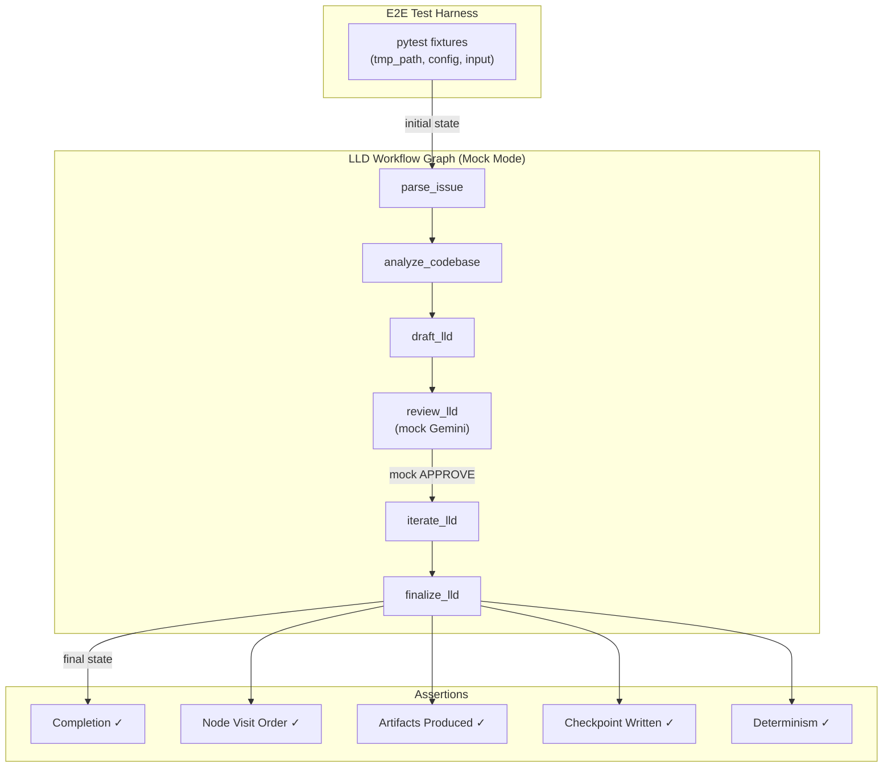

# 438 - Feature: Automated E2E Test for LLD Workflow (Mock Mode)

<!-- Template Metadata
Last Updated: 2026-02-26
Updated By: Issue #438 LLD creation
Update Reason: Initial LLD draft for automated E2E test covering LLD workflow mock mode path
-->

## 1. Context & Goal
* **Issue:** #438
* **Objective:** Create an automated E2E test that exercises the full LangGraph execution path of the LLD (requirements) workflow in `--mock --auto` mode, verifiable in CI.
* **Status:** Draft
* **Related Issues:** None

### Open Questions

- [ ] Does the existing `tests/e2e/` directory have a `conftest.py` with shared E2E fixtures, or do we need to create one?
- [ ] What is the exact CLI entrypoint for `--mock --auto` mode — is it `assemblyzero.workflow` module or a specific script?

## 2. Proposed Changes

*This section is the **source of truth** for implementation. Describe exactly what will be built.*

### 2.1 Files Changed

| File | Change Type | Description |
|------|-------------|-------------|
| `tests/e2e/test_lld_workflow_mock.py` | Add | E2E test module exercising full LLD workflow in mock mode |
| `tests/e2e/__init__.py` | Add | Package init for e2e test directory (if not present) |
| `tests/e2e/conftest.py` | Add | Shared fixtures for E2E tests (temp dirs, mock config, cleanup) |
| `tests/fixtures/lld_tracking/mock_lld_input.md` | Add | Minimal valid LLD input fixture for the requirements workflow |
| `tests/conftest.py` | Modify | Register `e2e` marker if not already registered; add shared mock-mode helpers |

### 2.1.1 Path Validation (Mechanical - Auto-Checked)

Mechanical validation automatically checks:
- All "Modify" files must exist in repository — `tests/conftest.py` ✅ exists
- All "Add" files must have existing parent directories — `tests/e2e/` ✅ exists, `tests/fixtures/lld_tracking/` ✅ exists
- No placeholder prefixes

**If validation fails, the LLD is BLOCKED before reaching review.**

### 2.2 Dependencies

```toml
# No new dependencies required.
# All testing dependencies already present:
# pytest, pytest-cov (dev group)
# langgraph, langgraph-checkpoint-sqlite (main)
```

The test relies entirely on existing project dependencies. Mock mode is an existing feature that replaces LLM calls with deterministic stub responses.

### 2.3 Data Structures

```python
# Pseudocode - NOT implementation

class LLDWorkflowE2EResult(TypedDict):
    """Captures the observable outputs of a mock-mode LLD workflow run."""
    final_state: dict          # Terminal LangGraph state
    nodes_visited: list[str]   # Ordered list of graph nodes executed
    exit_status: str           # "success" | "error" | "timeout"
    artifacts: dict[str, str]  # File paths produced (LLD doc, review, etc.)
    duration_seconds: float    # Wall-clock execution time
```

### 2.4 Function Signatures

```python
# tests/e2e/conftest.py

@pytest.fixture
def mock_workspace(tmp_path: Path) -> Path:
    """Create an isolated temporary workspace with required directory structure."""
    ...

@pytest.fixture
def mock_workflow_config(mock_workspace: Path) -> dict:
    """Return workflow configuration dict with mock=True, auto=True, workspace=tmp_path."""
    ...

@pytest.fixture
def lld_input_fixture() -> str:
    """Load the mock LLD input content from fixtures."""
    ...


# tests/e2e/test_lld_workflow_mock.py

def test_lld_workflow_mock_completes_successfully(
    mock_workspace: Path,
    mock_workflow_config: dict,
    lld_input_fixture: str,
) -> None:
    """E2E: LLD workflow runs to completion in mock mode without errors."""
    ...

def test_lld_workflow_mock_visits_all_nodes(
    mock_workspace: Path,
    mock_workflow_config: dict,
    lld_input_fixture: str,
) -> None:
    """E2E: All expected LangGraph nodes are visited during mock execution."""
    ...

def test_lld_workflow_mock_produces_artifacts(
    mock_workspace: Path,
    mock_workflow_config: dict,
    lld_input_fixture: str,
) -> None:
    """E2E: Workflow produces expected output artifacts (LLD doc, review verdict)."""
    ...

def test_lld_workflow_mock_state_transitions(
    mock_workspace: Path,
    mock_workflow_config: dict,
    lld_input_fixture: str,
) -> None:
    """E2E: State machine transitions follow expected graph edges."""
    ...

def test_lld_workflow_mock_idempotent_rerun(
    mock_workspace: Path,
    mock_workflow_config: dict,
    lld_input_fixture: str,
) -> None:
    """E2E: Running the same workflow twice in mock mode produces consistent results."""
    ...

def test_lld_workflow_mock_checkpoint_created(
    mock_workspace: Path,
    mock_workflow_config: dict,
    lld_input_fixture: str,
) -> None:
    """E2E: SQLite checkpoint is written during workflow execution."""
    ...
```

### 2.5 Logic Flow (Pseudocode)

```
1. Setup phase (pytest fixtures):
   a. Create temp workspace directory with required subdirectories
   b. Load mock LLD input from fixtures/lld_tracking/mock_lld_input.md
   c. Configure workflow with mock=True, auto=True (no human gates)
   d. Initialize SQLite checkpoint saver in temp directory

2. Execution phase (per test):
   a. Import the requirements workflow graph builder
   b. Build the LangGraph StateGraph with mock configuration
   c. Compile graph with SqliteSaver checkpointer
   d. Create initial state with LLD input content + issue metadata
   e. Invoke graph.astream() or graph.invoke() with initial state
   f. Capture final state, node visit order, and any artifacts

3. Assertion phase (per test):
   a. test_completes_successfully:
      - Assert no exceptions raised
      - Assert final state contains expected terminal fields
      - Assert exit status is "success"
   b. test_visits_all_nodes:
      - Assert node list contains all expected nodes from requirements workflow
      - Assert nodes visited in valid topological order
   c. test_produces_artifacts:
      - Assert LLD output content is non-empty
      - Assert review verdict is present (mock returns deterministic verdict)
   d. test_state_transitions:
      - Assert state evolves correctly through each node
      - Assert no unexpected state mutations
   e. test_idempotent_rerun:
      - Run workflow twice with identical input
      - Assert both produce same final state (determinism in mock mode)
   f. test_checkpoint_created:
      - Assert SQLite checkpoint DB file exists
      - Assert at least one checkpoint record was written

4. Teardown phase (pytest fixtures):
   a. Remove temp workspace (automatic via tmp_path)
   b. Close SQLite connections
```

### 2.6 Technical Approach

* **Module:** `tests/e2e/test_lld_workflow_mock.py`
* **Pattern:** Fixture-based E2E testing with LangGraph programmatic invocation
* **Key Decisions:**
  - **Programmatic invocation, not subprocess:** Import and invoke the workflow graph directly in Python rather than shelling out to CLI. This gives us access to LangGraph state for assertions, is faster, and avoids subprocess timeout fragility.
  - **Mock mode, not monkeypatching:** Use the workflow's built-in `--mock` flag which replaces LLM providers with deterministic stubs. This tests the real graph topology and node wiring without requiring API credentials.
  - **`tmp_path` isolation:** Each test gets a fresh temporary workspace, preventing cross-test contamination and ensuring CI cleanliness.
  - **`e2e` marker:** Tests are marked `@pytest.mark.e2e` so they are excluded from the default `pytest` invocation (per `pyproject.toml` addopts) and must be explicitly selected with `-m e2e`.

### 2.7 Architecture Decisions

| Decision | Options Considered | Choice | Rationale |
|----------|-------------------|--------|-----------|
| Invocation method | Subprocess CLI / Programmatic graph invoke | Programmatic | Direct state inspection, faster execution, no timeout fragility |
| Mock strategy | Built-in `--mock` flag / pytest monkeypatch / VCR cassettes | Built-in `--mock` | Tests real graph wiring; mock flag already exists and is production-tested |
| Test granularity | One mega-test / Multiple focused tests | Multiple focused | Each test validates one concern; easier to debug failures |
| Checkpoint backend | In-memory / SQLite (tmp) | SQLite (tmp) | Matches production behavior; validates checkpoint integration |
| CI integration | Separate workflow / Existing CI with marker | Existing CI with marker | Simpler; `pytest -m e2e` added as a CI step |

**Architectural Constraints:**
- Must not require any API credentials or network access
- Must complete within 60 seconds (CI budget)
- Must be fully deterministic (no flaky assertions on timing or random data)
- Must not modify any files outside `tmp_path`

## 3. Requirements

1. **E2E test exercises full LangGraph execution path** — all nodes in the requirements/LLD workflow graph are traversed during mock-mode execution
2. **Tests run without API credentials** — mock mode provides deterministic stub responses for all LLM invocations
3. **Tests are CI-compatible** — marked with `@pytest.mark.e2e`, runnable via `pytest -m e2e`, complete in < 60s
4. **Tests validate graph topology** — node visit order, state transitions, and checkpoint creation are all asserted
5. **Tests validate artifacts** — workflow produces expected output documents (LLD content, review verdict)
6. **Tests are deterministic** — identical inputs produce identical outputs across runs
7. **Tests are isolated** — each test uses its own `tmp_path`, no shared mutable state

## 4. Alternatives Considered

| Option | Pros | Cons | Decision |
|--------|------|------|----------|
| **A: Programmatic graph invocation with built-in mock** | Direct state access; fast; tests real wiring; no credentials needed | Tightly coupled to internal API surface | **Selected** |
| **B: Subprocess CLI invocation** | Tests exact user experience; black-box | No state inspection; slower; timeout-sensitive; harder assertions | Rejected |
| **C: Full integration with mocked HTTP** | Tests provider layer too | Over-tests; brittle cassettes; more maintenance | Rejected |
| **D: Snapshot testing (record/replay)** | Easy to create | Fragile to any code change; masks regressions | Rejected |

**Rationale:** Option A provides the best balance of coverage, speed, and maintainability. It tests the actual LangGraph state machine (the critical path) while using the project's existing mock infrastructure to eliminate external dependencies. Subprocess-based testing (B) was rejected because it sacrifices state visibility — we can't assert on intermediate node states or graph edges traversed, which is the core value of this test.

## 5. Data & Fixtures

### 5.1 Data Sources

| Attribute | Value |
|-----------|-------|
| Source | Handcrafted test fixture (static markdown) |
| Format | Markdown (LLD document) + JSON (workflow config) |
| Size | ~2KB fixture file |
| Refresh | Manual (update when workflow input schema changes) |
| Copyright/License | N/A — project-internal test data |

### 5.2 Data Pipeline

```
tests/fixtures/lld_tracking/mock_lld_input.md ──pytest fixture──► Workflow initial state ──graph.invoke()──► Final state + artifacts
```

### 5.3 Test Fixtures

| Fixture | Source | Notes |
|---------|--------|-------|
| `mock_lld_input.md` | Handcrafted | Minimal valid LLD with all required sections; static |
| `mock_workspace` (pytest) | `tmp_path` auto-generated | Ephemeral; contains `docs/lld/active/`, `data/`, etc. |
| `mock_workflow_config` (pytest) | Generated in conftest | Dict with `mock=True`, `auto=True`, `review="none"` |

### 5.4 Deployment Pipeline

Test fixtures are committed to `tests/fixtures/lld_tracking/` and deployed via git alongside test code. No external data fetch required.

## 6. Diagram

### 6.1 Mermaid Quality Gate

- [x] **Simplicity:** Collapsed into high-level flow
- [x] **No touching:** All elements have visual separation
- [x] **No hidden lines:** All arrows fully visible
- [x] **Readable:** Labels not truncated, flow direction clear
- [ ] **Auto-inspected:** Agent rendered via mermaid.ink and viewed

**Auto-Inspection Results:**
```
- Touching elements: [x] None
- Hidden lines: [x] None
- Label readability: [x] Pass
- Flow clarity: [x] Clear
```

### 6.2 Diagram



## 7. Security & Safety Considerations

### 7.1 Security

| Concern | Mitigation | Status |
|---------|------------|--------|
| Test accidentally calls real APIs | Mock mode replaces all providers; test config sets `mock=True`; no API keys in test env | Addressed |
| Test fixture contains sensitive data | Fixture is handcrafted with synthetic data only; no PII, no secrets | Addressed |
| SQLite checkpoint contains sensitive state | Checkpoint created in `tmp_path`, auto-deleted after test | Addressed |

### 7.2 Safety

| Concern | Mitigation | Status |
|---------|------------|--------|
| Test modifies files outside tmp_path | All file operations scoped to `tmp_path`; workspace fixture enforces isolation | Addressed |
| Test hangs indefinitely | pytest timeout marker (`@pytest.mark.timeout(60)`) ensures CI doesn't stall | Addressed |
| Stale checkpoint DB locks | `tmp_path` cleanup handles removal; explicit `close()` in fixture teardown | Addressed |

**Fail Mode:** Fail Closed — if mock mode is misconfigured and a real API call is attempted, it will fail with missing credentials rather than succeeding silently.

**Recovery Strategy:** Test failures are self-contained. Re-run with `pytest -m e2e -v` for verbose output. No persistent state to clean up.

## 8. Performance & Cost Considerations

### 8.1 Performance

| Metric | Budget | Approach |
|--------|--------|----------|
| Total E2E suite time | < 60s | Mock mode eliminates network latency; programmatic invocation avoids subprocess overhead |
| Per-test time | < 10s | Each test invokes one graph run with deterministic mock responses |
| Memory | < 256MB | SQLite checkpoint in tmp; small fixture data |
| API Calls | 0 | Mock mode — no external calls |

**Bottlenecks:** LangGraph compilation has a small fixed overhead (~1-2s). Amortized across tests with session-scoped graph fixture if needed.

### 8.2 Cost Analysis

| Resource | Unit Cost | Estimated Usage | Monthly Cost |
|----------|-----------|-----------------|--------------|
| CI minutes | $0 (GitHub Actions free tier) | ~1 min per run, ~30 runs/month | $0 |
| LLM API calls | N/A | 0 (mock mode) | $0 |

**Cost Controls:**
- [x] Mock mode ensures zero API spend
- [x] `e2e` marker prevents accidental inclusion in fast test suite

**Worst-Case Scenario:** Even if run 1000x/month, cost is $0 (no external calls, minimal CI time).

## 9. Legal & Compliance

| Concern | Applies? | Mitigation |
|---------|----------|------------|
| PII/Personal Data | No | Test fixtures use synthetic data only |
| Third-Party Licenses | No | No new dependencies introduced |
| Terms of Service | N/A | No external API calls in mock mode |
| Data Retention | N/A | All test data is ephemeral (tmp_path) |
| Export Controls | N/A | No restricted algorithms or data |

**Data Classification:** Internal (test code and fixtures)

**Compliance Checklist:**
- [x] No PII stored without consent
- [x] All third-party licenses compatible with project license
- [x] External API usage compliant with provider ToS (N/A — no external calls)
- [x] Data retention policy documented (ephemeral — auto-deleted)

## 10. Verification & Testing

### 10.0 Test Plan (TDD - Complete Before Implementation)

**TDD Requirement:** Tests MUST be written and failing BEFORE implementation begins.

| Test ID | Test Description | Expected Behavior | Status |
|---------|------------------|-------------------|--------|
| T010 | LLD workflow completes in mock mode | Graph executes all nodes, returns terminal state with no exceptions | RED |
| T020 | All expected nodes are visited | Node visit list contains all workflow nodes in valid order | RED |
| T030 | Workflow produces output artifacts | Final state contains non-empty LLD content and review verdict | RED |
| T040 | State transitions are valid | Each node mutates only expected state fields | RED |
| T050 | Workflow is deterministic in mock mode | Two identical runs produce identical final states | RED |
| T060 | SQLite checkpoint is created | Checkpoint DB file exists and contains at least one record | RED |

**Coverage Target:** ≥95% for the test module itself; this E2E test provides integration coverage for the requirements workflow graph, not line coverage.

**TDD Checklist:**
- [ ] All tests written before implementation
- [ ] Tests currently RED (failing)
- [ ] Test IDs match scenario IDs in 10.1
- [ ] Test file created at: `tests/e2e/test_lld_workflow_mock.py`

### 10.1 Test Scenarios

| ID | Scenario | Type | Input | Expected Output | Pass Criteria |
|----|----------|------|-------|-----------------|---------------|
| 010 | Happy path: full workflow completion | Auto | Mock LLD input + mock config | Terminal state with `exit_status="success"` | No exceptions; all nodes executed |
| 020 | Node visit coverage | Auto | Mock LLD input + mock config | Ordered list of node names | All expected nodes present; valid topological order |
| 030 | Artifact production | Auto | Mock LLD input + mock config | Final state with LLD content + review verdict | Non-empty strings for both fields |
| 040 | State transition integrity | Auto | Mock LLD input + mock config | State dict evolves through nodes | Only expected keys mutated per node |
| 050 | Deterministic rerun | Auto | Same input, two runs | Two identical final states | `final_state_1 == final_state_2` |
| 060 | Checkpoint persistence | Auto | Mock LLD input + mock config | SQLite DB file with checkpoint data | File exists; SELECT returns ≥1 row |

### 10.2 Test Commands

```bash
# Run E2E tests only
poetry run pytest tests/e2e/test_lld_workflow_mock.py -v -m e2e

# Run with coverage reporting
poetry run pytest tests/e2e/test_lld_workflow_mock.py -v -m e2e --cov=assemblyzero.workflows.requirements

# Run all E2E tests in the suite
poetry run pytest -m e2e -v
```

### 10.3 Manual Tests (Only If Unavoidable)

N/A - All scenarios automated.

## 11. Risks & Mitigations

| Risk | Impact | Likelihood | Mitigation |
|------|--------|------------|------------|
| Mock mode doesn't fully exercise graph edges (skips conditional branches) | Med | Med | Inspect graph definition to ensure mock responses trigger all reachable paths; add variant test for BLOCK verdict path |
| Internal API changes break test without warning | Med | Med | Pin test to stable graph builder API; use integration-style assertions (behavior, not implementation details) |
| LangGraph version upgrade changes invocation API | High | Low | Tests import from `assemblyzero.workflows`, not `langgraph` directly; version pinned in pyproject.toml |
| Test becomes flaky due to timing-dependent state | Med | Low | No timing assertions; all checks are on deterministic state values |
| CI environment lacks required system dependencies | Low | Low | Test uses only Python stdlib + existing project deps; no OS-level requirements |

## 12. Definition of Done

### Code
- [ ] `tests/e2e/test_lld_workflow_mock.py` implemented with all 6 test scenarios
- [ ] `tests/e2e/conftest.py` with shared fixtures (mock_workspace, mock_workflow_config, lld_input_fixture)
- [ ] `tests/e2e/__init__.py` exists
- [ ] `tests/fixtures/lld_tracking/mock_lld_input.md` created with minimal valid LLD content
- [ ] `tests/conftest.py` updated if needed for `e2e` marker registration
- [ ] All tests pass with `poetry run pytest -m e2e -v`

### Tests
- [ ] All 6 test scenarios pass (T010–T060)
- [ ] Tests complete in < 60 seconds total
- [ ] Tests are fully deterministic (pass 10 consecutive runs)
- [ ] Zero API credentials required

### Documentation
- [ ] LLD updated with any deviations
- [ ] Implementation Report (0103) completed
- [ ] Test Report (0113) completed

### Review
- [ ] Code review completed
- [ ] User approval before closing issue

### 12.1 Traceability (Mechanical - Auto-Checked)

| Section 12 Reference | Section 2.1 File |
|---|---|
| `tests/e2e/test_lld_workflow_mock.py` | ✅ Listed as Add |
| `tests/e2e/conftest.py` | ✅ Listed as Add |
| `tests/e2e/__init__.py` | ✅ Listed as Add |
| `tests/fixtures/lld_tracking/mock_lld_input.md` | ✅ Listed as Add |
| `tests/conftest.py` | ✅ Listed as Modify |

**If files are missing from Section 2.1, the LLD is BLOCKED.**

---

## Appendix: Review Log

### Review Summary

| Review | Date | Verdict | Key Issue |
|--------|------|---------|-----------|
| — | — | — | Awaiting first review |

**Final Status:** PENDING