# 443 - Test: Add Unit Tests for Circuit Breaker Module

<!-- Template Metadata
Last Updated: 2026-02-25
Updated By: Issue #443
Update Reason: Revision to fix mechanical test plan validation — map all 5 requirements to test scenarios via (REQ-N) suffixes
-->

## 1. Context & Goal
* **Issue:** #443
* **Objective:** Add comprehensive unit tests for `assemblyzero/workflows/testing/circuit_breaker.py` to replace smoke-test-only coverage with proper assertion-based unit tests.
* **Status:** Draft
* **Related Issues:** None

### Open Questions

*None — scope is well-defined. This is a pure test-gap issue with no behavioral changes to the source module.*

## 2. Proposed Changes

*This section is the **source of truth** for implementation. Describe exactly what will be built.*

### 2.1 Files Changed

| File | Change Type | Description |
|------|-------------|-------------|
| `tests/unit/test_circuit_breaker.py` | Add | New unit test file covering all public functions and edge cases |

### 2.1.1 Path Validation (Mechanical - Auto-Checked)

- `tests/unit/` directory exists ✅
- `assemblyzero/workflows/testing/circuit_breaker.py` exists (source under test) ✅
- No new directories required

**If validation fails, the LLD is BLOCKED before reaching review.**

### 2.2 Dependencies

*No new dependencies. Tests use only pytest (already in dev dependencies) and standard library.*

```toml
# No pyproject.toml additions required
```

### 2.3 Data Structures

```python
# Pseudocode — test state fixtures used across tests
# These mirror the TDD workflow's TDDState TypedDict

minimal_state: dict = {
    "budget_dollars": float,       # Total budget allocated
    "spent_dollars": float,        # Amount spent so far
    "iteration": int,              # Current iteration number
    "max_iterations": int,         # Maximum allowed iterations
    "llm_calls": int,              # Number of LLM calls made
    "test_runs": int,              # Number of test executions
}
```

### 2.4 Function Signatures

```python
# ── Fixtures ──

@pytest.fixture
def empty_state() -> dict:
    """State with all zero/default values."""
    ...

@pytest.fixture
def mid_budget_state() -> dict:
    """State at ~50% budget consumption."""
    ...

@pytest.fixture
def near_limit_state() -> dict:
    """State approaching circuit breaker trip threshold."""
    ...

@pytest.fixture
def over_budget_state() -> dict:
    """State that has exceeded the budget."""
    ...


# ── estimate_iteration_cost tests (REQ-1) ──

def test_estimate_iteration_cost_empty_state(empty_state: dict) -> None:
    """Estimate returns a non-negative float for empty/default state."""
    ...

def test_estimate_iteration_cost_mid_budget(mid_budget_state: dict) -> None:
    """Estimate reflects accumulated state (calls, runs)."""
    ...

def test_estimate_iteration_cost_returns_float() -> None:
    """Return type is always float."""
    ...

def test_estimate_iteration_cost_scales_with_activity() -> None:
    """Higher activity state produces higher or equal cost estimate."""
    ...


# ── check_circuit_breaker tests (REQ-1) ──

def test_check_circuit_breaker_no_trip_fresh_state(empty_state: dict) -> None:
    """Fresh state should not trip the breaker."""
    ...

def test_check_circuit_breaker_no_trip_within_budget(mid_budget_state: dict) -> None:
    """State within budget does not trip."""
    ...

def test_check_circuit_breaker_trips_over_budget(over_budget_state: dict) -> None:
    """State exceeding budget trips the breaker."""
    ...

def test_check_circuit_breaker_trips_max_iterations() -> None:
    """Reaching max_iterations trips the breaker regardless of budget."""
    ...

def test_check_circuit_breaker_return_structure() -> None:
    """Return value includes trip boolean and reason string."""
    ...


# ── record_iteration_cost tests (REQ-1) ──

def test_record_iteration_cost_accumulates(empty_state: dict) -> None:
    """Recording a cost increases spent_dollars."""
    ...

def test_record_iteration_cost_multiple_calls(empty_state: dict) -> None:
    """Multiple recordings accumulate correctly."""
    ...

def test_record_iteration_cost_zero_amount(empty_state: dict) -> None:
    """Recording zero cost does not change spent_dollars."""
    ...

def test_record_iteration_cost_preserves_other_fields(mid_budget_state: dict) -> None:
    """Recording cost only mutates cost-related fields."""
    ...


# ── budget_summary tests (REQ-1) ──

def test_budget_summary_returns_string(empty_state: dict) -> None:
    """Summary is always a non-empty string."""
    ...

def test_budget_summary_contains_budget_info(mid_budget_state: dict) -> None:
    """Summary includes spent and remaining amounts."""
    ...

def test_budget_summary_zero_budget() -> None:
    """Summary handles zero-budget state without error."""
    ...

def test_budget_summary_huge_budget() -> None:
    """Summary handles very large budget values without formatting errors."""
    ...


# ── Edge case tests (REQ-2) ──

def test_zero_budget_immediate_trip() -> None:
    """Zero budget_dollars causes immediate circuit breaker trip."""
    ...

def test_huge_budget_no_trip() -> None:
    """Very large budget_dollars does not trip with normal activity."""
    ...

def test_negative_spent_does_not_crash() -> None:
    """Negative spent_dollars (data anomaly) does not raise."""
    ...

def test_empty_dict_state_handling() -> None:
    """Completely empty dict handled gracefully (KeyError or defaults)."""
    ...


# ── CI compatibility tests (REQ-3) ──

def test_no_external_imports_required() -> None:
    """Verify circuit_breaker module imports without network or external services."""
    ...

def test_all_tests_run_offline() -> None:
    """Verify test suite completes without network calls (no mocks of HTTP)."""
    ...


# ── Coverage verification (REQ-4) ──

def test_all_public_functions_exercised() -> None:
    """Verify every public function in circuit_breaker is called at least once across the suite."""
    ...


# ── Regression guard (REQ-5) ──

def test_existing_unit_suite_unaffected() -> None:
    """Verify new test file does not break existing tests (import isolation)."""
    ...
```

### 2.5 Logic Flow (Pseudocode)

```
Test file structure:

1. Import circuit_breaker functions
2. Define fixtures (empty, mid-budget, near-limit, over-budget states)
3. Test group: estimate_iteration_cost (REQ-1)
   - Verify return type (float)
   - Verify non-negative
   - Verify monotonic scaling with activity
4. Test group: check_circuit_breaker (REQ-1)
   - Verify no-trip for safe states
   - Verify trip for over-budget states
   - Verify trip for max-iteration states
   - Verify return structure (bool + reason)
5. Test group: record_iteration_cost (REQ-1)
   - Verify accumulation arithmetic
   - Verify idempotency of zero-cost recording
   - Verify field isolation (no side effects on unrelated fields)
6. Test group: budget_summary (REQ-1)
   - Verify string output
   - Verify content accuracy
   - Verify edge formatting (zero, huge values)
7. Test group: edge cases (REQ-2)
   - Zero budget, huge budget, empty state, negative values
8. Test group: CI compatibility (REQ-3)
   - No external imports, no network calls
9. Test group: coverage completeness (REQ-4)
   - All public functions exercised
10. Test group: regression guard (REQ-5)
    - Import isolation, no side effects on existing suite
```

### 2.6 Technical Approach

* **Module:** `tests/unit/test_circuit_breaker.py`
* **Pattern:** Arrange-Act-Assert with pytest fixtures for state construction
* **Key Decisions:**
  - Pure unit tests — no mocks of external services needed (circuit breaker is pure computation)
  - Parametrize where multiple inputs share the same assertion pattern
  - Test the public API surface only; internal helpers are covered transitively

### 2.7 Architecture Decisions

| Decision | Options Considered | Choice | Rationale |
|----------|-------------------|--------|-----------|
| Test isolation | Shared module-level state vs per-test fixtures | Per-test fixtures | Prevents test coupling; each test gets a clean state dict |
| Edge case strategy | Boundary-only vs property-based (Hypothesis) | Boundary-only | Keeps dependencies minimal; circuit breaker logic is simple enough for explicit cases |
| Assertion style | Plain assert vs pytest helpers | Plain assert + `pytest.approx` for floats | Standard pytest idiom; `approx` avoids floating-point false negatives |

**Architectural Constraints:**
- Must not import or call any LLM providers (tests must run offline)
- Must not modify the source module — test-only change

## 3. Requirements

1. All four public functions (`estimate_iteration_cost`, `check_circuit_breaker`, `record_iteration_cost`, `budget_summary`) have dedicated test coverage.
2. Edge cases (zero budget, huge budget, empty state) are explicitly tested.
3. Tests run in CI without external dependencies (`-m "not integration and not e2e"`).
4. Coverage of `circuit_breaker.py` reaches ≥95% line coverage.
5. All tests pass on current `main` without source changes.

## 4. Alternatives Considered

| Option | Pros | Cons | Decision |
|--------|------|------|----------|
| Unit tests with pytest fixtures (explicit states) | Clear, readable, fast, no external deps | More boilerplate for state construction | **Selected** |
| Property-based testing with Hypothesis | Discovers unexpected edge cases automatically | Adds dependency; overkill for simple arithmetic module | Rejected |
| Integration tests calling full TDD workflow | Tests circuit breaker in real context | Slow, requires LLM mocks, already covered by smoke tests | Rejected |

**Rationale:** The circuit breaker module is pure computation over dict state. Explicit unit tests with handcrafted fixtures give maximum clarity and speed. Property-based testing can be added later if the module grows.

## 5. Data & Fixtures

### 5.1 Data Sources

| Attribute | Value |
|-----------|-------|
| Source | Handcrafted test dictionaries mimicking `TDDState` |
| Format | Python `dict` |
| Size | < 10 fields per fixture |
| Refresh | Static (test code) |
| Copyright/License | N/A — original test data |

### 5.2 Data Pipeline

```
Fixture function ──returns──► dict state ──passed to──► circuit_breaker function ──returns──► assertion target
```

### 5.3 Test Fixtures

| Fixture | Source | Notes |
|---------|--------|-------|
| `empty_state` | Hardcoded | All zeros / defaults — baseline |
| `mid_budget_state` | Hardcoded | ~50% spent, several iterations — happy path |
| `near_limit_state` | Hardcoded | 90%+ spent — boundary |
| `over_budget_state` | Hardcoded | Spent exceeds budget — trip condition |

### 5.4 Deployment Pipeline

N/A — test-only change. No data deployment.

## 6. Diagram

### 6.1 Mermaid Quality Gate

- [x] **Simplicity:** Minimal nodes, one flow
- [x] **No touching:** All elements separated
- [x] **No hidden lines:** All arrows visible
- [x] **Readable:** Labels concise
- [ ] **Auto-inspected:** Deferred (test-only LLD, diagram is illustrative)

**Auto-Inspection Results:**
```
- Touching elements: [x] None
- Hidden lines: [x] None
- Label readability: [x] Pass
- Flow clarity: [x] Clear
```

### 6.2 Diagram

```mermaid
flowchart LR
    subgraph Fixtures["Test Fixtures"]
        F1["empty_state"]
        F2["mid_budget_state"]
        F3["near_limit_state"]
        F4["over_budget_state"]
    end

    subgraph SUT["System Under Test"]
        A["estimate_iteration_cost()"]
        B["check_circuit_breaker()"]
        C["record_iteration_cost()"]
        D["budget_summary()"]
    end

    subgraph Assertions["Assertions"]
        X["Type checks"]
        Y["Value checks"]
        Z["Structure checks"]
    end

    Fixtures --> SUT
    SUT --> Assertions
```



## 7. Security & Safety Considerations

### 7.1 Security

| Concern | Mitigation | Status |
|---------|------------|--------|
| No security surface | Test-only change; no new endpoints, no user input handling | N/A |

### 7.2 Safety

| Concern | Mitigation | Status |
|---------|------------|--------|
| Tests accidentally mutate shared state | Each test gets its own fixture via `@pytest.fixture` (function scope) | Addressed |
| Flaky tests from floating-point comparison | Use `pytest.approx()` for all float assertions | Addressed |

**Fail Mode:** N/A — tests either pass or fail deterministically.

**Recovery Strategy:** N/A — no side effects to recover from.

## 8. Performance & Cost Considerations

### 8.1 Performance

| Metric | Budget | Approach |
|--------|--------|----------|
| Test suite runtime | < 2 seconds total | Pure computation, no I/O, no mocks |
| CI impact | Negligible | ~25 fast unit tests added |

**Bottlenecks:** None. Circuit breaker functions are pure dict→value computations.

### 8.2 Cost Analysis

| Resource | Unit Cost | Estimated Usage | Monthly Cost |
|----------|-----------|-----------------|--------------|
| CI compute | ~$0 (GitHub Actions free tier) | +2s per CI run | $0 |

**Cost Controls:** N/A — zero marginal cost.

**Worst-Case Scenario:** N/A.

## 9. Legal & Compliance

| Concern | Applies? | Mitigation |
|---------|----------|------------|
| PII/Personal Data | No | Tests use synthetic numeric data only |
| Third-Party Licenses | No | No new dependencies |
| Terms of Service | No | No external API calls |
| Data Retention | No | No persistent data |
| Export Controls | No | No restricted algorithms |

**Data Classification:** Public (test code)

**Compliance Checklist:**
- [x] No PII stored without consent
- [x] All third-party licenses compatible with project license
- [x] External API usage compliant with provider ToS
- [x] Data retention policy documented

## 10. Verification & Testing

### 10.0 Test Plan (TDD - Complete Before Implementation)

**TDD Requirement:** Tests MUST be written and failing BEFORE implementation begins. In this case, the "implementation" IS the tests — so the TDD cycle is: write test → verify it passes against existing source.

| Test ID | Test Description | Expected Behavior | Status |
|---------|------------------|-------------------|--------|
| T010 | `test_estimate_iteration_cost_empty_state` | Returns non-negative float for zero state | RED |
| T020 | `test_estimate_iteration_cost_mid_budget` | Returns cost reflecting accumulated activity | RED |
| T030 | `test_estimate_iteration_cost_returns_float` | Return type is `float` | RED |
| T040 | `test_estimate_iteration_cost_scales_with_activity` | Higher activity ≥ lower activity estimate | RED |
| T050 | `test_check_circuit_breaker_no_trip_fresh_state` | Returns no-trip for empty state | RED |
| T060 | `test_check_circuit_breaker_no_trip_within_budget` | Returns no-trip for mid-budget state | RED |
| T070 | `test_check_circuit_breaker_trips_over_budget` | Returns trip for over-budget state | RED |
| T080 | `test_check_circuit_breaker_trips_max_iterations` | Returns trip at max iterations | RED |
| T090 | `test_check_circuit_breaker_return_structure` | Return includes trip bool and reason | RED |
| T100 | `test_record_iteration_cost_accumulates` | spent_dollars increases by recorded amount | RED |
| T110 | `test_record_iteration_cost_multiple_calls` | Multiple recordings sum correctly | RED |
| T120 | `test_record_iteration_cost_zero_amount` | Zero recording leaves spent unchanged | RED |
| T130 | `test_record_iteration_cost_preserves_other_fields` | Non-cost fields unchanged after recording | RED |
| T140 | `test_budget_summary_returns_string` | Returns non-empty `str` | RED |
| T150 | `test_budget_summary_contains_budget_info` | String includes spent and remaining | RED |
| T160 | `test_budget_summary_zero_budget` | Handles zero budget without error | RED |
| T170 | `test_budget_summary_huge_budget` | Handles 1e12 budget without formatting error | RED |
| T180 | `test_zero_budget_immediate_trip` | Zero budget causes trip | RED |
| T190 | `test_huge_budget_no_trip` | Large budget does not trip with normal activity | RED |
| T200 | `test_negative_spent_does_not_crash` | Negative spent handled gracefully | RED |
| T210 | `test_empty_dict_state_handling` | Empty dict does not raise unhandled exception | RED |
| T220 | `test_no_external_imports_required` | Module imports without network or external services | RED |
| T230 | `test_all_tests_run_offline` | Suite completes without network calls | RED |
| T240 | `test_all_public_functions_exercised` | Every public function called at least once | RED |
| T250 | `test_existing_unit_suite_unaffected` | New tests do not break existing test imports | RED |

**Coverage Target:** ≥95% line coverage on `assemblyzero/workflows/testing/circuit_breaker.py`

**TDD Checklist:**
- [ ] All tests written before implementation
- [ ] Tests currently RED (failing)
- [ ] Test IDs match scenario IDs in 10.1
- [ ] Test file created at: `tests/unit/test_circuit_breaker.py`

### 10.1 Test Scenarios

| ID | Scenario | Type | Input | Expected Output | Pass Criteria |
|----|----------|------|-------|-----------------|---------------|
| 010 | Estimate cost on empty state (REQ-1) | Auto | `empty_state` fixture | `float >= 0.0` | Type is float, value ≥ 0 |
| 020 | Estimate cost on active state (REQ-1) | Auto | `mid_budget_state` fixture | `float > 0.0` | Positive float reflecting activity |
| 030 | Estimate return type (REQ-1) | Auto | Arbitrary valid state | `float` | `isinstance(result, float)` |
| 040 | Estimate scales with activity (REQ-1) | Auto | Low-activity vs high-activity state | `high >= low` | Monotonic relationship |
| 050 | No trip on fresh state (REQ-1) | Auto | `empty_state` fixture | No trip | `tripped is False` |
| 060 | No trip within budget (REQ-1) | Auto | `mid_budget_state` fixture | No trip | `tripped is False` |
| 070 | Trip on over-budget (REQ-1) | Auto | `over_budget_state` fixture | Trip | `tripped is True` |
| 080 | Trip on max iterations (REQ-1) | Auto | State at `iteration == max_iterations` | Trip | `tripped is True` |
| 090 | Return structure of check (REQ-1) | Auto | Any valid state | `(bool, str)` or dict with trip + reason | Structural assertion |
| 100 | Cost accumulation (REQ-1) | Auto | `empty_state` + record $1.50 | `spent_dollars == 1.50` | Exact match via `approx` |
| 110 | Multiple cost recordings (REQ-1) | Auto | Record $1.00 three times | `spent_dollars == 3.00` | Sum matches via `approx` |
| 120 | Zero-cost recording (REQ-1) | Auto | Record $0.00 | `spent_dollars` unchanged | Before == after |
| 130 | Field preservation (REQ-1) | Auto | Record cost, check non-cost fields | All other fields identical | Dict comparison minus cost fields |
| 140 | Summary is string (REQ-1) | Auto | `empty_state` | Non-empty `str` | `isinstance` + `len > 0` |
| 150 | Summary content accuracy (REQ-1) | Auto | `mid_budget_state` with known values | Contains spent/remaining amounts | Substring or regex match |
| 160 | Summary with zero budget (REQ-1) | Auto | State with `budget_dollars=0` | Valid string, no exception | No raise, returns str |
| 170 | Summary with huge budget (REQ-1) | Auto | State with `budget_dollars=1e12` | Valid string, no exception | No raise, returns str |
| 180 | Zero budget → immediate trip (REQ-2) | Auto | `budget_dollars=0, spent_dollars=0` | Trip | `tripped is True` |
| 190 | Huge budget → no trip (REQ-2) | Auto | `budget_dollars=1e9, iteration=1` | No trip | `tripped is False` |
| 200 | Negative spent anomaly (REQ-2) | Auto | `spent_dollars=-5.0` | No unhandled exception | No raise |
| 210 | Empty dict state (REQ-2) | Auto | `{}` | Graceful handling (default or KeyError caught) | No unhandled crash |
| 220 | Module imports without external services (REQ-3) | Auto | `import circuit_breaker` in isolated context | Import succeeds, no network call | No `socket` or HTTP activity |
| 230 | Full suite runs offline (REQ-3) | Auto | Run all tests with no network | All tests pass | Exit code 0, no connection errors |
| 240 | All public functions exercised (REQ-4) | Auto | Inspect module, cross-check with test calls | Every public function has ≥1 test | `inspect.getmembers` coverage check |
| 250 | New tests do not break existing suite (REQ-5) | Auto | Import `test_circuit_breaker` alongside existing tests | No import conflicts or side effects | Existing tests still pass |

### 10.2 Test Commands

```bash
# Run circuit breaker unit tests
poetry run pytest tests/unit/test_circuit_breaker.py -v

# Run with coverage for circuit_breaker module
poetry run pytest tests/unit/test_circuit_breaker.py -v --cov=assemblyzero/workflows/testing/circuit_breaker --cov-report=term-missing

# Run all unit tests (verify no regressions — REQ-5)
poetry run pytest tests/unit/ -v

# Verify CI marker compatibility (REQ-3)
poetry run pytest tests/unit/test_circuit_breaker.py -v -m "not integration and not e2e"
```

### 10.3 Manual Tests (Only If Unavoidable)

N/A — All scenarios automated.

## 11. Risks & Mitigations

| Risk | Impact | Likelihood | Mitigation |
|------|--------|------------|------------|
| Source module API differs from assumptions in this LLD | Med | Low | Inspect actual signatures before writing tests; adapt fixture shapes accordingly |
| Circuit breaker uses internal state not exposed via public API | Low | Low | Test observable behavior only; internal state covered transitively |
| Floating-point precision causes flaky assertions | Low | Med | Use `pytest.approx()` for all float comparisons |
| Empty-dict edge case raises unexpected error revealing a real bug | Med | Low | This is a feature — test catches a real issue; file separate bug fix issue |

## 12. Definition of Done

### Code
- [ ] `tests/unit/test_circuit_breaker.py` implemented with all 25 test cases
- [ ] Code comments reference this LLD (#443)

### Tests
- [ ] All 25 test scenarios pass (`poetry run pytest tests/unit/test_circuit_breaker.py -v`)
- [ ] Coverage of `circuit_breaker.py` ≥ 95%
- [ ] No regressions in existing test suite (`poetry run pytest tests/unit/ -v`)

### Documentation
- [ ] LLD updated with any deviations discovered during implementation
- [ ] Implementation Report (0103) completed
- [ ] Test Report (0113) completed

### Review
- [ ] Code review completed
- [ ] User approval before closing issue

### 12.1 Traceability (Mechanical - Auto-Checked)

| Section 12 Reference | Section 2.1 Entry |
|-----------------------|-------------------|
| `tests/unit/test_circuit_breaker.py` | Add — New unit test file |

**All files in Definition of Done appear in Section 2.1.** ✅

---

## Appendix: Review Log

*No reviews yet.*

### Review Summary

| Review | Date | Verdict | Key Issue |
|--------|------|---------|-----------|
| — | — | — | — |

**Final Status:** PENDING