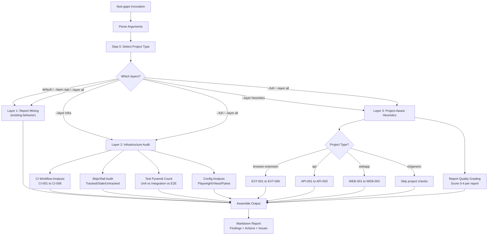

# 444 - Feature: Enhance /test-gaps with Infrastructure Audit and Project-Aware Heuristics

<!-- Template Metadata
Last Updated: 2026-02-17
Updated By: Issue #444 revision 1
Update Reason: Fixed REQ-8 test coverage gap; reformatted Section 3 as numbered list; added (REQ-N) suffixes to Section 10.1 scenarios
-->

## 1. Context & Goal
* **Issue:** #444
* **Objective:** Enhance the `/test-gaps` Claude skill from single-layer report keyword grep to comprehensive three-layer test health analysis (report mining + infrastructure audit + project-aware heuristics) while preserving full backward compatibility.
* **Status:** Approved (gemini-3-pro-preview, 2026-02-24)
* **Related Issues:** None (standalone skill enhancement)

### Open Questions

- [ ] Should Layer 2 skip/xfail audit attempt GitHub API calls to check issue open/closed status, or rely on comment-based heuristics only? (Recommendation: comment-based only to avoid API dependency in a skill definition)
- [ ] What is the maximum file count threshold before Layer 3 heuristic file-pairing checks become too expensive? (Recommendation: cap at 200 source files, warn if exceeded)

## 2. Proposed Changes

*This section is the **source of truth** for implementation. Describes exactly what will be built.*

### 2.1 Files Changed

| File | Change Type | Description |
|------|-------------|-------------|
| `.claude/commands/test-gaps.md` | Modify | Expand from ~150 lines to ~400-450 lines; restructure into 3 layers with argument parsing, project detection, and structured output |

### 2.1.1 Path Validation (Mechanical - Auto-Checked)

- `.claude/commands/test-gaps.md` — **Modify**: File exists in repository (standard Claude skill location)

No new directories required. No new files added. This is a single-file modification to an existing skill definition.

### 2.2 Dependencies

```toml
# No pyproject.toml additions — this is a Claude skill definition file (markdown prompt),
# not executable Python code. All analysis uses Claude's built-in Grep, Read, and Glob tools.
```

### 2.3 Data Structures

This feature modifies a Claude skill prompt (markdown), not Python source. However, the skill instructs Claude to produce structured output. The conceptual data structures Claude will reason about are documented below as pseudocode for clarity:

```python
# Pseudocode — NOT implementation. These are the conceptual structures
# the skill prompt instructs Claude to build internally during analysis.

class ProjectType(Enum):
    BROWSER_EXTENSION = "browser-extension"
    WEBAPP = "webapp"
    API = "api"
    CLI = "cli"
    GENERIC = "generic"

class Finding(TypedDict):
    check_id: str          # e.g., "CI-001", "EXT-003", "API-002"
    file: str              # File path where finding was detected
    line: Optional[int]    # Line number if applicable
    finding: str           # Human-readable description
    severity: str          # "CRITICAL" | "HIGH" | "MEDIUM" | "LOW"
    issue_ref: Optional[str]  # Linked GitHub issue if applicable

class SkipEntry(TypedDict):
    file_line: str         # "tests/unit/test_foo.py:42"
    skip_type: str         # "Tracked" | "Stale" | "Untracked" | "Conditional"
    reason: str            # The skip reason string
    issue: Optional[str]   # Issue reference (e.g., "#448")
    status: str            # "Open" | "Closed" | "None"

class TestPyramid(TypedDict):
    unit_count: int
    integration_count: int
    e2e_count: int
    inverted: bool         # True if e2e > unit

class ReportQuality(TypedDict):
    report_path: str
    score: int             # 0-4
    missing_sections: list[str]  # e.g., ["What was NOT tested", "Evidence"]

class TestGapsOutput(TypedDict):
    scan_type: str         # "Quick" | "Full" | layer name
    project_type: str      # Detected or overridden ProjectType value
    date: str              # YYYY-MM-DD
    layer1_findings: list[Finding]       # Report mining (existing)
    layer2_findings: list[Finding]       # Infrastructure audit
    layer2_skips: list[SkipEntry]        # Skip/xfail audit
    layer2_pyramid: TestPyramid          # Test pyramid counts
    layer3_findings: list[Finding]       # Project-aware heuristics
    layer3_report_quality: list[ReportQuality]  # Report grading
    recommended_actions: list[Finding]   # Sorted by severity
    issues_to_create: list[Finding]      # HIGH+ findings as checklist items
```

### 2.4 Function Signatures

Since this is a Claude skill prompt (not Python), there are no literal function signatures. Instead, the skill prompt defines **analysis phases** that Claude executes sequentially. Each phase is documented here as a pseudo-function for traceability:

```python
# Phase 0: Project Type Detection
def detect_project_type(override: Optional[str] = None) -> ProjectType:
    """Glob for marker files to auto-detect project type.
    
    Checks in order: browser-extension, webapp, api, cli, generic (fallback).
    If --project-type is provided and is not 'auto', use override directly.
    """
    ...

# Phase 1: Argument Parsing  
def parse_arguments(raw_args: str) -> dict:
    """Parse skill arguments: --full, --file, --layer, --project-type.
    
    Returns dict with keys: full (bool), file (Optional[str]),
    layer (Optional[str]), project_type (str).
    Default (no args) = Layer 1 only.
    """
    ...

# Phase 2: Layer 1 — Report Mining (existing behavior, wrapped)
def layer1_report_mining(file_filter: Optional[str] = None) -> list[Finding]:
    """Existing test-gaps behavior preserved verbatim.
    
    Grep reports/ and docs/reports/ for gap keywords.
    8 gap categories, cross-reference logic, output tables.
    No behavioral changes — only wrapped under Layer 1 heading.
    """
    ...

# Phase 3: Layer 2 — Infrastructure Audit
def layer2_ci_workflow_analysis() -> list[Finding]:
    """Read .github/workflows/*.yml and check CI-001 through CI-006."""
    ...

def layer2_skip_xfail_audit() -> list[SkipEntry]:
    """Grep test files for skip/xfail patterns across JS/TS/Python.
    
    Classify each as Tracked/Stale/Untracked/Conditional.
    """
    ...

def layer2_test_pyramid() -> TestPyramid:
    """Count test functions across unit/integration/e2e directories.
    
    Flag if e2e_count > unit_count (inverted pyramid).
    """
    ...

def layer2_config_analysis() -> list[Finding]:
    """Read playwright/vitest/pytest configs.
    
    Compare configured browser projects vs CI browser installs.
    """
    ...

# Phase 4: Layer 3 — Project-Aware Heuristics
def layer3_browser_extension_checks() -> list[Finding]:
    """EXT-001 through EXT-006: extension-specific test gap analysis."""
    ...

def layer3_api_checks() -> list[Finding]:
    """API-001 through API-003: API/Lambda-specific test gap analysis."""
    ...

def layer3_webapp_checks() -> list[Finding]:
    """WEB-001 through WEB-003: webapp-specific test gap analysis."""
    ...

def layer3_report_quality_grading() -> list[ReportQuality]:
    """Grade test reports against ADR 0205 sections. Score 0-4."""
    ...

# Phase 5: Output Assembly
def assemble_output(
    scan_type: str,
    project_type: ProjectType,
    layer1: list[Finding],
    layer2_findings: list[Finding],
    layer2_skips: list[SkipEntry],
    layer2_pyramid: TestPyramid,
    layer3: list[Finding],
    layer3_quality: list[ReportQuality],
) -> str:
    """Assemble final markdown output with all layer sections.
    
    Sort recommended actions by severity: CRITICAL > HIGH > MEDIUM > LOW.
    Generate 'Issues to Create' checklist from HIGH+ findings.
    Output contains: header, per-layer sections, recommended actions table,
    and issues-to-create checkbox list.
    """
    ...
```

### 2.5 Logic Flow (Pseudocode)

```
1. Parse arguments from user invocation
   - Extract --full, --file, --layer, --project-type
   - Default (no args) → layers = ["reports"]
   - --full → layers = ["reports", "infra", "heuristics"]
   - --layer X → layers = [X]  (or ["reports", "infra", "heuristics"] if X == "all")

2. Run Step 0: Project Type Detection
   - IF --project-type is not "auto" THEN use override
   - ELSE Glob for marker files in priority order:
     a. Glob "extensions/*/manifest.json" OR "manifest.json" → Read for manifest_version → browser-extension
     b. Glob "vite.config.*", "next.config.*" → webapp
     c. Glob "**/lambda_function.py", "serverless.yml" → api  
     d. Read pyproject.toml for argparse/click/typer → cli
     e. Fallback → generic

3. IF "reports" in layers THEN
   - Execute Layer 1 (existing behavior verbatim)
   - Collect findings into layer1_findings

4. IF "infra" in layers THEN
   - 4a. CI Workflow Analysis
     - Glob ".github/workflows/*.yml"
     - FOR EACH workflow file:
       - Read file content
       - Grep for "continue-on-error: true" → CI-001
       - Check for absence of test collection validation → CI-002
       - Grep for "fail_ci_if_error: false" → CI-003
       - Check coverage upload without threshold → CI-004
       - Compare browser list in CI vs playwright config → CI-005
       - Grep "continue-on-error" lines, check for issue ref in adjacent comment → CI-006
   
   - 4b. Skip/Xfail Audit
     - Grep test files for skip patterns:
       - JS/TS: test\.skip|describe\.skip|it\.skip|\.only
       - Python: pytest\.mark\.skip|pytest\.skip|xfail|unittest\.skip
     - FOR EACH match:
       - Read surrounding context (5 lines)
       - IF contains "#NNN" pattern → check if comment says "closed" or "resolved"
         - Has issue ref, appears open → Tracked (MEDIUM)
         - Has issue ref, appears closed → Stale (HIGH)
       - ELIF contains "skipif" or "skipIf" → Conditional (LOW)
       - ELSE → Untracked (HIGH)
   
   - 4c. Test Pyramid Count
     - Grep count "def test_|test\(|it\(|describe\(" in:
       - tests/unit/ (or __tests__/unit/, src/**/*.test.*)
       - tests/integration/ (or __tests__/integration/)
       - tests/e2e/ (or __tests__/e2e/, e2e/)
     - Calculate percentages
     - IF e2e_count > unit_count → flag inverted pyramid (HIGH)
   
   - 4d. Test Config Analysis
     - Read playwright.config.* → extract projects[].name
     - Read vitest.config.* or jest.config.* → extract test settings
     - Read pyproject.toml [tool.pytest] → extract markers/options
     - Compare playwright projects vs CI browser installations

5. IF "heuristics" in layers THEN
   - Match on detected project_type:
   
   - CASE browser-extension:
     - EXT-001: Glob extension JS/TS source files → check for corresponding test file
     - EXT-002: Compare mtime of mock files vs source files (>30 day delta)
     - EXT-003: Count Chrome test files vs Firefox test files
     - EXT-004: Read playwright config projects → verify each has CI job
     - EXT-005: Grep mock files for known non-existent APIs per platform
       (e.g., browser.identity in Firefox MV3 mocks)
     - EXT-006: Glob visual baselines per platform, compare counts
   
   - CASE api:
     - API-001: Glob handler files → check for integration test counterpart
     - API-002: Check for tests/contract/ directory existence
     - API-003: Check CI for post-deploy smoke test step
   
   - CASE webapp:
     - WEB-001: Glob component files → check for test file counterpart
     - WEB-002: Glob for visual regression snapshot directories
     - WEB-003: Grep for pa11y/axe imports in test files
   
   - CASE cli / generic:
     - Skip project-specific checks, note in output
   
   - 5b. Report Quality Grading (all project types):
     - Glob docs/reports/**/test-report*.md
     - FOR EACH report:
       - Grep for "what was tested" or equivalent → +1
       - Grep for "how tested" or "automated|manual" → +1
       - Grep for "not tested" or "gaps|limitations" → +1
       - Grep for "evidence|screenshot|log output" → +1
       - Score 0-4; flag if ≤ 1

6. Assemble Output
   - Header: scan type, project type, date
   - Layer 1 section (if run)
   - Layer 2 section (if run): CI findings table, skip audit table, pyramid chart
   - Layer 3 section (if run): project-specific tables, report quality table
   - Recommended Actions: all findings sorted CRITICAL → HIGH → MEDIUM → LOW
   - Issues to Create: checkbox list from HIGH+ findings with check ID and description
```

### 2.6 Technical Approach

* **Module:** `.claude/commands/test-gaps.md` (Claude skill definition)
* **Pattern:** Layered analysis with progressive disclosure — default invocation returns fast Layer 1 results; `--full` expands to comprehensive 3-layer analysis
* **Key Decisions:**
  - **Single-file change:** The entire feature is a skill prompt expansion, not new Python code. Claude's built-in tools (Grep, Glob, Read) are the execution engine.
  - **Grep-first cost optimization:** Every layer uses Grep to identify candidate files before expensive Read operations, keeping tool call counts bounded.
  - **No GitHub API dependency:** Skip/xfail "stale" detection uses comment heuristics (looking for "closed", "resolved", "fixed" near issue refs) rather than GitHub API calls. This avoids auth requirements and rate limits.
  - **Backward compatibility by wrapping:** Layer 1 is the existing skill text, placed under a `## Layer 1` heading with zero behavioral changes.
  - **Structured output assembly:** The `assemble_output` phase produces a complete markdown document with severity-sorted recommended actions table and an "Issues to Create" checkbox list filtering only HIGH+ findings, ensuring actionable output.

### 2.7 Architecture Decisions

| Decision | Options Considered | Choice | Rationale |
|----------|-------------------|--------|-----------|
| Skill vs Python module | A) Expand skill prompt, B) New Python analyzer tool | A) Expand skill prompt | Skill definitions require zero deployment, run in any Claude session, and align with existing `/test-gaps` pattern. Python would require package install, import management, and CI changes. |
| Issue status detection | A) GitHub API calls, B) Comment heuristics, C) Skip entirely | B) Comment heuristics | API calls add auth dependency, rate limit risk, and cost. Heuristics (grep for "closed"/"resolved" near `#NNN`) are imperfect but zero-cost and sufficient for advisory-level analysis. |
| Project type detection | A) Config-file marker globs, B) LLM semantic analysis, C) User-required flag | A) Config-file marker globs | Deterministic, fast (1-5 Glob calls), no LLM tokens consumed. User override via `--project-type` handles edge cases. |
| Layer selection UX | A) Numeric flags (--layer 2), B) Named flags (--layer infra), C) Separate commands | B) Named flags | More readable than numbers; single command is simpler than multiple skill files. `--full` shorthand covers the common "run everything" case. |
| Mock fidelity detection (EXT-005) | A) Hardcoded API blocklist, B) Dynamic manifest parsing, C) Skip | A) Hardcoded blocklist in prompt | Small, curated list of known problematic APIs (e.g., `browser.identity` in Firefox MV3) embedded in the skill prompt. Dynamic parsing would require maintaining a full WebExtension API database. |
| Output format structure | A) Flat findings list, B) Layered sections with summary tables, C) JSON output | B) Layered sections with summary tables | Layered markdown with per-section tables, a severity-sorted recommended actions table, and a checkbox "Issues to Create" list provides both detail and actionability. Human readers can scan the summary without reading layer details. |

**Architectural Constraints:**
- Must remain a single `.claude/commands/test-gaps.md` file (no external dependencies)
- Must use only Claude's built-in tools: Grep, Glob, Read, Bash (no MCP servers)
- Must preserve byte-identical Layer 1 behavior for `--layer reports` and bare `/test-gaps` invocations
- Total tool calls for `--full` must stay under 50 (cost ceiling ~$0.15)

## 3. Requirements

1. Running `/test-gaps` with no arguments MUST produce output identical in structure and content to the current skill behavior (Layer 1 only).
2. `--layer infra` MUST detect `continue-on-error: true` on test jobs, missing test collection validation, coverage upload without thresholds, and browser parity gaps in CI workflows.
3. The skill MUST identify and classify all `skip`, `xfail`, and `.only` markers in test files as Tracked/Stale/Untracked/Conditional with severity ratings.
4. The skill MUST count test functions per directory tier (unit/integration/e2e) and flag inverted pyramids where e2e > unit.
5. The skill MUST auto-detect project type from marker files with support for browser-extension, webapp, api, cli, and generic fallback.
6. The skill MUST run project-type-specific checks (EXT-001 through EXT-006 for extensions, API-001 through API-003 for APIs, WEB-001 through WEB-003 for webapps).
7. The skill MUST grade test reports on a 0-4 scale based on presence of key sections (what tested, how tested, what NOT tested, evidence).
8. The skill MUST produce structured markdown output with severity-sorted recommended actions and an "Issues to Create" checklist for HIGH+ findings.
9. Default invocation MUST stay within 8-15 tool calls (~$0.03). Full scan MUST stay within 30-50 tool calls (~$0.15).
10. The skill MUST support `--full`, `--file path`, `--layer reports|infra|heuristics|all`, and `--project-type auto|extension|api|webapp|cli` arguments.

## 4. Alternatives Considered

| Option | Pros | Cons | Decision |
|--------|------|------|----------|
| A) Expand existing skill prompt (single file) | Zero deployment cost; works immediately in any Claude session; preserves existing UX; no dependency changes | Single file grows to ~450 lines; harder to unit-test the prompt itself; Claude must follow complex multi-branch instructions | **Selected** |
| B) Python CLI tool (`tools/test-gap-analyzer.py`) | Testable with pytest; deterministic execution; can be version-pinned | Requires `poetry run` invocation; needs its own test suite; duplicates Grep/Glob logic that Claude already has; deployment friction | Rejected |
| C) Three separate skill files (`test-gaps-reports.md`, `test-gaps-infra.md`, `test-gaps-heuristics.md`) | Smaller files; clear separation of concerns | Fragments the UX; user must know which to invoke; no `--full` composition; harder to produce unified output | Rejected |
| D) MCP server with structured tool calls | Type-safe; composable; reusable across skills | Massive overengineering for an analysis skill; requires MCP setup; maintenance burden; no existing MCP infrastructure in project | Rejected |

**Rationale:** Option A was selected because skill prompts are the established pattern in this project, the feature is fundamentally about *instructing Claude how to analyze*, and the zero-deployment characteristic means any agent in any worktree gets the capability immediately upon merge. The ~450-line prompt size is within Claude's demonstrated ability to follow complex multi-step instructions.

## 5. Data & Fixtures

### 5.1 Data Sources

| Attribute | Value |
|-----------|-------|
| Source | Local repository files (CI workflows, test files, configs, reports) |
| Format | YAML (.github/workflows/*.yml), Markdown (docs/reports/), JSON (manifest.json, package.json), TOML (pyproject.toml), JS/TS/Python (test files, config files) |
| Size | Varies per repository. Typical: 5-20 workflow files, 50-500 test files, 10-50 reports |
| Refresh | On-demand per skill invocation (reads current workspace state) |
| Copyright/License | N/A — reads user's own repository files |

### 5.2 Data Pipeline

```
Repository Files ──Glob──► Candidate File List ──Grep──► Pattern Matches ──Read (selective)──► Findings ──Assemble──► Markdown Output
```

**Key optimization:** Glob identifies candidate files → Grep narrows to relevant lines → Read is used only when context is needed (e.g., reading 5 lines around a skip marker to check for issue references). This 3-stage pipeline minimizes expensive Read calls.

### 5.3 Test Fixtures

| Fixture | Source | Notes |
|---------|--------|-------|
| N/A — no test fixtures | N/A | This is a skill prompt modification. Verification is done by running the skill against real repositories (Aletheia, Hermes, AssemblyZero). See Section 10. |

### 5.4 Deployment Pipeline

- **Dev:** Edit `.claude/commands/test-gaps.md` in worktree branch
- **Test:** Run `/test-gaps`, `/test-gaps --layer infra`, `/test-gaps --full` in the worktree against the current repo
- **Production:** Merge PR to main. Skill is immediately available in all sessions.

No build step, no compilation, no package publishing.

## 6. Diagram

### 6.1 Mermaid Quality Gate

- [x] **Simplicity:** Collapsed individual checks into layer groupings
- [x] **No touching:** All elements have visual separation
- [x] **No hidden lines:** All arrows fully visible
- [x] **Readable:** Labels not truncated, flow direction clear
- [ ] **Auto-inspected:** Will inspect at implementation time

**Auto-Inspection Results:**
```
- Touching elements: [ ] None / [ ] Found: ___
- Hidden lines: [ ] None / [ ] Found: ___
- Label readability: [ ] Pass / [ ] Issue: ___
- Flow clarity: [ ] Clear / [ ] Issue: ___
```

### 6.2 Diagram



## 7. Security & Safety Considerations

### 7.1 Security

| Concern | Mitigation | Status |
|---------|------------|--------|
| Skill reads arbitrary file paths via `--file` argument | The `--file` argument is passed to Claude's built-in Glob/Read tools which are already sandboxed to the workspace. No path traversal risk beyond Claude's existing security model. | Addressed |
| Workflow YAML parsing could encounter malicious content | Skill only uses Grep/Read (string matching), never executes YAML content. No `eval()` or dynamic execution of file contents. | Addressed |
| Skip audit could expose sensitive test comments | All output is local to the Claude session. No data leaves the user's machine. | Addressed |

### 7.2 Safety

| Concern | Mitigation | Status |
|---------|------------|--------|
| Excessive tool calls on large repos | Grep-first pipeline limits Read calls. Max tool call budget documented per mode (15/50). Skill prompt includes "stop if exceeding 50 tool calls" instruction. | Addressed |
| False positives cause unnecessary issue creation | Output is advisory ("Issues to Create" is a checklist, not automated). Human reviews before acting. Severity ratings help triage. | Addressed |
| Incorrect project type detection | User can override with `--project-type`. Auto-detection uses conservative marker files. Generic fallback ensures no crashes. | Addressed |
| Stale skip classification wrong (issue open but detected as closed) | Documented as heuristic, not definitive. Skill output includes "Status" column so user can verify. No automated actions taken. | Addressed |

**Fail Mode:** Fail Open — if any layer encounters errors (e.g., no workflow files found, no test directories), it reports "No findings" for that section rather than failing the entire analysis. Each layer is independent.

**Recovery Strategy:** If a layer produces garbled output, user can re-run with `--layer X` to isolate. No persistent state is modified by this skill.

## 8. Performance & Cost Considerations

### 8.1 Performance

| Metric | Budget | Approach |
|--------|--------|----------|
| Tool calls (default) | 8-15 | Layer 1 only: existing grep patterns |
| Tool calls (--layer infra) | 8-13 | Glob workflows → Grep patterns → selective Read |
| Tool calls (--full) | 30-50 | All layers with Grep pre-filtering |
| Wall-clock time (--full) | < 60 seconds | Parallel-capable grep operations; no network calls |

**Bottlenecks:** 
- Large monorepos with 500+ test files may push Layer 2 skip audit toward 20+ Grep calls. Mitigated by combining skip patterns into single regex per language.
- Layer 3 EXT-001 file-pairing check requires Glob of source files AND Glob of test files. For repos with 200+ extension source files, this could be expensive. Skill includes instruction to sample (report count) rather than enumerate all if file count exceeds 200.

### 8.2 Cost Analysis

| Resource | Unit Cost | Estimated Usage | Per-Invocation Cost |
|----------|-----------|-----------------|---------------------|
| Claude tool calls (Grep) | ~$0.001-0.002 per call | 5-30 per invocation | $0.005-$0.06 |
| Claude tool calls (Read) | ~$0.002-0.005 per call | 3-15 per invocation | $0.006-$0.075 |
| Claude tool calls (Glob) | ~$0.001 per call | 2-8 per invocation | $0.002-$0.008 |
| Claude reasoning tokens | Included in session | Minimal incremental | ~$0.01-0.02 |

**Summary by mode:**

| Mode | Est. Total Cost |
|------|-----------------|
| Quick (default) | ~$0.03 |
| `--layer infra` | ~$0.05 |
| `--layer heuristics` | ~$0.05 |
| `--full` | ~$0.15 |

**Cost Controls:**
- [x] Default invocation runs Layer 1 only (cheapest)
- [x] Grep pre-filtering before Read calls
- [x] Skill prompt includes explicit tool call budget instruction
- [x] `--layer` flag allows targeted analysis instead of full scan

**Worst-Case Scenario:** Very large repo with 50+ workflow files, 1000+ test files, 100+ reports. Could reach 80-100 tool calls (~$0.30). Mitigated by sampling instructions in the skill prompt ("if more than N files match, sample the first N and note truncation").

## 9. Legal & Compliance

| Concern | Applies? | Mitigation |
|---------|----------|------------|
| PII/Personal Data | No | Skill reads code and config files only; no user data processed |
| Third-Party Licenses | No | No new dependencies added |
| Terms of Service | No | Uses only Claude's built-in tools within normal usage |
| Data Retention | No | Output is ephemeral within Claude session |
| Export Controls | No | No restricted algorithms |

**Data Classification:** Internal (repository source code analysis)

**Compliance Checklist:**
- [x] No PII stored without consent
- [x] All third-party licenses compatible with project license
- [x] External API usage compliant with provider ToS
- [x] Data retention policy documented (none — ephemeral)

## 10. Verification & Testing

**Testing Philosophy:** Since this is a Claude skill prompt (not executable code), traditional unit testing does not apply. Verification is performed by executing the skill against real and representative repositories and validating the output structure and findings.

### 10.0 Test Plan (Skill Verification)

**Note:** Skill prompts cannot be TDD'd in the traditional sense. Instead, we define acceptance test scenarios that are executed manually by running the skill.

| Test ID | Test Description | Expected Behavior | Status |
|---------|------------------|-------------------|--------|
| T010 | Default invocation backward compat | Layer 1 output identical in structure to pre-change behavior | RED |
| T020 | `--layer infra` against AssemblyZero | Detects CI workflow patterns, counts test pyramid | RED |
| T030 | `--layer heuristics` with auto-detection | Correctly identifies project type, runs matching checks | RED |
| T040 | `--full` produces all 3 layers | Output contains Layer 1, 2, and 3 headings with findings | RED |
| T050 | `--project-type` override | Overrides auto-detection, runs specified project checks | RED |
| T060 | Unknown arguments | Graceful handling, defaults to Layer 1 | RED |
| T070 | Empty repo (no workflows, no tests) | Reports "no findings" per layer, no errors | RED |
| T080 | Cost ceiling | `--full` stays within 50 tool calls | RED |
| T090 | Output structure validation | Recommended Actions sorted by severity; Issues to Create checklist present for HIGH+ findings | RED |

**Coverage Target:** All 9 acceptance scenarios pass. All check IDs (CI-001 through CI-006, EXT-001 through EXT-006, API-001 through API-003, WEB-001 through WEB-003) are exercisable.

### 10.1 Test Scenarios

| ID | Scenario | Type | Input | Expected Output | Pass Criteria |
|----|----------|------|-------|-----------------|---------------|
| 010 | Backward compatibility — default invocation produces Layer 1 only (REQ-1) | Manual | `/test-gaps` (no args) | Layer 1 report mining output | Output structure matches current skill output exactly |
| 020 | Layer 2 CI analysis detects workflow issues (REQ-2) | Manual | `/test-gaps --layer infra` against repo with `continue-on-error: true` in workflows | CI-001 finding with HIGH severity | Finding table includes CI-001 row with correct file and severity |
| 030 | Layer 2 skip audit classifies skip markers (REQ-3) | Manual | `/test-gaps --layer infra` against repo with `test.skip` and `pytest.mark.skip` markers | Skip audit table with classified entries | Each skip correctly classified as Tracked/Stale/Untracked/Conditional |
| 040 | Layer 2 test pyramid counts and flags inversion (REQ-4) | Manual | `/test-gaps --layer infra` against repo with test directories | Pyramid count with percentages | Counts are non-negative, percentages sum to 100%, inversion flag correct |
| 050 | Layer 3 auto-detects browser-extension project type (REQ-5) | Manual | `/test-gaps --layer heuristics` against repo with manifest.json containing manifest_version | Project type = browser-extension, EXT checks run | Header shows "browser-extension (auto)", extension-specific findings present |
| 060 | Layer 3 runs project-type-specific checks (REQ-6) | Manual | `/test-gaps --layer heuristics --project-type api` | API checks run regardless of marker files | API-001 through API-003 checks appear in output |
| 070 | Layer 3 report quality grading scores reports (REQ-7) | Manual | `/test-gaps --layer heuristics` against repo with test reports | Report quality table with scores 0-4 | Each report scored, reports scoring ≤1 flagged |
| 080 | Full scan output has severity-sorted actions and issues checklist (REQ-8) | Manual | `/test-gaps --full` | All 3 layers in output with Recommended Actions sorted CRITICAL→HIGH→MEDIUM→LOW and Issues to Create checklist | Layer 1, 2, 3 headings present; Recommended Actions table sorted by severity; Issues to Create checklist present with only HIGH+ findings; each checklist item includes check ID |
| 090 | Cost ceiling respected for full scan (REQ-9) | Manual | `/test-gaps --full` against medium-size repo | Analysis completes within tool call budget | Total tool calls ≤ 50; default invocation ≤ 15 tool calls |
| 100 | Argument parsing handles all flags (REQ-10) | Manual | `/test-gaps --full`, `/test-gaps --file tests/unit/test_foo.py`, `/test-gaps --layer infra`, `/test-gaps --project-type api` | Correct layer selection and scoping per argument | `--full` runs all layers; `--file` scopes Layer 1; `--layer` selects specific layer; `--project-type` overrides detection |
| 110 | No workflows exist — graceful empty state (REQ-2) | Manual | `/test-gaps --layer infra` against repo without `.github/workflows/` | Layer 2 CI section says "No CI workflows found" | No errors, graceful empty state |
| 120 | Project type fallback to generic (REQ-5) | Manual | `/test-gaps --layer heuristics` against generic repo (no markers) | Project type = generic, project-specific checks skipped | Header shows "generic (auto)", only report quality grading runs |

### 10.2 Test Commands

```bash
# These are Claude skill invocations, not shell commands.
# Execute within a Claude Code session:

# Scenario 010: Backward compatibility (REQ-1)
/test-gaps

# Scenario 020-040: Layer 2 (REQ-2, REQ-3, REQ-4)
/test-gaps --layer infra

# Scenario 050: Auto-detection (REQ-5)
/test-gaps --layer heuristics

# Scenario 060: Override (REQ-6)
/test-gaps --layer heuristics --project-type api

# Scenario 070: Report quality (REQ-7)
/test-gaps --layer heuristics

# Scenario 080: Full scan output structure (REQ-8)
/test-gaps --full

# Scenario 090: Cost ceiling (REQ-9)
/test-gaps --full

# Scenario 100: Argument parsing (REQ-10)
/test-gaps --file tests/unit/test_audit.py
/test-gaps --layer all
/test-gaps --project-type webapp
```

### 10.3 Manual Tests (Required — Skill Verification)

| ID | Scenario | Why Not Automated | Steps |
|----|----------|-------------------|-------|
| All (010-120) | Skill prompt execution | Claude skill invocations cannot be automated via pytest. The "execution engine" is Claude itself. | 1. Open Claude Code session in target repo. 2. Invoke skill with specified arguments. 3. Verify output structure matches expected format. 4. Verify specific findings match expected check IDs. |

**Justification for manual-only testing:** This feature modifies a Claude skill prompt file (`.claude/commands/test-gaps.md`). The skill is executed by Claude's own runtime, not by Python. There is no programmatic interface to invoke a Claude skill and capture its output for assertion. Verification requires a human (or orchestrating agent) to run the skill and inspect the output.

**Cross-repository verification plan:**
1. **AssemblyZero** (this repo): Verify Layer 2 pyramid count, Layer 3 generic fallback, output structure with recommended actions and issues checklist
2. **Aletheia** (if accessible): Verify Layer 2 detects `continue-on-error: true` in e2e-edge.yml, Layer 3 detects browser-extension type and visual baseline gaps
3. **Hermes** (if accessible): Verify Layer 2 detects missing CI workflows, Layer 3 detects API type

## 11. Risks & Mitigations

| Risk | Impact | Likelihood | Mitigation |
|------|--------|------------|------------|
| Skill prompt exceeds Claude's instruction-following capacity at ~450 lines | High — skill produces incorrect or incomplete output | Low — Claude handles 400+ line system prompts well; layered structure with clear section headers aids comprehension | Structure prompt with explicit section headers, numbered steps, and conditional blocks. Test incrementally during implementation. |
| False positive findings create noise that erodes trust | Medium — user ignores future findings | Medium — heuristic-based detection (especially EXT-005 mock fidelity) can misfire | Include severity ratings; document heuristic limitations in output; "Issues to Create" is advisory, not automated |
| Project type auto-detection misclassifies repo | Low — wrong checks run, right checks don't | Low — marker files are well-established conventions | `--project-type` override available; generic fallback ensures no crashes; detection order is priority-ranked |
| Cost exceeds budget on very large repos | Medium — unexpected charges | Low — Grep pre-filtering bounds file reads | Explicit tool call budget in prompt ("stop at 50"); sampling for large file sets; `--layer` allows targeted analysis |
| Layer 1 behavior accidentally changed during refactoring | High — breaks backward compatibility promise | Medium — wrapping existing text risks accidental edits | Layer 1 section is preserved verbatim with explicit "DO NOT MODIFY" comment in skill prompt; Scenario 010 verifies |
| New check IDs conflict with future standards | Low — cosmetic confusion | Low — namespace is skill-local | Check ID prefixes (CI-, EXT-, API-, WEB-) are distinct from existing standard numbering (0xxx) |
| Output assembly omits required sections | Medium — incomplete actionable output | Low — output template is explicit in prompt | Scenario 080 specifically validates Recommended Actions sorting and Issues to Create checklist presence; `assemble_output` phase has explicit section list |

## 12. Definition of Done

### Code
- [ ] `.claude/commands/test-gaps.md` expanded with all 3 layers
- [ ] Layer 1 section preserved verbatim from current version
- [ ] Argument parsing section handles --full, --file, --layer, --project-type
- [ ] Step 0 project detection covers all 5 types with marker files
- [ ] Layer 2 implements CI-001 through CI-006, skip audit, pyramid count, config analysis
- [ ] Layer 3 implements EXT-001 through EXT-006, API-001 through API-003, WEB-001 through WEB-003, report quality grading
- [ ] Output template includes all sections from issue specification: header, per-layer sections, severity-sorted Recommended Actions, and Issues to Create checklist

### Tests
- [ ] Scenario 010 (backward compat) verified against AssemblyZero
- [ ] Scenario 020-040 (Layer 2) verified — CI findings, skip audit, pyramid
- [ ] Scenario 050-060 (Layer 3) verified — project detection, type-specific checks
- [ ] Scenario 070 (report quality) verified
- [ ] Scenario 080 (full scan output structure) verified — recommended actions sorted by severity, issues checklist present with HIGH+ findings
- [ ] Scenario 090 (cost ceiling) verified — tool call counts within budget
- [ ] Scenario 100 (argument parsing) verified — all flags work correctly
- [ ] Scenario 110-120 (edge cases: no workflows, generic fallback) verified

### Documentation
- [ ] LLD updated with any implementation deviations
- [ ] Implementation Report (0103) completed
- [ ] Test Report (0113) completed with verification results from each scenario

### Review
- [ ] Gemini LLD review completed
- [ ] Code review completed (skill prompt reviewed for correctness and completeness)
- [ ] User approval before closing issue

### 12.1 Traceability (Mechanical - Auto-Checked)

| Section 12 Reference | Section 2.1 File |
|----------------------|------------------|
| `.claude/commands/test-gaps.md` expanded | `.claude/commands/test-gaps.md` (Modify) |

All file references in Definition of Done trace to Section 2.1. ✓

---

## Reviewer Suggestions

*Non-blocking recommendations from the reviewer.*

- **Heuristic Clarity:** Ensure the "Stale" skip detection (Issue closed vs open) output clearly labels it as "Potential" or "Heuristic" so users don't lose trust if the comment parsing is imperfect.
- **Maintainability:** Consider adding a "Developer Comments" block at the top of the prompt explaining the section structure for future maintainers, as 450 lines of Markdown instruction can be difficult to navigate.

## Appendix A: Detailed Skill Prompt Structure

The expanded `.claude/commands/test-gaps.md` will have the following internal structure (section headings within the prompt):

```
# /test-gaps — Test Gap Analysis

## Arguments
[argument parsing instructions]

## Step 0: Project Type Detection
[Glob-based detection logic]

## Layer 1: Report Mining
[EXISTING CONTENT — VERBATIM — DO NOT MODIFY]

## Layer 2: Infrastructure Audit

### 2.1 CI Workflow Analysis
[CI-001 through CI-006 check definitions and Grep patterns]

### 2.2 Skip/Xfail Audit  
[Skip pattern definitions, classification rules]

### 2.3 Test Pyramid Count
[Directory mapping, count logic, inversion detection]

### 2.4 Test Config Analysis
[Config file reading, browser parity comparison]

## Layer 3: Project-Aware Heuristics

### 3.0 Project Type Router
[Conditional execution based on detected type]

### 3.1 Browser Extension Checks (EXT-001 to EXT-006)
[Check definitions, Glob/Grep patterns, known bad API list]

### 3.2 API/Lambda Checks (API-001 to API-003)
[Handler-to-test mapping, contract test directory check]

### 3.3 Web App Checks (WEB-001 to WEB-003)
[Component-to-test mapping, visual/a11y checks]

### 3.4 Report Quality Grading
[Section grep patterns, scoring rules]

## Output Template
[Complete markdown template with all section headings,
 including Recommended Actions table and Issues to Create checklist]

## Cost Guardrails
[Tool call budgets per mode, sampling thresholds]
```

## Appendix B: Check ID Registry

| Check ID | Layer | Severity | Description |
|----------|-------|----------|-------------|
| CI-001 | 2 | HIGH | `continue-on-error: true` on test jobs |
| CI-002 | 2 | HIGH | No test discovery validation |
| CI-003 | 2 | MEDIUM | `fail_ci_if_error: false` on coverage upload |
| CI-004 | 2 | MEDIUM | Coverage upload without threshold enforcement |
| CI-005 | 2 | HIGH | Fewer browsers in CI than in playwright config |
| CI-006 | 2 | HIGH | `continue-on-error` without linked issue reference |
| EXT-001 | 3 | HIGH | Extension JS file without unit test |
| EXT-002 | 3 | MEDIUM | Mock file older than source by >30 days |
| EXT-003 | 3 | HIGH | Chrome/Firefox test file count asymmetry |
| EXT-004 | 3 | HIGH | Playwright project with no CI job |
| EXT-005 | 3 | CRITICAL | Mock references non-existent platform APIs |
| EXT-006 | 3 | MEDIUM | Visual baselines missing for a platform |
| API-001 | 3 | HIGH | Handler file without integration test |
| API-002 | 3 | MEDIUM | No contract tests directory |
| API-003 | 3 | MEDIUM | No post-deploy smoke test in CI |
| WEB-001 | 3 | HIGH | Component without test file |
| WEB-002 | 3 | MEDIUM | No visual regression snapshots |
| WEB-003 | 3 | HIGH | No accessibility tests |

## Appendix C: Known Bad API List (EXT-005)

Embedded in the skill prompt for mock fidelity detection:

| API | Platform Where It Doesn't Exist | Notes |
|-----|--------------------------------|-------|
| `browser.identity` | Firefox MV3 | Chrome-only; Firefox uses different auth flow |
| `chrome.identity.getAuthToken` | Firefox | Chrome-specific; no Firefox equivalent |
| `browser.action.getUserSettings` | Firefox < 118 | Added late; check manifest minimum version |
| `chrome.sidePanel` | Firefox | Chrome 114+; no Firefox equivalent |
| `chrome.offscreen` | Firefox | Chrome 109+; no Firefox equivalent |

This list should be updated as new cross-browser API gaps are discovered.

## Appendix D: Output Template Specification

The `assemble_output` phase (Section 2.4, Phase 5) produces the following markdown structure. This appendix provides the complete template to ensure REQ-8 compliance:

```markdown
# Test Gap Analysis

**Scan type:** {Quick|Full|layer-name} | **Project type:** {type} ({auto|override}) | **Date:** YYYY-MM-DD

## Layer 1: Report Mining
{Layer 1 findings tables — existing format preserved}

## Layer 2: Infrastructure Audit

### CI Workflow Findings
| Check | File | Finding | Severity | Issue Ref |
|-------|------|---------|----------|-----------|

### Skip/Xfail Audit
| File:Line | Type | Reason | Issue | Status |
|-----------|------|--------|-------|--------|

### Test Pyramid
{bar chart + inversion warning if applicable}

## Layer 3: Project-Aware Heuristics ({project-type})

{Project-type-specific tables}

### Test Report Quality
| Report | Score | Missing Sections |
|--------|-------|------------------|

## Recommended Actions

| # | Severity | Check ID | Finding | File |
|---|----------|----------|---------|------|
| 1 | CRITICAL | {id} | {description} | {file} |
| 2 | HIGH | {id} | {description} | {file} |
| ... | ... | ... | ... | ... |

_Sorted: CRITICAL → HIGH → MEDIUM → LOW_

## Issues to Create

- [ ] `test: {description}` — {Check ID} ({file})
- [ ] `test: {description}` — {Check ID} ({file})

_Only HIGH and CRITICAL findings listed. Review before creating._
```

**Sorting rule for Recommended Actions:** CRITICAL first, then HIGH, then MEDIUM, then LOW. Within same severity, order by check ID alphabetically.

**Filtering rule for Issues to Create:** Only findings with severity HIGH or CRITICAL appear. Each item is formatted as a checkbox with conventional commit prefix (`test:`), finding description, check ID, and file path.

---

## Appendix: Review Log

*Track all review feedback with timestamps and implementation status.*

### Review Summary

| Review | Date | Verdict | Key Issue |
|--------|------|---------|-----------|
| 1 | 2026-02-24 | APPROVED | `gemini-3-pro-preview` |
| Mechanical Validation #1 | 2026-02-17 | FEEDBACK | REQ-8 missing test coverage |

### Mechanical Validation #1 (FEEDBACK)

**Reviewer:** Automated Test Plan Validator
**Verdict:** FEEDBACK

#### Comments

| ID | Comment | Implemented? |
|----|---------|--------------|
| MV1.1 | "Requirement REQ-8 has no test coverage" — REQ-8 (output format with severity-sorted actions and issues checklist) was not explicitly mapped to any test scenario | YES - Added Scenario 080 with explicit (REQ-8) suffix and detailed pass criteria for severity sorting and issues checklist; added T090 to test plan; added Appendix D with output template specification |

**Final Status:** APPROVED