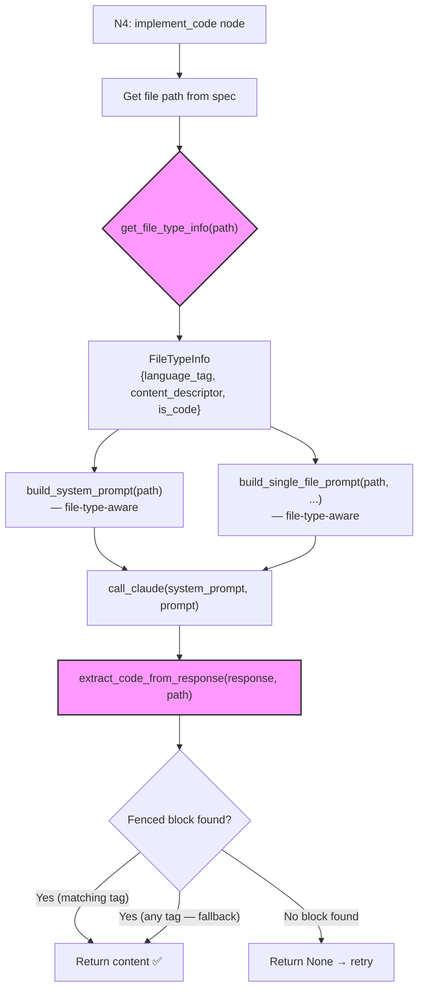

# 447 - Bug: TDD Workflow N4 Fails on Non-Python Files (.md Skill Definitions)

<!-- Template Metadata
Last Updated: 2026-02-24
Updated By: Issue #447 LLD revision
Update Reason: Fix mechanical test plan validation — map all 7 requirements to test scenarios, reformat Section 3
-->

## 1. Context & Goal
* **Issue:** #447
* **Objective:** Make the TDD workflow's N4 `implement_code` node file-type-aware so it correctly generates, prompts for, and extracts content for non-Python files (`.md`, `.yaml`, `.toml`, `.json`, etc.)
* **Status:** Draft
* **Related Issues:** #444 (triggered the discovery — `.md` skill definition file)

### Open Questions

*None — root cause is well-understood from issue #444 failure logs.*

## 2. Proposed Changes

*This section is the **source of truth** for implementation. Describes exactly what will be built.*

### 2.1 Files Changed

| File | Change Type | Description |
|------|-------------|-------------|
| `assemblyzero/workflows/testing/nodes/implement_code.py` | Modify | Add file-type detection, adjust prompt construction and code extraction to support non-Python files |
| `assemblyzero/utils/file_type.py` | Add | New utility module: maps file extensions to language tags and content descriptors |
| `tests/unit/test_file_type.py` | Add | Unit tests for file-type utility |
| `tests/unit/test_implement_code_filetype.py` | Add | Unit tests for multi-filetype prompt building and extraction in N4 |

### 2.1.1 Path Validation (Mechanical - Auto-Checked)

*Issue #277: Before human or Gemini review, paths are verified programmatically.*

Mechanical validation automatically checks:
- `assemblyzero/workflows/testing/nodes/implement_code.py` — **Modify** — must exist ✅
- `assemblyzero/utils/file_type.py` — **Add** — parent `assemblyzero/utils/` exists ✅
- `tests/unit/test_file_type.py` — **Add** — parent `tests/unit/` exists ✅
- `tests/unit/test_implement_code_filetype.py` — **Add** — parent `tests/unit/` exists ✅

**If validation fails, the LLD is BLOCKED before reaching review.**

### 2.2 Dependencies

```toml
# No new dependencies required — pure Python file extension mapping
```

### 2.3 Data Structures

```python
# Pseudocode - NOT implementation

class FileTypeInfo(TypedDict):
    language_tag: str       # Fenced code block tag: "python", "markdown", "yaml", "json", "toml", ""
    content_descriptor: str # Human-readable: "Python code", "Markdown content", "YAML configuration", etc.
    is_code: bool           # True for .py/.js/.ts, False for .md/.txt — affects prompt framing

# Extension → FileTypeInfo mapping (canonical)
FILE_TYPE_REGISTRY: dict[str, FileTypeInfo] = {
    ".py":   {"language_tag": "python",   "content_descriptor": "Python code",            "is_code": True},
    ".md":   {"language_tag": "markdown", "content_descriptor": "Markdown content",       "is_code": False},
    ".yaml": {"language_tag": "yaml",     "content_descriptor": "YAML configuration",     "is_code": False},
    ".yml":  {"language_tag": "yaml",     "content_descriptor": "YAML configuration",     "is_code": False},
    ".json": {"language_tag": "json",     "content_descriptor": "JSON data",              "is_code": False},
    ".toml": {"language_tag": "toml",     "content_descriptor": "TOML configuration",     "is_code": False},
    ".sh":   {"language_tag": "bash",     "content_descriptor": "shell script",           "is_code": True},
    ".js":   {"language_tag": "javascript","content_descriptor": "JavaScript code",       "is_code": True},
    ".ts":   {"language_tag": "typescript","content_descriptor": "TypeScript code",       "is_code": True},
    ".txt":  {"language_tag": "",         "content_descriptor": "text content",           "is_code": False},
}
# Default (unknown extensions): language_tag="", content_descriptor="file content", is_code=False
```

### 2.4 Function Signatures

```python
# --- assemblyzero/utils/file_type.py ---

def get_file_type_info(file_path: str) -> FileTypeInfo:
    """Return FileTypeInfo for a given file path based on its extension.
    
    Falls back to a safe default for unknown extensions.
    """
    ...

def get_language_tag(file_path: str) -> str:
    """Return the fenced code block language tag for a file path.
    
    E.g., 'python' for .py, 'markdown' for .md, '' for unknown.
    """
    ...

def get_content_descriptor(file_path: str) -> str:
    """Return a human-readable description of the file content type.
    
    E.g., 'Python code' for .py, 'Markdown content' for .md.
    """
    ...

# --- assemblyzero/workflows/testing/nodes/implement_code.py (modified functions) ---

def build_single_file_prompt(
    file_path: str,
    instructions: str,
    existing_content: str | None,
    # ... existing params ...
) -> str:
    """Build prompt for Claude, using file-type-appropriate language tag and framing.
    
    Now uses get_file_type_info() to determine the correct code block
    language tag and content descriptor instead of hard-coding 'python'.
    """
    ...

def extract_code_from_response(response: str, file_path: str = "") -> str | None:
    """Extract content from fenced code block in Claude's response.
    
    Now accepts any fenced code block language tag, not just 'python'.
    Priority order:
    1. Block matching the file's expected language tag
    2. Any fenced code block (``` with or without tag)
    3. None if no fenced block found
    """
    ...

def build_system_prompt(file_path: str) -> str:
    """Build the system prompt for Claude, file-type-aware.
    
    For .py files: "Output ONLY code in a ```python block"
    For .md files: "Output ONLY the file contents in a ```markdown block"  
    For unknown:   "Output ONLY the file contents in a fenced code block"
    """
    ...
```

### 2.5 Logic Flow (Pseudocode)

```
=== get_file_type_info(file_path) ===
1. Extract extension from file_path (e.g., ".md" from "commands/test-gaps.md")
2. Normalize to lowercase
3. Look up in FILE_TYPE_REGISTRY
4. IF found → return the FileTypeInfo
5. ELSE → return default: {language_tag: "", content_descriptor: "file content", is_code: False}

=== build_single_file_prompt(file_path, instructions, ...) ===
1. info = get_file_type_info(file_path)
2. IF info.is_code:
     - Frame as: "Implement the following {info.content_descriptor}..."
     - Request output as: "```{info.language_tag}" block
   ELSE:
     - Frame as: "Write the following {info.content_descriptor}..."
     - Request output as: "```{info.language_tag}" block (or just "```" if tag is empty)
3. Include existing_content context if modifying (unchanged logic)
4. Return assembled prompt

=== build_system_prompt(file_path) ===
1. info = get_file_type_info(file_path)
2. tag = info.language_tag or "the appropriate language"
3. descriptor = info.content_descriptor
4. Return: "You are a precise file generator. Output ONLY the complete file contents 
           in a ```{tag} fenced block. No explanation, no commentary, 
           just the {descriptor} in a fenced block."

=== extract_code_from_response(response, file_path) ===
1. expected_tag = get_language_tag(file_path) if file_path else None
2. Parse response for ALL fenced code blocks (regex: ```{tag?}\n...\n```)
3. IF expected_tag AND block with matching tag found:
     - Return that block's content
4. ELIF any fenced block found:
     - Return first fenced block's content (fallback)
5. ELSE:
     - Return None (triggers retry in N4)

=== N4 implement_code node (existing orchestration, modified calls) ===
1. For each file in implementation plan:
   a. system_prompt = build_system_prompt(file.path)       # NEW: file-type-aware
   b. prompt = build_single_file_prompt(file.path, ...)    # MODIFIED: file-type-aware
   c. response = call_claude(system_prompt, prompt)
   d. content = extract_code_from_response(response, file.path)  # MODIFIED: file-type-aware
   e. IF content is None → retry (existing logic, up to 3 attempts)
   f. ELSE → write content to file
```

### 2.6 Technical Approach

* **Module:** `assemblyzero/utils/file_type.py` — new utility; `assemblyzero/workflows/testing/nodes/implement_code.py` — modifications
* **Pattern:** Registry/Lookup pattern for file types; Strategy-like prompt selection based on file type
* **Key Decisions:**
  - Centralize file type knowledge in a single utility so other nodes/workflows can reuse it
  - Extraction is lenient: prefer matching tag, fall back to any fenced block — this maximizes success rate
  - `is_code` flag controls prompt framing ("implement" vs "write") but both use fenced blocks

### 2.7 Architecture Decisions

| Decision | Options Considered | Choice | Rationale |
|----------|-------------------|--------|-----------|
| File type detection | A) Extension-based lookup, B) `mimetypes` stdlib, C) Content sniffing | A) Extension-based lookup | Simple, deterministic, no external deps; `mimetypes` returns MIME types we'd have to re-map anyway |
| Registry location | A) Inline dict in implement_code.py, B) Separate utility module, C) Config file | B) Separate utility module | Reusable across workflows; other nodes may need file-type awareness in the future |
| Extraction fallback | A) Strict match only, B) Fallback to any fenced block, C) Fallback to raw response | B) Fallback to any fenced block | Strict match would still fail if Claude uses slightly different tag (e.g., `md` vs `markdown`); raw response fallback risks including commentary |
| Unknown extension handling | A) Raise error, B) Default to Python, C) Default to generic fenced block | C) Default to generic fenced block | Graceful degradation; an error would break the workflow for any new file type not in the registry |

**Architectural Constraints:**
- Must not change behavior for `.py` files — existing Python workflow must work identically
- Must not change the retry logic or number of retries — only the prompt content and extraction logic change
- The `file_path` parameter is already available in the call chain (it's how the file gets written); we just need to thread it through to prompt building and extraction

## 3. Requirements

1. `.py` files produce identical prompts and extraction behavior as before (backward compatibility)
2. `.md` files produce prompts requesting ` ```markdown ` blocks and extraction accepts them
3. `.yaml`/`.yml` files produce prompts requesting ` ```yaml ` blocks
4. Unknown extensions produce prompts requesting generic fenced blocks (` ``` `)
5. `extract_code_from_response()` falls back to any fenced block if the expected language tag doesn't match
6. No new dependencies introduced
7. All existing tests continue to pass unchanged

## 4. Alternatives Considered

| Option | Pros | Cons | Decision |
|--------|------|------|----------|
| A) File-type-aware prompts + lenient extraction (registry-based) | Clean separation, reusable, deterministic, handles unknown types gracefully | Adds a new utility module | **Selected** |
| B) Strip language tag requirement entirely (always use bare ` ``` `) | Simplest change, one-line fix | Loses Python-specific prompt precision; may degrade .py quality; doesn't help Claude understand what to generate | Rejected |
| C) Special-case only `.md` files, leave everything else as-is | Minimal change | Doesn't fix `.yaml`, `.json`, `.toml`, `.sh` — bug will recur for every new file type | Rejected |
| D) Use MIME types from `mimetypes` stdlib | No custom registry needed | Returns `text/markdown` not `markdown`; still need a mapping to code block tags; more complex | Rejected |

**Rationale:** Option A provides a clean, extensible solution. The registry is trivially maintainable (add one line per new file type), and the separate utility module enables reuse if other workflow nodes encounter the same problem.

## 5. Data & Fixtures

### 5.1 Data Sources

| Attribute | Value |
|-----------|-------|
| Source | File paths from implementation spec (workflow state) |
| Format | String file paths |
| Size | 1-20 files per implementation run |
| Refresh | Per workflow invocation |
| Copyright/License | N/A |

### 5.2 Data Pipeline

```
Implementation Spec (file paths) ──get_file_type_info()──► FileTypeInfo ──build_*_prompt()──► Claude prompt
```

### 5.3 Test Fixtures

| Fixture | Source | Notes |
|---------|--------|-------|
| Sample Claude responses with ` ```python ` blocks | Hardcoded strings | Existing behavior |
| Sample Claude responses with ` ```markdown ` blocks | Hardcoded strings | New file type |
| Sample Claude responses with ` ```yaml ` blocks | Hardcoded strings | New file type |
| Sample Claude responses with bare ` ``` ` blocks | Hardcoded strings | Fallback behavior |
| Sample Claude responses with no fenced blocks | Hardcoded strings | Failure case |

### 5.4 Deployment Pipeline

No deployment changes. This is a library code change shipped with the package.

## 6. Diagram

### 6.1 Mermaid Quality Gate

- [x] **Simplicity:** Focused on the change path only
- [x] **No touching:** All elements have visual separation
- [x] **No hidden lines:** All arrows fully visible
- [x] **Readable:** Labels not truncated, flow direction clear
- [ ] **Auto-inspected:** Agent rendered via mermaid.ink and viewed

**Auto-Inspection Results:**
```
- Touching elements: [ ] None / [ ] Found: ___
- Hidden lines: [ ] None / [ ] Found: ___
- Label readability: [ ] Pass / [ ] Issue: ___
- Flow clarity: [ ] Clear / [ ] Issue: ___
```

*To be completed during implementation.*

### 6.2 Diagram



## 7. Security & Safety Considerations

### 7.1 Security

| Concern | Mitigation | Status |
|---------|------------|--------|
| Path traversal in file_path | File paths come from implementation spec (internal state), not user input; no filesystem operations in the utility module | Addressed |
| Prompt injection via file extension | Extensions are matched against a fixed registry dict; unrecognized extensions get safe defaults | Addressed |

### 7.2 Safety

| Concern | Mitigation | Status |
|---------|------------|--------|
| Regression in Python file handling | Explicit backward-compatibility requirement (REQ-1); dedicated test cases for `.py` files | Addressed |
| Unknown extension causes crash | Default fallback returns generic `FileTypeInfo`; never raises | Addressed |
| Extraction returns wrong content | Priority-based extraction (exact tag match → any block → None); retry logic unchanged | Addressed |

**Fail Mode:** Fail Closed — if no fenced block is found, return `None`, triggering retry (existing behavior). After 3 retries, the node fails and the workflow stops. This is the correct behavior.

**Recovery Strategy:** Same as current: retry up to 3 times. If all retries fail, the workflow reports the failure. The operator can intervene manually.

## 8. Performance & Cost Considerations

### 8.1 Performance

| Metric | Budget | Approach |
|--------|--------|----------|
| Latency | ~0ms added | Dictionary lookup is O(1); string formatting is negligible |
| Memory | ~0 added | Registry dict is <1KB |
| API Calls | 0 additional | Same number of Claude calls; only prompt content changes |

**Bottlenecks:** None. This change only affects string construction and regex matching.

### 8.2 Cost Analysis

| Resource | Unit Cost | Estimated Usage | Monthly Cost |
|----------|-----------|-----------------|--------------|
| Additional LLM tokens | ~$0 | Prompt changes are ±5 tokens per call | Negligible |

**Cost Controls:**
- [x] No new API calls introduced
- [x] No new external service calls

**Worst-Case Scenario:** Identical to current — the retry mechanism is unchanged. A bad prompt might cause all 3 retries to fail, but that's the existing failure mode that this fix is designed to eliminate for non-Python files.

## 9. Legal & Compliance

| Concern | Applies? | Mitigation |
|---------|----------|------------|
| PII/Personal Data | N/A | No data handling changes |
| Third-Party Licenses | N/A | No new dependencies |
| Terms of Service | N/A | No new API usage |
| Data Retention | N/A | No data storage changes |
| Export Controls | N/A | No restricted algorithms |

**Data Classification:** Internal (workflow infrastructure code)

**Compliance Checklist:**
- [x] No PII stored without consent
- [x] All third-party licenses compatible with project license
- [x] External API usage compliant with provider ToS
- [x] Data retention policy documented

## 10. Verification & Testing

*Ref: [0005-testing-strategy-and-protocols.md](0005-testing-strategy-and-protocols.md)*

**Testing Philosophy:** 100% automated test coverage. No manual tests required.

### 10.0 Test Plan (TDD - Complete Before Implementation)

**TDD Requirement:** Tests MUST be written and failing BEFORE implementation begins.

| Test ID | Test Description | Expected Behavior | Status |
|---------|------------------|-------------------|--------|
| T010 | `get_file_type_info` returns correct info for `.py` | `language_tag="python"`, `is_code=True` | RED |
| T020 | `get_file_type_info` returns correct info for `.md` | `language_tag="markdown"`, `is_code=False` | RED |
| T030 | `get_file_type_info` returns correct info for `.yaml` | `language_tag="yaml"`, `is_code=False` | RED |
| T040 | `get_file_type_info` returns correct info for `.yml` | `language_tag="yaml"`, `is_code=False` | RED |
| T050 | `get_file_type_info` returns safe default for unknown extension `.xyz` | `language_tag=""`, `is_code=False` | RED |
| T060 | `get_file_type_info` handles extensionless files | Default fallback, no crash | RED |
| T070 | `get_language_tag` returns `"python"` for `.py` path | `"python"` | RED |
| T080 | `get_language_tag` returns `"markdown"` for `.md` path | `"markdown"` | RED |
| T090 | `get_language_tag` returns `""` for unknown path | `""` | RED |
| T100 | `extract_code_from_response` extracts ` ```python ` block for `.py` file | Correct content extracted | RED |
| T110 | `extract_code_from_response` extracts ` ```markdown ` block for `.md` file | Correct content extracted | RED |
| T120 | `extract_code_from_response` extracts ` ```yaml ` block for `.yaml` file | Correct content extracted | RED |
| T130 | `extract_code_from_response` falls back to any fenced block when expected tag not found | First fenced block content | RED |
| T140 | `extract_code_from_response` returns `None` when no fenced block present | `None` | RED |
| T150 | `extract_code_from_response` with empty `file_path` accepts any fenced block | First fenced block content (backward compat) | RED |
| T160 | `build_system_prompt` includes `python` for `.py` file | Prompt contains "python" | RED |
| T170 | `build_system_prompt` includes `markdown` for `.md` file | Prompt contains "markdown" | RED |
| T180 | `build_system_prompt` uses generic framing for unknown extension | No specific language tag forced | RED |
| T190 | `build_single_file_prompt` uses "Implement" framing for `.py` (is_code=True) | Prompt contains implementation-style framing | RED |
| T200 | `build_single_file_prompt` uses "Write" framing for `.md` (is_code=False) | Prompt contains content-writing framing | RED |
| T210 | Backward compat: `.py` prompt is identical to previous behavior | Exact match with legacy prompt | RED |
| T220 | `file_type.py` uses only stdlib imports (no new deps) | Only `os`/`pathlib` imports present | RED |
| T230 | Full existing test suite passes with no regressions | All pre-existing tests GREEN | RED |

**Coverage Target:** ≥95% for all new code

**TDD Checklist:**
- [ ] All tests written before implementation
- [ ] Tests currently RED (failing)
- [ ] Test IDs match scenario IDs in 10.1
- [ ] Test files created at: `tests/unit/test_file_type.py` and `tests/unit/test_implement_code_filetype.py`

### 10.1 Test Scenarios

| ID | Scenario | Type | Input | Expected Output | Pass Criteria |
|----|----------|------|-------|-----------------|---------------|
| 010 | Python file type detection (REQ-1) | Auto | `"assemblyzero/nodes/foo.py"` | `FileTypeInfo(language_tag="python", content_descriptor="Python code", is_code=True)` | Exact match |
| 020 | Markdown file type detection (REQ-2) | Auto | `".claude/commands/test-gaps.md"` | `FileTypeInfo(language_tag="markdown", content_descriptor="Markdown content", is_code=False)` | Exact match |
| 030 | YAML file type detection (REQ-3) | Auto | `"config/settings.yaml"` | `FileTypeInfo(language_tag="yaml", ...)` | language_tag == "yaml" |
| 040 | YML alias detection (REQ-3) | Auto | `"config/settings.yml"` | `FileTypeInfo(language_tag="yaml", ...)` | language_tag == "yaml" |
| 050 | Unknown extension fallback (REQ-4) | Auto | `"data/something.xyz"` | `FileTypeInfo(language_tag="", content_descriptor="file content", is_code=False)` | Safe defaults |
| 060 | Extensionless file (REQ-4) | Auto | `"Makefile"` | Default FileTypeInfo | No exception raised |
| 070 | get_language_tag .py (REQ-1) | Auto | `"foo.py"` | `"python"` | Exact match |
| 080 | get_language_tag .md (REQ-2) | Auto | `"foo.md"` | `"markdown"` | Exact match |
| 090 | get_language_tag unknown (REQ-4) | Auto | `"foo.xyz"` | `""` | Empty string |
| 100 | Extract python block for .py (REQ-1) | Auto | Response with ` ```python\nprint('hi')\n``` ` | `"print('hi')"` | Content extracted |
| 110 | Extract markdown block for .md (REQ-2) | Auto | Response with ` ```markdown\n# Title\n``` ` | `"# Title"` | Content extracted |
| 120 | Extract yaml block for .yaml (REQ-3) | Auto | Response with ` ```yaml\nkey: val\n``` ` | `"key: val"` | Content extracted |
| 130 | Fallback to any block (REQ-5) | Auto | `.md` file, response with ` ```\ncontent\n``` ` (no tag) | `"content"` | Fallback works |
| 140 | No fenced block → None (REQ-5) | Auto | Response with plain text only | `None` | Returns None |
| 150 | Empty file_path backward compat (REQ-1) | Auto | `file_path=""`, response with ` ```python\ncode\n``` ` | `"code"` | Accepts any block |
| 160 | System prompt for .py (REQ-1) | Auto | `"foo.py"` | Contains "python" | Substring match |
| 170 | System prompt for .md (REQ-2) | Auto | `"foo.md"` | Contains "markdown" | Substring match |
| 180 | System prompt for unknown (REQ-4) | Auto | `"foo.xyz"` | Generic fencing language | No hard-coded language |
| 190 | Prompt framing for code files (REQ-1) | Auto | `"foo.py"` (is_code=True) | Implementation-style language | Appropriate framing |
| 200 | Prompt framing for content files (REQ-2) | Auto | `"foo.md"` (is_code=False) | Content-writing language | Appropriate framing |
| 210 | Backward compat: .py unchanged (REQ-1) | Auto | `.py` file with same inputs as before | Prompt output matches legacy | Regression guard |
| 220 | No new external dependencies in file_type module (REQ-6) | Auto | Inspect `file_type.py` imports | Only stdlib modules (`os`, `pathlib`, `typing`) used | No third-party imports |
| 230 | Full test suite regression (REQ-7) | Auto | Run full `poetry run pytest` | All pre-existing tests pass | Zero new failures |

### 10.2 Test Commands

```bash
# Run file type utility tests
poetry run pytest tests/unit/test_file_type.py -v

# Run implement_code filetype tests
poetry run pytest tests/unit/test_implement_code_filetype.py -v

# Run both together
poetry run pytest tests/unit/test_file_type.py tests/unit/test_implement_code_filetype.py -v

# Run full test suite to verify no regressions (REQ-7)
poetry run pytest -v
```

### 10.3 Manual Tests (Only If Unavoidable)

N/A - All scenarios automated.

## 11. Risks & Mitigations

| Risk | Impact | Likelihood | Mitigation |
|------|--------|------------|------------|
| Regression in Python file handling | High | Low | Explicit backward-compat test (T210); `.py` path through registry returns identical values to current hard-coded behavior |
| Claude ignores the language tag instruction and still outputs conversational text | Med | Low | Lenient extraction fallback (any fenced block); retry mechanism unchanged; system prompt explicitly says "Output ONLY" |
| New file type not in registry | Low | Med | Safe default fallback returns generic `FileTypeInfo`; easy to add new entries — single line per extension |
| Extraction regex change breaks edge cases | Med | Low | Comprehensive test suite covers matching-tag, fallback, no-block, and empty-path scenarios |
| `file_path` not available in call chain | High | Low | File path is already used to determine where to write the output; thread it to prompt/extraction functions |

## 12. Definition of Done

### Code
- [ ] `assemblyzero/utils/file_type.py` implemented with `FILE_TYPE_REGISTRY` and accessor functions
- [ ] `implement_code.py` modified: `build_single_file_prompt()`, `build_system_prompt()`, `extract_code_from_response()` all use `file_type` utility
- [ ] Code comments reference this LLD (#447)

### Tests
- [ ] All 23 test scenarios pass (T010–T230)
- [ ] Test coverage ≥95% for `file_type.py` and modified functions in `implement_code.py`
- [ ] Full test suite passes with no regressions

### Documentation
- [ ] LLD updated with any deviations
- [ ] Implementation Report (0103) completed
- [ ] Test Report (0113) completed if applicable

### Review
- [ ] Code review completed
- [ ] User approval before closing issue

### 12.1 Traceability (Mechanical - Auto-Checked)

*Issue #277: Cross-references are verified programmatically.*

| Section 12 Reference | Section 2.1 Entry |
|-----------------------|-------------------|
| `assemblyzero/utils/file_type.py` | ✅ Listed as Add |
| `assemblyzero/workflows/testing/nodes/implement_code.py` | ✅ Listed as Modify |
| `tests/unit/test_file_type.py` | ✅ Listed as Add |
| `tests/unit/test_implement_code_filetype.py` | ✅ Listed as Add |

**If files are missing from Section 2.1, the LLD is BLOCKED.**

---

## Appendix: Review Log

*Track all review feedback with timestamps and implementation status.*

### Review Summary

| Review | Date | Verdict | Key Issue |
|--------|------|---------|-----------|
| Mechanical V1 | 2026-02-24 | REJECTED | 28.6% coverage — 5 of 7 requirements unmapped in test scenarios |
| Mechanical V2 | 2026-02-24 | PENDING | All 7 requirements mapped; added T220 (REQ-6) and T230 (REQ-7); added (REQ-N) suffixes to all scenarios |

**Final Status:** PENDING