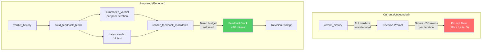

# 497 - Feature: Bounded Verdict History in LLD Revision Loop

<!-- Template Metadata
Last Updated: 2026-02-16
Updated By: Issue #497
Update Reason: Initial LLD for replacing cumulative verdict history with rolling window in LLD draft→review→draft loop
-->

## 1. Context & Goal
* **Issue:** #497
* **Objective:** Replace unbounded cumulative verdict history in the LLD revision prompt with a bounded rolling-window strategy that keeps prompt size within ~20% of iteration 2 regardless of iteration count.
* **Status:** Draft
* **Related Issues:** #494 (JSON review output), #489 (section-level revision), #491 (diff-aware review)

### Open Questions

- [ ] Does #494 (JSON migration) land before or after this? If before, we can use structured diff; if after, we must handle both text and JSON verdict formats.
- [ ] What is the maximum number of revision iterations allowed before the loop aborts? (Currently appears unbounded — should we also cap iterations as a safety net?)

## 2. Proposed Changes

*This section is the **source of truth** for implementation. Describes exactly what will be built.*

### 2.1 Files Changed

| File | Change Type | Description |
|------|-------------|-------------|
| `assemblyzero/workflows/requirements/nodes/generate_draft.py` | Modify | Replace cumulative verdict insertion (lines ~256-259) with rolling-window feedback builder |
| `assemblyzero/workflows/requirements/verdict_summarizer.py` | Add | New module: summarizes prior verdicts into structured one-line summaries |
| `assemblyzero/workflows/requirements/feedback_window.py` | Add | New module: assembles bounded feedback block from verdict history |
| `tests/unit/test_verdict_summarizer.py` | Add | Unit tests for verdict summarization logic |
| `tests/unit/test_feedback_window.py` | Add | Unit tests for feedback window assembly and token budget enforcement |
| `tests/unit/test_generate_draft_feedback.py` | Add | Integration-style unit tests verifying generate_draft uses bounded feedback |
| `tests/fixtures/verdict_analyzer/sample_verdict_iteration_1.json` | Add | Fixture: sample verdict from iteration 1 (blocked, 3 issues) |
| `tests/fixtures/verdict_analyzer/sample_verdict_iteration_2.json` | Add | Fixture: sample verdict from iteration 2 (blocked, 2 issues) |
| `tests/fixtures/verdict_analyzer/sample_verdict_iteration_3.json` | Add | Fixture: sample verdict from iteration 3 (approved) |

### 2.1.1 Path Validation (Mechanical - Auto-Checked)

Mechanical validation automatically checks:
- All "Modify" files must exist in repository — `generate_draft.py` ✓
- All "Add" files must have existing parent directories — `assemblyzero/workflows/requirements/` ✓, `tests/unit/` ✓, `tests/fixtures/verdict_analyzer/` ✓
- No placeholder prefixes

**If validation fails, the LLD is BLOCKED before reaching review.**

### 2.2 Dependencies

```toml
# No new dependencies required.
# tiktoken is already in pyproject.toml for token counting.
```

### 2.3 Data Structures

```python
# Pseudocode - NOT implementation

class VerdictSummary(TypedDict):
    """Compressed representation of a single prior verdict."""
    iteration: int                    # 1-indexed iteration number
    verdict: str                      # "BLOCKED" | "APPROVED"
    total_issues: int                 # Total blocking issues found
    fixed_issues: int                 # Issues resolved in next iteration
    persisting_issues: list[str]      # One-line descriptions of issues still open
    new_issues: list[str]             # Issues that appeared for the first time

class FeedbackBlock(TypedDict):
    """The assembled feedback to insert into the revision prompt."""
    latest_verdict_full: str          # Full text/JSON of the most recent verdict
    prior_summaries: list[VerdictSummary]  # Compressed summaries of all prior verdicts
    rendered_text: str                # Final rendered markdown string for prompt insertion
    token_count: int                  # Token count of rendered_text
```

### 2.4 Function Signatures

```python
# --- assemblyzero/workflows/requirements/verdict_summarizer.py ---

def summarize_verdict(
    verdict_text: str,
    iteration: int,
    next_verdict_text: str | None = None,
) -> VerdictSummary:
    """Summarize a single verdict into a compact representation.
    
    If next_verdict_text is provided, compares to determine which issues
    were fixed vs persisting. Otherwise, all issues are marked persisting.
    """
    ...

def extract_blocking_issues(verdict_text: str) -> list[str]:
    """Extract blocking issue descriptions from a verdict (text or JSON).
    
    Handles both legacy text format and #494 JSON format.
    Returns list of one-line issue descriptions.
    """
    ...

def classify_issues(
    current_issues: list[str],
    next_issues: list[str],
) -> tuple[list[str], list[str]]:
    """Classify issues as fixed or persisting by comparing consecutive verdicts.
    
    Returns:
        (fixed_issues, persisting_issues) - Lists of one-line descriptions.
    
    Uses fuzzy matching (substring + normalized comparison) since
    issue wording may change slightly between iterations.
    """
    ...


# --- assemblyzero/workflows/requirements/feedback_window.py ---

def build_feedback_block(
    verdict_history: list[str],
    token_budget: int = 4000,
) -> FeedbackBlock:
    """Assemble a bounded feedback block from the full verdict history.
    
    Strategy:
    1. Latest verdict is always included in full.
    2. All prior verdicts are summarized into one-line entries.
    3. If total exceeds token_budget, truncate oldest summaries first.
    
    Args:
        verdict_history: List of verdict texts, ordered oldest-first.
        token_budget: Maximum token count for the entire feedback block.
    
    Returns:
        FeedbackBlock with rendered_text ready for prompt insertion.
    """
    ...

def render_feedback_markdown(
    latest_verdict: str,
    summaries: list[VerdictSummary],
) -> str:
    """Render the feedback block as markdown for prompt insertion.
    
    Format:
        ## Review Feedback (Iteration N)
        {latest_verdict_full}
        
        ## Prior Review Summary
        - Iteration 1: BLOCKED — 3 issues (2 fixed, 1 persists: "missing rollback plan")
        - Iteration 2: BLOCKED — 2 issues (1 fixed, 1 persists: "missing rollback plan")
    """
    ...

def count_tokens(text: str, model: str = "cl100k_base") -> int:
    """Count tokens using tiktoken. Thin wrapper for testability."""
    ...


# --- Modified function in generate_draft.py ---

def _build_revision_prompt(
    draft: str,
    verdict_history: list[str],
    template: str,
    **kwargs,
) -> str:
    """Build the revision prompt with bounded feedback.
    
    Replaces the previous cumulative insertion at lines 256-259.
    Uses build_feedback_block() instead of raw concatenation.
    """
    ...
```

### 2.5 Logic Flow (Pseudocode)

```
build_feedback_block(verdict_history, token_budget=4000):
    1. IF verdict_history is empty:
       - RETURN empty FeedbackBlock (no feedback section)
    
    2. latest_verdict = verdict_history[-1]
    
    3. prior_summaries = []
    4. FOR i in range(0, len(verdict_history) - 1):
       - current = verdict_history[i]
       - next_v = verdict_history[i + 1]
       - summary = summarize_verdict(current, iteration=i+1, next_verdict_text=next_v)
       - prior_summaries.append(summary)
    
    5. rendered = render_feedback_markdown(latest_verdict, prior_summaries)
    6. token_count = count_tokens(rendered)
    
    7. IF token_count > token_budget:
       - budget_for_latest = count_tokens(latest_verdict_section)
       - remaining_budget = token_budget - budget_for_latest - 100  # 100 tokens for headers
       - IF remaining_budget <= 0:
           # Latest verdict alone exceeds budget — truncate latest verdict
           - latest_verdict = truncate_to_tokens(latest_verdict, token_budget - 200)
           - prior_summaries = []
       - ELSE:
           # Progressively drop oldest summaries until within budget
           - WHILE count_tokens(summaries_text) > remaining_budget AND prior_summaries:
               - prior_summaries.pop(0)  # Remove oldest first
           - IF still over budget:
               - Truncate remaining summaries text
    
    8. Re-render with final latest_verdict and prior_summaries
    9. RETURN FeedbackBlock(
         latest_verdict_full=latest_verdict,
         prior_summaries=prior_summaries,
         rendered_text=rendered,
         token_count=count_tokens(rendered),
       )
```

```
summarize_verdict(verdict_text, iteration, next_verdict_text=None):
    1. issues = extract_blocking_issues(verdict_text)
    2. IF next_verdict_text is not None:
       - next_issues = extract_blocking_issues(next_verdict_text)
       - fixed, persisting = classify_issues(issues, next_issues)
       - new_in_next = [i for i in next_issues if i not in persisting]  # tracked separately
    3. ELSE:
       - fixed = []
       - persisting = issues  # Last verdict: all issues are "persisting" (pending fix)
    4. RETURN VerdictSummary(
         iteration=iteration,
         verdict="BLOCKED" if issues else "APPROVED",
         total_issues=len(issues),
         fixed_issues=len(fixed),
         persisting_issues=persisting,
         new_issues=[],  # New issues are tracked in the NEXT verdict's summary
       )
```

```
classify_issues(current_issues, next_issues):
    # Fuzzy match: normalize whitespace, lowercase, check substring containment
    1. persisting = []
    2. fixed = []
    3. FOR issue in current_issues:
       - normalized = normalize(issue)
       - IF any(fuzzy_match(normalized, normalize(ni)) for ni in next_issues):
           - persisting.append(issue)
       - ELSE:
           - fixed.append(issue)
    4. RETURN (fixed, persisting)
```

### 2.6 Technical Approach

* **Module:** `assemblyzero/workflows/requirements/`
* **Pattern:** Strategy pattern — `build_feedback_block` encapsulates the feedback assembly strategy, making it easy to swap between "latest only", "rolling window", or "diff-based" in the future.
* **Key Decisions:**
  - Option A from the issue (latest + summary) was selected over Option B (diff-only) because it requires no dependency on #494 JSON format. Diff-only is a future enhancement once #494 lands.
  - Token counting via `tiktoken` (already a dependency) rather than character-based approximation. More accurate for budget enforcement.
  - Fuzzy matching for issue classification uses normalized substring comparison rather than embedding similarity — deterministic, zero-cost, sufficient for the structured issue descriptions in verdicts.

### 2.7 Architecture Decisions

| Decision | Options Considered | Choice | Rationale |
|----------|-------------------|--------|-----------|
| Feedback strategy | A: Latest + summary, B: Diff-only, C: Token budget cap | A: Latest + summary | Works with both text and JSON verdicts; no dependency on #494; clearest signal to the LLM |
| Issue matching | Exact string match, Fuzzy substring, Embedding similarity | Fuzzy substring | Zero additional cost; structured verdict text is similar enough iteration-to-iteration; deterministic |
| Token counting | Character-based estimate (÷4), tiktoken | tiktoken | Already a dependency; accurate; small overhead |
| Budget enforcement | Hard truncation, Progressive oldest-first drop | Progressive oldest-first drop | Preserves most recent context; gracefully degrades |
| Module location | Inside `generate_draft.py`, Separate modules | Separate modules (`verdict_summarizer.py`, `feedback_window.py`) | Single responsibility; independently testable; reusable by future #489 section-level revision |

**Architectural Constraints:**
- Must not break existing revision loop behavior — if verdict_history is empty, prompt must be identical to current initial draft prompt.
- Must handle both text-format verdicts (current) and JSON-format verdicts (#494 future) without hard dependency on either.
- Must not introduce new external dependencies.

## 3. Requirements

1. **Bounded feedback size:** The feedback section of the revision prompt must not exceed `token_budget` (default 4,000) tokens regardless of iteration count.
2. **Latest verdict always full:** The most recent verdict is included verbatim (up to budget).
3. **Prior verdicts summarized:** All prior verdicts are represented as structured one-line summaries showing iteration number, verdict, issue count, and persisting issue descriptions.
4. **Persistent issue visibility:** Issues that appear in multiple consecutive verdicts are explicitly flagged as "persists" in summaries so the LLM knows they haven't been addressed.
5. **Token cost stability:** Iteration 5 prompt token count is within 20% of iteration 2 prompt token count.
6. **Backward compatibility:** Empty verdict history produces the same prompt as the current initial draft behavior.
7. **Format agnostic:** Works with both current text-format verdicts and future #494 JSON-format verdicts.

## 4. Alternatives Considered

| Option | Pros | Cons | Decision |
|--------|------|------|----------|
| A: Latest verdict + prior summaries | Works with text and JSON; clear signal; bounded cost; simple to implement | Loses some detail from intermediate verdicts | **Selected** |
| B: Diff-only feedback | Minimal token usage; precise | Requires #494 JSON format; complex diff logic; loses context of overall progress | Rejected (future enhancement) |
| C: Token budget with progressive summarization | Most flexible; adapts to any budget | More complex; summarization quality varies; harder to test deterministically | Rejected (over-engineered for current need) |
| D: Keep cumulative, add truncation safeguard | Minimal code change | Doesn't solve the core problem — stale feedback still dominates; truncation point is arbitrary | Rejected |

**Rationale:** Option A provides the best balance of implementation simplicity, independence from other issues, and prompt quality. It directly addresses the root cause (stale feedback accumulation) rather than working around it (truncation). The rolling summary gives the LLM a clear picture of what has been tried and what persists, without overwhelming it with redundant detail.

## 5. Data & Fixtures

### 5.1 Data Sources

| Attribute | Value |
|-----------|-------|
| Source | Verdict history list from LangGraph workflow state |
| Format | List of strings (text or JSON, depending on #494 status) |
| Size | 1-5 entries typically; each ~2,000 tokens |
| Refresh | One new entry added per review iteration |
| Copyright/License | N/A — internally generated |

### 5.2 Data Pipeline

```
verdict_history (list[str]) ──build_feedback_block()──► FeedbackBlock ──render──► prompt string section
```

### 5.3 Test Fixtures

| Fixture | Source | Notes |
|---------|--------|-------|
| `sample_verdict_iteration_1.json` | Generated — modeled on real Gemini BLOCKED verdict | Contains 3 blocking issues |
| `sample_verdict_iteration_2.json` | Generated — modeled on real Gemini BLOCKED verdict | 2 of 3 issues fixed, 1 persists, 1 new |
| `sample_verdict_iteration_3.json` | Generated — modeled on real Gemini APPROVED verdict | All issues resolved |
| Text-format verdict strings | Inline in tests | For backward compatibility with pre-#494 format |

### 5.4 Deployment Pipeline

No external data deployment. All changes are code-only, deployed via standard PR merge.

## 6. Diagram

### 6.1 Mermaid Quality Gate

- [x] **Simplicity:** Components are minimal and focused on data flow
- [x] **No touching:** All elements have visual separation
- [x] **No hidden lines:** All arrows fully visible
- [x] **Readable:** Labels not truncated, flow direction clear
- [ ] **Auto-inspected:** Agent rendered via mermaid.ink and viewed

**Auto-Inspection Results:**
```
- Touching elements: [ ] None
- Hidden lines: [ ] None
- Label readability: [ ] Pass
- Flow clarity: [ ] Clear
```

### 6.2 Diagram



## 7. Security & Safety Considerations

### 7.1 Security

| Concern | Mitigation | Status |
|---------|------------|--------|
| Prompt injection via crafted verdict | Verdicts are generated by our own Gemini review pipeline — not user-supplied. No external input path. | Addressed |
| Token counting accuracy | Using tiktoken (same tokenizer used by the models) — no risk of undercount allowing budget overflow | Addressed |

### 7.2 Safety

| Concern | Mitigation | Status |
|---------|------------|--------|
| Dropping prior verdict causes LLM to re-introduce fixed bugs | Prior summaries explicitly list persisting issues — the LLM sees "this was flagged and is still broken" | Addressed |
| Truncating latest verdict loses critical blocking info | Latest verdict is prioritized in budget allocation; only truncated as absolute last resort when single verdict exceeds entire budget | Addressed |
| Fuzzy matching misclassifies issue as "fixed" when it persists | Conservative matching: requires normalized substring overlap. If uncertain, issue is classified as persisting (false negatives preferred over false positives) | Addressed |
| Empty verdict history crashes | Explicit empty-list guard returns empty FeedbackBlock | Addressed |

**Fail Mode:** Fail Safe — if any error occurs in feedback assembly, fall back to including only the latest verdict with no summaries (graceful degradation, not crash).

**Recovery Strategy:** If `build_feedback_block` raises any exception, catch at the call site in `generate_draft.py` and use the latest verdict raw text as fallback. Log a warning for debugging.

## 8. Performance & Cost Considerations

### 8.1 Performance

| Metric | Budget | Approach |
|--------|--------|----------|
| Feedback assembly latency | < 50ms | Pure string processing + tiktoken encoding; no LLM calls |
| Token count per feedback block | ≤ 4,000 tokens | Enforced by `token_budget` parameter with progressive truncation |
| Memory | Negligible | Processing at most 5-10 verdict strings; no large data structures |

**Bottlenecks:** `tiktoken.encode()` is called multiple times during budget enforcement. For typical verdict sizes (5 iterations × ~2K tokens each), total encoding is ~10K tokens — well under 10ms on modern hardware.

### 8.2 Cost Analysis

| Resource | Unit Cost | Estimated Usage | Monthly Cost |
|----------|-----------|-----------------|--------------|
| LLM tokens (revision prompts) | ~$0.003/1K input tokens (Claude) | Savings: ~4K-14K tokens per issue at iterations 3-5 | Net savings of ~$0.01-$0.04 per issue |
| Compute (tiktoken) | Negligible | <50ms per call | $0 |

**Cost Controls:**
- [x] Token budget parameter prevents runaway prompt size
- [x] No new API calls introduced — this is purely a prompt size optimization
- [x] Default budget of 4,000 tokens chosen based on analysis: latest verdict (~2K) + summaries (~200 per prior) + headers (~100)

**Worst-Case Scenario:** If someone passes 100 verdict entries (pathological case), `build_feedback_block` will process all summaries but only retain those that fit within budget. Processing time stays under 500ms even for 100 entries (100 × tiktoken encode calls).

## 9. Legal & Compliance

| Concern | Applies? | Mitigation |
|---------|----------|------------|
| PII/Personal Data | No | Verdicts contain only technical review feedback — no PII |
| Third-Party Licenses | No | No new dependencies |
| Terms of Service | N/A | No external API usage changes |
| Data Retention | N/A | Verdict summaries are ephemeral (in-memory during prompt assembly) |
| Export Controls | N/A | No restricted data or algorithms |

**Data Classification:** Internal

**Compliance Checklist:**
- [x] No PII stored without consent
- [x] All third-party licenses compatible with project license
- [x] External API usage compliant with provider ToS
- [x] Data retention policy documented (N/A — ephemeral)

## 10. Verification & Testing

### 10.0 Test Plan (TDD - Complete Before Implementation)

| Test ID | Test Description | Expected Behavior | Status |
|---------|------------------|-------------------|--------|
| T010 | `extract_blocking_issues` — text format verdict | Extracts list of issue descriptions from `[BLOCKING]` tagged lines | RED |
| T020 | `extract_blocking_issues` — JSON format verdict | Extracts list of issue descriptions from JSON `blocking_issues` field | RED |
| T030 | `extract_blocking_issues` — APPROVED verdict (no issues) | Returns empty list | RED |
| T040 | `classify_issues` — all fixed | All current issues absent from next → all classified as fixed | RED |
| T050 | `classify_issues` — all persisting | All current issues present in next → all classified as persisting | RED |
| T060 | `classify_issues` — mixed fixed and persisting | Correct split between fixed and persisting | RED |
| T070 | `classify_issues` — fuzzy match with slight rewording | Issue "missing rollback plan" matches "rollback plan is missing" | RED |
| T080 | `summarize_verdict` — with next verdict (can compute fixed/persisting) | Returns VerdictSummary with correct fixed/persisting counts | RED |
| T090 | `summarize_verdict` — without next verdict (last iteration) | All issues classified as persisting | RED |
| T100 | `build_feedback_block` — empty history | Returns empty FeedbackBlock with empty rendered_text | RED |
| T110 | `build_feedback_block` — single verdict (iteration 1, no prior) | Full verdict included, no prior summaries section | RED |
| T120 | `build_feedback_block` — 3 verdicts within budget | Latest full + 2 prior summaries, all rendered | RED |
| T130 | `build_feedback_block` — 5 verdicts, exceeds budget | Oldest summaries dropped; latest always full; total ≤ budget | RED |
| T140 | `build_feedback_block` — token budget enforcement | Output token count ≤ token_budget parameter | RED |
| T150 | `render_feedback_markdown` — correct format | Output matches expected markdown structure with headers and bullet points | RED |
| T160 | `count_tokens` — known string | Returns expected token count matching tiktoken directly | RED |
| T170 | Integration: iteration 5 prompt within 20% of iteration 2 | Build prompts for iterations 2 and 5; compare token counts | RED |
| T180 | Fallback: build_feedback_block error → graceful degradation | If summarization fails, returns latest verdict only | RED |
| T190 | `classify_issues` — empty current issues | Returns ([], []) | RED |
| T200 | `classify_issues` — empty next issues | All current classified as fixed | RED |

**Coverage Target:** ≥95% for all new code

**TDD Checklist:**
- [ ] All tests written before implementation
- [ ] Tests currently RED (failing)
- [ ] Test IDs match scenario IDs in 10.1
- [ ] Test files created at: `tests/unit/test_verdict_summarizer.py`, `tests/unit/test_feedback_window.py`, `tests/unit/test_generate_draft_feedback.py`

### 10.1 Test Scenarios

| ID | Scenario | Type | Input | Expected Output | Pass Criteria |
|----|----------|------|-------|-----------------|---------------|
| 010 | Extract blocking issues — text format | Auto | Text verdict with 3 `[BLOCKING]` items | `["issue1", "issue2", "issue3"]` | List length = 3, descriptions match |
| 020 | Extract blocking issues — JSON format | Auto | JSON verdict with `blocking_issues` array | Matching list of descriptions | Correct extraction from JSON |
| 030 | Extract blocking issues — no issues | Auto | APPROVED verdict text | `[]` | Empty list returned |
| 040 | Classify — all fixed | Auto | current=["a","b"], next=["c"] | fixed=["a","b"], persisting=[] | Correct classification |
| 050 | Classify — all persisting | Auto | current=["a","b"], next=["a","b","c"] | fixed=[], persisting=["a","b"] | Correct classification |
| 060 | Classify — mixed | Auto | current=["a","b","c"], next=["b","d"] | fixed=["a","c"], persisting=["b"] | Correct split |
| 070 | Classify — fuzzy match | Auto | current=["missing rollback plan"], next=["rollback plan is missing"] | persisting=["missing rollback plan"] | Fuzzy match succeeds |
| 080 | Summarize with next verdict | Auto | verdict with 3 issues, next with 1 overlapping | VerdictSummary(fixed=2, persisting=1) | Counts correct |
| 090 | Summarize without next | Auto | verdict with 2 issues, next=None | VerdictSummary(persisting=2) | All persisting |
| 100 | Feedback block — empty | Auto | `[]` | Empty FeedbackBlock | rendered_text == "" |
| 110 | Feedback block — single | Auto | 1 verdict | Full verdict, no summaries | rendered contains verdict, no "Prior" section |
| 120 | Feedback block — 3 within budget | Auto | 3 verdicts, budget=8000 | Latest full + 2 summaries | All 3 iterations represented |
| 130 | Feedback block — 5 exceeds budget | Auto | 5 verdicts, budget=4000 | Latest full, oldest summaries dropped | token_count ≤ 4000 |
| 140 | Token budget enforcement | Auto | 5 large verdicts, budget=3000 | Output respects budget | count_tokens(rendered_text) ≤ 3000 |
| 150 | Markdown rendering format | Auto | Latest verdict + 2 summaries | Correct markdown headers and bullets | String contains expected sections |
| 160 | Token counting accuracy | Auto | Known string "hello world" | Matches tiktoken.encode() length | Exact match |
| 170 | Prompt size stability across iterations | Auto | Build mock prompts for iter 2 and 5 | Iter 5 within 20% of iter 2 | abs(iter5 - iter2) / iter2 ≤ 0.20 |
| 180 | Graceful degradation on error | Auto | Inject exception in summarize_verdict | Returns latest verdict only, no crash | FeedbackBlock contains latest, no summaries |
| 190 | Classify — empty current | Auto | current=[], next=["a"] | ([], []) | Both lists empty |
| 200 | Classify — empty next | Auto | current=["a","b"], next=[] | fixed=["a","b"], persisting=[] | All classified as fixed |

### 10.2 Test Commands

```bash
# Run all unit tests for this feature
poetry run pytest tests/unit/test_verdict_summarizer.py tests/unit/test_feedback_window.py tests/unit/test_generate_draft_feedback.py -v

# Run with coverage for new modules
poetry run pytest tests/unit/test_verdict_summarizer.py tests/unit/test_feedback_window.py tests/unit/test_generate_draft_feedback.py -v --cov=assemblyzero/workflows/requirements/verdict_summarizer --cov=assemblyzero/workflows/requirements/feedback_window --cov-report=term-missing

# Run only the token budget enforcement tests
poetry run pytest tests/unit/test_feedback_window.py -v -k "budget"
```

### 10.3 Manual Tests (Only If Unavoidable)

N/A - All scenarios automated.

## 11. Risks & Mitigations

| Risk | Impact | Likelihood | Mitigation |
|------|--------|------------|------------|
| Fuzzy matching misclassifies issues (false "fixed") | Med — LLM may not revisit a persisting issue | Low — verdict wording is consistent within a review loop | Conservative matching: classify as persisting when uncertain; log matches for debugging |
| Summarization loses critical detail that LLM needs | Med — revision quality could degrade | Low — the most recent full verdict contains the actionable info; summaries just provide trend context | Latest verdict is always full; prior summaries include persisting issue text verbatim |
| tiktoken encoding model mismatch | Low — slight over/undercount | Low — cl100k_base covers both Claude and Gemini tokenizers approximately | Token budget has ~10% headroom built in; budget is configurable |
| #494 JSON format changes break extraction | Med — extraction returns empty lists | Med — JSON schema may evolve | `extract_blocking_issues` handles both text and JSON with format detection; add tests for both |
| Fallback masks deeper bugs | Low — error is logged but not surfaced prominently | Med — try/except could swallow unexpected errors | Log at WARNING level; include traceback; only catch specific exceptions (ValueError, KeyError) not broad Exception |

## 12. Definition of Done

### Code
- [ ] `verdict_summarizer.py` implemented with all functions from Section 2.4
- [ ] `feedback_window.py` implemented with all functions from Section 2.4
- [ ] `generate_draft.py` modified to use `build_feedback_block()` instead of cumulative concatenation
- [ ] Error handling: try/except at call site in `generate_draft.py` with fallback to latest-verdict-only
- [ ] Code comments reference this LLD (#497)

### Tests
- [ ] All 20 test scenarios pass (T010–T200)
- [ ] Test coverage ≥ 95% for `verdict_summarizer.py` and `feedback_window.py`
- [ ] T170 confirms iteration 5 prompt within 20% of iteration 2 prompt

### Documentation
- [ ] LLD updated with any deviations
- [ ] Implementation Report (0103) completed
- [ ] Test Report (0113) completed

### Review
- [ ] Code review completed
- [ ] User approval before closing issue

### 12.1 Traceability (Mechanical - Auto-Checked)

| Section 12 Item | Section 2.1 File |
|-----------------|------------------|
| `verdict_summarizer.py` | `assemblyzero/workflows/requirements/verdict_summarizer.py` ✓ |
| `feedback_window.py` | `assemblyzero/workflows/requirements/feedback_window.py` ✓ |
| `generate_draft.py` modification | `assemblyzero/workflows/requirements/nodes/generate_draft.py` ✓ |
| Test file: verdict_summarizer | `tests/unit/test_verdict_summarizer.py` ✓ |
| Test file: feedback_window | `tests/unit/test_feedback_window.py` ✓ |
| Test file: generate_draft_feedback | `tests/unit/test_generate_draft_feedback.py` ✓ |

Risk mitigation traceability:
| Section 11 Risk | Section 2.4 Function |
|-----------------|---------------------|
| Fuzzy matching misclassification | `classify_issues()` with conservative matching |
| Summarization loses detail | `build_feedback_block()` — latest always full |
| tiktoken mismatch | `count_tokens()` with configurable model |
| JSON format changes | `extract_blocking_issues()` with format detection |
| Fallback masking bugs | `_build_revision_prompt()` try/except with WARNING log |

**If files are missing from Section 2.1, the LLD is BLOCKED.**

---

## Appendix: Review Log

*Track all review feedback with timestamps and implementation status.*

### Review Summary

| Review | Date | Verdict | Key Issue |
|--------|------|---------|-----------|
| — | — | — | — |

**Final Status:** PENDING