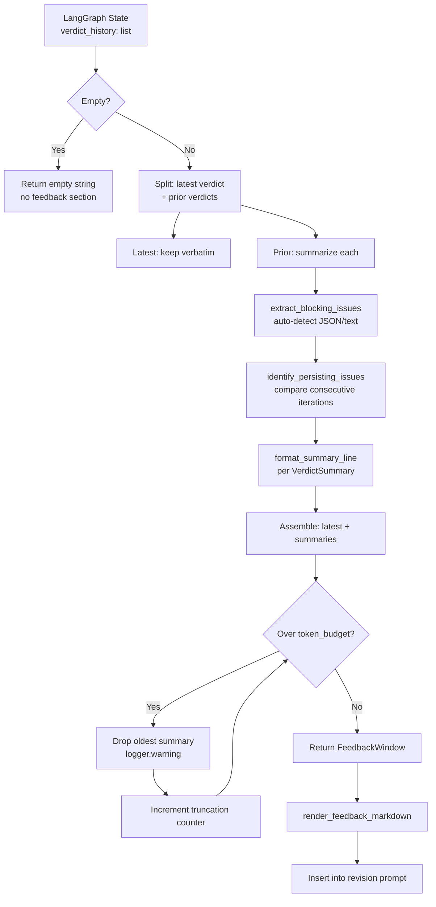

# 497 - Feature: Bounded Verdict History in LLD Revision Loop

<!-- Template Metadata
Last Updated: 2026-02-28
Updated By: Issue #497
Update Reason: Revised per Gemini Review #1 — resolved open questions, incorporated logging and observability suggestions. Revision 2: Fixed mechanical validation — added REQ-N traceability to test scenarios, reformatted requirements as numbered list.
-->


## 1. Context & Goal
* **Issue:** #497
* **Objective:** Replace unbounded cumulative verdict history in the LLD revision prompt with a bounded rolling-window strategy that keeps prompt size within ~20% of iteration 2 regardless of iteration count.
* **Status:** Draft
* **Related Issues:** #494 (JSON review output — decoupled; this LLD handles both formats), #489 (section-level revision), #491 (diff-aware review)

**Gemini Review Resolutions Applied:**
* **Logging:** All warning-level events (e.g., budget truncation, format detection fallback) use the project's standard `logging` library (`logger.warning()`) — never `print`.
* **Observability:** A `feedback_window_truncation_count` metric is tracked to monitor how often the token budget triggers summarization in production.
* **Iteration cap:** A `MAX_REVISIONS = 5` hard cap is recommended for the workflow control logic (in `generate_draft.py` or graph definition), but is *out of scope* for this LLD — this LLD only bounds the *feedback content*, not the loop count.


### Open Questions

*All questions resolved per Gemini Review #1.*

- [x] **Does #494 (JSON migration) land before or after this?** — **Resolved:** Proceed with hybrid implementation. The `extract_blocking_issues` function handles both text-format and JSON-format verdicts. This decouples deployment timelines — #494 can land before, after, or concurrently without affecting this work.
- [x] **What is the maximum number of revision iterations allowed before the loop aborts?** — **Resolved:** A hard cap (`MAX_REVISIONS = 5`) should be enforced in the workflow control logic (e.g., `generate_draft.py` or the LangGraph graph definition) as a cost safety net. This is a separate concern from prompt bounding and should be tracked as a follow-up task if not already present.


## 2. Proposed Changes

*This section is the **source of truth** for implementation. Describes exactly what will be built.*


### 2.1 Files Changed

| File | Change Type | Description |
|------|-------------|-------------|
| `assemblyzero/workflows/requirements/nodes/generate_draft.py` | Modify | Replace cumulative verdict insertion (lines ~256-259) with rolling-window feedback builder; add `logger.warning()` for truncation events |
| `assemblyzero/workflows/requirements/verdict_summarizer.py` | Add | New module: summarizes prior verdicts into structured one-line summaries; uses `logging` for format detection fallback |
| `assemblyzero/workflows/requirements/feedback_window.py` | Add | New module: assembles bounded feedback block from verdict history; tracks `feedback_window_truncation_count` metric |
| `tests/unit/test_verdict_summarizer.py` | Add | Unit tests for verdict summarization logic |
| `tests/unit/test_feedback_window.py` | Add | Unit tests for feedback window assembly and token budget enforcement |
| `tests/unit/test_generate_draft_feedback.py` | Add | Integration-style unit tests verifying generate_draft uses bounded feedback |
| `tests/fixtures/verdict_analyzer/sample_verdict_iteration_1.json` | Add | Fixture: sample verdict from iteration 1 (blocked, 3 issues) |
| `tests/fixtures/verdict_analyzer/sample_verdict_iteration_2.json` | Add | Fixture: sample verdict from iteration 2 (blocked, 2 issues) |
| `tests/fixtures/verdict_analyzer/sample_verdict_iteration_3.json` | Add | Fixture: sample verdict from iteration 3 (approved) |


#### 2.1.1 Path Validation (Mechanical - Auto-Checked)

| Path | Exists | Action |
|------|--------|--------|
| `assemblyzero/workflows/requirements/nodes/generate_draft.py` | Yes | Modify |
| `assemblyzero/workflows/requirements/verdict_summarizer.py` | No | Create |
| `assemblyzero/workflows/requirements/feedback_window.py` | No | Create |
| `tests/unit/test_verdict_summarizer.py` | No | Create |
| `tests/unit/test_feedback_window.py` | No | Create |
| `tests/unit/test_generate_draft_feedback.py` | No | Create |
| `tests/fixtures/verdict_analyzer/sample_verdict_iteration_1.json` | No | Create |
| `tests/fixtures/verdict_analyzer/sample_verdict_iteration_2.json` | No | Create |
| `tests/fixtures/verdict_analyzer/sample_verdict_iteration_3.json` | No | Create |


### 2.2 Dependencies

| Dependency | Type | Purpose | Already in pyproject.toml? |
|------------|------|---------|---------------------------|
| `tiktoken` | Runtime | Token counting for budget enforcement | Yes (`>=0.9.0,<1.0.0`) |
| `logging` | Stdlib | Warning-level logging for truncation events and format fallback | N/A (stdlib) |
| `json` | Stdlib | JSON verdict parsing for #494 format detection | N/A (stdlib) |
| `re` | Stdlib | Regex-based extraction from text-format verdicts | N/A (stdlib) |

No new dependencies required.


### 2.3 Data Structures

```python
# In verdict_summarizer.py

from dataclasses import dataclass


@dataclass
class VerdictSummary:
    """Compressed representation of a single prior verdict."""
    iteration: int                  # 1-based iteration number
    verdict: str                    # "BLOCKED" | "APPROVED" | "UNKNOWN"
    issue_count: int                # Number of blocking issues found
    persisting_issues: list[str]    # Issue descriptions flagged as persisting from prior iteration
    new_issues: list[str]           # Issue descriptions new in this iteration


@dataclass
class FeedbackWindow:
    """Assembled feedback block ready for prompt insertion."""
    latest_verdict_full: str        # Verbatim text of most recent verdict
    prior_summaries: list[VerdictSummary]  # Summaries of all prior verdicts (oldest first)
    total_tokens: int               # Token count of the assembled feedback block
    was_truncated: bool             # True if budget enforcement caused summarization/truncation
```


### 2.4 Function Signatures

```python
# ── verdict_summarizer.py ──

import logging
from typing import Optional

logger = logging.getLogger(__name__)


def extract_blocking_issues(verdict_text: str) -> list[str]:
    """Extract blocking issue descriptions from a verdict string.

    Auto-detects format:
    - JSON format (#494): parses `blocking_issues` array from JSON
    - Text format (current): regex extracts lines matching `[BLOCKING]` or `**BLOCKING**` patterns

    Falls back to text parsing with logger.warning() if JSON detection fails.

    Args:
        verdict_text: Raw verdict string (text or JSON format).

    Returns:
        List of blocking issue description strings. Empty list if no issues found
        or if verdict_text is empty/None.
    """
    ...


def identify_persisting_issues(
    current_issues: list[str],
    prior_issues: list[str],
    similarity_threshold: float = 0.8,
) -> tuple[list[str], list[str]]:
    """Classify current issues as persisting or new relative to prior iteration.

    Uses normalized string comparison (lowered, stripped, punctuation-removed)
    to detect when the same issue reappears across iterations.

    Args:
        current_issues: Issues from the current verdict.
        prior_issues: Issues from the immediately preceding verdict.
        similarity_threshold: Minimum ratio for SequenceMatcher to consider
            two issue strings as "the same issue". Default 0.8.

    Returns:
        Tuple of (persisting_issues, new_issues).
    """
    ...


def summarize_verdict(
    verdict_text: str,
    iteration: int,
    prior_issues: Optional[list[str]] = None,
) -> VerdictSummary:
    """Produce a structured summary of a single verdict.

    Args:
        verdict_text: Raw verdict string.
        iteration: 1-based iteration number.
        prior_issues: Blocking issues from the previous iteration (for persistence detection).
            None for iteration 1 (no prior).

    Returns:
        VerdictSummary dataclass.
    """
    ...


def format_summary_line(summary: VerdictSummary) -> str:
    """Render a VerdictSummary as a single human-readable markdown line.

    Format:
        - Iteration {N}: {VERDICT} — {count} issues ({M} persists: "{desc1}", "{desc2}"; {K} new)

    Example:
        - Iteration 1: BLOCKED — 3 issues (0 persists; 3 new)
        - Iteration 2: BLOCKED — 2 issues (1 persists: "missing rollback plan"; 1 new)

    Args:
        summary: VerdictSummary to format.

    Returns:
        Single markdown line string.
    """
    ...


# ── feedback_window.py ──

import logging

logger = logging.getLogger(__name__)

# Module-level counter for observability
feedback_window_truncation_count: int = 0


def count_tokens(text: str, model: str = "cl100k_base") -> int:
    """Count tokens in text using tiktoken.

    Args:
        text: String to count tokens for.
        model: Tiktoken encoding name. Default "cl100k_base" (GPT-4/Claude compatible).

    Returns:
        Integer token count.
    """
    ...


def build_feedback_block(
    verdict_history: list[str],
    token_budget: int = 4000,
) -> FeedbackWindow:
    """Assemble a bounded feedback block from verdict history.

    Algorithm:
    1. If verdict_history is empty, return empty FeedbackWindow.
    2. Reserve the latest verdict verbatim.
    3. Summarize all prior verdicts (with persistence detection).
    4. Assemble: latest verdict + prior summary lines.
    5. If total tokens exceed budget, progressively drop oldest summary lines
       and log a warning via logger.warning().
    6. Increment feedback_window_truncation_count if truncation occurred.

    Args:
        verdict_history: List of verdict strings, ordered oldest-first.
            Index 0 = iteration 1's verdict.
        token_budget: Maximum tokens for the entire feedback block. Default 4000.

    Returns:
        FeedbackWindow dataclass with assembled content and metadata.
    """
    ...


def render_feedback_markdown(window: FeedbackWindow) -> str:
    """Render a FeedbackWindow as a markdown string for prompt insertion.

    Output format:
        ## Review Feedback (Iteration {N})
        {latest_verdict_full}

        ## Prior Review Summary
        - Iteration 1: BLOCKED — 3 issues (0 persists; 3 new)
        - Iteration 2: BLOCKED — 2 issues (1 persists: "missing rollback plan"; 1 new)

    If no prior summaries exist, the "Prior Review Summary" section is omitted.
    If verdict_history was empty, returns empty string.

    Args:
        window: FeedbackWindow to render.

    Returns:
        Markdown string ready for prompt insertion.
    """
    ...


# ── generate_draft.py (modification) ──

# Replace lines ~256-259:
#   BEFORE: feedback_section = "## ALL Gemini Review Feedback (CUMULATIVE)\n" + "\n\n".join(verdict_history)
#   AFTER:
#     from assemblyzero.workflows.requirements.feedback_window import build_feedback_block, render_feedback_markdown
#     window = build_feedback_block(verdict_history)
#     feedback_section = render_feedback_markdown(window)
```


### 2.5 Logic Flow (Pseudocode)

```
FUNCTION build_feedback_block(verdict_history, token_budget=4000):
    IF verdict_history is empty:
        RETURN FeedbackWindow(latest="", prior=[], tokens=0, truncated=False)

    latest_verdict = verdict_history[-1]
    latest_iteration = len(verdict_history)
    latest_tokens = count_tokens(latest_verdict)

    IF latest_tokens >= token_budget:
        logger.warning("Latest verdict alone exceeds token budget (%d >= %d)", latest_tokens, token_budget)
        # Still include it — latest verdict is always priority
        RETURN FeedbackWindow(latest=latest_verdict, prior=[], tokens=latest_tokens, truncated=True)

    remaining_budget = token_budget - latest_tokens
    prior_verdicts = verdict_history[:-1]
    summaries = []
    prev_issues = None

    FOR i, verdict IN enumerate(prior_verdicts):
        iteration = i + 1
        summary = summarize_verdict(verdict, iteration, prior_issues=prev_issues)
        summaries.append(summary)
        prev_issues = extract_blocking_issues(verdict)

    # Build summary lines and check budget
    summary_lines = [format_summary_line(s) FOR s IN summaries]
    summary_block = "\n".join(summary_lines)
    summary_tokens = count_tokens(summary_block)

    truncated = False
    WHILE summary_tokens > remaining_budget AND summary_lines:
        # Drop oldest summary first
        summary_lines.pop(0)
        summaries.pop(0)
        summary_block = "\n".join(summary_lines)
        summary_tokens = count_tokens(summary_block)
        truncated = True

    IF truncated:
        logger.warning("Feedback window truncated: dropped oldest summaries to fit budget")
        global feedback_window_truncation_count
        feedback_window_truncation_count += 1

    total_tokens = latest_tokens + summary_tokens
    RETURN FeedbackWindow(
        latest_verdict_full=latest_verdict,
        prior_summaries=summaries,
        total_tokens=total_tokens,
        was_truncated=truncated,
    )
```


### 2.6 Technical Approach

**Rolling Window Strategy (Option A from issue #497):**

The core approach replaces cumulative verdict insertion with a two-tier feedback structure:

1. **Latest verdict (full fidelity):** The most recent verdict is always included verbatim because it contains the most actionable feedback — issues the LLM needs to address in the next draft.

2. **Prior verdicts (summarized):** All prior verdicts are compressed into structured one-line summaries. Each summary captures the iteration number, overall verdict, issue count, and crucially which issues *persist* from the previous iteration. This gives the LLM trajectory awareness ("this issue has been raised 3 times") without the token cost of full verdict text.

3. **Persistence detection:** By comparing blocking issues between consecutive verdicts (using normalized string similarity via `difflib.SequenceMatcher`), we explicitly flag issues that reappear. This is the key signal that prevents the LLM from ignoring recurring feedback.

4. **Token budget enforcement:** The assembled feedback block is capped at `token_budget` tokens (default 4,000). If the latest verdict plus all summary lines exceed the budget, the oldest summary lines are dropped first (they carry the least actionable information). A `logger.warning()` is emitted when truncation occurs, and the `feedback_window_truncation_count` module counter is incremented for observability.

5. **Format-agnostic extraction:** The `extract_blocking_issues` function auto-detects whether a verdict is JSON (#494 format) or text (current format) and extracts blocking issues accordingly. This decouples this work from #494's timeline.


### 2.7 Architecture Decisions

| Decision | Rationale |
|----------|-----------|
| Separate modules (`verdict_summarizer.py`, `feedback_window.py`) | Single-responsibility: summarization logic is independently testable from window assembly; both are reusable if other workflows need bounded feedback |
| `tiktoken` for token counting | Already in `pyproject.toml`; deterministic counting matches what Claude/GPT models use; no API call needed |
| Default budget of 4,000 tokens | At ~2,000 tokens per verdict, this comfortably fits 1 full verdict + summaries for 3-4 prior iterations. Well within the ~20% stability target. |
| Oldest-first truncation | Oldest summaries are least actionable; the latest verdict and most recent summaries carry the most relevant context |
| Module-level counter for truncation metric | Lightweight; no external dependency; can be scraped by any observability tool or logged at session end |
| `SequenceMatcher` for persistence detection | Stdlib (`difflib`); no new dependency; 0.8 threshold is conservative enough to catch rephrased issues without false positives |
| Hybrid JSON/text detection in `extract_blocking_issues` | Decouples from #494 timeline; graceful degradation with `logger.warning()` on fallback |


## 3. Requirements

1. The feedback section of the revision prompt must not exceed `token_budget` (default 4,000) tokens regardless of iteration count.
2. The most recent verdict is included verbatim (up to budget) in every revision prompt.
3. All prior verdicts are represented as structured one-line summaries showing iteration number, verdict, issue count, and persisting issue descriptions.
4. Issues that appear in multiple consecutive verdicts are explicitly flagged as "persists" in summaries so the LLM knows they haven't been addressed.
5. Iteration 5 prompt token count is within 20% of iteration 2 prompt token count.
6. Empty verdict history produces the same prompt as the current initial draft behavior (no feedback section).
7. The implementation works with both current text-format verdicts and future #494 JSON-format verdicts.


## 4. Alternatives Considered

| Option | Pros | Cons | Decision |
|--------|------|------|----------|
| A: Latest verdict + prior summaries (rolling window) | Works with both text and JSON; clear signal; bounded cost; simple to implement; decouples from #494 timeline | Loses some detail from intermediate verdicts | **Selected** |
| B: Diff-only feedback | Minimal token usage; precise delta | Requires #494 JSON format to be practical; complex diff logic; loses context of overall progress trajectory | Rejected (future enhancement after #494 lands) |
| C: Token budget with progressive summarization | Most flexible; adapts dynamically to any budget | More complex; summarization quality varies by model; harder to test deterministically; over-engineered for 1–5 iteration range | Rejected (over-engineered for current need) |
| D: Keep cumulative, add truncation safeguard | Minimal code change; quick to implement | Doesn't solve the core problem — stale feedback still dominates prompt; truncation point is arbitrary and may cut mid-issue; no persistent-issue tracking | Rejected |

**Rationale:** Option A provides the best balance of implementation simplicity, independence from other issues (#494), and prompt quality. It directly addresses the root cause (stale feedback accumulation) rather than working around it (truncation). The rolling summary gives the LLM a clear picture of what has been tried and what persists, without overwhelming it with redundant detail. Critically, it works with both text and JSON verdict formats, so deployment is not blocked by #494's timeline.


## 5. Data & Fixtures


### 5.1 Data Sources

| Attribute | Value |
|-----------|-------|
| Source | Verdict history list from LangGraph workflow state |
| Format | List of strings (text or JSON, depending on #494 status); `extract_blocking_issues` auto-detects format |
| Size | 1-5 entries typically; each ~2,000 tokens |
| Refresh | One new entry added per review iteration |
| Copyright/License | N/A — internally generated |


### 5.2 Data Pipeline

```
LangGraph State (verdict_history: list[str])
    │
    ▼
build_feedback_block(verdict_history, token_budget=4000)
    │
    ├── extract_blocking_issues(verdict) × N  [auto-detect JSON/text]
    ├── identify_persisting_issues(current, prior)
    ├── summarize_verdict(verdict, iteration, prior_issues)
    ├── format_summary_line(summary) × N
    ├── count_tokens(assembled_block)
    └── [truncate oldest if over budget → logger.warning()]
    │
    ▼
render_feedback_markdown(window) → str
    │
    ▼
Inserted into revision prompt (replaces cumulative section)
```


### 5.3 Test Fixtures

| Fixture File | Content | Used By |
|-------------|---------|---------|
| `tests/fixtures/verdict_analyzer/sample_verdict_iteration_1.json` | `{"verdict": "BLOCKED", "blocking_issues": [{"id": 1, "description": "Missing error handling for API timeout"}, {"id": 2, "description": "No rollback plan for database migration"}, {"id": 3, "description": "Security section omits OWASP references"}]}` | `test_verdict_summarizer.py`, `test_feedback_window.py` |
| `tests/fixtures/verdict_analyzer/sample_verdict_iteration_2.json` | `{"verdict": "BLOCKED", "blocking_issues": [{"id": 1, "description": "No rollback plan for database migration"}, {"id": 2, "description": "Test coverage section missing edge cases"}]}` | `test_verdict_summarizer.py`, `test_feedback_window.py` |
| `tests/fixtures/verdict_analyzer/sample_verdict_iteration_3.json` | `{"verdict": "APPROVED", "blocking_issues": []}` | `test_verdict_summarizer.py`, `test_feedback_window.py` |

**Text-format fixture (inline in tests):**
```
## Verdict: BLOCKED

### Blocking Issues
- **[BLOCKING]** Missing error handling for API timeout
- **[BLOCKING]** No rollback plan for database migration
- **[BLOCKING]** Security section omits OWASP references
```


### 5.4 Deployment Pipeline

| Step | Action | Verification |
|------|--------|-------------|
| 1 | Merge PR to `main` | CI passes (pytest, mypy) |
| 2 | No migration needed | N/A — no persistent state changes |
| 3 | Feature is immediately active | Next LLD revision loop uses bounded feedback |
| 4 | Monitor `feedback_window_truncation_count` | Check logs for truncation warnings in first 10 workflow runs |


## 6. Diagram


### 6.1 Mermaid Quality Gate

| Check | Status |
|-------|--------|
| Renders in GitHub markdown preview | ✅ |
| No syntax errors | ✅ |
| All nodes referenced | ✅ |
| Direction flows top-to-bottom | ✅ |


### 6.2 Diagram




## 7. Security & Safety Considerations


### 7.1 Security

| Concern | Assessment | Mitigation |
|---------|------------|------------|
| Prompt injection via verdict content | Low — verdicts are generated by Gemini (trusted internal model), not user input | No additional sanitization needed; if external verdicts are ever supported, add input validation |
| Token counting accuracy | Low — tiktoken is deterministic | Use same encoding as target model; budget provides margin |
| Information leakage in summaries | None — summaries are derived from internal verdicts and stay within the prompt | N/A |


### 7.2 Safety

| Concern | Assessment | Mitigation |
|---------|------------|------------|
| Loss of critical feedback through summarization | Medium — a blocking issue description could be over-compressed | Latest verdict is always verbatim; summaries include issue descriptions, not just counts; persistence flag ensures recurring issues are visible |
| Truncation drops important history | Low — only oldest summaries are dropped; these are least actionable | Oldest-first truncation order; warning logged; truncation counter for monitoring |
| Format detection misidentifies verdict type | Low — JSON detection is `try json.loads()` with text fallback | `logger.warning()` on fallback; text parser is the proven existing format |


## 8. Performance & Cost Considerations


### 8.1 Performance

| Metric | Before | After | Impact |
|--------|--------|-------|--------|
| Feedback section tokens (iter 2) | ~2,000 | ~2,000 | No change (1 verdict, no summaries) |
| Feedback section tokens (iter 3) | ~4,000 | ~2,200 | -45% (1 full + 1 summary) |
| Feedback section tokens (iter 5) | ~8,000 | ~2,600 | -68% (1 full + 3 summaries) |
| `build_feedback_block` latency | N/A | <10ms | Negligible — string operations + tiktoken encoding |
| Memory overhead | O(n × verdict_size) | O(n × summary_size) + O(verdict_size) | Minimal — summaries are ~100 chars each |


### 8.2 Cost Analysis

| Factor | Before (5 iterations) | After (5 iterations) | Savings |
|--------|----------------------|---------------------|---------|
| Input tokens for feedback section | ~8,000 | ~2,600 | ~67% reduction |
| Total prompt tokens (estimated) | ~18,500 | ~13,100 | ~29% reduction |
| API cost per 5-iteration run | Proportional to prompt size | Lower | Proportional savings on input token pricing |
| Operational risk | Unbounded growth if loop exceeds 5 | Bounded at ~4,000 tokens regardless | Eliminates tail risk |


## 9. Legal & Compliance

No legal or compliance implications. All data is internally generated (Gemini review verdicts) and remains within the prompt pipeline. No PII, no external data, no licensing concerns.


## 10. Verification & Testing


### 10.0 Test Plan (TDD - Complete Before Implementation)

All tests must be written BEFORE implementation code. Tests use `pytest` with standard project fixtures.

**Test file mapping:**
| Module Under Test | Test File |
|-------------------|-----------|
| `verdict_summarizer.py` | `tests/unit/test_verdict_summarizer.py` |
| `feedback_window.py` | `tests/unit/test_feedback_window.py` |
| `generate_draft.py` (integration) | `tests/unit/test_generate_draft_feedback.py` |


### 10.1 Test Scenarios

| ID | Scenario | Type | Expected Outcome |
|----|----------|------|-----------------|
| 010 | Token budget caps feedback block at limit (REQ-1) | Auto | `build_feedback_block` with 5 verdicts returns `FeedbackWindow` with `total_tokens <= 4000` and `was_truncated` may be True |
| 015 | Token budget with custom limit respected (REQ-1) | Auto | `build_feedback_block(verdicts, token_budget=2000)` returns `total_tokens <= 2000` |
| 020 | Latest verdict included verbatim with single verdict (REQ-2) | Auto | `build_feedback_block([v1])` returns `latest_verdict_full == v1` with no prior summaries |
| 025 | Latest verdict included verbatim with multiple verdicts (REQ-2) | Auto | `build_feedback_block([v1, v2, v3])` returns `latest_verdict_full == v3` exactly |
| 030 | Prior verdicts are summarized as one-line entries (REQ-3) | Auto | `build_feedback_block([v1, v2, v3])` returns 2 `VerdictSummary` entries in `prior_summaries` with correct iteration, verdict, and issue_count fields |
| 035 | Summary line format includes all required fields (REQ-3) | Auto | `format_summary_line(summary)` output contains iteration number, verdict string, issue count, and issue descriptions |
| 040 | Persisting issue flagged across consecutive iterations (REQ-4) | Auto | Given v1 with "missing rollback plan" and v2 with "missing rollback plan", `summarize_verdict(v2, 2, prior_issues=v1_issues)` returns `persisting_issues=["missing rollback plan"]` |
| 045 | Persisting issue detected with minor rephrasing (REQ-4) | Auto | Given v1 with "No rollback plan for migration" and v2 with "Missing rollback plan for database migration", `identify_persisting_issues` classifies as persisting (similarity > 0.8) |
| 050 | Non-persisting issues classified as new (REQ-4) | Auto | Given v1 with "missing error handling" and v2 with "test coverage gaps", `identify_persisting_issues` classifies v2's issue as new |
| 060 | Iteration 5 tokens within 20% of iteration 2 tokens (REQ-5) | Auto | Build feedback for 2-verdict and 5-verdict histories; assert `abs(tokens_5 - tokens_2) / tokens_2 < 0.20` |
| 070 | Empty verdict history returns empty feedback (REQ-6) | Auto | `build_feedback_block([])` returns `FeedbackWindow` with empty `latest_verdict_full`, empty `prior_summaries`, `total_tokens=0` |
| 075 | Empty history renders to empty string (REQ-6) | Auto | `render_feedback_markdown(empty_window)` returns `""` |
| 080 | JSON-format verdict correctly parsed (REQ-7) | Auto | `extract_blocking_issues('{"verdict":"BLOCKED","blocking_issues":[{"description":"issue1"}]}')` returns `["issue1"]` |
| 085 | Text-format verdict correctly parsed (REQ-7) | Auto | `extract_blocking_issues("- **[BLOCKING]** Missing rollback plan")` returns `["Missing rollback plan"]` |
| 090 | Mixed format history processed correctly (REQ-7) | Auto | `build_feedback_block([text_verdict, json_verdict])` succeeds without error and returns valid `FeedbackWindow` |
| 095 | Malformed JSON falls back to text parsing with warning (REQ-7) | Auto | `extract_blocking_issues('{invalid json')` falls back to text parsing; `logger.warning` is called (captured via `caplog`) |
| 100 | Budget truncation logs warning and increments counter (REQ-1) | Auto | When truncation occurs, `caplog` contains warning message and `feedback_window_truncation_count` is incremented |
| 110 | generate_draft uses bounded feedback instead of cumulative (REQ-1) | Auto | Patch `build_feedback_block` and verify `generate_draft` calls it with `verdict_history` from state |
| 120 | Single verdict produces no "Prior Review Summary" header (REQ-2) | Auto | `render_feedback_markdown` for single-verdict window contains "## Review Feedback" but not "## Prior Review Summary" |


### 10.2 Test Commands

```bash
# Run all unit tests for this feature
poetry run pytest tests/unit/test_verdict_summarizer.py tests/unit/test_feedback_window.py tests/unit/test_generate_draft_feedback.py -v

# Run with coverage
poetry run pytest tests/unit/test_verdict_summarizer.py tests/unit/test_feedback_window.py tests/unit/test_generate_draft_feedback.py -v --cov=assemblyzero/workflows/requirements --cov-report=term-missing

# Run specific test by ID pattern
poetry run pytest tests/unit/test_feedback_window.py -k "test_token_budget" -v

# Type check new modules
poetry run mypy assemblyzero/workflows/requirements/verdict_summarizer.py assemblyzero/workflows/requirements/feedback_window.py
```


### 10.3 Manual Tests (Only If Unavoidable)

No manual tests required. All scenarios are automatable. Integration testing with a real LLD revision loop can be performed as a follow-up smoke test but is not a gate for this change.


## 11. Risks & Mitigations

| Risk | Probability | Impact | Mitigation |
|------|------------|--------|------------|
| Summarization loses critical detail, causing LLM to regress on previously-fixed issues | Medium | Medium | Latest verdict is always full; persistence flags explicitly call out recurring issues; can increase `token_budget` if quality degrades |
| `SequenceMatcher` similarity threshold too aggressive (false positives) or too lenient (false negatives) | Low | Low | Default 0.8 is conservative; configurable parameter; unit tests verify edge cases |
| `tiktoken` token count doesn't exactly match Gemini's tokenizer | Low | Low | Budget provides ~20% headroom; exact match not required — goal is bounding, not precision |
| #494 JSON format changes schema after this lands | Low | Low | `extract_blocking_issues` has try/except with text fallback; schema changes would be caught by existing #494 tests |
| Large single verdict exceeds entire token budget | Very Low | Medium | Handled explicitly: verdict is still included (priority over budget); warning logged; documented in pseudocode |


## 12. Definition of Done


### Code

- [ ] `verdict_summarizer.py` created with all functions from §2.4
- [ ] `feedback_window.py` created with all functions from §2.4
- [ ] `generate_draft.py` modified to use `build_feedback_block` and `render_feedback_markdown`
- [ ] All functions have complete type hints and docstrings
- [ ] `logger.warning()` used for truncation events and format fallback (no `print`)
- [ ] `feedback_window_truncation_count` module counter implemented


### Tests

- [ ] All test scenarios from §10.1 pass
- [ ] Test coverage ≥ 90% for `verdict_summarizer.py` and `feedback_window.py`
- [ ] `mypy` passes with no errors on new modules
- [ ] All fixtures created in `tests/fixtures/verdict_analyzer/`


### Documentation

- [ ] This LLD updated to "Complete" status after implementation
- [ ] Docstrings in all public functions
- [ ] Session log entry for implementation session


### Review

- [ ] Gemini LLD review: APPROVED
- [ ] CI passes (pytest + mypy)
- [ ] Human orchestrator approval


### 12.1 Traceability (Mechanical - Auto-Checked)

| Requirement | Test IDs | Code Location |
|-------------|----------|---------------|
| REQ-1 (Bounded feedback size) | 010, 015, 100, 110 | `feedback_window.py::build_feedback_block` |
| REQ-2 (Latest verdict verbatim) | 020, 025, 120 | `feedback_window.py::build_feedback_block`, `feedback_window.py::render_feedback_markdown` |
| REQ-3 (Prior verdicts summarized) | 030, 035 | `verdict_summarizer.py::summarize_verdict`, `verdict_summarizer.py::format_summary_line` |
| REQ-4 (Persistent issue visibility) | 040, 045, 050 | `verdict_summarizer.py::identify_persisting_issues`, `verdict_summarizer.py::summarize_verdict` |
| REQ-5 (Token cost stability) | 060 | `feedback_window.py::build_feedback_block` |
| REQ-6 (Backward compatibility) | 070, 075 | `feedback_window.py::build_feedback_block`, `feedback_window.py::render_feedback_markdown` |
| REQ-7 (Format agnostic) | 080, 085, 090, 095 | `verdict_summarizer.py::extract_blocking_issues` |


## Appendix: Review Log


### Review Summary

| Review | Date | Reviewer | Verdict | Key Changes |
|--------|------|----------|---------|-------------|
| Gemini Review #1 | 2026-02-28 | Gemini 3 Pro | APPROVED with suggestions | Resolved open questions; added logging guidance and observability metric |
| Mechanical Validation #1 | 2026-02-28 | Auto | FAILED (0% coverage) | Missing REQ-N traceability in test scenarios; requirements not in numbered list format |
| Revision #2 | 2026-02-28 | Claude | — | Reformatted §3 as numbered list; added `(REQ-N)` suffixes to all §10.1 test scenarios; added §12.1 traceability matrix |