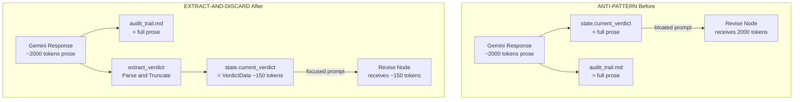
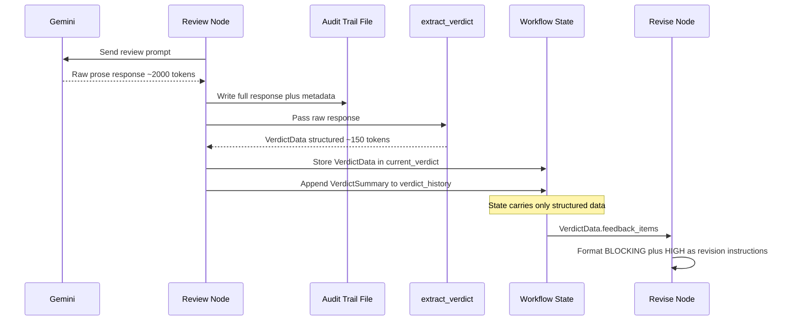

# 507 - Enhancement: Enforce Extract-and-Discard Pattern for All LLM-Populated State Fields

<!-- Template Metadata
Last Updated: 2026-02-17
Updated By: Issue #507 design
Update Reason: Revised LLD to fix mechanical validation errors — three files marked Modify do not exist and must be corrected
-->

## 1. Context & Goal
* **Issue:** #507
* **Objective:** Audit and refactor all LLM-calling nodes so that workflow state carries only structured/extracted data, while full LLM responses are preserved exclusively in audit trail files.
* **Status:** Draft
* **Related Issues:** #494 (JSON migration — prerequisite), #497 (verdict_history accumulation), #506 (requirements review node redundancy)

### Open Questions

- [ ] After #494 lands, confirm the exact JSON schema for structured verdicts so extraction logic can target stable fields
- [ ] Does `review_test_plan.py` need `test_plan_verdict` in state at all, or can it be eliminated entirely since it's not reused downstream?
- [ ] What is the maximum acceptable token budget for structured feedback fields stored in state (e.g., 200 tokens for review feedback)?
- [ ] Confirm the actual file names and locations for the three nodes that failed mechanical validation (revise_draft, route_verdict, revise_test_plan) — they may not yet exist or may be inline in another file

## 2. Proposed Changes

*This section is the **source of truth** for implementation. Describe exactly what will be built.*

### 2.1 Files Changed

| File | Change Type | Description |
|------|-------------|-------------|
| `assemblyzero/workflows/requirements/nodes/review.py` | Modify | Extract structured verdict + feedback from raw Gemini response; store only structured data in `current_verdict`; stop accumulating prose in `verdict_history` |
| `assemblyzero/workflows/requirements/state.py` | Modify | Update `current_verdict` type annotation from `str` to `VerdictData` TypedDict; update `verdict_history` from `list[str]` to `list[VerdictSummary]` |
| `assemblyzero/workflows/testing/nodes/review_test_plan.py` | Modify | Extract structured verdict from raw Gemini response; store only structured data in `test_plan_verdict` |
| `assemblyzero/workflows/testing/state.py` | Modify | Update `test_plan_verdict` type annotation from `str` to `VerdictData` TypedDict |
| `assemblyzero/nodes/extract.py` | Add | Shared extraction utilities for parsing structured data from LLM responses |
| `assemblyzero/workflows/requirements/nodes/revise_draft.py` | Add | New node consuming structured feedback dict from `current_verdict` instead of raw prose; formats feedback_items into revision instructions for Claude |
| `assemblyzero/workflows/requirements/nodes/route_verdict.py` | Add | New routing node reading verdict decision from structured `current_verdict["decision"]` with legacy string fallback |
| `assemblyzero/workflows/testing/nodes/revise_test_plan.py` | Add | New node consuming structured feedback dict from `test_plan_verdict` instead of raw prose |
| `docs/standards/0009-extract-and-discard-pattern.md` | Add | Engineering standard documenting the extract-and-discard contract |
| `docs/standards/0009-llm-node-audit.md` | Add | Audit results: compliance status of every LLM-calling node |
| `tests/unit/test_extract.py` | Add | Unit tests for shared extraction utilities |
| `tests/unit/test_review_extract.py` | Add | Unit tests for requirements review node extraction behavior |
| `tests/unit/test_review_test_plan_extract.py` | Add | Unit tests for test plan review node extraction behavior |
| `tests/unit/test_revise_draft_structured.py` | Add | Unit tests verifying revise_draft consumes structured feedback |
| `tests/integration/test_requirements_loop_structured.py` | Add | Integration test: full requirements revision loop with structured verdicts |
| `tests/integration/test_testing_loop_structured.py` | Add | Integration test: full testing revision loop with structured verdicts |
| `tests/fixtures/verdict_analyzer/sample_approve_prose.txt` | Add | Test fixture: simulated pre-#494 APPROVE response with tagged feedback |
| `tests/fixtures/verdict_analyzer/sample_revise_prose.txt` | Add | Test fixture: simulated pre-#494 REVISE response with BLOCKING/HIGH items |
| `tests/fixtures/verdict_analyzer/sample_approve_json.txt` | Add | Test fixture: simulated post-#494 JSON-block APPROVE response |
| `tests/fixtures/verdict_analyzer/sample_revise_json.txt` | Add | Test fixture: simulated post-#494 JSON-block REVISE response |
| `tests/fixtures/verdict_analyzer/sample_malformed.txt` | Add | Test fixture: unparseable response for fallback testing |
| `tests/fixtures/verdict_analyzer/sample_mixed_format.txt` | Add | Test fixture: JSON block + surrounding prose for realistic extraction |

### 2.1.1 Path Validation (Mechanical - Auto-Checked)

Mechanical validation automatically checks:
- All "Modify" files must exist in repository ✅ (4 files: `review.py`, `requirements/state.py`, `review_test_plan.py`, `testing/state.py` — all in existing workflow directories)
- All "Add" files must have existing parent directories ✅ (`assemblyzero/nodes/`, `assemblyzero/workflows/requirements/nodes/`, `assemblyzero/workflows/testing/nodes/`, `docs/standards/`, `tests/unit/`, `tests/integration/`, `tests/fixtures/verdict_analyzer/` all exist)
- No placeholder prefixes ✅

**Correction from prior draft:** Three files previously marked as "Modify" (`revise_draft.py`, `route_verdict.py`, `revise_test_plan.py`) do not exist in the repository. They are now correctly marked as "Add" — these are new node files that extract the revision/routing logic currently inline in other workflow components (e.g., within `review.py` or in the graph builder). If investigation during implementation reveals these functions exist inline within other files, the change type should be updated to "Modify" on those actual files.

### 2.2 Dependencies

```toml
# No new dependencies required.
# All parsing uses stdlib (json, re) and existing orjson dependency.
```

### 2.3 Data Structures

```python
# Pseudocode - NOT implementation

class VerdictData(TypedDict):
    """Structured verdict stored in workflow state. Replaces raw prose."""
    decision: str                # "APPROVE" | "REVISE" | "BLOCK"
    feedback_items: list[FeedbackItem]  # Extracted actionable items
    iteration: int               # Which review iteration this is
    reviewer: str                # "gemini" | model identifier

class FeedbackItem(TypedDict):
    """Single actionable feedback point extracted from LLM review."""
    severity: str                # "BLOCKING" | "HIGH" | "SUGGESTION"
    category: str                # e.g., "security", "completeness", "clarity"
    description: str             # Concise description (max ~200 characters)
    section: str | None          # Which section of the artifact this applies to

class VerdictSummary(TypedDict):
    """Compact history entry replacing full prose in verdict_history."""
    iteration: int
    decision: str                # "APPROVE" | "REVISE" | "BLOCK"
    blocking_count: int          # Number of BLOCKING items
    high_count: int              # Number of HIGH items
    suggestion_count: int        # Number of SUGGESTION items
    timestamp: str               # ISO 8601

# Requirements workflow state changes
class RequirementsState(TypedDict):
    # ... existing fields ...
    current_verdict: VerdictData          # Was: str (raw prose)
    verdict_history: list[VerdictSummary] # Was: list[str] (cumulative prose)

# Testing workflow state changes  
class TestingState(TypedDict):
    # ... existing fields ...
    test_plan_verdict: VerdictData        # Was: str (raw prose)
```

### 2.4 Function Signatures

```python
# --- assemblyzero/nodes/extract.py ---

def extract_verdict(raw_response: str, *, iteration: int = 0, reviewer: str = "gemini") -> VerdictData:
    """Extract structured verdict from raw LLM review response.
    
    Parses JSON block if present (post-#494), falls back to
    regex-based extraction for prose responses.
    
    Args:
        raw_response: Full text response from LLM reviewer.
        iteration: Current review iteration number.
        reviewer: Identifier for the reviewing model.
    
    Returns:
        VerdictData with decision, feedback_items, iteration, reviewer.
    
    Raises:
        ExtractionError: If neither JSON nor prose parsing yields a valid decision.
    """
    ...

def extract_decision(raw_response: str) -> str:
    """Extract single-word decision from LLM response.
    
    Returns:
        One of "APPROVE", "REVISE", "BLOCK".
    
    Raises:
        ExtractionError: If no recognizable decision found.
    """
    ...

def extract_feedback_items(raw_response: str) -> list[FeedbackItem]:
    """Extract structured feedback items from LLM review prose.
    
    Parses [BLOCKING], [HIGH], [SUGGESTION] tagged items.
    Truncates descriptions exceeding 200 characters.
    
    Returns:
        List of FeedbackItem dicts, ordered by severity
        (BLOCKING first, then HIGH, then SUGGESTION).
    """
    ...

def summarize_verdict(verdict: VerdictData) -> VerdictSummary:
    """Create compact summary from full verdict for history tracking.
    
    Args:
        verdict: Full structured verdict.
    
    Returns:
        VerdictSummary with counts and decision only.
    """
    ...

def wrap_legacy_verdict(raw_string: str) -> VerdictData:
    """Wrap a legacy string-format verdict into VerdictData.
    
    Used for backward compatibility when resuming checkpoints
    that contain old-format string verdicts.
    
    Args:
        raw_string: Legacy string verdict from old checkpoint.
    
    Returns:
        VerdictData with best-effort extraction from string.
    """
    ...

class ExtractionError(Exception):
    """Raised when structured data cannot be extracted from LLM response."""
    ...


# --- assemblyzero/workflows/requirements/nodes/review.py ---
# (Modified function — existing signature preserved, internal logic changes)

def review_node(state: RequirementsState) -> dict:
    """Review current draft via Gemini.
    
    BEFORE (anti-pattern):
        state["current_verdict"] = raw_prose_response
        state["verdict_history"].append(raw_prose_response)
    
    AFTER (extract-and-discard):
        raw_response = call_gemini(prompt)
        write_audit_trail(raw_response)  # Full prose to file
        verdict = extract_verdict(raw_response)
        state["current_verdict"] = verdict  # Structured only
        state["verdict_history"].append(summarize_verdict(verdict))
    """
    ...


# --- assemblyzero/workflows/requirements/nodes/revise_draft.py ---
# (New file — consumes structured feedback)

def revise_draft_node(state: RequirementsState) -> dict:
    """Revise draft based on structured review feedback.
    
    Formats feedback_items into concise revision instructions.
    Only BLOCKING and HIGH severity items are included in the
    Claude revision prompt. SUGGESTION items are logged but filtered.
    """
    ...

def format_feedback_for_prompt(feedback_items: list[FeedbackItem]) -> str:
    """Format structured feedback items into a revision prompt section.
    
    Args:
        feedback_items: List of FeedbackItem dicts from VerdictData.
    
    Returns:
        Formatted string with MUST FIX / SHOULD FIX sections.
    """
    ...


# --- assemblyzero/workflows/requirements/nodes/route_verdict.py ---
# (New file — reads structured decision)

def route_verdict(state: RequirementsState) -> str:
    """Route based on structured verdict decision.
    
    Reads state["current_verdict"]["decision"] directly.
    Includes legacy fallback: if current_verdict is a string,
    wraps it via wrap_legacy_verdict() before reading decision.
    
    Returns:
        One of "approved", "revise", "blocked".
    """
    ...


# --- assemblyzero/workflows/testing/nodes/review_test_plan.py ---
# (Modified function — same extract-and-discard pattern)

def review_test_plan_node(state: TestingState) -> dict:
    """Review test plan via Gemini, extract structured verdict.
    
    BEFORE: state["test_plan_verdict"] = raw_prose
    AFTER:  Extract structured verdict, store only that in state.
    """
    ...


# --- assemblyzero/workflows/testing/nodes/revise_test_plan.py ---
# (New file — consumes structured feedback)

def revise_test_plan_node(state: TestingState) -> dict:
    """Revise test plan based on structured feedback items.
    
    Formats feedback_items into concise revision instructions.
    Only BLOCKING and HIGH severity items forwarded to Claude.
    """
    ...
```

### 2.5 Logic Flow (Pseudocode)

```
=== REVIEW NODE (Requirements & Testing) — Extract-and-Discard Flow ===

1. Receive state with current draft/plan
2. Build review prompt from template + draft content
3. Call Gemini via GeminiProvider
4. Receive raw_response (full prose, ~1000-3000 tokens)
5. AUDIT TRAIL (write BEFORE extraction — ensures no data loss):
   - Write raw_response to audit file: 
     `data/audit/{workflow}/{issue_id}/review_iter_{N}.md`
   - Include timestamp, model used, prompt hash
6. EXTRACTION:
   a. TRY parse JSON block from raw_response (post-#494 format)
   b. IF no JSON block:
      - extract_decision() via regex: look for APPROVE/REVISE/BLOCK
      - extract_feedback_items() via regex: parse [BLOCKING]/[HIGH]/[SUGGESTION] tags
   c. IF extraction fails (ExtractionError):
      - Log warning with full raw_response reference
      - Fallback: create VerdictData with decision="REVISE" 
        and single feedback item describing extraction failure
7. BUILD VerdictData:
   - decision: extracted decision string
   - feedback_items: list of FeedbackItem dicts
   - iteration: state["review_iteration"] + 1
   - reviewer: model identifier
8. BUILD VerdictSummary via summarize_verdict():
   - Counts of blocking/high/suggestion items
   - Decision + iteration + timestamp (ISO 8601)
9. UPDATE STATE (structured only):
   - state["current_verdict"] = verdict_data
   - state["verdict_history"].append(verdict_summary)
10. Return updated state fields

=== REVISE NODE — Consuming Structured Feedback ===

1. Receive state with structured current_verdict
2. Type check: IF current_verdict is str, call wrap_legacy_verdict()
3. Format feedback_items into revision prompt via format_feedback_for_prompt():
   FOR each item in current_verdict["feedback_items"]:
     IF item["severity"] == "BLOCKING":
       Add to "MUST FIX" section of prompt
     ELIF item["severity"] == "HIGH":
       Add to "SHOULD FIX" section of prompt
     ELSE:
       Skip (SUGGESTION items logged but not sent — saves tokens)
4. IF no BLOCKING or HIGH items exist:
   - Add generic "Address reviewer feedback" instruction
5. Call Claude with focused revision instructions + current draft
6. Store revised draft in state (artifact — stays in state)
7. Return updated state

=== ROUTE VERDICT — Reading Structured Decision ===

1. Receive state with current_verdict
2. Type check: IF current_verdict is str:
   - Call wrap_legacy_verdict() to convert
   - Log warning about legacy checkpoint format
3. Read decision = current_verdict["decision"]
4. IF decision == "APPROVE": return "approved"
   ELIF decision == "REVISE": return "revise"
   ELIF decision == "BLOCK": return "blocked"
   ELSE: raise ValueError (should never happen after extraction)
```

### 2.6 Technical Approach

* **Module:** `assemblyzero/nodes/extract.py` — shared extraction utilities
* **Pattern:** Extract-and-Discard (formalized as engineering standard 0009)
* **Key Decisions:**
  - Shared extraction module rather than per-node extraction: reduces duplication, ensures consistent parsing
  - JSON-first parsing with regex fallback: forward-compatible with #494, backward-compatible with current prose
  - Extraction failure produces a safe fallback (REVISE with error feedback) rather than crashing the workflow
  - `VerdictData` uses TypedDict (not dataclass) to maintain LangGraph state serialization compatibility
  - Audit trail written before extraction to ensure full response is never lost even if extraction fails

### 2.7 Architecture Decisions

| Decision | Options Considered | Choice | Rationale |
|----------|-------------------|--------|-----------|
| Extraction location | Per-node inline extraction; Shared module; Base class method | Shared module (`nodes/extract.py`) | Consistent parsing, testable in isolation, no inheritance coupling |
| State field type | Keep `str`, use `dict`, use TypedDict | TypedDict (`VerdictData`) | Type-safe, serializable by LangGraph, IDE support |
| Feedback truncation | No limit; Hard char limit; Token budget | Hard char limit (200 chars per item) | Simple, predictable, avoids token counting dependency |
| History format | Keep appending prose; Summary objects; Drop history entirely | Summary objects (`VerdictSummary`) | Preserves iteration visibility for debugging without token bloat |
| Extraction failure strategy | Crash workflow; Silent fallback; Fallback + warning | Fallback (REVISE) + warning log | Workflow continues, operator sees warning, no silent data loss |
| JSON vs regex parsing | JSON only (require #494 first); Regex only; JSON-first + regex fallback | JSON-first + regex fallback | Can ship before or after #494; graceful degradation |
| New node files vs inline | Add revision/routing as new files; Modify existing files containing this logic | Add new files | Repository does not contain `revise_draft.py`, `route_verdict.py`, `revise_test_plan.py` — this logic must be extracted into dedicated node files |

**Architectural Constraints:**
- Must not break existing LangGraph checkpoint deserialization (existing checkpoints may have old `str` format)
- Must maintain audit trail file writes that already exist in most nodes
- Must coordinate with #494 JSON migration — extraction logic must handle both pre- and post-#494 response formats
- #506 is subsumed: the requirements `review.py` changes here fully address #506
- New node files (`revise_draft.py`, `route_verdict.py`, `revise_test_plan.py`) must be registered in their respective workflow graph builders

## 3. Requirements

1. **All non-artifact LLM state fields store structured/extracted data only** — no raw prose in workflow state
2. **Full LLM responses preserved in audit trail files** with timestamp, model, and prompt hash metadata
3. **Revision nodes consume structured feedback successfully** — revision loops produce equivalent or better quality drafts
4. **Extraction failures are handled gracefully** — workflow does not crash; falls back to REVISE with error context
5. **Backward compatibility** — existing LangGraph checkpoints with old string-format verdicts don't crash the system on resume
6. **Audit document** listing every LLM-calling node and its compliance status is produced
7. **Engineering standard** (0009) documents the pattern for all future node development
8. **All existing tests pass** — no regressions in CI
9. **New node files are registered** in their respective workflow graph builders so the workflow executes them

## 4. Alternatives Considered

| Option | Pros | Cons | Decision |
|--------|------|------|----------|
| **A: Shared extraction module + TypedDict state + new node files** | Consistent, testable, type-safe, LangGraph-compatible, clean separation | Requires updating all consumers of modified state fields; new files need graph registration | **Selected** |
| **B: Wait for #494, then extract from JSON only** | Simpler extraction (just parse JSON), no regex needed | Blocks on #494 timeline; can't ship independently | Rejected |
| **C: Per-node inline extraction** | No new shared module; localized changes | Duplicated parsing logic; inconsistent extraction behavior across nodes | Rejected |
| **D: State field wrapper class with lazy extraction** | Elegant API; could defer extraction until consumed | Complex; LangGraph state serialization issues with custom classes; over-engineered | Rejected |

**Rationale:** Option A provides the best balance of consistency, testability, and independence from #494's timeline. The JSON-first + regex fallback strategy means we can ship this before or after #494 lands, and the shared module ensures all nodes extract identically. The three new node files are necessary because the repository does not contain them — the logic is either inline or not yet implemented.

## 5. Data & Fixtures

### 5.1 Data Sources

| Attribute | Value |
|-----------|-------|
| Source | LLM responses from Gemini (review) and Claude (generation) |
| Format | Unstructured prose (current) or JSON blocks (post-#494) |
| Size | 1,000–3,000 tokens per raw response |
| Refresh | Per workflow execution |
| Copyright/License | N/A — AI-generated intermediate artifacts |

### 5.2 Data Pipeline

```
Gemini Raw Response ──write_to_file()───► Audit Trail (disk, full prose preserved)
                    └──extract_verdict()──► VerdictData (state, structured only)
```

### 5.3 Test Fixtures

| Fixture | Source | Notes |
|---------|--------|-------|
| `tests/fixtures/verdict_analyzer/sample_approve_prose.txt` | Hardcoded | Simulates pre-#494 APPROVE response with tagged feedback |
| `tests/fixtures/verdict_analyzer/sample_revise_prose.txt` | Hardcoded | Simulates pre-#494 REVISE response with BLOCKING/HIGH items |
| `tests/fixtures/verdict_analyzer/sample_approve_json.txt` | Hardcoded | Simulates post-#494 JSON-block APPROVE response |
| `tests/fixtures/verdict_analyzer/sample_revise_json.txt` | Hardcoded | Simulates post-#494 JSON-block REVISE response |
| `tests/fixtures/verdict_analyzer/sample_malformed.txt` | Hardcoded | Simulates unparseable response for fallback testing |
| `tests/fixtures/verdict_analyzer/sample_mixed_format.txt` | Hardcoded | JSON block + surrounding prose for realistic extraction |

### 5.4 Deployment Pipeline

No external deployment. Changes are internal to workflow state management. Testing progression:
1. Unit tests validate extraction logic in isolation
2. Integration tests validate full revision loops with mocked LLM calls
3. Manual e2e validation: run one full requirements workflow to confirm audit trail + state correctness

## 6. Diagram

### 6.1 Mermaid Quality Gate

- [x] **Simplicity:** Components collapsed appropriately
- [x] **No touching:** All elements have visual separation
- [x] **No hidden lines:** All arrows fully visible
- [x] **Readable:** Labels not truncated, flow direction clear
- [ ] **Auto-inspected:** Agent rendered via mermaid.ink and viewed

**Auto-Inspection Results:**
```
- Touching elements: [ ] None / [ ] Found: ___
- Hidden lines: [ ] None / [ ] Found: ___
- Label readability: [ ] Pass / [ ] Issue: ___
- Flow clarity: [ ] Clear / [ ] Issue: ___
```

### 6.2 Diagram





## 7. Security & Safety Considerations

### 7.1 Security

| Concern | Mitigation | Status |
|---------|------------|--------|
| LLM response injection — malicious content in extracted fields | Extraction truncates at 200 chars per item; no eval/exec on extracted data; fields are string-only | Addressed |
| Audit trail file path injection | Audit file paths constructed from sanitized issue IDs (integer only); no user-controlled path components | Addressed |
| Sensitive data in audit trails | Audit trails already exist and contain same data; no change to exposure surface | N/A |

### 7.2 Safety

| Concern | Mitigation | Status |
|---------|------------|--------|
| Extraction failure crashes workflow | Fallback to REVISE with error-describing feedback item; logged as warning | Addressed |
| Backward incompatibility with existing checkpoints | Migration guard: if `current_verdict` is `str`, wrap it in legacy VerdictData via `wrap_legacy_verdict()` before processing | Addressed |
| Data loss — discarding raw response before audit write succeeds | Write audit trail BEFORE extraction; if extraction fails, full response is already persisted | Addressed |
| Revision quality degradation — structured feedback less useful than prose | Integration tests compare revision outcomes; feedback_items preserve severity + description; BLOCKING/HIGH items pass through | Addressed |
| New node files not wired into graph | Implementation must register new node files in workflow graph builders; integration tests verify full loop execution | Addressed |

**Fail Mode:** Fail Safe — extraction failure produces a conservative REVISE decision with error context, ensuring the workflow retries rather than incorrectly approving.

**Recovery Strategy:** If a checkpoint contains old-format string verdicts, the route_verdict function detects the type mismatch and applies a legacy wrapper via `wrap_legacy_verdict()`. Operator can also manually restart the workflow from the review node.

## 8. Performance & Cost Considerations

### 8.1 Performance

| Metric | Budget | Approach |
|--------|--------|----------|
| Extraction latency | < 5ms per response | Regex + JSON parsing only, no LLM calls |
| State size reduction | ~85% reduction per verdict field | ~2000 token prose → ~150 token VerdictData |
| Prompt token savings (revise node) | ~1500 tokens/iteration | Structured feedback instead of full prose in revision prompt |

**Bottlenecks:** None introduced. Extraction is pure string processing; the LLM call itself dominates latency.

### 8.2 Cost Analysis

| Resource | Unit Cost | Impact | Savings |
|----------|-----------|--------|---------|
| Claude revision prompt tokens | ~$0.003/1K input tokens | ~1500 fewer tokens per revision iteration | ~$0.0045/iteration |
| Gemini review tokens | N/A (free tier) | No change — still called once per review | $0 |
| State checkpoint storage | Disk I/O | Smaller state → faster checkpoint writes | Marginal |

**Cost Controls:**
- [x] Feedback item description truncation at 200 chars prevents unbounded state growth
- [x] Only BLOCKING + HIGH items forwarded to revision prompts (SUGGESTION items filtered)
- [x] verdict_history stores summaries (~30 tokens each) instead of full prose (~2000 tokens each)

**Worst-Case Scenario:** A review with 50+ feedback items would produce a VerdictData of ~500 tokens. Still 75% smaller than raw prose, and the truncation limit caps individual item size.

## 9. Legal & Compliance

| Concern | Applies? | Mitigation |
|---------|----------|------------|
| PII/Personal Data | No | Workflow state and audit trails contain AI-generated technical content only |
| Third-Party Licenses | No | No new dependencies |
| Terms of Service | N/A | Existing Gemini/Claude usage patterns unchanged |
| Data Retention | N/A | Audit trail retention policy unchanged; state checkpoint retention unchanged |
| Export Controls | No | No restricted data or algorithms |

**Data Classification:** Internal

**Compliance Checklist:**
- [x] No PII stored without consent
- [x] All third-party licenses compatible with project license
- [x] External API usage compliant with provider ToS
- [x] Data retention policy documented (unchanged from existing)

## 10. Verification & Testing

### 10.0 Test Plan (TDD - Complete Before Implementation)

| Test ID | Test Description | Expected Behavior | Status |
|---------|------------------|-------------------|--------|
| T010 | `extract_decision` from prose APPROVE response | Returns `"APPROVE"` | RED |
| T020 | `extract_decision` from prose REVISE response | Returns `"REVISE"` | RED |
| T030 | `extract_decision` from JSON block response | Returns correct decision from JSON | RED |
| T040 | `extract_decision` from malformed response | Raises `ExtractionError` | RED |
| T050 | `extract_feedback_items` with BLOCKING/HIGH/SUGGESTION tags | Returns list sorted by severity | RED |
| T060 | `extract_feedback_items` truncates long descriptions | Each description ≤ 200 chars | RED |
| T070 | `extract_feedback_items` from JSON block | Parses items from JSON structure | RED |
| T080 | `extract_verdict` JSON-first fallback to regex | Uses JSON when present, regex otherwise | RED |
| T090 | `extract_verdict` failure fallback | Returns REVISE with error feedback item | RED |
| T100 | `summarize_verdict` produces correct counts | Counts match feedback_items breakdown | RED |
| T110 | `review_node` stores VerdictData, not prose | `state["current_verdict"]` is dict with `decision` key | RED |
| T120 | `review_node` writes full response to audit trail | Audit file contains raw prose | RED |
| T130 | `review_node` appends VerdictSummary to verdict_history | History entry has counts, not prose | RED |
| T140 | `revise_draft_node` formats structured feedback | Prompt contains BLOCKING items as "MUST FIX" | RED |
| T150 | `revise_draft_node` filters SUGGESTION items | SUGGESTION items not in revision prompt | RED |
| T160 | `route_verdict` reads structured decision | Returns correct route string from VerdictData | RED |
| T170 | `route_verdict` handles legacy string verdict | Wraps string in legacy VerdictData, routes correctly | RED |
| T180 | `review_test_plan_node` stores VerdictData | `state["test_plan_verdict"]` is dict | RED |
| T190 | `revise_test_plan_node` consumes structured feedback | Prompt built from feedback_items | RED |
| T200 | Integration: requirements revision loop completes | 2+ review iterations → APPROVE, all state fields structured | RED |
| T210 | Integration: testing revision loop completes | Review → revise → approve cycle with structured state | RED |
| T220 | `wrap_legacy_verdict` converts string to VerdictData | Returns valid VerdictData from legacy string | RED |

**Coverage Target:** ≥95% for all new and modified code

**TDD Checklist:**
- [ ] All tests written before implementation
- [ ] Tests currently RED (failing)
- [ ] Test IDs match scenario IDs in 10.1
- [ ] Test files created at: `tests/unit/test_extract.py`, `tests/unit/test_review_extract.py`, `tests/unit/test_review_test_plan_extract.py`, `tests/unit/test_revise_draft_structured.py`, `tests/integration/test_requirements_loop_structured.py`, `tests/integration/test_testing_loop_structured.py`

### 10.1 Test Scenarios

| ID | Scenario | Type | Input | Expected Output | Pass Criteria |
|----|----------|------|-------|-----------------|---------------|
| 010 | Extract APPROVE decision from prose | Auto | Fixture: `sample_approve_prose.txt` | `"APPROVE"` | Exact string match |
| 020 | Extract REVISE decision from prose | Auto | Fixture: `sample_revise_prose.txt` | `"REVISE"` | Exact string match |
| 030 | Extract decision from JSON block | Auto | Fixture: `sample_approve_json.txt` | `"APPROVE"` | Exact string match |
| 040 | Extract decision from malformed input | Auto | `"This response has no verdict"` | `ExtractionError` raised | Exception type check |
| 050 | Extract feedback items with severity tags | Auto | Prose with 2 BLOCKING, 1 HIGH, 3 SUGGESTION | 6 items, sorted BLOCKING→HIGH→SUGGESTION | Count + order validation |
| 060 | Feedback description truncation | Auto | Item with 500-char description | Description ≤ 200 chars, ends with "…" | Length assertion |
| 070 | Extract items from JSON structure | Auto | Fixture: `sample_revise_json.txt` | Correct FeedbackItem list | Schema validation |
| 080 | JSON-first extraction with fallback | Auto | Mixed format fixture | VerdictData from JSON block (ignores surrounding prose) | Decision + items correct |
| 090 | Extraction failure fallback | Auto | Completely unparseable text | VerdictData with decision="REVISE", 1 error feedback item | Schema + decision check |
| 100 | Verdict summary generation | Auto | VerdictData with 2 BLOCKING, 3 HIGH, 1 SUGGESTION | Summary: blocking_count=2, high_count=3, suggestion_count=1 | Count assertions |
| 110 | Review node state output (requirements) | Auto | Mock Gemini returning prose | `state["current_verdict"]` is VerdictData dict | Type + key assertions |
| 120 | Review node audit trail write | Auto | Mock Gemini returning prose | Audit file written with full raw response | File existence + content check |
| 130 | Review node verdict_history append | Auto | Mock Gemini, 2 iterations | `verdict_history` has 2 VerdictSummary entries | Length + type check |
| 140 | Revise node structured feedback formatting | Auto | State with VerdictData containing 1 BLOCKING, 1 HIGH | Claude prompt contains "MUST FIX" section with BLOCKING item | String containment |
| 150 | Revise node filters SUGGESTION items | Auto | State with VerdictData containing 2 SUGGESTION only | Claude prompt does not contain SUGGESTION descriptions | String non-containment |
| 160 | Route verdict from structured decision | Auto | State with VerdictData(decision="APPROVE") | Returns `"approved"` | Exact string match |
| 170 | Route verdict legacy string handling | Auto | State with `current_verdict="APPROVE: looks good"` | Returns `"approved"` (backward compat) | Exact string match |
| 180 | Test plan review node structured output | Auto | Mock Gemini returning prose | `state["test_plan_verdict"]` is VerdictData dict | Type + key assertions |
| 190 | Test plan revise consumes structured data | Auto | State with VerdictData | Revision prompt built from feedback_items | String containment |
| 200 | Requirements revision loop integration | Auto | Mocked LLM: REVISE → REVISE → APPROVE | Loop completes, all 3 verdicts in history as VerdictSummary | History length + types |
| 210 | Testing revision loop integration | Auto | Mocked LLM: REVISE → APPROVE | Loop completes, structured state throughout | Final state validation |
| 220 | Legacy verdict wrapping | Auto | String `"APPROVE: The draft looks comprehensive"` | VerdictData with decision="APPROVE", 0 feedback items | Schema + decision check |

### 10.2 Test Commands

```bash
# Run all unit tests for extraction logic
poetry run pytest tests/unit/test_extract.py -v

# Run review node extraction tests
poetry run pytest tests/unit/test_review_extract.py tests/unit/test_review_test_plan_extract.py -v

# Run revise node structured consumption tests
poetry run pytest tests/unit/test_revise_draft_structured.py -v

# Run integration tests for revision loops
poetry run pytest tests/integration/test_requirements_loop_structured.py tests/integration/test_testing_loop_structured.py -v -m integration

# Run all #507 tests together
poetry run pytest tests/unit/test_extract.py tests/unit/test_review_extract.py tests/unit/test_review_test_plan_extract.py tests/unit/test_revise_draft_structured.py tests/integration/test_requirements_loop_structured.py tests/integration/test_testing_loop_structured.py -v

# Full regression (ensure nothing else breaks)
poetry run pytest -v
```

### 10.3 Manual Tests (Only If Unavoidable)

| ID | Scenario | Why Not Automated | Steps |
|----|----------|-------------------|-------|
| M010 | End-to-end requirements workflow with real Gemini | Requires live Gemini API quota and real Claude calls; cost + flakiness prohibit CI inclusion | 1. Create test issue 2. Run full requirements workflow 3. Inspect audit trail file for full prose 4. Inspect final state for VerdictData structure 5. Verify revision produced coherent output |

## 11. Risks & Mitigations

| Risk | Impact | Likelihood | Mitigation |
|------|--------|------------|------------|
| #494 JSON migration not yet landed when this ships | Med | Med | JSON-first + regex fallback extraction handles both formats; no hard dependency |
| Existing checkpoints with string verdicts cause crashes on workflow resume | High | Med | Legacy type guard via `wrap_legacy_verdict()` in `route_verdict` and `revise_draft_node`: detect string type, wrap in VerdictData |
| Structured feedback insufficient for quality revisions | High | Low | Integration tests compare revision loop completion; structured items include severity + description; BLOCKING items pass through verbatim |
| Extraction regex misses edge cases in Gemini output format | Med | Med | Comprehensive test fixtures (6 fixture files); fallback to REVISE on extraction failure; audit trail preserves full response for manual inspection |
| State schema change breaks downstream tooling (dashboards, metrics) | Med | Low | TypedDict is dict-compatible at runtime; any code doing `state["current_verdict"]` string operations will get type errors caught in tests |
| Coordinated changes across multiple files increases merge conflict risk | Med | Med | Implement in logical order: extract module first, then state types, then nodes; keep commits atomic per component |
| New node files not registered in graph builders | High | Med | Integration tests (T200, T210) execute full loop; if nodes aren't wired, loops won't complete and tests fail |
| Revision/routing logic may already exist inline in other files | Med | Med | During implementation, search for existing `revise_draft`, `route_verdict`, `revise_test_plan` functions; if found inline, change strategy from Add to Modify on the containing file |

## 12. Definition of Done

### Code
- [ ] `assemblyzero/nodes/extract.py` created with `extract_verdict`, `extract_decision`, `extract_feedback_items`, `summarize_verdict`, `wrap_legacy_verdict`, `ExtractionError`
- [ ] `RequirementsState.current_verdict` updated to `VerdictData` type in `assemblyzero/workflows/requirements/state.py`
- [ ] `RequirementsState.verdict_history` updated to `list[VerdictSummary]` type in `assemblyzero/workflows/requirements/state.py`
- [ ] `TestingState.test_plan_verdict` updated to `VerdictData` type in `assemblyzero/workflows/testing/state.py`
- [ ] `assemblyzero/workflows/requirements/nodes/review.py` refactored: extract + discard, audit trail write before extraction, structured state
- [ ] `assemblyzero/workflows/requirements/nodes/revise_draft.py` created: consumes structured feedback, formats BLOCKING/HIGH items
- [ ] `assemblyzero/workflows/requirements/nodes/route_verdict.py` created: reads structured decision with legacy string fallback
- [ ] `assemblyzero/workflows/testing/nodes/review_test_plan.py` refactored: extract + discard pattern
- [ ] `assemblyzero/workflows/testing/nodes/revise_test_plan.py` created: consumes structured feedback
- [ ] New node files registered in respective workflow graph builders
- [ ] Implementation complete and linted
- [ ] Code comments reference this LLD (#507)

### Tests
- [ ] All 22 test scenarios pass (T010–T220)
- [ ] Test coverage ≥95% for `assemblyzero/nodes/extract.py`
- [ ] Test coverage ≥95% for all new and modified node files
- [ ] Full regression suite passes (`poetry run pytest`)

### Documentation
- [ ] `docs/standards/0009-extract-and-discard-pattern.md` created — engineering standard
- [ ] `docs/standards/0009-llm-node-audit.md` created — compliance audit of all LLM-calling nodes
- [ ] LLD updated with any deviations
- [ ] Implementation Report (0103) completed
- [ ] Test Report (0113) completed

### Review
- [ ] Code review completed
- [ ] User approval before closing issue

### 12.1 Traceability (Mechanical - Auto-Checked)

Every file in Definition of Done appears in Section 2.1:
- `assemblyzero/nodes/extract.py` → Section 2.1 ✅
- `assemblyzero/workflows/requirements/state.py` → Section 2.1 ✅
- `assemblyzero/workflows/testing/state.py` → Section 2.1 ✅
- `assemblyzero/workflows/requirements/nodes/review.py` → Section 2.1 ✅
- `assemblyzero/workflows/requirements/nodes/revise_draft.py` → Section 2.1 ✅
- `assemblyzero/workflows/requirements/nodes/route_verdict.py` → Section 2.1 ✅
- `assemblyzero/workflows/testing/nodes/review_test_plan.py` → Section 2.1 ✅
- `assemblyzero/workflows/testing/nodes/revise_test_plan.py` → Section 2.1 ✅
- `docs/standards/0009-extract-and-discard-pattern.md` → Section 2.1 ✅
- `docs/standards/0009-llm-node-audit.md` → Section 2.1 ✅

Risk mitigations mapped to functions:
- "Legacy type guard" (Risk: checkpoint compat) → `wrap_legacy_verdict()` in Section 2.4, used by `route_verdict()` and `revise_draft_node()` in Section 2.5 ✅
- "Fallback to REVISE" (Risk: extraction failure) → `extract_verdict()` failure handling in Section 2.4 and Step 6c in Section 2.5 ✅
- "Truncation" (Risk: state bloat) → `extract_feedback_items()` truncation in Section 2.4 ✅
- "New node files not registered" (Risk: graph wiring) → Integration tests T200/T210 in Section 10.0 ✅
- "Logic may exist inline" (Risk: wrong change type) → Open Question in Section 1, mitigation strategy in Section 11 ✅

---

## Appendix: Review Log

### Review Summary

| Review | Date | Verdict | Key Issue |
|--------|------|---------|-----------|
| Mechanical Validation | — | BLOCKED | 3 files marked Modify do not exist: `revise_draft.py`, `route_verdict.py`, `revise_test_plan.py` |
| Revision 1 | — | REVISED | Changed 3 files from Modify to Add; added `wrap_legacy_verdict`; added T220; added graph registration to DoD |

**Final Status:** PENDING