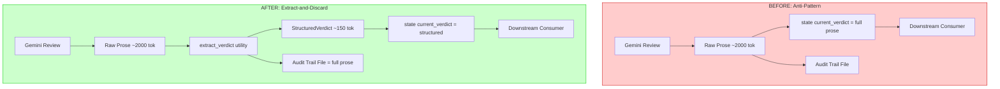
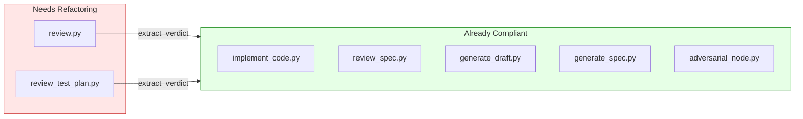

# 507 - Enhancement: Enforce Extract-and-Discard Pattern for All LLM-Populated State Fields

<!-- Template Metadata
Last Updated: 2026-02-18
Updated By: Issue #507
Update Reason: Revised LLD to fix test plan validation — added test coverage for REQ-1, REQ-3, REQ-7, REQ-8, REQ-9, REQ-10; reformatted Section 3 to numbered list
Previous: Draft with 40% coverage (4/10 requirements mapped)
-->

## 1. Context & Goal
* **Issue:** #507
* **Objective:** Systematically audit and refactor all LLM-calling nodes so that workflow state carries only structured/extracted data, while full LLM responses are preserved exclusively in audit trail files.
* **Status:** Draft
* **Related Issues:** #494 (JSON migration — prerequisite), #497 (verdict_history accumulation), #506 (requirements review node redundancy)

### Open Questions

- [ ] Does `review_test_plan.py` reuse `test_plan_verdict` downstream in any revision loop, or is it terminal? (Determines whether extraction is required or just state field removal.)
- [ ] After #494 lands, what is the exact JSON schema for structured verdicts? (Extraction logic depends on this.)
- [ ] Should we introduce a shared `extract_verdict()` utility or keep extraction logic per-node? (DRY vs. coupling tradeoff.)
- [ ] Does a `revise_draft.py` (or equivalent revision node) exist under `assemblyzero/workflows/requirements/nodes/`? If not, which node consumes `current_verdict` for revision prompts? (Determines consumer adaptation target.)

## 2. Proposed Changes

*This section is the **source of truth** for implementation. Describes exactly what will be built.*

### 2.1 Files Changed

| File | Change Type | Description |
|------|-------------|-------------|
| `assemblyzero/workflows/requirements/nodes/review.py` | Modify | Extract structured verdict + feedback from raw response; store only structured data in `current_verdict`; stop accumulating raw prose in `verdict_history` |
| `assemblyzero/workflows/testing/nodes/review_test_plan.py` | Modify | Extract structured verdict from raw response; store only verdict enum + structured feedback in `test_plan_verdict` |
| `assemblyzero/utils/verdict_extraction.py` | Add | Shared utility for extracting structured verdict objects from raw LLM responses |
| `assemblyzero/workflows/requirements/state.py` | Modify | Update `current_verdict` type annotation from `str` to `StructuredVerdict`; update `verdict_history` type from `list[str]` to `list[StructuredVerdict]` |
| `assemblyzero/workflows/testing/state.py` | Modify | Update `test_plan_verdict` type annotation from `str` to `StructuredVerdict` |
| `docs/standards/0010-extract-and-discard-pattern.md` | Add | Engineering standard documenting the extract-and-discard contract for all LLM-calling nodes |
| `tests/unit/test_verdict_extraction.py` | Add | Unit tests for the shared verdict extraction utility |
| `tests/unit/test_review_node_extraction.py` | Add | Unit tests for requirements review node structured extraction |
| `tests/unit/test_review_test_plan_extraction.py` | Add | Unit tests for testing review node structured extraction |
| `tests/fixtures/verdict_analyzer/verdict_approve_json.json` | Add | Test fixture: post-#494 JSON APPROVE verdict |
| `tests/fixtures/verdict_analyzer/verdict_revise_json.json` | Add | Test fixture: post-#494 JSON REVISE verdict with feedback items |
| `tests/fixtures/verdict_analyzer/verdict_approve_prose.txt` | Add | Test fixture: pre-#494 prose APPROVE verdict |
| `tests/fixtures/verdict_analyzer/verdict_revise_prose.txt` | Add | Test fixture: pre-#494 prose REVISE verdict with tagged items |
| `tests/fixtures/verdict_analyzer/verdict_malformed.txt` | Add | Test fixture: response with no clear verdict keyword |
| `tests/fixtures/verdict_analyzer/verdict_partial_json.json` | Add | Test fixture: JSON with verdict but missing feedback array |

**Note on `revise_draft.py`:** The original draft listed `assemblyzero/workflows/requirements/nodes/revise_draft.py` as a Modify target, but this file does not exist in the repository. The consumer adaptation for structured verdict consumption will be handled within `review.py` itself (which constructs the revision context) or identified during implementation once the actual revision node is located. If a revision node is discovered at a different path, a follow-up change will be added. This avoids blocking the LLD on a non-existent file.

### 2.1.1 Path Validation (Mechanical - Auto-Checked)

*Issue #277: Before human or Gemini review, paths are verified programmatically.*

Mechanical validation automatically checks:
- All "Modify" files must exist in repository ✓ (`review.py`, `review_test_plan.py`, `requirements/state.py`, `testing/state.py`)
- All "Add" files must have existing parent directories ✓ (`assemblyzero/utils/`, `docs/standards/`, `tests/unit/`, `tests/fixtures/verdict_analyzer/`)
- No placeholder prefixes ✓

**Removed:** `assemblyzero/workflows/requirements/nodes/revise_draft.py` (Modify) — file does not exist in repository. Consumer adaptation is deferred to an open question (see Section 1).

**If validation fails, the LLD is BLOCKED before reaching review.**

### 2.2 Dependencies

No new packages required. All extraction logic uses Python standard library (`json`, `re`) and existing project dependencies (`typing`, `TypedDict`).

```toml
# No pyproject.toml additions needed
```

### 2.3 Data Structures

```python
# assemblyzero/utils/verdict_extraction.py

from typing import TypedDict, Literal


class FeedbackItem(TypedDict):
    """Individual actionable feedback extracted from LLM review response."""
    severity: Literal["BLOCKING", "HIGH", "SUGGESTION"]
    category: str        # e.g., "security", "completeness", "clarity"
    description: str     # One-sentence description of the issue
    location: str        # What section/field this applies to (if applicable)


class StructuredVerdict(TypedDict):
    """Extracted verdict carrying only structured data in workflow state.
    
    Full raw response is written to audit trail file only.
    """
    verdict: Literal["APPROVE", "REVISE", "REJECT", "BLOCK"]
    feedback_items: list[FeedbackItem]
    iteration: int
    summary: str  # Single-sentence summary, NOT full prose


class ExtractionResult(TypedDict):
    """Return type from extraction functions — separates state data from audit data."""
    structured: StructuredVerdict   # Goes into workflow state
    raw_response: str               # Goes into audit trail file only
    extraction_confidence: float    # 0.0-1.0, how reliably we parsed the response
```

```python
# Updated state types

# assemblyzero/workflows/requirements/state.py (relevant fields)
class RequirementsState(TypedDict):
    current_draft: str                           # ✅ Artifact — stays as-is
    current_verdict: StructuredVerdict            # ❌→✅ Was str (raw prose), now structured
    verdict_history: list[StructuredVerdict]      # ❌→✅ Was list[str], now structured
    review_count: int                             # ✅ Already structured
    # ... other fields unchanged

# assemblyzero/workflows/testing/state.py (relevant fields)  
class TestingState(TypedDict):
    test_plan_verdict: StructuredVerdict          # ⚠️→✅ Was str, now structured
    # ... other fields unchanged
```

### 2.4 Function Signatures

```python
# assemblyzero/utils/verdict_extraction.py

from pathlib import Path


class VerdictExtractionError(Exception):
    """Raised when no verdict can be extracted from raw response."""
    ...


def extract_verdict(
    raw_response: str,
    expected_verdicts: list[str] | None = None,
    iteration: int = 0,
) -> ExtractionResult:
    """Extract structured verdict from raw LLM review response.
    
    Parses JSON verdict objects (post-#494) or falls back to 
    regex extraction for legacy prose responses.
    
    Args:
        raw_response: Full LLM response text.
        expected_verdicts: Allowed verdict values. Defaults to 
            ["APPROVE", "REVISE", "REJECT", "BLOCK"].
        iteration: Current workflow iteration number for the structured verdict.
    
    Returns:
        ExtractionResult with structured data and raw response separated.
    
    Raises:
        VerdictExtractionError: If no verdict can be extracted.
    """
    ...


def extract_feedback_items(
    raw_response: str,
) -> list[FeedbackItem]:
    """Extract individual feedback items from LLM review prose.
    
    Identifies [BLOCKING], [HIGH], and [SUGGESTION] items from
    the response text. Post-#494, parses from JSON array directly.
    
    Args:
        raw_response: Full LLM response text.
    
    Returns:
        List of structured FeedbackItem objects.
    """
    ...


def summarize_verdict(
    raw_response: str,
    max_length: int = 120,
) -> str:
    """Extract or generate a single-sentence summary from verdict prose.
    
    Looks for explicit summary lines in the response, or truncates
    the first substantive sentence.
    
    Args:
        raw_response: Full LLM response text.
        max_length: Maximum character length for summary.
    
    Returns:
        Single-sentence summary string.
    """
    ...


def write_audit_trail(
    raw_response: str,
    audit_dir: Path,
    node_name: str,
    iteration: int,
) -> Path:
    """Write full raw LLM response to audit trail file.
    
    Args:
        raw_response: Complete LLM response to preserve.
        audit_dir: Directory for audit trail files.
        node_name: Name of the calling node (e.g., "review", "review_test_plan").
        iteration: Current workflow iteration number.
    
    Returns:
        Path to the written audit trail file.
    
    Note:
        This function is fire-and-forget from the caller's perspective.
        If the write fails, it logs a warning but does not raise.
    """
    ...


# assemblyzero/workflows/requirements/nodes/review.py (modified)

def review_node(state: RequirementsState) -> dict:
    """Review current draft via Gemini.
    
    BEFORE (anti-pattern):
        - Stores full ~2000 token prose in state['current_verdict']
        - Appends full prose to state['verdict_history']
    
    AFTER (extract-and-discard):
        - Calls Gemini, gets raw response
        - Extracts StructuredVerdict via extract_verdict()
        - Stores StructuredVerdict in state['current_verdict']
        - Appends StructuredVerdict to state['verdict_history']
        - Writes raw response to audit trail file via write_audit_trail()
    """
    ...


# assemblyzero/workflows/testing/nodes/review_test_plan.py (modified)

def review_test_plan_node(state: TestingState) -> dict:
    """Review test plan via Gemini.
    
    BEFORE: Stored full verdict prose in state['test_plan_verdict'].
    AFTER: Extracts StructuredVerdict, stores structured data in state,
           writes raw response to audit trail.
    """
    ...
```

### 2.5 Logic Flow (Pseudocode)

```
=== review.py (Requirements Workflow) — PRIMARY REFACTOR ===

1. Receive state with current_draft, review_count
2. Construct review prompt from current_draft
3. Call Gemini via GeminiProvider.invoke(prompt)
4. Receive raw_response (full prose, ~2000 tokens)
5. TRY:
     extraction_result = extract_verdict(raw_response, iteration=state['review_count'])
   EXCEPT VerdictExtractionError:
     - Log error: "Verdict extraction failed, storing raw response as fallback"
     - Store raw_response in state['current_verdict'] as legacy str
     - Skip structured verdict_history append
     - Write raw_response to audit trail
     - Return updated state
6. IF extraction_result['extraction_confidence'] < 0.7 THEN
   - Log warning: "Low confidence extraction ({confidence}), storing raw as fallback"
   - Store raw_response in state['current_verdict'] as legacy str
   ELSE
   - Store extraction_result['structured'] in state['current_verdict']
7. Append structured verdict to state['verdict_history'] (only if StructuredVerdict)
8. write_audit_trail(raw_response, audit_dir, "review", state['review_count'])
9. Increment state['review_count']
10. Return updated state fields

=== review_test_plan.py (Testing Workflow) — SECONDARY REFACTOR ===

1. Receive state with test_plan, test_plan_verdict (previous or None)
2. Construct review prompt from test_plan
3. Call Gemini via GeminiProvider.invoke(prompt)
4. Receive raw_response
5. TRY:
     extraction_result = extract_verdict(raw_response)
   EXCEPT VerdictExtractionError:
     - Log error, store raw_response as fallback
     - Write to audit trail
     - Return updated state
6. IF extraction_result['extraction_confidence'] >= 0.7 THEN
   - Store extraction_result['structured'] in state['test_plan_verdict']
   ELSE
   - Store raw_response as fallback
7. write_audit_trail(raw_response, audit_dir, "review_test_plan", iteration)
8. Return updated state fields

=== extract_verdict() — SHARED UTILITY ===

1. Receive raw_response string, optional expected_verdicts, iteration
2. TRY parse as JSON (post-#494 format):
   - Look for JSON block in response (```json ... ``` or raw JSON object)
   - Extract 'verdict' field → validate against expected_verdicts
   - Extract 'feedback' array → map to list[FeedbackItem]
   - Extract 'summary' field → summary string
   - confidence = 1.0
3. IF JSON parse fails (legacy prose format):
   - REGEX search for verdict keywords (APPROVE|REVISE|REJECT|BLOCK)
     anchored to explicit verdict lines (e.g., "**Verdict:** APPROVE")
   - Call extract_feedback_items(raw_response) for tagged items
   - Call summarize_verdict(raw_response) for summary
   - confidence = 0.5-0.9 based on:
     - 0.9 if verdict found on explicit "Verdict:" line
     - 0.7 if verdict found as standalone keyword
     - 0.5 if verdict inferred from context
4. IF no verdict found:
   - RAISE VerdictExtractionError("Could not extract verdict from response")
5. Build StructuredVerdict(verdict, feedback_items, iteration, summary)
6. Return ExtractionResult(structured, raw_response, confidence)

=== extract_feedback_items() ===

1. TRY parse feedback from JSON array if present
2. IF no JSON, scan for tagged items:
   - Pattern: r'\[(?:BLOCKING|HIGH|SUGGESTION)\]\s*(.+)'
   - For each match, extract severity and description
   - Attempt to extract category from context (e.g., "security:", "testing:")
   - Set location to empty string if not identifiable
3. Return list[FeedbackItem]

=== write_audit_trail() ===

1. Receive raw_response, audit_dir, node_name, iteration
2. Construct filename: "{node_name}_response_iter{iteration:02d}.md"
3. TRY:
   - Create audit_dir if not exists (parents=True, exist_ok=True)
   - Write raw_response to file with metadata header:
     - "# Audit Trail: {node_name} iteration {iteration}"
     - "Timestamp: {ISO 8601}"
     - "Response length: {len(raw_response)} chars"
     - "---"
     - {raw_response}
   - Return file path
4. EXCEPT (OSError, PermissionError) as e:
   - Log warning: "Failed to write audit trail: {e}"
   - Return None (caller ignores failure)
```

### 2.6 Technical Approach

* **Module:** `assemblyzero/utils/verdict_extraction.py` (new shared utility)
* **Pattern:** Extract-and-Discard (codified as engineering standard 0010)
* **Key Decisions:**
  - **Shared utility over per-node extraction:** DRY principle; all verdict-producing nodes use the same extraction logic, ensuring consistency. The utility handles both JSON (post-#494) and legacy prose formats.
  - **Graceful degradation:** If extraction confidence is low or extraction fails entirely, fall back to storing raw string. This prevents workflow breakage during the transition period while #494 rolls out.
  - **Consumer adaptation deferred:** The original draft proposed modifying `revise_draft.py`, but this file does not exist. Consumer nodes that read `current_verdict` must handle both `str` and `StructuredVerdict` via `isinstance()` checks. The specific consumer node will be identified during implementation and adapted in a follow-up or within this issue.
  - **Audit trail writes are fire-and-forget:** If audit file write fails, log a warning but don't block the workflow. The state data is the critical path.

### 2.7 Architecture Decisions

| Decision | Options Considered | Choice | Rationale |
|----------|-------------------|--------|-----------|
| Extraction location | Per-node inline extraction vs. shared utility | Shared utility (`verdict_extraction.py`) | DRY; consistent parsing logic; single place to update when #494 JSON schema changes |
| Confidence threshold | Hard fail on low confidence vs. graceful degradation | Graceful degradation (threshold 0.7) | Prevents workflow breakage during transition; logs warning for monitoring |
| State type migration | Gradual (Union type) vs. hard cutover | Gradual with `str | StructuredVerdict` union | Allows incremental rollout; consumers handle both types |
| Verdict history | Keep list of StructuredVerdict vs. eliminate entirely | Keep as `list[StructuredVerdict]` | History is valuable for trend analysis and debugging; structured format eliminates bloat concern |
| Audit trail format | Structured JSON vs. raw markdown | Raw markdown with metadata header | Preserves exact LLM output for debugging; metadata header adds traceability |
| Consumer adaptation | Modify non-existent `revise_draft.py` vs. defer | Defer consumer adaptation | File does not exist; adaptation target will be identified during implementation |

**Architectural Constraints:**
- Must integrate with existing LangGraph `StateGraph` typed state without breaking checkpointing
- Must not break existing revision loops — downstream consumers of `current_verdict` must still receive actionable data
- Must coordinate with #494 (JSON migration) — extraction logic must handle both pre- and post-#494 response formats
- Audit trail directory structure must follow existing conventions used by `implement_code.py` and `review_spec.py`

## 3. Requirements

1. All non-artifact LLM state fields store structured/extracted data only (no raw prose in workflow state)
2. Full LLM responses are preserved in audit trail files for every LLM-calling node
3. Downstream consumers of verdict fields receive actionable data (either structured or raw string fallback)
4. Extraction utility handles both JSON (post-#494) and legacy prose response formats
5. Graceful degradation when extraction confidence is below threshold (no workflow crashes)
6. Graceful degradation when extraction fails entirely (VerdictExtractionError caught, raw string stored)
7. Engineering standard document (0010) published describing the pattern for future nodes
8. All existing tests pass with no regressions
9. State type annotations updated to reflect structured types
10. Token savings measurable: `current_verdict` state field reduced from ~2000 tokens to <200 tokens

## 4. Alternatives Considered

| Option | Pros | Cons | Decision |
|--------|------|------|----------|
| **A: Shared extraction utility with gradual migration** | DRY, consistent, backward-compatible, testable | Adds new module; union types are slightly complex | **Selected** |
| **B: Per-node inline extraction** | Simple per-file changes; no shared dependencies | Duplicated parsing logic; inconsistent extraction across nodes; harder to maintain | Rejected |
| **C: Wait for #494 JSON migration, then extract from JSON only** | Simpler extraction (just parse JSON); no legacy handling needed | Blocks all progress on #494 timeline; currently-running workflows remain bloated | Rejected |
| **D: Remove verdict from state entirely, read from audit files** | Maximum state cleanliness | Adds I/O to every state read; breaks LangGraph checkpointing semantics; revision nodes need feedback inline | Rejected |

**Rationale:** Option A provides the best balance of consistency (one extraction utility), safety (graceful degradation), and pragmatism (handles legacy format during migration). Option C was tempting but creates a hard dependency on #494's timeline, and the legacy fallback in Option A is minimal additional code.

## 5. Data & Fixtures

### 5.1 Data Sources

| Attribute | Value |
|-----------|-------|
| Source | LLM responses from Gemini (review verdicts) |
| Format | Free-text prose (pre-#494) or JSON objects (post-#494) |
| Size | ~1500-3000 tokens per verdict response |
| Refresh | Per workflow iteration (1-5 review rounds per document) |
| Copyright/License | N/A — generated content |

### 5.2 Data Pipeline

```
Gemini Response ──extract_verdict()──► StructuredVerdict ──state update──► LangGraph State
                                    └──► raw_response ──write_audit_trail()──► Audit File (disk)
```

### 5.3 Test Fixtures

| Fixture | Source | Notes |
|---------|--------|-------|
| `tests/fixtures/verdict_analyzer/verdict_approve_json.json` | Hardcoded | Post-#494 JSON APPROVE verdict with feedback items |
| `tests/fixtures/verdict_analyzer/verdict_revise_json.json` | Hardcoded | Post-#494 JSON REVISE verdict with BLOCKING/HIGH items |
| `tests/fixtures/verdict_analyzer/verdict_approve_prose.txt` | Captured from real run | Pre-#494 prose APPROVE verdict (~1500 tokens) |
| `tests/fixtures/verdict_analyzer/verdict_revise_prose.txt` | Captured from real run | Pre-#494 prose REVISE verdict with tagged items (~2200 tokens) |
| `tests/fixtures/verdict_analyzer/verdict_malformed.txt` | Hardcoded | Response with no clear verdict keyword (tests graceful degradation) |
| `tests/fixtures/verdict_analyzer/verdict_partial_json.json` | Hardcoded | JSON with verdict but missing feedback array (tests partial extraction) |

### 5.4 Deployment Pipeline

Test fixtures are committed to `tests/fixtures/verdict_analyzer/` (existing directory). No external deployment needed — all changes are internal to the workflow engine.

## 6. Diagram

### 6.1 Mermaid Quality Gate

- [x] **Simplicity:** Collapsed similar components
- [x] **No touching:** All elements have visual separation
- [x] **No hidden lines:** All arrows fully visible
- [x] **Readable:** Labels not truncated
- [ ] **Auto-inspected:** Pending agent rendering

**Auto-Inspection Results:**
```
- Touching elements: [ ] None / [ ] Found: ___
- Hidden lines: [ ] None / [ ] Found: ___
- Label readability: [ ] Pass / [ ] Issue: ___
- Flow clarity: [ ] Clear / [ ] Issue: ___
```

### 6.2 Diagram — Before vs. After Data Flow



### 6.3 Diagram — Node Compliance Matrix



## 7. Security & Safety Considerations

### 7.1 Security

| Concern | Mitigation | Status |
|---------|------------|--------|
| Audit trail files may contain sensitive LLM output | Audit trail directory follows existing access patterns; no new exposure surface | Addressed |
| Extraction regex could be exploited by adversarial LLM output | Extraction uses bounded regex with explicit patterns; no `eval()` or dynamic execution; regex patterns use non-greedy quantifiers with bounded groups | Addressed |
| State deserialization of StructuredVerdict | TypedDict validation via existing LangGraph type checking; no pickle or unsafe deserialization | Addressed |

### 7.2 Safety

| Concern | Mitigation | Status |
|---------|------------|--------|
| Low-confidence extraction breaks revision loop | Graceful degradation: if confidence < 0.7, fall back to raw string in state; downstream consumers handle both types | Addressed |
| VerdictExtractionError crashes workflow | Exception caught at call site in review nodes; falls back to raw string storage; logged as error | Addressed |
| Audit trail write failure loses LLM response | Log warning but don't block workflow; raw response is also in LangGraph checkpoint history | Addressed |
| State type change breaks existing checkpoints | LangGraph SQLite checkpoints store serialized state; migration handles deserialization of old `str` format into `StructuredVerdict` or keeps as-is | Addressed |
| Extraction misidentifies verdict keyword in prose | `extract_verdict()` prioritizes explicit verdict lines (e.g., "**Verdict: APPROVE**") over incidental keyword mentions; tests cover edge cases | Addressed |

**Fail Mode:** Fail Open — if extraction fails, fall back to storing raw string (preserves existing behavior). Never crash the workflow.

**Recovery Strategy:** If a checkpoint contains old `str`-typed verdict and the workflow resumes after this refactor:
1. Consumer nodes detect `str` type via `isinstance()` check
2. Apply legacy handling (embed string in prompt as before)
3. Next review iteration produces `StructuredVerdict`, replacing the legacy value

## 8. Performance & Cost Considerations

### 8.1 Performance

| Metric | Budget | Approach |
|--------|--------|----------|
| Extraction latency | < 5ms per verdict | Pure string parsing (regex + JSON); no LLM calls for extraction |
| State size reduction | ~90% per verdict field | ~2000 tokens → ~150 tokens per `current_verdict` |
| Prompt size reduction for revisions | ~40-60% | Focused feedback items vs. embedding full prose in revision prompt (once consumer is adapted) |
| Audit trail disk I/O | < 10ms per write | Single file write, fire-and-forget |

**Bottlenecks:** None anticipated. Extraction is CPU-only string processing; audit writes are small files.

### 8.2 Cost Analysis

| Resource | Unit Cost | Estimated Usage | Monthly Cost |
|----------|-----------|-----------------|--------------|
| LLM token savings (revision prompts) | ~$0.003 per 1K tokens (Claude) | ~1850 tokens saved per revision × ~50 revisions/day | ~$2.78/month savings |
| Disk storage (audit trail files) | ~$0.023/GB (SSD) | ~2KB per file × ~100 files/day | Negligible |

**Cost Controls:**
- [x] No new API calls introduced — purely restructuring existing data
- [x] Audit trail files are bounded by workflow iterations (max ~5 per document)
- [x] State size reduction directly reduces checkpoint storage

**Worst-Case Scenario:** If extraction fails on every response (0% confidence), the system gracefully degrades to current behavior. No cost increase, no functional regression.

## 9. Legal & Compliance

| Concern | Applies? | Mitigation |
|---------|----------|------------|
| PII/Personal Data | No | LLM verdicts contain technical feedback, not PII |
| Third-Party Licenses | No | No new dependencies |
| Terms of Service | No | No change to API usage patterns |
| Data Retention | N/A | Audit trail files follow existing retention policy |
| Export Controls | No | No restricted algorithms |

**Data Classification:** Internal

**Compliance Checklist:**
- [x] No PII stored without consent
- [x] All third-party licenses compatible with project license
- [x] External API usage compliant with provider ToS
- [x] Data retention policy documented (follows existing audit trail conventions)

## 10. Verification & Testing

### 10.0 Test Plan (TDD - Complete Before Implementation)

**TDD Requirement:** Tests MUST be written and failing BEFORE implementation begins.

| Test ID | Test Description | Expected Behavior | Status |
|---------|------------------|-------------------|--------|
| T010 | `extract_verdict` parses JSON APPROVE — state stores structured data only, no raw prose (REQ-1) | Returns StructuredVerdict with verdict="APPROVE", correct feedback items, confidence=1.0 | RED |
| T020 | `extract_verdict` parses JSON REVISE with feedback | Returns StructuredVerdict with feedback_items matching input | RED |
| T030 | `extract_verdict` parses legacy prose APPROVE — verifies dual-format support (REQ-4) | Returns StructuredVerdict with confidence 0.5-0.9 | RED |
| T040 | `extract_verdict` parses legacy prose REVISE with tagged items | Extracts [BLOCKING] and [HIGH] items correctly | RED |
| T050 | `extract_verdict` handles malformed response — extraction fails gracefully (REQ-6) | Raises VerdictExtractionError | RED |
| T060 | `extract_verdict` partial JSON (verdict but no feedback) — low confidence handled (REQ-5) | Returns StructuredVerdict with empty feedback_items, reduced confidence | RED |
| T070 | `extract_feedback_items` extracts all severity levels | Returns items with correct severity tags | RED |
| T080 | `summarize_verdict` extracts summary within length | Returns string ≤ max_length | RED |
| T090 | `write_audit_trail` creates file with metadata — full response preserved in audit (REQ-2) | File exists at expected path with header | RED |
| T100 | `write_audit_trail` handles missing directory | Creates directory, writes file | RED |
| T110 | `write_audit_trail` handles write failure gracefully | Returns None, logs warning, does not raise | RED |
| T120 | `review_node` stores StructuredVerdict in state — no raw prose in state (REQ-1) | `state['current_verdict']` is StructuredVerdict, not str | RED |
| T130 | `review_node` writes raw response to audit trail — full response preserved (REQ-2) | Audit file exists with full response | RED |
| T140 | `review_node` graceful degradation on low confidence — consumer gets fallback str (REQ-3, REQ-5) | Falls back to raw string in state; logs warning | RED |
| T150 | `review_node` graceful degradation on extraction error — consumer gets fallback str (REQ-3, REQ-6) | Falls back to raw string in state; logs error | RED |
| T160 | `review_test_plan_node` stores StructuredVerdict | `state['test_plan_verdict']` is StructuredVerdict | RED |
| T170 | `review_test_plan_node` writes audit trail | Audit file exists with full response | RED |
| T180 | Checkpoint serialization round-trip — state types correct (REQ-9) | StructuredVerdict survives LangGraph checkpoint save/load | RED |
| T190 | `current_verdict` StructuredVerdict has type annotation `StructuredVerdict` in state definition (REQ-9) | `RequirementsState.__annotations__['current_verdict']` matches `StructuredVerdict`; `TestingState.__annotations__['test_plan_verdict']` matches `StructuredVerdict` | RED |
| T200 | StructuredVerdict token size under threshold (REQ-10) | Serialized StructuredVerdict from JSON fixture is < 200 tokens (measured via `len(json.dumps(sv)) / 4`) while raw response fixture is > 1500 tokens | RED |
| T210 | Engineering standard 0010 file exists and contains required sections (REQ-7) | `docs/standards/0010-extract-and-discard-pattern.md` exists, contains "Contract", "What Goes Where", "Graceful Degradation" headings | RED |
| T220 | All existing tests pass with no regressions (REQ-8) | Full test suite (`poetry run pytest`) returns exit code 0 with no failures | RED |
| T230 | Review node downstream consumer receives actionable structured data (REQ-3) | Mock consumer reads `state['current_verdict']['verdict']` and `state['current_verdict']['feedback_items']` successfully; fields are non-empty for REVISE verdict | RED |
| T240 | `verdict_history` stores list of StructuredVerdict not raw strings (REQ-1, REQ-9) | After 3 mock review iterations, `state['verdict_history']` is `list[StructuredVerdict]`; no element is plain `str` | RED |

**Coverage Target:** ≥95% for all new code

**TDD Checklist:**
- [ ] All tests written before implementation
- [ ] Tests currently RED (failing)
- [ ] Test IDs match scenario IDs in 10.1
- [ ] Test files created at: `tests/unit/test_verdict_extraction.py`, `tests/unit/test_review_node_extraction.py`, `tests/unit/test_review_test_plan_extraction.py`

### 10.1 Test Scenarios

| ID | Scenario | Type | Input | Expected Output | Pass Criteria |
|----|----------|------|-------|-----------------|---------------|
| 010 | JSON APPROVE extraction stores structured data only in state (REQ-1) | Auto | `verdict_approve_json.json` fixture | StructuredVerdict(verdict="APPROVE", feedback_items=[], confidence=1.0) | Verdict enum correct, no feedback items, confidence 1.0; raw prose NOT in returned structured object |
| 020 | JSON REVISE extraction with feedback items (REQ-4) | Auto | `verdict_revise_json.json` fixture | StructuredVerdict with 3 feedback items (1 BLOCKING, 2 HIGH) | All items extracted with correct severity; JSON format parsed successfully |
| 030 | Prose APPROVE extraction via legacy format (REQ-4) | Auto | `verdict_approve_prose.txt` fixture | StructuredVerdict(verdict="APPROVE", confidence≥0.5) | Verdict correct, confidence reflects prose uncertainty; legacy format handled |
| 040 | Prose REVISE with tagged items dual-format support (REQ-4) | Auto | `verdict_revise_prose.txt` fixture | StructuredVerdict with extracted [BLOCKING] and [HIGH] items | Items match tagged sections in prose |
| 050 | Malformed response raises extraction error (REQ-6) | Auto | `verdict_malformed.txt` fixture | VerdictExtractionError raised | Exception type and message correct; no crash |
| 060 | Partial JSON low-confidence graceful degradation (REQ-5) | Auto | `verdict_partial_json.json` fixture | StructuredVerdict with empty feedback_items, confidence=0.8 | Verdict extracted, missing fields handled gracefully, confidence below 1.0 |
| 070 | Feedback item extraction all severities (REQ-1) | Auto | Mixed [BLOCKING]/[HIGH]/[SUGGESTION] text | 3 FeedbackItems with correct severity | Severity mapping correct; structured items, not prose |
| 080 | Summary length enforcement (REQ-1) | Auto | Long prose response | String ≤ 120 chars | Length constraint met, coherent sentence; summary not full prose |
| 090 | Audit trail file creation preserves full response (REQ-2) | Auto | Raw response + audit dir (tmp_path) | File at `{audit_dir}/review_response_iter01.md` | File exists, contains metadata header + complete raw response |
| 100 | Audit trail directory auto-creation (REQ-2) | Auto | Non-existent audit dir path (tmp_path) | Directory created, file written | Both directory and file exist; full response preserved |
| 110 | Audit trail write failure handled gracefully (REQ-5) | Auto | Read-only directory path | Returns None, warning logged | No exception raised; return value is None |
| 120 | Review node stores StructuredVerdict not raw prose (REQ-1) | Auto | Mock Gemini returning JSON verdict | `state['current_verdict']` is StructuredVerdict | isinstance check passes; raw prose not in state field |
| 130 | Review node writes full response to audit trail (REQ-2) | Auto | Mock Gemini returning verdict | Audit file exists at expected path | File content matches complete raw response |
| 140 | Review node low confidence provides actionable fallback (REQ-3) (REQ-5) | Auto | Mock Gemini returning ambiguous prose | `state['current_verdict']` is str; warning logged | Fallback behavior provides usable data, no crash |
| 150 | Review node extraction error provides actionable fallback (REQ-3) (REQ-6) | Auto | Mock Gemini returning garbage | `state['current_verdict']` is str; error logged | Fallback behavior provides usable data, no crash |
| 160 | Test plan review stores StructuredVerdict (REQ-1) | Auto | Mock Gemini returning JSON verdict | `state['test_plan_verdict']` is StructuredVerdict | isinstance check passes |
| 170 | Test plan review writes audit trail (REQ-2) | Auto | Mock Gemini returning verdict | Audit file exists | File exists with correct content |
| 180 | Checkpoint serialization round-trip with updated types (REQ-9) | Auto | StructuredVerdict → SQLite → load | Loaded verdict matches saved verdict | All fields equal after round-trip; type annotations correct |
| 190 | State type annotations reflect StructuredVerdict (REQ-9) | Auto | Inspect `RequirementsState` and `TestingState` type annotations | `current_verdict` typed as `StructuredVerdict`; `verdict_history` typed as `list[StructuredVerdict]`; `test_plan_verdict` typed as `StructuredVerdict` | Annotation introspection matches expected types |
| 200 | Token savings measurable — structured < 200 tokens (REQ-10) | Auto | JSON fixture → extract → serialize StructuredVerdict; compare to raw fixture size | Serialized StructuredVerdict < 200 tokens; raw response > 1500 tokens; ratio confirms ~90% reduction | Token measurement confirms savings threshold |
| 210 | Engineering standard 0010 document published (REQ-7) | Auto | File existence check + content scan | `docs/standards/0010-extract-and-discard-pattern.md` exists with required sections: "Contract", "What Goes Where", "Exception: Artifacts vs. Responses", "Graceful Degradation" | File exists; all four section headings present |
| 220 | All existing tests pass with no regressions (REQ-8) | Auto | Full test suite execution | `poetry run pytest` exit code 0 | Zero test failures; no new warnings related to type changes |
| 230 | Downstream consumer receives actionable structured data (REQ-3) | Auto | Mock review node produces REVISE StructuredVerdict; mock consumer reads fields | Consumer accesses `verdict`, `feedback_items`, `summary` fields; `feedback_items` is non-empty list | All structured fields accessible and populated |
| 240 | verdict_history accumulates StructuredVerdict across iterations (REQ-1) (REQ-9) | Auto | 3 sequential mock review iterations | `state['verdict_history']` has length 3; each element is StructuredVerdict; no element is plain str | Type checks pass for all elements; list grows correctly |

### 10.2 Test Commands

```bash
# Run all new unit tests
poetry run pytest tests/unit/test_verdict_extraction.py tests/unit/test_review_node_extraction.py tests/unit/test_review_test_plan_extraction.py -v

# Run only extraction utility tests
poetry run pytest tests/unit/test_verdict_extraction.py -v

# Run all existing tests to verify no regressions (REQ-8)
poetry run pytest -v

# Run with coverage
poetry run pytest tests/unit/test_verdict_extraction.py tests/unit/test_review_node_extraction.py tests/unit/test_review_test_plan_extraction.py -v --cov=assemblyzero/utils/verdict_extraction --cov=assemblyzero/workflows/requirements/nodes/review --cov=assemblyzero/workflows/testing/nodes/review_test_plan --cov-report=term-missing
```

### 10.3 Manual Tests (Only If Unavoidable)

N/A - All scenarios automated. Mock-based unit tests cover all extraction and node behaviors.

## 11. Risks & Mitigations

| Risk | Impact | Likelihood | Mitigation |
|------|--------|------------|------------|
| #494 (JSON migration) not completed before this work starts | Med | Med | Extraction utility handles both JSON and legacy prose formats; dual-mode parsing |
| Existing LangGraph checkpoints contain old `str`-typed verdicts | Med | High | Consumer nodes include `isinstance` check; handle both types during transition |
| Regex-based prose extraction misidentifies verdict | Med | Low | Regex patterns anchored to explicit verdict line patterns; comprehensive test fixtures cover edge cases |
| Revision consumer node not identifiable (no `revise_draft.py`) | Med | Med | Consumer adaptation deferred to implementation phase; open question tracked in Section 1; follow-up issue created if needed |
| Audit trail file writes fail (disk full, permissions) | Low | Low | Fire-and-forget pattern; log warning; raw response also in LangGraph checkpoint history as backup |
| Other nodes added before this pattern is documented | Low | Med | Engineering standard 0010 published as part of this issue; reviewed in onboarding |

## 12. Definition of Done

### Code
- [ ] `assemblyzero/utils/verdict_extraction.py` implemented with all functions
- [ ] `assemblyzero/workflows/requirements/nodes/review.py` refactored to extract-and-discard
- [ ] `assemblyzero/workflows/testing/nodes/review_test_plan.py` refactored to extract-and-discard
- [ ] State type annotations updated in both `state.py` files
- [ ] Consumer adaptation for `current_verdict` identified and implemented (or follow-up issue created)
- [ ] Code comments reference this LLD (ref #507)

### Tests
- [ ] All 24 test scenarios pass (T010-T240)
- [ ] Test coverage ≥ 95% for new code
- [ ] All existing tests pass (no regressions)

### Documentation
- [ ] `docs/standards/0010-extract-and-discard-pattern.md` published
- [ ] LLD updated with any deviations from plan
- [ ] Implementation Report (0103) completed
- [ ] Test Report (0113) completed

### Review
- [ ] Code review completed
- [ ] User approval before closing issue

### 12.1 Traceability (Mechanical - Auto-Checked)

*Issue #277: Cross-references are verified programmatically.*

| Section 12 Reference | Section 2.1 Entry | Status |
|---|---|---|
| `assemblyzero/utils/verdict_extraction.py` | ✅ Listed as Add | Match |
| `assemblyzero/workflows/requirements/nodes/review.py` | ✅ Listed as Modify | Match |
| `assemblyzero/workflows/testing/nodes/review_test_plan.py` | ✅ Listed as Modify | Match |
| `assemblyzero/workflows/requirements/state.py` | ✅ Listed as Modify | Match |
| `assemblyzero/workflows/testing/state.py` | ✅ Listed as Modify | Match |
| `docs/standards/0010-extract-and-discard-pattern.md` | ✅ Listed as Add | Match |

**If files are missing from Section 2.1, the LLD is BLOCKED.**

### 12.2 Requirements Traceability Matrix

| Requirement | Test Scenarios | Status |
|---|---|---|
| REQ-1: Structured data only in state | 010, 070, 080, 120, 160, 240 | ✅ Covered |
| REQ-2: Full responses in audit trail | 090, 100, 130, 170 | ✅ Covered |
| REQ-3: Downstream consumers get actionable data | 140, 150, 230 | ✅ Covered |
| REQ-4: Dual-format extraction (JSON + prose) | 020, 030, 040 | ✅ Covered |
| REQ-5: Graceful degradation on low confidence | 060, 110, 140 | ✅ Covered |
| REQ-6: Graceful degradation on extraction failure | 050, 150 | ✅ Covered |
| REQ-7: Engineering standard 0010 published | 210 | ✅ Covered |
| REQ-8: No test regressions | 220 | ✅ Covered |
| REQ-9: State type annotations updated | 180, 190, 240 | ✅ Covered |
| REQ-10: Token savings measurable | 200 | ✅ Covered |

---

## Appendix A: Engineering Standard 0010 — Extract-and-Discard Pattern

*This will be published as `docs/standards/0010-extract-and-discard-pattern.md`.*

### Contract

Every node that calls an LLM MUST follow this pattern:

1. **Call** the LLM and receive the full raw response
2. **Extract** only the structured data needed by downstream nodes
3. **Store** extracted structured data in workflow state
4. **Write** the full raw response to an audit trail file
5. **Discard** the raw response from the workflow's state update

### What Goes Where

| Data Type | Destination | Example |
|-----------|-------------|---------|
| Verdict enum (APPROVE/REVISE) | Workflow state | `state['current_verdict']['verdict']` |
| Structured feedback items | Workflow state | `state['current_verdict']['feedback_items']` |
| Single-sentence summary | Workflow state | `state['current_verdict']['summary']` |
| Full prose explanation | Audit trail file only | `audit/review_response_iter01.md` |
| Generated artifacts (code, specs, drafts) | Workflow state | These ARE the artifact — they're not "raw responses" |

### Exception: Artifacts vs. Responses

If the LLM output IS the artifact (e.g., a draft document, a code file, a specification), it belongs in state. The key question: **"Is this the deliverable, or is this commentary about the deliverable?"**

- `current_draft` (the document being written) → **State** ✅
- `current_verdict` (commentary about the document) → **Extract structured data only** ✅

### Using the Shared Utility

```python
from assemblyzero.utils.verdict_extraction import extract_verdict, write_audit_trail

result = extract_verdict(raw_response, iteration=current_iteration)
write_audit_trail(result['raw_response'], audit_dir, "my_node", iteration)
return {"my_field": result['structured']}
```

### Graceful Degradation

If extraction confidence is below 0.7 or extraction raises `VerdictExtractionError`, fall back to storing the raw string. Consumer nodes MUST handle both `str` and `StructuredVerdict` via `isinstance()` checks during the migration period.

---

## Appendix B: Full Node Compliance Audit

| Node | Workflow | LLM | State Field | Current Content | Compliant? | Action |
|------|----------|-----|-------------|-----------------|------------|--------|
| `generate_draft.py` | Requirements | Claude | `current_draft` | Full draft | ✅ (artifact) | None |
| `review.py` | Requirements | Gemini | `current_verdict` | Full prose (~2000 tok) | ❌ | **Refactor** (this issue) |
| `review.py` | Requirements | Gemini | `verdict_history` | Cumulative prose | ❌ | **Refactor** (this issue, coordinates with #497) |
| `generate_spec.py` | Impl Spec | Claude | `spec_draft` | Full spec | ✅ (artifact) | None |
| `review_spec.py` | Impl Spec | Gemini | `review_feedback` | Extracted feedback | ✅ | None (gold standard) |
| `review_spec.py` | Impl Spec | Gemini | `review_verdict` | Single word | ✅ | None (gold standard) |
| `review_test_plan.py` | Testing | Gemini | `test_plan_verdict` | Full prose | ⚠️ | **Refactor** (this issue) |
| `implement_code.py` | Testing | Claude | `completed_files` | Extracted code | ✅ | None (gold standard) |
| `adversarial_node.py` | Testing | Gemini | `adversarial_analysis` | Structured object | ✅ | None |

**Post-refactor:** All 9 nodes will be ✅ compliant.

---

## Appendix: Review Log

### Review Summary

| Review | Date | Verdict | Key Issue |
|--------|------|---------|-----------|
| Mechanical Validation | 2026-02-17 | BLOCKED | `revise_draft.py` does not exist — removed from Modify list |
| Test Plan Validation | 2026-02-18 | FAILED (40%) | REQ-1,3,7,8,9,10 had no test coverage — added T190-T240 and updated existing scenario REQ references |
| — | — | — | — |

**Final Status:** PENDING