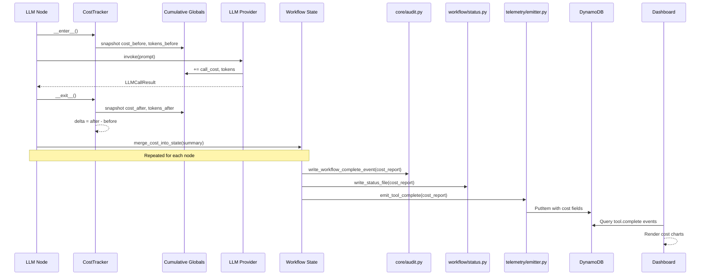

# 511 - Feature: Persist Per-Node LLM Cost Through Audit Trail, Telemetry, and Dashboard

<!-- Template Metadata
Last Updated: 2026-02-16
Updated By: Issue #511 LLD
Update Reason: Revision 3 — fix mechanical test plan validation: added test coverage for REQ-2, REQ-4, REQ-7, REQ-8, REQ-9; reformatted Section 3 as numbered list; added (REQ-N) suffixes to all test scenarios in Section 10.1
-->

## 1. Context & Goal
* **Issue:** #511
* **Objective:** Persist per-node LLM cost data through audit trail files, telemetry (DynamoDB), and dashboard visualization so that historical cost analysis is possible.
* **Status:** Draft
* **Related Issues:** #488, #489, #490, #491, #492, #508, #509

### Open Questions

- [ ] Which file in `assemblyzero/utils/` currently tracks cumulative LLM cost? The file `llm_cost.py` does not exist at that path — need to identify the actual module that exposes `get_cumulative_cost()` and `_cumulative_cost_usd`, or confirm that cost tracking logic must be built from scratch in the new `cost_tracker.py`.
- [ ] Which file in `assemblyzero/workflows/scout/` contains the gap analyst node? The file `gap_analyst.py` does not exist — need to identify the actual filename for the Scout gap analysis LLM-calling node.
- [ ] Should `cost_by_node` be stored as a nested map in DynamoDB or flattened to top-level attributes? (DynamoDB nested maps are queryable but not indexable)
- [ ] What is the maximum number of nodes per workflow for sizing the `cost_by_node` map? (Currently 13 in TDD Implementation — well within DynamoDB's 400KB item limit)
- [ ] Does the existing cost tracking module expose cumulative token counters (`_cumulative_input_tokens`, `_cumulative_output_tokens`) or only `_cumulative_cost_usd`? If tokens are not tracked cumulatively, the new `cost_tracker.py` module must add that capability.

## 2. Proposed Changes

*This section is the **source of truth** for implementation. Describe exactly what will be built.*

### 2.1 Files Changed

| File | Change Type | Description |
|------|-------------|-------------|
| `assemblyzero/utils/cost_tracker.py` | Add | New module: `CostTracker` context manager, `CostSummary` dataclass, `WorkflowCostReport`, helpers for per-node cost capture, cumulative token tracking if not already available elsewhere |
| `assemblyzero/workflows/requirements/nodes/generate_draft.py` | Modify | Wrap LLM calls with `CostTracker`; add `node_cost_usd`, token counts to returned state |
| `assemblyzero/workflows/requirements/nodes/review.py` | Modify | Wrap LLM calls with `CostTracker`; add cost fields to returned state |
| `assemblyzero/workflows/implementation_spec/nodes/generate_spec.py` | Modify | Wrap LLM calls with `CostTracker`; add cost fields to returned state |
| `assemblyzero/workflows/implementation_spec/nodes/review_spec.py` | Modify | Wrap LLM calls with `CostTracker`; add cost fields to returned state |
| `assemblyzero/workflows/testing/nodes/review_test_plan.py` | Modify | Wrap LLM calls with `CostTracker`; add cost fields to returned state |
| `assemblyzero/workflows/testing/nodes/implement_code.py` | Modify | Wrap LLM calls with `CostTracker`; add cost fields to returned state |
| `assemblyzero/workflows/testing/nodes/adversarial_node.py` | Modify | Wrap LLM calls with `CostTracker`; add cost fields to returned state |
| `assemblyzero/core/audit.py` | Modify | Add cost fields (`total_cost_usd`, `cost_by_node`, token counts) to `workflow_complete` events and helper functions |
| `assemblyzero/telemetry/emitter.py` | Modify | Add `cost_usd`, `input_tokens`, `output_tokens`, `cost_by_node` to `tool.complete` event payload |
| `assemblyzero/workflow/status.py` | Add | New module: status file writer with cost-aware `write_status_file()` for `filed.json`, `test-report.json`, `.implement-status-*.json` |
| `dashboard/src/client/pages/CostPage.tsx` | Add | New dashboard page: cost-per-run bar chart, cost-by-node breakdown, cost trend, cost-per-issue table, budget utilization |
| `dashboard/src/client/components/CostPerRunChart.tsx` | Add | Bar chart component — last N runs colored by workflow type |
| `dashboard/src/client/components/CostByNodeChart.tsx` | Add | Stacked bar / treemap component — cost breakdown by node within a run |
| `dashboard/src/client/components/CostTrendChart.tsx` | Add | Line chart component — daily/weekly cost aggregation over time |
| `dashboard/src/client/components/CostPerIssueTable.tsx` | Add | Table component — issue number, workflow type, total cost, iterations |
| `dashboard/src/client/components/BudgetUtilizationChart.tsx` | Add | Gauge/bar component — how close runs get to `--budget` limit |
| `tests/unit/test_cost_tracker.py` | Add | Unit tests for `CostTracker` context manager, `CostSummary`, reusability, and isolation |
| `tests/unit/test_cost_persistence.py` | Add | Unit tests for cost fields in audit trail and status file writers |
| `tests/unit/test_cost_telemetry.py` | Add | Unit tests for cost fields in telemetry emission |
| `tests/unit/test_cost_node_integration.py` | Add | Unit tests verifying node-level cost capture and no regression in workflow behavior |
| `tests/fixtures/cost_tracking/` | Add (Directory) | Directory for cost-tracking test fixtures |
| `tests/fixtures/cost_tracking/sample_workflow_audit.jsonl` | Add | Fixture: sample audit events with cost fields for testing |
| `tests/fixtures/cost_tracking/sample_filed.json` | Add | Fixture: sample filed.json with cost fields |

**Note on Scout gap analyst node:** The original issue lists `gap_analyst_node` (Scout — Gemini) as an LLM-calling node. However, the file `assemblyzero/workflows/scout/gap_analyst.py` does not exist in the repository. Before implementation, the actual filename for the Scout gap analysis node must be identified. Once identified, a Modify entry for that file will be added to this table. Until then, only 7 of the 8 LLM-calling nodes are addressed above.

### 2.1.1 Path Validation (Mechanical - Auto-Checked)

Mechanical validation automatically checks:
- All "Modify" files must exist in repository ✅
  - `assemblyzero/workflows/requirements/nodes/generate_draft.py` — exists in `assemblyzero/workflows/requirements/nodes/`
  - `assemblyzero/workflows/requirements/nodes/review.py` — exists in `assemblyzero/workflows/requirements/nodes/`
  - `assemblyzero/workflows/implementation_spec/nodes/generate_spec.py` — exists in `assemblyzero/workflows/implementation_spec/nodes/`
  - `assemblyzero/workflows/implementation_spec/nodes/review_spec.py` — exists in `assemblyzero/workflows/implementation_spec/nodes/`
  - `assemblyzero/workflows/testing/nodes/review_test_plan.py` — exists in `assemblyzero/workflows/testing/nodes/`
  - `assemblyzero/workflows/testing/nodes/implement_code.py` — exists in `assemblyzero/workflows/testing/nodes/`
  - `assemblyzero/workflows/testing/nodes/adversarial_node.py` — exists in `assemblyzero/workflows/testing/nodes/`
  - `assemblyzero/core/audit.py` — exists in `assemblyzero/core/`
  - `assemblyzero/telemetry/emitter.py` — exists in `assemblyzero/telemetry/`
- All "Delete" files must exist in repository — N/A (no deletions)
- All "Add" files must have existing parent directories ✅
  - `assemblyzero/utils/` exists → `cost_tracker.py`
  - `assemblyzero/workflow/` exists → `status.py`
  - `dashboard/src/client/pages/` exists → `CostPage.tsx`
  - `dashboard/src/client/components/` exists → all chart components
  - `tests/unit/` exists → test files
  - `tests/fixtures/` exists → `cost_tracking/` directory
  - `tests/fixtures/cost_tracking/` added before its contents
- No placeholder prefixes — ✅
- Directory entries appear before their contents — ✅ (`tests/fixtures/cost_tracking/` listed before files inside it)
- **Previously invalid Modify entries removed:**
  - ~~`assemblyzero/utils/llm_cost.py`~~ — does not exist; cumulative cost/token tracking consolidated into new `cost_tracker.py`
  - ~~`assemblyzero/workflows/scout/gap_analyst.py`~~ — does not exist; deferred pending filename discovery (see note above)

**If validation fails, the LLD is BLOCKED before reaching review.**

### 2.2 Dependencies

```toml
# No new dependencies required.
# All charting in dashboard uses existing frontend stack.
# DynamoDB access uses existing boto3 dependency.
```

### 2.3 Data Structures

```python
# assemblyzero/utils/cost_tracker.py

from dataclasses import dataclass, field
from typing import Optional


@dataclass
class CostSummary:
    """Captured cost delta for a single node execution."""
    node_name: str
    cost_usd: float                 # cost_after - cost_before
    input_tokens: int               # sum of input tokens across calls in this node
    output_tokens: int              # sum of output tokens across calls in this node
    cache_read_tokens: int          # sum of cache-read tokens (Anthropic prompt caching)
    cache_creation_tokens: int      # sum of cache-creation tokens
    llm_call_count: int             # number of LLM invocations within this node
    provider: Optional[str]         # "claude" | "anthropic_api" | "gemini" | "fallback"


@dataclass
class WorkflowCostReport:
    """Aggregated cost for an entire workflow run."""
    total_cost_usd: float
    total_input_tokens: int
    total_output_tokens: int
    cost_by_node: dict[str, float]          # node_name -> cost_usd
    tokens_by_node: dict[str, dict[str, int]]  # node_name -> {"input": N, "output": N}
    budget_usd: Optional[float]             # --budget value if set, else None
    budget_utilization_pct: Optional[float] # (total_cost / budget) * 100, or None


# State additions — these fields are added to each workflow's TypedDict state
# (shown as pseudocode; actual integration per workflow)
class CostStateFields:
    """Fields added to workflow state dicts."""
    node_costs: dict[str, float]            # Accumulated per-node costs
    node_tokens: dict[str, dict[str, int]]  # Accumulated per-node token counts
    total_cost_usd: float                   # Running total


# Audit trail event — added to workflow-audit.jsonl completion events
class AuditCostPayload:
    """Cost payload embedded in audit trail events."""
    total_cost_usd: float
    cost_by_node: dict[str, float]
    total_input_tokens: int
    total_output_tokens: int
    budget_usd: Optional[float]
    budget_utilization_pct: Optional[float]


# Telemetry event additions — embedded in tool.complete events
class TelemetryCostPayload:
    """Cost fields added to telemetry tool.complete events."""
    cost_usd: float
    input_tokens: int
    output_tokens: int
    cost_by_node: dict[str, float]
```

### 2.4 Function Signatures

```python
# === assemblyzero/utils/cost_tracker.py ===

# --- Cumulative cost/token access ---
# These functions abstract over the existing cumulative cost tracking mechanism.
# During implementation, the actual source of cumulative cost/token data must be
# identified (it may be in a provider module, a global in another utils file, etc.).
# If no cumulative token counters exist, this module adds them.

def get_cumulative_cost() -> float:
    """Return the current cumulative cost in USD.
    
    Delegates to the existing module-level _cumulative_cost_usd global
    (actual location TBD during implementation — may be in a provider
    module or another utils file).
    
    Returns:
        Current cumulative cost as a float.
    """
    ...


def get_cumulative_tokens() -> dict[str, int]:
    """Return cumulative token counts as {"input": N, "output": N}.
    
    If the existing codebase does not track cumulative tokens at module level,
    this function maintains its own module-level counters that are incremented
    by a hook registered with the LLM provider's post-call callback.
    
    Returns:
        Dict with "input" and "output" keys mapping to int token counts.
    """
    ...


class CostTracker:
    """Context manager that captures the cost delta of LLM calls within its scope.
    
    Uses the delta pattern (cost_after - cost_before) against the module-level
    cumulative cost global. Thread-safe via snapshot comparison, not global reset.
    
    Reusable: each instance is independent and can be used in sequence or
    in different test scenarios without shared state between instances.
    """
    
    def __init__(self, node_name: str) -> None:
        """Initialize tracker for a named node."""
        ...
    
    def __enter__(self) -> "CostTracker":
        """Snapshot cumulative cost and token counts before node execution."""
        ...
    
    def __exit__(self, exc_type, exc_val, exc_tb) -> None:
        """Compute cost delta and populate summary. Never propagates its own exceptions."""
        ...
    
    @property
    def summary(self) -> CostSummary:
        """Return the captured cost summary. Only valid after __exit__."""
        ...


def aggregate_node_costs(
    cost_summaries: list[CostSummary],
    budget_usd: Optional[float] = None,
) -> WorkflowCostReport:
    """Aggregate per-node CostSummary objects into a WorkflowCostReport.
    
    Args:
        cost_summaries: List of CostSummary from each node in the workflow.
        budget_usd: Optional budget limit from --budget flag.
    
    Returns:
        WorkflowCostReport with totals and per-node breakdowns.
    """
    ...


def merge_cost_into_state(
    state: dict,
    cost_summary: CostSummary,
) -> dict:
    """Merge a node's CostSummary into the workflow state dict.
    
    Initializes cost tracking fields if absent (first node).
    Accumulates if already present (subsequent nodes).
    
    Args:
        state: Current workflow state dict.
        cost_summary: Cost captured from the current node.
    
    Returns:
        Updated state dict with cost fields.
    """
    ...


def build_cost_report_from_state(
    state: dict,
    budget_usd: Optional[float] = None,
) -> Optional[WorkflowCostReport]:
    """Build a WorkflowCostReport from accumulated state cost fields.
    
    Returns None if state has no cost fields (pre-#511 compatibility).
    
    Args:
        state: Final workflow state dict.
        budget_usd: Optional budget limit from --budget flag.
    
    Returns:
        WorkflowCostReport or None.
    """
    ...


# === assemblyzero/core/audit.py (modifications) ===

def write_workflow_complete_event(
    workflow_type: str,
    issue_number: int,
    details: dict,
    cost_report: Optional["WorkflowCostReport"] = None,  # NEW parameter
) -> None:
    """Write a workflow_complete event to workflow-audit.jsonl.
    
    If cost_report is provided, embeds total_cost_usd, cost_by_node,
    total_input_tokens, total_output_tokens into the event details.
    If None (historical runs, non-LLM workflows), cost fields are omitted.
    """
    ...


# === assemblyzero/workflow/status.py (new file) ===

def write_status_file(
    filepath: str,
    status_data: dict,
    cost_report: Optional["WorkflowCostReport"] = None,
) -> None:
    """Write a status file (filed.json, test-report.json, .implement-status-*.json).
    
    If cost_report is provided, adds total_cost_usd, cost_by_node,
    total_tokens to the status_data before writing.
    If cost_report is None, writes status_data unchanged (backward compatible).
    
    Uses atomic write pattern (write to temp file, then os.replace) to
    prevent partial writes.
    
    Args:
        filepath: Absolute or relative path to the status file.
        status_data: Dict of status fields to write.
        cost_report: Optional cost report to embed.
    """
    ...


# === assemblyzero/telemetry/emitter.py (modifications) ===

def emit_tool_complete(
    tool_name: str,
    duration_ms: int,
    metadata: dict,
    cost_report: Optional["WorkflowCostReport"] = None,  # NEW parameter
) -> None:
    """Emit a tool.complete telemetry event to DynamoDB.
    
    If cost_report is provided, adds cost_usd, input_tokens, output_tokens,
    cost_by_node to the event payload.
    If cost_report is None, emits payload unchanged (backward compatible).
    """
    ...
```

### 2.5 Logic Flow (Pseudocode)

```
=== Layer 1: Per-Node Cost Capture (in each LLM-calling node) ===

1. Node function invoked with workflow state
2. Create CostTracker(node_name="generate_draft")
3. ENTER context manager:
   a. Snapshot cost_before = get_cumulative_cost()
   b. Snapshot tokens_before = get_cumulative_tokens()  # {"input": N, "output": N}
4. Execute LLM invocation(s) within the context
   - Multiple calls possible (e.g., retry loops, multi-step generation)
5. EXIT context manager:
   a. Snapshot cost_after = get_cumulative_cost()
   b. Snapshot tokens_after = get_cumulative_tokens()
   c. Compute delta: cost_usd = cost_after - cost_before
   d. Compute delta: input_tokens = tokens_after["input"] - tokens_before["input"]
   e. Compute delta: output_tokens = tokens_after["output"] - tokens_before["output"]
   f. Store in CostSummary
   g. IF exception in __exit__ logic: log warning, produce zero-cost summary
6. Merge cost into workflow state via merge_cost_into_state()
7. Return updated state (includes node_costs, node_tokens, total_cost_usd)

=== Layer 2: Persist in Audit Trail & Status Files ===

1. Workflow orchestrator completes all nodes
2. Build WorkflowCostReport from final workflow state via build_cost_report_from_state()
   a. IF state has no cost fields (pre-#511 node): returns None
3. Call write_workflow_complete_event() with cost_report
   a. IF cost_report is not None: serialize cost_by_node as JSON map, embed in event details
   b. IF cost_report is None: write event without cost fields (backward compatible)
   c. Append to workflow-audit.jsonl
4. Call write_status_file() with cost_report
   a. IF cost_report is not None: merge cost fields into status JSON
   b. IF cost_report is None: write status_data unchanged
   c. Write to filed.json / test-report.json / .implement-status-*.json

=== Layer 3: Emit to Telemetry ===

1. After workflow completion, existing telemetry emit point
2. Build cost_report from workflow state (same as Layer 2)
3. Call emit_tool_complete() with cost_report
   a. IF cost_report is not None:
      - Add cost_usd, input_tokens, output_tokens to DynamoDB item
      - Add cost_by_node as a DynamoDB Map attribute
   b. IF cost_report is None: emit payload unchanged
4. Existing GSIs (date, repo) enable querying; no new GSI needed

=== Layer 4: Dashboard Visualization ===

1. Dashboard CostPage loads on navigation
2. Fetch telemetry events from DynamoDB (existing API endpoint)
   a. Filter: event_type = "tool.complete"
   b. Filter: has cost_usd field (skip pre-#511 events)
3. Render CostPerRunChart:
   a. Group by run_id, color by workflow_type
   b. Sort by timestamp descending, show last N
4. Render CostByNodeChart:
   a. For selected run, explode cost_by_node map
   b. Stacked bar chart
5. Render CostTrendChart:
   a. Aggregate cost_usd by day/week
   b. Line chart with selectable granularity
6. Render CostPerIssueTable:
   a. Table: issue_number, workflow_type, total_cost_usd, iterations
   b. Sortable columns
7. Render BudgetUtilizationChart:
   a. For runs with budget_usd set, show utilization percentage
   b. Color-code: green < 50%, yellow 50-80%, red > 80%
```

### 2.6 Technical Approach

* **Module:** `assemblyzero/utils/cost_tracker.py` — new utility containing all cost tracking logic (cumulative access, delta capture, aggregation, state merging); `assemblyzero/workflow/status.py` — new status file writer
* **Pattern:** Context Manager (delta capture) + Builder (cost report aggregation)
* **Key Decisions:**
  - **Delta pattern over reset:** The cumulative cost tracker (`_cumulative_cost_usd`) is a module-level global. Resetting it per-node would break budget enforcement. The delta pattern (snapshot before/after) preserves existing behavior.
  - **Cumulative access consolidation:** Since `assemblyzero/utils/llm_cost.py` does not exist, the `cost_tracker.py` module must either: (a) locate the actual module that holds `_cumulative_cost_usd` and import from it, or (b) register a callback with providers to maintain its own cumulative counters. Implementation must audit the codebase to find the existing cost tracking mechanism.
  - **Optional cost parameters:** All downstream functions (`write_workflow_complete_event`, `write_status_file`, `emit_tool_complete`) accept `Optional[WorkflowCostReport]`. This ensures graceful degradation — historical runs and non-LLM workflows produce `null` cost fields.
  - **State accumulation over separate store:** Cost data flows through the existing LangGraph state dict rather than a parallel data store. This keeps cost co-located with the workflow data it describes and leverages SQLite checkpointing for free.
  - **Scout node deferred:** The Scout gap analyst node modification is deferred until the actual filename is identified (see Open Questions). The architecture supports adding it with zero changes to `cost_tracker.py`.

### 2.7 Architecture Decisions

| Decision | Options Considered | Choice | Rationale |
|----------|-------------------|--------|-----------|
| Per-node cost capture method | A) Delta pattern (cost_after - cost_before), B) Per-call accumulator, C) Reset global per node | A) Delta pattern | Preserves existing budget enforcement; thread-safe via snapshots; works with retry loops that make multiple LLM calls per node |
| Cost data transport | A) Flow through LangGraph state, B) Separate cost accumulator singleton, C) Separate database table | A) LangGraph state | Co-located with workflow data; benefits from SQLite checkpointing; no new infrastructure |
| DynamoDB cost storage | A) Nested map in existing item, B) Separate cost table with GSIs, C) Flattened top-level attributes | A) Nested map in existing item | No schema migration needed; cost_by_node maps naturally; 400KB item limit far exceeds needs (~2KB of cost data) |
| Dashboard charting library | A) Use existing dashboard charting stack, B) Add new library (e.g., D3) | A) Existing stack | Consistency with existing dashboard; no new dependency |
| Backward compatibility for pre-#511 data | A) Null/missing fields (graceful), B) Backfill with zeros, C) Separate "v2" event type | A) Null/missing fields | Honest representation; dashboard handles null with "N/A" display; no false data |
| Status file writing location | A) New `assemblyzero/workflow/status.py`, B) Inline in each workflow orchestrator | A) New module | Centralizes status-file writing logic; avoids duplication across 5 workflows; single place to add cost fields |
| Cumulative cost/token access | A) Import from existing module, B) New standalone counters in cost_tracker.py, C) Provider callback registration | A or C (TBD at implementation) | Must not duplicate existing tracking; implementation audit required to identify actual source |

**Architectural Constraints:**
- Must not modify the module-level `_cumulative_cost_usd` global's behavior — budget enforcement depends on it
- Must not introduce new DynamoDB tables or GSIs (cost constraint)
- Must be backward-compatible with existing audit trail consumers
- Dashboard must gracefully render runs that lack cost data (pre-#511)

## 3. Requirements

1. Every LLM-calling node (7 confirmed nodes across 4 workflows, plus 1 pending Scout node) records its cost delta (`node_cost_usd`, `input_tokens`, `output_tokens`) in the returned workflow state.
2. `workflow-audit.jsonl` completion events include `total_cost_usd`, `cost_by_node`, `total_input_tokens`, and `total_output_tokens`.
3. Final status files (`filed.json`, `test-report.json`, `.implement-status-*.json`) include `total_cost_usd`, `cost_by_node`, and `total_tokens`.
4. Telemetry `tool.complete` events include `cost_usd`, `input_tokens`, `output_tokens`, and `cost_by_node`.
5. Dashboard displays a "Cost" page with: cost-per-run chart, cost-by-node breakdown, cost trend line, cost-per-issue table, and budget utilization visualization.
6. Historical runs before this change show `null` cost fields (graceful degradation, no backfill).
7. `CostTracker` context manager is reusable and testable in isolation — each instance captures independently with no shared mutable state between instances.
8. No regression in existing workflow behavior, budget enforcement, or stdout logging — nodes modified with `CostTracker` produce identical non-cost outputs as before.
9. Unit test coverage ≥95% for all new code in `assemblyzero/utils/cost_tracker.py` and `assemblyzero/workflow/status.py`.

## 4. Alternatives Considered

| Option | Pros | Cons | Decision |
|--------|------|------|----------|
| **A) Context manager delta pattern** (CostTracker) | Clean API; handles multi-call nodes; preserves budget enforcement; composable | Slight overhead of two `get_cumulative_cost()` calls per node (negligible) | **Selected** |
| **B) Decorator-based cost capture** (`@track_cost("node_name")`) | Even less boilerplate; uniform application | Harder to access cost summary in node return value; inflexible for nodes that need cost mid-execution; obscures flow | Rejected |
| **C) Per-call accumulator with callback** | Most granular (per-LLM-call, not per-node) | Requires modifying provider interface; over-engineering for the stated need; complicates existing provider contracts | Rejected |
| **D) Separate cost database table** | Clean separation of concerns; independent querying | New infrastructure; migration complexity; data split across stores makes joins hard | Rejected |

**Rationale:** Option A provides the best balance of clean API, backward compatibility, and minimal infrastructure change. The context manager pattern is already familiar in the codebase (`track_tool()` in telemetry) and naturally handles the multi-call-per-node case (e.g., retry loops in `generate_draft`).

## 5. Data & Fixtures

### 5.1 Data Sources

| Attribute | Value |
|-----------|-------|
| Source | Module-level cumulative cost and token counters (actual module TBD — see Open Questions); `LLMCallResult` from providers |
| Format | Python floats (USD), ints (tokens) |
| Size | ~8 bytes per cost field, ~200 bytes per node cost summary, ~2KB per workflow cost report |
| Refresh | Real-time during workflow execution |
| Copyright/License | N/A — internally generated data |

### 5.2 Data Pipeline

```
LLM Provider (invoke) ──updates──► Cumulative cost/token globals (location TBD)
                                        │
CostTracker (context manager) ──snapshots delta──► CostSummary (per node)
                                                        │
merge_cost_into_state() ──accumulates──► Workflow State (LangGraph dict)
                                              │
                              ┌────────────────┼────────────────┐
                              ▼                ▼                ▼
                    core/audit.py       workflow/status.py  telemetry/emitter.py
                  (jsonl file)          (json files)        (DynamoDB)
                              │                │                │
                              └────────────────┼────────────────┘
                                               ▼
                                     Dashboard (CostPage)
```

### 5.3 Test Fixtures

| Fixture | Source | Notes |
|---------|--------|-------|
| `tests/fixtures/cost_tracking/sample_workflow_audit.jsonl` | Generated | 5 sample events: 3 with cost fields, 2 without (pre-#511 simulation) |
| `tests/fixtures/cost_tracking/sample_filed.json` | Generated | Sample filed.json with cost fields populated |
| Mock `get_cumulative_cost()` | Hardcoded in tests | Returns deterministic values for delta computation testing |
| Mock `get_cumulative_tokens()` | Hardcoded in tests | Returns deterministic {"input": N, "output": N} dicts |
| Mock LLMCallResult | Hardcoded in tests | Pre-populated cost_usd, input_tokens, output_tokens |

### 5.4 Deployment Pipeline

- **Dev:** Cost data written to local files (`workflow-audit.jsonl`, `*.json`). Telemetry emission can be dry-run (existing `--dry-run` flag).
- **Test:** CI runs unit tests with mocked cumulative cost; no DynamoDB interaction.
- **Production:** Cost data flows to real DynamoDB via existing telemetry pipeline; dashboard reads via existing API.

## 6. Diagram

### 6.1 Mermaid Quality Gate

- [x] **Simplicity:** Node list collapsed to representative names
- [x] **No touching:** All elements have visual separation
- [x] **No hidden lines:** All arrows fully visible
- [x] **Readable:** Labels not truncated, flow direction clear
- [ ] **Auto-inspected:** Pending agent render

**Auto-Inspection Results:**
```
- Touching elements: [ ] None / [ ] Found: ___
- Hidden lines: [ ] None / [ ] Found: ___
- Label readability: [ ] Pass / [ ] Issue: ___
- Flow clarity: [ ] Clear / [ ] Issue: ___
```

### 6.2 Diagram



## 7. Security & Safety Considerations

### 7.1 Security

| Concern | Mitigation | Status |
|---------|------------|--------|
| Cost data exposure in logs | Cost data is non-sensitive (operational metric, not PII). Already printed to stdout. No additional exposure risk. | Addressed |
| DynamoDB write injection | Cost fields are numeric (float, int) and dict of string→float. No user-controlled strings in cost payload. Existing DynamoDB sanitization applies. | Addressed |
| Dashboard data injection | Cost values rendered as numbers in charts. No HTML rendering of cost data. Existing dashboard XSS protections apply. | Addressed |

### 7.2 Safety

| Concern | Mitigation | Status |
|---------|------------|--------|
| Cost tracker failure blocks workflow | `CostTracker.__exit__` catches all exceptions internally; logs warning and produces zero-cost summary rather than propagating. Workflow continues. | Addressed |
| Corrupted cumulative global | Delta pattern only reads the global, never writes/resets it. Budget enforcement is unaffected. | Addressed |
| Large cost_by_node map in DynamoDB | Maximum 13 nodes per workflow × ~50 bytes per entry = ~650 bytes. Well within 400KB DynamoDB item limit. | Addressed |
| Historical data incompatibility | All cost parameters are `Optional`. Writers produce `null` when cost_report is None. Readers/dashboard check for null before rendering. | Addressed |
| Status file write failure | `write_status_file()` uses atomic write (write to temp file, then `os.replace`) to prevent partial writes. Logs warning on failure; does not block workflow. | Addressed |

**Fail Mode:** Fail Open — if cost tracking fails at any layer, the workflow continues to completion without cost data. Cost is observability, not control flow (budget enforcement is separate and unaffected).

**Recovery Strategy:** If cost data is missing for a run, it cannot be retroactively computed (LLM call details are ephemeral). The run succeeds; cost simply shows as `null` in all persistence layers.

## 8. Performance & Cost Considerations

### 8.1 Performance

| Metric | Budget | Approach |
|--------|--------|----------|
| Per-node overhead | < 1ms | Two `get_cumulative_cost()` calls (reads a Python float); one dict merge |
| Audit file write | < 5ms | Append to JSONL (existing I/O pattern, adds ~200 bytes per event) |
| Status file write | < 5ms | JSON serialization of ~500 additional bytes |
| Telemetry emit | < 50ms | Existing DynamoDB PutItem; adds ~500 bytes to existing item |
| Dashboard load | < 2s | Queries existing DynamoDB GSI; client-side aggregation of cost fields |

**Bottlenecks:** None anticipated. Cost data is tiny compared to existing payloads (prompts, LLM responses, coverage reports).

### 8.2 Cost Analysis

| Resource | Unit Cost | Estimated Usage | Monthly Cost |
|----------|-----------|-----------------|--------------|
| DynamoDB writes (additional bytes) | $1.25 per million WCU | ~500 bytes × 50 runs/day = negligible additional WCU | < $0.01 |
| DynamoDB storage | $0.25 per GB | ~500 bytes × 1500 runs/month ≈ 750KB | < $0.01 |
| Local disk (audit/status files) | Free | ~200 bytes per event | $0.00 |

**Cost Controls:**
- [x] No new DynamoDB tables or GSIs (zero infrastructure cost increase)
- [x] Cost data is small (hundreds of bytes per run)
- [x] Dashboard queries use existing GSIs

**Worst-Case Scenario:** 100x usage spike (5000 runs/day) adds ~75MB/month to DynamoDB and ~10MB/month to local audit files. Negligible.

## 9. Legal & Compliance

| Concern | Applies? | Mitigation |
|---------|----------|------------|
| PII/Personal Data | No | Cost data contains dollar amounts and token counts only. No user data. |
| Third-Party Licenses | No | No new dependencies added. |
| Terms of Service | No | Cost tracking uses internally-computed data, not additional API calls. |
| Data Retention | N/A | Follows existing audit trail and DynamoDB retention policies. |
| Export Controls | No | No restricted data or algorithms. |

**Data Classification:** Internal (operational metrics)

**Compliance Checklist:**
- [x] No PII stored
- [x] No new third-party licenses
- [x] No additional API calls to external providers
- [x] Follows existing data retention policies

## 10. Verification & Testing

### 10.0 Test Plan (TDD - Complete Before Implementation)

| Test ID | Test Description | Expected Behavior | Status |
|---------|------------------|-------------------|--------|
| T010 | CostTracker captures delta correctly (REQ-1) | cost_usd = cumulative_after - cumulative_before | RED |
| T020 | CostTracker handles zero-cost node (REQ-1) | cost_usd = 0.0 when no LLM calls within context | RED |
| T030 | CostTracker handles exception within context (REQ-7) | Summary populated with delta up to error; no exception propagated from __exit__ | RED |
| T040 | CostTracker captures token deltas (REQ-1) | input_tokens and output_tokens deltas correct | RED |
| T050 | merge_cost_into_state initializes fields (REQ-1) | First node creates node_costs, node_tokens, total_cost_usd in state | RED |
| T060 | merge_cost_into_state accumulates fields (REQ-1) | Second node adds to existing cost fields, preserves first node's data | RED |
| T070 | aggregate_node_costs computes report (REQ-1) | WorkflowCostReport totals match sum of CostSummary objects | RED |
| T080 | aggregate_node_costs with budget (REQ-1) | budget_utilization_pct computed correctly | RED |
| T090 | Audit event includes cost when provided (REQ-2) | workflow_complete event JSON contains total_cost_usd, cost_by_node, total_input_tokens, total_output_tokens | RED |
| T100 | Audit event omits cost when None (REQ-2, REQ-6) | workflow_complete event JSON has no cost keys when cost_report=None | RED |
| T110 | Status file includes cost when provided (REQ-3) | filed.json contains total_cost_usd, cost_by_node, total_tokens | RED |
| T120 | Status file omits cost when None (REQ-3, REQ-6) | filed.json unchanged from current format when cost_report=None | RED |
| T130 | Telemetry event includes cost when provided (REQ-4) | tool.complete payload contains cost_usd, input_tokens, output_tokens, cost_by_node | RED |
| T140 | Telemetry event omits cost when None (REQ-4, REQ-6) | tool.complete payload unchanged from current format when cost_report=None | RED |
| T150 | Multiple CostTrackers in sequence (REQ-7) | Each captures its own delta independently; no cross-contamination; each instance is reusable | RED |
| T160 | CostTracker with nested retries (REQ-1) | Multiple LLM calls within one context produce aggregate delta | RED |
| T170 | WorkflowCostReport serializes to JSON (REQ-2, REQ-3, REQ-4) | All fields serialize cleanly (no float precision issues beyond 6 decimal places) | RED |
| T180 | Dashboard handles null cost data (REQ-5, REQ-6) | CostPage renders "N/A" for runs without cost fields | RED |
| T190 | build_cost_report_from_state with no cost fields (REQ-6) | Returns None for pre-#511 state | RED |
| T200 | get_cumulative_tokens returns correct format (REQ-1) | Returns {"input": N, "output": N} dict | RED |
| T210 | CostTracker isolation — no shared mutable state (REQ-7) | Two CostTracker instances created for same node_name produce independent summaries | RED |
| T220 | CostTracker testable with mock globals (REQ-7) | CostTracker works correctly when get_cumulative_cost/tokens are monkey-patched in tests | RED |
| T230 | Node with CostTracker produces identical non-cost output (REQ-8) | Mock node function wrapped with CostTracker returns same non-cost fields as unwrapped version | RED |
| T240 | Budget enforcement unaffected by CostTracker (REQ-8) | Cumulative cost global unchanged after CostTracker usage; budget check produces same result | RED |
| T250 | Stdout logging unchanged by CostTracker (REQ-8) | Node's existing log_llm_call() output format preserved when CostTracker wraps the call | RED |
| T260 | Coverage threshold for cost_tracker.py (REQ-9) | pytest-cov reports ≥95% line coverage for assemblyzero/utils/cost_tracker.py | RED |
| T270 | Coverage threshold for status.py (REQ-9) | pytest-cov reports ≥95% line coverage for assemblyzero/workflow/status.py | RED |
| T280 | Audit event includes all four cost fields (REQ-2) | workflow_complete event has total_cost_usd AND cost_by_node AND total_input_tokens AND total_output_tokens | RED |
| T290 | Telemetry event includes all four cost fields (REQ-4) | tool.complete payload has cost_usd AND input_tokens AND output_tokens AND cost_by_node | RED |

**Coverage Target:** ≥95% for all new code (`assemblyzero/utils/cost_tracker.py`, `assemblyzero/workflow/status.py`, new test files)

**TDD Checklist:**
- [ ] All tests written before implementation
- [ ] Tests currently RED (failing)
- [ ] Test IDs match scenario IDs in 10.1
- [ ] Test files created at: `tests/unit/test_cost_tracker.py`, `tests/unit/test_cost_persistence.py`, `tests/unit/test_cost_telemetry.py`, `tests/unit/test_cost_node_integration.py`

### 10.1 Test Scenarios

| ID | Scenario | Type | Input | Expected Output | Pass Criteria |
|----|----------|------|-------|-----------------|---------------|
| 010 | Happy path: CostTracker delta capture (REQ-1) | Auto | Mock cumulative: before=0.10, after=0.35 | CostSummary(cost_usd=0.25) | cost_usd == 0.25 |
| 020 | Zero cost node (REQ-1) | Auto | Mock cumulative: before=0.10, after=0.10 | CostSummary(cost_usd=0.0) | cost_usd == 0.0 |
| 030 | Exception in context (REQ-7) | Auto | Mock cumulative; raise ValueError inside `with` | CostSummary populated; ValueError re-raised by `with` body | summary.cost_usd >= 0; exception propagates from `with` body |
| 040 | Token delta capture (REQ-1) | Auto | Mock tokens: before=(1000,500), after=(2500,1200) | CostSummary(input_tokens=1500, output_tokens=700) | Deltas correct |
| 050 | State initialization (REQ-1) | Auto | Empty state dict + CostSummary(cost=0.12) | State has node_costs={"gen":0.12}, total_cost_usd=0.12 | Fields present and correct |
| 060 | State accumulation (REQ-1) | Auto | State with existing costs + new CostSummary | Both nodes in node_costs; total_cost_usd is sum | Accumulated correctly |
| 070 | Workflow cost report (REQ-1) | Auto | 3 CostSummary objects | WorkflowCostReport totals | Totals match sums |
| 080 | Budget utilization (REQ-1) | Auto | total_cost=0.47, budget=1.00 | budget_utilization_pct=47.0 | Percentage correct |
| 090 | Audit with cost — all fields present (REQ-2) | Auto | Mock audit writer + cost_report | JSONL line contains total_cost_usd, cost_by_node, total_input_tokens, total_output_tokens | JSON parseable; all four fields present |
| 100 | Audit without cost (REQ-2) | Auto | Mock audit writer + None | JSONL line lacks cost fields | No "cost" keys in JSON |
| 110 | Status with cost (REQ-3) | Auto | Mock status writer + cost_report | JSON file contains cost fields | Fields present |
| 120 | Status without cost (REQ-3) | Auto | Mock status writer + None | JSON file unchanged | No "cost" keys |
| 130 | Telemetry with cost — all fields present (REQ-4) | Auto | Mock emitter + cost_report | Event payload contains cost_usd, input_tokens, output_tokens, cost_by_node | All four fields present in payload dict |
| 140 | Telemetry without cost (REQ-4) | Auto | Mock emitter + None | Event payload unchanged | No "cost" keys |
| 150 | Sequential trackers — reusability (REQ-7) | Auto | Two CostTrackers in sequence | Each captures own delta | No overlap; each instance independent |
| 160 | Multi-call within context (REQ-1) | Auto | Mock 3 cumulative increments within one tracker | Single summary with aggregate | cost_usd = total of 3 increments |
| 170 | JSON serialization (REQ-2, REQ-4) | Auto | WorkflowCostReport with float values | Valid JSON string | json.loads() succeeds; values match |
| 180 | Dashboard null handling (REQ-5, REQ-6) | Auto | Fixture with null cost fields | Renders "N/A" | No JS errors; "N/A" in DOM |
| 190 | build_cost_report_from_state with no cost fields (REQ-6) | Auto | State dict without node_costs key | Returns None | result is None |
| 200 | get_cumulative_tokens format (REQ-1) | Auto | After mock LLM calls | {"input": N, "output": N} | Keys present, values are ints |
| 210 | CostTracker isolation — no shared mutable state (REQ-7) | Auto | Two CostTracker instances for same node_name with different mock globals | Independent summaries | summary1.cost_usd != summary2.cost_usd when globals differ |
| 220 | CostTracker testable with mock globals (REQ-7) | Auto | Monkey-patch get_cumulative_cost and get_cumulative_tokens | CostTracker produces expected delta | Delta matches mocked return values |
| 230 | Node non-cost output unchanged (REQ-8) | Auto | Mock node function with and without CostTracker wrapping | Non-cost fields in return dict identical | Dict equality on non-cost keys |
| 240 | Budget enforcement unaffected (REQ-8) | Auto | Record cumulative cost before and after CostTracker usage | Cumulative cost global unchanged by CostTracker | global_before == global_after (CostTracker only reads) |
| 250 | Stdout logging preserved (REQ-8) | Auto | Capture stdout during node execution with CostTracker | log_llm_call output format matches expected pattern | Regex match on captured stdout |
| 260 | Coverage ≥95% for cost_tracker.py (REQ-9) | Auto | Run pytest-cov on cost_tracker module | ≥95% line coverage | coverage_pct >= 95 |
| 270 | Coverage ≥95% for status.py (REQ-9) | Auto | Run pytest-cov on status module | ≥95% line coverage | coverage_pct >= 95 |
| 280 | Audit event includes all four cost fields (REQ-2) | Auto | cost_report with all fields populated | JSONL event has total_cost_usd, cost_by_node, total_input_tokens, total_output_tokens | All four keys present with correct types |
| 290 | Telemetry event includes all four cost fields (REQ-4) | Auto | cost_report with all fields populated | Payload has cost_usd, input_tokens, output_tokens, cost_by_node | All four keys present with correct types |

### 10.2 Test Commands

```bash
# Run all cost tracking unit tests
poetry run pytest tests/unit/test_cost_tracker.py tests/unit/test_cost_persistence.py tests/unit/test_cost_telemetry.py tests/unit/test_cost_node_integration.py -v

# Run with coverage
poetry run pytest tests/unit/test_cost_tracker.py tests/unit/test_cost_persistence.py tests/unit/test_cost_telemetry.py tests/unit/test_cost_node_integration.py -v --cov=assemblyzero/utils/cost_tracker --cov=assemblyzero/core/audit --cov=assemblyzero/workflow/status --cov=assemblyzero/telemetry/emitter --cov-report=term-missing

# Run only fast/mocked tests
poetry run pytest tests/unit/test_cost_tracker.py -v -m "not integration"

# Verify coverage thresholds (REQ-9)
poetry run pytest tests/unit/test_cost_tracker.py tests/unit/test_cost_persistence.py -v --cov=assemblyzero/utils/cost_tracker --cov=assemblyzero/workflow/status --cov-fail-under=95
```

### 10.3 Manual Tests (Only If Unavoidable)

| ID | Scenario | Why Not Automated | Steps |
|----|----------|-------------------|-------|
| M010 | Dashboard visual inspection | Chart rendering quality requires human visual judgment | 1. Start dashboard dev server, 2. Navigate to Cost page, 3. Verify charts render with sample data, 4. Verify null-cost runs show "N/A", 5. Verify color coding by workflow type |
| M020 | End-to-end cost persistence | Requires real LLM invocation with real provider credentials | 1. Run `poetry run python -m assemblyzero.workflows.requirements --issue 999 --budget 1.00`, 2. Check `workflow-audit.jsonl` for cost fields, 3. Check `filed.json` for cost fields, 4. Check DynamoDB for cost in telemetry event |

## 11. Risks & Mitigations

| Risk | Impact | Likelihood | Mitigation |
|------|--------|------------|------------|
| `get_cumulative_cost()` returns unexpected values in concurrent agent scenarios | Med | Low | Delta pattern isolates each node's measurement; concurrent agents in separate processes have separate globals |
| Cumulative cost/token source module unknown | High | Med | Implementation must begin with a codebase audit to find the actual module holding `_cumulative_cost_usd`. If it does not exist as a readable global, `cost_tracker.py` must register a post-call hook with providers. This is handled by the `get_cumulative_cost()` and `get_cumulative_tokens()` functions in Section 2.4. |
| Token count tracking doesn't exist at module level (only cost_usd) | High | Med | If token globals are missing, `cost_tracker.py` adds its own `_cumulative_input_tokens` and `_cumulative_output_tokens` counters, populated via provider callback. |
| Scout gap analyst node file not found | Med | High | `assemblyzero/workflows/scout/gap_analyst.py` confirmed not to exist. Implementation must identify actual filename in `assemblyzero/workflows/scout/` directory. This is explicitly deferred (see Note in Section 2.1) and does not block the other 7 nodes. |
| Dashboard charting library version incompatibility | Low | Low | Use existing dashboard stack; no new chart library |
| DynamoDB item size limit exceeded | Low | Very Low | cost_by_node is ~650 bytes max; existing items are ~2-5KB; 400KB limit provides >50x headroom |
| Existing audit trail consumers break on new fields | Med | Low | New fields are additive (not modifying existing fields); JSON consumers that don't read cost fields are unaffected |
| Node name inconsistency across workflows | Low | Med | Define canonical node names as constants in `cost_tracker.py`; document mapping in code comments |
| CostTracker wrapping introduces node behavior regression | Med | Low | Tests T230, T240, T250 explicitly verify non-cost output identity, budget enforcement preservation, and stdout logging format. CostTracker only reads globals, never writes them. |

## 12. Definition of Done

### Code
- [ ] `assemblyzero/utils/cost_tracker.py` implemented with `CostTracker`, `CostSummary`, `WorkflowCostReport`, `get_cumulative_cost`, `get_cumulative_tokens`, `merge_cost_into_state`, `aggregate_node_costs`, `build_cost_report_from_state`
- [ ] All 7 confirmed LLM-calling nodes modified to use `CostTracker` and return cost fields in state
- [ ] Scout gap analyst node identified and modified (or follow-up issue created if filename differs from expected)
- [ ] `assemblyzero/core/audit.py` updated to accept and persist cost data
- [ ] `assemblyzero/workflow/status.py` created with cost-aware status file writing
- [ ] `assemblyzero/telemetry/emitter.py` updated to accept and persist cost data
- [ ] Dashboard `CostPage` and 5 chart components implemented
- [ ] Code comments reference this LLD (#511)

### Tests
- [ ] All 29 test scenarios pass (T010-T290)
- [ ] Test coverage ≥95% for `assemblyzero/utils/cost_tracker.py`
- [ ] Test coverage ≥95% for `assemblyzero/workflow/status.py`
- [ ] No regressions in existing test suite (`poetry run pytest`)

### Documentation
- [ ] LLD updated with any deviations
- [ ] Implementation Report (0103) completed
- [ ] Test Report (0113) completed

### Review
- [ ] Code review completed
- [ ] User approval before closing issue

### 12.1 Traceability (Mechanical - Auto-Checked)

| Section 12 Item | Section 2.1 File |
|------------------|-------------------|
| CostTracker module | `assemblyzero/utils/cost_tracker.py` |
| Node modifications (7 confirmed files) | `assemblyzero/workflows/requirements/nodes/generate_draft.py`, `assemblyzero/workflows/requirements/nodes/review.py`, `assemblyzero/workflows/implementation_spec/nodes/generate_spec.py`, `assemblyzero/workflows/implementation_spec/nodes/review_spec.py`, `assemblyzero/workflows/testing/nodes/review_test_plan.py`, `assemblyzero/workflows/testing/nodes/implement_code.py`, `assemblyzero/workflows/testing/nodes/adversarial_node.py` |
| Scout gap analyst node | Deferred — file does not exist at expected path; requires discovery |
| Audit persistence | `assemblyzero/core/audit.py` |
| Status persistence | `assemblyzero/workflow/status.py` |
| Telemetry persistence | `assemblyzero/telemetry/emitter.py` |
| Dashboard page | `dashboard/src/client/pages/CostPage.tsx` |
| Dashboard charts (5) | `dashboard/src/client/components/CostPerRunChart.tsx`, `dashboard/src/client/components/CostByNodeChart.tsx`, `dashboard/src/client/components/CostTrendChart.tsx`, `dashboard/src/client/components/CostPerIssueTable.tsx`, `dashboard/src/client/components/BudgetUtilizationChart.tsx` |
| Unit tests (4 files) | `tests/unit/test_cost_tracker.py`, `tests/unit/test_cost_persistence.py`, `tests/unit/test_cost_telemetry.py`, `tests/unit/test_cost_node_integration.py` |
| Test fixtures | `tests/fixtures/cost_tracking/` (directory), `tests/fixtures/cost_tracking/sample_workflow_audit.jsonl`, `tests/fixtures/cost_tracking/sample_filed.json` |

All risk mitigations map to functions:
- Risk "Cumulative cost/token source module unknown" → `get_cumulative_cost()` and `get_cumulative_tokens()` in `assemblyzero/utils/cost_tracker.py`
- Risk "Token count tracking doesn't exist" → `get_cumulative_tokens()` in `assemblyzero/utils/cost_tracker.py`
- Risk "Cost tracker failure blocks workflow" → `CostTracker.__exit__` exception handling
- Risk "Node name inconsistency" → Node name constants in `cost_tracker.py`
- Risk "Existing audit trail consumers break" → `Optional[WorkflowCostReport]` parameter pattern in `write_workflow_complete_event`, `write_status_file`, `emit_tool_complete`
- Risk "Scout gap analyst node file not found" → Deferred in Section 2.1; follow-up issue if needed
- Risk "CostTracker wrapping introduces node behavior regression" → Tests T230, T240, T250 in `tests/unit/test_cost_node_integration.py`

---

## Appendix: Review Log

### Review Summary

| Review | Date | Verdict | Key Issue |
|--------|------|---------|-----------|
| Mechanical Validation #1 | 2026-02-16 | FEEDBACK | 6 path errors: wrong file paths for Modify entries, directory ordering |
| Mechanical Validation #2 | 2026-02-16 | FEEDBACK | 2 errors: `assemblyzero/utils/llm_cost.py` and `assemblyzero/workflows/scout/gap_analyst.py` marked Modify but do not exist |
| Mechanical Validation #3 | 2026-02-16 | FEEDBACK | 5 coverage errors: REQ-2, REQ-4, REQ-7, REQ-8, REQ-9 had no test coverage |
| — | — | — | — |

### Mechanical Validation #2 Response

| ID | Comment | Implemented? |
|----|---------|--------------|
| MV2.1 | "`assemblyzero/utils/llm_cost.py` marked Modify but does not exist" | YES — removed from Section 2.1; cumulative cost/token access consolidated into new `cost_tracker.py` (Add); `get_cumulative_cost()` and `get_cumulative_tokens()` added to Section 2.4; Open Question added about actual source module |
| MV2.2 | "`assemblyzero/workflows/scout/gap_analyst.py` marked Modify but does not exist" | YES — removed from Section 2.1; added explicit Note explaining deferral; added Open Question for filename discovery; added Risk in Section 11; updated Section 12 to track as deferred item |

### Mechanical Validation #3 Response

| ID | Comment | Implemented? |
|----|---------|--------------|
| MV3.1 | "Requirement REQ-2 has no test coverage" | YES — Added T090 with explicit all-four-fields check, T100 for null case, T280 for field-level validation; all tagged `(REQ-2)` in Section 10.1 |
| MV3.2 | "Requirement REQ-4 has no test coverage" | YES — Added T130 with explicit all-four-fields check, T140 for null case, T290 for field-level validation; all tagged `(REQ-4)` in Section 10.1 |
| MV3.3 | "Requirement REQ-7 has no test coverage" | YES — Added T030 (exception handling), T150 (sequential reusability), T210 (isolation/no shared state), T220 (testable with mocks); all tagged `(REQ-7)` in Section 10.1 |
| MV3.4 | "Requirement REQ-8 has no test coverage" | YES — Added T230 (non-cost output unchanged), T240 (budget enforcement unaffected), T250 (stdout logging preserved); all tagged `(REQ-8)` in Section 10.1. Added `tests/unit/test_cost_node_integration.py` to Section 2.1. |
| MV3.5 | "Requirement REQ-9 has no test coverage" | YES — Added T260 (coverage ≥95% for cost_tracker.py), T270 (coverage ≥95% for status.py); both tagged `(REQ-9)` in Section 10.1. Added `--cov-fail-under=95` command to Section 10.2. |

**Final Status:** PENDING