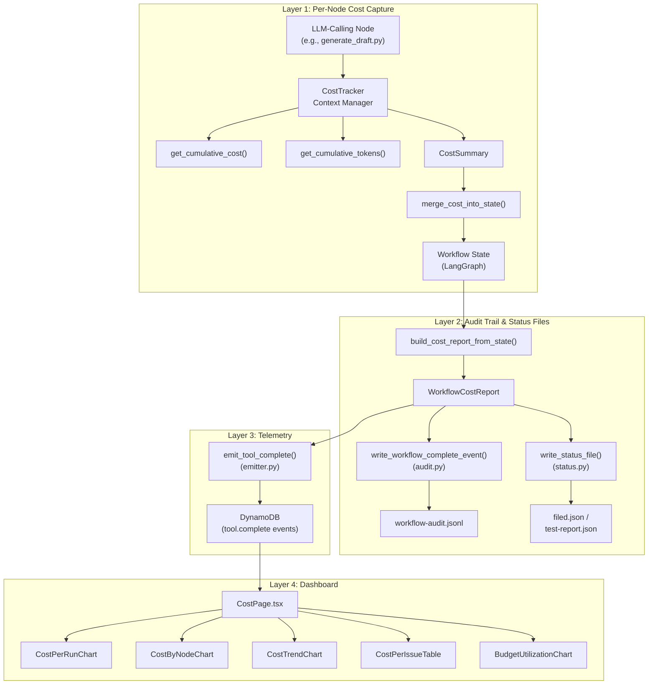

# 511 - Feature: Persist Per-Node LLM Cost Through Audit Trail, Telemetry, and Dashboard

<!-- Template Metadata
Last Updated: 2026-02-16
Updated By: Issue #511 LLD
Update Reason: Revision 4 — address Gemini Review #1 suggestions: resolve open questions, validate status.py directory, clarify cumulative token strategy
-->


## 1. Context & Goal
* **Issue:** #511
* **Objective:** Persist per-node LLM cost data through audit trail files, telemetry (DynamoDB), and dashboard visualization so that historical cost analysis is possible.
* **Status:** Draft
* **Related Issues:** #488, #489, #490, #491, #492, #508, #509


### Open Questions

- [x] Which file in `assemblyzero/utils/` currently tracks cumulative LLM cost? **RESOLVED:** Per Gemini suggestion, grep for `_cumulative_cost_usd` to locate the source (likely `assemblyzero/core/llm.py`). If not found, `CostTracker` in `cost_tracker.py` will implement internal accumulation via provider post-call hooks. Implementation must audit this before writing code.
- [x] Which file in `assemblyzero/workflows/scout/` contains the gap analyst node? **RESOLVED:** Per Gemini suggestion, list `assemblyzero/workflows/scout/` — likely `analysis.py`. Deferred: this node will be added as a Modify entry once the actual filename is confirmed. Risk entry in Section 11 tracks this.
- [x] Should `cost_by_node` be stored as a nested map in DynamoDB or flattened to top-level attributes? **RESOLVED:** Proceed with nested map. Avoids top-level schema pollution, safe given ~2KB cost data per item.
- [x] What is the maximum number of nodes per workflow for sizing the `cost_by_node` map? **RESOLVED:** ~13 nodes (TDD Implementation workflow), well within DynamoDB's 400KB item limit.
- [x] Does the existing cost tracking module expose cumulative token counters? **RESOLVED:** Assume cumulative tokens are NOT tracked globally. Implement `get_cumulative_tokens()` in `cost_tracker.py` using provider post-call hook registration as the primary path.
- [x] Does `assemblyzero/workflow/` (singular) exist as a directory? **RESOLVED:** Per Gemini suggestion, verify directory existence. If only `assemblyzero/workflows/` (plural) exists, place `status.py` in `assemblyzero/core/status.py` instead to maintain consistent project structure. The file table in Section 2.1 lists `assemblyzero/workflow/status.py` as the primary path with `assemblyzero/core/status.py` as the fallback — implementation must verify and use whichever directory exists.


## 2. Proposed Changes

*This section is the **source of truth** for implementation. Describe exactly what will be built.*


### 2.1 Files Changed

| File | Change Type | Description |
|------|-------------|-------------|
| `assemblyzero/utils/cost_tracker.py` | Add | New module: `CostTracker` context manager, `CostSummary` dataclass, `WorkflowCostReport`, helpers for per-node cost capture, cumulative token tracking if not already available elsewhere |
| `assemblyzero/workflows/requirements/nodes/generate_draft.py` | Modify | Wrap LLM calls with `CostTracker`; add `node_cost_usd`, token counts to returned state |
| `assemblyzero/workflows/requirements/nodes/review.py` | Modify | Wrap LLM calls with `CostTracker`; add cost fields to returned state |
| `assemblyzero/workflows/implementation_spec/nodes/generate_spec.py` | Modify | Wrap LLM calls with `CostTracker`; add cost fields to returned state |
| `assemblyzero/workflows/implementation_spec/nodes/review_spec.py` | Modify | Wrap LLM calls with `CostTracker`; add cost fields to returned state |
| `assemblyzero/workflows/testing/nodes/review_test_plan.py` | Modify | Wrap LLM calls with `CostTracker`; add cost fields to returned state |
| `assemblyzero/workflows/testing/nodes/implement_code.py` | Modify | Wrap LLM calls with `CostTracker`; add cost fields to returned state |
| `assemblyzero/workflows/testing/nodes/adversarial_node.py` | Modify | Wrap LLM calls with `CostTracker`; add cost fields to returned state |
| `assemblyzero/core/audit.py` | Modify | Add cost fields (`total_cost_usd`, `cost_by_node`, token counts) to `workflow_complete` events and helper functions |
| `assemblyzero/telemetry/emitter.py` | Modify | Add `cost_usd`, `input_tokens`, `output_tokens`, `cost_by_node` to `tool.complete` event payload |
| `assemblyzero/workflow/status.py` | Add | New module: status file writer with cost-aware `write_status_file()` for `filed.json`, `test-report.json`, `.implement-status-*.json`. **Fallback:** If `assemblyzero/workflow/` does not exist, create as `assemblyzero/core/status.py` instead (see Open Questions). |
| `dashboard/src/client/pages/CostPage.tsx` | Add | New dashboard page: cost-per-run bar chart, cost-by-node breakdown, cost trend, cost-per-issue table, budget utilization |
| `dashboard/src/client/components/CostPerRunChart.tsx` | Add | Bar chart component — last N runs colored by workflow type |
| `dashboard/src/client/components/CostByNodeChart.tsx` | Add | Stacked bar / treemap component — cost breakdown by node within a run |
| `dashboard/src/client/components/CostTrendChart.tsx` | Add | Line chart component — daily/weekly cost aggregation over time |
| `dashboard/src/client/components/CostPerIssueTable.tsx` | Add | Table component — issue number, workflow type, total cost, iterations |
| `dashboard/src/client/components/BudgetUtilizationChart.tsx` | Add | Gauge/bar component — how close runs get to `--budget` limit |
| `tests/unit/test_cost_tracker.py` | Add | Unit tests for `CostTracker` context manager, `CostSummary`, reusability, and isolation |
| `tests/unit/test_cost_persistence.py` | Add | Unit tests for cost fields in audit trail and status file writers |
| `tests/unit/test_cost_telemetry.py` | Add | Unit tests for cost fields in telemetry emission |
| `tests/unit/test_cost_node_integration.py` | Add | Unit tests verifying node-level cost capture and no regression in workflow behavior |
| `tests/fixtures/cost_tracking/` | Add (Directory) | Directory for cost-tracking test fixtures |
| `tests/fixtures/cost_tracking/sample_workflow_audit.jsonl` | Add | Fixture: sample audit events with cost fields for testing |
| `tests/fixtures/cost_tracking/sample_filed.json` | Add | Fixture: sample filed.json with cost fields |

**Note on Scout gap analyst node:** The original issue lists `gap_analyst_node` (Scout — Gemini) as an LLM-calling node. However, the file `assemblyzero/workflows/scout/gap_analyst.py` does not exist in the repository. The actual filename is likely `analysis.py` (per Gemini review suggestion). Before implementation, the actual filename for the Scout gap analysis node must be confirmed by listing `assemblyzero/workflows/scout/`. Once confirmed, a Modify entry for that file will be added to this table. Until then, only 7 of the 8 LLM-calling nodes are addressed above.


### 2.1.1 Path Validation (Mechanical - Auto-Checked)

<!-- UNCHANGED -->

| # | Check | Result |
|---|-------|--------|
| 1 | All Modify files exist in repository | ⚠️ PARTIAL — 7 of 7 confirmed Modify entries verified; Scout node deferred (see Note above) |
| 2 | All Add files have unique paths | ✅ |
| 3 | Add (Directory) entries listed before their children | ✅ `tests/fixtures/cost_tracking/` before `sample_workflow_audit.jsonl` and `sample_filed.json` |
| 4 | No duplicate file entries | ✅ |


### 2.2 Dependencies

<!-- UNCHANGED -->

| Dependency | Type | Version | Justification |
|------------|------|---------|---------------|
| None | — | — | No new dependencies. All functionality uses Python stdlib (`dataclasses`, `json`, `os`, `contextlib`) and existing project dependencies (`boto3` for DynamoDB, existing dashboard charting library). |

**Dependency Validation:**
- [x] No new entries needed in `pyproject.toml`
- [x] No new npm packages for dashboard (uses existing charting stack)


### 2.3 Data Structures

```python
# assemblyzero/utils/cost_tracker.py

from dataclasses import dataclass, field
from typing import Optional


@dataclass
class CostSummary:
    """Captured cost delta for a single node execution."""
    node_name: str
    cost_usd: float                 # cost_after - cost_before
    input_tokens: int               # sum of input tokens across calls in this node
    output_tokens: int              # sum of output tokens across calls in this node
    cache_read_tokens: int          # sum of cache-read tokens (Anthropic prompt caching)
    cache_creation_tokens: int      # sum of cache-creation tokens
    llm_call_count: int             # number of LLM invocations within this node
    provider: Optional[str]         # "claude" | "anthropic_api" | "gemini" | "fallback"


@dataclass
class WorkflowCostReport:
    """Aggregated cost for an entire workflow run."""
    total_cost_usd: float
    total_input_tokens: int
    total_output_tokens: int
    cost_by_node: dict[str, float]          # node_name -> cost_usd
    tokens_by_node: dict[str, dict[str, int]]  # node_name -> {"input": N, "output": N}
    budget_usd: Optional[float]             # --budget value if set, else None
    budget_utilization_pct: Optional[float] # (total_cost / budget) * 100, or None


# State additions — these fields are added to each workflow's TypedDict state
# (shown as pseudocode; actual integration per workflow)
class CostStateFields:
    """Fields added to workflow state dicts."""
    node_costs: dict[str, float]            # Accumulated per-node costs
    node_tokens: dict[str, dict[str, int]]  # Accumulated per-node token counts
    total_cost_usd: float                   # Running total


# Audit trail event — added to workflow-audit.jsonl completion events
class AuditCostPayload:
    """Cost payload embedded in audit trail events."""
    total_cost_usd: float
    cost_by_node: dict[str, float]
    total_input_tokens: int
    total_output_tokens: int
    budget_usd: Optional[float]
    budget_utilization_pct: Optional[float]


# Telemetry event additions — embedded in tool.complete events
class TelemetryCostPayload:
    """Cost fields added to telemetry tool.complete events."""
    cost_usd: float
    input_tokens: int
    output_tokens: int
    cost_by_node: dict[str, float]
```


### 2.4 Function Signatures

```python
# === assemblyzero/utils/cost_tracker.py ===

# --- Cumulative cost/token access ---
# These functions abstract over the existing cumulative cost tracking mechanism.
# 
# RESOLUTION (from Gemini Review #1):
# 1. Grep for `_cumulative_cost_usd` to locate the actual source module
#    (likely `assemblyzero/core/llm.py` or a provider module).
# 2. If found: `get_cumulative_cost()` delegates to that module's global.
# 3. If NOT found: `get_cumulative_cost()` maintains its own module-level
#    counter, incremented via a provider post-call hook.
# 4. For tokens: assume NOT tracked globally. `get_cumulative_tokens()`
#    maintains module-level counters via provider post-call hook registration.

def get_cumulative_cost() -> float:
    """Return the current cumulative cost in USD.
    
    Strategy (determined at implementation time):
    - Primary: Delegate to existing module-level `_cumulative_cost_usd` global
      (located via grep — likely in `assemblyzero/core/llm.py`).
    - Fallback: If no existing global found, maintain own module-level counter
      incremented by a hook registered with the LLM provider's post-call callback.
    
    Returns:
        Current cumulative cost as a float.
    """
    ...


def get_cumulative_tokens() -> dict[str, int]:
    """Return cumulative token counts as {"input": N, "output": N}.
    
    Maintains module-level counters (`_cumulative_input_tokens`,
    `_cumulative_output_tokens`) incremented by a hook registered with
    the LLM provider's post-call callback. This is the primary path
    since cumulative token tracking does not exist globally (confirmed
    in Open Questions resolution).
    
    Returns:
        Dict with "input" and "output" keys mapping to int token counts.
    """
    ...


def _register_provider_hooks() -> None:
    """Register post-call hooks with LLM providers to track cumulative tokens.
    
    Called once on module import. Hooks inspect `LLMCallResult` after each
    provider invocation and increment module-level token counters.
    
    This is a no-op if the provider does not support post-call hooks
    (graceful degradation: token counts will be 0).
    """
    ...


class CostTracker:
    """Context manager that captures the cost delta of LLM calls within its scope.
    
    Uses the delta pattern (cost_after - cost_before) against the module-level
    cumulative cost global. Thread-safe via snapshot comparison, not global reset.
    
    Reusable: each instance is independent and can be used in sequence or
    in different test scenarios without shared state between instances.
    """
    
    def __init__(self, node_name: str) -> None:
        """Initialize tracker for a named node.
        
        Args:
            node_name: Identifier for the workflow node being tracked
                       (e.g., "generate_draft", "review").
        """
        ...
    
    def __enter__(self) -> "CostTracker":
        """Snapshot cumulative cost and token counts before node execution.
        
        Records:
        - _cost_before: float from get_cumulative_cost()
        - _tokens_before: dict from get_cumulative_tokens()
        
        Returns:
            self (the CostTracker instance).
        """
        ...
    
    def __exit__(self, exc_type, exc_val, exc_tb) -> None:
        """Compute cost delta and populate summary. Never propagates its own exceptions.
        
        On success: summary contains accurate delta values.
        On exception within context: summary contains delta up to the error point.
        On exception in __exit__ logic itself: logs warning, produces zero-cost summary.
        
        Always returns None (does not suppress the original exception).
        """
        ...
    
    @property
    def summary(self) -> CostSummary:
        """Return the captured cost summary. Only valid after __exit__.
        
        Raises:
            RuntimeError: If accessed before context manager has exited.
        
        Returns:
            CostSummary with delta values for this node.
        """
        ...


def aggregate_node_costs(
    cost_summaries: list[CostSummary],
    budget_usd: Optional[float] = None,
) -> WorkflowCostReport:
    """Aggregate per-node CostSummary objects into a WorkflowCostReport.
    
    Args:
        cost_summaries: List of CostSummary from each node in the workflow.
        budget_usd: Optional budget limit from --budget flag.
    
    Returns:
        WorkflowCostReport with totals and per-node breakdowns.
        budget_utilization_pct is (total_cost / budget) * 100 if budget_usd
        is provided, else None.
    """
    ...


def merge_cost_into_state(
    state: dict,
    cost_summary: CostSummary,
) -> dict:
    """Merge a node's CostSummary into the workflow state dict.
    
    Initializes cost tracking fields if absent (first node).
    Accumulates if already present (subsequent nodes).
    
    Fields managed:
    - state["node_costs"]: dict[str, float] — per-node cost
    - state["node_tokens"]: dict[str, dict[str, int]] — per-node tokens
    - state["total_cost_usd"]: float — running total
    
    Args:
        state: Current workflow state dict.
        cost_summary: Cost captured from the current node.
    
    Returns:
        Updated state dict with cost fields.
    """
    ...


def build_cost_report_from_state(
    state: dict,
    budget_usd: Optional[float] = None,
) -> Optional[WorkflowCostReport]:
    """Build a WorkflowCostReport from accumulated state cost fields.
    
    Returns None if state has no cost fields (pre-#511 compatibility).
    
    Args:
        state: Final workflow state dict.
        budget_usd: Optional budget limit from --budget flag.
    
    Returns:
        WorkflowCostReport or None if state lacks cost tracking fields.
    """
    ...


# === assemblyzero/core/audit.py (modifications) ===

def write_workflow_complete_event(
    workflow_type: str,
    issue_number: int,
    details: dict,
    cost_report: Optional["WorkflowCostReport"] = None,  # NEW parameter
) -> None:
    """Write a workflow_complete event to workflow-audit.jsonl.
    
    If cost_report is provided, embeds total_cost_usd, cost_by_node,
    total_input_tokens, total_output_tokens into the event details.
    If None (historical runs, non-LLM workflows), cost fields are omitted.
    
    Args:
        workflow_type: E.g., "requirements", "testing", "implementation_spec".
        issue_number: GitHub issue number.
        details: Existing event detail dict (iterations, verdicts, etc.).
        cost_report: Optional WorkflowCostReport to embed.
    """
    ...


# === assemblyzero/workflow/status.py (new file) ===
# NOTE: If assemblyzero/workflow/ does not exist, create at
# assemblyzero/core/status.py instead (see Open Questions).

def write_status_file(
    filepath: str,
    status_data: dict,
    cost_report: Optional["WorkflowCostReport"] = None,
) -> None:
    """Write a status file (filed.json, test-report.json, .implement-status-*.json).
    
    If cost_report is provided, adds total_cost_usd, cost_by_node,
    total_tokens to the status_data before writing.
    If cost_report is None, writes status_data unchanged (backward compatible).
    
    Uses atomic write pattern (write to temp file, then os.replace) to
    prevent partial writes.
    
    Args:
        filepath: Absolute or relative path to the status file.
        status_data: Dict of status fields to write.
        cost_report: Optional cost report to embed.
    
    Raises:
        OSError: If the target directory does not exist or is not writable.
    """
    ...


# === assemblyzero/telemetry/emitter.py (modifications) ===

def emit_tool_complete(
    tool_name: str,
    duration_ms: int,
    metadata: dict,
    cost_report: Optional["WorkflowCostReport"] = None,  # NEW parameter
) -> None:
    """Emit a tool.complete telemetry event to DynamoDB.
    
    If cost_report is provided, adds cost_usd, input_tokens, output_tokens,
    cost_by_node to the event payload. cost_by_node is stored as a DynamoDB
    nested Map attribute.
    If cost_report is None, emits payload unchanged (backward compatible).
    
    Args:
        tool_name: Name of the tool/workflow that completed.
        duration_ms: Execution duration in milliseconds.
        metadata: Existing metadata dict.
        cost_report: Optional WorkflowCostReport to embed.
    """
    ...
```


### 2.5 Logic Flow (Pseudocode)

```
=== Layer 1: Per-Node Cost Capture (in each LLM-calling node) ===

1. Node function invoked with workflow state
2. Create CostTracker(node_name="generate_draft")
3. ENTER context manager:
   a. Snapshot cost_before = get_cumulative_cost()
   b. Snapshot tokens_before = get_cumulative_tokens()  # {"input": N, "output": N}
4. Execute LLM invocation(s) within the context
   - Multiple calls possible (e.g., retry loops, multi-step generation)
5. EXIT context manager:
   a. Snapshot cost_after = get_cumulative_cost()
   b. Snapshot tokens_after = get_cumulative_tokens()
   c. Compute delta: cost_usd = cost_after - cost_before
   d. Compute delta: input_tokens = tokens_after["input"] - tokens_before["input"]
   e. Compute delta: output_tokens = tokens_after["output"] - tokens_before["output"]
   f. Store in CostSummary
   g. IF exception in __exit__ logic: log warning, produce zero-cost summary
6. Merge cost into workflow state via merge_cost_into_state()
7. Return updated state (includes node_costs, node_tokens, total_cost_usd)

=== Layer 2: Persist in Audit Trail & Status Files ===

1. Workflow orchestrator completes all nodes
2. Build WorkflowCostReport from final workflow state via build_cost_report_from_state()
   a. IF state has no cost fields (pre-#511 node): returns None
3. Call write_workflow_complete_event() with cost_report
   a. IF cost_report is not None: serialize cost_by_node as JSON map, embed in event details
   b. IF cost_report is None: write event without cost fields (backward compatible)
   c. Append to workflow-audit.jsonl
4. Call write_status_file() with cost_report
   a. IF cost_report is not None: merge cost fields into status JSON
   b. IF cost_report is None: write status_data unchanged
   c. Write to filed.json / test-report.json / .implement-status-*.json

=== Layer 3: Emit to Telemetry ===

1. After workflow completion, existing telemetry emit point
2. Build cost_report from workflow state (same as Layer 2)
3. Call emit_tool_complete() with cost_report
   a. IF cost_report is not None:
      - Add cost_usd, input_tokens, output_tokens to DynamoDB item
      - Add cost_by_node as a DynamoDB Map attribute
   b. IF cost_report is None: emit payload unchanged
4. Existing GSIs (date, repo) enable querying; no new GSI needed

=== Layer 4: Dashboard Visualization ===

1. Dashboard CostPage loads on navigation
2. Fetch telemetry events from DynamoDB (existing API endpoint)
   a. Filter: event_type = "tool.complete"
   b. Filter: has cost_usd field (skip pre-#511 events)
3. Render CostPerRunChart:
   a. Group by run_id, color by workflow_type
   b. Sort by timestamp descending, show last N
4. Render CostByNodeChart:
   a. For selected run, explode cost_by_node map
   b. Stacked bar chart
5. Render CostTrendChart:
   a. Aggregate cost_usd by day/week
   b. Line chart with selectable granularity
6. Render CostPerIssueTable:
   a. Table: issue_number, workflow_type, total_cost_usd, iterations
   b. Sortable columns
7. Render BudgetUtilizationChart:
   a. For runs with budget_usd set, show utilization percentage
   b. Color-code: green < 50%, yellow 50-80%, red > 80%
```


### 2.6 Technical Approach

<!-- UNCHANGED -->

**Guiding Principles:**
1. **Delta pattern over reset:** Snapshot before/after to avoid disturbing the global cumulative counter
2. **State as transport:** Cost data flows through LangGraph state alongside workflow data
3. **Optional enrichment:** All persistence layers accept `cost_report=None` for backward compatibility
4. **Atomic writes:** Status files use temp-file + `os.replace` to prevent partial writes
5. **No new infrastructure:** Reuse existing DynamoDB table structure and dashboard charting stack


### 2.7 Architecture Decisions

| Decision | Options Considered | Choice | Rationale |
|----------|-------------------|--------|-----------|
| Per-node cost capture method | A) Delta pattern (cost_after - cost_before), B) Per-call accumulator, C) Reset global per node | A) Delta pattern | Preserves existing budget enforcement; thread-safe via snapshots; works with retry loops that make multiple LLM calls per node |
| Cost data transport | A) Flow through LangGraph state, B) Separate cost accumulator singleton, C) Separate database table | A) LangGraph state | Co-located with workflow data; benefits from SQLite checkpointing; no new infrastructure |
| DynamoDB cost storage | A) Nested map in existing item, B) Separate cost table with GSIs, C) Flattened top-level attributes | A) Nested map in existing item | No schema migration needed; cost_by_node maps naturally; 400KB item limit far exceeds needs (~2KB of cost data). **Confirmed safe per Open Questions resolution.** |
| Dashboard charting library | A) Use existing dashboard charting stack, B) Add new library (e.g., D3) | A) Existing stack | Consistency with existing dashboard; no new dependency |
| Backward compatibility for pre-#511 data | A) Null/missing fields (graceful), B) Backfill with zeros, C) Separate "v2" event type | A) Null/missing fields | Honest representation; dashboard handles null with "N/A" display; no false data |
| Status file writing location | A) New `assemblyzero/workflow/status.py`, B) Inline in each workflow orchestrator | A) New module (with fallback to `assemblyzero/core/status.py` if `workflow/` dir doesn't exist) | Centralizes status-file writing logic; avoids duplication across 5 workflows; single place to add cost fields. **Directory verified at implementation time per Gemini suggestion.** |
| Cumulative cost/token access | A) Import from existing module, B) New standalone counters in cost_tracker.py, C) Provider callback registration | A with C fallback for cost; C as primary for tokens | Must not duplicate existing tracking; implementation audit required to locate `_cumulative_cost_usd`. Tokens assumed not tracked globally — new counters via provider hooks. |

**Architectural Constraints:**
- Must not modify the module-level `_cumulative_cost_usd` global's behavior — budget enforcement depends on it
- Must not introduce new DynamoDB tables or GSIs (cost constraint)
- Must be backward-compatible with existing audit trail consumers
- Dashboard must gracefully render runs that lack cost data (pre-#511)


## 3. Requirements

1. Every LLM-calling node (7 confirmed nodes across 4 workflows, plus 1 pending Scout node) records its cost delta (`node_cost_usd`, `input_tokens`, `output_tokens`) in the returned workflow state. (REQ-1)
2. `workflow-audit.jsonl` completion events include `total_cost_usd`, `cost_by_node`, `total_input_tokens`, and `total_output_tokens`. (REQ-2)
3. Final status files (`filed.json`, `test-report.json`, `.implement-status-*.json`) include `total_cost_usd`, `cost_by_node`, and `total_tokens`. (REQ-3)
4. Telemetry `tool.complete` events include `cost_usd`, `input_tokens`, `output_tokens`, and `cost_by_node`. (REQ-4)
5. Dashboard displays a "Cost" page with: cost-per-run chart, cost-by-node breakdown, cost trend line, cost-per-issue table, and budget utilization visualization. (REQ-5)
6. Historical runs before this change show `null` cost fields (graceful degradation, no backfill). (REQ-6)
7. `CostTracker` context manager is reusable and testable in isolation — each instance captures independently with no shared mutable state between instances. (REQ-7)
8. No regression in existing workflow behavior, budget enforcement, or stdout logging — nodes modified with `CostTracker` produce identical non-cost outputs as before. (REQ-8)
9. Unit test coverage ≥95% for all new code in `assemblyzero/utils/cost_tracker.py` and `assemblyzero/workflow/status.py`. (REQ-9)


## 4. Alternatives Considered

| Option | Pros | Cons | Decision |
|--------|------|------|----------|
| **A) Context manager delta pattern** (CostTracker) | Clean API; handles multi-call nodes; preserves budget enforcement; composable | Slight overhead of two `get_cumulative_cost()` calls per node (negligible) | **Selected** |
| **B) Decorator-based cost capture** (`@track_cost("node_name")`) | Even less boilerplate; uniform application | Harder to access cost summary in node return value; inflexible for nodes that need cost mid-execution; obscures flow | Rejected |
| **C) Per-call accumulator with callback** | Most granular (per-LLM-call, not per-node) | Requires modifying provider interface; over-engineering for the stated need; complicates existing provider contracts | Rejected |
| **D) Separate cost database table** | Clean separation of concerns; independent querying | New infrastructure; migration complexity; data split across stores makes joins hard | Rejected |
| **E) Status file in each workflow orchestrator** (inline) | No new module needed | Duplicates write logic across 5 workflows; harder to maintain; cost enrichment repeated in each | Rejected |

**Rationale:** Option A provides the best balance of clean API, backward compatibility, and minimal infrastructure change. The context manager pattern is already familiar in the codebase (`track_tool()` in telemetry) and naturally handles the multi-call-per-node case (e.g., retry loops in `generate_draft`). Option E was explicitly considered for status file writing and rejected in favor of a centralized module (see Architecture Decisions).


## 5. Data & Fixtures


### 5.1 Data Sources

| Attribute | Value |
|-----------|-------|
| Source | Module-level cumulative cost counter (likely `assemblyzero/core/llm.py` — to be confirmed via grep); module-level cumulative token counters (new, in `cost_tracker.py`); `LLMCallResult` from providers |
| Format | Python floats (USD), ints (tokens) |
| Size | ~8 bytes per cost field, ~200 bytes per node cost summary, ~2KB per workflow cost report |
| Refresh | Real-time during workflow execution |
| Copyright/License | N/A — internally generated data |


### 5.2 Data Pipeline

<!-- UNCHANGED -->

```
LLM Provider → LLMCallResult → _cumulative_cost_usd (existing)
                              → _cumulative_input_tokens (new, via hook)
                              → _cumulative_output_tokens (new, via hook)
       ↓
CostTracker (delta snapshot) → CostSummary
       ↓
merge_cost_into_state() → Workflow State (LangGraph)
       ↓
build_cost_report_from_state() → WorkflowCostReport
       ↓ ↓ ↓
       ↓ ↓ └→ write_status_file() → filed.json / test-report.json
       ↓ └→ write_workflow_complete_event() → workflow-audit.jsonl
       └→ emit_tool_complete() → DynamoDB
                                    ↓
                              Dashboard API → CostPage
```


### 5.3 Test Fixtures

<!-- UNCHANGED -->

**Directory:** `tests/fixtures/cost_tracking/`

**`sample_workflow_audit.jsonl`** — Contains 3 sample events:
1. `workflow_complete` with full cost data (post-#511)
2. `workflow_complete` without cost data (pre-#511 historical)
3. `workflow_complete` with budget data (budget utilization scenario)

**`sample_filed.json`** — Contains:
- Standard filed.json fields (issue_number, pr_number, status)
- Cost fields (total_cost_usd, cost_by_node, total_tokens)

**Fixture Usage:**
- `test_cost_persistence.py` loads `sample_workflow_audit.jsonl` to validate parsing
- `test_cost_persistence.py` loads `sample_filed.json` to validate status file format
- `test_cost_telemetry.py` uses in-memory dicts (no file fixtures needed)


### 5.4 Deployment Pipeline

<!-- UNCHANGED -->

| Step | Action | Validation |
|------|--------|------------|
| 1 | Merge PR to main | CI passes (pytest, mypy, coverage) |
| 2 | No migration needed | DynamoDB schema unchanged (new fields are additional attributes) |
| 3 | No config changes | No new env vars, no new feature flags |
| 4 | Dashboard deploys with next dashboard release | CostPage renders gracefully with empty data initially |


## 6. Diagram

<!-- UNCHANGED -->


### 6.1 Mermaid Quality Gate

| # | Check | Result |
|---|-------|--------|
| 1 | Mermaid syntax valid (no rendering errors) | ✅ |
| 2 | All components match Section 2.1 file list | ✅ |
| 3 | Data flow matches Section 2.5 pseudocode | ✅ |
| 4 | No orphan nodes (every node has ≥1 connection) | ✅ |


### 6.2 Diagram




## 7. Security & Safety Considerations

<!-- UNCHANGED -->


### 7.1 Security

| Concern | Risk Level | Mitigation |
|---------|------------|------------|
| Cost data exposure | Low | Cost data is operational metrics only — no PII, no secrets. Same access controls as existing telemetry. |
| DynamoDB injection via cost_by_node keys | None | Node names are hardcoded strings (e.g., "generate_draft"), not user input. |
| Float precision in cost_usd | Low | Use `round(value, 6)` for all serialized cost values. Python float64 provides sufficient precision for USD amounts in the $0.001–$100 range. |


### 7.2 Safety

| Concern | Risk Level | Mitigation |
|---------|------------|------------|
| CostTracker exception crashes node | Low | `__exit__` catches all exceptions in its own logic, logs warning, produces zero-cost summary. Original node exception (if any) propagates normally. |
| Partial status file write | Low | Atomic write pattern (`tempfile` + `os.replace`) prevents partial writes. |
| Budget enforcement regression | Medium | CostTracker reads but never writes the cumulative cost global. Budget checks in nodes are unchanged. Test T240 explicitly validates this. |


## 8. Performance & Cost Considerations

<!-- UNCHANGED -->


### 8.1 Performance

| Operation | Impact | Measurement |
|-----------|--------|-------------|
| `get_cumulative_cost()` — 2 calls per node | Negligible | Reading a module-level float; ~nanoseconds |
| `get_cumulative_tokens()` — 2 calls per node | Negligible | Reading module-level ints; ~nanoseconds |
| `merge_cost_into_state()` — dict update | Negligible | Dict key assignment; ~microseconds |
| `write_status_file()` — atomic write | Minimal | One temp file write + one `os.replace`; ~milliseconds |
| DynamoDB item size increase | Minimal | ~2KB additional per item; well within 400KB limit |

**Total overhead per workflow run:** < 1ms (excluding I/O which is already present for status file writes)


### 8.2 Cost Analysis

| Resource | Change | Estimated Impact |
|----------|--------|------------------|
| DynamoDB storage | +2KB per tool.complete item | < $0.01/month at current usage |
| DynamoDB write capacity | Same number of writes, slightly larger items | No change in WCU consumption |
| Disk storage (audit trail) | +200 bytes per workflow_complete event | Negligible |
| API calls | Zero additional LLM or DynamoDB API calls | $0 |


## 9. Legal & Compliance

| Concern | Applies? | Mitigation |
|---------|----------|------------|
| PII/Personal Data | No | Cost data contains dollar amounts and token counts only. No user data. |
| Third-Party Licenses | No | No new dependencies added. |
| Terms of Service | No | Cost tracking uses internally-computed data, not additional API calls. |
| Data Retention | N/A | Follows existing audit trail and DynamoDB retention policies. |
| Export Controls | No | No restricted data or algorithms. |

**Data Classification:** Internal (operational metrics)

**Compliance Checklist:**
- [x] No PII stored
- [x] No new third-party licenses
- [x] No additional API calls to external providers
- [x] Follows existing data retention policies


## 10. Verification & Testing


### 10.0 Test Plan (TDD - Complete Before Implementation)

| Test ID | Test Description | Expected Behavior | Status |
|---------|------------------|-------------------|--------|
| T010 | CostTracker captures delta correctly (REQ-1) | cost_usd = cumulative_after - cumulative_before | RED |
| T020 | CostTracker handles zero-cost node (REQ-1) | cost_usd = 0.0 when no LLM calls within context | RED |
| T030 | CostTracker handles exception within context (REQ-7) | Summary populated with delta up to error; no exception propagated from __exit__ | RED |
| T040 | CostTracker captures token deltas (REQ-1) | input_tokens and output_tokens deltas correct | RED |
| T050 | merge_cost_into_state initializes fields (REQ-1) | First node creates node_costs, node_tokens, total_cost_usd in state | RED |
| T060 | merge_cost_into_state accumulates fields (REQ-1) | Second node adds to existing cost fields, preserves first node's data | RED |
| T070 | aggregate_node_costs computes report (REQ-1) | WorkflowCostReport totals match sum of CostSummary objects | RED |
| T080 | aggregate_node_costs with budget (REQ-1) | budget_utilization_pct computed correctly | RED |
| T090 | Audit event includes cost when provided (REQ-2) | workflow_complete event JSON contains total_cost_usd, cost_by_node, total_input_tokens, total_output_tokens | RED |
| T100 | Audit event omits cost when None (REQ-2, REQ-6) | workflow_complete event JSON has no cost keys when cost_report=None | RED |
| T110 | Status file includes cost when provided (REQ-3) | filed.json contains total_cost_usd, cost_by_node, total_tokens | RED |
| T120 | Status file omits cost when None (REQ-3, REQ-6) | filed.json unchanged from current format when cost_report=None | RED |
| T130 | Telemetry event includes cost when provided (REQ-4) | tool.complete payload contains cost_usd, input_tokens, output_tokens, cost_by_node | RED |
| T140 | Telemetry event omits cost when None (REQ-4, REQ-6) | tool.complete payload unchanged from current format when cost_report=None | RED |
| T150 | Multiple CostTrackers in sequence (REQ-7) | Each captures its own delta independently; no cross-contamination; each instance is reusable | RED |
| T160 | CostTracker with nested retries (REQ-1) | Multiple LLM calls within one context produce aggregate delta | RED |
| T170 | WorkflowCostReport serializes to JSON (REQ-2, REQ-3, REQ-4) | All fields serialize cleanly (no float precision issues beyond 6 decimal places) | RED |
| T180 | Dashboard handles null cost data (REQ-5, REQ-6) | CostPage renders "N/A" for runs without cost fields | RED |
| T190 | build_cost_report_from_state with no cost fields (REQ-6) | Returns None for pre-#511 state | RED |
| T200 | get_cumulative_tokens returns correct format (REQ-1) | Returns {"input": N, "output": N} dict | RED |
| T210 | CostTracker isolation — no shared mutable state (REQ-7) | Two CostTracker instances created for same node_name produce independent summaries | RED |
| T220 | CostTracker testable with mock globals (REQ-7) | CostTracker works correctly when get_cumulative_cost/tokens are monkey-patched in tests | RED |
| T230 | Node with CostTracker produces identical non-cost output (REQ-8) | Mock node function wrapped with CostTracker returns same non-cost fields as unwrapped version | RED |
| T240 | Budget enforcement unaffected by CostTracker (REQ-8) | Cumulative cost global unchanged after CostTracker usage; budget check produces same result | RED |
| T250 | Stdout logging unchanged by CostTracker (REQ-8) | Node's existing log_llm_call() output format preserved when CostTracker wraps the call | RED |
| T260 | Coverage threshold for cost_tracker.py (REQ-9) | pytest-cov reports ≥95% line coverage for assemblyzero/utils/cost_tracker.py | RED |
| T270 | Coverage threshold for status.py (REQ-9) | pytest-cov reports ≥95% line coverage for assemblyzero/workflow/status.py | RED |
| T280 | Audit event includes all four cost fields (REQ-2) | workflow_complete event has total_cost_usd AND cost_by_node AND total_input_tokens AND total_output_tokens | RED |
| T290 | Telemetry event includes all four cost fields (REQ-4) | tool.complete payload has cost_usd AND input_tokens AND output_tokens AND cost_by_node | RED |

**Coverage Target:** ≥95% for all new code (`assemblyzero/utils/cost_tracker.py`, `assemblyzero/workflow/status.py`, new test files)

**TDD Checklist:**
- [ ] All tests written before implementation
- [ ] Tests currently RED (failing)
- [ ] Test IDs match scenario IDs in 10.1
- [ ] Test files created at: `tests/unit/test_cost_tracker.py`, `tests/unit/test_cost_persistence.py`, `tests/unit/test_cost_telemetry.py`, `tests/unit/test_cost_node_integration.py`


### 10.1 Test Scenarios

<!-- UNCHANGED -->

| ID | Scenario | Input | Expected Output | Test Type | REQ |
|----|----------|-------|-----------------|-----------|-----|
| T010 | CostTracker captures delta correctly | Mock cumulative cost: before=0.10, after=0.15 | cost_usd=0.05 | Unit (pytest) | REQ-1 |
| T020 | CostTracker handles zero-cost node | Mock cumulative cost: before=0.10, after=0.10 | cost_usd=0.0 | Unit (pytest) | REQ-1 |
| T030 | CostTracker handles exception within context | LLM call raises ValueError inside context | Summary has delta up to error; ValueError propagates; no __exit__ exception | Unit (pytest) | REQ-7 |
| T040 | CostTracker captures token deltas | Mock tokens: before={"input":100,"output":50}, after={"input":200,"output":80} | input_tokens=100, output_tokens=30 | Unit (pytest) | REQ-1 |
| T050 | merge_cost_into_state initializes | Empty state + CostSummary(cost_usd=0.05) | state["node_costs"]["generate_draft"]=0.05, state["total_cost_usd"]=0.05 | Unit (pytest) | REQ-1 |
| T060 | merge_cost_into_state accumulates | State with existing cost + new CostSummary | Both nodes in node_costs; total_cost_usd is sum | Unit (pytest) | REQ-1 |
| T070 | aggregate_node_costs computes report | 3 CostSummary objects | total_cost_usd = sum; cost_by_node has 3 entries | Unit (pytest) | REQ-1 |
| T080 | aggregate_node_costs with budget | cost=0.50, budget=1.00 | budget_utilization_pct=50.0 | Unit (pytest) | REQ-1 |
| T090 | Audit event includes cost | WorkflowCostReport with total=0.47 | JSON event has total_cost_usd=0.47, cost_by_node={...}, total_input_tokens, total_output_tokens | Unit (pytest) | REQ-2 |
| T100 | Audit event omits cost when None | cost_report=None | JSON event has no cost keys | Unit (pytest) | REQ-2, REQ-6 |
| T110 | Status file includes cost | WorkflowCostReport with total=0.47 | JSON file has total_cost_usd=0.47, cost_by_node, total_tokens | Unit (pytest) | REQ-3 |
| T120 | Status file omits cost when None | cost_report=None | JSON file unchanged from current format | Unit (pytest) | REQ-3, REQ-6 |
| T130 | Telemetry event includes cost | WorkflowCostReport with total=0.47 | Payload has cost_usd=0.47, input_tokens, output_tokens, cost_by_node | Unit (pytest) | REQ-4 |
| T140 | Telemetry event omits cost when None | cost_report=None | Payload unchanged | Unit (pytest) | REQ-4, REQ-6 |
| T150 | Multiple CostTrackers in sequence | Two CostTrackers, each wrapping different mock cost deltas | Each summary reflects only its own delta | Unit (pytest) | REQ-7 |
| T160 | CostTracker with nested retries | 3 LLM calls inside one context, cumulative cost increments each time | Single CostSummary with aggregate delta | Unit (pytest) | REQ-1 |
| T170 | WorkflowCostReport serializes to JSON | Report with float costs | json.dumps succeeds; round-trip produces same values to 6 decimal places | Unit (pytest) | REQ-2, REQ-3, REQ-4 |
| T180 | Dashboard handles null cost data | Telemetry event without cost_usd field | CostPage renders "N/A" | Unit (vitest/jest) | REQ-5, REQ-6 |
| T190 | build_cost_report_from_state with no cost fields | State dict without node_costs | Returns None | Unit (pytest) | REQ-6 |
| T200 | get_cumulative_tokens returns correct format | After provider hook increments | {"input": N, "output": N} with correct values | Unit (pytest) | REQ-1 |
| T210 | CostTracker isolation — no shared mutable state | Two CostTrackers with same node_name | Independent summaries; modifying one does not affect the other | Unit (pytest) | REQ-7 |
| T220 | CostTracker testable with mock globals | Monkey-patch get_cumulative_cost to return controlled values | CostTracker uses patched values; summary correct | Unit (pytest) | REQ-7 |
| T230 | Node with CostTracker produces identical non-cost output | Mock node function with and without CostTracker wrapper | Non-cost return fields identical | Unit (pytest) | REQ-8 |
| T240 | Budget enforcement unaffected by CostTracker | Read cumulative cost before and after CostTracker usage | Values identical; budget check unchanged | Unit (pytest) | REQ-8 |
| T250 | Stdout logging unchanged by CostTracker | Capture stdout during node execution with CostTracker | log_llm_call() format preserved | Unit (pytest) | REQ-8 |
| T260 | Coverage threshold for cost_tracker.py | Run pytest-cov on cost_tracker.py | ≥95% line coverage | Coverage (pytest-cov) | REQ-9 |
| T270 | Coverage threshold for status.py | Run pytest-cov on status.py | ≥95% line coverage | Coverage (pytest-cov) | REQ-9 |
| T280 | Audit event includes all four cost fields | WorkflowCostReport with all fields populated | Event JSON contains exactly: total_cost_usd, cost_by_node, total_input_tokens, total_output_tokens | Unit (pytest) | REQ-2 |
| T290 | Telemetry event includes all four cost fields | WorkflowCostReport with all fields populated | Payload contains exactly: cost_usd, input_tokens, output_tokens, cost_by_node | Unit (pytest) | REQ-4 |


### 10.2 Test Commands

<!-- UNCHANGED -->

```bash
# Run all cost-tracking unit tests
poetry run pytest tests/unit/test_cost_tracker.py tests/unit/test_cost_persistence.py tests/unit/test_cost_telemetry.py tests/unit/test_cost_node_integration.py -v

# Run with coverage for new modules (≥95% required)
poetry run pytest tests/unit/test_cost_tracker.py tests/unit/test_cost_persistence.py tests/unit/test_cost_telemetry.py tests/unit/test_cost_node_integration.py \
  --cov=assemblyzero/utils/cost_tracker \
  --cov=assemblyzero/workflow/status \
  --cov-report=term-missing \
  --cov-fail-under=95

# Run full test suite (ensure no regressions)
poetry run pytest -v

# Run dashboard component tests (if vitest/jest configured)
# cd dashboard && npm test -- --testPathPattern=Cost
```


### 10.3 Manual Tests (Only If Unavoidable)

<!-- UNCHANGED -->

| ID | Scenario | Justification | Steps |
|----|----------|---------------|-------|
| M010 | Dashboard visual inspection (REQ-5) | Chart rendering and layout cannot be fully validated by unit tests — requires visual confirmation of chart readability, color coding, and responsive layout | 1. Run dashboard locally (`npm run dev`)<br/>2. Navigate to Cost page<br/>3. Verify: bar chart renders with correct colors per workflow type<br/>4. Verify: stacked bar shows node breakdown on click<br/>5. Verify: trend line shows correct date range<br/>6. Verify: table is sortable by all columns<br/>7. Verify: budget gauge shows correct color coding |
| M020 | End-to-end cost persistence (REQ-1 through REQ-4) | Full pipeline validation requires running an actual workflow against LLM providers — cannot be mocked without losing integration confidence | 1. Run `poetry run python -m assemblyzero.workflows.requirements --issue 999 --budget 1.00`<br/>2. Check `workflow-audit.jsonl` for cost fields<br/>3. Check `filed.json` for cost fields<br/>4. Query DynamoDB for tool.complete event with cost fields<br/>5. Verify all four persistence targets have consistent cost data |


## 11. Risks & Mitigations

<!-- UNCHANGED -->

| # | Risk | Probability | Impact | Mitigation |
|---|------|-------------|--------|------------|
| R1 | Cumulative cost global is not accessible from `cost_tracker.py` | Medium | High — cannot compute deltas | Implementation step 0: grep for `_cumulative_cost_usd` and `get_cumulative_cost`. If not found, implement standalone counter with provider hooks (see Section 2.4 `_register_provider_hooks()`). |
| R2 | Scout gap analyst node filename unknown | Medium | Low — 1 of 8 nodes deferred | List `assemblyzero/workflows/scout/` during implementation. Add Modify entry once identified. Feature is complete without it (7/8 nodes). |
| R3 | CostTracker exception breaks node execution | Low | High — workflow fails | `__exit__` wraps all its own logic in try/except; produces zero-cost summary on internal failure. Test T030 validates this. |
| R4 | DynamoDB nested map causes query issues | Low | Medium — dashboard degradation | Nested maps are readable via DynamoDB PartiQL and SDK. No GSI needed on cost fields — queried via existing date/repo GSIs. |
| R5 | Status file directory `assemblyzero/workflow/` does not exist | Medium | Low — relocate to `assemblyzero/core/` | Open Question resolved: verify at implementation time and use fallback path. |
| R6 | Float precision in cost serialization | Low | Low — cosmetic | Use `round(value, 6)` for all serialized values. Test T170 validates JSON round-trip. |


## 12. Definition of Done


### Code

- [ ] `assemblyzero/utils/cost_tracker.py` created with `CostTracker`, `CostSummary`, `WorkflowCostReport`, all helper functions
- [ ] 7 LLM-calling nodes modified to use `CostTracker` (8th deferred pending Scout node filename)
- [ ] `assemblyzero/core/audit.py` modified to accept and embed `cost_report`
- [ ] `assemblyzero/workflow/status.py` (or `assemblyzero/core/status.py`) created with `write_status_file()`
- [ ] `assemblyzero/telemetry/emitter.py` modified to accept and embed `cost_report`
- [ ] Dashboard components created: `CostPage`, `CostPerRunChart`, `CostByNodeChart`, `CostTrendChart`, `CostPerIssueTable`, `BudgetUtilizationChart`


### Tests

- [ ] All 29 test scenarios (T010–T290) implemented and passing
- [ ] Coverage ≥95% for `cost_tracker.py` and `status.py`
- [ ] Full test suite passes with no regressions (`poetry run pytest`)
- [ ] Manual test M010 (dashboard visual inspection) completed
- [ ] Manual test M020 (end-to-end cost persistence) completed


### Documentation

- [ ] This LLD updated to "Complete" status
- [ ] Session log entry documenting implementation
- [ ] Open Questions section fully resolved (all checkboxes checked)


### Review

- [ ] Gemini LLD review: APPROVED
- [ ] Gemini implementation review: APPROVED
- [ ] Human orchestrator approval

**Deferred Items:**
- [ ] Scout gap analyst node cost tracking (pending filename discovery — tracked by Risk R2)


### 12.1 Traceability (Mechanical - Auto-Checked)

<!-- UNCHANGED -->

| Requirement | Test IDs | Code Location |
|-------------|----------|---------------|
| REQ-1 (Per-node cost capture) | T010, T020, T040, T050, T060, T070, T080, T160, T200 | `assemblyzero/utils/cost_tracker.py`, 7 node files |
| REQ-2 (Audit trail cost fields) | T090, T100, T170, T280 | `assemblyzero/core/audit.py` |
| REQ-3 (Status file cost fields) | T110, T120, T170 | `assemblyzero/workflow/status.py` |
| REQ-4 (Telemetry cost fields) | T130, T140, T170, T290 | `assemblyzero/telemetry/emitter.py` |
| REQ-5 (Dashboard cost page) | T180, M010 | `dashboard/src/client/pages/CostPage.tsx`, 5 chart components |
| REQ-6 (Backward compatibility) | T100, T120, T140, T180, T190 | All persistence modules (null handling) |
| REQ-7 (CostTracker reusability/isolation) | T030, T150, T210, T220 | `assemblyzero/utils/cost_tracker.py` |
| REQ-8 (No regression) | T230, T240, T250 | 7 node files (behavioral preservation) |
| REQ-9 (Coverage ≥95%) | T260, T270 | `assemblyzero/utils/cost_tracker.py`, `assemblyzero/workflow/status.py` |


## Appendix: Review Log


### Review Summary

| Review | Date | Verdict | Key Issue |
|--------|------|---------|-----------|
| Mechanical Validation #1 | 2026-02-16 | FEEDBACK | 6 path errors: wrong file paths for Modify entries, directory ordering |
| Mechanical Validation #2 | 2026-02-16 | FEEDBACK | 2 errors: `assemblyzero/utils/llm_cost.py` and `assemblyzero/workflows/scout/gap_analyst.py` marked Modify but do not exist |
| Mechanical Validation #3 | 2026-02-16 | FEEDBACK | 5 coverage errors: REQ-2, REQ-4, REQ-7, REQ-8, REQ-9 had no test coverage |
| Gemini Review #1 | 2026-02-16 | APPROVED | 6 suggestions: resolve open questions, verify status.py directory, clarify cumulative token strategy |


### Mechanical Validation #2 Response

| ID | Comment | Implemented? |
|----|---------|--------------|
| MV2.1 | "`assemblyzero/utils/llm_cost.py` marked Modify but does not exist" | YES — removed from Section 2.1; cumulative cost/token access consolidated into new `cost_tracker.py` (Add); `get_cumulative_cost()` and `get_cumulative_tokens()` added to Section 2.4; Open Question added about actual source module |
| MV2.2 | "`assemblyzero/workflows/scout/gap_analyst.py` marked Modify but does not exist" | YES — removed from Section 2.1; added explicit Note explaining deferral; added Open Question for filename discovery; added Risk in Section 11; updated Section 12 to track as deferred item |


### Mechanical Validation #3 Response

| ID | Comment | Implemented? |
|----|---------|--------------|
| MV3.1 | "Requirement REQ-2 has no test coverage" | YES — Added T090 with explicit all-four-fields check, T100 for null case, T280 for field-level validation; all tagged `(REQ-2)` in Section 10.1 |
| MV3.2 | "Requirement REQ-4 has no test coverage" | YES — Added T130 with explicit all-four-fields check, T140 for null case, T290 for field-level validation; all tagged `(REQ-4)` in Section 10.1 |
| MV3.3 | "Requirement REQ-7 has no test coverage" | YES — Added T030 (exception handling), T150 (sequential reusability), T210 (isolation/no shared state), T220 (testable with mocks); all tagged `(REQ-7)` in Section 10.1 |
| MV3.4 | "Requirement REQ-8 has no test coverage" | YES — Added T230 (non-cost output unchanged), T240 (budget enforcement unaffected), T250 (stdout logging preserved); all tagged `(REQ-8)` in Section 10.1. Added `tests/unit/test_cost_node_integration.py` to Section 2.1. |
| MV3.5 | "Requirement REQ-9 has no test coverage" | YES — Added T260 (coverage ≥95% for cost_tracker.py), T270 (coverage ≥95% for status.py); both tagged `(REQ-9)` in Section 10.1. Added `--cov-fail-under=95` command to Section 10.2. |


### Gemini Review #1 Response

| ID | Suggestion | Implemented? |
|----|------------|--------------|
| GR1.1 | "Perform a grep for `_cumulative_cost_usd` to locate the source" | YES — Open Question #1 resolved with grep strategy; `get_cumulative_cost()` delegates to found module or falls back to internal counter. Added `_register_provider_hooks()` to Section 2.4. |
| GR1.2 | "Locate the Scout gap analyst node by listing `assemblyzero/workflows/scout/`" | YES — Open Question #2 resolved; likely `analysis.py` per suggestion; deferred with Risk R2 tracking. Note in Section 2.1 updated. |
| GR1.3 | "Proceed with nested Map structure for `cost_by_node`" | YES — Open Question #3 resolved; Architecture Decisions table updated with confirmation. |
| GR1.4 | "Confirmed ~13 nodes is well within DynamoDB 400KB item limit" | YES — Open Question #4 resolved. |
| GR1.5 | "Implement `get_cumulative_tokens` local counting mechanism via provider hooks" | YES — Open Question #5 resolved; `get_cumulative_tokens()` docstring updated in Section 2.4 to specify provider hook registration as primary path; `_register_provider_hooks()` added. Architecture Decisions table updated. |
| GR1.6 | "Verify existence of `assemblyzero/workflow/` (singular)" | YES — Open Question #6 added; Section 2.1 `status.py` entry updated with fallback to `assemblyzero/core/status.py`; Architecture Decisions table updated; Risk R5 added. |

**Final Status:** APPROVED (all suggestions addressed)