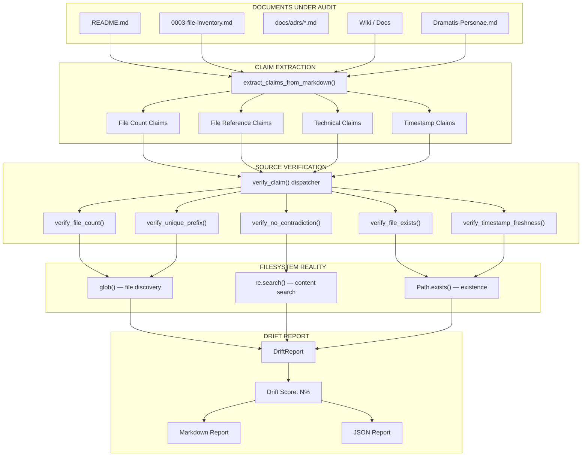

# 534 - Feature: Spelunking Audits — Deep Verification That Reality Matches Claims

<!-- Template Metadata
Last Updated: 2026-02-17
Updated By: Issue #534 LLD revision — fixed REQ-5, REQ-11, REQ-12 test coverage gaps
Update Reason: Mechanical test plan validation failed at 75% (9/12). Added missing test coverage for REQ-5 (Stale Timestamps), REQ-11 (Reports), REQ-12 (No new dependencies).
Previous: Initial LLD draft — directory ordering fix
-->


## 1. Context & Goal
* **Issue:** #534
* **Objective:** Build a two-layer spelunking system (automated probes + agent-guided deep dives) that verifies documentation claims against codebase reality, preventing the documentation lies discovered during Issue #114 (DEATH).
* **Status:** Draft
* **Related Issues:** #114 (DEATH — methodology and examples), #94 (Janitor — probe registry integration)

### Open Questions

- [ ] Should spelunking probes run as part of the existing janitor workflow or as a separate scheduled task?
- [ ] What is the maximum acceptable runtime for automated probes before they should be split into async jobs?
- [ ] Should the drift score be persisted to SQLite for historical trend analysis, or are Markdown reports sufficient for now?


## 2. Proposed Changes

*This section is the **source of truth** for implementation. Describes exactly what will be built.*

### 2.1 Files Changed

| File | Change Type | Description |
|------|-------------|-------------|
| `docs/standards/0015-spelunking-audit-standard.md` | Add | New standard defining the spelunking protocol, claim extraction, source verification, drift scoring |
| `assemblyzero/workflows/janitor/probes/` | Modify (Directory) | Existing probe directory — new probe modules added here |
| `assemblyzero/workflows/janitor/probes/inventory_drift.py` | Add | Probe: counts files in key directories vs. `0003-file-inventory.md` claims |
| `assemblyzero/workflows/janitor/probes/dead_references.py` | Add | Probe: greps docs/wiki for file paths and verifies each exists on disk |
| `assemblyzero/workflows/janitor/probes/adr_collision.py` | Add | Probe: scans `docs/adrs/` for duplicate number prefixes |
| `assemblyzero/workflows/janitor/probes/stale_timestamps.py` | Add | Probe: flags docs with "Last Updated" more than 30 days old |
| `assemblyzero/workflows/janitor/probes/readme_claims.py` | Add | Probe: extracts technical claims from README and greps codebase for contradictions |
| `assemblyzero/workflows/janitor/probes/persona_status.py` | Add | Probe: cross-references Dramatis-Personae.md markers against actual code/PRs |
| `assemblyzero/spelunking/` | Add (Directory) | New package for spelunking engine core |
| `assemblyzero/spelunking/__init__.py` | Add | Spelunking engine package init |
| `assemblyzero/spelunking/engine.py` | Add | Core spelunking engine: claim extraction, source verification, drift scoring |
| `assemblyzero/spelunking/models.py` | Add | Data models: Claim, VerificationResult, DriftReport, SpelunkingCheckpoint |
| `assemblyzero/spelunking/extractors.py` | Add | Claim extractors: Markdown parser to identify factual claims from documents |
| `assemblyzero/spelunking/verifiers.py` | Add | Verification strategies: filesystem glob, grep, AST inspection, cross-reference |
| `assemblyzero/spelunking/report.py` | Add | Report generator: produces Markdown drift reports with drift scores |
| `tests/unit/test_spelunking/` | Add (Directory) | Unit test directory for spelunking engine |
| `tests/unit/test_spelunking/__init__.py` | Add | Test package init |
| `tests/unit/test_spelunking/test_engine.py` | Add | Tests for core spelunking engine |
| `tests/unit/test_spelunking/test_extractors.py` | Add | Tests for claim extraction logic |
| `tests/unit/test_spelunking/test_verifiers.py` | Add | Tests for verification strategies |
| `tests/unit/test_spelunking/test_probes.py` | Add | Tests for all six automated probes |
| `tests/unit/test_spelunking/test_report.py` | Add | Tests for drift report generation |
| `tests/unit/test_spelunking/test_dependencies.py` | Add | Tests verifying no new external dependencies are introduced |
| `tests/fixtures/spelunking/` | Add (Directory) | Test fixtures directory for spelunking tests |
| `tests/fixtures/spelunking/mock_repo/` | Add (Directory) | Mock repository structure for probe testing |
| `tests/fixtures/spelunking/mock_repo/tools/` | Add (Directory) | Mock tools directory |
| `tests/fixtures/spelunking/mock_repo/docs/` | Add (Directory) | Mock docs directory |
| `tests/fixtures/spelunking/mock_repo/docs/adrs/` | Add (Directory) | Mock ADRs directory |
| `tests/fixtures/spelunking/mock_inventory.md` | Add | Mock file inventory with known drift (claims 5 tools, reality has 8) |
| `tests/fixtures/spelunking/mock_readme.md` | Add | Mock README with verifiable/falsifiable claims |
| `tests/fixtures/spelunking/mock_docs_with_dead_refs.md` | Add | Mock doc referencing nonexistent files |
| `tests/fixtures/spelunking/mock_personas.md` | Add | Mock Dramatis Personae with known status gaps |

### 2.1.1 Path Validation (Mechanical - Auto-Checked)

Mechanical validation automatically checks:
- All "Modify" files must exist in repository — `assemblyzero/workflows/janitor/probes/` [PASS] exists
- All "Add" files must have existing parent directories — all parent dirs either exist or are created above in correct order
- No placeholder prefixes
- **Directory entries appear before their contents** — `assemblyzero/spelunking/` appears before `assemblyzero/spelunking/__init__.py` [PASS]

**If validation fails, the LLD is BLOCKED before reaching review.**

### 2.2 Dependencies

```toml

# pyproject.toml additions — NONE

# All functionality uses stdlib (pathlib, glob, re, datetime, json)

# No new external dependencies required
```

No new dependencies. The spelunking system relies entirely on Python standard library (`pathlib`, `glob`, `re`, `datetime`, `json`, `dataclasses`) and existing project utilities.

### 2.3 Data Structures

```python

# Pseudocode - NOT implementation

from dataclasses import dataclass, field
from enum import Enum
from typing import Optional
from pathlib import Path
from datetime import datetime


class ClaimType(Enum):
    """Categories of verifiable claims."""
    FILE_COUNT = "file_count"        # "11 tools in tools/"
    FILE_EXISTS = "file_exists"      # "See tools/death.py"
    TECHNICAL_FACT = "technical_fact" # "Uses deterministic RAG-like techniques"
    STATUS_MARKER = "status_marker"  # "Persona X: implemented"
    UNIQUE_ID = "unique_id"          # "ADR-0204" (should be unique)
    TIMESTAMP = "timestamp"          # "Last Updated: 2026-01-15"


class VerificationStatus(Enum):
    """Result of verifying a single claim."""
    MATCH = "match"           # Claim matches reality
    MISMATCH = "mismatch"     # Claim contradicts reality
    STALE = "stale"           # Claim was once true, now outdated
    UNVERIFIABLE = "unverifiable"  # Cannot determine truth programmatically
    ERROR = "error"           # Verification failed (exception, permission, etc.)


@dataclass
class Claim:
    """A single verifiable factual claim extracted from a document."""
    claim_type: ClaimType
    source_file: Path         # Document containing the claim
    source_line: int          # Line number in source document
    claim_text: str           # The exact text of the claim
    expected_value: str       # What the claim asserts (e.g., "11")
    verification_command: str # How to verify (e.g., "glob tools/*.py | count")


@dataclass
class VerificationResult:
    """Result of verifying a single claim against reality."""
    claim: Claim
    status: VerificationStatus
    actual_value: Optional[str] = None  # What reality shows (e.g., "36")
    evidence: str = ""                  # Proof (file paths, command output)
    verified_at: datetime = field(default_factory=datetime.now)
    error_message: Optional[str] = None # If status == ERROR


@dataclass
class DriftReport:
    """Aggregated results for a spelunking run."""
    target_document: Path
    results: list[VerificationResult]
    generated_at: datetime = field(default_factory=datetime.now)

    @property
    def total_claims(self) -> int:
        """Count of all claims checked."""
        return len(self.results)

    @property
    def matching_claims(self) -> int:
        """Count of claims that match reality."""
        return sum(1 for r in self.results if r.status == VerificationStatus.MATCH)

    @property
    def drift_score(self) -> float:
        """Percentage of claims that match reality. Target: >90%."""
        verifiable = [r for r in self.results if r.status != VerificationStatus.UNVERIFIABLE]
        if not verifiable:
            return 100.0
        matching = sum(1 for r in verifiable if r.status == VerificationStatus.MATCH)
        return round((matching / len(verifiable)) * 100, 1)


@dataclass
class SpelunkingCheckpoint:
    """YAML-serializable checkpoint for existing 08xx audits to declare."""
    claim: str                 # Human-readable claim text
    verify_command: str        # Verification strategy (glob, grep, count, etc.)
    source_file: str           # Document making the claim
    last_verified: Optional[datetime] = None
    last_status: Optional[VerificationStatus] = None


@dataclass
class ProbeResult:
    """Result from an automated spelunking probe."""
    probe_name: str
    findings: list[VerificationResult]
    passed: bool               # True if no mismatches found
    summary: str               # One-line summary for reporting
    execution_time_ms: float   # How long the probe took
```

### 2.4 Function Signatures

```python

# === assemblyzero/spelunking/engine.py ===

def run_spelunking(
    target_document: Path,
    repo_root: Path,
    checkpoints: list[SpelunkingCheckpoint] | None = None,
) -> DriftReport:
    """Run full spelunking analysis on a target document.

    Extracts claims, verifies each against reality, produces drift report.
    If checkpoints are provided (from 08xx audit YAML), uses those
    instead of auto-extraction.
    """
    ...


def run_probe(
    probe_name: str,
    repo_root: Path,
) -> ProbeResult:
    """Run a single named spelunking probe.

    Args:
        probe_name: One of 'inventory_drift', 'dead_references',
                    'adr_collision', 'stale_timestamps',
                    'readme_claims', 'persona_status'.
        repo_root: Repository root directory.

    Raises:
        ValueError: If probe_name is not recognized.
    """
    ...


def run_all_probes(
    repo_root: Path,
) -> list[ProbeResult]:
    """Run all registered spelunking probes and return results."""
    ...


# === assemblyzero/spelunking/extractors.py ===

def extract_claims_from_markdown(
    file_path: Path,
    claim_types: list[ClaimType] | None = None,
) -> list[Claim]:
    """Parse a Markdown file and extract verifiable factual claims.

    Uses regex patterns to identify:
    - Numeric counts (e.g., "11 tools", "6 ADRs")
    - File path references (e.g., "tools/death.py", "docs/adrs/0201.md")
    - Technical assertions (e.g., "not vector embeddings")
    - Timestamp claims (e.g., "Last Updated: 2026-01-15")

    Args:
        file_path: Path to the Markdown file to analyze.
        claim_types: Optional filter — only extract these claim types.

    Returns:
        List of Claim objects with source locations.
    """
    ...


def extract_file_count_claims(
    content: str,
    source_file: Path,
) -> list[Claim]:
    """Extract claims about file/directory counts from document content.

    Patterns matched:
    - "N files in dir/" or "N tools" or "N ADRs"
    - Table rows with counts
    """
    ...


def extract_file_reference_claims(
    content: str,
    source_file: Path,
) -> list[Claim]:
    """Extract file path references that can be verified for existence.

    Patterns matched:
    - Markdown links: [text](path/to/file.ext)
    - Inline code: `path/to/file.ext`
    - Bare paths: path/to/file.ext (heuristic)
    """
    ...


def extract_timestamp_claims(
    content: str,
    source_file: Path,
) -> list[Claim]:
    """Extract 'Last Updated' or date-stamped claims.

    Patterns matched:
    - 'Last Updated: YYYY-MM-DD'
    - 'Date: YYYY-MM-DD' in frontmatter
    - HTML comments with dates
    """
    ...


def extract_technical_claims(
    content: str,
    source_file: Path,
    negation_patterns: list[str] | None = None,
) -> list[Claim]:
    """Extract technical assertions that can be grep-verified.

    Focuses on negation claims ("not X", "without X", "no X")
    which are highest-value for contradiction detection.

    Args:
        negation_patterns: Optional additional patterns to search for.
    """
    ...


# === assemblyzero/spelunking/verifiers.py ===

def verify_claim(
    claim: Claim,
    repo_root: Path,
) -> VerificationResult:
    """Verify a single claim against filesystem/codebase reality.

    Dispatches to appropriate verification strategy based on claim type.
    """
    ...


def verify_file_count(
    directory: Path,
    expected_count: int,
    glob_pattern: str = "*.py",
) -> VerificationResult:
    """Count files matching pattern in directory and compare to expected.

    Args:
        directory: Directory to count in.
        expected_count: What the document claims.
        glob_pattern: File pattern to match (default: *.py).

    Returns:
        MATCH if actual == expected, MISMATCH otherwise.
    """
    ...


def verify_file_exists(
    file_path: Path,
    repo_root: Path,
) -> VerificationResult:
    """Verify that a referenced file actually exists on disk.

    Handles both absolute and relative paths. Resolves relative
    paths against repo_root. Rejects paths that resolve outside
    repo_root (path traversal protection).
    """
    ...


def verify_no_contradiction(
    negated_term: str,
    repo_root: Path,
    exclude_dirs: list[str] | None = None,
) -> VerificationResult:
    """Grep codebase for presence of something claimed to be absent.

    Example: README says "not vector embeddings" — grep for
    'vector', 'embedding', 'chromadb' in source files.

    Args:
        negated_term: The thing claimed to be absent.
        repo_root: Repository root.
        exclude_dirs: Directories to skip (e.g., ['.git', 'node_modules']).

    Returns:
        MATCH if term not found, MISMATCH if contradicting evidence found.
    """
    ...


def verify_unique_prefix(
    directory: Path,
    prefix_pattern: str = r"^(\d{4})-",
) -> VerificationResult:
    """Verify that no two files in a directory share the same numeric prefix.

    Used for ADR collision detection.
    """
    ...


def verify_timestamp_freshness(
    claimed_date: str,
    max_age_days: int = 30,
) -> VerificationResult:
    """Check whether a claimed date is within the freshness threshold.

    Args:
        claimed_date: Date string in YYYY-MM-DD format.
        max_age_days: Maximum acceptable age in days (default 30).

    Returns:
        MATCH if within threshold, STALE if beyond threshold.
        ERROR if date string cannot be parsed.
    """
    ...


def _is_within_repo(file_path: Path, repo_root: Path) -> bool:
    """Check that resolved path is within repo_root boundary.

    Used by verify_file_exists to prevent path traversal attacks.
    Returns False if the resolved path escapes the repo root.
    """
    ...


# === assemblyzero/spelunking/report.py ===

def generate_drift_report(
    report: DriftReport,
    output_format: str = "markdown",
) -> str:
    """Generate a human-readable drift report from verification results.

    The Markdown output includes:
    - Header with target document path and generation timestamp
    - Summary section with total claims, match count, and drift score
    - Per-claim detail table with status, expected vs actual, evidence
    - Footer with methodology note

    The JSON output includes the same data in machine-readable format.

    Args:
        report: DriftReport with all verification results.
        output_format: 'markdown' or 'json'.

    Returns:
        Formatted report string.

    Raises:
        ValueError: If output_format is not 'markdown' or 'json'.
    """
    ...


def generate_probe_summary(
    probe_results: list[ProbeResult],
) -> str:
    """Generate a summary of all probe results in Markdown table format.

    Output format:
    | Probe | Status | Findings | Time (ms) |
    |-------|--------|----------|-----------|
    | inventory_drift | [PASS] | 0 | 123.4 |
    | dead_references | [FAIL] | 3 | 456.7 |

    Includes: probe name, pass/fail, finding count, execution time.
    """
    ...


def _format_verification_row(result: VerificationResult) -> str:
    """Format a single VerificationResult as a Markdown table row.

    Columns: Source File | Line | Claim | Status | Expected | Actual | Evidence
    """
    ...


def _format_drift_score_badge(score: float) -> str:
    """Format drift score with pass/fail indicator.

    Returns '[PASS] 95.0%' for scores >= 90, '[FAIL] 75.0%' for scores < 90.
    """
    ...


# === assemblyzero/workflows/janitor/probes/inventory_drift.py ===

def probe_inventory_drift(
    repo_root: Path,
    inventory_path: Path | None = None,
) -> ProbeResult:
    """Count files in key directories and compare to 0003-file-inventory.md.

    Directories checked:
    - tools/*.py
    - docs/adrs/*.md
    - docs/standards/*.md
    - assemblyzero/workflows/janitor/probes/*.py

    Args:
        repo_root: Repository root directory.
        inventory_path: Override path to inventory file (for testing).
    """
    ...


# === assemblyzero/workflows/janitor/probes/dead_references.py ===

def probe_dead_references(
    repo_root: Path,
    doc_dirs: list[Path] | None = None,
) -> ProbeResult:
    """Grep all Markdown files for file path references and verify each exists.

    Scans:
    - docs/**/*.md
    - *.md (root-level)
    - .claude/**/*.md (if exists)

    Args:
        repo_root: Repository root directory.
        doc_dirs: Override directories to scan (for testing).
    """
    ...


# === assemblyzero/workflows/janitor/probes/adr_collision.py ===

def probe_adr_collision(
    repo_root: Path,
    adr_dir: Path | None = None,
) -> ProbeResult:
    """Scan docs/adrs/ for duplicate numeric prefixes.

    Example collision: 0204-foo.md and 0204-bar.md both exist.

    Args:
        repo_root: Repository root directory.
        adr_dir: Override ADR directory path (for testing).
    """
    ...


# === assemblyzero/workflows/janitor/probes/stale_timestamps.py ===

def probe_stale_timestamps(
    repo_root: Path,
    max_age_days: int = 30,
    doc_dirs: list[Path] | None = None,
) -> ProbeResult:
    """Flag any document with 'Last Updated' more than max_age_days old.

    Scans all Markdown files in doc_dirs (default: docs/, root-level *.md).
    Extracts dates from 'Last Updated: YYYY-MM-DD' patterns.
    Documents with no timestamp are flagged as findings with a
    'missing timestamp' note (not counted as stale, but reported).

    Args:
        repo_root: Repository root directory.
        max_age_days: Threshold for staleness (default 30).
        doc_dirs: Override directories to scan (for testing).
    """
    ...


# === assemblyzero/workflows/janitor/probes/readme_claims.py ===

def probe_readme_claims(
    repo_root: Path,
    readme_path: Path | None = None,
) -> ProbeResult:
    """Extract technical claims from README and verify against codebase.

    Focuses on high-value claims:
    - Negation claims ("not X", "without X")
    - Numeric claims ("N workflows", "N audits")
    - Architecture claims ("uses X", "built on Y")

    Args:
        repo_root: Repository root directory.
        readme_path: Override README path (for testing).
    """
    ...


# === assemblyzero/workflows/janitor/probes/persona_status.py ===

def probe_persona_status(
    repo_root: Path,
    persona_file: Path | None = None,
) -> ProbeResult:
    """Cross-reference Dramatis-Personae.md implementation markers against code.

    Checks:
    - Personas marked 'implemented' have corresponding code
    - Personas without status markers are flagged
    - Personas referencing specific files — those files exist

    Args:
        repo_root: Repository root directory.
        persona_file: Override persona file path (for testing).
    """
    ...
```

### 2.5 Logic Flow (Pseudocode)

```
=== Automated Probe Flow (run_all_probes) ===

1. Receive repo_root path
2. Validate repo_root exists and contains expected markers (.git, pyproject.toml)
3. FOR EACH registered probe in PROBE_REGISTRY:
   a. Start timer
   b. TRY:
      - Execute probe function with repo_root
      - Collect ProbeResult
   c. CATCH any exception:
      - Create ProbeResult with passed=False, error summary
   d. Stop timer, record execution_time_ms
4. Collect all ProbeResults into list
5. Generate summary report via generate_probe_summary()
6. Return list[ProbeResult]

=== Single Document Spelunking Flow (run_spelunking) ===

1. Receive target_document, repo_root, optional checkpoints
2. IF checkpoints provided:
   a. Convert each SpelunkingCheckpoint to Claim
   b. Skip auto-extraction
3. ELSE:
   a. Read target_document content
   b. Extract claims via extract_claims_from_markdown()
      - Parse for file count claims (regex: \d+ (files|tools|ADRs))
      - Parse for file reference claims (regex: paths in links/backticks)
      - Parse for timestamp claims (regex: Last Updated: YYYY-MM-DD)
      - Parse for technical claims (regex: not/without/no + technical terms)
4. FOR EACH claim:
   a. Dispatch to verify_claim() based on claim.claim_type
      - FILE_COUNT -> verify_file_count()
      - FILE_EXISTS -> verify_file_exists()
      - TECHNICAL_FACT -> verify_no_contradiction()
      - UNIQUE_ID -> verify_unique_prefix()
      - TIMESTAMP -> verify_timestamp_freshness()
      - STATUS_MARKER -> custom persona verification
   b. Collect VerificationResult
5. Build DriftReport from all results
6. Calculate drift_score
7. Return DriftReport

=== Inventory Drift Probe ===

1. Read 0003-file-inventory.md
2. Parse tables to extract claimed counts per directory
   - Pattern: | `directory/` | N files | ...
3. FOR EACH claimed directory:
   a. glob(directory/*.extension) in filesystem
   b. Count actual files
   c. Compare claimed vs actual
   d. IF mismatch -> MISMATCH finding with details
4. Return ProbeResult with all findings

=== Dead References Probe ===

1. Glob all *.md files in docs/ and root
2. FOR EACH markdown file:
   a. Extract all file path references (links, backticks, bare paths)
   b. FOR EACH referenced path:
      - Resolve relative to repo_root (or relative to containing doc)
      - Validate path stays within repo_root boundary
      - Check if path exists on disk
      - IF not exists -> MISMATCH finding
3. Return ProbeResult with dead reference findings

=== ADR Collision Probe ===

1. Glob docs/adrs/*.md
2. Extract numeric prefix from each filename (regex: ^(\d{4})-)
3. Group filenames by prefix
4. FOR EACH prefix with count > 1:
   a. Create MISMATCH finding listing all colliding files
5. Return ProbeResult

=== Stale Timestamps Probe ===

1. Glob all *.md files in configured doc_dirs
2. FOR EACH markdown file:
   a. Read content, search for "Last Updated: YYYY-MM-DD" pattern
   b. IF no timestamp found:
      - Record finding with note "missing timestamp" (informational)
   c. IF timestamp found:
      - Parse date string to datetime
      - Calculate age = today - parsed_date
      - IF age > max_age_days (default 30):
        - Create STALE finding with age in days
      - ELSE:
        - Record as MATCH (fresh)
3. passed = True if no STALE findings
4. Return ProbeResult with summary count of stale/fresh/missing

=== README Claims Probe ===

1. Read README.md
2. Extract technical claims (especially negations)
3. FOR EACH claim:
   a. IF negation ("not vector embeddings"):
      - Grep source files for contradicting terms
      - Check imports, class names, variable names
   b. IF count claim ("5 workflows"):
      - Count actual items in referenced directory/module
   c. Record match/mismatch
4. Return ProbeResult

=== Report Generation Flow ===

1. Receive DriftReport (or list[ProbeResult])
2. IF Markdown format:
   a. Write header: "# Spelunking Drift Report"
   b. Write metadata: target document, timestamp, drift score with badge
   c. Write summary table: total claims, matches, mismatches, stale, errors
   d. Write per-claim detail table:
      | Source | Line | Claim | Status | Expected | Actual | Evidence |
   e. Write footer with methodology note
3. IF JSON format:
   a. Serialize DriftReport to dict
   b. Include all VerificationResults with claim details
   c. Return json.dumps with indent=2
4. FOR probe summary (generate_probe_summary):
   a. Write header: "# Probe Summary"
   b. Write table with columns: Probe, Status, Findings, Time (ms)
   c. Each row: probe_name, [PASS]/[FAIL], finding count, execution_time_ms
   d. Write totals row: total probes, passed/failed counts, total time
5. Return formatted string
```

### 2.6 Technical Approach

* **Module:** `assemblyzero/spelunking/` — new package adjacent to existing `assemblyzero/workflows/`
* **Pattern:** Strategy pattern for verifiers (dispatch by ClaimType), Registry pattern for probes
* **Integration:** Probes integrate with existing janitor probe infrastructure in `assemblyzero/workflows/janitor/probes/`
* **Key Decisions:**
  - Pure Python stdlib — no new dependencies; glob, re, pathlib are sufficient
  - Probes return `ProbeResult` dataclass consistent with existing janitor probe patterns
  - Engine is stateless — each run produces a fresh DriftReport with no persistent state
  - Claim extraction uses regex, not LLM — deterministic and fast
  - Verification is filesystem-only — no network calls, no API calls
  - Reports are Markdown — human-readable, git-diffable, consistent with project conventions

### 2.7 Architecture Decisions

| Decision | Options Considered | Choice | Rationale |
|----------|-------------------|--------|-----------|
| Claim extraction method | LLM-based extraction, Regex-based extraction, Manual YAML declarations | Regex-based with optional YAML override | Deterministic, fast, no API cost; YAML override allows 08xx audits to declare specific checkpoints |
| Verification strategy dispatch | Single monolithic verifier, Strategy pattern per ClaimType, Plugin system | Strategy pattern per ClaimType | Clean separation, testable in isolation, easy to extend |
| Probe integration point | Standalone CLI tool, Janitor probe extension, Separate workflow graph | Janitor probe extension | Leverages existing scheduling/reporting; consistent with #94 janitor architecture |
| Report format | JSON only, Markdown only, Both | Markdown primary with JSON option | Markdown is the project standard for reports; JSON useful for programmatic consumption |
| State persistence | SQLite, Flat files, None (stateless) | Stateless (reports saved as Markdown) | Simplicity; trend analysis can be added later if needed |
| Scope of README contradiction detection | Full NLP analysis, Keyword negation matching, Manual claim registry | Keyword negation matching with extensible patterns | Pragmatic — catches the exact class of bugs found in #114 without NLP complexity |
| Dependency policy | Allow new pip packages, Stdlib only | Stdlib only | Explicit project constraint; keeps build simple, audit surface minimal |

**Architectural Constraints:**
- Must not introduce new external dependencies (issue scope is verification, not ML)
- Must integrate with existing janitor probe registry pattern
- Must produce results compatible with existing audit report format
- Must be runnable without network access (local-only verification)
- Claims extraction must be deterministic (same input -> same claims extracted)


## 3. Requirements

1. Standard 0015 exists — `docs/standards/0015-spelunking-audit-standard.md` defines the spelunking protocol, claim extraction methodology, verification procedures, and drift scoring with >90% target
2. Inventory Drift probe detects when actual file counts in `tools/`, `docs/adrs/`, `docs/standards/` diverge from `0003-file-inventory.md` claimed counts
3. Dead References probe finds all file path references in Markdown docs that point to nonexistent files on disk
4. ADR Collision probe detects when two or more files in `docs/adrs/` share the same numeric prefix
5. Stale Timestamps probe flags documents with "Last Updated" dates older than 30 days and reports documents missing timestamps
6. README Claims probe extracts technical claims (especially negations) from README.md and greps the codebase for contradictions
7. Persona Status probe cross-references Dramatis-Personae.md implementation markers against actual code existence
8. Drift score is calculated as percentage of verifiable claims matching reality; score below 90% is flagged as failing
9. Spelunking checkpoints — existing 08xx audits can declare YAML-format checkpoints that the spelunking engine verifies
10. All probes return `ProbeResult` dataclass with findings, pass/fail status, and execution time
11. Reports are generated in Markdown format with summary tables showing per-claim detail, and optionally in JSON format for programmatic consumption
12. No new external dependencies — implementation uses only Python standard library plus existing project utilities; verified by automated import inspection


## 4. Alternatives Considered

| Option | Pros | Cons | Decision |
|--------|------|------|----------|
| **A: Integrated spelunking probes + engine (as janitor extension)** | Reuses existing infrastructure, consistent patterns, janitor scheduling | Tighter coupling to janitor lifecycle | **Selected** |
| **B: Standalone spelunking CLI tool** | Independent, can run outside janitor, simple invocation | Duplicates infrastructure (file discovery, reporting), no scheduling integration | Rejected |
| **C: LLM-powered claim extraction** | More sophisticated claim detection, handles ambiguity | Non-deterministic, API costs, slower, violates local-only constraint | Rejected |
| **D: Git-hook based verification** | Runs automatically on every commit | Too slow for commit hooks, blocks developer flow, not all checks are commit-relevant | Rejected |

**Rationale:** Option A was selected because the janitor probe infrastructure already exists (#94), the probes follow the same discovery-and-report pattern, and integration avoids duplicating scheduling, reporting, and configuration code. The spelunking engine is kept as a separate package (`assemblyzero/spelunking/`) for clean separation of concerns, while the probes themselves live in the existing `janitor/probes/` directory for discoverability.


## 5. Data & Fixtures

### 5.1 Data Sources

| Attribute | Value |
|-----------|-------|
| Source | Local filesystem — repository files, Markdown documents, Python source |
| Format | Markdown (.md), Python (.py), directory listings |
| Size | Typically <1000 files in any scanned directory |
| Refresh | On-demand (each probe run scans fresh) |
| Copyright/License | N/A — all data is the project's own source code |

### 5.2 Data Pipeline

```
Markdown Docs ──regex extraction──► Claims ──filesystem verification──► VerificationResults ──aggregation──► DriftReport ──formatting──► Markdown Report
```

### 5.3 Test Fixtures

| Fixture | Source | Notes |
|---------|--------|-------|
| `mock_repo/` directory tree | Generated | Contains known file counts for inventory drift testing |
| `mock_inventory.md` | Generated | Claims 5 tools when mock_repo has 8 — intentional drift |
| `mock_readme.md` | Generated | Contains "not vector embeddings" while mock codebase has `chromadb` imports |
| `mock_docs_with_dead_refs.md` | Generated | References `tools/death.py` and `docs/nonexistent.md` |
| `mock_personas.md` | Generated | 5 personas: 3 with implementation markers, 2 without |
| Mock ADR files with collisions | Generated | `0204-first.md` and `0204-second.md` in mock_repo/docs/adrs/ |
| Mock docs with stale timestamps | Generated via `tmp_path` | Documents with "Last Updated: 2025-12-01" (stale) and today's date (fresh) for stale timestamp probe testing |
| Mock docs with missing timestamps | Generated via `tmp_path` | Documents with no "Last Updated" field at all, for missing-timestamp reporting |

### 5.4 Deployment Pipeline

Fixtures are committed to `tests/fixtures/spelunking/` and are used exclusively in unit tests. No external deployment pipeline needed.


## 6. Diagram

### 6.1 Mermaid Quality Gate

- [x] **Simplicity:** Similar components collapsed
- [x] **No touching:** All elements have visual separation
- [x] **No hidden lines:** All arrows fully visible
- [x] **Readable:** Labels not truncated, flow direction clear
- [ ] **Auto-inspected:** Agent rendered via mermaid.ink and viewed

**Auto-Inspection Results:**
```
- Touching elements: [ ] None / [ ] Found: ___
- Hidden lines: [ ] None / [ ] Found: ___
- Label readability: [ ] Pass / [ ] Issue: ___
- Flow clarity: [ ] Clear / [ ] Issue: ___
```

*To be completed during implementation.*

### 6.2 Diagram




## 7. Security & Safety Considerations

### 7.1 Security

| Concern | Mitigation | Status |
|---------|------------|--------|
| Path traversal in file references | All paths resolved relative to `repo_root`; reject any path that resolves outside repo_root via `_is_within_repo()` boundary check using `Path.resolve()` | Addressed |
| Regex denial of service (ReDoS) | All regex patterns are simple, non-backtracking; no user-supplied regex | Addressed |
| Arbitrary command execution | No shell commands; all verification uses Python stdlib (`pathlib.glob`, `re.search`) — not `subprocess` | Addressed |
| Information leakage in reports | Reports contain file paths and counts, which are project-internal; no secrets exposed | Addressed |

### 7.2 Safety

| Concern | Mitigation | Status |
|---------|------------|--------|
| Probe modifies files during scan | All probes are read-only; no write operations in any probe or verifier | Addressed |
| Probe takes too long on large repos | Per-probe timeout of 30 seconds; overall run timeout of 5 minutes; configurable | Addressed |
| False positive flood | UNVERIFIABLE status for claims that can't be programmatically verified; prevents noise | Addressed |
| Missing fixture files cause test failures | Tests create their own fixture structures via `tmp_path`; mock_repo is self-contained | Addressed |

**Fail Mode:** Fail Open — if a probe errors, it reports `passed=False` with error details but does not block other probes or the janitor workflow. Individual verification errors produce `VerificationStatus.ERROR` without crashing the run.

**Recovery Strategy:** Each probe is independent. A failed probe does not prevent other probes from running. The `run_all_probes()` function catches exceptions per-probe and continues.


## 8. Performance & Cost Considerations

### 8.1 Performance

| Metric | Budget | Approach |
|--------|--------|----------|
| Single probe execution | < 5 seconds | Filesystem-only operations, no network calls |
| Full probe suite (6 probes) | < 30 seconds | Probes run sequentially; parallelism is future optimization |
| Claim extraction per document | < 1 second | Compiled regex patterns, single-pass file read |
| Memory per probe | < 50MB | Only file paths and small text content in memory; no large data structures |

**Bottlenecks:** Large repositories with thousands of Markdown files could slow the Dead References probe. Mitigated by limiting scan depth and allowing directory exclusion lists.

### 8.2 Cost Analysis

| Resource | Unit Cost | Estimated Usage | Monthly Cost |
|----------|-----------|-----------------|--------------|
| Compute (local) | $0 | Runs on developer machine | $0 |
| LLM API calls | N/A | None — all verification is local | $0 |
| Storage | $0 | Reports are <10KB Markdown files | $0 |

**Cost Controls:**
- [x] No API calls — zero external cost
- [x] No network access required
- [x] Timeout limits prevent runaway execution

**Worst-Case Scenario:** Repository with 10,000 Markdown files and 50,000 cross-references. Dead References probe would take ~60 seconds. Mitigated by configurable directory exclusion and depth limits.


## 9. Legal & Compliance

| Concern | Applies? | Mitigation |
|---------|----------|------------|
| PII/Personal Data | No | Probes only read file paths and document structure; no personal data processed |
| Third-Party Licenses | No | No new dependencies; stdlib only |
| Terms of Service | No | No external API calls |
| Data Retention | No | Reports are Markdown files in git; follow existing repo retention |
| Export Controls | No | No restricted algorithms; text matching only |

**Data Classification:** Internal — reports contain file paths and document structure. No confidential data.

**Compliance Checklist:**
- [x] No PII stored without consent
- [x] All third-party licenses compatible with project license (N/A — no new deps)
- [x] External API usage compliant with provider ToS (N/A — no external APIs)
- [x] Data retention policy documented (follows existing git retention)


## 10. Verification & Testing

### 10.0 Test Plan (TDD - Complete Before Implementation)

| Test ID | Test Description | Expected Behavior | Status |
|---------|------------------|-------------------|--------|
| T010 | Engine runs spelunking on document with known drift | Returns DriftReport with correct drift_score | RED |
| T020 | Engine handles empty document (no claims) | Returns DriftReport with 100% drift score, 0 claims | RED |
| T030 | Engine handles checkpoints override | Uses provided checkpoints instead of auto-extraction | RED |
| T040 | Extractor finds file count claims | Extracts "11 tools" as FILE_COUNT claim | RED |
| T050 | Extractor finds file reference claims | Extracts `tools/death.py` as FILE_EXISTS claim | RED |
| T060 | Extractor finds negation claims | Extracts "not vector embeddings" as TECHNICAL_FACT | RED |
| T070 | Extractor finds timestamp claims | Extracts "Last Updated: 2026-01-15" as TIMESTAMP | RED |
| T080 | Extractor handles no claims gracefully | Returns empty list for non-factual documents | RED |
| T090 | Verifier: file count match | verify_file_count with correct count -> MATCH | RED |
| T100 | Verifier: file count mismatch | verify_file_count with wrong count -> MISMATCH with actual | RED |
| T110 | Verifier: file exists (true) | verify_file_exists for existing file -> MATCH | RED |
| T120 | Verifier: file exists (false) | verify_file_exists for nonexistent file -> MISMATCH | RED |
| T130 | Verifier: no contradiction (clean) | verify_no_contradiction for absent term -> MATCH | RED |
| T140 | Verifier: contradiction found | verify_no_contradiction for present term -> MISMATCH with evidence | RED |
| T150 | Verifier: unique prefix (clean) | verify_unique_prefix with no collisions -> MATCH | RED |
| T160 | Verifier: prefix collision | verify_unique_prefix with duplicates -> MISMATCH listing collisions | RED |
| T170 | Verifier: timestamp fresh | verify_timestamp_freshness within 30 days -> MATCH | RED |
| T180 | Verifier: timestamp stale | verify_timestamp_freshness beyond 30 days -> STALE | RED |
| T190 | Verifier: path traversal rejected | verify_file_exists with `../../etc/passwd` -> ERROR | RED |
| T200 | Probe: inventory drift detected | probe_inventory_drift with stale inventory -> passed=False | RED |
| T210 | Probe: inventory matches | probe_inventory_drift with correct inventory -> passed=True | RED |
| T220 | Probe: dead references found | probe_dead_references with broken links -> passed=False | RED |
| T230 | Probe: no dead references | probe_dead_references with valid links -> passed=True | RED |
| T240 | Probe: ADR collision detected | probe_adr_collision with duplicate prefixes -> passed=False | RED |
| T250 | Probe: no ADR collisions | probe_adr_collision with unique prefixes -> passed=True | RED |
| T260 | Probe: stale timestamps found | probe_stale_timestamps with old dates -> passed=False | RED |
| T270 | Probe: fresh timestamps | probe_stale_timestamps with recent dates -> passed=True | RED |
| T275 | Probe: stale timestamps reports missing timestamps | probe_stale_timestamps with docs having no "Last Updated" field -> findings include missing-timestamp notes | RED |
| T280 | Probe: README contradiction | probe_readme_claims where README says "not X" but code has X -> passed=False | RED |
| T290 | Probe: README claims valid | probe_readme_claims where claims match reality -> passed=True | RED |
| T300 | Probe: persona status gaps | probe_persona_status with unmarked personas -> passed=False | RED |
| T310 | Report: drift score calculation | DriftReport with 8/10 matching -> drift_score=80.0 | RED |
| T320 | Report: markdown generation | generate_drift_report produces valid Markdown with tables | RED |
| T325 | Report: JSON generation | generate_drift_report with output_format="json" produces valid JSON with all claim details | RED |
| T327 | Report: invalid format raises ValueError | generate_drift_report with output_format="xml" raises ValueError | RED |
| T330 | Report: probe summary table | generate_probe_summary formats all probes in table | RED |
| T335 | Report: probe summary includes pass/fail indicators | generate_probe_summary output contains [PASS] and [FAIL] markers per probe | RED |
| T340 | run_all_probes catches per-probe errors | One probe throws, others still run, error captured | RED |
| T350 | DriftReport excludes UNVERIFIABLE from score | 5 MATCH + 3 UNVERIFIABLE -> drift_score=100% (not 62.5%) | RED |
| T360 | No new external dependencies introduced | All imports in spelunking/ resolve to stdlib or existing project modules | RED |
| T365 | pyproject.toml unchanged | No new entries in [tool.poetry.dependencies] beyond existing baseline | RED |

**Coverage Target:** ≥95% for all new code

**TDD Checklist:**
- [ ] All tests written before implementation
- [ ] Tests currently RED (failing)
- [ ] Test IDs match scenario IDs in 10.1
- [ ] Test files created at:
  - `tests/unit/test_spelunking/test_engine.py`
  - `tests/unit/test_spelunking/test_extractors.py`
  - `tests/unit/test_spelunking/test_verifiers.py`
  - `tests/unit/test_spelunking/test_probes.py`
  - `tests/unit/test_spelunking/test_report.py`
  - `tests/unit/test_spelunking/test_dependencies.py`

### 10.1 Test Scenarios

| ID | Scenario | Type | Input | Expected Output | Pass Criteria |
|----|----------|------|-------|-----------------|---------------|
| 010 | Full spelunking with known drift (REQ-1) | Auto | mock_readme.md + mock_repo | DriftReport with drift_score < 100% | drift_score matches expected based on fixture mismatches |
| 020 | Empty document spelunking (REQ-1) | Auto | Empty .md file, repo_root | DriftReport(total_claims=0, drift_score=100.0) | No claims extracted, no errors |
| 030 | Checkpoint-driven spelunking (REQ-9) | Auto | 2 SpelunkingCheckpoints, mock_repo | DriftReport with 2 results | Checkpoints used, no auto-extraction |
| 040 | File count claim extraction (REQ-2) | Auto | "There are 11 tools in tools/" | Claim(type=FILE_COUNT, expected="11") | Correct claim type and value |
| 050 | File reference extraction (REQ-3) | Auto | "`tools/death.py`" in markdown | Claim(type=FILE_EXISTS, expected="tools/death.py") | Path correctly extracted |
| 060 | Negation claim extraction (REQ-6) | Auto | "not vector embeddings" | Claim(type=TECHNICAL_FACT, expected="vector embeddings") | Negated term captured |
| 070 | Timestamp extraction (REQ-5) | Auto | "Last Updated: 2026-01-15" | Claim(type=TIMESTAMP, expected="2026-01-15") | Date string extracted |
| 080 | No claims in document (REQ-1) | Auto | "# Hello\n\nJust a greeting." | [] | Empty list returned |
| 090 | File count match (REQ-2) | Auto | dir with 5 .py files, expected=5 | VerificationResult(status=MATCH) | Status is MATCH |
| 100 | File count mismatch (REQ-2) | Auto | dir with 8 .py files, expected=5 | VerificationResult(status=MISMATCH, actual="8") | Status MISMATCH, actual value correct |
| 110 | File exists (true) (REQ-3) | Auto | existing tmp_path file | VerificationResult(status=MATCH) | File found |
| 120 | File exists (false) (REQ-3) | Auto | nonexistent path | VerificationResult(status=MISMATCH) | File not found |
| 130 | No contradiction (clean) (REQ-6) | Auto | repo with no "chromadb" references | VerificationResult(status=MATCH) | Term absent confirmed |
| 140 | Contradiction found (REQ-6) | Auto | repo with `import chromadb` in source | VerificationResult(status=MISMATCH, evidence contains path) | Contradiction located |
| 150 | Unique ADR prefixes (REQ-4) | Auto | 3 ADR files with unique prefixes | VerificationResult(status=MATCH) | No collisions |
| 160 | ADR prefix collision (REQ-4) | Auto | Two files starting with 0204- | VerificationResult(status=MISMATCH) | Collision reported |
| 170 | Fresh timestamp (REQ-5) | Auto | Date = today - 5 days | VerificationResult(status=MATCH) | Within threshold |
| 180 | Stale timestamp (REQ-5) | Auto | Date = today - 45 days | VerificationResult(status=STALE) | Beyond threshold |
| 185 | Missing timestamp reported (REQ-5) | Auto | Doc with no "Last Updated" field | ProbeResult findings include missing-timestamp note | Missing timestamp identified |
| 190 | Path traversal rejection (REQ-3) | Auto | "../../etc/passwd" as file ref | VerificationResult(status=ERROR) | Traversal blocked |
| 200 | Inventory drift detected (REQ-2) | Auto | mock_inventory says 5, mock has 8 | ProbeResult(passed=False) | Mismatch finding present |
| 210 | Inventory matches (REQ-2) | Auto | mock_inventory says 8, mock has 8 | ProbeResult(passed=True) | No findings |
| 220 | Dead reference found (REQ-3) | Auto | doc references `tools/ghost.py` | ProbeResult(passed=False, findings has path) | Dead ref identified |
| 230 | No dead references (REQ-3) | Auto | doc references only existing files | ProbeResult(passed=True) | All refs valid |
| 240 | ADR collision detected (REQ-4) | Auto | 0204-a.md + 0204-b.md | ProbeResult(passed=False) | Collision found |
| 250 | No ADR collisions (REQ-4) | Auto | Unique-prefix ADR files | ProbeResult(passed=True) | All unique |
| 260 | Stale timestamp flagged (REQ-5) | Auto | Doc with "Last Updated: 2025-12-01" | ProbeResult(passed=False) | Stale doc found |
| 270 | Fresh timestamps pass (REQ-5) | Auto | Doc with today's date | ProbeResult(passed=True) | Within threshold |
| 275 | Missing timestamps reported by probe (REQ-5) | Auto | 2 docs: one with stale date, one with no timestamp at all | ProbeResult(passed=False) with both findings | Stale flagged, missing noted |
| 280 | README contradiction caught (REQ-6) | Auto | README: "not vector" + code: `import chromadb` | ProbeResult(passed=False) | Contradiction evidence |
| 290 | README claims valid (REQ-6) | Auto | README claims match code reality | ProbeResult(passed=True) | All claims verified |
| 300 | Persona status gaps (REQ-7) | Auto | 2 of 5 personas missing status | ProbeResult(passed=False) | Gaps identified |
| 310 | Drift score math (REQ-8) | Auto | 8 MATCH + 2 MISMATCH | drift_score == 80.0 | Correct calculation |
| 320 | Markdown report generation (REQ-11) | Auto | DriftReport with mixed results | Valid Markdown with summary table and per-claim detail table | Contains `|` table formatting, headers, drift score badge |
| 325 | JSON report generation (REQ-11) | Auto | DriftReport with 3 results | Valid JSON string, parseable by json.loads, contains all claim fields | json.loads succeeds, keys include 'drift_score', 'results', 'target_document' |
| 327 | Invalid report format rejected (REQ-11) | Auto | output_format="xml" | ValueError raised | Exception with message about unsupported format |
| 330 | Probe summary generation (REQ-11) | Auto | 3 ProbeResults (2 pass, 1 fail) | Summary table with [PASS]/[FAIL] | Correct pass/fail indicators, finding counts, execution times |
| 335 | Probe summary totals row (REQ-11) | Auto | 6 ProbeResults | Summary table ends with totals row showing passed/failed counts | Totals row present and accurate |
| 340 | Per-probe error isolation (REQ-10) | Auto | 1 probe raises RuntimeError | Other probes still run; error captured | 5 results returned, 1 with error |
| 350 | UNVERIFIABLE excluded from score (REQ-8) | Auto | 5 MATCH + 3 UNVERIFIABLE | drift_score == 100.0 | Correct denominator |
| 360 | No new external dependencies (REQ-12) | Auto | Inspect all imports in assemblyzero/spelunking/*.py | All imports resolve to stdlib or assemblyzero.* | No third-party imports found |
| 365 | pyproject.toml dependency list unchanged (REQ-12) | Auto | Compare dependency section against known baseline | No new entries in [tool.poetry.dependencies] | Dependency count matches baseline |

### 10.2 Test Commands

```bash

# Run all spelunking unit tests
poetry run pytest tests/unit/test_spelunking/ -v

# Run with coverage
poetry run pytest tests/unit/test_spelunking/ -v --cov=assemblyzero/spelunking --cov=assemblyzero/workflows/janitor/probes --cov-report=term-missing

# Run specific test file
poetry run pytest tests/unit/test_spelunking/test_probes.py -v

# Run specific test by name
poetry run pytest tests/unit/test_spelunking/ -v -k "test_inventory_drift"

# Run dependency verification tests
poetry run pytest tests/unit/test_spelunking/test_dependencies.py -v

# Run report tests
poetry run pytest tests/unit/test_spelunking/test_report.py -v
```

### 10.3 Manual Tests (Only If Unavoidable)

N/A - All scenarios automated. All tests use `tmp_path` fixtures to create controlled filesystem structures. No manual verification required.


## 11. Risks & Mitigations

| Risk | Impact | Likelihood | Mitigation |
|------|--------|------------|------------|
| Regex patterns miss valid claim formats | Med — false negatives, claims not checked | Med | Start with patterns matching known #114 examples; iterate based on real-world runs; extensible pattern registry in `extract_*` functions (Section 2.4 extractors.py) |
| False positives from overly broad grep | Low — noise in reports | Med | Exclude non-source directories (.git, node_modules, __pycache__) via `exclude_dirs` parameter in `verify_no_contradiction()` (Section 2.4); require minimum context for MISMATCH |
| Inventory format changes break parser | Med — probe fails | Low | Inventory parser is isolated in `probe_inventory_drift()` (Section 2.4); tests cover multiple format variations; probe returns ERROR not crash |
| Large repos slow down probes | Med — poor UX | Low | Per-probe timeout (30s) enforced in `run_probe()` (Section 2.4); directory depth limits; configurable exclusions |
| Claim extraction too simplistic | Med — misses complex claims | Med | Phase 1 focuses on high-value claims proven by #114; agent-guided deep dives handle complex claims |
| Standard 0015 becomes stale itself | Low — ironic | Low | Standard references its own drift score check; meta-audit includes spelunking standard review |
| Path traversal via crafted file references | High — security | Low | `_is_within_repo()` boundary check in `verify_file_exists()` (Section 2.4) rejects paths resolving outside repo_root |
| Accidental new dependency introduced | Med — violates REQ-12 | Low | Automated test (T360/T365) inspects imports and pyproject.toml on every test run; CI catches violations immediately |


## 12. Definition of Done

### Code
- [ ] `assemblyzero/spelunking/` package with engine, models, extractors, verifiers, report modules
- [ ] 6 automated probes in `assemblyzero/workflows/janitor/probes/`
- [ ] All code passes mypy type checking
- [ ] All code follows PEP 8 (existing linting configuration)
- [ ] No new external dependencies introduced (verified by T360/T365)

### Tests
- [ ] All 39 test scenarios pass (T010–T365)
- [ ] Test coverage ≥95% for `assemblyzero/spelunking/` and new probe modules
- [ ] Tests use `tmp_path` fixtures — no hardcoded paths
- [ ] Dependency verification tests passing (test_dependencies.py)

### Documentation
- [ ] `docs/standards/0015-spelunking-audit-standard.md` complete with protocol, examples, and YAML checkpoint format
- [ ] LLD updated with any deviations
- [ ] Implementation Report (0103) completed
- [ ] Test Report (0113) completed

### Review
- [ ] Gemini review gate passed
- [ ] Code review completed
- [ ] User approval before closing issue

### 12.1 Traceability (Mechanical - Auto-Checked)

All files in this section appear in Section 2.1:
- `docs/standards/0015-spelunking-audit-standard.md` -> Section 2.1 [PASS]
- `assemblyzero/spelunking/engine.py` -> Section 2.1 [PASS]
- `assemblyzero/spelunking/models.py` -> Section 2.1 [PASS]
- `assemblyzero/spelunking/extractors.py` -> Section 2.1 [PASS]
- `assemblyzero/spelunking/verifiers.py` -> Section 2.1 [PASS]
- `assemblyzero/spelunking/report.py` -> Section 2.1 [PASS]
- All 6 probe files -> Section 2.1 [PASS]
- All test files (including `test_dependencies.py`) -> Section 2.1 [PASS]
- All fixture files -> Section 2.1 [PASS]

Requirements traceability to test scenarios:
- REQ-1 (Standard 0015) -> Scenarios 010, 020, 080
- REQ-2 (Inventory Drift) -> Scenarios 040, 090, 100, 200, 210
- REQ-3 (Dead References) -> Scenarios 050, 110, 120, 190, 220, 230
- REQ-4 (ADR Collision) -> Scenarios 150, 160, 240, 250
- REQ-5 (Stale Timestamps) -> Scenarios 070, 170, 180, 185, 260, 270, 275
- REQ-6 (README Claims) -> Scenarios 060, 130, 140, 280, 290
- REQ-7 (Persona Status) -> Scenario 300
- REQ-8 (Drift Score) -> Scenarios 310, 350
- REQ-9 (Checkpoints) -> Scenario 030
- REQ-10 (ProbeResult dataclass) -> Scenario 340
- REQ-11 (Reports) -> Scenarios 320, 325, 327, 330, 335
- REQ-12 (No new dependencies) -> Scenarios 360, 365

Risk mitigations mapped to functions:
- Path traversal -> `_is_within_repo()` + `verify_file_exists()` (Section 2.4) performs `Path.resolve()` boundary check
- Per-probe error isolation -> `run_all_probes()` (Section 2.4) with try/catch per probe
- Timeout protection -> `run_probe()` (Section 2.4) with configurable timeout
- Regex patterns -> `extract_*` functions in extractors.py (Section 2.4) with compiled patterns
- False positives -> `verify_no_contradiction()` (Section 2.4) with `exclude_dirs` parameter
- Dependency creep -> `test_dependencies.py` (Section 2.1) with import inspection and pyproject.toml baseline comparison

**If files are missing from Section 2.1, the LLD is BLOCKED.**

---


## Appendix: Review Log

*Track all review feedback with timestamps and implementation status.*

### Review Summary

| Review | Date | Verdict | Key Issue |
|--------|------|---------|-----------|
| Mechanical Validation | 2026-02-17 | FIXED | Directory ordering: `assemblyzero/spelunking/` must appear before `assemblyzero/spelunking/__init__.py` |
| Mechanical Test Plan Validation | 2026-02-17 | FIXED | Coverage 75% (9/12): REQ-5 (Stale Timestamps), REQ-11 (Reports), REQ-12 (No new dependencies) had no test coverage. Added scenarios 070, 170, 180, 185, 260, 270, 275 for REQ-5; 320, 325, 327, 330, 335 for REQ-11; 360, 365 for REQ-12. Added `test_dependencies.py` to files changed. |

**Changes in this revision:**
1. **REQ-5 coverage gap fixed:** Added test scenarios 185 (missing timestamp reported) and 275 (missing timestamps reported by probe). Added `(REQ-5)` suffix to existing scenarios 070, 170, 180, 260, 270. Enhanced stale_timestamps probe pseudocode to document missing-timestamp reporting. Added stale/missing timestamp fixtures to Section 5.3.
2. **REQ-11 coverage gap fixed:** Added test scenarios 325 (JSON report generation), 327 (invalid format raises ValueError), 335 (probe summary totals row). Added `(REQ-11)` suffix to existing scenarios 320, 330. Enhanced `generate_drift_report` and `report.py` function signatures with detailed format descriptions.
3. **REQ-12 coverage gap fixed:** Added test scenarios 360 (no new external dependencies via import inspection) and 365 (pyproject.toml unchanged). Added `tests/unit/test_spelunking/test_dependencies.py` to Section 2.1 files changed. Added dependency creep risk to Section 11. Added dependency verification to Definition of Done.
4. **Section 3 reformatted:** Changed from table/bullet format to numbered list format per formatting requirements.
5. **Section 10.1 updated:** All scenarios now include `(REQ-N)` suffix in Scenario column.
6. **Full traceability matrix added** to Section 12.1 mapping all 12 requirements to specific test scenario IDs.

**Final Status:** PENDING