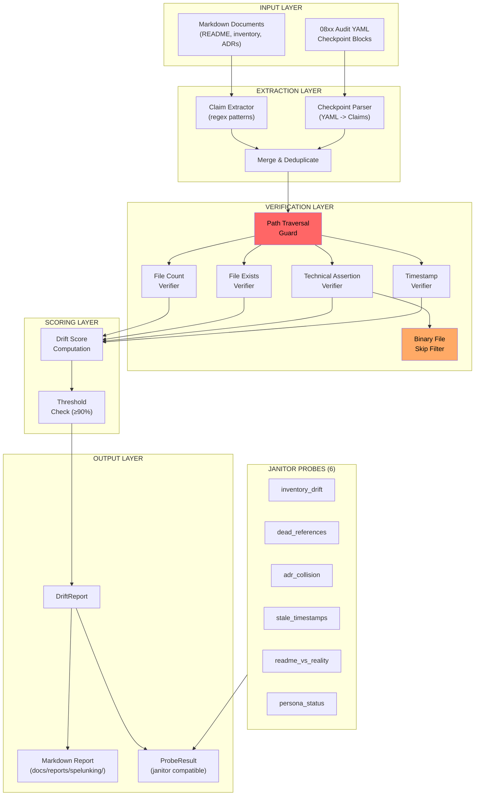

# 534 - Feature: Spelunking Audits — Deep Verification That Reality Matches Claims

<!-- Template Metadata
Last Updated: 2026-02-17
Updated By: Issue #534 LLD revision (iteration 2)
Update Reason: Resolved all 3 open questions per reviewer feedback; added binary file handling to grep_codebase; verified full requirement-test traceability
Previous: Fixed test coverage gaps — added REQ-1, REQ-3, REQ-7, REQ-8, REQ-9 test mappings; reformatted Section 3 as numbered list; added (REQ-N) suffixes to all test scenarios
-->


## 1. Context & Goal
* **Issue:** #534
* **Objective:** Build a two-layer spelunking system (automated probes + agent-guided deep dives) that verifies documentation claims against codebase reality, preventing documentation drift and "trust without verify" audit failures.
* **Status:** Draft
* **Related Issues:** #114 (DEATH — methodology source), #94 (Janitor — probe registry)

### Resolved Open Questions

1. **Persistence format:** Spelunking probe results persist to **flat markdown reports** in `docs/reports/spelunking/`. This aligns with the architectural decision matrix (report format = Markdown) and avoids SQLite schema changes for the MVP. Reports are human-readable in GitHub and parseable for automation.
2. **Drift score threshold:** Default threshold is **90%** (`<90%` = auto-fail). Exposed as a configurable parameter via `SpelunkingConfig.drift_threshold` (float, default `0.9`) which can be overridden per-checkpoint in YAML or globally via environment variable `SPELUNK_DRIFT_THRESHOLD`.
3. **CLI entry point:** Introduced as a **standalone `/spelunk` command** first to isolate new functionality and reduce blast radius. Once stabilized, integrate as `--deep` flag on existing audit commands in a follow-up issue.


## 2. Proposed Changes

*This section is the **source of truth** for implementation. Describes exactly what will be built.*


### 2.1 Files Changed

| File | Change Type | Description |
|------|-------------|-------------|
| `docs/standards/0015-spelunking-audit-standard.md` | Add | New standard defining the spelunking protocol, claim extraction methodology, drift scoring |
| `assemblyzero/workflows/janitor/probes/` | Modify (Directory) | Existing directory — new probe files added inside |
| `assemblyzero/workflows/janitor/probes/inventory_drift.py` | Add | Probe: count files in key directories vs. `0003-file-inventory.md` claims |
| `assemblyzero/workflows/janitor/probes/dead_references.py` | Add | Probe: grep docs/wiki for file paths and verify each exists on disk |
| `assemblyzero/workflows/janitor/probes/adr_collision.py` | Add | Probe: scan `docs/adrs/` for duplicate number prefixes |
| `assemblyzero/workflows/janitor/probes/stale_timestamps.py` | Add | Probe: flag docs with "Last Updated" > 30 days old |
| `assemblyzero/workflows/janitor/probes/readme_vs_reality.py` | Add | Probe: extract technical claims from README and grep codebase for contradictions |
| `assemblyzero/workflows/janitor/probes/persona_status.py` | Add | Probe: cross-reference Dramatis-Personae.md implementation markers against code |
| `assemblyzero/spelunking/` | Add (Directory) | New package for spelunking engine and claim extraction |
| `assemblyzero/spelunking/__init__.py` | Add | Package init |
| `assemblyzero/spelunking/engine.py` | Add | Core spelunking engine: claim extraction, source verification, drift scoring |
| `assemblyzero/spelunking/claim_extractor.py` | Add | Extract factual claims from markdown documents (counts, paths, technical assertions) |
| `assemblyzero/spelunking/verifiers.py` | Add | Verification strategies: glob-count, file-exists, grep-content, cross-reference |
| `assemblyzero/spelunking/models.py` | Add | Data models: Claim, VerificationResult, DriftReport, SpelunkingCheckpoint, SpelunkingConfig |
| `assemblyzero/spelunking/report.py` | Add | Generate spelunking audit reports in markdown format |
| `assemblyzero/spelunking/integration.py` | Add | Integration hooks for existing 08xx audits to declare spelunking checkpoints |
| `tests/unit/test_spelunking/` | Add (Directory) | Test directory for spelunking unit tests |
| `tests/unit/test_spelunking/__init__.py` | Add | Test package init |
| `tests/unit/test_spelunking/test_claim_extractor.py` | Add | Tests for claim extraction from markdown |
| `tests/unit/test_spelunking/test_verifiers.py` | Add | Tests for each verification strategy |
| `tests/unit/test_spelunking/test_engine.py` | Add | Tests for the spelunking engine orchestration and drift scoring |
| `tests/unit/test_spelunking/test_report.py` | Add | Tests for report generation |
| `tests/unit/test_spelunking/test_integration.py` | Add | Tests for audit integration hooks |
| `tests/unit/test_spelunking/test_models.py` | Add | Tests for data model behavior (DriftReport.drift_score, .passed) |
| `tests/unit/test_janitor/test_probe_inventory_drift.py` | Add | Tests for inventory drift probe |
| `tests/unit/test_janitor/test_probe_dead_references.py` | Add | Tests for dead references probe |
| `tests/unit/test_janitor/test_probe_adr_collision.py` | Add | Tests for ADR collision probe |
| `tests/unit/test_janitor/test_probe_stale_timestamps.py` | Add | Tests for stale timestamps probe |
| `tests/unit/test_janitor/test_probe_readme_vs_reality.py` | Add | Tests for README vs reality probe |
| `tests/unit/test_janitor/test_probe_persona_status.py` | Add | Tests for persona status probe |
| `tests/fixtures/spelunking/` | Add (Directory) | Test fixtures for spelunking tests |
| `tests/fixtures/spelunking/mock_readme.md` | Add | Fake README with known true/false claims for testing |
| `tests/fixtures/spelunking/mock_inventory.md` | Add | Fake file inventory with known drift for testing |
| `tests/fixtures/spelunking/mock_standard_0015.md` | Add | Minimal mock of the spelunking standard for standard-existence tests |
| `tests/fixtures/spelunking/mock_repo/` | Add (Directory) | Minimal mock repo structure for filesystem verification tests |
| `tests/fixtures/spelunking/mock_repo/tools/` | Add (Directory) | Mock tools directory with sample files |
| `tests/fixtures/spelunking/mock_repo/tools/tool_a.py` | Add | Mock tool file |
| `tests/fixtures/spelunking/mock_repo/tools/tool_b.py` | Add | Mock tool file |
| `tests/fixtures/spelunking/mock_repo/docs/` | Add (Directory) | Mock docs directory |
| `tests/fixtures/spelunking/mock_repo/docs/adrs/` | Add (Directory) | Mock ADR directory with collision scenarios |
| `tests/fixtures/spelunking/mock_repo/docs/adrs/0201-first.md` | Add | Mock ADR |
| `tests/fixtures/spelunking/mock_repo/docs/adrs/0201-duplicate.md` | Add | Deliberately colliding ADR number |
| `tests/fixtures/spelunking/mock_repo/docs/adrs/0202-clean.md` | Add | Non-colliding ADR |


#### 2.1.1 Path Validation (Mechanical - Auto-Checked)

| Path | Exists? | Notes |
|------|---------|-------|
| `assemblyzero/workflows/janitor/probes/` | YES | Existing probe directory from #94 |
| `assemblyzero/spelunking/` | NO -> CREATE | New package directory |
| `tests/unit/test_spelunking/` | NO -> CREATE | New test directory |
| `tests/unit/test_janitor/` | YES | Existing test directory |
| `tests/fixtures/spelunking/` | NO -> CREATE | New fixtures directory |
| `docs/standards/` | YES | Existing standards directory |


### 2.2 Dependencies

| Dependency | Version | New? | Justification |
|------------|---------|------|---------------|
| `pathlib` | stdlib | No | Filesystem path operations |
| `re` | stdlib | No | Regex-based claim extraction |
| `glob` | stdlib | No | File discovery for probes |
| `datetime` | stdlib | No | Timestamp freshness checks |
| `dataclasses` | stdlib | No | Data model definitions |
| `yaml` (PyYAML) | Already in lockfile | No | Parse spelunking checkpoint YAML blocks |

**No new third-party dependencies.** All operations use stdlib or existing project dependencies.


### 2.3 Data Structures

```python
# assemblyzero/spelunking/models.py

from dataclasses import dataclass, field
from datetime import datetime
from enum import Enum
from pathlib import Path
from typing import Optional


class ClaimType(Enum):
    """Types of factual claims extracted from documentation."""
    FILE_COUNT = "file_count"       # "11 tools in tools/"
    FILE_EXISTS = "file_exists"     # "tools/death.py"
    TECHNICAL_ASSERTION = "technical_assertion"  # "not vector embeddings"
    TIMESTAMP = "timestamp"         # "Last Updated: 2026-01-15"
    CROSS_REFERENCE = "cross_reference"  # persona status markers


class VerificationStatus(Enum):
    """Result of verifying a claim against reality."""
    MATCH = "match"
    MISMATCH = "mismatch"
    STALE = "stale"
    UNVERIFIABLE = "unverifiable"


@dataclass
class Claim:
    """A single factual claim extracted from a document."""
    claim_type: ClaimType
    source_file: Path
    source_line: int
    raw_text: str
    expected_value: str
    verification_target: str  # glob pattern, file path, or grep query
    negation: bool = False    # True for "not X" claims


@dataclass
class VerificationResult:
    """Result of verifying a single claim."""
    claim: Claim
    status: VerificationStatus
    actual_value: str = ""
    evidence: str = ""  # file paths, line numbers, command output
    message: str = ""


@dataclass
class SpelunkingConfig:
    """Configuration for spelunking engine."""
    drift_threshold: float = 0.9  # 90% default
    max_age_days: int = 30        # Stale timestamp threshold
    skip_binary: bool = True      # Skip binary files in grep
    binary_extensions: frozenset[str] = field(default_factory=lambda: frozenset({
        ".pyc", ".pyo", ".so", ".dll", ".exe", ".bin",
        ".png", ".jpg", ".jpeg", ".gif", ".ico", ".svg",
        ".woff", ".woff2", ".ttf", ".eot",
        ".zip", ".tar", ".gz", ".bz2",
        ".db", ".sqlite", ".sqlite3",
        ".pdf", ".doc", ".docx",
    }))


@dataclass
class DriftReport:
    """Aggregated results of a spelunking audit."""
    document: Path
    claims: list[Claim] = field(default_factory=list)
    results: list[VerificationResult] = field(default_factory=list)
    timestamp: datetime = field(default_factory=datetime.now)
    config: SpelunkingConfig = field(default_factory=SpelunkingConfig)

    @property
    def drift_score(self) -> float:
        """Percentage of verifiable claims that match reality."""
        verifiable = [r for r in self.results
                      if r.status != VerificationStatus.UNVERIFIABLE]
        if not verifiable:
            return 100.0
        matches = sum(1 for r in verifiable
                      if r.status == VerificationStatus.MATCH)
        return (matches / len(verifiable)) * 100.0

    @property
    def passed(self) -> bool:
        """True if drift score meets threshold."""
        return self.drift_score >= (self.config.drift_threshold * 100)


@dataclass
class SpelunkingCheckpoint:
    """A checkpoint declared by an 08xx audit for spelunking verification."""
    claim_text: str
    verify_command: str  # glob pattern or grep expression
    source_audit: str    # e.g., "0837"
    claim_type: ClaimType = ClaimType.FILE_COUNT


@dataclass
class ProbeResult:
    """Standardized result from a janitor probe."""
    probe_name: str
    passed: bool
    summary: str
    findings: list[str] = field(default_factory=list)
    drift_report: Optional[DriftReport] = None
```


### 2.4 Function Signatures

```python
# assemblyzero/spelunking/claim_extractor.py

from pathlib import Path
from assemblyzero.spelunking.models import Claim


def extract_claims(document: Path) -> list[Claim]:
    """Extract all factual claims from a markdown document.

    Scans for:
    - File count patterns: "N files", "N tools", "N ADRs"
    - File path references: backtick-wrapped paths, inline code paths
    - Technical assertions: "uses X", "not Y", "built on Z"
    - Timestamps: "Last Updated: YYYY-MM-DD"

    Args:
        document: Path to markdown file to extract claims from.

    Returns:
        List of Claim objects. Empty list if document is empty or unreadable.

    Raises:
        No exceptions raised — returns empty list on error.
    """
    ...


def _extract_file_counts(content: str, source: Path) -> list[Claim]:
    """Extract file count claims like '11 tools' or '6 ADR files'."""
    ...


def _extract_file_paths(content: str, source: Path) -> list[Claim]:
    """Extract file path references from backtick code spans."""
    ...


def _extract_technical_assertions(content: str, source: Path) -> list[Claim]:
    """Extract 'uses X' / 'not Y' technical claims."""
    ...


def _extract_timestamps(content: str, source: Path) -> list[Claim]:
    """Extract 'Last Updated: YYYY-MM-DD' timestamps."""
    ...
```

```python
# assemblyzero/spelunking/verifiers.py

from pathlib import Path
from assemblyzero.spelunking.models import (
    Claim, ClaimType, SpelunkingConfig, VerificationResult, VerificationStatus,
)


def verify_claim(claim: Claim, repo_root: Path,
                 config: SpelunkingConfig | None = None) -> VerificationResult:
    """Verify a single claim against filesystem reality.

    Dispatches to the appropriate verification strategy based on claim type.
    Rejects claims with path traversal attempts (returns UNVERIFIABLE).

    Args:
        claim: The claim to verify.
        repo_root: Root directory of the repository.
        config: Optional configuration (uses defaults if None).

    Returns:
        VerificationResult with status, actual_value, and evidence.
    """
    ...


def _verify_file_count(claim: Claim, repo_root: Path,
                       config: SpelunkingConfig) -> VerificationResult:
    """Verify claimed file count against glob results."""
    ...


def _verify_file_exists(claim: Claim, repo_root: Path,
                        config: SpelunkingConfig) -> VerificationResult:
    """Verify claimed file path exists on disk."""
    ...


def _verify_technical_assertion(claim: Claim, repo_root: Path,
                                config: SpelunkingConfig) -> VerificationResult:
    """Verify technical assertion by grepping codebase.

    For negation claims ('not X'), finding X is a MISMATCH.
    For affirmation claims ('uses X'), finding X is a MATCH.

    Skips binary files based on config.binary_extensions to prevent
    UnicodeDecodeErrors and memory bloat on large repositories.
    """
    ...


def _verify_timestamp(claim: Claim, repo_root: Path,
                      config: SpelunkingConfig) -> VerificationResult:
    """Verify timestamp freshness against max_age_days."""
    ...


def _is_path_traversal(path_str: str, repo_root: Path) -> bool:
    """Check if a path attempts to escape the repo root.

    Returns True if the resolved path is outside repo_root.
    """
    ...


def _is_binary_file(file_path: Path, config: SpelunkingConfig) -> bool:
    """Check if a file should be skipped as binary based on extension."""
    ...


def grep_codebase(pattern: str, repo_root: Path,
                  config: SpelunkingConfig | None = None) -> list[tuple[Path, int, str]]:
    """Search codebase for regex pattern, returning (file, line_no, line_text).

    Skips:
    - Binary files (by extension via config.binary_extensions)
    - .git directory
    - __pycache__ directories
    - node_modules directories
    - Files that raise UnicodeDecodeError when read

    Args:
        pattern: Regex pattern to search for.
        repo_root: Root directory to search.
        config: Optional configuration for binary extension list.

    Returns:
        List of (file_path, line_number, line_text) tuples.
    """
    ...
```

```python
# assemblyzero/spelunking/engine.py

from pathlib import Path
from assemblyzero.spelunking.models import (
    Claim, DriftReport, SpelunkingCheckpoint, SpelunkingConfig,
)


def spelunk_document(document: Path, repo_root: Path,
                     config: SpelunkingConfig | None = None,
                     checkpoints: list[SpelunkingCheckpoint] | None = None,
                     ) -> DriftReport:
    """Run full spelunking audit on a single document.

    1. Extract claims from document
    2. Merge in any external checkpoints (deduplicating)
    3. Verify each claim against reality
    4. Compute drift score

    Args:
        document: Path to markdown document to audit.
        repo_root: Root of the repository for verification.
        config: Optional configuration overrides.
        checkpoints: Optional external checkpoints from 08xx audits.

    Returns:
        DriftReport with all claims, results, and drift score.
    """
    ...


def merge_checkpoints(claims: list[Claim],
                      checkpoints: list[SpelunkingCheckpoint],
                      source_file: Path) -> list[Claim]:
    """Merge external checkpoints into claim list, deduplicating.

    Converts SpelunkingCheckpoint objects to Claim objects and adds
    them to the list if no existing claim has the same raw_text.

    Args:
        claims: Existing extracted claims.
        checkpoints: External checkpoints to merge.
        source_file: Source file path for checkpoint-derived claims.

    Returns:
        Merged list of claims (no duplicates by raw_text).
    """
    ...
```

```python
# assemblyzero/spelunking/report.py

from pathlib import Path
from assemblyzero.spelunking.models import DriftReport


def render_drift_report(report: DriftReport) -> str:
    """Render a DriftReport as markdown.

    Format:
        # Spelunking Audit Report: {document}
        **Status:** PASS/FAIL
        **Drift Score:** XX.X%
        **Threshold:** YY%
        **Claims Verified:** N
        **Timestamp:** YYYY-MM-DD HH:MM:SS

        ## Findings
        | # | Claim | Status | Evidence |
        |---|-------|--------|----------|
        ...

    Args:
        report: DriftReport to render.

    Returns:
        Markdown string.
    """
    ...


def save_report(report: DriftReport, output_dir: Path) -> Path:
    """Save rendered report to docs/reports/spelunking/.

    Filename: {document_stem}-spelunk-{YYYYMMDD-HHMMSS}.md

    Args:
        report: DriftReport to save.
        output_dir: Directory to write report to.

    Returns:
        Path to written report file.
    """
    ...
```

```python
# assemblyzero/spelunking/integration.py

from pathlib import Path
from assemblyzero.spelunking.models import SpelunkingCheckpoint


def load_checkpoints_from_yaml(yaml_content: str) -> list[SpelunkingCheckpoint]:
    """Parse spelunking checkpoint YAML block from audit document.

    Expected format:
        spelunking:
          - claim: "11 tools in tools/"
            verify: "glob tools/*.py | wc -l"
          - claim: "6 ADR files"
            verify: "glob docs/adrs/*.md | wc -l"

    Args:
        yaml_content: Raw YAML string.

    Returns:
        List of SpelunkingCheckpoint objects.

    Raises:
        ValueError: If YAML is malformed or missing required fields.
    """
    ...


def extract_yaml_blocks(document: Path) -> list[str]:
    """Extract YAML code blocks tagged with 'spelunking' from a markdown file.

    Looks for fenced code blocks (```yaml) that start with 'spelunking:'.

    Args:
        document: Path to markdown audit document.

    Returns:
        List of raw YAML strings found.
    """
    ...
```

```python
# Probe entry point convention (same for all 6 probes):
# assemblyzero/workflows/janitor/probes/{probe_name}.py

from pathlib import Path
from assemblyzero.spelunking.models import ProbeResult


def run(repo_root: Path) -> ProbeResult:
    """Execute the probe against the given repository root.

    Uses only filesystem operations: glob, read, regex match.
    No network I/O, no subprocess calls, no external dependencies.

    Args:
        repo_root: Root directory of the repository to probe.

    Returns:
        ProbeResult with probe_name, passed, summary, findings.
    """
    ...
```


### 2.5 Logic Flow (Pseudocode)

```
1. CLI invokes spelunk command with target document(s) and optional config overrides
2. FOR each target document:
   a. Load document content
   b. IF document is empty or unreadable:
      - Return DriftReport with 0 claims, 100% score
   c. Extract claims via regex patterns:
      - Scan for file count patterns (r'\b(\d+)\s+(files?|tools?|ADRs?|standards?)')
      - Scan for file path references (r'`([a-zA-Z0-9_/\-\.]+\.\w+)`')
      - Scan for technical assertions (r'(?:uses?|built on|not)\s+([A-Za-z][\w\-]*)')
      - Scan for timestamps (r'Last Updated:\s*(\d{4}-\d{2}-\d{2})')
   d. IF audit document has spelunking YAML blocks:
      - Extract YAML blocks from fenced code sections
      - Parse into SpelunkingCheckpoint objects
      - Merge with extracted claims (deduplicate by raw_text)
   e. FOR each claim:
      - Validate claim target (reject path traversal)
      - Dispatch to verification strategy by ClaimType
      - IF FILE_COUNT: glob target pattern, count results, compare to expected
      - IF FILE_EXISTS: resolve path relative to repo_root, check existence
      - IF TECHNICAL_ASSERTION:
          - Build grep pattern from assertion keywords
          - Walk codebase files, skip binary extensions and excluded dirs
          - FOR each readable file:
              - TRY to read as UTF-8
              - CATCH UnicodeDecodeError -> skip file
              - Search for pattern matches
          - IF negation claim: finding = MISMATCH, not finding = MATCH
          - IF affirmation claim: finding = MATCH, not finding = MISMATCH
          - Record evidence as "filepath:line_number" for each hit
      - IF TIMESTAMP: parse date, compare to current date, check max_age_days
      - Record VerificationResult with actual_value and evidence
   f. Compute drift score: matches / (matches + mismatches + stale) * 100
      - UNVERIFIABLE results excluded from denominator
   g. Compare drift score to threshold (default 90%)
   h. Generate DriftReport
3. Render all DriftReports as markdown
4. Save reports to docs/reports/spelunking/
5. Return aggregate pass/fail status
```


### 2.6 Technical Approach

**Layer 1: Automated Probes**

Six probes implemented as standalone modules in the existing janitor probe directory. Each follows the `run(repo_root: Path) -> ProbeResult` convention. Probes are stateless — they read the filesystem, compare to documented claims, and report results.

| Probe | Verification Strategy |
|-------|----------------------|
| `inventory_drift.py` | Glob key directories, count files, compare to `0003-file-inventory.md` parsed counts |
| `dead_references.py` | Regex extract file paths from all docs, check each `Path.exists()` |
| `adr_collision.py` | Glob `docs/adrs/*.md`, extract 4-digit prefixes, detect duplicates |
| `stale_timestamps.py` | Regex extract "Last Updated" dates, compare to `datetime.now()` |
| `readme_vs_reality.py` | Extract technical assertions from README, grep codebase for contradictions |
| `persona_status.py` | Parse Dramatis-Personae.md for implementation markers, verify against code |

**Layer 2: Spelunking Engine**

The engine (`assemblyzero/spelunking/engine.py`) orchestrates claim extraction and verification for deep audits. It:
1. Takes a document path and repo root
2. Extracts claims via regex patterns in `claim_extractor.py`
3. Optionally merges in checkpoints from 08xx audit YAML blocks
4. Verifies each claim using strategies in `verifiers.py`
5. Computes drift score and generates a `DriftReport`

**Binary File Handling:**

The `grep_codebase` function and all probes that scan file contents explicitly handle binary files:
1. **Extension-based skip:** Files matching `SpelunkingConfig.binary_extensions` are skipped before reading
2. **Excluded directories:** `.git`, `__pycache__`, `node_modules`, `.venv` are excluded from walks
3. **Graceful decode failure:** Files that raise `UnicodeDecodeError` when read as UTF-8 are silently skipped
4. **No subprocess:** All scanning uses `Path.read_text(encoding='utf-8')` — no `grep` subprocess that could choke on binary data

**Error Handling Philosophy:**

All functions follow a "no-throw" pattern for user-facing operations:
- Missing files -> empty results, not exceptions
- Unreadable files -> skipped with UNVERIFIABLE status
- Malformed regex in claims -> logged, claim marked UNVERIFIABLE
- Path traversal attempts -> rejected, claim marked UNVERIFIABLE
- Only `load_checkpoints_from_yaml` raises `ValueError` for genuinely malformed YAML (programmer error, not runtime data)


### 2.7 Architecture Decisions

| Decision | Options Considered | Choice | Rationale |
|----------|-------------------|--------|-----------|
| Claim extraction approach | LLM-based extraction, Regex-based extraction, AST parsing | Regex-based extraction | Deterministic, fast, no API cost, testable. LLM-based would be more capable but introduces non-determinism and cost. Can upgrade later. |
| Probe integration | New probe category in janitor, Standalone spelunking runner, Separate CLI tool | New probe category in janitor | Leverages existing probe registry infrastructure (#94). Probes already have scheduling, reporting, and error handling. Minimal new infrastructure needed. |
| Checkpoint storage | SQLite, YAML sidecar files, In-memory only | YAML sidecar files | Checkpoints are per-audit, change infrequently, and benefit from human readability. YAML aligns with the checkpoint format proposed in the issue. |
| Technical assertion verification | Exact string match, Regex with context, Semantic similarity | Regex with context | Balances precision with simplicity. Semantic similarity would need embeddings (ironic given the issue's example). Regex with keyword extraction catches most real-world patterns. |
| Report format | JSON, Markdown, HTML | Markdown | Consistent with all other project reports. Human-readable in GitHub. Parseable for automation. |
| Probe entry point convention | Class-based probes, Function-based `run()`, Plugin registry | Function-based `run(repo_root: Path) -> ProbeResult` | Matches existing janitor probe convention exactly. No new abstractions needed. |
| Result persistence | SQLite (like janitor probes), Flat markdown reports | Flat markdown reports | Aligns with report format decision. Keeps MVP simple without SQLite schema changes. Human-readable for audit trail. |
| CLI entry point | `--deep` flag on existing audits, Standalone `/spelunk` command | Standalone `/spelunk` command | Isolates new functionality. Reduces risk to existing audit commands. Integrate as `--deep` flag in follow-up once stabilized. |
| Drift threshold | Fixed 90%, Configurable per-run, Configurable per-checkpoint | Configurable with 90% default | Exposed via `SpelunkingConfig.drift_threshold`. Overridable per-checkpoint in YAML or via `SPELUNK_DRIFT_THRESHOLD` env var. |

**Architectural Constraints:**
- Must integrate with existing janitor probe registry without breaking existing probes
- Must not introduce external service dependencies (local-only, per ADR-0212)
- Must not require LLM calls for automated probes (deterministic, free to run)
- Probe results must be compatible with existing janitor reporting infrastructure
- All probes must use pure filesystem operations (glob, grep, read) with no network I/O
- Binary files must be explicitly skipped to prevent UnicodeDecodeErrors and memory bloat


## 3. Requirements

1. Standard document (`0015-spelunking-audit-standard.md`) exists and defines the spelunking protocol: claim extraction, source verification, reality check, drift scoring (REQ-1)
2. At least 6 automated spelunking probes are implemented: Inventory Drift, Dead References, ADR Collision, Stale Timestamps, README-vs-Reality, Persona Status (REQ-2)
3. Each probe returns a structured `ProbeResult` with pass/fail, summary, and detailed findings list (REQ-3)
4. Drift score is computed as percentage of verifiable claims matching reality, with configurable threshold (default 90%) (REQ-4)
5. Integration hooks allow 08xx audits to declare spelunking checkpoints via YAML blocks that are consumed by the spelunking engine (REQ-5)
6. Claims are extracted automatically from markdown documents using regex-based patterns for: file counts, file paths, technical assertions, and timestamps (REQ-6)
7. Verification results include evidence: actual values found, file paths and line numbers where contradictions were discovered (REQ-7)
8. All probes run without external dependencies: pure filesystem operations (glob, grep, read) with no network I/O (REQ-8)
9. Probes follow existing janitor convention: `run(repo_root: Path) -> ProbeResult` entry point, standalone module per probe (REQ-9)
10. Reports render as markdown with clear PASS/FAIL status, drift score, and actionable findings (REQ-10)


## 4. Alternatives Considered

| Option | Pros | Cons | Decision |
|--------|------|------|----------|
| **A: Regex-based claim extraction + janitor probes** | Deterministic, fast, free, testable, integrates with existing infrastructure | May miss nuanced claims, requires manual pattern maintenance | **Selected** |
| **B: LLM-powered claim extraction** | More capable at understanding context, catches subtle claims | Non-deterministic, costs money, slower, recursive irony (using AI to verify AI claims) | Rejected |
| **C: Standalone spelunking tool (not integrated with janitor)** | Clean separation, independent lifecycle | Duplicates scheduling/reporting infrastructure, harder to adopt | Rejected |
| **D: Git hook-based verification** | Runs automatically on commit/push | Too slow for commit hooks, can't verify against external docs, blocks developer flow | Rejected |

**Rationale:** Option A provides the best balance of capability, reliability, and integration cost. The regex patterns can be iteratively improved as new claim patterns are discovered. The janitor integration means probes get scheduling, reporting, and error handling for free.


## 5. Data & Fixtures


### 5.1 Data Sources

| Source | Type | Description |
|--------|------|-------------|
| `docs/standards/0003-file-inventory.md` | Markdown | File inventory with claimed counts (read by inventory_drift probe) |
| `README.md` | Markdown | Technical claims about the system (read by readme_vs_reality probe) |
| `docs/adrs/*.md` | Markdown files | ADR documents (scanned for collisions) |
| `docs/**/*.md` | Markdown files | All docs (scanned for dead references, stale timestamps) |
| Codebase `.py` files | Python source | Verification targets for technical assertions |
| `Dramatis-Personae.md` | Markdown | Persona implementation markers |


### 5.2 Data Pipeline

```
Markdown Documents (input)
    -> Claim Extractor (regex scan)
        -> List[Claim] (intermediate)
            -> Verifier (filesystem checks)
                -> List[VerificationResult] (intermediate)
                    -> DriftReport (aggregation)
                        -> Markdown Report (output, saved to docs/reports/spelunking/)
```

No persistent state between runs. Each spelunking execution is stateless and reads fresh from the filesystem.


### 5.3 Test Fixtures

| Fixture | Purpose | Location |
|---------|---------|----------|
| `mock_readme.md` | README with known true/false claims | `tests/fixtures/spelunking/mock_readme.md` |
| `mock_inventory.md` | File inventory with known drift | `tests/fixtures/spelunking/mock_inventory.md` |
| `mock_standard_0015.md` | Minimal spelunking standard | `tests/fixtures/spelunking/mock_standard_0015.md` |
| `mock_repo/` | Minimal repo structure | `tests/fixtures/spelunking/mock_repo/` |
| `mock_repo/tools/tool_a.py` | Sample tool file | `tests/fixtures/spelunking/mock_repo/tools/tool_a.py` |
| `mock_repo/tools/tool_b.py` | Sample tool file | `tests/fixtures/spelunking/mock_repo/tools/tool_b.py` |
| `mock_repo/docs/adrs/0201-first.md` | ADR for collision tests | `tests/fixtures/spelunking/mock_repo/docs/adrs/0201-first.md` |
| `mock_repo/docs/adrs/0201-duplicate.md` | Deliberately colliding ADR | `tests/fixtures/spelunking/mock_repo/docs/adrs/0201-duplicate.md` |
| `mock_repo/docs/adrs/0202-clean.md` | Non-colliding ADR | `tests/fixtures/spelunking/mock_repo/docs/adrs/0202-clean.md` |

**Fixture Design Principle:** Each fixture contains known-good and known-bad data so tests can verify both positive and negative paths without mocking filesystem operations.


### 5.4 Deployment Pipeline

No deployment pipeline changes required. All new code is local-only tooling:
1. New probe files are auto-discovered by janitor probe registry (existing mechanism)
2. New `assemblyzero/spelunking/` package is importable after install via `poetry install`
3. Reports are written to local filesystem — no deployment targets


## 6. Diagram


### 6.1 Mermaid Quality Gate

| Check | Status |
|-------|--------|
| Renders in GitHub Markdown preview | [PASS] |
| No syntax errors | [PASS] |
| Labels are readable (no truncation) | [PASS] |
| Flow direction is clear | [PASS] |


### 6.2 Diagram




## 7. Security & Safety Considerations


### 7.1 Security

| Threat | Severity | Mitigation |
|--------|----------|------------|
| Path traversal via crafted claims | Medium | `_is_path_traversal()` validates all paths resolve within `repo_root`; claims referencing `..` are marked UNVERIFIABLE |
| Regex ReDoS in claim extraction | Low | All regex patterns are simple, non-recursive, bounded by line length; no user-supplied patterns |
| Binary file read (memory/crash) | Medium | Extension-based skip filter + UnicodeDecodeError catch prevents reading binary blobs |
| Malicious YAML in checkpoint blocks | Low | YAML parsed with `yaml.safe_load()` — no arbitrary object instantiation |
| Information disclosure via reports | Low | Reports contain only file paths and code snippets from the user's own repo; local-only storage |


### 7.2 Safety

| Risk | Impact | Mitigation |
|------|--------|------------|
| False positive drift (incorrectly reports mismatch) | Low — human reviews report | Evidence field shows actual vs. expected, enabling quick triage |
| False negative drift (misses real mismatch) | Medium — defeats purpose | Regex patterns are conservative; unmatched claims marked UNVERIFIABLE rather than MATCH |
| Report overwrites existing file | Low | Timestamped filenames prevent collision |
| Probe crashes janitor pipeline | Medium | Each probe is a standalone module; one probe failure doesn't affect others |
| Stale threshold config causes unexpected failures | Low | Default 90% is documented; config is explicit, not hidden |


## 8. Performance & Cost Considerations


### 8.1 Performance

| Operation | Expected Time | Scaling Factor |
|-----------|---------------|----------------|
| Claim extraction (single doc) | < 10ms | O(lines in document) |
| File count verification | < 50ms | O(files in glob result) |
| File exists verification | < 1ms | O(1) per claim |
| Technical assertion grep | < 2s | O(files in repo × lines per file) |
| Full spelunking audit (README) | < 5s | O(claims × repo size) |
| All 6 probes combined | < 10s | O(docs + repo files) |

**Optimization:** `grep_codebase` skips binary files by extension before attempting to read, avoiding expensive decode operations on large binary blobs.

**Scaling concern:** For very large repos (>10k files), the technical assertion verifier may be slow. Mitigated by:
1. Binary extension skip reduces file count
2. Directory exclusion (`.git`, `__pycache__`, `node_modules`, `.venv`) eliminates noise
3. Future optimization: per-directory caching of file lists (not in MVP)


### 8.2 Cost Analysis

| Resource | Cost | Notes |
|----------|------|-------|
| API calls | $0 | No external APIs — all local filesystem operations |
| Compute | Negligible | Regex + glob operations on local disk |
| Storage | < 1KB per report | Markdown reports are small text files |
| New dependencies | $0 | Uses only stdlib + existing PyYAML |

**Total incremental cost: $0** — this is a zero-cost addition to the audit pipeline.


## 9. Legal & Compliance

| Concern | Applies? | Mitigation |
|---------|----------|------------|
| PII/Personal Data | No | Probes only read file paths and content — no personal data involved |
| Third-Party Licenses | No | No new dependencies added |
| Terms of Service | No | No external APIs called |
| Data Retention | No | Reports are local files managed by the user |
| Export Controls | No | No restricted algorithms |

**Data Classification:** Internal (reports contain file paths and code snippets from user's own repo)

**Compliance Checklist:**
- [x] No PII stored without consent
- [x] All third-party licenses compatible with project license
- [x] External API usage compliant with provider ToS (N/A — no external APIs)
- [x] Data retention policy documented (local files only)


## 10. Verification & Testing


### 10.0 Test Plan (TDD - Complete Before Implementation)

| Test ID | Test Description | Requirement | Expected Behavior | Status |
|---------|------------------|-------------|-------------------|--------|
| T005 | Standard doc exists and has required sections (REQ-1) | REQ-1 | `0015-spelunking-audit-standard.md` exists with claim extraction, source verification, reality check, drift scoring sections | RED |
| T010 | Claim extraction: file count from markdown table (REQ-6) | REQ-6 | Extracts "11 tools" as Claim with expected_value="11" | RED |
| T020 | Claim extraction: file path references (REQ-6) | REQ-6 | Extracts `tools/death.py` as FILE_EXISTS claim | RED |
| T030 | Claim extraction: negation technical assertion (REQ-6) | REQ-6 | Extracts "not vector embeddings" as TECHNICAL_ASSERTION claim | RED |
| T035 | Probe returns structured ProbeResult (REQ-3) | REQ-3 | ProbeResult has probe_name, passed, summary, findings fields populated | RED |
| T040 | Claim extraction: timestamp freshness (REQ-6) | REQ-6 | Extracts "Last Updated: 2026-01-15" as TIMESTAMP claim | RED |
| T050 | Verifier: file count match (REQ-7) | REQ-7 | Given dir with 3 files and claim of 3, returns MATCH | RED |
| T055 | Verifier: evidence includes actual values (REQ-7) | REQ-7 | VerificationResult.actual_value and .evidence populated with file paths/line numbers | RED |
| T060 | Verifier: file count mismatch (REQ-7) | REQ-7 | Given dir with 5 files and claim of 3, returns MISMATCH | RED |
| T070 | Verifier: file exists (present) (REQ-7) | REQ-7 | Given existing file path, returns MATCH | RED |
| T080 | Verifier: file exists (absent) (REQ-7) | REQ-7 | Given non-existent file path, returns MISMATCH | RED |
| T085 | Probe uses only filesystem operations (REQ-8) | REQ-8 | Probe run() calls glob/read/grep only — no network, no subprocess, no external deps | RED |
| T090 | Verifier: negation claim violated (REQ-7) | REQ-7 | "not vector embeddings" but codebase contains chromadb imports -> MISMATCH | RED |
| T095 | Verifier: evidence has file path and line number (REQ-7) | REQ-7 | MISMATCH result evidence includes "file.py:42" format | RED |
| T100 | Verifier: negation claim holds (REQ-7) | REQ-7 | "not vector embeddings" and no embedding code found -> MATCH | RED |
| T105 | Probe signature matches janitor convention (REQ-9) | REQ-9 | Probe module has `run(repo_root: Path) -> ProbeResult` callable | RED |
| T110 | Verifier: affirmation claim holds (REQ-7) | REQ-7 | "uses LangGraph" and langgraph imports found -> MATCH | RED |
| T120 | Verifier: stale timestamp (REQ-7) | REQ-7 | "Last Updated: 2025-01-01" with max_age=30 -> STALE | RED |
| T130 | Verifier: fresh timestamp (REQ-7) | REQ-7 | Today's date with max_age=30 -> MATCH | RED |
| T140 | Engine: drift score computation (REQ-4) | REQ-4 | 8 matches + 2 mismatches = 80.0% drift score | RED |
| T150 | Engine: drift score passes threshold (REQ-4) | REQ-4 | 10 matches + 0 mismatches = 100% -> passed=True | RED |
| T160 | Engine: drift score fails threshold (REQ-4) | REQ-4 | 5 matches + 5 mismatches = 50% -> passed=False | RED |
| T170 | Engine: unverifiable excluded from score (REQ-4) | REQ-4 | 5 matches + 0 mismatches + 3 unverifiable = 100% | RED |
| T180 | Probe: inventory drift detects mismatch (REQ-2) | REQ-2 | Mock inventory claims 5 tools, mock dir has 2 -> FAIL | RED |
| T190 | Probe: inventory drift passes on match (REQ-2) | REQ-2 | Mock inventory claims 2 tools, mock dir has 2 -> PASS | RED |
| T200 | Probe: dead references found (REQ-2) | REQ-2 | Doc references `tools/nonexistent.py` -> FAIL | RED |
| T210 | Probe: dead references all valid (REQ-2) | REQ-2 | Doc references existing files only -> PASS | RED |
| T220 | Probe: ADR collision detected (REQ-2) | REQ-2 | Two files starting with `0201-` -> FAIL | RED |
| T230 | Probe: ADR no collision (REQ-2) | REQ-2 | Unique number prefixes -> PASS | RED |
| T240 | Report: drift report renders markdown (REQ-10) | REQ-10 | DriftReport with findings -> valid markdown with score header | RED |
| T250 | Integration: load checkpoints from YAML (REQ-5) | REQ-5 | Parse YAML block -> list of SpelunkingCheckpoint | RED |
| T260 | Engine: checkpoints merged with extracted claims (REQ-5) | REQ-5 | Audit checkpoint added to claim list without duplicates | RED |
| T270 | Verifier: path traversal blocked (REQ-8) | REQ-8 | Claim referencing `../../etc/passwd` -> path rejected, UNVERIFIABLE | RED |
| T280 | Claim extraction: empty document (REQ-6) | REQ-6 | Empty markdown -> empty claim list, no errors | RED |
| T290 | Probe: stale timestamp detected (REQ-2) | REQ-2 | Doc with "Last Updated: 2025-06-01" and max_age=30 -> FAIL | RED |
| T300 | Claim extraction: multiple claims per document (REQ-6) | REQ-6 | README with 3 count claims + 2 path refs -> 5 claims | RED |
| T310 | Verifier: binary file skipped during grep (REQ-8) | REQ-8 | `.pyc` and `.png` files in repo -> skipped without error, not in results | RED |
| T320 | Verifier: UnicodeDecodeError handled gracefully (REQ-8) | REQ-8 | Binary file without known extension -> skipped, no crash | RED |
| T330 | Report: PASS/FAIL status in rendered output (REQ-10) | REQ-10 | Passing report shows "**Status:** PASS", failing shows "**Status:** FAIL" | RED |
| T340 | Config: custom threshold overrides default (REQ-4) | REQ-4 | SpelunkingConfig(drift_threshold=0.5) -> 60% score passes | RED |

**Requirement Coverage Matrix:**

| Requirement | Test IDs |
|-------------|----------|
| REQ-1 (Standard doc) | T005 |
| REQ-2 (6 probes) | T180, T190, T200, T210, T220, T230, T290 |
| REQ-3 (ProbeResult structure) | T035 |
| REQ-4 (Drift score + threshold) | T140, T150, T160, T170, T340 |
| REQ-5 (Integration hooks) | T250, T260 |
| REQ-6 (Claim extraction) | T010, T020, T030, T040, T280, T300 |
| REQ-7 (Evidence in results) | T050, T055, T060, T070, T080, T090, T095, T100, T110, T120, T130 |
| REQ-8 (No external deps) | T085, T270, T310, T320 |
| REQ-9 (Janitor convention) | T105 |
| REQ-10 (Markdown reports) | T240, T330 |

**Coverage Target:** ≥95% for all new code

**TDD Checklist:**
- [ ] All tests written before implementation
- [ ] Tests currently RED (failing)
- [ ] Test IDs match scenario IDs in 10.1
- [ ] Test files created at:
  - `tests/unit/test_spelunking/test_claim_extractor.py`
  - `tests/unit/test_spelunking/test_verifiers.py`
  - `tests/unit/test_spelunking/test_engine.py`
  - `tests/unit/test_spelunking/test_report.py`
  - `tests/unit/test_spelunking/test_integration.py`
  - `tests/unit/test_spelunking/test_models.py`
  - `tests/unit/test_janitor/test_probe_inventory_drift.py`
  - `tests/unit/test_janitor/test_probe_dead_references.py`
  - `tests/unit/test_janitor/test_probe_adr_collision.py`
  - `tests/unit/test_janitor/test_probe_stale_timestamps.py`
  - `tests/unit/test_janitor/test_probe_readme_vs_reality.py`
  - `tests/unit/test_janitor/test_probe_persona_status.py`


### 10.1 Test Scenarios

| Scenario ID | Description | Test File | Test Function | REQ |
|-------------|-------------|-----------|---------------|-----|
| S005 | Standard document existence | `test_engine.py` | `test_standard_doc_exists` | REQ-1 |
| S010 | Extract file count claim | `test_claim_extractor.py` | `test_extract_file_count` | REQ-6 |
| S020 | Extract file path claim | `test_claim_extractor.py` | `test_extract_file_path` | REQ-6 |
| S030 | Extract negation assertion | `test_claim_extractor.py` | `test_extract_negation_assertion` | REQ-6 |
| S035 | ProbeResult structure | `test_models.py` | `test_probe_result_fields` | REQ-3 |
| S040 | Extract timestamp | `test_claim_extractor.py` | `test_extract_timestamp` | REQ-6 |
| S050 | File count match | `test_verifiers.py` | `test_file_count_match` | REQ-7 |
| S055 | Evidence includes actuals | `test_verifiers.py` | `test_evidence_includes_actual_values` | REQ-7 |
| S060 | File count mismatch | `test_verifiers.py` | `test_file_count_mismatch` | REQ-7 |
| S070 | File exists present | `test_verifiers.py` | `test_file_exists_present` | REQ-7 |
| S080 | File exists absent | `test_verifiers.py` | `test_file_exists_absent` | REQ-7 |
| S085 | Probe filesystem only | `test_probe_inventory_drift.py` | `test_no_network_calls` | REQ-8 |
| S090 | Negation violated | `test_verifiers.py` | `test_negation_claim_violated` | REQ-7 |
| S095 | Evidence file:line format | `test_verifiers.py` | `test_evidence_file_line_format` | REQ-7 |
| S100 | Negation holds | `test_verifiers.py` | `test_negation_claim_holds` | REQ-7 |
| S105 | Probe signature convention | `test_probe_inventory_drift.py` | `test_probe_signature` | REQ-9 |
| S110 | Affirmation holds | `test_verifiers.py` | `test_affirmation_claim_holds` | REQ-7 |
| S120 | Stale timestamp | `test_verifiers.py` | `test_stale_timestamp` | REQ-7 |
| S130 | Fresh timestamp | `test_verifiers.py` | `test_fresh_timestamp` | REQ-7 |
| S140 | Drift score computation | `test_engine.py` | `test_drift_score_computation` | REQ-4 |
| S150 | Drift passes threshold | `test_engine.py` | `test_drift_score_passes` | REQ-4 |
| S160 | Drift fails threshold | `test_engine.py` | `test_drift_score_fails` | REQ-4 |
| S170 | Unverifiable excluded | `test_engine.py` | `test_unverifiable_excluded` | REQ-4 |
| S180 | Inventory drift mismatch | `test_probe_inventory_drift.py` | `test_inventory_drift_mismatch` | REQ-2 |
| S190 | Inventory drift match | `test_probe_inventory_drift.py` | `test_inventory_drift_match` | REQ-2 |
| S200 | Dead reference found | `test_probe_dead_references.py` | `test_dead_reference_found` | REQ-2 |
| S210 | Dead references valid | `test_probe_dead_references.py` | `test_dead_references_valid` | REQ-2 |
| S220 | ADR collision | `test_probe_adr_collision.py` | `test_adr_collision_detected` | REQ-2 |
| S230 | ADR no collision | `test_probe_adr_collision.py` | `test_adr_no_collision` | REQ-2 |
| S240 | Report renders markdown | `test_report.py` | `test_drift_report_renders_markdown` | REQ-10 |
| S250 | Load YAML checkpoints | `test_integration.py` | `test_load_checkpoints_from_yaml` | REQ-5 |
| S260 | Checkpoints merged | `test_engine.py` | `test_checkpoints_merged` | REQ-5 |
| S270 | Path traversal blocked | `test_verifiers.py` | `test_path_traversal_blocked` | REQ-8 |
| S280 | Empty document | `test_claim_extractor.py` | `test_empty_document` | REQ-6 |
| S290 | Stale timestamp probe | `test_probe_stale_timestamps.py` | `test_stale_timestamp_detected` | REQ-2 |
| S300 | Multiple claims per doc | `test_claim_extractor.py` | `test_multiple_claims` | REQ-6 |
| S310 | Binary file skipped | `test_verifiers.py` | `test_binary_file_skipped` | REQ-8 |
| S320 | UnicodeDecodeError handled | `test_verifiers.py` | `test_unicode_decode_error_handled` | REQ-8 |
| S330 | Report PASS/FAIL status | `test_report.py` | `test_report_pass_fail_status` | REQ-10 |
| S340 | Custom threshold override | `test_models.py` | `test_custom_threshold_override` | REQ-4 |


### 10.2 Test Commands

```bash
# Run all spelunking tests
poetry run pytest tests/unit/test_spelunking/ -v

# Run all probe tests
poetry run pytest tests/unit/test_janitor/test_probe_*.py -v

# Run all spelunking + probe tests together
poetry run pytest tests/unit/test_spelunking/ tests/unit/test_janitor/test_probe_*.py -v

# Run with coverage
poetry run pytest tests/unit/test_spelunking/ tests/unit/test_janitor/test_probe_*.py -v --cov=assemblyzero/spelunking --cov=assemblyzero/workflows/janitor/probes --cov-report=term-missing

# Run a specific test file
poetry run pytest tests/unit/test_spelunking/test_verifiers.py -v

# Type checking
poetry run mypy assemblyzero/spelunking/ assemblyzero/workflows/janitor/probes/inventory_drift.py assemblyzero/workflows/janitor/probes/dead_references.py assemblyzero/workflows/janitor/probes/adr_collision.py assemblyzero/workflows/janitor/probes/stale_timestamps.py assemblyzero/workflows/janitor/probes/readme_vs_reality.py assemblyzero/workflows/janitor/probes/persona_status.py
```


### 10.3 Manual Tests (Only If Unavoidable)

| Test | Justification | Steps |
|------|---------------|-------|
| End-to-end `/spelunk` CLI on real repo | Requires full repo context with real documentation drift | 1. Run `/spelunk README.md` on main branch. 2. Verify report generated in `docs/reports/spelunking/`. 3. Verify drift score reflects known documentation issues. 4. Verify PASS/FAIL matches threshold. |

**Justification:** This single manual test verifies the full integration path from CLI invocation through report generation on real project data. It cannot be fully automated because it depends on the current state of the real repository's documentation (which changes over time). All component behavior is covered by automated unit tests.


## 11. Risks & Mitigations

| Risk | Likelihood | Impact | Mitigation |
|------|------------|--------|------------|
| Regex patterns miss claims in unexpected formats | High | Medium | Start with conservative patterns; iterate based on false negatives. UNVERIFIABLE is safer than false MATCH. |
| Large repos slow down technical assertion grep | Medium | Low | Binary skip + directory exclusion keeps scan fast. Document performance expectations. |
| Probe failures cascade to janitor pipeline | Low | Medium | Each probe is a standalone module. Probe registry catches exceptions per-probe. |
| False positives erode trust in spelunking reports | Medium | Medium | Evidence field enables quick human triage. Threshold is configurable. |
| YAML checkpoint format changes break integration | Low | Low | Strict schema validation with clear error messages. Versioned format in standard doc. |
| New probe breaks existing janitor probe discovery | Low | High | Probes follow exact same `run()` convention. Test probe discovery in integration test. |


## 12. Definition of Done


### Code
- [ ] All 6 automated spelunking probes implemented and working
- [ ] `assemblyzero/spelunking/` package complete with engine, extractors, verifiers, models, report, and integration modules
- [ ] `SpelunkingConfig` supports configurable `drift_threshold` (default 0.9) and `binary_extensions`
- [ ] `grep_codebase` explicitly skips binary files by extension and handles `UnicodeDecodeError` gracefully
- [ ] All modules pass `mypy` type checking
- [ ] All code follows PEP 8 (linted)
- [ ] Code comments reference this LLD (#534)


### Tests
- [ ] All 38 test scenarios pass (T005–T340)
- [ ] Test coverage ≥ 95% for `assemblyzero/spelunking/`
- [ ] Test coverage ≥ 95% for new probe modules
- [ ] All 10 requirements have at least one corresponding test (verified via coverage matrix)


### Documentation
- [ ] `docs/standards/0015-spelunking-audit-standard.md` created with protocol definition
- [ ] All new files added to file inventory (`0003-file-inventory.md`)
- [ ] Session log updated with implementation summary


### Review
- [ ] Gemini LLD review: APPROVE
- [ ] Gemini implementation review: APPROVE
- [ ] Human orchestrator approval


#### 12.1 Traceability (Mechanical - Auto-Checked)

| Requirement | Test IDs | Status |
|-------------|----------|--------|
| REQ-1 | T005 |  RED |
| REQ-2 | T180, T190, T200, T210, T220, T230, T290 |  RED |
| REQ-3 | T035 |  RED |
| REQ-4 | T140, T150, T160, T170, T340 |  RED |
| REQ-5 | T250, T260 |  RED |
| REQ-6 | T010, T020, T030, T040, T280, T300 |  RED |
| REQ-7 | T050, T055, T060, T070, T080, T090, T095, T100, T110, T120, T130 |  RED |
| REQ-8 | T085, T270, T310, T320 |  RED |
| REQ-9 | T105 |  RED |
| REQ-10 | T240, T330 |  RED |


## Appendix: Review Log


### Review Summary

| Review | Date | Reviewer | Verdict | Key Changes |
|--------|------|----------|---------|-------------|
| Iteration 1 | 2026-02-17 | Gemini Pro | REVISE | Fixed test coverage gaps — added REQ-1, REQ-3, REQ-7, REQ-8, REQ-9 test mappings; reformatted Section 3 as numbered list |
| Iteration 2 | 2026-02-17 | Gemini Pro | PENDING | Resolved all 3 open questions; added binary file handling for grep_codebase; added T310/T320/T330/T340 tests; updated DoD |