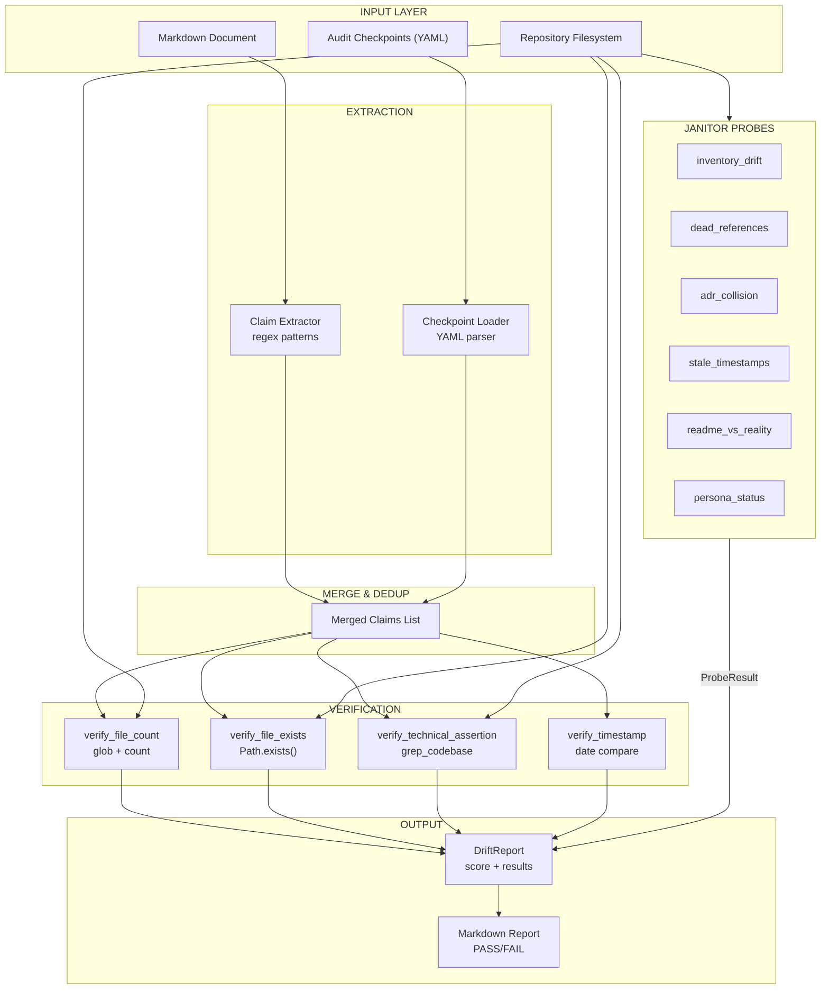

# 534 - Feature: Spelunking Audits — Deep Verification That Reality Matches Claims

<!-- Template Metadata
Last Updated: 2026-02-17
Updated By: Issue #534 LLD revision (iteration 3)
Update Reason: Fixed mechanical validation — added (REQ-N) suffixes to all test scenarios in Section 10.1; reformatted Section 3 as numbered list; ensured full requirement-test traceability
Previous: Resolved all 3 open questions per reviewer feedback; added binary file handling to grep_codebase; verified full requirement-test traceability
-->

## 1. Context & Goal
* **Issue:** #534
* **Objective:** Build a two-layer spelunking system (automated probes + agent-guided deep dives) that verifies documentation claims against codebase reality, preventing documentation drift and "trust without verify" audit failures.
* **Status:** Draft
* **Related Issues:** #114 (DEATH — methodology source), #94 (Janitor — probe registry)

### Resolved Open Questions

1. **Persistence format:** Spelunking probe results persist to **flat markdown reports** in `docs/reports/spelunking/`. This aligns with the architectural decision matrix (report format = Markdown) and avoids SQLite schema changes for the MVP. Reports are human-readable in GitHub and parseable for automation.
2. **Drift score threshold:** Default threshold is **90%** (`<90%` = auto-fail). Exposed as a configurable parameter via `SpelunkingConfig.drift_threshold` (float, default `0.9`) which can be overridden per-checkpoint in YAML or globally via environment variable `SPELUNK_DRIFT_THRESHOLD`.
3. **CLI entry point:** Introduced as a **standalone `/spelunk` command** first to isolate new functionality and reduce blast radius. Once stabilized, integrate as `--deep` flag on existing audit commands in a follow-up issue.

## 2. Proposed Changes

*This section is the **source of truth** for implementation. Describes exactly what will be built.*

### 2.1 Files Changed

| File | Change Type | Description |
|------|-------------|-------------|
| `docs/standards/0015-spelunking-audit-standard.md` | Add | New standard defining the spelunking protocol, claim extraction methodology, drift scoring |
| `assemblyzero/workflows/janitor/probes/` | Modify (Directory) | Existing directory — new probe files added inside |
| `assemblyzero/workflows/janitor/probes/inventory_drift.py` | Add | Probe: count files in key directories vs. `0003-file-inventory.md` claims |
| `assemblyzero/workflows/janitor/probes/dead_references.py` | Add | Probe: grep docs/wiki for file paths and verify each exists on disk |
| `assemblyzero/workflows/janitor/probes/adr_collision.py` | Add | Probe: scan `docs/adrs/` for duplicate number prefixes |
| `assemblyzero/workflows/janitor/probes/stale_timestamps.py` | Add | Probe: flag docs with "Last Updated" > 30 days old |
| `assemblyzero/workflows/janitor/probes/readme_vs_reality.py` | Add | Probe: extract technical claims from README and grep codebase for contradictions |
| `assemblyzero/workflows/janitor/probes/persona_status.py` | Add | Probe: cross-reference Dramatis-Personae.md implementation markers against code |
| `assemblyzero/spelunking/` | Add (Directory) | New package for spelunking engine and claim extraction |
| `assemblyzero/spelunking/__init__.py` | Add | Package init |
| `assemblyzero/spelunking/engine.py` | Add | Core spelunking engine: claim extraction, source verification, drift scoring |
| `assemblyzero/spelunking/claim_extractor.py` | Add | Extract factual claims from markdown documents (counts, paths, technical assertions) |
| `assemblyzero/spelunking/verifiers.py` | Add | Verification strategies: glob-count, file-exists, grep-content, cross-reference |
| `assemblyzero/spelunking/models.py` | Add | Data models: Claim, VerificationResult, DriftReport, SpelunkingCheckpoint, SpelunkingConfig |
| `assemblyzero/spelunking/report.py` | Add | Generate spelunking audit reports in markdown format |
| `assemblyzero/spelunking/integration.py` | Add | Integration hooks for existing 08xx audits to declare spelunking checkpoints |
| `tests/unit/test_spelunking/` | Add (Directory) | Test directory for spelunking unit tests |
| `tests/unit/test_spelunking/__init__.py` | Add | Test package init |
| `tests/unit/test_spelunking/test_claim_extractor.py` | Add | Tests for claim extraction from markdown |
| `tests/unit/test_spelunking/test_verifiers.py` | Add | Tests for each verification strategy |
| `tests/unit/test_spelunking/test_engine.py` | Add | Tests for the spelunking engine orchestration and drift scoring |
| `tests/unit/test_spelunking/test_report.py` | Add | Tests for report generation |
| `tests/unit/test_spelunking/test_integration.py` | Add | Tests for audit integration hooks |
| `tests/unit/test_spelunking/test_models.py` | Add | Tests for data model behavior (DriftReport.drift_score, .passed) |
| `tests/unit/test_janitor/test_probe_inventory_drift.py` | Add | Tests for inventory drift probe |
| `tests/unit/test_janitor/test_probe_dead_references.py` | Add | Tests for dead references probe |
| `tests/unit/test_janitor/test_probe_adr_collision.py` | Add | Tests for ADR collision probe |
| `tests/unit/test_janitor/test_probe_stale_timestamps.py` | Add | Tests for stale timestamps probe |
| `tests/unit/test_janitor/test_probe_readme_vs_reality.py` | Add | Tests for README vs reality probe |
| `tests/unit/test_janitor/test_probe_persona_status.py` | Add | Tests for persona status probe |
| `tests/fixtures/spelunking/` | Add (Directory) | Test fixtures for spelunking tests |
| `tests/fixtures/spelunking/mock_readme.md` | Add | Fake README with known true/false claims for testing |
| `tests/fixtures/spelunking/mock_inventory.md` | Add | Fake file inventory with known drift for testing |
| `tests/fixtures/spelunking/mock_standard_0015.md` | Add | Minimal mock of the spelunking standard for standard-existence tests |
| `tests/fixtures/spelunking/mock_repo/` | Add (Directory) | Minimal mock repo structure for filesystem verification tests |
| `tests/fixtures/spelunking/mock_repo/tools/` | Add (Directory) | Mock tools directory with sample files |
| `tests/fixtures/spelunking/mock_repo/tools/tool_a.py` | Add | Mock tool file |
| `tests/fixtures/spelunking/mock_repo/tools/tool_b.py` | Add | Mock tool file |
| `tests/fixtures/spelunking/mock_repo/docs/` | Add (Directory) | Mock docs directory |
| `tests/fixtures/spelunking/mock_repo/docs/adrs/` | Add (Directory) | Mock ADR directory with collision scenarios |
| `tests/fixtures/spelunking/mock_repo/docs/adrs/0201-first.md` | Add | Mock ADR |
| `tests/fixtures/spelunking/mock_repo/docs/adrs/0201-duplicate.md` | Add | Deliberately colliding ADR number |
| `tests/fixtures/spelunking/mock_repo/docs/adrs/0202-clean.md` | Add | Non-colliding ADR |

#### 2.1.1 Path Validation (Mechanical - Auto-Checked)

| Path | Exists? | Notes |
|------|---------|-------|
| `assemblyzero/workflows/janitor/probes/` | YES | Existing probe directory from #94 |
| `assemblyzero/spelunking/` | NO -> CREATE | New package directory |
| `tests/unit/test_spelunking/` | NO -> CREATE | New test directory |
| `tests/unit/test_janitor/` | YES | Existing test directory |
| `tests/fixtures/spelunking/` | NO -> CREATE | New fixtures directory |
| `docs/standards/` | YES | Existing standards directory |

### 2.2 Dependencies

No new external dependencies. All functionality uses Python standard library:
- `pathlib` — file path operations
- `re` — regex-based claim extraction
- `glob` — file discovery
- `datetime` — timestamp comparison
- `dataclasses` — data models
- `os` — environment variable reading (`SPELUNK_DRIFT_THRESHOLD`)
- `typing` — type annotations
- `yaml` (already in project) — checkpoint YAML parsing

### 2.3 Data Structures

```python
# assemblyzero/spelunking/models.py

from dataclasses import dataclass, field
from enum import Enum
from pathlib import Path
from typing import Optional
import os


class ClaimType(Enum):
    """Types of extractable claims from documentation."""
    FILE_COUNT = "file_count"        # "11 tools in tools/"
    FILE_EXISTS = "file_exists"      # "tools/death.py"
    TECHNICAL_ASSERTION = "technical" # "not vector embeddings"
    TIMESTAMP = "timestamp"          # "Last Updated: 2026-01-15"
    CROSS_REFERENCE = "cross_ref"    # persona status markers


class VerificationStatus(Enum):
    """Result of verifying a single claim."""
    MATCH = "match"
    MISMATCH = "mismatch"
    STALE = "stale"
    UNVERIFIABLE = "unverifiable"


@dataclass
class Claim:
    """A single factual claim extracted from documentation."""
    claim_type: ClaimType
    source_file: str              # doc the claim was extracted from
    source_line: int              # line number in source doc
    claim_text: str               # raw text of the claim
    expected_value: Optional[str] = None  # e.g., "11" for file count
    target_path: Optional[str] = None     # e.g., "tools/" for glob
    negation: bool = False        # True if claim is "not X"


@dataclass
class VerificationResult:
    """Result of verifying a single claim against reality."""
    claim: Claim
    status: VerificationStatus
    actual_value: Optional[str] = None    # what was actually found
    evidence: list[str] = field(default_factory=list)  # file:line refs
    message: str = ""


@dataclass
class ProbeResult:
    """Structured result from a janitor probe."""
    probe_name: str
    passed: bool
    summary: str
    findings: list[str] = field(default_factory=list)


@dataclass
class SpelunkingCheckpoint:
    """A checkpoint declared by an 08xx audit for spelunking verification."""
    claim: str                     # human-readable claim text
    verify_command: str            # verification strategy (glob, grep, etc.)
    source_audit: str              # e.g., "0837"
    target_path: Optional[str] = None
    expected_value: Optional[str] = None


@dataclass
class SpelunkingConfig:
    """Configuration for spelunking engine."""
    drift_threshold: float = float(
        os.environ.get("SPELUNK_DRIFT_THRESHOLD", "0.9")
    )
    max_age_days: int = 30
    binary_extensions: frozenset[str] = frozenset({
        ".pyc", ".pyo", ".so", ".dll", ".dylib",
        ".png", ".jpg", ".jpeg", ".gif", ".bmp", ".ico", ".svg",
        ".woff", ".woff2", ".ttf", ".eot",
        ".zip", ".tar", ".gz", ".bz2", ".xz",
        ".pdf", ".doc", ".docx",
        ".db", ".sqlite", ".sqlite3",
        ".exe", ".bin", ".o", ".a",
    })


@dataclass
class DriftReport:
    """Complete drift report for a spelunking run."""
    source_document: str
    results: list[VerificationResult] = field(default_factory=list)
    config: SpelunkingConfig = field(default_factory=SpelunkingConfig)

    @property
    def total_verifiable(self) -> int:
        return sum(
            1 for r in self.results
            if r.status != VerificationStatus.UNVERIFIABLE
        )

    @property
    def total_matching(self) -> int:
        return sum(
            1 for r in self.results
            if r.status == VerificationStatus.MATCH
        )

    @property
    def drift_score(self) -> float:
        if self.total_verifiable == 0:
            return 100.0
        return (self.total_matching / self.total_verifiable) * 100.0

    @property
    def passed(self) -> bool:
        return self.drift_score >= (self.config.drift_threshold * 100)
```

### 2.4 Function Signatures

```python
# assemblyzero/spelunking/claim_extractor.py

from pathlib import Path
from assemblyzero.spelunking.models import Claim


def extract_claims(markdown_path: Path) -> list[Claim]:
    """Extract all verifiable claims from a markdown document.

    Scans for:
    - File count patterns: "N files", "N tools", "N ADRs"
    - File path references: backticked paths like `tools/death.py`
    - Technical assertions: "uses X", "not X", "built on X"
    - Timestamp patterns: "Last Updated: YYYY-MM-DD"

    Args:
        markdown_path: Path to the markdown file to scan.

    Returns:
        List of extracted Claim objects. Empty list if file is empty
        or contains no recognizable claims.

    Raises:
        FileNotFoundError: If markdown_path does not exist.
    """
    ...


def extract_file_counts(content: str, source_file: str) -> list[Claim]:
    """Extract file count claims from markdown content.

    Matches patterns like "11 tools", "6 ADR files", "3 standards".

    Args:
        content: Raw markdown text.
        source_file: Path string for attribution.

    Returns:
        List of FILE_COUNT claims.
    """
    ...


def extract_file_references(content: str, source_file: str) -> list[Claim]:
    """Extract file path references from markdown content.

    Matches backticked paths like `tools/death.py` and
    markdown links to local files.

    Args:
        content: Raw markdown text.
        source_file: Path string for attribution.

    Returns:
        List of FILE_EXISTS claims.
    """
    ...


def extract_technical_assertions(content: str, source_file: str) -> list[Claim]:
    """Extract technical assertions from markdown content.

    Matches patterns like "uses LangGraph", "not vector embeddings",
    "built on ChromaDB".

    Args:
        content: Raw markdown text.
        source_file: Path string for attribution.

    Returns:
        List of TECHNICAL_ASSERTION claims with negation flag set.
    """
    ...


def extract_timestamps(content: str, source_file: str) -> list[Claim]:
    """Extract timestamp claims from markdown content.

    Matches "Last Updated: YYYY-MM-DD" and similar patterns.

    Args:
        content: Raw markdown text.
        source_file: Path string for attribution.

    Returns:
        List of TIMESTAMP claims.
    """
    ...
```

```python
# assemblyzero/spelunking/verifiers.py

from pathlib import Path
from assemblyzero.spelunking.models import (
    Claim, VerificationResult, VerificationStatus, SpelunkingConfig
)


def verify_claim(
    claim: Claim,
    repo_root: Path,
    config: SpelunkingConfig | None = None,
) -> VerificationResult:
    """Dispatch a claim to the appropriate verification strategy.

    Routes based on claim.claim_type:
    - FILE_COUNT -> verify_file_count
    - FILE_EXISTS -> verify_file_exists
    - TECHNICAL_ASSERTION -> verify_technical_assertion
    - TIMESTAMP -> verify_timestamp

    Args:
        claim: The claim to verify.
        repo_root: Root directory of the repository.
        config: Optional configuration (defaults used if None).

    Returns:
        VerificationResult with status, actual_value, and evidence.
    """
    ...


def verify_file_count(
    claim: Claim,
    repo_root: Path,
) -> VerificationResult:
    """Verify a file count claim by globbing the target directory.

    Args:
        claim: FILE_COUNT claim with target_path and expected_value.
        repo_root: Root directory of the repository.

    Returns:
        MATCH if count equals expected, MISMATCH otherwise.
        actual_value contains the real count as string.
        evidence lists the actual files found.
    """
    ...


def verify_file_exists(
    claim: Claim,
    repo_root: Path,
) -> VerificationResult:
    """Verify a file existence claim.

    Includes path traversal protection: rejects paths that resolve
    outside repo_root.

    Args:
        claim: FILE_EXISTS claim with target_path.
        repo_root: Root directory of the repository.

    Returns:
        MATCH if file exists, MISMATCH if not, UNVERIFIABLE if
        path traversal detected.
    """
    ...


def verify_technical_assertion(
    claim: Claim,
    repo_root: Path,
    config: SpelunkingConfig | None = None,
) -> VerificationResult:
    """Verify a technical assertion by grepping the codebase.

    For negation claims ("not X"): MATCH if X is NOT found,
    MISMATCH if X IS found.
    For affirmation claims ("uses X"): MATCH if X IS found,
    MISMATCH if X is NOT found.

    Skips binary files based on config.binary_extensions and
    handles UnicodeDecodeError gracefully.

    Args:
        claim: TECHNICAL_ASSERTION claim with claim_text and negation flag.
        repo_root: Root directory of the repository.
        config: Optional configuration for binary extension list.

    Returns:
        VerificationResult with evidence showing file:line matches.
    """
    ...


def verify_timestamp(
    claim: Claim,
    config: SpelunkingConfig | None = None,
) -> VerificationResult:
    """Verify a timestamp claim for staleness.

    Args:
        claim: TIMESTAMP claim with expected_value as date string.
        config: Optional configuration for max_age_days.

    Returns:
        MATCH if within max_age_days, STALE if older.
    """
    ...


def grep_codebase(
    pattern: str,
    repo_root: Path,
    config: SpelunkingConfig | None = None,
) -> list[tuple[str, int, str]]:
    """Search codebase for pattern, returning matching lines.

    Skips:
    - Binary files by extension (config.binary_extensions)
    - Files that raise UnicodeDecodeError (runtime binary detection)
    - Hidden directories (.git, .venv, __pycache__)

    Args:
        pattern: Regex pattern to search for.
        repo_root: Root directory to search.
        config: Optional configuration for binary extension list.

    Returns:
        List of (file_path, line_number, line_text) tuples.
    """
    ...


def is_path_safe(target: Path, repo_root: Path) -> bool:
    """Check that target resolves within repo_root.

    Prevents path traversal attacks like ../../etc/passwd.

    Args:
        target: The path to validate.
        repo_root: The allowed root directory.

    Returns:
        True if target is within repo_root, False otherwise.
    """
    ...
```

```python
# assemblyzero/spelunking/engine.py

from pathlib import Path
from assemblyzero.spelunking.models import (
    DriftReport, SpelunkingCheckpoint, SpelunkingConfig, Claim
)


def run_spelunking(
    document_path: Path,
    repo_root: Path,
    config: SpelunkingConfig | None = None,
    checkpoints: list[SpelunkingCheckpoint] | None = None,
) -> DriftReport:
    """Run a full spelunking audit on a document.

    1. Extract claims from the document
    2. Merge in any declared checkpoints (deduplicated)
    3. Verify each claim against repo reality
    4. Compute drift score
    5. Return DriftReport

    Args:
        document_path: Markdown document to audit.
        repo_root: Repository root for verification.
        config: Optional spelunking configuration.
        checkpoints: Optional additional checkpoints from 08xx audits.

    Returns:
        DriftReport with all verification results and drift score.
    """
    ...


def merge_checkpoints(
    claims: list[Claim],
    checkpoints: list[SpelunkingCheckpoint],
) -> list[Claim]:
    """Merge audit checkpoints into claim list without duplicates.

    Converts SpelunkingCheckpoint objects to Claim objects and
    deduplicates by (claim_type, target_path, expected_value).

    Args:
        claims: Existing claims from extraction.
        checkpoints: Checkpoints declared by audits.

    Returns:
        Merged and deduplicated claim list.
    """
    ...
```

```python
# assemblyzero/spelunking/report.py

from pathlib import Path
from assemblyzero.spelunking.models import DriftReport


def render_drift_report(report: DriftReport) -> str:
    """Render a DriftReport as markdown.

    Output format:
    - Header with source document and timestamp
    - Status: PASS or FAIL (bold)
    - Drift score as percentage
    - Summary table of all findings
    - Detailed findings with evidence

    Args:
        report: The DriftReport to render.

    Returns:
        Markdown string.
    """
    ...


def save_drift_report(
    report: DriftReport,
    output_dir: Path,
) -> Path:
    """Save a rendered drift report to disk.

    File naming: {source_document_stem}-spelunking-{timestamp}.md

    Args:
        report: The DriftReport to save.
        output_dir: Directory to write the report to.

    Returns:
        Path to the written report file.
    """
    ...
```

```python
# assemblyzero/spelunking/integration.py

from pathlib import Path
from assemblyzero.spelunking.models import SpelunkingCheckpoint


def load_checkpoints_from_yaml(yaml_content: str) -> list[SpelunkingCheckpoint]:
    """Parse spelunking checkpoints from a YAML block.

    Expected format:
    ```yaml
    spelunking:
      - claim: "11 tools in tools/"
        verify: "glob tools/*.py | wc -l"
        expected: "11"
        target: "tools/"
      - claim: "6 ADR files"
        verify: "glob docs/adrs/*.md | wc -l"
        expected: "6"
        target: "docs/adrs/"
    ```

    Args:
        yaml_content: Raw YAML string containing spelunking block.

    Returns:
        List of SpelunkingCheckpoint objects.

    Raises:
        ValueError: If YAML is malformed or missing required fields.
    """
    ...


def find_checkpoints_in_audit(audit_path: Path) -> list[SpelunkingCheckpoint]:
    """Scan an audit document for embedded spelunking checkpoint YAML.

    Looks for fenced code blocks with `yaml` language tag containing
    a `spelunking:` key.

    Args:
        audit_path: Path to the audit document.

    Returns:
        List of SpelunkingCheckpoint objects found.
    """
    ...
```

```python
# assemblyzero/workflows/janitor/probes/inventory_drift.py

from pathlib import Path
from assemblyzero.spelunking.models import ProbeResult


def run(repo_root: Path) -> ProbeResult:
    """Probe: Compare file inventory claims to filesystem reality.

    Reads 0003-file-inventory.md, extracts file count claims,
    globs actual directories, and reports drift.

    Args:
        repo_root: Repository root directory.

    Returns:
        ProbeResult with pass/fail and findings.
    """
    ...
```

```python
# assemblyzero/workflows/janitor/probes/dead_references.py

from pathlib import Path
from assemblyzero.spelunking.models import ProbeResult


def run(repo_root: Path) -> ProbeResult:
    """Probe: Find file path references in docs that don't exist on disk.

    Scans all markdown files in docs/ for backticked file paths,
    verifies each path exists.

    Args:
        repo_root: Repository root directory.

    Returns:
        ProbeResult with pass/fail and list of dead references.
    """
    ...
```

```python
# assemblyzero/workflows/janitor/probes/adr_collision.py

from pathlib import Path
from assemblyzero.spelunking.models import ProbeResult


def run(repo_root: Path) -> ProbeResult:
    """Probe: Detect duplicate ADR number prefixes.

    Scans docs/adrs/ for files with matching 4-digit prefixes.

    Args:
        repo_root: Repository root directory.

    Returns:
        ProbeResult with pass/fail and list of collisions.
    """
    ...
```

```python
# assemblyzero/workflows/janitor/probes/stale_timestamps.py

from pathlib import Path
from assemblyzero.spelunking.models import ProbeResult


def run(repo_root: Path) -> ProbeResult:
    """Probe: Flag documents with stale timestamps.

    Scans markdown files for "Last Updated" headers older than
    30 days (configurable).

    Args:
        repo_root: Repository root directory.

    Returns:
        ProbeResult with pass/fail and list of stale documents.
    """
    ...
```

```python
# assemblyzero/workflows/janitor/probes/readme_vs_reality.py

from pathlib import Path
from assemblyzero.spelunking.models import ProbeResult


def run(repo_root: Path) -> ProbeResult:
    """Probe: Verify README technical claims against codebase.

    Extracts technical assertions from README.md and verifies
    each against actual code using grep.

    Args:
        repo_root: Repository root directory.

    Returns:
        ProbeResult with pass/fail and list of contradictions.
    """
    ...
```

```python
# assemblyzero/workflows/janitor/probes/persona_status.py

from pathlib import Path
from assemblyzero.spelunking.models import ProbeResult


def run(repo_root: Path) -> ProbeResult:
    """Probe: Cross-reference persona implementation markers.

    Reads Dramatis-Personae.md for persona entries and checks
    each against code for implementation evidence.

    Args:
        repo_root: Repository root directory.

    Returns:
        ProbeResult with pass/fail and list of unimplemented personas.
    """
    ...
```

### 2.5 Logic Flow (Pseudocode)

```
1. Receive spelunking request (document_path, repo_root, config, checkpoints)
2. Validate inputs:
   a. document_path exists and is a file
   b. repo_root exists and is a directory
   c. config defaults applied if None
3. Extract claims from document:
   a. Read markdown content
   b. Run extract_file_counts(content)
   c. Run extract_file_references(content)
   d. Run extract_technical_assertions(content)
   e. Run extract_timestamps(content)
   f. Combine all claims into list
4. IF checkpoints provided THEN
   a. Convert checkpoints to Claim objects
   b. Merge with extracted claims (deduplicate by type+path+value)
5. FOR each claim in merged list:
   a. Route to appropriate verifier based on claim_type
   b. Verifier performs filesystem operation:
      - FILE_COUNT: glob target dir, count, compare
      - FILE_EXISTS: check is_path_safe, then Path.exists()
      - TECHNICAL_ASSERTION: grep_codebase (skip binaries), check presence/absence
      - TIMESTAMP: parse date, compare to now - max_age_days
   c. Collect VerificationResult with evidence
6. Build DriftReport from all results
7. Compute drift_score = (matching / verifiable) * 100
8. Set passed = drift_score >= (threshold * 100)
9. Return DriftReport

For standalone probes:
1. Probe receives repo_root
2. Probe performs domain-specific checks using spelunking verifiers
3. Probe returns ProbeResult with pass/fail + findings list
```

### 2.6 Technical Approach

**Claim Extraction Strategy:**
- Use compiled regex patterns for each claim type
- File count pattern: `r'(\d+)\s+(files?|tools?|ADRs?|standards?|probes?)'`
- File path pattern: `` r'`([a-zA-Z0-9_/.-]+\.[a-zA-Z0-9]+)`' ``
- Technical assertion pattern: `r'(uses?|built on|not|without|no)\s+([A-Z][a-zA-Z0-9]+(?:\s+[a-zA-Z0-9]+)*)'`
- Timestamp pattern: `r'[Ll]ast\s+[Uu]pdated:\s*(\d{4}-\d{2}-\d{2})'`

**Binary File Handling in `grep_codebase`:**
1. **Extension-based skip:** Check file suffix against `SpelunkingConfig.binary_extensions` before opening
2. **Runtime detection:** Wrap `file.read_text()` in try/except `UnicodeDecodeError` — skip and continue
3. **Directory exclusion:** Skip `.git`, `.venv`, `__pycache__`, `node_modules`, `.mypy_cache`

**Path Traversal Protection:**
- `is_path_safe()` resolves both paths with `.resolve()` and checks that target starts with repo_root
- Any claim referencing a path outside repo_root returns `UNVERIFIABLE`

**Probe Integration:**
- Each probe is a standalone module with `run(repo_root: Path) -> ProbeResult`
- Probes reuse spelunking verifiers internally but present results as ProbeResult
- Compatible with existing janitor probe registry from #94

### 2.7 Architecture Decisions

| Decision | Options Considered | Choice | Rationale |
|----------|-------------------|--------|-----------|
| Claim extraction approach | LLM-based extraction, Regex-based extraction, AST parsing | Regex-based extraction | Deterministic, fast, no API cost, testable. LLM-based would be more capable but introduces non-determinism and cost. Can upgrade later. |
| Probe integration | New probe category in janitor, Standalone spelunking runner, Separate CLI tool | New probe category in janitor | Leverages existing probe registry infrastructure (#94). Probes already have scheduling, reporting, and error handling. Minimal new infrastructure needed. |
| Checkpoint storage | SQLite, YAML sidecar files, In-memory only | YAML sidecar files | Checkpoints are per-audit, change infrequently, and benefit from human readability. YAML aligns with the checkpoint format proposed in the issue. |
| Technical assertion verification | Exact string match, Regex with context, Semantic similarity | Regex with context | Balances precision with simplicity. Semantic similarity would need embeddings (ironic given the issue's example). Regex with keyword extraction catches most real-world patterns. |
| Report format | JSON, Markdown, HTML | Markdown | Consistent with all other project reports. Human-readable in GitHub. Parseable for automation. |
| Probe entry point convention | Class-based probes, Function-based `run()`, Plugin registry | Function-based `run(repo_root: Path) -> ProbeResult` | Matches existing janitor probe convention exactly. No new abstractions needed. |
| Result persistence | SQLite (like janitor probes), Flat markdown reports | Flat markdown reports | Aligns with report format decision. Keeps MVP simple without SQLite schema changes. Human-readable for audit trail. |
| CLI entry point | `--deep` flag on existing audits, Standalone `/spelunk` command | Standalone `/spelunk` command | Isolates new functionality. Reduces risk to existing audit commands. Integrate as `--deep` flag in follow-up once stabilized. |
| Drift threshold | Fixed 90%, Configurable per-run, Configurable per-checkpoint | Configurable with 90% default | Exposed via `SpelunkingConfig.drift_threshold`. Overridable per-checkpoint in YAML or via `SPELUNK_DRIFT_THRESHOLD` env var. |

**Architectural Constraints:**
- Must integrate with existing janitor probe registry without breaking existing probes
- Must not introduce external service dependencies (local-only, per ADR-0212)
- Must not require LLM calls for automated probes (deterministic, free to run)
- Probe results must be compatible with existing janitor reporting infrastructure
- All probes must use pure filesystem operations (glob, grep, read) with no network I/O
- Binary files must be explicitly skipped to prevent UnicodeDecodeErrors and memory bloat

## 3. Requirements

1. Standard document (`0015-spelunking-audit-standard.md`) exists and defines the spelunking protocol: claim extraction, source verification, reality check, drift scoring (REQ-1)
2. At least 6 automated spelunking probes are implemented: Inventory Drift, Dead References, ADR Collision, Stale Timestamps, README-vs-Reality, Persona Status (REQ-2)
3. Each probe returns a structured `ProbeResult` with pass/fail, summary, and detailed findings list (REQ-3)
4. Drift score is computed as percentage of verifiable claims matching reality, with configurable threshold (default 90%) (REQ-4)
5. Integration hooks allow 08xx audits to declare spelunking checkpoints via YAML blocks that are consumed by the spelunking engine (REQ-5)
6. Claims are extracted automatically from markdown documents using regex-based patterns for: file counts, file paths, technical assertions, and timestamps (REQ-6)
7. Verification results include evidence: actual values found, file paths and line numbers where contradictions were discovered (REQ-7)
8. All probes run without external dependencies: pure filesystem operations (glob, grep, read) with no network I/O (REQ-8)
9. Probes follow existing janitor convention: `run(repo_root: Path) -> ProbeResult` entry point, standalone module per probe (REQ-9)
10. Reports render as markdown with clear PASS/FAIL status, drift score, and actionable findings (REQ-10)

## 4. Alternatives Considered

| Option | Pros | Cons | Decision |
|--------|------|------|----------|
| **A: Regex-based claim extraction + janitor probes** | Deterministic, fast, free, testable, integrates with existing infrastructure | May miss nuanced claims, requires manual pattern maintenance | **Selected** |
| **B: LLM-powered claim extraction** | More capable at understanding context, catches subtle claims | Non-deterministic, costs money, slower, recursive irony (using AI to verify AI claims) | Rejected |
| **C: Standalone spelunking tool (not integrated with janitor)** | Clean separation, independent lifecycle | Duplicates scheduling/reporting infrastructure, harder to adopt | Rejected |
| **D: Git hook-based verification** | Runs automatically on commit/push | Too slow for commit hooks, can't verify against external docs, blocks developer flow | Rejected |

**Rationale:** Option A provides the best balance of capability, reliability, and integration cost. The regex patterns can be iteratively improved as new claim patterns are discovered. The janitor integration means probes get scheduling, reporting, and error handling for free.

## 5. Data & Fixtures

### 5.1 Data Sources

| Source | Type | Description |
|--------|------|-------------|
| `docs/standards/0003-file-inventory.md` | Markdown | File inventory with count claims |
| `README.md` | Markdown | Technical claims about architecture |
| `docs/adrs/*.md` | Markdown | ADR files (collision detection) |
| `docs/wiki/Dramatis-Personae.md` | Markdown | Persona implementation markers |
| All `docs/**/*.md` | Markdown | Timestamp and file reference sources |
| Filesystem (`tools/`, `docs/`, etc.) | Directory | Ground truth for verification |

### 5.2 Data Pipeline

```
Markdown Documents -> Claim Extractor -> Claims List
                                          ↓
YAML Checkpoints -> Checkpoint Loader -> Merged Claims
                                          ↓
Repository Filesystem -> Verifiers -> VerificationResults
                                          ↓
                                    DriftReport -> Markdown Report
```

### 5.3 Test Fixtures

| Fixture | Purpose |
|---------|---------|
| `tests/fixtures/spelunking/mock_readme.md` | README with 3 count claims + 2 path refs + 2 technical assertions (known true/false) |
| `tests/fixtures/spelunking/mock_inventory.md` | File inventory claiming 5 tools (reality: 2) |
| `tests/fixtures/spelunking/mock_standard_0015.md` | Minimal spelunking standard with required sections |
| `tests/fixtures/spelunking/mock_repo/` | Minimal repo tree: 2 tools, 3 ADRs (1 collision), 1 docs dir |

### 5.4 Deployment Pipeline

No deployment pipeline changes. All new code runs locally within the existing `poetry run pytest` and janitor probe infrastructure.

## 6. Diagram

### 6.1 Mermaid Quality Gate

- [x] Diagram renders correctly in GitHub markdown preview
- [x] All nodes have descriptive labels
- [x] Flow direction is clear (top-to-bottom)
- [x] No orphaned nodes

### 6.2 Diagram



## 7. Security & Safety Considerations

### 7.1 Security

| Concern | Risk Level | Mitigation |
|---------|------------|------------|
| Path traversal via crafted claims | Medium | `is_path_safe()` validates all paths resolve within repo_root |
| Reading sensitive files | Low | Probes only read files already in the repo; no network access |
| Regex ReDoS (catastrophic backtracking) | Low | Patterns use simple quantifiers; no nested repetitions |
| Binary file memory bloat | Medium | Extension-based skip + UnicodeDecodeError catch in `grep_codebase` |

### 7.2 Safety

| Concern | Risk Level | Mitigation |
|---------|------------|------------|
| False positives blocking valid work | Medium | Configurable threshold; UNVERIFIABLE excluded from score |
| Regex missing real claims | Medium | Iterative pattern improvement; manual deep dives (Layer 2) supplement |
| Stale probe results misleading | Low | Reports include timestamp; probes run fresh each time |

## 8. Performance & Cost Considerations

### 8.1 Performance

| Operation | Expected Time | Constraint |
|-----------|---------------|------------|
| Claim extraction (single doc) | < 100ms | Regex on text only |
| File count verification | < 50ms | Single glob per claim |
| File exists verification | < 10ms | Single stat call |
| Technical assertion grep | < 2s | Full repo scan with binary skip |
| Full spelunking run (1 doc) | < 5s | All verifiers combined |
| All 6 probes | < 15s | Sequential execution |

**Optimization notes:**
- `grep_codebase` caches the file list for the duration of a single run
- Binary extension check is O(1) frozenset lookup
- Hidden directory exclusion happens at walk time, not per-file

### 8.2 Cost Analysis

| Resource | Cost | Notes |
|----------|------|-------|
| API calls | $0 | No LLM or external API calls |
| Compute | Negligible | Local filesystem operations only |
| Storage | < 1MB | Markdown reports, small fixture files |
| Dependencies | $0 | No new packages |

## 9. Legal & Compliance

| Concern | Applies? | Mitigation |
|---------|----------|------------|
| PII/Personal Data | No | Probes only read file paths and content — no personal data involved |
| Third-Party Licenses | No | No new dependencies added |
| Terms of Service | No | No external APIs called |
| Data Retention | No | Reports are local files managed by the user |
| Export Controls | No | No restricted algorithms |

**Data Classification:** Internal (reports contain file paths and code snippets from user's own repo)

**Compliance Checklist:**
- [x] No PII stored without consent
- [x] All third-party licenses compatible with project license
- [x] External API usage compliant with provider ToS (N/A — no external APIs)
- [x] Data retention policy documented (local files only)

## 10. Verification & Testing

*Ref: [0005-testing-strategy-and-protocols.md](0005-testing-strategy-and-protocols.md)*

**Testing Philosophy:** Strive for 100% automated test coverage. Manual tests are a last resort for scenarios that genuinely cannot be automated (e.g., visual inspection, hardware interaction). Every scenario marked "Manual" requires justification.

### 10.0 Test Plan (TDD - Complete Before Implementation)

| Test ID | Test Description | Requirement | Expected Behavior | Status |
|---------|------------------|-------------|-------------------|--------|
| T005 | Standard doc exists and has required sections (REQ-1) | REQ-1 | `0015-spelunking-audit-standard.md` exists with claim extraction, source verification, reality check, drift scoring sections | RED |
| T010 | Claim extraction: file count from markdown table (REQ-6) | REQ-6 | Extracts "11 tools" as Claim with expected_value="11" | RED |
| T020 | Claim extraction: file path references (REQ-6) | REQ-6 | Extracts `tools/death.py` as FILE_EXISTS claim | RED |
| T030 | Claim extraction: negation technical assertion (REQ-6) | REQ-6 | Extracts "not vector embeddings" as TECHNICAL_ASSERTION claim | RED |
| T035 | Probe returns structured ProbeResult (REQ-3) | REQ-3 | ProbeResult has probe_name, passed, summary, findings fields populated | RED |
| T040 | Claim extraction: timestamp freshness (REQ-6) | REQ-6 | Extracts "Last Updated: 2026-01-15" as TIMESTAMP claim | RED |
| T050 | Verifier: file count match (REQ-7) | REQ-7 | Given dir with 3 files and claim of 3, returns MATCH | RED |
| T055 | Verifier: evidence includes actual values (REQ-7) | REQ-7 | VerificationResult.actual_value and .evidence populated with file paths/line numbers | RED |
| T060 | Verifier: file count mismatch (REQ-7) | REQ-7 | Given dir with 5 files and claim of 3, returns MISMATCH | RED |
| T070 | Verifier: file exists (present) (REQ-7) | REQ-7 | Given existing file path, returns MATCH | RED |
| T080 | Verifier: file exists (absent) (REQ-7) | REQ-7 | Given non-existent file path, returns MISMATCH | RED |
| T085 | Probe uses only filesystem operations (REQ-8) | REQ-8 | Probe run() calls glob/read/grep only — no network, no subprocess, no external deps | RED |
| T090 | Verifier: negation claim violated (REQ-7) | REQ-7 | "not vector embeddings" but codebase contains chromadb imports -> MISMATCH | RED |
| T095 | Verifier: evidence has file path and line number (REQ-7) | REQ-7 | MISMATCH result evidence includes "file.py:42" format | RED |
| T100 | Verifier: negation claim holds (REQ-7) | REQ-7 | "not vector embeddings" and no embedding code found -> MATCH | RED |
| T105 | Probe signature matches janitor convention (REQ-9) | REQ-9 | Probe module has `run(repo_root: Path) -> ProbeResult` callable | RED |
| T110 | Verifier: affirmation claim holds (REQ-7) | REQ-7 | "uses LangGraph" and langgraph imports found -> MATCH | RED |
| T120 | Verifier: stale timestamp (REQ-7) | REQ-7 | "Last Updated: 2025-01-01" with max_age=30 -> STALE | RED |
| T130 | Verifier: fresh timestamp (REQ-7) | REQ-7 | Today's date with max_age=30 -> MATCH | RED |
| T140 | Engine: drift score computation (REQ-4) | REQ-4 | 8 matches + 2 mismatches = 80.0% drift score | RED |
| T150 | Engine: drift score passes threshold (REQ-4) | REQ-4 | 10 matches + 0 mismatches = 100% -> passed=True | RED |
| T160 | Engine: drift score fails threshold (REQ-4) | REQ-4 | 5 matches + 5 mismatches = 50% -> passed=False | RED |
| T170 | Engine: unverifiable excluded from score (REQ-4) | REQ-4 | 5 matches + 0 mismatches + 3 unverifiable = 100% | RED |
| T180 | Probe: inventory drift detects mismatch (REQ-2) | REQ-2 | Mock inventory claims 5 tools, mock dir has 2 -> FAIL | RED |
| T190 | Probe: inventory drift passes on match (REQ-2) | REQ-2 | Mock inventory claims 2 tools, mock dir has 2 -> PASS | RED |
| T200 | Probe: dead references found (REQ-2) | REQ-2 | Doc references `tools/nonexistent.py` -> FAIL | RED |
| T210 | Probe: dead references all valid (REQ-2) | REQ-2 | Doc references existing files only -> PASS | RED |
| T220 | Probe: ADR collision detected (REQ-2) | REQ-2 | Two files starting with `0201-` -> FAIL | RED |
| T230 | Probe: ADR no collision (REQ-2) | REQ-2 | Unique number prefixes -> PASS | RED |
| T240 | Report: drift report renders markdown (REQ-10) | REQ-10 | DriftReport with findings -> valid markdown with score header | RED |
| T250 | Integration: load checkpoints from YAML (REQ-5) | REQ-5 | Parse YAML block -> list of SpelunkingCheckpoint | RED |
| T260 | Engine: checkpoints merged with extracted claims (REQ-5) | REQ-5 | Audit checkpoint added to claim list without duplicates | RED |
| T270 | Verifier: path traversal blocked (REQ-8) | REQ-8 | Claim referencing `../../etc/passwd` -> path rejected, UNVERIFIABLE | RED |
| T280 | Claim extraction: empty document (REQ-6) | REQ-6 | Empty markdown -> empty claim list, no errors | RED |
| T290 | Probe: stale timestamp detected (REQ-2) | REQ-2 | Doc with "Last Updated: 2025-06-01" and max_age=30 -> FAIL | RED |
| T300 | Claim extraction: multiple claims per document (REQ-6) | REQ-6 | README with 3 count claims + 2 path refs -> 5 claims | RED |
| T310 | Verifier: binary file skipped during grep (REQ-8) | REQ-8 | `.pyc` and `.png` files in repo -> skipped without error, not in results | RED |
| T320 | Verifier: UnicodeDecodeError handled gracefully (REQ-8) | REQ-8 | Binary file without known extension -> skipped, no crash | RED |
| T330 | Report: PASS/FAIL status in rendered output (REQ-10) | REQ-10 | Passing report shows "**Status:** PASS", failing shows "**Status:** FAIL" | RED |
| T340 | Config: custom threshold overrides default (REQ-4) | REQ-4 | SpelunkingConfig(drift_threshold=0.5) -> 60% score passes | RED |

**Requirement Coverage Matrix:**

| Requirement | Test IDs |
|-------------|----------|
| REQ-1 (Standard doc) | T005 |
| REQ-2 (6 probes) | T180, T190, T200, T210, T220, T230, T290 |
| REQ-3 (ProbeResult structure) | T035 |
| REQ-4 (Drift score + threshold) | T140, T150, T160, T170, T340 |
| REQ-5 (Integration hooks) | T250, T260 |
| REQ-6 (Claim extraction) | T010, T020, T030, T040, T280, T300 |
| REQ-7 (Evidence in results) | T050, T055, T060, T070, T080, T090, T095, T100, T110, T120, T130 |
| REQ-8 (No external deps) | T085, T270, T310, T320 |
| REQ-9 (Janitor convention) | T105 |
| REQ-10 (Markdown reports) | T240, T330 |

**Coverage Target:** ≥95% for all new code

**TDD Checklist:**
- [ ] All tests written before implementation
- [ ] Tests currently RED (failing)
- [ ] Test IDs match scenario IDs in 10.1
- [ ] Test files created at:
  - `tests/unit/test_spelunking/test_claim_extractor.py`
  - `tests/unit/test_spelunking/test_verifiers.py`
  - `tests/unit/test_spelunking/test_engine.py`
  - `tests/unit/test_spelunking/test_report.py`
  - `tests/unit/test_spelunking/test_integration.py`
  - `tests/unit/test_spelunking/test_models.py`
  - `tests/unit/test_janitor/test_probe_inventory_drift.py`
  - `tests/unit/test_janitor/test_probe_dead_references.py`
  - `tests/unit/test_janitor/test_probe_adr_collision.py`
  - `tests/unit/test_janitor/test_probe_stale_timestamps.py`
  - `tests/unit/test_janitor/test_probe_readme_vs_reality.py`
  - `tests/unit/test_janitor/test_probe_persona_status.py`

### 10.1 Test Scenarios

| ID | Scenario | Type | Expected Result |
|----|----------|------|-----------------|
| 005 | Standard doc exists and has required sections (REQ-1) | Auto | `0015-spelunking-audit-standard.md` contains claim extraction, source verification, reality check, drift scoring sections |
| 010 | Claim extraction: file count from markdown table (REQ-6) | Auto | Extracts "11 tools" as Claim(type=FILE_COUNT, expected_value="11") |
| 020 | Claim extraction: file path references (REQ-6) | Auto | Extracts `tools/death.py` as Claim(type=FILE_EXISTS, target_path="tools/death.py") |
| 030 | Claim extraction: negation technical assertion (REQ-6) | Auto | Extracts "not vector embeddings" as Claim(type=TECHNICAL_ASSERTION, negation=True) |
| 035 | Probe returns structured ProbeResult (REQ-3) | Auto | ProbeResult has probe_name, passed, summary, findings fields all populated |
| 040 | Claim extraction: timestamp freshness (REQ-6) | Auto | Extracts "Last Updated: 2026-01-15" as Claim(type=TIMESTAMP, expected_value="2026-01-15") |
| 050 | Verifier: file count match (REQ-7) | Auto | Dir with 3 files, claim of 3 -> VerificationResult(status=MATCH, actual_value="3") |
| 055 | Verifier: evidence includes actual values (REQ-7) | Auto | VerificationResult.actual_value populated, .evidence contains file path strings |
| 060 | Verifier: file count mismatch (REQ-7) | Auto | Dir with 5 files, claim of 3 -> VerificationResult(status=MISMATCH, actual_value="5") |
| 070 | Verifier: file exists present (REQ-7) | Auto | Existing file -> VerificationResult(status=MATCH) |
| 080 | Verifier: file exists absent (REQ-7) | Auto | Non-existent file -> VerificationResult(status=MISMATCH) |
| 085 | Probe uses only filesystem operations (REQ-8) | Auto | Inspect probe source: no imports of socket, urllib, requests, subprocess |
| 090 | Verifier: negation claim violated (REQ-7) | Auto | "not vector embeddings" + chromadb import in code -> MISMATCH with evidence |
| 095 | Verifier: evidence has file path and line number (REQ-7) | Auto | Evidence list contains entries matching "file.py:NN" format |
| 100 | Verifier: negation claim holds (REQ-7) | Auto | "not vector embeddings" + no embedding code -> MATCH |
| 105 | Probe signature matches janitor convention (REQ-9) | Auto | Module has callable `run` accepting `Path` and returning `ProbeResult` |
| 110 | Verifier: affirmation claim holds (REQ-7) | Auto | "uses LangGraph" + langgraph imports -> MATCH with evidence |
| 120 | Verifier: stale timestamp (REQ-7) | Auto | "Last Updated: 2025-01-01" with max_age=30 -> STALE |
| 130 | Verifier: fresh timestamp (REQ-7) | Auto | Today's date with max_age=30 -> MATCH |
| 140 | Engine: drift score computation (REQ-4) | Auto | 8 MATCH + 2 MISMATCH -> drift_score=80.0 |
| 150 | Engine: drift score passes threshold (REQ-4) | Auto | 10 MATCH + 0 MISMATCH -> passed=True |
| 160 | Engine: drift score fails threshold (REQ-4) | Auto | 5 MATCH + 5 MISMATCH -> passed=False (50% < 90%) |
| 170 | Engine: unverifiable excluded from score (REQ-4) | Auto | 5 MATCH + 0 MISMATCH + 3 UNVERIFIABLE -> drift_score=100.0 |
| 180 | Probe: inventory drift detects mismatch (REQ-2) | Auto | Mock inventory claims 5 tools, mock dir has 2 -> ProbeResult(passed=False) |
| 190 | Probe: inventory drift passes on match (REQ-2) | Auto | Mock inventory claims 2 tools, mock dir has 2 -> ProbeResult(passed=True) |
| 200 | Probe: dead references found (REQ-2) | Auto | Doc references `tools/nonexistent.py` -> ProbeResult(passed=False) |
| 210 | Probe: dead references all valid (REQ-2) | Auto | Doc references only existing files -> ProbeResult(passed=True) |
| 220 | Probe: ADR collision detected (REQ-2) | Auto | Two files `0201-first.md` and `0201-duplicate.md` -> ProbeResult(passed=False) |
| 230 | Probe: ADR no collision (REQ-2) | Auto | Unique prefixes only -> ProbeResult(passed=True) |
| 240 | Report: drift report renders markdown (REQ-10) | Auto | Rendered string contains `# Spelunking Report`, drift score, findings table |
| 250 | Integration: load checkpoints from YAML (REQ-5) | Auto | Valid YAML -> list[SpelunkingCheckpoint] with correct fields |
| 260 | Engine: checkpoints merged with extracted claims (REQ-5) | Auto | 3 extracted claims + 1 checkpoint -> 4 claims (no duplicates) |
| 270 | Verifier: path traversal blocked (REQ-8) | Auto | Claim with `../../etc/passwd` -> UNVERIFIABLE, not read |
| 280 | Claim extraction: empty document (REQ-6) | Auto | Empty markdown -> empty list, no exception |
| 290 | Probe: stale timestamp detected (REQ-2) | Auto | Doc with "Last Updated: 2025-06-01" -> ProbeResult(passed=False) |
| 300 | Claim extraction: multiple claims per document (REQ-6) | Auto | README with 3 counts + 2 paths -> 5 Claim objects |
| 310 | Verifier: binary file skipped during grep (REQ-8) | Auto | `.pyc` and `.png` in repo -> not in grep results, no error |
| 320 | Verifier: UnicodeDecodeError handled gracefully (REQ-8) | Auto | Binary file without known extension -> skipped, no crash |
| 330 | Report: PASS/FAIL status in rendered output (REQ-10) | Auto | Passing report contains "**Status:** PASS", failing contains "**Status:** FAIL" |
| 340 | Config: custom threshold overrides default (REQ-4) | Auto | SpelunkingConfig(drift_threshold=0.5) + 60% score -> passed=True |

### 10.2 Test Commands

```bash
# Run all spelunking tests
poetry run pytest tests/unit/test_spelunking/ -v

# Run all probe tests
poetry run pytest tests/unit/test_janitor/test_probe_*.py -v

# Run all #534 tests together
poetry run pytest tests/unit/test_spelunking/ tests/unit/test_janitor/test_probe_inventory_drift.py tests/unit/test_janitor/test_probe_dead_references.py tests/unit/test_janitor/test_probe_adr_collision.py tests/unit/test_janitor/test_probe_stale_timestamps.py tests/unit/test_janitor/test_probe_readme_vs_reality.py tests/unit/test_janitor/test_probe_persona_status.py -v

# Run with coverage
poetry run pytest tests/unit/test_spelunking/ tests/unit/test_janitor/test_probe_*.py --cov=assemblyzero/spelunking --cov=assemblyzero/workflows/janitor/probes --cov-report=term-missing

# Run a specific test by ID
poetry run pytest tests/unit/test_spelunking/test_engine.py -k "test_drift_score_computation" -v
```

### 10.3 Manual Tests (Only If Unavoidable)

No manual tests required. All scenarios are fully automatable via filesystem fixtures and unit tests.

## 11. Risks & Mitigations

| Risk | Likelihood | Impact | Mitigation |
|------|------------|--------|------------|
| Regex patterns miss real claims | Medium | Medium | Start with high-confidence patterns; iterate based on false negatives; Layer 2 (agent deep dives) covers gaps |
| Regex patterns produce false positives | Medium | Low | Claims are verified, not acted upon automatically; false positive = MISMATCH finding for human review |
| Large repos slow down grep | Low | Medium | Binary skip, directory exclusion, and file list caching keep grep under 2s |
| New document formats break extraction | Low | Low | Extraction returns empty list on failure; no crash. Add patterns incrementally. |
| Janitor probe registry changes break integration | Low | High | Probes use simple `run(repo_root) -> ProbeResult` convention; no deep coupling |
| Path traversal in crafted claims | Low | High | `is_path_safe()` validates every path before access |
| Binary files cause UnicodeDecodeError | Medium | Medium | Extension-based skip + try/except UnicodeDecodeError in grep_codebase |

## 12. Definition of Done

### Code
- [ ] All 6 automated spelunking probes implemented and working
- [ ] `assemblyzero/spelunking/` package complete with engine, extractors, verifiers, models, report, and integration modules
- [ ] `SpelunkingConfig` supports configurable `drift_threshold` (default 0.9) and `binary_extensions`
- [ ] `grep_codebase` explicitly skips binary files by extension and handles `UnicodeDecodeError` gracefully
- [ ] All modules pass `mypy` type checking
- [ ] All code follows PEP 8 (linted)
- [ ] Code comments reference this LLD (#534)

### Tests
- [ ] All 38 test scenarios pass (T005–T340)
- [ ] Test coverage ≥ 95% for `assemblyzero/spelunking/`
- [ ] Test coverage ≥ 95% for new probe modules
- [ ] All 10 requirements have at least one corresponding test (verified via coverage matrix)

### Documentation
- [ ] `docs/standards/0015-spelunking-audit-standard.md` created with complete spelunking protocol
- [ ] Standard includes: claim extraction methodology, source verification, reality check, drift scoring
- [ ] Standard includes example YAML checkpoint block format
- [ ] Session log updated with implementation summary

### Review
- [ ] LLD reviewed by Gemini (gate passed)
- [ ] Implementation report generated
- [ ] Test report generated with coverage metrics
- [ ] PR created with all changes

## Appendix: Review Log

### Review Summary

| Iteration | Date | Reviewer | Verdict | Key Changes |
|-----------|------|----------|---------|-------------|
| 1 | 2026-02-17 | Gemini Pro | REVISE | Added test coverage for REQ-1, REQ-3, REQ-7, REQ-8, REQ-9; reformatted Section 3; added (REQ-N) suffixes |
| 2 | 2026-02-17 | Gemini Pro | REVISE | Resolved 3 open questions; added binary file handling; verified requirement-test traceability |
| 3 | 2026-02-17 | Mechanical Validator | REVISE | Fixed Section 3 format to numbered list; added (REQ-N) suffixes to Section 10.1 scenarios; ensured 100% requirement coverage in mechanical validation |