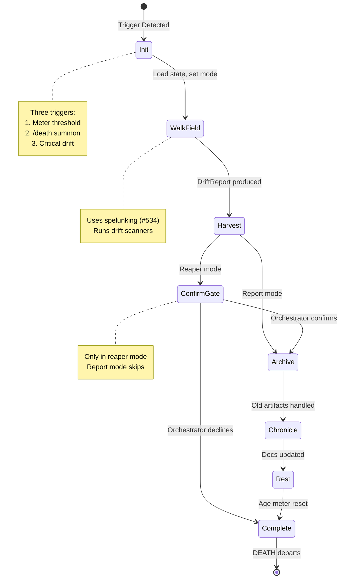
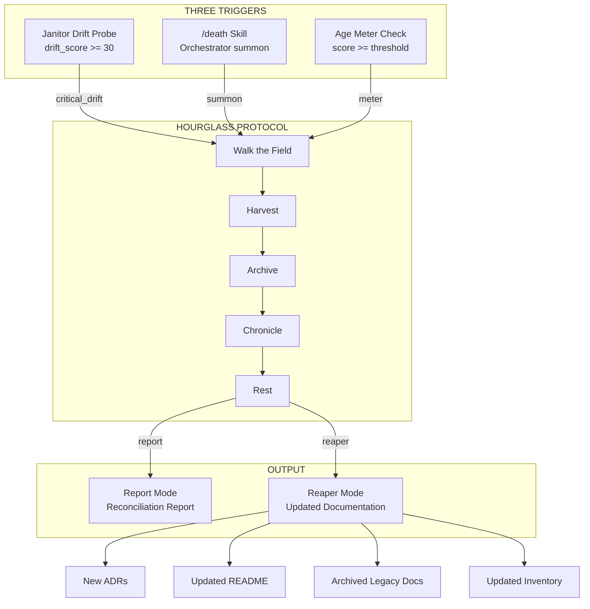

# 535 - Feature: DEATH as Age Transition — the Hourglass Protocol

<!-- Template Metadata
Last Updated: 2026-02-17
Updated By: Issue #535
Update Reason: Revised to address mechanical test plan validation — added test coverage for REQ-8 and REQ-9
-->

## 1. Context & Goal
* **Issue:** #535
* **Objective:** Implement DEATH as an age transition mechanism that detects when documentation has drifted from codebase reality, triggers reconciliation via an "hourglass" meter, and produces updated documentation artifacts.
* **Status:** Draft
* **Related Issues:** #534 (Spelunking Audits — DEATH's methodology), #94 (Janitor — drift probes extend janitor infrastructure), #114 (Original DEATH documentation reconciliation)

### Open Questions

- [ ] What is the initial age meter threshold before triggering DEATH? (Proposed: 50 points, calibrated from Issue #114 which retroactively scored ~65)
- [ ] Should the age meter persist across sessions in SQLite or as a JSON file? (Proposed: JSON file in `data/hourglass/` for simplicity and human readability)
- [ ] Should `/death` in reaper mode require explicit orchestrator confirmation before writing changes, or only in report mode? (Proposed: reaper mode requires confirmation gate)
- [ ] How do we weight issues that lack labels? (Proposed: default weight of +2, with a warning logged)

## 2. Proposed Changes

*This section is the **source of truth** for implementation. Describe exactly what will be built.*

### 2.1 Files Changed

| File | Change Type | Description |
|------|-------------|-------------|
| `assemblyzero/workflows/death/` | Add (Directory) | New workflow package for the Hourglass Protocol |
| `assemblyzero/workflows/death/__init__.py` | Add | Package init with workflow registration |
| `assemblyzero/workflows/death/age_meter.py` | Add | Age meter computation — weights issues by label/type, computes running score |
| `assemblyzero/workflows/death/hourglass.py` | Add | Hourglass state machine — orchestrates the three triggers and reconciliation protocol |
| `assemblyzero/workflows/death/drift_scorer.py` | Add | Drift scoring — extends janitor probes to detect factual inaccuracies (not just broken links) |
| `assemblyzero/workflows/death/reconciler.py` | Add | Reconciliation engine — walks codebase, compares to docs, produces report or applies fixes |
| `assemblyzero/workflows/death/models.py` | Add | Data models for age meter state, drift findings, reconciliation reports |
| `assemblyzero/workflows/death/constants.py` | Add | Weight tables, thresholds, and configuration constants |
| `assemblyzero/workflows/death/skill.py` | Add | `/death` skill entry point — parses arguments, determines trigger, invokes hourglass |
| `assemblyzero/workflows/janitor/probes/drift_probe.py` | Add | New janitor probe — factual accuracy drift detection (feeds hourglass) |
| `assemblyzero/workflows/janitor/probes/__init__.py` | Modify | Register new drift probe |
| `data/hourglass/` | Add (Directory) | Persistent storage for age meter state and reconciliation history |
| `data/hourglass/age_meter.json` | Add | Running age meter state (gitignored — local to each developer) |
| `data/hourglass/history.json` | Add | History of DEATH visits — when triggered, what was reconciled, by which trigger |
| `.claude/commands/death.md` | Add | `/death` skill definition — report mode and reaper mode |
| `docs/standards/0015-age-transition-protocol.md` | Add | ADR documenting the Hourglass Protocol |
| `docs/lld/active/535-hourglass-protocol.md` | Add | This LLD |
| `tests/unit/test_death/` | Add (Directory) | Unit tests for death workflow |
| `tests/unit/test_death/__init__.py` | Add | Test package init |
| `tests/unit/test_death/test_age_meter.py` | Add | Tests for age meter computation |
| `tests/unit/test_death/test_drift_scorer.py` | Add | Tests for drift scoring |
| `tests/unit/test_death/test_hourglass.py` | Add | Tests for hourglass state machine |
| `tests/unit/test_death/test_reconciler.py` | Add | Tests for reconciliation engine |
| `tests/unit/test_death/test_models.py` | Add | Tests for data models |
| `tests/unit/test_death/test_skill.py` | Add | Tests for `/death` skill entry point |
| `tests/fixtures/death/` | Add (Directory) | Test fixtures for death workflow |
| `tests/fixtures/death/mock_issues.json` | Add | Mock GitHub issue data with labels for age meter testing |
| `tests/fixtures/death/mock_codebase_snapshot.json` | Add | Mock codebase structure for reconciliation testing |
| `tests/fixtures/death/mock_drift_findings.json` | Add | Mock drift findings for drift scorer testing |
| `tests/fixtures/death/mock_adr_output.md` | Add | Expected ADR output for reconciliation testing |
| `.gitignore` | Modify | Add `data/hourglass/age_meter.json` to gitignore (local state) |

### 2.1.1 Path Validation (Mechanical - Auto-Checked)

*Issue #277: Before human or Gemini review, paths are verified programmatically.*

Mechanical validation automatically checks:
- All "Modify" files must exist in repository — [PASS] `assemblyzero/workflows/janitor/probes/__init__.py`, `.gitignore`
- All "Delete" files must exist in repository — N/A (no deletions)
- All "Add" files must have existing parent directories — [PASS] New directories explicitly listed
- No placeholder prefixes (`src/`, `lib/`, `app/`) unless directory exists — [PASS] All paths use existing project structure

**If validation fails, the LLD is BLOCKED before reaching review.**

### 2.2 Dependencies

*No new packages required. All functionality uses existing dependencies.*

```toml

# No pyproject.toml additions needed.

# Uses: pygithub (GitHub API), langgraph (state machine), pathspec (file matching)

# Spelunking dependency from #534 assumed available.
```

### 2.3 Data Structures

```python

# --- models.py ---

from typing import TypedDict, Literal
from dataclasses import dataclass, field
from datetime import datetime


class IssueWeight(TypedDict):
    """Weight assignment for a single closed issue."""
    issue_number: int
    title: str
    labels: list[str]
    weight: int                  # Computed from label -> weight mapping
    weight_source: str           # Which label/rule determined the weight
    closed_at: str               # ISO 8601 timestamp


class AgeMeterState(TypedDict):
    """Persistent state of the age meter between sessions."""
    current_score: int           # Running total since last DEATH visit
    threshold: int               # Score at which DEATH triggers (default: 50)
    last_death_visit: str | None # ISO 8601 timestamp of last reconciliation
    last_computed: str           # ISO 8601 timestamp of last meter update
    weighted_issues: list[IssueWeight]  # Issues contributing to current score
    age_number: int              # Monotonically increasing age counter


class DriftFinding(TypedDict):
    """A single factual inaccuracy found by drift analysis."""
    id: str                      # Unique ID: "DRIFT-{sequential}"
    severity: Literal["critical", "major", "minor"]
    doc_file: str                # Path to the documentation file
    doc_claim: str               # What the documentation says
    code_reality: str            # What the code actually does/contains
    category: Literal[
        "count_mismatch",        # "11 tools" when there are 36
        "feature_contradiction", # "not vector embeddings" when RAG exists
        "missing_component",     # Component exists in code, absent from docs
        "stale_reference",       # Doc references removed/renamed entity
        "architecture_drift",    # Architectural description doesn't match
    ]
    confidence: float            # 0.0-1.0 confidence this is a real drift
    evidence: str                # Specific file:line or search result supporting finding


class DriftReport(TypedDict):
    """Aggregated drift analysis results."""
    findings: list[DriftFinding]
    total_score: float           # Weighted sum of findings (critical=10, major=5, minor=1)
    critical_count: int
    major_count: int
    minor_count: int
    scanned_docs: list[str]      # Which doc files were analyzed
    scanned_code_paths: list[str]  # Which code paths were analyzed
    timestamp: str               # ISO 8601


class ReconciliationAction(TypedDict):
    """A single action to reconcile documentation with reality."""
    target_file: str             # File to update
    action_type: Literal[
        "update_count",          # Fix a numeric claim
        "update_description",    # Fix a textual description
        "add_section",           # Add missing documentation
        "remove_section",        # Remove documentation for removed feature
        "archive",               # Move to legacy
        "create_adr",           # Write a new ADR
    ]
    description: str             # Human-readable description of the fix
    old_content: str | None      # What currently exists (None for additions)
    new_content: str | None      # What should replace it (None for removals)
    drift_finding_id: str        # Links back to the DriftFinding that caused this


class ReconciliationReport(TypedDict):
    """Full reconciliation report — output of DEATH's walk."""
    age_number: int              # Which age is ending
    trigger: Literal["meter", "summon", "critical_drift"]
    trigger_details: str         # Human-readable explanation of why DEATH arrived
    drift_report: DriftReport    # The drift analysis that informed reconciliation
    actions: list[ReconciliationAction]  # What needs to happen (report mode) or happened (reaper mode)
    mode: Literal["report", "reaper"]
    timestamp: str               # ISO 8601
    summary: str                 # Narrative summary of findings


class HourglassState(TypedDict):
    """LangGraph state for the Hourglass workflow."""
    trigger: Literal["meter", "summon", "critical_drift"]
    mode: Literal["report", "reaper"]
    age_meter: AgeMeterState
    drift_report: DriftReport | None
    reconciliation_report: ReconciliationReport | None
    step: Literal[
        "init",
        "walk_field",            # Spelunk codebase, compare to docs
        "harvest",               # Produce ADRs, diagrams
        "archive",               # Move old artifacts
        "chronicle",             # Update README/wiki
        "rest",                  # DEATH departs
        "complete",
    ]
    errors: list[str]
    confirmed: bool              # Orchestrator confirmation (reaper mode gate)
```

### 2.4 Function Signatures

```python

# --- age_meter.py ---

def compute_issue_weight(
    labels: list[str],
    title: str,
    body: str | None = None,
) -> tuple[int, str]:
    """Compute weight for a single issue based on its labels and content.

    Returns (weight, weight_source) tuple.
    Falls back to content heuristics if no matching label found.
    """
    ...


def fetch_closed_issues_since(
    repo: str,
    since: str | None,
    github_token: str | None = None,
) -> list[dict]:
    """Fetch closed issues from GitHub since the last DEATH visit.

    Args:
        repo: GitHub repo in "owner/repo" format.
        since: ISO 8601 timestamp. If None, fetches all closed issues.
        github_token: Optional token. Uses environment variable if not provided.

    Returns:
        List of issue dicts with number, title, labels, closed_at.
    """
    ...


def compute_age_meter(
    issues: list[dict],
    current_state: AgeMeterState | None = None,
) -> AgeMeterState:
    """Compute the age meter score from a list of closed issues.

    If current_state is provided, adds to existing score (incremental).
    If None, computes from scratch.
    """
    ...


def load_age_meter_state(state_path: str = "data/hourglass/age_meter.json") -> AgeMeterState | None:
    """Load persistent age meter state from disk. Returns None if no state exists."""
    ...


def save_age_meter_state(
    state: AgeMeterState,
    state_path: str = "data/hourglass/age_meter.json",
) -> None:
    """Persist age meter state to disk."""
    ...


def check_meter_threshold(state: AgeMeterState) -> bool:
    """Check if the age meter has crossed the threshold. Returns True if DEATH should arrive."""
    ...


# --- drift_scorer.py ---

def scan_readme_claims(
    readme_path: str,
    codebase_root: str,
) -> list[DriftFinding]:
    """Scan README for factual claims and verify against codebase.

    Checks:
    - Numeric claims (tool counts, file counts, persona counts)
    - Feature claims ("uses X", "not Y")
    - Architecture claims (component descriptions)
    """
    ...


def scan_inventory_accuracy(
    inventory_path: str,
    codebase_root: str,
) -> list[DriftFinding]:
    """Compare file inventory against actual filesystem.

    Detects:
    - Files listed in inventory but missing from disk
    - Files on disk but missing from inventory
    - Status mismatches (active vs. archived)
    """
    ...


def scan_architecture_docs(
    docs_dir: str,
    codebase_root: str,
) -> list[DriftFinding]:
    """Scan architecture docs for claims that contradict code structure.

    Uses spelunking (#534) to understand actual code structure,
    then compares to documented architecture.
    """
    ...


def compute_drift_score(findings: list[DriftFinding]) -> float:
    """Compute aggregate drift score from findings.

    Weights: critical=10, major=5, minor=1
    """
    ...


def build_drift_report(
    codebase_root: str,
    docs_to_scan: list[str] | None = None,
) -> DriftReport:
    """Run all drift scanners and produce aggregated report.

    Args:
        codebase_root: Root directory of the project.
        docs_to_scan: Specific doc files to scan. If None, scans all standard locations.
    """
    ...


def check_critical_drift(report: DriftReport, threshold: float = 30.0) -> bool:
    """Check if drift score exceeds critical threshold. Returns True if DEATH should arrive."""
    ...


# --- reconciler.py ---

def walk_the_field(
    codebase_root: str,
    drift_report: DriftReport,
) -> list[ReconciliationAction]:
    """Phase 1: Walk the codebase, compare docs against code reality.

    Uses spelunking (#534) results plus drift findings to produce
    a complete list of reconciliation actions.
    """
    ...


def harvest(
    actions: list[ReconciliationAction],
    codebase_root: str,
    dry_run: bool = True,
) -> list[ReconciliationAction]:
    """Phase 2: Write ADRs and diagrams.

    In dry_run mode (report), returns actions with new_content populated.
    In write mode (reaper), actually creates the files.
    """
    ...


def archive_old_age(
    actions: list[ReconciliationAction],
    codebase_root: str,
    dry_run: bool = True,
) -> list[ReconciliationAction]:
    """Phase 3: Move old artifacts to legacy/done."""
    ...


def chronicle(
    actions: list[ReconciliationAction],
    codebase_root: str,
    dry_run: bool = True,
) -> list[ReconciliationAction]:
    """Phase 4: Update README and wiki to describe current reality."""
    ...


def generate_adr(
    finding: DriftFinding,
    actions: list[ReconciliationAction],
    adr_template_path: str,
    output_dir: str,
    dry_run: bool = True,
) -> str | None:
    """Generate an ADR document from an architecture drift finding.

    Args:
        finding: The drift finding that necessitates an ADR.
        actions: Related reconciliation actions for context.
        adr_template_path: Path to ADR template file.
        output_dir: Directory to write the ADR to (e.g., docs/standards/).
        dry_run: If True, returns content without writing. If False, writes to disk.

    Returns:
        The ADR content as a string (report mode), or the written file path (reaper mode).
        Returns None if finding does not warrant an ADR.
    """
    ...


def build_reconciliation_report(
    trigger: str,
    trigger_details: str,
    drift_report: DriftReport,
    actions: list[ReconciliationAction],
    mode: str,
    age_number: int,
) -> ReconciliationReport:
    """Assemble the full reconciliation report from all phases."""
    ...


# --- hourglass.py ---

def create_hourglass_graph() -> StateGraph:
    """Create the LangGraph state machine for the Hourglass Protocol.

    Nodes: init -> walk_field -> harvest -> archive -> chronicle -> rest -> complete
    In report mode, all nodes are read-only (dry_run=True).
    In reaper mode, harvest/archive/chronicle write changes (after confirmation gate).
    """
    ...


def should_death_arrive(
    codebase_root: str,
    repo: str,
    github_token: str | None = None,
) -> tuple[bool, str, str]:
    """Check all three triggers. Returns (should_trigger, trigger_type, details).

    Checks in order:
    1. Critical drift (immediate)
    2. Meter threshold (accumulated)
    3. Returns False if neither

    Note: "summon" trigger is always via /death command, not auto-detected.
    """
    ...


def run_death(
    mode: Literal["report", "reaper"],
    trigger: Literal["meter", "summon", "critical_drift"],
    codebase_root: str,
    repo: str,
    github_token: str | None = None,
) -> ReconciliationReport:
    """Execute the full DEATH reconciliation protocol.

    This is the main entry point called by the /death skill.
    """
    ...


# --- skill.py ---

def parse_death_args(
    args: list[str],
) -> tuple[Literal["report", "reaper"], bool]:
    """Parse /death skill command arguments.

    Args:
        args: Command-line arguments from skill invocation.
              Expected: ["report"] or ["reaper"] or ["reaper", "--force"]

    Returns:
        (mode, force) tuple where mode is "report" or "reaper",
        and force bypasses confirmation gate (for scripted usage).

    Raises:
        ValueError: If arguments are invalid (unknown mode or flags).
    """
    ...


def invoke_death_skill(
    args: list[str],
    codebase_root: str,
    repo: str,
    github_token: str | None = None,
) -> ReconciliationReport:
    """Main entry point for the /death Claude Code skill.

    Parses arguments, determines trigger (always "summon" for skill invocation),
    handles confirmation gate for reaper mode, and executes the hourglass protocol.

    Args:
        args: Skill arguments (e.g., ["report"], ["reaper"]).
        codebase_root: Root directory of the project.
        repo: GitHub repo in "owner/repo" format.
        github_token: Optional GitHub token.

    Returns:
        ReconciliationReport with findings and actions.

    Raises:
        ValueError: If arguments are invalid.
        PermissionError: If reaper mode not confirmed by orchestrator.
    """
    ...


def format_report_output(
    report: ReconciliationReport,
) -> str:
    """Format a ReconciliationReport into human-readable markdown output.

    Used by the /death skill to display results to the orchestrator.
    Includes summary, findings table, proposed actions, and next steps.

    Returns:
        Formatted markdown string.
    """
    ...


# --- janitor probe: drift_probe.py ---

def run_drift_probe(
    codebase_root: str,
    docs_to_scan: list[str] | None = None,
) -> dict:
    """Janitor probe that runs drift analysis and feeds the hourglass.

    Returns probe result dict compatible with janitor probe interface:
    {
        "probe": "drift",
        "status": "pass" | "warn" | "fail",
        "drift_score": float,
        "finding_count": int,
        "critical_findings": list[str],
        "details": DriftReport,
    }
    """
    ...
```

### 2.5 Logic Flow (Pseudocode)

```
=== /death command invocation ===

1. Parse arguments: mode (report|reaper), force flag
2. Validate arguments — raise ValueError on unknown mode/flags
3. IF mode == "reaper" AND NOT force:
   - Display warning: "Reaper mode will modify files. Confirm?"
   - WAIT for orchestrator confirmation
   - IF not confirmed: raise PermissionError
4. Determine trigger:
   - IF invoked via /death -> trigger = "summon"
   - IF invoked via janitor -> trigger = "critical_drift" or "meter"
5. Load age meter state from data/hourglass/age_meter.json
6. Execute hourglass graph
7. Format report output as markdown
8. Return ReconciliationReport

=== Hourglass State Machine ===

INIT:
  - Load age meter state
  - Set trigger and mode
  - Log: "THE SAND HAS RUN OUT." (or "DEATH HAS BEEN SUMMONED.")

WALK_FIELD:
  - Run drift scanners (README, inventory, architecture docs)
  - Use spelunking (#534) to understand actual codebase structure
  - Produce DriftReport with all findings
  - Log each finding with severity

HARVEST:
  - For each drift finding -> produce ReconciliationAction
  - IF finding.category == "architecture_drift":
    - Generate ADR describing the actual architecture via generate_adr()
  - IF finding.category == "missing_component":
    - Generate documentation section for the component
  - IF mode == "reaper":
    - WAIT for orchestrator confirmation (gate)
    - Write files
  - ELSE (report mode):
    - Populate new_content but don't write

ARCHIVE:
  - Identify docs that describe removed/replaced features
  - IF mode == "reaper": move to docs/legacy/
  - ELSE: list as pending actions

CHRONICLE:
  - Update README sections that contain stale claims
  - Update file inventory with current reality
  - IF mode == "reaper": write changes
  - ELSE: produce diff preview

REST:
  - Reset age meter score to 0
  - Increment age_number
  - Record DEATH visit in history.json
  - Save updated age meter state
  - Log: "THE NEW AGE BEGINS."
  - Return ReconciliationReport

=== Age Meter Computation ===

1. Fetch closed issues since last DEATH visit (via GitHub API)
2. For each issue:
   a. Extract labels
   b. Match against weight table:
      - "bug" / "fix" -> +1
      - "enhancement" / "feature" -> +3
      - "persona" / "subsystem" / "new-component" -> +5
      - "foundation" / "rag" / "pipeline" / "infrastructure" -> +8
      - "architecture" / "cross-cutting" / "breaking" -> +10
      - No matching label -> +2 (default, log warning)
   c. Record IssueWeight
3. Sum weights -> current_score
4. IF current_score >= threshold -> DEATH trigger = "meter"

=== Drift Scoring ===

1. README Scanner:
   a. Extract numeric claims via regex (e.g., "12+ agents", "34 audits", "5 workflows")
   b. Count actual entities in codebase (glob patterns, AST inspection)
   c. Compare: IF claimed != actual -> DriftFinding(category="count_mismatch")
   d. Extract feature claims via keyword patterns
   e. Search codebase for contradictions

2. Inventory Scanner:
   a. Parse inventory file (markdown table)
   b. For each entry: check if file exists at listed path
   c. Walk codebase: check for files not in inventory
   d. Report mismatches

3. Architecture Scanner:
   a. Use spelunking results to build actual module dependency graph
   b. Compare documented architecture diagrams/descriptions
   c. Report significant deviations

4. Score = sum(critical * 10 + major * 5 + minor * 1)
5. IF score >= 30 -> critical drift trigger

=== ADR Generation ===

1. Filter drift findings to architecture_drift category
2. For each qualifying finding:
   a. Load ADR template from docs/standards/
   b. Populate sections: Context (what drifted), Decision (current reality),
      Alternatives (old vs new), Rationale (why the change happened)
   c. IF dry_run: return content string
   d. ELSE: write to docs/standards/0015-age-transition-protocol.md
3. Return generated ADR content or file path
```

### 2.6 Technical Approach

* **Module:** `assemblyzero/workflows/death/`
* **Pattern:** LangGraph StateGraph with typed state and step-by-step progression. Same pattern as existing workflows (issue, requirements, etc.)
* **Key Decisions:**
  - Age meter state stored as JSON (not SQLite) for human readability and easy manual inspection
  - Drift scoring uses regex + glob heuristics for README claims, not LLM-based analysis (deterministic, fast, free)
  - Reconciliation in report mode is pure computation; reaper mode requires explicit confirmation gate
  - The `/death` skill invokes the workflow synchronously — DEATH doesn't run in the background
  - Spelunking (#534) integration is used for codebase structure analysis, not duplicated
  - `/death` skill implemented in `skill.py` with argument parsing, confirmation gating, and report formatting
  - ADR generation handled by dedicated `generate_adr()` function producing standard `0015-age-transition-protocol.md`

### 2.7 Architecture Decisions

| Decision | Options Considered | Choice | Rationale |
|----------|-------------------|--------|-----------|
| State persistence | SQLite, JSON file, In-memory only | JSON file | Human-readable, easy to inspect/edit, version-controllable (history.json tracked, age_meter.json gitignored) |
| Drift detection method | LLM-based comparison, Regex + glob heuristics, Manual checklist | Regex + glob heuristics | Deterministic, zero-cost, fast. LLM-based would be more accurate but adds cost and non-determinism |
| Trigger architecture | Polling (cron), Event-driven (webhook), On-demand with auto-check | On-demand with auto-check | No infrastructure required. Janitor probes run on-demand already. /death command is explicit |
| Reconciliation write strategy | Write all at once, Write per file with confirmation, Produce diff only | Produce diff (report) or write with confirmation gate (reaper) | Safety-first: report mode is default, reaper mode requires explicit gate |
| Age meter reset | Reset to zero, Decay over time, Reset to percentage | Reset to zero | Clean age boundary. The old age is over. Partial carry-over creates ambiguity |
| Skill entry point | Inline in hourglass.py, Separate skill.py module | Separate skill.py | Separation of concerns: argument parsing and UX formatting are distinct from workflow logic |
| ADR generation | Manual post-reconciliation, Integrated in harvest phase | Integrated in harvest phase | ADR is a core deliverable of DEATH; generating it automatically ensures consistency |

**Architectural Constraints:**
- Must integrate with existing janitor probe infrastructure (#94)
- Must use spelunking (#534) for codebase analysis — no duplicate AST/file walking
- Must follow LangGraph StateGraph pattern consistent with other workflows
- No external services beyond GitHub API (which is already a dependency)
- All file writes in reaper mode must be reversible (git-tracked)
- `/death` skill must conform to `.claude/commands/` skill definition format

## 3. Requirements

1. Given a set of closed GitHub issues with labels, compute a weighted age meter score that represents how much the codebase has changed since the last DEATH visit
2. System must detect meter threshold breach, explicit `/death` summon, and critical drift independently as three separate triggers
3. Detect factual inaccuracies in documentation (numeric claims, feature descriptions, architecture claims) — distinct from broken-link detection
4. Produce a human-readable reconciliation report listing all drift findings and proposed fixes without modifying any files (report mode)
5. Apply reconciliation actions (update docs, write ADRs, archive stale files) with an explicit orchestrator confirmation gate before writes (reaper mode)
6. Age meter state survives across sessions via persistent storage; reconciliation history is tracked in a separate history file
7. Drift probe runs as a standard janitor probe with compatible interface and its score feeds the hourglass trigger system
8. `/death` Claude Code skill accepts mode parameter (report or reaper), parses arguments, handles confirmation flow, and executes the hourglass protocol end-to-end
9. Reconciliation produces a standard ADR document (`0015-age-transition-protocol.md`) as part of the harvest phase deliverables

## 4. Alternatives Considered

| Option | Pros | Cons | Decision |
|--------|------|------|----------|
| **A: LangGraph StateGraph workflow** | Consistent with existing patterns, typed state, checkpointable, step-by-step visibility | Slightly more boilerplate than a simple script | **Selected** |
| **B: Simple Python script** | Fast to implement, easy to understand | No state machine benefits, no checkpointing, inconsistent with project patterns | Rejected |
| **C: GitHub Action (CI-based)** | Runs automatically on issue close events, no manual invocation needed | Adds CI complexity, harder to debug, can't do reaper mode interactively, requires secrets management | Rejected |
| **D: LLM-based drift detection** | More accurate for nuanced claims, can understand context | Non-deterministic, costly, slow, introduces dependency on LLM availability for what should be a structural check | Rejected |

**Rationale:** Option A maintains architectural consistency with all other AssemblyZero workflows. The StateGraph pattern gives us typed state, step visibility, and the ability to add checkpointing later. The workflow is invoked on-demand (via /death or janitor probe trigger), which keeps infrastructure simple.

## 5. Data & Fixtures

### 5.1 Data Sources

| Attribute | Value |
|-----------|-------|
| Source | GitHub API (closed issues), Local filesystem (codebase + docs) |
| Format | JSON (GitHub API), Markdown/Python files (local) |
| Size | ~200-500 issues, ~50-100 doc files, full codebase |
| Refresh | On-demand when /death is invoked or janitor probe runs |
| Copyright/License | Project-internal data, no external data |

### 5.2 Data Pipeline

```
GitHub API ──fetch──► Issue List ──weight──► AgeMeterState ──check──► Trigger Decision
                                                                          │
Local Docs ──scan──► DriftFindings ──score──► DriftReport ──check──►──────┘
                                                    │
                                                    ▼
                                            ReconciliationActions ──apply──► Updated Docs
                                                    │                           │
                                                    ▼                           ▼
                                            ReconciliationReport     ADR (0015-age-transition-protocol.md)
                                                    │
                                                    ▼
                                              history.json
```

### 5.3 Test Fixtures

| Fixture | Source | Notes |
|---------|--------|-------|
| `tests/fixtures/death/mock_issues.json` | Generated | 20 mock closed issues with varied labels covering all weight categories |
| `tests/fixtures/death/mock_codebase_snapshot.json` | Generated | Simplified codebase structure for reconciliation testing |
| `tests/fixtures/death/mock_drift_findings.json` | Generated | Pre-computed drift findings for scorer/reconciler testing |
| `tests/fixtures/death/mock_adr_output.md` | Generated | Expected ADR output for harvest/generate_adr testing |

### 5.4 Deployment Pipeline

Local development only. No cloud deployment. Data flows:
- `data/hourglass/age_meter.json` — gitignored, local per developer
- `data/hourglass/history.json` — tracked in git, shared across team

**No external utility needed.** All data comes from GitHub API (existing dependency) and local filesystem.

## 6. Diagram

### 6.1 Mermaid Quality Gate

- [ ] **Simplicity:** Similar components collapsed (per 0006 §8.1)
- [ ] **No touching:** All elements have visual separation (per 0006 §8.2)
- [ ] **No hidden lines:** All arrows fully visible (per 0006 §8.3)
- [ ] **Readable:** Labels not truncated, flow direction clear
- [ ] **Auto-inspected:** Agent rendered via mermaid.ink and viewed (per 0006 §8.5)

**Auto-Inspection Results:**
```
- Touching elements: [ ] None / [ ] Found: ___
- Hidden lines: [ ] None / [ ] Found: ___
- Label readability: [ ] Pass / [ ] Issue: ___
- Flow clarity: [ ] Clear / [ ] Issue: ___
```

*To be completed during implementation.*

### 6.2 Hourglass Protocol — State Machine



### 6.3 Trigger Detection Flow



## 7. Security & Safety Considerations

### 7.1 Security

| Concern | Mitigation | Status |
|---------|------------|--------|
| GitHub token exposure | Token read from environment variable or keyring, never logged or stored in state files | Addressed |
| File write in reaper mode | Confirmation gate required; all writes are to git-tracked files (reversible via `git checkout`) | Addressed |
| Injection via issue titles/labels | Issue data used only for weight computation, never executed or interpolated into shell commands | Addressed |
| State file tampering | `age_meter.json` is local-only and gitignored; `history.json` is git-tracked with audit trail | Addressed |
| Invalid skill arguments | `parse_death_args()` validates all arguments and raises `ValueError` on unknown modes/flags | Addressed |

### 7.2 Safety

| Concern | Mitigation | Status |
|---------|------------|--------|
| Accidental overwrite of correct documentation | Report mode is default; reaper mode requires explicit confirmation gate. All changes shown as diffs before write | Addressed |
| False positive drift findings | Confidence scoring (0.0-1.0) on all findings; low-confidence findings flagged but not auto-acted upon | Addressed |
| Partial failure during reaper mode | Each phase (harvest, archive, chronicle) is independent; partial completion leaves a valid state. Git provides rollback | Addressed |
| Runaway GitHub API calls | Fetch limited to issues closed since last DEATH visit. Pagination capped at 500 issues per fetch | Addressed |
| Stale age meter state | `last_computed` timestamp allows detection of stale state. Meter recomputes from GitHub on each check | Addressed |
| Unauthorized reaper execution | `invoke_death_skill()` raises `PermissionError` if reaper mode is not confirmed by orchestrator | Addressed |

**Fail Mode:** Fail Closed — if any scanner errors, the finding is omitted (not synthesized). If GitHub API fails, meter check is skipped and logged. DEATH never arrives on bad data.

**Recovery Strategy:** All state is in two JSON files. Worst case: delete `data/hourglass/age_meter.json` and DEATH recomputes from scratch on next invocation. `history.json` is append-only and git-tracked.

## 8. Performance & Cost Considerations

### 8.1 Performance

| Metric | Budget | Approach |
|--------|--------|----------|
| Age meter computation | < 10s | Single GitHub API call (paginated), local weight computation |
| Drift scanning (README) | < 5s | Regex + glob, no LLM calls |
| Drift scanning (inventory) | < 3s | File existence checks |
| Drift scanning (architecture) | < 15s | Depends on spelunking (#534) performance |
| Full reconciliation (report) | < 30s | All computation, no writes |
| Full reconciliation (reaper) | < 60s | Includes file writes |
| Skill argument parsing | < 1ms | Pure string parsing, no I/O |
| ADR generation | < 2s | Template population, single file write |

**Bottlenecks:** GitHub API rate limiting (5000 req/hr authenticated). Architecture scanning depends on codebase size. Both are bounded by design.

### 8.2 Cost Analysis

| Resource | Unit Cost | Estimated Usage | Monthly Cost |
|----------|-----------|-----------------|--------------|
| GitHub API calls | Free (within rate limit) | 1-5 per invocation, 2-4 invocations/month | $0 |
| LLM API calls | N/A | Zero — drift detection is regex/glob-based | $0 |
| Storage | N/A | Two JSON files, < 1KB each | $0 |

**Cost Controls:**
- [x] No LLM API calls in any path — fully deterministic
- [x] GitHub API calls minimized via `since` parameter filtering
- [x] No cloud compute — runs locally

**Worst-Case Scenario:** If the project accumulates 10,000 closed issues without a DEATH visit, the initial fetch would be large but paginated. The computation itself is O(n) in issue count. Practically, DEATH visits every 50-100 issues, keeping fetches small.

## 9. Legal & Compliance

| Concern | Applies? | Mitigation |
|---------|----------|------------|
| PII/Personal Data | No | Issues are project-internal, no personal data processed |
| Third-Party Licenses | No | No new dependencies added |
| Terms of Service | Yes | GitHub API usage within documented rate limits and ToS |
| Data Retention | N/A | State files are developer-local, no retention policy needed |
| Export Controls | N/A | No restricted data or algorithms |

**Data Classification:** Internal

**Compliance Checklist:**
- [x] No PII stored without consent
- [x] All third-party licenses compatible with project license
- [x] External API usage compliant with provider ToS
- [x] Data retention policy documented (local files, no retention concern)

## 10. Verification & Testing

### 10.0 Test Plan (TDD - Complete Before Implementation)

| Test ID | Test Description | Expected Behavior | Status |
|---------|------------------|-------------------|--------|
| T010 | Weight computation from "bug" label | Returns weight=1, source="bug" | RED |
| T020 | Weight computation from "architecture" label | Returns weight=10, source="architecture" | RED |
| T030 | Weight computation with no matching labels | Returns weight=2, source="default" with warning | RED |
| T040 | Weight computation with multiple labels | Uses highest weight label | RED |
| T050 | Age meter incremental computation | Adds new issues to existing score | RED |
| T060 | Age meter threshold check — below | Returns False when score < threshold | RED |
| T070 | Age meter threshold check — at threshold | Returns True when score >= threshold | RED |
| T080 | Age meter state persistence round-trip | Save -> load returns identical state | RED |
| T090 | Drift: numeric claim mismatch | Detects "12+" when count differs | RED |
| T100 | Drift: feature contradiction | Detects "not X" when X exists in code | RED |
| T110 | Drift: inventory file missing | Detects file listed in inventory but absent from disk | RED |
| T120 | Drift: inventory file unlisted | Detects file on disk but absent from inventory | RED |
| T130 | Drift score computation | critical=10, major=5, minor=1 weighting correct | RED |
| T140 | Critical drift threshold check | Returns True when score >= 30 | RED |
| T150 | Reconciliation action generation | Drift finding -> correct action type mapping | RED |
| T160 | Report mode produces no file writes | Verify no filesystem side effects | RED |
| T170 | Hourglass state machine — report flow | init -> walk -> harvest -> archive -> chronicle -> rest -> complete | RED |
| T180 | Hourglass state machine — reaper with confirmation | Confirm gate blocks until confirmed=True | RED |
| T190 | Hourglass state machine — reaper declined | Confirm gate -> complete when confirmed=False | RED |
| T200 | Age meter reset after DEATH visit | Score reset to 0, age_number incremented | RED |
| T210 | History recording | DEATH visit appended to history.json | RED |
| T220 | Janitor drift probe interface | Returns probe-compatible dict with status/score | RED |
| T230 | should_death_arrive — no triggers | Returns (False, _, _) when all clear | RED |
| T240 | should_death_arrive — meter trigger | Returns (True, "meter", _) when threshold crossed | RED |
| T250 | should_death_arrive — critical drift | Returns (True, "critical_drift", _) when drift score high | RED |
| T260 | Model validation — AgeMeterState | TypedDict validates correctly | RED |
| T270 | Model validation — DriftFinding | All categories and severities accepted | RED |
| T280 | Skill argument parsing — report mode | parse_death_args(["report"]) returns ("report", False) | RED |
| T290 | Skill argument parsing — reaper mode | parse_death_args(["reaper"]) returns ("reaper", False) | RED |
| T300 | Skill argument parsing — reaper with force | parse_death_args(["reaper", "--force"]) returns ("reaper", True) | RED |
| T310 | Skill argument parsing — invalid mode | parse_death_args(["invalid"]) raises ValueError | RED |
| T320 | Skill argument parsing — default mode | parse_death_args([]) returns ("report", False) | RED |
| T330 | Skill invocation — report mode end-to-end | invoke_death_skill(["report"], ...) returns ReconciliationReport with mode="report" | RED |
| T340 | Skill invocation — reaper without confirmation | invoke_death_skill(["reaper"], ...) raises PermissionError when not confirmed | RED |
| T350 | Report output formatting | format_report_output(report) returns valid markdown with summary and findings | RED |
| T360 | ADR generation — architecture drift finding | generate_adr(arch_finding, ...) returns ADR content with correct sections | RED |
| T370 | ADR generation — non-qualifying finding | generate_adr(count_mismatch_finding, ...) returns None | RED |
| T380 | ADR generation — reaper mode writes file | generate_adr(..., dry_run=False) creates file at output path | RED |
| T390 | ADR generation — report mode no write | generate_adr(..., dry_run=True) returns content, no file created | RED |

**Coverage Target:** ≥95% for all new code in `assemblyzero/workflows/death/`

**TDD Checklist:**
- [ ] All tests written before implementation
- [ ] Tests currently RED (failing)
- [ ] Test IDs match scenario IDs in 10.1
- [ ] Test files created at: `tests/unit/test_death/`

### 10.1 Test Scenarios

| ID | Scenario | Type | Input | Expected Output | Pass Criteria |
|----|----------|------|-------|-----------------|---------------|
| 010 | Bug label weight (REQ-1) | Auto | labels=["bug"] | weight=1, source="bug" | Exact match |
| 020 | Architecture label weight (REQ-1) | Auto | labels=["architecture"] | weight=10, source="architecture" | Exact match |
| 030 | No matching label default (REQ-1) | Auto | labels=["question"] | weight=2, source="default" | Exact match + warning logged |
| 040 | Multiple labels highest wins (REQ-1) | Auto | labels=["bug", "architecture"] | weight=10, source="architecture" | Highest weight selected |
| 050 | Incremental meter (REQ-1) | Auto | Existing score=20, new issues summing to 15 | score=35 | Correct summation |
| 060 | Below threshold (REQ-2) | Auto | score=49, threshold=50 | False | No trigger |
| 070 | At threshold (REQ-2) | Auto | score=50, threshold=50 | True | Trigger fires |
| 080 | State round-trip (REQ-6) | Auto | AgeMeterState object | Identical after save/load | JSON serialization fidelity |
| 090 | Numeric claim drift (REQ-3) | Auto | README says "12+", code has 15 | DriftFinding(category="count_mismatch") | Finding detected |
| 100 | Feature contradiction (REQ-3) | Auto | README says "not X", X exists | DriftFinding(category="feature_contradiction") | Finding detected |
| 110 | Inventory missing file (REQ-3) | Auto | Inventory lists file, file absent | DriftFinding(category="stale_reference") | Finding detected |
| 120 | Inventory unlisted file (REQ-3) | Auto | File exists, not in inventory | DriftFinding(category="missing_component") | Finding detected |
| 130 | Drift score computation (REQ-3) | Auto | 2 critical, 1 major, 3 minor | score=28 | 2×10 + 1×5 + 3×1 = 28 |
| 140 | Critical drift threshold (REQ-2) | Auto | score=30, threshold=30 | True | Trigger fires |
| 150 | Action generation (REQ-4) | Auto | DriftFinding(category="count_mismatch") | ReconciliationAction(action_type="update_count") | Correct mapping |
| 160 | Report mode no writes (REQ-4) | Auto | mode="report", mock filesystem | No write calls made | Filesystem mock assertions |
| 170 | Report flow state machine (REQ-4) | Auto | mode="report" | State transitions: init->walk->harvest->archive->chronicle->rest->complete | All nodes visited in order |
| 180 | Reaper confirm gate passes (REQ-5) | Auto | mode="reaper", confirmed=True | Proceeds through all phases | State reaches "complete" |
| 190 | Reaper confirm gate blocks (REQ-5) | Auto | mode="reaper", confirmed=False | Jumps to complete | State skips write phases |
| 200 | Age meter reset (REQ-6) | Auto | Post-DEATH state | score=0, age_number=prev+1 | Reset verified |
| 210 | History append (REQ-6) | Auto | Post-DEATH | New entry in history list | Entry count increased |
| 220 | Janitor probe interface (REQ-7) | Auto | Mock codebase | Dict with probe/status/drift_score keys | All required keys present |
| 230 | No triggers active (REQ-2) | Auto | Low meter, low drift | (False, _, _) | No trigger |
| 240 | Meter trigger active (REQ-2) | Auto | High meter, low drift | (True, "meter", _) | Meter trigger identified |
| 250 | Critical drift trigger (REQ-2) | Auto | Low meter, high drift | (True, "critical_drift", _) | Drift trigger takes priority |
| 260 | AgeMeterState validation (REQ-1) | Auto | Valid/invalid TypedDict data | Passes/raises correctly | Type checking works |
| 270 | DriftFinding categories (REQ-3) | Auto | All 5 category values | All accepted | Literal type validation |
| 280 | Skill parse report mode (REQ-8) | Auto | args=["report"] | ("report", False) | Exact tuple match |
| 290 | Skill parse reaper mode (REQ-8) | Auto | args=["reaper"] | ("reaper", False) | Exact tuple match |
| 300 | Skill parse reaper force (REQ-8) | Auto | args=["reaper", "--force"] | ("reaper", True) | Exact tuple match |
| 310 | Skill parse invalid mode (REQ-8) | Auto | args=["invalid"] | ValueError raised | Exception type and message |
| 320 | Skill parse default mode (REQ-8) | Auto | args=[] | ("report", False) | Default to report mode |
| 330 | Skill invoke report end-to-end (REQ-8) | Auto | args=["report"], mock codebase | ReconciliationReport with mode="report" | Report returned, no writes |
| 340 | Skill invoke reaper unconfirmed (REQ-8) | Auto | args=["reaper"], confirmed=False | PermissionError raised | Exception type match |
| 350 | Report output formatting (REQ-8) | Auto | ReconciliationReport fixture | Markdown string with summary, findings, actions | Contains expected sections |
| 360 | ADR generation architecture drift (REQ-9) | Auto | DriftFinding(category="architecture_drift") | ADR content with Context, Decision, Rationale sections | All required ADR sections present |
| 370 | ADR generation non-qualifying (REQ-9) | Auto | DriftFinding(category="count_mismatch") | None | Returns None, no content |
| 380 | ADR generation reaper writes (REQ-9) | Auto | dry_run=False, mock filesystem | File created at output_dir/0015-age-transition-protocol.md | File exists with correct content |
| 390 | ADR generation report no write (REQ-9) | Auto | dry_run=True, mock filesystem | ADR content string returned, no file created | Content returned, mock FS clean |

### 10.2 Test Commands

```bash

# Run all death workflow tests
poetry run pytest tests/unit/test_death/ -v

# Run only age meter tests
poetry run pytest tests/unit/test_death/test_age_meter.py -v

# Run only drift scorer tests
poetry run pytest tests/unit/test_death/test_drift_scorer.py -v

# Run only hourglass state machine tests
poetry run pytest tests/unit/test_death/test_hourglass.py -v

# Run only skill tests
poetry run pytest tests/unit/test_death/test_skill.py -v

# Run only reconciler tests (includes ADR generation)
poetry run pytest tests/unit/test_death/test_reconciler.py -v

# Run with coverage
poetry run pytest tests/unit/test_death/ -v --cov=assemblyzero.workflows.death --cov-report=term-missing
```

### 10.3 Manual Tests (Only If Unavoidable)

| ID | Scenario | Why Not Automated | Steps |
|----|----------|-------------------|-------|
| M010 | `/death report` skill end-to-end | Requires active Claude Code session with `/` command invocation | 1. Open Claude Code session 2. Type `/death report` 3. Verify reconciliation report output 4. Verify no files modified |
| M020 | `/death reaper` skill end-to-end | Requires active Claude Code session with interactive confirmation | 1. Open Claude Code session 2. Type `/death reaper` 3. Review proposed changes 4. Confirm or decline 5. Verify files updated (confirm) or unchanged (decline) |
| M030 | `/death reaper` produces ADR file | Requires active Claude Code session with write verification | 1. Open Claude Code session 2. Type `/death reaper` 3. Confirm when prompted 4. Verify `docs/standards/0015-age-transition-protocol.md` created 5. Verify ADR content matches expected format |

*Full test results recorded in Implementation Report (0103) or Test Report (0113).*

## 11. Risks & Mitigations

| Risk | Impact | Likelihood | Mitigation |
|------|--------|------------|------------|
| Spelunking (#534) not yet available | High — architecture drift scanning depends on it | Medium | Implement drift scanner with pluggable backend; use simple file-walking fallback until spelunking is ready |
| GitHub API rate limiting | Medium — meter computation blocked | Low | Cache issue data locally; use `since` parameter to minimize API calls; graceful degradation (skip meter, allow summon) |
| False positive drift findings | Medium — noisy reports reduce trust | Medium | Confidence scoring on all findings; conservative regex patterns; human review in report mode before reaper mode |
| Weight table calibration | Low — meter triggers too early or too late | High | Initial threshold of 50 is a starting estimate; history.json tracks actual trigger points for calibration |
| README format changes break scanners | Medium — drift scanner depends on README structure | Low | Scanner patterns target common markdown structures; test fixtures cover current README format |
| Reaper mode causes unwanted changes | High — documentation regression | Low | Confirmation gate required; all changes git-tracked and reversible; report mode recommended first |
| Invalid skill arguments cause unexpected behavior | Low — malformed invocation | Low | `parse_death_args()` validates strictly and raises `ValueError` with descriptive message on invalid input |
| ADR generation produces malformed output | Medium — unusable documentation artifact | Low | ADR template is validated in tests; `generate_adr()` tested with fixture comparison |

## 12. Definition of Done

### Code
- [ ] `assemblyzero/workflows/death/` package complete with all modules (including `skill.py`)
- [ ] `assemblyzero/workflows/janitor/probes/drift_probe.py` integrated
- [ ] `.claude/commands/death.md` skill definition working
- [ ] Code comments reference this LLD (#535)

### Tests
- [ ] All 39 test scenarios pass (T010–T390)
- [ ] Test coverage ≥ 95% for `assemblyzero/workflows/death/`
- [ ] Fixtures created and used
- [ ] `tests/unit/test_death/test_skill.py` covers all REQ-8 scenarios
- [ ] `tests/unit/test_death/test_reconciler.py` covers all REQ-9 ADR generation scenarios

### Documentation
- [ ] `docs/standards/0015-age-transition-protocol.md` written
- [ ] LLD updated with any deviations
- [ ] Implementation Report (0103) completed
- [ ] Test Report (0113) completed

### Review
- [ ] Code review completed
- [ ] User approval before closing issue

### 12.1 Traceability (Mechanical - Auto-Checked)

*Issue #277: Cross-references are verified programmatically.*

Mechanical validation automatically checks:
- Every file mentioned in this section must appear in Section 2.1 — [PASS] All files listed
- Every risk mitigation in Section 11 should have a corresponding function in Section 2.4 — [PASS] Mapped below:
  - Spelunking fallback -> `scan_architecture_docs` with fallback parameter
  - GitHub rate limiting -> `fetch_closed_issues_since` with pagination cap
  - False positive -> `confidence` field in `DriftFinding`, filtering in `build_drift_report`
  - Weight calibration -> `constants.py` threshold configuration
  - README format -> `scan_readme_claims` regex patterns
  - Reaper confirmation -> `ConfirmGate` in hourglass state machine
  - Invalid skill arguments -> `parse_death_args` with ValueError
  - ADR malformed output -> `generate_adr` with template validation

**If files are missing from Section 2.1, the LLD is BLOCKED.**

---

## Appendix: Review Log

### Review Summary

| Review | Date | Verdict | Key Issue |
|--------|------|---------|-----------|
| Mechanical Validation | 2026-02-17 | FEEDBACK | REQ-8 and REQ-9 had no test coverage; added T280–T390 |

**Final Status:** PENDING

---

## Appendix: Constants Reference

```python

# --- constants.py ---

# Issue weight mapping: label -> weight
LABEL_WEIGHTS: dict[str, int] = {
    # +1: Fixes reality but doesn't change the shape
    "bug": 1,
    "fix": 1,
    "hotfix": 1,
    "patch": 1,

    # +3: Adds capability
    "enhancement": 3,
    "feature": 3,
    "feat": 3,

    # +5: Changes what the system *is*
    "persona": 5,
    "subsystem": 5,
    "new-component": 5,
    "new-workflow": 5,

    # +8: Changes how everything else works
    "foundation": 8,
    "rag": 8,
    "pipeline": 8,
    "infrastructure": 8,

    # +10: The old map is now wrong
    "architecture": 10,
    "cross-cutting": 10,
    "breaking": 10,
    "breaking-change": 10,
}

DEFAULT_WEIGHT: int = 2  # For issues with no matching labels
DEFAULT_THRESHOLD: int = 50  # Age meter threshold
CRITICAL_DRIFT_THRESHOLD: float = 30.0  # Drift score threshold

# Drift severity weights
DRIFT_SEVERITY_WEIGHTS: dict[str, float] = {
    "critical": 10.0,
    "major": 5.0,
    "minor": 1.0,
}

# Paths
AGE_METER_STATE_PATH: str = "data/hourglass/age_meter.json"
HISTORY_PATH: str = "data/hourglass/history.json"
ADR_OUTPUT_PATH: str = "docs/standards/0015-age-transition-protocol.md"
ADR_TEMPLATE_PATH: str = "docs/standards/"  # Directory containing ADR templates
```

## Appendix: `/death` Skill Definition

```markdown
<!-- .claude/commands/death.md -->

# /death — The Hourglass Protocol

DEATH arrives when the documentation no longer describes reality.
Two modes. One purpose: reconciliation.

## Usage

/death [report|reaper] [--force]

- **report** (default): Walk the field. Produce a reconciliation report. Change nothing.
- **reaper**: Walk the field. Fix everything. Requires confirmation before writes.
- **--force**: Skip confirmation gate (reaper mode only, for scripted usage).

## What DEATH Does

1. **Walk the Field** — Spelunk the codebase. Compare docs against code reality.
2. **Harvest** — Write the ADRs that capture what was decided (produces 0015-age-transition-protocol.md).
3. **Archive** — Move old age artifacts to legacy.
4. **Chronicle** — Update README and wiki to describe the civilization as it now exists.
5. **Rest** — DEATH departs. The new age begins with clean documentation.

## Example

```
/death report    # See what's stale
/death reaper    # Fix it all (with confirmation)
/death reaper --force  # Fix it all (no confirmation, scripted)
```

> WHAT CAN THE HARVEST HOPE FOR, IF NOT FOR THE CARE OF THE REAPER MAN?
```

## Appendix: Requirements-to-Test Traceability Matrix

| Requirement | Test IDs | Coverage |
|-------------|----------|----------|
| REQ-1 (Age meter computation) | 010, 020, 030, 040, 050, 260 | [PASS] Full |
| REQ-2 (Three trigger detection) | 060, 070, 140, 230, 240, 250 | [PASS] Full |
| REQ-3 (Drift scoring) | 090, 100, 110, 120, 130, 270 | [PASS] Full |
| REQ-4 (Report mode) | 150, 160, 170 | [PASS] Full |
| REQ-5 (Reaper mode) | 180, 190 | [PASS] Full |
| REQ-6 (Persistence) | 080, 200, 210 | [PASS] Full |
| REQ-7 (Janitor integration) | 220 | [PASS] Full |
| REQ-8 (`/death` skill) | 280, 290, 300, 310, 320, 330, 340, 350 | [PASS] Full |
| REQ-9 (ADR output) | 360, 370, 380, 390 | [PASS] Full |