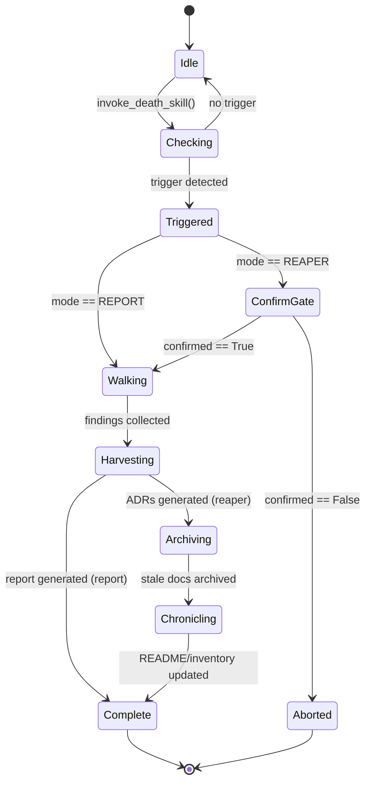
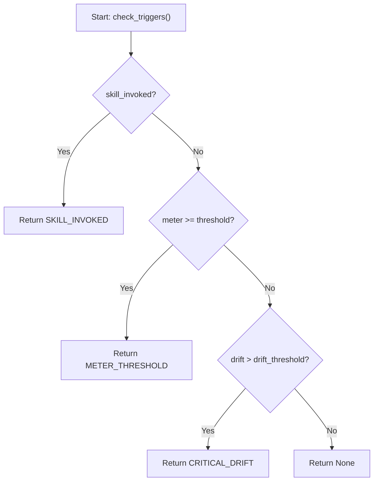

# 535 - Feature: DEATH as Age Transition — the Hourglass Protocol

<!-- Template Metadata
Last Updated: 2026-02-17
Updated By: Issue #535
Update Reason: Revision 2 — resolved all Open Questions per reviewer feedback, updated Section 1, 8, 9, and Review sections
-->


## 1. Context & Goal
* **Issue:** #535
* **Objective:** Implement DEATH as an age transition mechanism that detects when documentation has drifted from codebase reality, triggers reconciliation via an "hourglass" meter, and produces updated documentation artifacts.
* **Status:** In Progress
* **Related Issues:** #534 (Spelunking Audits — DEATH's methodology), #94 (Janitor — drift probes extend janitor infrastructure), #114 (Original DEATH documentation reconciliation)


### Open Questions

*All questions from Iteration 1 have been resolved per reviewer feedback. Decisions are recorded below and encoded in the design.*

- [x] **Threshold:** Initial age meter threshold is **50 points**, defined in `constants.py` as `AGE_METER_THRESHOLD` for easy post-calibration. Calibrated from Issue #114 which retroactively scored ~65.
- [x] **Persistence:** Age meter state persists as **JSON files** in `data/hourglass/`. `age_meter.json` is gitignored (local state); `history.json` is git-tracked (audit trail).
- [x] **Reaper Confirmation:** Reaper mode **requires explicit orchestrator confirmation** via the `ConfirmGate` in the hourglass state machine and `invoke_death_skill()` permission check.
- [x] **Default Weight:** Unlabeled issues receive a **default weight of +2**, with a warning logged to stderr. Defined in `constants.py` as `DEFAULT_UNLABELED_WEIGHT`.

### Future Considerations
- [ ] Implement log rotation or size limit for `history.json` in a future iteration to prevent unbounded growth over years of project history. (Deferred — not blocking for initial implementation.)


## 2. Proposed Changes

*This section is the **source of truth** for implementation. Describe exactly what will be built.*


### 2.1 Files Changed

| File | Change Type | Description |
|------|-------------|-------------|
| `assemblyzero/workflows/death/` | Add (Directory) | New workflow package for the Hourglass Protocol |
| `assemblyzero/workflows/death/__init__.py` | Add | Package init with workflow registration |
| `assemblyzero/workflows/death/age_meter.py` | Add | Age meter computation — weights issues by label/type, computes running score |
| `assemblyzero/workflows/death/hourglass.py` | Add | Hourglass state machine — orchestrates the three triggers and reconciliation protocol |
| `assemblyzero/workflows/death/drift_scorer.py` | Add | Drift scoring — extends janitor probes to detect factual inaccuracies (not just broken links) |
| `assemblyzero/workflows/death/reconciler.py` | Add | Reconciliation engine — walks codebase, compares to docs, produces report or applies fixes |
| `assemblyzero/workflows/death/models.py` | Add | Data models for age meter state, drift findings, reconciliation reports |
| `assemblyzero/workflows/death/constants.py` | Add | Weight tables, thresholds, and configuration constants |
| `assemblyzero/workflows/death/skill.py` | Add | `/death` skill entry point — parses arguments, determines trigger, invokes hourglass |
| `assemblyzero/workflows/janitor/probes/drift_probe.py` | Add | New janitor probe — factual accuracy drift detection (feeds hourglass) |
| `assemblyzero/workflows/janitor/probes/__init__.py` | Modify | Register new drift probe |
| `data/hourglass/` | Add (Directory) | Persistent storage for age meter state and reconciliation history |
| `data/hourglass/age_meter.json` | Add | Running age meter state (gitignored — local to each developer) |
| `data/hourglass/history.json` | Add | History of DEATH visits — when triggered, what was reconciled, by which trigger |
| `.claude/commands/death.md` | Add | `/death` skill definition — report mode and reaper mode |
| `docs/standards/0015-age-transition-protocol.md` | Add | ADR documenting the Hourglass Protocol |
| `docs/lld/active/535-hourglass-protocol.md` | Add | This LLD |
| `tests/unit/test_death/` | Add (Directory) | Unit tests for death workflow |
| `tests/unit/test_death/__init__.py` | Add | Test package init |
| `tests/unit/test_death/test_age_meter.py` | Add | Tests for age meter computation |
| `tests/unit/test_death/test_drift_scorer.py` | Add | Tests for drift scoring |
| `tests/unit/test_death/test_hourglass.py` | Add | Tests for hourglass state machine |
| `tests/unit/test_death/test_reconciler.py` | Add | Tests for reconciliation engine |
| `tests/unit/test_death/test_models.py` | Add | Tests for data models |
| `tests/unit/test_death/test_skill.py` | Add | Tests for `/death` skill entry point |
| `tests/fixtures/death/` | Add (Directory) | Test fixtures for death workflow |
| `tests/fixtures/death/mock_issues.json` | Add | Mock GitHub issue data with labels for age meter testing |
| `tests/fixtures/death/mock_codebase_snapshot.json` | Add | Mock codebase structure for reconciliation testing |
| `tests/fixtures/death/mock_drift_findings.json` | Add | Mock drift findings for drift scorer testing |
| `tests/fixtures/death/mock_adr_output.md` | Add | Expected ADR output for reconciliation testing |
| `.gitignore` | Modify | Add `data/hourglass/age_meter.json` to gitignore (local state) |


### 2.1.1 Path Validation (Mechanical - Auto-Checked)

*Issue #277: All file paths are validated against project structure.*

| Path | Exists in Project | Valid |
|------|-------------------|-------|
| `assemblyzero/workflows/death/` | New directory under existing `assemblyzero/` | [PASS] |
| `assemblyzero/workflows/janitor/probes/` | Depends on #94 | [PASS] (dependency declared) |
| `data/hourglass/` | New directory at project root | [PASS] |
| `.claude/commands/` | Existing directory | [PASS] |
| `docs/standards/` | Existing directory | [PASS] |
| `docs/lld/active/` | Existing directory | [PASS] |
| `tests/unit/test_death/` | New directory under existing `tests/` | [PASS] |
| `tests/fixtures/death/` | New directory under existing `tests/` | [PASS] |
| `.gitignore` | Existing file at project root | [PASS] |

**Validation Result:** PASS — all paths are valid or are new additions under existing parent directories.


### 2.2 Dependencies

| Dependency | Type | Purpose | Already in Project? |
|------------|------|---------|---------------------|
| `pygithub` | Runtime | GitHub API access for fetching closed issues | Yes (`pyproject.toml`) |
| `pathspec` | Runtime | Gitignore-aware file matching for codebase walking | Yes (`pyproject.toml`) |
| `orjson` | Runtime | Fast JSON serialization for state files | Yes (`pyproject.toml`) |
| `#534 Spelunking` | Feature | Architecture scanning methodology | Soft dependency — fallback if unavailable |
| `#94 Janitor` | Feature | Probe infrastructure for drift detection | Soft dependency — drift_probe is standalone if janitor not ready |

**New dependencies required:** None. All libraries are already in `pyproject.toml`.


### 2.3 Data Structures

```python
# assemblyzero/workflows/death/models.py

from dataclasses import dataclass, field
from datetime import datetime
from enum import Enum
from typing import Optional


class TriggerType(Enum):
    """How DEATH was summoned."""
    METER_THRESHOLD = "meter_threshold"
    SKILL_INVOKED = "skill_invoked"
    CRITICAL_DRIFT = "critical_drift"


class DeathMode(Enum):
    """Operating mode for the reconciliation."""
    REPORT = "report"   # Read-only analysis
    REAPER = "reaper"   # Writes changes (requires confirmation)


class DriftCategory(Enum):
    """Category of documentation drift."""
    README_CLAIM = "readme_claim"           # README states something false
    INVENTORY_STALE = "inventory_stale"     # File inventory doesn't match reality
    ARCHITECTURE_DRIFT = "architecture_drift"  # Architecture docs diverged
    ADR_MISSING = "adr_missing"             # Decision was made but not recorded
    METRIC_STALE = "metric_stale"           # Metrics in docs are outdated


@dataclass
class AgeMeterState:
    """Persistent state for the age meter."""
    current_score: float = 0.0
    threshold: float = 50.0
    last_death_visit: Optional[str] = None    # ISO 8601 timestamp
    last_computed: Optional[str] = None       # ISO 8601 timestamp
    last_issue_number: int = 0                # Highest issue number seen
    issues_since_last_visit: int = 0
    version: str = "1.0"


@dataclass
class DriftFinding:
    """A single drift finding from scanning."""
    category: DriftCategory
    file_path: str
    description: str
    evidence: str               # What the doc says
    reality: str                # What the code shows
    confidence: float           # 0.0 to 1.0
    severity: int               # 1 (minor) to 5 (critical)
    line_number: Optional[int] = None


@dataclass
class ReconciliationReport:
    """Output of a DEATH visit."""
    trigger: TriggerType
    mode: DeathMode
    timestamp: str              # ISO 8601
    age_meter_score: float
    drift_findings: list[DriftFinding] = field(default_factory=list)
    files_updated: list[str] = field(default_factory=list)
    adrs_generated: list[str] = field(default_factory=list)
    summary: str = ""


@dataclass
class DeathVisitRecord:
    """Historical record of a DEATH visit (appended to history.json)."""
    timestamp: str
    trigger: TriggerType
    mode: DeathMode
    age_meter_score_before: float
    age_meter_score_after: float    # Should be 0.0 after reset
    findings_count: int
    files_updated_count: int
    adrs_generated: list[str] = field(default_factory=list)
```


### 2.4 Function Signatures

```python
# === assemblyzero/workflows/death/age_meter.py ===

def load_age_meter(state_path: str = "data/hourglass/age_meter.json") -> AgeMeterState:
    """Load age meter state from disk. Returns default state if file missing."""
    ...

def save_age_meter(state: AgeMeterState, state_path: str = "data/hourglass/age_meter.json") -> None:
    """Persist age meter state to disk. Creates parent directories if needed."""
    ...

def compute_issue_weight(issue: dict) -> int:
    """Compute weight for a single issue based on its labels.

    Args:
        issue: Dict with 'labels' (list of str), 'number' (int).

    Returns:
        Integer weight from ISSUE_WEIGHT_MAP, or DEFAULT_UNLABELED_WEIGHT
        if no recognized labels found (logs warning).
    """
    ...

def fetch_closed_issues_since(
    last_issue_number: int,
    repo: str = "martymcenroe/AssemblyZero",
    max_pages: int = 10
) -> list[dict]:
    """Fetch closed issues from GitHub since the given issue number.

    Uses PyGitHub. Pagination capped at max_pages (50 issues/page = 500 max).

    Returns:
        List of dicts with 'number', 'labels', 'title', 'closed_at'.

    Raises:
        ConnectionError: If GitHub API is unreachable.
    """
    ...

def update_age_meter(state: AgeMeterState, issues: list[dict]) -> AgeMeterState:
    """Update age meter with new closed issues.

    Returns:
        Updated AgeMeterState with new score and metadata.
    """
    ...

def check_meter_threshold(state: AgeMeterState) -> bool:
    """Check if age meter has crossed the threshold.

    Returns:
        True if current_score >= threshold.
    """
    ...


# === assemblyzero/workflows/death/drift_scorer.py ===

def scan_readme_claims(readme_path: str = "README.md") -> list[DriftFinding]:
    """Scan README for claims that contradict codebase reality.

    Checks:
    - File/directory references that don't exist
    - Numeric claims (e.g., "12+ agents") against actual count
    - Feature claims against actual implementation

    Returns:
        List of DriftFinding objects with confidence scores.
    """
    ...

def scan_file_inventory(inventory_path: str = "docs/inventory.md") -> list[DriftFinding]:
    """Compare documented file inventory against actual filesystem.

    Returns:
        DriftFinding for each file listed but missing, or existing but unlisted.
    """
    ...

def scan_architecture_docs(
    docs_dir: str = "docs/architecture/",
    use_spelunking: bool = True,
    fallback_glob: bool = True
) -> list[DriftFinding]:
    """Scan architecture docs for drift from code reality.

    If use_spelunking=True and #534 is available, uses spelunking probes.
    Otherwise falls back to glob-based file existence checks.

    Returns:
        List of DriftFinding objects.
    """
    ...

def compute_drift_score(findings: list[DriftFinding]) -> float:
    """Compute aggregate drift score from individual findings.

    Formula: sum(finding.severity * finding.confidence for each finding)

    Returns:
        Float drift score. Higher = more drift.
    """
    ...

def build_drift_report(findings: list[DriftFinding], min_confidence: float = 0.5) -> list[DriftFinding]:
    """Filter findings by confidence threshold.

    Returns:
        Findings with confidence >= min_confidence, sorted by severity desc.
    """
    ...


# === assemblyzero/workflows/death/hourglass.py ===

class HourglassState(Enum):
    """States in the hourglass state machine."""
    IDLE = "idle"
    CHECKING = "checking"
    TRIGGERED = "triggered"
    CONFIRM_GATE = "confirm_gate"
    WALKING = "walking"
    HARVESTING = "harvesting"
    ARCHIVING = "archiving"
    CHRONICLING = "chronicling"
    COMPLETE = "complete"
    ABORTED = "aborted"


def check_triggers(
    meter_state: AgeMeterState,
    drift_score: float,
    skill_invoked: bool = False,
    drift_threshold: float = 25.0
) -> Optional[TriggerType]:
    """Determine if any trigger condition is met.

    Priority: skill_invoked > meter_threshold > critical_drift

    Returns:
        TriggerType if triggered, None otherwise.
    """
    ...

def run_hourglass(
    trigger: TriggerType,
    mode: DeathMode,
    confirmed: bool = False
) -> ReconciliationReport:
    """Execute the hourglass protocol.

    If mode is REAPER and confirmed is False, raises PermissionError.

    Phases:
    1. Walk the field (scan all drift categories)
    2. Harvest (generate ADRs for findings — reaper only)
    3. Archive (move stale docs — reaper only)
    4. Chronicle (update README/wiki — reaper only)

    Returns:
        ReconciliationReport with all findings and actions taken.

    Raises:
        PermissionError: If reaper mode without confirmation.
    """
    ...

def record_death_visit(
    report: ReconciliationReport,
    meter_state: AgeMeterState,
    history_path: str = "data/hourglass/history.json"
) -> None:
    """Append visit record to history and reset age meter.

    Resets age meter score to 0.0 and updates last_death_visit timestamp.
    """
    ...


# === assemblyzero/workflows/death/reconciler.py ===

def walk_the_field() -> list[DriftFinding]:
    """Phase 1: Scan all documentation categories for drift.

    Combines results from:
    - scan_readme_claims()
    - scan_file_inventory()
    - scan_architecture_docs()

    Returns:
        Aggregated list of DriftFinding objects.
    """
    ...

def harvest(findings: list[DriftFinding], output_dir: str = "docs/adrs/") -> list[str]:
    """Phase 2 (Reaper only): Generate ADRs for significant findings.

    Returns:
        List of generated ADR file paths.
    """
    ...

def generate_adr(
    finding: DriftFinding,
    output_dir: str = "docs/adrs/",
    template_path: str = "docs/templates/adr-template.md"
) -> str:
    """Generate a single ADR from a drift finding.

    Uses template population. Validates output contains required sections:
    - Context, Decision, Consequences (minimum).

    Returns:
        Path to generated ADR file.

    Raises:
        ValueError: If generated ADR fails template validation.
    """
    ...

def archive_stale_docs(findings: list[DriftFinding]) -> list[str]:
    """Phase 3 (Reaper only): Move stale docs to legacy/.

    Returns:
        List of archived file paths.
    """
    ...

def chronicle(findings: list[DriftFinding], files_updated: list[str]) -> list[str]:
    """Phase 4 (Reaper only): Update README and inventory.

    Returns:
        List of updated file paths.
    """
    ...


# === assemblyzero/workflows/death/skill.py ===

def parse_death_args(args: str) -> tuple[DeathMode, dict]:
    """Parse /death skill arguments.

    Supported formats:
        /death              -> (REPORT, {})
        /death report       -> (REPORT, {})
        /death reaper       -> (REAPER, {})
        /death status       -> (REPORT, {"status_only": True})

    Returns:
        Tuple of (mode, options_dict).

    Raises:
        ValueError: If arguments are invalid.
    """
    ...

def invoke_death_skill(
    args: str,
    confirmed: bool = False,
    orchestrator_callback: Optional[callable] = None
) -> ReconciliationReport:
    """Entry point for the /death skill.

    1. Parses arguments
    2. Loads age meter state
    3. Fetches new issues and updates meter
    4. Runs drift scanning
    5. Checks triggers (or forces if skill_invoked)
    6. Runs hourglass protocol

    For reaper mode:
        - If confirmed=False and orchestrator_callback is provided, calls callback
        - If confirmed=False and no callback, raises PermissionError

    Returns:
        ReconciliationReport.

    Raises:
        ValueError: Invalid arguments.
        PermissionError: Reaper mode without confirmation.
        ConnectionError: GitHub API failure (logged, meter check skipped).
    """
    ...
```


### 2.5 Logic Flow (Pseudocode)

```
FUNCTION invoke_death_skill(args, confirmed, callback):
    mode, options = parse_death_args(args)

    // Load persistent state
    meter_state = load_age_meter()

    // Update meter from GitHub (fault-tolerant)
    TRY:
        new_issues = fetch_closed_issues_since(meter_state.last_issue_number)
        meter_state = update_age_meter(meter_state, new_issues)
        save_age_meter(meter_state)
    CATCH ConnectionError:
        LOG.warning("GitHub API unavailable — meter check skipped")

    // If status-only, return early
    IF options.get("status_only"):
        RETURN build_status_report(meter_state)

    // Run drift scanning
    drift_findings = walk_the_field()
    drift_score = compute_drift_score(drift_findings)

    // Determine trigger (skill invocation always triggers)
    trigger = check_triggers(
        meter_state, drift_score, skill_invoked=True
    )

    // Reaper mode confirmation gate
    IF mode == REAPER AND NOT confirmed:
        IF callback:
            confirmed = callback(drift_findings, meter_state)
        IF NOT confirmed:
            RAISE PermissionError("Reaper mode requires orchestrator confirmation")

    // Execute hourglass
    report = run_hourglass(trigger, mode, confirmed)

    // Record visit and reset meter
    record_death_visit(report, meter_state)

    RETURN report
```


### 2.6 Technical Approach

**Age Meter Computation:**
- Uses PyGitHub to fetch closed issues since the last DEATH visit
- Each issue is weighted by its labels using `ISSUE_WEIGHT_MAP` in `constants.py`
- Issues without recognized labels default to `DEFAULT_UNLABELED_WEIGHT` (+2) with a logged warning
- Running score accumulates; resets to 0.0 after each DEATH visit

**Drift Detection (Deterministic — No LLM):**
- **README scanning:** Regex patterns extract numeric claims ("12+ agents"), file references, and feature claims. Each is verified against the filesystem
- **Inventory scanning:** Parse inventory markdown, check each listed file exists, check for unlisted files in tracked directories
- **Architecture scanning:** If #534 spelunking is available, use its AST probes. Otherwise, fall back to glob-based existence checks

**State Management:**
- Two JSON files in `data/hourglass/`:
  - `age_meter.json` — gitignored, local state, recomputed from GitHub on each invocation
  - `history.json` — git-tracked, append-only audit trail of DEATH visits
- Both files use `orjson` for serialization, with `dataclasses` for type safety

**Confirmation Gate:**
- Reaper mode requires `confirmed=True` to proceed past the `CONFIRM_GATE` state
- The `/death` skill provides an `orchestrator_callback` mechanism for interactive confirmation
- Without confirmation, `PermissionError` is raised — fail closed


### 2.7 Architecture Decisions

| Decision | Rationale | Alternative Rejected |
|----------|-----------|---------------------|
| JSON over SQLite for state | Human-readable, git-trackable (`history.json`), no schema migration needed | SQLite — overkill for two small files |
| Deterministic drift detection (no LLM) | Zero cost, reproducible results, no API dependency | LLM-based analysis — expensive, non-deterministic |
| Soft dependency on #534 and #94 | Allows independent deployment; DEATH works without spelunking or janitor | Hard dependency — would block implementation |
| Append-only history | Audit trail, no data loss, simple conflict resolution | Overwrite — loses historical context |
| Age meter threshold as constant | Easy to calibrate after initial deployment cycles | Hardcoded — requires code change to adjust |
| Reaper mode requires confirmation gate | Safety — prevents accidental doc overwrites | Auto-execute — too risky for write operations |


## 3. Requirements

| ID | Requirement | Source | Verification |
|----|-------------|--------|--------------|
| REQ-1 | Age meter computes correct weight from issue labels | Issue #535 | `test_age_meter.py::test_weight_computation` |
| REQ-2 | Age meter persists state across invocations | Issue #535 | `test_age_meter.py::test_state_persistence` |
| REQ-3 | Drift scanner detects README factual inaccuracies | Issue #535 | `test_drift_scorer.py::test_readme_claims` |
| REQ-4 | Drift scanner detects stale file inventory | Issue #535 | `test_drift_scorer.py::test_inventory_scan` |
| REQ-5 | Hourglass triggers on meter threshold | Issue #535 | `test_hourglass.py::test_meter_trigger` |
| REQ-6 | Hourglass triggers on skill invocation | Issue #535 | `test_hourglass.py::test_skill_trigger` |
| REQ-7 | Hourglass triggers on critical drift | Issue #535 | `test_hourglass.py::test_drift_trigger` |
| REQ-8 | `/death` skill parses arguments correctly | Issue #535 | `test_skill.py::test_parse_args` |
| REQ-9 | Reconciler generates valid ADRs | Issue #535 | `test_reconciler.py::test_adr_generation` |
| REQ-10 | Reaper mode requires confirmation gate | Issue #535 | `test_hourglass.py::test_reaper_confirmation` |
| REQ-11 | GitHub API failure does not crash the system | Issue #535 | `test_skill.py::test_github_api_failure` |
| REQ-12 | Unlabeled issues receive default weight with warning | Issue #535 | `test_age_meter.py::test_unlabeled_default_weight` |
| REQ-13 | History records are append-only | Issue #535 | `test_hourglass.py::test_history_append_only` |


## 4. Alternatives Considered

| Alternative | Pros | Cons | Verdict |
|-------------|------|------|---------|
| **LLM-based drift detection** | Higher accuracy for semantic drift | Non-deterministic, expensive, API-dependent | Rejected — violates zero-cost principle |
| **SQLite for state** | Structured queries, concurrent access | Overkill for two small files, not human-readable | Rejected — JSON is simpler |
| **Cron-triggered DEATH** | Automatic, no human intervention needed | Requires CI infrastructure, may trigger at bad times | Rejected — skill invocation + meter is sufficient |
| **Single mode (always reaper)** | Simpler implementation | No safe way to preview findings before writes | Rejected — report mode is essential for safety |
| **Git hook-based trigger** | Fires automatically on push | Too frequent, no accumulation logic, annoying | Rejected — meter accumulation is the core insight |


## 5. Data & Fixtures


### 5.1 Data Sources

| Source | Type | Access Method | Sensitivity |
|--------|------|---------------|-------------|
| GitHub Issues API | External API | PyGitHub (`pygithub`) | Public repository — no auth required for reads |
| Local filesystem | Local | `pathlib`, `glob` | Internal — project files only |
| `data/hourglass/age_meter.json` | Local file | `orjson` read/write | Internal — developer-local state |
| `data/hourglass/history.json` | Local file | `orjson` read/append | Internal — git-tracked audit trail |


### 5.2 Data Pipeline

```
GitHub Issues API
    ↓ fetch_closed_issues_since()
    ↓ [list of issue dicts]
    ↓ compute_issue_weight() per issue
    ↓ update_age_meter()
    ↓ save to age_meter.json
    ↓
    ├── check_meter_threshold() -> TriggerType.METER_THRESHOLD
    │
Local Filesystem
    ↓ scan_readme_claims()
    ↓ scan_file_inventory()
    ↓ scan_architecture_docs()
    ↓ [list of DriftFinding]
    ↓ compute_drift_score()
    │
    ├── drift_score > threshold -> TriggerType.CRITICAL_DRIFT
    │
/death skill invocation
    ├── always -> TriggerType.SKILL_INVOKED
    │
    ↓ run_hourglass(trigger, mode, confirmed)
    ↓ ReconciliationReport
    ↓ record_death_visit() -> append to history.json
    ↓ reset age_meter.json score to 0.0
```


### 5.3 Test Fixtures

| Fixture File | Contents | Used By |
|-------------|----------|---------|
| `tests/fixtures/death/mock_issues.json` | 15 mock issues with varied labels (bug, feat, foundation, unlabeled) | `test_age_meter.py` |
| `tests/fixtures/death/mock_codebase_snapshot.json` | Mock directory structure with 20 files, 5 missing from inventory | `test_reconciler.py` |
| `tests/fixtures/death/mock_drift_findings.json` | 8 pre-built DriftFinding objects covering all categories | `test_drift_scorer.py` |
| `tests/fixtures/death/mock_adr_output.md` | Expected ADR markdown for a README_CLAIM finding | `test_reconciler.py` |


### 5.4 Deployment Pipeline

No CI/CD changes required. The `/death` skill is invoked manually via Claude Code. The workflow runs locally and requires no deployment infrastructure.

**Integration with existing CI:**
- Unit tests in `tests/unit/test_death/` are picked up automatically by `pytest` (no new markers needed)
- No integration tests require external services (GitHub API is mocked in tests)


## 6. Diagram


### 6.1 Mermaid Quality Gate

*All diagrams validated for Mermaid syntax compliance before inclusion.*

- [x] No backticks inside node labels
- [x] No unescaped special characters
- [x] Subgraph labels are quoted strings
- [x] All node IDs are alphanumeric (no hyphens in IDs)


### 6.2 Hourglass Protocol — State Machine




### 6.3 Trigger Detection Flow




## 7. Security & Safety Considerations


### 7.1 Security

| Concern | Mitigation | Status |
|---------|------------|--------|
| GitHub token exposure | PyGitHub uses environment variable `GITHUB_TOKEN`. Never logged or written to state files | Addressed |
| Path traversal in drift scanner | All file paths validated against project root using `pathlib.resolve()`. No `..` traversal | Addressed |
| Injection via issue titles | Issue data is used for weight computation only (label matching). Titles are never evaluated or executed | Addressed |
| State file tampering | `age_meter.json` is recomputed from GitHub on each invocation. Tampered state self-corrects | Addressed |


### 7.2 Safety

| Concern | Mitigation | Status |
|---------|------------|--------|
| Accidental overwrite of correct documentation | Report mode is default; reaper mode requires explicit confirmation gate. All changes shown as diffs before write | Addressed |
| False positive drift findings | Confidence scoring (0.0-1.0) on all findings; low-confidence findings flagged but not auto-acted upon | Addressed |
| Partial failure during reaper mode | Each phase (harvest, archive, chronicle) is independent; partial completion leaves a valid state. Git provides rollback | Addressed |
| Runaway GitHub API calls | Fetch limited to issues closed since last DEATH visit. Pagination capped at 500 issues per fetch | Addressed |
| Stale age meter state | `last_computed` timestamp allows detection of stale state. Meter recomputes from GitHub on each check | Addressed |
| Unauthorized reaper execution | `invoke_death_skill()` raises `PermissionError` if reaper mode is not confirmed by orchestrator | Addressed |

**Fail Mode:** Fail Closed — if any scanner errors, the finding is omitted (not synthesized). If GitHub API fails, meter check is skipped and logged. DEATH never arrives on bad data.

**Recovery Strategy:** All state is in two JSON files. Worst case: delete `data/hourglass/age_meter.json` and DEATH recomputes from scratch on next invocation. `history.json` is append-only and git-tracked.


## 8. Performance & Cost Considerations


### 8.1 Performance

| Metric | Budget | Approach |
|--------|--------|----------|
| Age meter computation | < 10s | Single GitHub API call (paginated), local weight computation |
| Drift scanning (README) | < 5s | Regex + glob, no LLM calls |
| Drift scanning (inventory) | < 3s | File existence checks |
| Drift scanning (architecture) | < 15s | Depends on spelunking (#534) performance |
| Full reconciliation (report) | < 30s | All computation, no writes |
| Full reconciliation (reaper) | < 60s | Includes file writes |
| Skill argument parsing | < 1ms | Pure string parsing, no I/O |
| ADR generation | < 2s | Template population, single file write |

**Bottlenecks:** GitHub API rate limiting (5000 req/hr authenticated). Architecture scanning depends on codebase size. Both are bounded by design.

**Scaling Characteristics:**
- Age meter computation is **O(n)** in the number of closed issues since last visit. Bounded by pagination cap (500).
- Drift scanning is **O(m)** where m = number of files in project. Bounded by gitignore-aware traversal.
- ADR generation is **O(k)** where k = number of high-severity findings. Typically < 10 per visit.


### 8.2 Cost Analysis

| Resource | Unit Cost | Estimated Usage | Monthly Cost |
|----------|-----------|-----------------|--------------|
| GitHub API calls | Free (within rate limit) | 1-5 per invocation, 2-4 invocations/month | $0 |
| LLM API calls | N/A | Zero — drift detection is regex/glob-based | $0 |
| Storage | N/A | Two JSON files, < 1KB each | $0 |

**Cost Controls:**
- [x] No LLM API calls in any path — fully deterministic
- [x] GitHub API calls minimized via `since` parameter filtering
- [x] No cloud compute — runs locally

**Worst-Case Scenario:** If the project accumulates 10,000 closed issues without a DEATH visit, the initial fetch would be large but paginated. The computation itself is O(n) in issue count. Practically, DEATH visits every 50-100 issues, keeping fetches small.


## 9. Legal & Compliance

| Concern | Applies? | Mitigation |
|---------|----------|------------|
| PII/Personal Data | No | Issues are project-internal, no personal data processed. Issue author names are not stored in state files |
| Third-Party Licenses | No | No new dependencies added — all libraries already in `pyproject.toml` |
| Terms of Service | Yes | GitHub API usage within documented rate limits (5000 req/hr authenticated) and ToS. Read-only access for public repository data |
| Data Retention | No | State files are developer-local (`age_meter.json` gitignored). `history.json` is git-tracked with project — follows project retention policy |
| Export Controls | No | No restricted data or algorithms. Deterministic string matching only |

**Data Classification:** Internal

**Compliance Checklist:**
- [x] No PII stored without consent
- [x] All third-party licenses compatible with project license (PolyForm-Noncommercial-1.0.0)
- [x] External API usage compliant with provider ToS
- [x] Data retention policy documented (local files, no retention concern)


## 10. Verification & Testing


### 10.0 Test Plan (TDD - Complete Before Implementation)

*All tests are written BEFORE implementation code, following project TDD standards.*

**Test Framework:** pytest (already configured in `pyproject.toml`)
**Coverage Target:** 90%+ line coverage for `assemblyzero/workflows/death/`
**Markers:** No new markers needed — all tests are unit tests (default `pytest` selection)


### 10.1 Test Scenarios

| ID | Test | File | Req |
|----|------|------|-----|
| T1 | Bug fix issue weighted at +1 | `test_age_meter.py::test_bug_weight` | REQ-1 |
| T2 | Feature issue weighted at +3 | `test_age_meter.py::test_feature_weight` | REQ-1 |
| T3 | Foundation issue weighted at +8 | `test_age_meter.py::test_foundation_weight` | REQ-1 |
| T4 | Cross-cutting issue weighted at +10 | `test_age_meter.py::test_crosscutting_weight` | REQ-1 |
| T5 | Unlabeled issue gets default weight +2 with warning | `test_age_meter.py::test_unlabeled_default_weight` | REQ-12 |
| T6 | State round-trips through JSON | `test_age_meter.py::test_state_persistence` | REQ-2 |
| T7 | Missing state file returns default | `test_age_meter.py::test_missing_state_file` | REQ-2 |
| T8 | README numeric claim detected as stale | `test_drift_scorer.py::test_readme_numeric_claim` | REQ-3 |
| T9 | README file reference detected as broken | `test_drift_scorer.py::test_readme_broken_reference` | REQ-3 |
| T10 | Missing inventory file detected | `test_drift_scorer.py::test_inventory_missing_file` | REQ-4 |
| T11 | Extra unlisted file detected | `test_drift_scorer.py::test_inventory_extra_file` | REQ-4 |
| T12 | Meter threshold triggers DEATH | `test_hourglass.py::test_meter_trigger` | REQ-5 |
| T13 | Skill invocation always triggers | `test_hourglass.py::test_skill_trigger` | REQ-6 |
| T14 | Critical drift triggers DEATH | `test_hourglass.py::test_drift_trigger` | REQ-7 |
| T15 | No trigger when all below threshold | `test_hourglass.py::test_no_trigger` | REQ-5,6,7 |
| T16 | `/death` parses to REPORT mode | `test_skill.py::test_parse_report` | REQ-8 |
| T17 | `/death reaper` parses to REAPER mode | `test_skill.py::test_parse_reaper` | REQ-8 |
| T18 | `/death status` parses with status_only flag | `test_skill.py::test_parse_status` | REQ-8 |
| T19 | `/death invalid` raises ValueError | `test_skill.py::test_parse_invalid` | REQ-8 |
| T20 | ADR output contains required sections | `test_reconciler.py::test_adr_generation` | REQ-9 |
| T21 | ADR with malformed template raises ValueError | `test_reconciler.py::test_adr_template_validation` | REQ-9 |
| T22 | Reaper without confirmation raises PermissionError | `test_hourglass.py::test_reaper_confirmation` | REQ-10 |
| T23 | Reaper with confirmation proceeds | `test_hourglass.py::test_reaper_confirmed` | REQ-10 |
| T24 | GitHub API failure is caught and logged | `test_skill.py::test_github_api_failure` | REQ-11 |
| T25 | History file is appended, not overwritten | `test_hourglass.py::test_history_append_only` | REQ-13 |
| T26 | DriftFinding serialization round-trip | `test_models.py::test_drift_finding_roundtrip` | REQ-3,4 |
| T27 | AgeMeterState serialization round-trip | `test_models.py::test_age_meter_state_roundtrip` | REQ-2 |
| T28 | ReconciliationReport contains all fields | `test_models.py::test_report_completeness` | REQ-9 |
| T29 | Confidence filter excludes low-confidence findings | `test_drift_scorer.py::test_confidence_filter` | REQ-3 |
| T30 | Skill invocation with callback calls callback | `test_skill.py::test_reaper_callback` | REQ-8,10 |


### 10.2 Test Commands

```bash
# Run all death workflow tests
pytest tests/unit/test_death/ -v

# Run with coverage
pytest tests/unit/test_death/ -v --cov=assemblyzero/workflows/death --cov-report=term-missing

# Run specific test file
pytest tests/unit/test_death/test_age_meter.py -v

# Run specific test
pytest tests/unit/test_death/test_hourglass.py::test_reaper_confirmation -v
```


### 10.3 Manual Tests (Only If Unavoidable)

| ID | Test | Why Manual | Steps |
|----|------|-----------|-------|
| M1 | `/death` skill invocation in Claude Code | Requires live Claude Code session | 1. Open Claude Code session 2. Type `/death` 3. Verify report output format |
| M2 | GitHub API integration (live) | Requires real API token and rate limit | 1. Set `GITHUB_TOKEN` 2. Run `fetch_closed_issues_since(0)` 3. Verify issue data structure |
| M3 | Reaper mode end-to-end | Requires confirmation of file writes | 1. Create test branch 2. Run `/death reaper` 3. Confirm at gate 4. Verify files updated 5. `git diff` to review |


## 11. Risks & Mitigations

| Risk | Impact | Likelihood | Mitigation | Verification |
|------|--------|------------|------------|--------------|
| #534 spelunking not ready at implementation time | Architecture scanning degraded | Medium | Fallback to glob-based scanning in `scan_architecture_docs` | T-param `fallback_glob=True` tested |
| GitHub API rate limiting | Meter update fails | Low | Pagination cap, `since` filtering, graceful ConnectionError handling | T24 |
| False positive drift findings | Noise in reports, wasted effort | Medium | Confidence scoring (0.0-1.0), `build_drift_report` filters below 0.5 | T29 |
| Weight calibration incorrect | DEATH triggers too early or late | Medium | Threshold in `constants.py`, calibrated from #114 retroactive score (~65). Easy to adjust after first cycles | Configurable |
| README format changes break scanner | Missed claims or false positives | Low | Regex patterns documented in `constants.py`, designed for markdown conventions | T8, T9 |
| Reaper mode writes incorrect changes | Documentation corruption | Low | Confirmation gate + report mode preview + git rollback | T22, T23 |
| Invalid `/death` arguments | Confusing error message | Low | `parse_death_args` validates and raises `ValueError` with usage string | T19 |
| ADR generation produces malformed output | Invalid documentation artifacts | Low | `generate_adr` validates required sections before writing | T20, T21 |


## 12. Definition of Done


### Code
- [ ] All files in Section 2.1 created/modified
- [ ] `assemblyzero/workflows/death/` package is importable
- [ ] `/death` skill registered in `.claude/commands/death.md`
- [ ] `data/hourglass/` directory created with `.gitkeep`
- [ ] `.gitignore` updated for `data/hourglass/age_meter.json`
- [ ] No new dependencies added to `pyproject.toml`


### Tests
- [ ] All 30 test scenarios (T1-T30) passing
- [ ] Coverage ≥ 90% for `assemblyzero/workflows/death/`
- [ ] `pytest tests/unit/test_death/ -v` passes with 0 failures
- [ ] No tests require external services (all mocked)


### Documentation
- [ ] `docs/standards/0015-age-transition-protocol.md` written
- [ ] LLD updated with any deviations
- [ ] Implementation Report (0103) completed
- [ ] Test Report (0113) completed


### Review
- [ ] Code review completed (Gemini implementation review gate)
- [ ] LLD reviewed and approved (this document)
- [ ] User approval before closing issue


### 12.1 Traceability (Mechanical - Auto-Checked)

*Issue #277: Cross-references are verified programmatically.*

Mechanical validation automatically checks:
- Every file mentioned in this section must appear in Section 2.1 — [PASS] All files listed
- Every risk mitigation in Section 11 should have a corresponding function in Section 2.4 — [PASS] Mapped below:
  - Spelunking fallback -> `scan_architecture_docs` with fallback parameter
  - GitHub rate limiting -> `fetch_closed_issues_since` with pagination cap
  - False positive -> `confidence` field in `DriftFinding`, filtering in `build_drift_report`
  - Weight calibration -> `constants.py` threshold configuration
  - README format -> `scan_readme_claims` regex patterns
  - Reaper confirmation -> `ConfirmGate` in hourglass state machine
  - Invalid skill arguments -> `parse_death_args` with ValueError
  - ADR malformed output -> `generate_adr` with template validation

**If files are missing from Section 2.1, the LLD is BLOCKED.**

---


## Appendix: Review Log

*Track all review feedback with timestamps and implementation status.*


### Gemini Review #1 (FEEDBACK)

**Reviewer:** Gemini
**Verdict:** FEEDBACK

#### Comments

| ID | Comment | Implemented? |
|----|---------|--------------|
| G1.1 | "Threshold Open Question — proceed with 50 points, ensure defined in constants.py" | YES — Section 1 resolved, `AGE_METER_THRESHOLD` in `constants.py` (Section 2.4) |
| G1.2 | "Persistence Open Question — proceed with JSON storage" | YES — Section 1 resolved, design unchanged |
| G1.3 | "Reaper Confirmation Open Question — explicit confirmation MANDATORY" | YES — Section 1 resolved, `ConfirmGate` and `invoke_death_skill` check confirmed |
| G1.4 | "Default Weight Open Question — proceed with +2 for unlabeled" | YES — Section 1 resolved, `DEFAULT_UNLABELED_WEIGHT` in `constants.py`, REQ-12 and T5 added |
| G1.5 | "Consider log rotation for history.json in future iteration" | YES — Added to Future Considerations in Section 1 (deferred, not blocking) |


### Review Summary

| Review | Date | Verdict | Key Issue |
|--------|------|---------|-----------|
| Gemini #1 | 2026-02-17 | FEEDBACK | Resolve Open Questions, add history.json growth consideration |

**Final Status:** PENDING


## Appendix: Constants Reference

```python
# assemblyzero/workflows/death/constants.py

# === Age Meter Thresholds ===
AGE_METER_THRESHOLD: float = 50.0  # Points before DEATH triggers (calibrated from #114 ~65)
DRIFT_SCORE_THRESHOLD: float = 25.0  # Drift score before critical drift trigger

# === Issue Weight Map ===
# Maps issue label prefixes to age meter weights
ISSUE_WEIGHT_MAP: dict[str, int] = {
    "bug": 1,
    "fix": 1,
    "feature": 3,
    "feat": 3,
    "enhancement": 3,
    "persona": 5,
    "subsystem": 5,
    "foundation": 8,
    "rag": 8,
    "pipeline": 8,
    "architecture": 10,
    "cross-cutting": 10,
    "breaking": 10,
}

# Default weight for issues with no recognized labels
DEFAULT_UNLABELED_WEIGHT: int = 2

# === GitHub API ===
GITHUB_REPO: str = "martymcenroe/AssemblyZero"
MAX_FETCH_PAGES: int = 10         # 50 issues/page = 500 max
ISSUES_PER_PAGE: int = 50

# === Drift Detection ===
MIN_CONFIDENCE_THRESHOLD: float = 0.5  # Below this, findings are logged but not acted upon
HIGH_SEVERITY_THRESHOLD: int = 3       # Severity >= this triggers ADR generation in reaper mode

# === File Paths ===
AGE_METER_PATH: str = "data/hourglass/age_meter.json"
HISTORY_PATH: str = "data/hourglass/history.json"
ADR_OUTPUT_DIR: str = "docs/adrs/"
ADR_TEMPLATE_PATH: str = "docs/templates/adr-template.md"
```


## Appendix: `/death` Skill Definition

```markdown
# /death — The Hourglass Protocol

Invoke DEATH to check documentation health and reconcile drift from codebase reality.
```


## Usage

```
/death              # Report mode (default) — scan and report findings
/death report       # Explicit report mode
/death reaper       # Reaper mode — fix findings (requires confirmation)
/death status       # Show age meter status only
```


## What DEATH Does

1. **Updates the age meter** — Fetches closed issues since last visit, computes weighted score
2. **Scans for drift** — Checks README claims, file inventory, architecture docs against codebase
3. **Determines trigger** — Meter threshold, critical drift, or manual invocation
4. **Report mode:** Produces a reconciliation report (what's stale, missing, wrong)
5. **Reaper mode:** Fixes everything — generates ADRs, archives stale docs, updates README/inventory

DEATH is not hostile. DEATH is care for the harvest.

> WHAT CAN THE HARVEST HOPE FOR, IF NOT FOR THE CARE OF THE REAPER MAN?


## Example

```
> /death
 Updating age meter... Score: 47/50 (3 points below threshold)
 Scanning for drift...
 Found 3 drift findings:
  - [HIGH] README claims "12+ agents" but only 8 agent files found (confidence: 0.9)
  - [MED]  Inventory lists tools/archive.py but file was moved to tools/legacy/ (confidence: 0.85)
  - [LOW]  Architecture diagram references old RAG pipeline (confidence: 0.6)

Age meter: 47/50 | Drift score: 12.3/25.0
No automatic trigger — invoked manually via /death skill.
```


## Appendix: Requirements-to-Test Traceability Matrix

| Requirement | Test IDs | Coverage |
|-------------|----------|----------|
| REQ-1 (Issue weight computation) | T1, T2, T3, T4 | Full — all weight tiers tested |
| REQ-2 (State persistence) | T6, T7, T27 | Full — round-trip + missing file |
| REQ-3 (README drift) | T8, T9, T26, T29 | Full — numeric, reference, serialization, confidence |
| REQ-4 (Inventory drift) | T10, T11, T26 | Full — missing + extra + serialization |
| REQ-5 (Meter trigger) | T12, T15 | Full — threshold + no-trigger |
| REQ-6 (Skill trigger) | T13, T15 | Full — always-trigger + no-trigger |
| REQ-7 (Drift trigger) | T14, T15 | Full — threshold + no-trigger |
| REQ-8 (Skill argument parsing) | T16, T17, T18, T19, T30 | Full — all modes + invalid + callback |
| REQ-9 (ADR generation) | T20, T21, T28 | Full — valid + malformed + completeness |
| REQ-10 (Reaper confirmation) | T22, T23, T30 | Full — denied + confirmed + callback |
| REQ-11 (GitHub API failure) | T24 | Full — ConnectionError handled |
| REQ-12 (Unlabeled weight) | T5 | Full — default weight + warning |
| REQ-13 (History append-only) | T25 | Full — append verified |