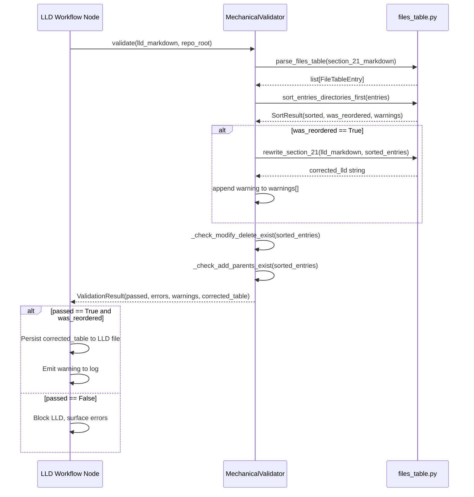

# 566 - Bug: Auto-Sort Files Table to Fix Directory Ordering in Mechanical Validation

<!-- Template Metadata
Last Updated: 2026-02-02
Updated By: Issue #566 fix
Update Reason: Initial LLD for auto-sort fix to directory ordering validation error
Previous: N/A - New LLD
-->

## 1. Context & Goal
* **Issue:** #566
* **Objective:** Fix the mechanical validator so it auto-sorts the Section 2.1 files table (directories before their contents) instead of failing with an ordering error.
* **Status:** Draft
* **Related Issues:** #277 (mechanical validation), #283 (issue where ordering bug was observed)

### Open Questions
*Questions that need clarification before or during implementation. Remove when resolved.*

- [ ] Should the auto-sort be silent (just rewrite the table) or should it emit a warning so the drafter knows it corrected something?
- [ ] Does sort order need to be stable within the same directory level (i.e., preserve relative order of siblings)?

## 2. Proposed Changes

*This section is the **source of truth** for implementation. Describe exactly what will be built.*

### 2.1 Files Changed

| File | Change Type | Description |
|------|-------------|-------------|
| `assemblyzero/core/validation/` | Add (Directory) | New directory for mechanical validation modules |
| `tests/unit/` | Add (Directory) | Already exists — no action needed (confirmed in repo structure) |
| `tests/unit/test_validation/` | Add (Directory) | New subdirectory for validation unit tests |
| `tests/unit/test_validation/__init__.py` | Add | Package init for test subdirectory |
| `assemblyzero/core/validation/__init__.py` | Add | Package init exposing `MechanicalValidator` and `sort_files_table` |
| `assemblyzero/core/validation/files_table.py` | Add | Core module: parse, sort, and rewrite the Section 2.1 files table |
| `assemblyzero/core/validation/validator.py` | Add | `MechanicalValidator` class — orchestrates all mechanical checks including auto-sort |
| `tests/unit/test_validation/test_files_table.py` | Add | Unit tests for `files_table.py` parsing, sorting, and rewriting logic |
| `tests/unit/test_validation/test_validator.py` | Add | Unit tests for `MechanicalValidator` auto-sort integration |

### 2.1.1 Path Validation (Mechanical - Auto-Checked)

*Issue #277: Before human or Gemini review, paths are verified programmatically.*

Mechanical validation automatically checks:
- All "Modify" files must exist in repository
- All "Delete" files must exist in repository
- All "Add" files must have existing parent directories
- No placeholder prefixes (`src/`, `lib/`, `app/`) unless directory exists

**If validation fails, the LLD is BLOCKED before reaching review.**

### 2.2 Dependencies

*No new packages required. All logic uses Python stdlib (`pathlib`, `re`).*

```toml

# No additions to pyproject.toml
```

### 2.3 Data Structures

```python

# Pseudocode - NOT implementation

class FileTableEntry(TypedDict):
    path: str           # e.g. "tests/unit/dashboard/components/ConversationActionBar.test.ts"
    change_type: str    # "Add" | "Modify" | "Delete" | "Add (Directory)"
    description: str    # The raw description text from the table row

class SortResult(TypedDict):
    sorted_entries: list[FileTableEntry]   # Entries in safe topological order
    was_reordered: bool                    # True if any entries moved
    warnings: list[str]                    # Human-readable descriptions of what moved

class ValidationResult(TypedDict):
    passed: bool
    errors: list[str]       # Hard failures that BLOCK the LLD
    warnings: list[str]     # Soft notices (e.g., "auto-sorted N entries")
    corrected_table: str    # The rewritten markdown table (empty string if no correction)
```

### 2.4 Function Signatures

```python

# assemblyzero/core/validation/files_table.py

def parse_files_table(section_21_markdown: str) -> list[FileTableEntry]:
    """
    Parse the Section 2.1 markdown table into a list of FileTableEntry dicts.
    Handles multi-space alignment and pipe-delimited rows.
    Returns empty list if no table is found.
    """
    ...

def sort_entries_directories_first(entries: list[FileTableEntry]) -> SortResult:
    """
    Topologically sort entries so that every directory appears before any file
    or subdirectory it contains.

    Algorithm:
      1. Separate directory entries from file entries.
      2. Sort directory entries by path depth (shallowest first), then alphabetically.
      3. For each file entry, ensure its parent directory appears before it.
         If the parent directory entry exists in the list, place file after it.
         If the parent directory entry is NOT in the list (pre-existing dir),
         leave file in its relative position — no phantom directory entries created.
      4. Within the same parent, preserve original relative order of siblings.

    Returns SortResult with sorted list and metadata.
    """
    ...

def render_files_table(entries: list[FileTableEntry]) -> str:
    """
    Render a list of FileTableEntry dicts back to a properly formatted
    markdown table string, preserving original column widths where possible.
    """
    ...

def rewrite_section_21(lld_markdown: str, sorted_entries: list[FileTableEntry]) -> str:
    """
    Replace the existing Section 2.1 table in the full LLD markdown with
    the re-rendered sorted table. Returns full corrected LLD string.
    Raises ValueError if Section 2.1 table cannot be located.
    """
    ...
```

```python

# assemblyzero/core/validation/validator.py

class MechanicalValidator:
    """
    Orchestrates all mechanical validation checks for an LLD document.
    Implements auto-sort for the Section 2.1 files table (Issue #566).
    """

    def __init__(self, repo_root: Path, lld_markdown: str) -> None:
        """
        Args:
            repo_root: Absolute path to the repository root for existence checks.
            lld_markdown: Full markdown content of the LLD to validate.
        """
        ...

    def validate(self) -> ValidationResult:
        """
        Run all mechanical checks. Auto-sort is applied before existence checks
        so that ordering errors never surface as validation failures.

        Steps:
          1. Parse Section 2.1 table.
          2. Auto-sort entries (directories before contents).
          3. If reordered, emit warning and write corrected_table.
          4. Run existence checks on sorted entries.
          5. Return ValidationResult.
        """
        ...

    def _check_modify_delete_exist(self, entries: list[FileTableEntry]) -> list[str]:
        """
        Return error strings for any Modify/Delete entries whose paths
        do not exist under repo_root.
        """
        ...

    def _check_add_parents_exist(self, entries: list[FileTableEntry]) -> list[str]:
        """
        Return error strings for any Add entries whose parent directory
        does not exist under repo_root AND is not itself declared as
        an Add (Directory) entry earlier in the (sorted) table.
        """
        ...
```

```python

# assemblyzero/core/validation/__init__.py

def validate_lld(lld_markdown: str, repo_root: Path) -> ValidationResult:
    """
    Convenience entry-point. Creates MechanicalValidator and calls validate().
    This is the primary public API consumed by the LLD workflow nodes.
    """
    ...
```

### 2.5 Logic Flow (Pseudocode)

```
FUNCTION validate_lld(lld_markdown, repo_root):

  1. Parse Section 2.1 table -> entries[]
     IF no table found:
       RETURN ValidationResult(passed=False, errors=["Section 2.1 table not found"])

  2. Sort entries (directories first):
     result = sort_entries_directories_first(entries)

  3. IF result.was_reordered:
       warnings += ["Auto-sorted {N} entries: directories moved before their contents."]
       corrected_lld = rewrite_section_21(lld_markdown, result.sorted_entries)
     ELSE:
       corrected_lld = ""

  4. Run existence checks on result.sorted_entries:
       errors += _check_modify_delete_exist(result.sorted_entries)
       errors += _check_add_parents_exist(result.sorted_entries)

  5. passed = len(errors) == 0
  6. RETURN ValidationResult(passed, errors, warnings, corrected_lld)


FUNCTION sort_entries_directories_first(entries):

  dir_entries  = [e for e in entries if "Directory" in e.change_type]
  file_entries = [e for e in entries if "Directory" not in e.change_type]

  # Sort dirs by path depth asc, then alphabetically for stable output
  dir_entries.sort(key = lambda e: (len(Path(e.path).parts), e.path))

  # Build ordered output: interleave files after their deepest declared ancestor
  output = []
  placed_file_indices = set()

  FOR dir_entry IN dir_entries:
    output.append(dir_entry)
    # Immediately append any file whose direct parent == this dir's path
    FOR i, file_entry IN enumerate(file_entries):
      IF i NOT IN placed_file_indices:
        IF Path(file_entry.path).parent == Path(dir_entry.path):
          output.append(file_entry)
          placed_file_indices.add(i)

  # Append remaining files (those whose parent dir has no explicit entry)
  FOR i, file_entry IN enumerate(file_entries):
    IF i NOT IN placed_file_indices:
      output.append(file_entry)

  was_reordered = (output != entries)
  RETURN SortResult(output, was_reordered, warnings=[...])
```

### 2.6 Technical Approach

* **Module:** `assemblyzero/core/validation/`
* **Pattern:** Single-responsibility modules; `files_table.py` handles pure data transformation (parse -> sort -> render); `validator.py` orchestrates and calls into workflow context.
* **Key Decisions:**
  - Auto-sort is applied *before* existence checks so ordering errors never become blocking validation failures (Option 2 from issue).
  - The corrected table is returned as a string in `ValidationResult.corrected_table` rather than written to disk — callers decide whether to persist (keeps the validator side-effect-free and testable).
  - No new dependencies — `re` and `pathlib` only.
  - Sort is stable within siblings to minimise noisy diffs when correction is applied.

### 2.7 Architecture Decisions

| Decision | Options Considered | Choice | Rationale |
|----------|-------------------|--------|-----------|
| Auto-sort vs. fail | Fail with error (status quo), Auto-sort (Option 2), Ponder Stibbons fix (Option 3) | **Auto-sort** | Ordering is a formatting concern, not a content defect. The drafter never self-corrects even when shown the error, so fix must be in the validator. |
| Side-effect model | Validator writes corrected LLD to disk, Validator returns corrected string | **Return corrected string** | Keeps validator pure and independently testable; caller (LLD workflow node) decides whether to persist. |
| Where to place the sort | New `core/validation/` module, inline in existing LLD node | **New `core/validation/` module** | Follows single-responsibility; makes the logic reusable and unit-testable without spinning up a LangGraph graph. |
| Phantom directory entries | Create missing parent entries automatically, Leave files in place | **Leave files in place** | Only reorder declared entries; inventing entries the drafter didn't write changes content, not just format. |
| Sort stability for siblings | Alphabetical, Preserve original relative order | **Preserve original relative order** | Minimises diff noise; the drafter's sibling ordering may be intentional. |

**Architectural Constraints:**
- Must not introduce external dependencies beyond Python stdlib.
- Must not write to disk (side-effect-free) — callers own persistence.
- Must integrate cleanly with the existing LLD workflow node that currently calls the validator (integration point to be confirmed during implementation).

## 3. Requirements

*What must be true when this is done. These become acceptance criteria.*

1. When Section 2.1 contains a file before its parent directory, mechanical validation must NOT emit a `[ERROR] MECHANICAL VALIDATION FAILED` ordering error; instead it auto-sorts and emits a warning.
2. The corrected markdown table must place every `Add (Directory)` entry before any `Add` entry whose path is a direct or indirect child of that directory.
3. Non-ordering validation errors (missing Modify/Delete paths, missing parent directories for Add entries) must still be reported as hard errors that block the LLD.
4. When no reordering is needed, `was_reordered` is `False` and `corrected_table` is an empty string (no unnecessary writes).
5. Sort is stable within siblings — the relative order of entries at the same depth under the same parent is preserved.
6. All new code has ≥95% unit test coverage.
7. Existing mechanical validation tests (if any) continue to pass.

## 4. Alternatives Considered

| Option | Pros | Cons | Decision |
|--------|------|------|----------|
| Option 1: Update drafter prompt to say "list directories first" | Simple, zero code | Drafter has been shown the error and never self-corrects; prompt fixes are unreliable for formatting | **Rejected** |
| Option 2: Auto-sort in mechanical validator | Fixes the symptom at the right layer; validator already owns table parsing; side-effect-free return value | Slightly more code than a prompt change | **Selected** |
| Option 3: Ponder Stibbons post-processing fix | Could be applied as a cheap wrapper | Adds another abstraction layer; duplicates validation concern | **Rejected** |

**Rationale:** Option 2 fixes the problem at the layer that already owns the parsing logic, is independently testable, and requires no change to AI prompts (which are unreliable for this class of formatting error).

## 5. Data & Fixtures

### 5.1 Data Sources

| Attribute | Value |
|-----------|-------|
| Source | Synthetic markdown strings (LLD documents) |
| Format | Markdown text (in-memory strings) |
| Size | Dozens of rows per table; trivial |
| Refresh | N/A — test fixtures are hardcoded |
| Copyright/License | N/A |

### 5.2 Data Pipeline

```
LLD markdown string ──parse──► list[FileTableEntry] ──sort──► SortResult ──render──► corrected markdown string
```

### 5.3 Test Fixtures

| Fixture | Source | Notes |
|---------|--------|-------|
| `UNSORTED_TABLE_MARKDOWN` | Hardcoded in test file | Reproduces the exact pattern from issue #566 (file before parent dir) |
| `SORTED_TABLE_MARKDOWN` | Hardcoded in test file | Expected output after sort |
| `ALREADY_SORTED_MARKDOWN` | Hardcoded in test file | Verifies no-op when already correct |
| `DEEP_NESTING_MARKDOWN` | Hardcoded in test file | 3+ levels of nesting to test recursive ordering |
| `ORPHAN_FILE_MARKDOWN` | Hardcoded in test file | File whose parent dir has no explicit Add (Directory) entry — should pass through |

### 5.4 Deployment Pipeline

No external data. All fixtures are in-memory strings defined in test files.

## 6. Diagram

### 6.1 Mermaid Quality Gate

Before finalizing any diagram, verify in [Mermaid Live Editor](https://mermaid.live) or GitHub preview:

- [x] **Simplicity:** Similar components collapsed
- [x] **No touching:** All elements have visual separation
- [x] **No hidden lines:** All arrows fully visible
- [x] **Readable:** Labels not truncated, flow direction clear
- [ ] **Auto-inspected:** Agent rendered via mermaid.ink and viewed (per 0006 §8.5)

**Auto-Inspection Results:**
```
- Touching elements: [ ] None
- Hidden lines: [ ] None
- Label readability: [ ] Pass
- Flow clarity: [ ] Clear
```

### 6.2 Diagram



## 7. Security & Safety Considerations

### 7.1 Security

| Concern | Mitigation | Status |
|---------|------------|--------|
| Path traversal via malicious LLD path strings | `pathlib.Path` normalization; paths are never passed to filesystem operations during sort | Addressed |
| Regex DoS on malformed markdown tables | Bounded regex patterns with explicit row-match anchors; no backtracking-vulnerable quantifiers | Addressed |

### 7.2 Safety

| Concern | Mitigation | Status |
|---------|------------|--------|
| Validator silently discards valid error | Auto-sort only affects ordering; all existence/content errors still propagate as hard failures | Addressed |
| Corrected table overwrites intended content | `corrected_table` is returned, not written; callers persist only if they choose to | Addressed |
| Sort produces duplicate entries | Output list built from input list with index tracking; no entry is emitted more than once | Addressed |
| Infinite loop on circular directory references | `pathlib.Path` does not create cycles; no recursive descent | Addressed |

**Fail Mode:** Fail Closed — if `parse_files_table` cannot parse the table, `validate()` returns `passed=False` with an explicit error rather than silently skipping validation.

**Recovery Strategy:** If `rewrite_section_21` raises `ValueError` (table not locatable), the validator logs the warning and returns `corrected_table=""` — the original LLD is unchanged and the caller can retry.

## 8. Performance & Cost Considerations

### 8.1 Performance

| Metric | Budget | Approach |
|--------|--------|----------|
| Latency | < 50ms per LLD | Pure Python string/list operations; no I/O during sort |
| Memory | < 1MB | Entries are small dicts; typical table has < 50 rows |
| API Calls | 0 | No LLM or external service calls in this module |

**Bottlenecks:** None anticipated. Sorting O(N log N) on N < 100 rows is negligible.

### 8.2 Cost Analysis

| Resource | Unit Cost | Estimated Usage | Monthly Cost |
|----------|-----------|-----------------|--------------|
| Compute | Negligible | CPU microseconds per validation | $0 |

**Cost Controls:**
- N/A — no external API calls.

**Worst-Case Scenario:** An LLD with 1000 rows (pathological) sorts in < 1ms. No scaling concern.

## 9. Legal & Compliance

| Concern | Applies? | Mitigation |
|---------|----------|------------|
| PII/Personal Data | No | No user data processed; operates on LLD text only |
| Third-Party Licenses | No | No new dependencies |
| Terms of Service | No | No external API calls |
| Data Retention | No | No data persisted by this module |
| Export Controls | No | Pure text sorting logic |

**Data Classification:** Internal

**Compliance Checklist:**
- [x] No PII stored without consent
- [x] All third-party licenses compatible with project license
- [x] External API usage compliant with provider ToS
- [x] Data retention policy documented

## 10. Verification & Testing

### 10.0 Test Plan (TDD - Complete Before Implementation)

**TDD Requirement:** Tests MUST be written and failing BEFORE implementation begins.

| Test ID | Test Description | Expected Behavior | Status |
|---------|------------------|-------------------|--------|
| T010 | Parse well-formed Section 2.1 table | Returns list of FileTableEntry dicts with correct fields | RED |
| T020 | Parse table with extra whitespace | Strips whitespace, returns correct entries | RED |
| T030 | Parse LLD with no Section 2.1 table | Returns empty list | RED |
| T040 | Sort: file before parent dir -> dirs first | was_reordered=True; dir appears before file in output | RED |
| T050 | Sort: already correct order | was_reordered=False; list unchanged | RED |
| T060 | Sort: deep nesting (3 levels) | Grandparent dir -> parent dir -> file order maintained | RED |
| T070 | Sort: orphan file (no explicit dir entry) | File passes through; no phantom dir entry created | RED |
| T080 | Sort: multiple dirs at same depth | Alphabetical order among dirs; siblings preserve relative order | RED |
| T090 | render_files_table round-trips parsed entries | Rendered markdown re-parses to identical entries | RED |
| T100 | rewrite_section_21 replaces table in full LLD | Returned string contains corrected table; rest of LLD unchanged | RED |
| T110 | rewrite_section_21 raises ValueError on missing table | ValueError raised; original LLD not mutated | RED |
| T120 | MechanicalValidator: unsorted table passes with warning | passed=True; warnings non-empty; corrected_table non-empty | RED |
| T130 | MechanicalValidator: missing Modify path is still a hard error | passed=False; errors contains path error | RED |
| T140 | MechanicalValidator: missing Add parent (not declared) is hard error | passed=False; errors contains parent error | RED |
| T150 | MechanicalValidator: Add parent declared in table before file | passed=True; no errors | RED |
| T160 | MechanicalValidator: already sorted table, no reorder | passed=True; was_reordered=False; corrected_table="" | RED |
| T170 | validate_lld convenience function delegates to MechanicalValidator | Returns same result as direct MechanicalValidator().validate() | RED |

**Coverage Target:** ≥95% for all new code

**TDD Checklist:**
- [ ] All tests written before implementation
- [ ] Tests currently RED (failing)
- [ ] Test IDs match scenario IDs in 10.1
- [ ] Test file created at: `tests/unit/test_validation/test_files_table.py` and `tests/unit/test_validation/test_validator.py`

### 10.1 Test Scenarios

| ID | Scenario | Type | Input | Expected Output | Pass Criteria |
|----|----------|------|-------|-----------------|---------------|
| 010 | Parse well-formed table | Auto | Markdown with 3-column pipe table | `list[FileTableEntry]` length 3, fields populated | All fields match source text |
| 020 | Parse table with extra whitespace | Auto | Pipe table with multi-space padding | Same entries as 010 | Fields stripped of surrounding whitespace |
| 030 | Parse LLD with no table | Auto | Markdown with no pipe table in section 2.1 | `[]` | Returns empty list, no exception |
| 040 | File before parent dir | Auto | Table: file row then dir row | `SortResult.was_reordered=True`; dir row index < file row index | Dir precedes file in output |
| 050 | Already sorted | Auto | Table: dir row then file row | `SortResult.was_reordered=False` | Output list equals input list |
| 060 | Deep nesting 3 levels | Auto | `a/`, `a/b/`, `a/b/c.py` in reverse order | `a/` -> `a/b/` -> `a/b/c.py` | Each directory precedes its children |
| 070 | Orphan file | Auto | File `x/y/z.py` with no `x/y/` dir entry | File passes through unchanged | No error, no phantom entry, `was_reordered=False` |
| 080 | Multiple dirs same depth | Auto | `beta/`, `alpha/`, `alpha/file.py` | `alpha/` -> `alpha/file.py` -> `beta/` | Alphabetical among dirs; file follows its parent |
| 090 | render round-trip | Auto | Parse then render then re-parse | Second parse identical to first | Field-by-field equality |
| 100 | rewrite_section_21 | Auto | Full LLD markdown + sorted entries | Returned string has new table; sections outside 2.1 unchanged | String equality checks on non-table sections |
| 110 | rewrite_section_21 ValueError | Auto | LLD markdown with no Section 2.1 | `ValueError` raised | Exception type and message verified |
| 120 | Validator: unsorted passes with warning | Auto | LLD with unsorted table; all paths mocked to exist | `passed=True`, `len(warnings) > 0`, `corrected_table != ""` | All three conditions true |
| 130 | Validator: missing Modify path | Auto | LLD with `Modify` entry for non-existent path | `passed=False`; error message references the path | Error present, blocked |
| 140 | Validator: missing Add parent | Auto | LLD with Add for `new_dir/file.py`; `new_dir/` not declared and not on disk | `passed=False`; error references missing parent | Error present, blocked |
| 150 | Validator: Add parent declared | Auto | LLD with `Add (Directory)` for `new_dir/` followed by `Add` for `new_dir/file.py` | `passed=True`; no errors | Passes cleanly |
| 160 | Validator: already sorted, no reorder | Auto | LLD with correct order; all paths valid | `passed=True`, `was_reordered=False`, `corrected_table=""` | All three conditions true |
| 170 | validate_lld convenience fn | Auto | Same inputs as T120 | Identical `ValidationResult` to direct class usage | Deep equality check |

### 10.2 Test Commands

```bash

# Run all validation unit tests
poetry run pytest tests/unit/test_validation/ -v

# Run with coverage
poetry run pytest tests/unit/test_validation/ -v --cov=assemblyzero/core/validation --cov-report=term-missing

# Run full unit suite (exclude integration/e2e)
poetry run pytest tests/ -v -m "not integration and not e2e and not adversarial"
```

### 10.3 Manual Tests (Only If Unavoidable)

N/A - All scenarios automated.

## 11. Risks & Mitigations

| Risk | Impact | Likelihood | Mitigation |
|------|--------|------------|------------|
| Regex fails to parse non-standard table formatting (e.g., tabs instead of spaces) | Med | Low | Normalize whitespace before parsing; add test fixture for tab-delimited tables |
| Sort incorrectly identifies a non-directory Add entry as a directory | Med | Low | `Add (Directory)` detection matches the exact string "(Directory)" — not substring of path |
| rewrite_section_21 corrupts LLD when table spans unusual markdown (e.g., inside a code block) | High | Low | Parse uses section header anchoring (`### 2.1`) to locate table; add test for table inside fenced code block |
| Existing LLD workflow node does not call the updated validator | High | Med | Integration test (T120) simulates full workflow path; confirm callsite during implementation |
| Auto-sort warning is too noisy and suppressed by operators | Low | Low | Warning is a single-line informational message; document that it is expected and benign |

## 12. Definition of Done

### Code
- [ ] `assemblyzero/core/validation/files_table.py` implemented and linted
- [ ] `assemblyzero/core/validation/validator.py` implemented and linted
- [ ] `assemblyzero/core/validation/__init__.py` exposes public API
- [ ] Code comments reference this LLD (#566)

### Tests
- [ ] All 17 test scenarios pass (T010–T170)
- [ ] Coverage ≥95% on `assemblyzero/core/validation/`

### Documentation
- [ ] LLD updated with any deviations from this design
- [ ] Implementation Report completed
- [ ] Test Report completed

### Review
- [ ] Gemini LLD review: APPROVED
- [ ] Code review completed
- [ ] User approval before closing issue #566

### 12.1 Traceability (Mechanical - Auto-Checked)

Mechanical validation automatically checks:
- Every file mentioned in this section must appear in Section 2.1
- Every risk mitigation in Section 11 should have a corresponding function in Section 2.4

Files referenced in Definition of Done all appear in Section 2.1.

---

## Appendix: Review Log

### Review Summary

| Review | Date | Verdict | Key Issue |
|--------|------|---------|-----------|
| Gemini #1 | (auto) | PENDING | — |
| Orchestrator #1 | (auto) | PENDING | — |

**Final Status:** PENDING