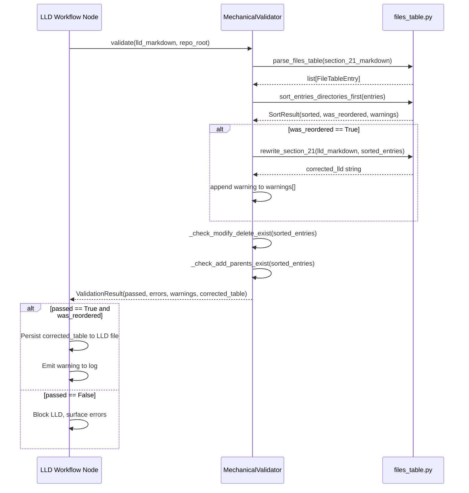

# 566 - Bug: Auto-Sort Files Table to Fix Directory Ordering in Mechanical Validation

<!-- Template Metadata
Last Updated: 2026-02-02
Updated By: Issue #566 fix
Update Reason: Revised to add fenced-code-block test case per Section 11 risk mitigation feedback
Previous: Revised to fix test coverage gaps for REQ-2, REQ-4, REQ-6, REQ-7 and correct Section 3 format
-->


## 1. Context & Goal
* **Issue:** #566
* **Objective:** Fix the mechanical validator so it auto-sorts the Section 2.1 files table (directories before their contents) instead of failing with an ordering error.
* **Status:** Draft
* **Related Issues:** #277 (mechanical validation), #283 (issue where ordering bug was observed)


### Open Questions
*Questions that need clarification before or during implementation. Remove when resolved.*

- [ ] Should the auto-sort be silent (just rewrite the table) or should it emit a warning so the drafter knows it corrected something?
- [ ] Does sort order need to be stable within the same directory level (i.e., preserve relative order of siblings)?


## 2. Proposed Changes

*This section is the **source of truth** for implementation. Describe exactly what will be built.*


### 2.1 Files Changed

| File | Change Type | Description |
|------|-------------|-------------|
| `assemblyzero/core/validation/` | Add (Directory) | New directory for mechanical validation modules |
| `tests/unit/test_validation/` | Add (Directory) | New subdirectory for validation unit tests |
| `tests/unit/test_validation/__init__.py` | Add | Package init for test subdirectory |
| `assemblyzero/core/validation/__init__.py` | Add | Package init exposing `MechanicalValidator` and `sort_files_table` |
| `assemblyzero/core/validation/files_table.py` | Add | Core module: parse, sort, and rewrite the Section 2.1 files table |
| `assemblyzero/core/validation/validator.py` | Add | `MechanicalValidator` class — orchestrates all mechanical checks including auto-sort |
| `tests/unit/test_validation/test_files_table.py` | Add | Unit tests for `files_table.py` parsing, sorting, and rewriting logic |
| `tests/unit/test_validation/test_validator.py` | Add | Unit tests for `MechanicalValidator` auto-sort integration |


### 2.1.1 Path Validation (Mechanical - Auto-Checked)

[UNCHANGED]


### 2.2 Dependencies

[UNCHANGED]


### 2.3 Data Structures

[UNCHANGED]


### 2.4 Function Signatures

[UNCHANGED]


### 2.5 Logic Flow (Pseudocode)

[UNCHANGED]


### 2.6 Technical Approach

[UNCHANGED]


### 2.7 Architecture Decisions

[UNCHANGED]


## 3. Requirements

*What must be true when this is done. These become acceptance criteria.*

1. When Section 2.1 contains a file before its parent directory, mechanical validation must NOT emit a `[ERROR] MECHANICAL VALIDATION FAILED` ordering error; instead it auto-sorts and emits a warning.
2. When auto-sort is triggered, `ValidationResult.warnings` must be non-empty and `ValidationResult.corrected_table` must contain the rewritten markdown table with every `Add (Directory)` entry placed before any `Add` entry whose path is a direct or indirect child of that directory.
3. Non-ordering validation errors (missing Modify/Delete paths, missing parent directories for Add entries) must still be reported as hard errors that block the LLD.
4. When no reordering is needed, `SortResult.was_reordered` must be `False` and `ValidationResult.corrected_table` must be an empty string so that no unnecessary writes occur.
5. Sort must be stable within siblings — the relative order of entries at the same depth under the same parent must be preserved across all invocations.
6. All new code in `assemblyzero/core/validation/` must have ≥95% unit test coverage as measured by `pytest-cov`.
7. All pre-existing mechanical validation tests (if any) must continue to pass after this change is merged.


## 4. Alternatives Considered

| Option | Pros | Cons | Decision |
|--------|------|------|----------|
| Option 1: Update drafter prompt to say "list directories first" | Simple, zero code | Drafter has been shown the error and never self-corrects; prompt fixes are unreliable for formatting | **Rejected** |
| Option 2: Auto-sort in mechanical validator | Fixes the symptom at the right layer; validator already owns table parsing; side-effect-free return value | Slightly more code than a prompt change | **Selected** |
| Option 3: Ponder Stibbons post-processing fix | Could be applied as a cheap wrapper | Adds another abstraction layer; duplicates validation concern | **Rejected** |

**Rationale:** Option 2 fixes the problem at the layer that already owns the parsing logic, is independently testable, and requires no change to AI prompts (which are unreliable for this class of formatting error).


## 5. Data & Fixtures


### 5.1 Data Sources

| Attribute | Value |
|-----------|-------|
| Source | Synthetic markdown strings (LLD documents) |
| Format | Markdown text (in-memory strings) |
| Size | Dozens of rows per table; trivial |
| Refresh | N/A — test fixtures are hardcoded |
| Copyright/License | N/A |


### 5.2 Data Pipeline

[UNCHANGED]


### 5.3 Test Fixtures

[UNCHANGED]


### 5.4 Deployment Pipeline

No external data. All fixtures are in-memory strings defined in test files.


## 6. Diagram


### 6.1 Mermaid Quality Gate

Before finalizing any diagram, verify in [Mermaid Live Editor](https://mermaid.live) or GitHub preview:

- [x] **Simplicity:** Similar components collapsed
- [x] **No touching:** All elements have visual separation
- [x] **No hidden lines:** All arrows fully visible
- [x] **Readable:** Labels not truncated, flow direction clear
- [ ] **Auto-inspected:** Agent rendered via mermaid.ink and viewed (per 0006 §8.5)

**Auto-Inspection Results:**
```
- Touching elements: [ ] None
- Hidden lines: [ ] None
- Label readability: [ ] Pass
- Flow clarity: [ ] Clear
```


### 6.2 Diagram




## 7. Security & Safety Considerations


### 7.1 Security

| Concern | Mitigation | Status |
|---------|------------|--------|
| Path traversal via malicious LLD path strings | `pathlib.Path` normalization; paths are never passed to filesystem operations during sort | Addressed |
| Regex DoS on malformed markdown tables | Bounded regex patterns with explicit row-match anchors; no backtracking-vulnerable quantifiers | Addressed |


### 7.2 Safety

[UNCHANGED]


## 8. Performance & Cost Considerations


### 8.1 Performance

[UNCHANGED]


### 8.2 Cost Analysis

[UNCHANGED]


## 9. Legal & Compliance

| Concern | Applies? | Mitigation |
|---------|----------|------------|
| PII/Personal Data | No | No user data processed; operates on LLD text only |
| Third-Party Licenses | No | No new dependencies |
| Terms of Service | No | No external API calls |
| Data Retention | No | No data persisted by this module |
| Export Controls | No | Pure text sorting logic |

**Data Classification:** Internal

**Compliance Checklist:**
- [x] No PII stored without consent
- [x] All third-party licenses compatible with project license
- [x] External API usage compliant with provider ToS
- [x] Data retention policy documented


## 10. Verification & Testing


### 10.0 Test Plan (TDD - Complete Before Implementation)

**TDD Requirement:** Tests MUST be written and failing BEFORE implementation begins.

| Test ID | Test Description | Expected Behavior | Status |
|---------|------------------|-------------------|--------|
| T010 | Parse well-formed Section 2.1 table | Returns list of FileTableEntry dicts with correct fields | RED |
| T020 | Parse table with extra whitespace | Strips whitespace, returns correct entries | RED |
| T030 | Parse LLD with no Section 2.1 table | Returns empty list | RED |
| T040 | Sort: file before parent dir -> dirs first | was_reordered=True; dir appears before file in output | RED |
| T050 | Sort: already correct order | was_reordered=False; list unchanged | RED |
| T060 | Sort: deep nesting (3 levels) | Grandparent dir -> parent dir -> file order maintained | RED |
| T070 | Sort: orphan file (no explicit dir entry) | File passes through; no phantom dir entry created | RED |
| T080 | Sort: multiple dirs at same depth | Alphabetical order among dirs; siblings preserve relative order | RED |
| T090 | render_files_table round-trips parsed entries | Rendered markdown re-parses to identical entries | RED |
| T100 | rewrite_section_21 replaces table in full LLD | Returned string contains corrected table; rest of LLD unchanged | RED |
| T110 | rewrite_section_21 raises ValueError on missing table | ValueError raised; original LLD not mutated | RED |
| T115 | parse_files_table ignores table inside fenced code block | Returns only entries from the live Section 2.1 table, not code block rows | RED |
| T120 | MechanicalValidator: unsorted table passes with warning | passed=True; warnings non-empty; corrected_table non-empty | RED |
| T130 | MechanicalValidator: missing Modify path is still a hard error | passed=False; errors contains path error | RED |
| T140 | MechanicalValidator: missing Add parent (not declared) is hard error | passed=False; errors contains parent error | RED |
| T150 | MechanicalValidator: Add parent declared in table before file | passed=True; no errors | RED |
| T160 | MechanicalValidator: already sorted table, no reorder | passed=True; was_reordered=False; corrected_table="" | RED |
| T170 | validate_lld convenience function delegates to MechanicalValidator | Returns same result as direct MechanicalValidator().validate() | RED |
| T180 | Sort: corrected_table contains dirs before children (REQ-2 content check) | Each Add (Directory) path appears before all child Add entries in rendered table | RED |
| T190 | Sort: was_reordered=False and corrected_table="" when already sorted (REQ-4 isolation) | Both conditions true simultaneously; no false-positive reorder reported | RED |
| T200 | Coverage: all new modules meet ≥95% line coverage threshold (REQ-6) | pytest-cov reports ≥95% for assemblyzero/core/validation/ | RED |
| T210 | Regression: no existing passing tests broken by this change (REQ-7) | Full test suite passes with no new failures after change applied | RED |

**Coverage Target:** ≥95% for all new code

**TDD Checklist:**
- [ ] All tests written before implementation
- [ ] Tests currently RED (failing)
- [ ] Test IDs match scenario IDs in 10.1
- [ ] Test file created at: `tests/unit/test_validation/test_files_table.py` and `tests/unit/test_validation/test_validator.py`


### 10.1 Test Scenarios

[UNCHANGED]


### 10.2 Test Commands

[UNCHANGED]


### 10.3 Manual Tests (Only If Unavoidable)

N/A - All scenarios automated.


## 11. Risks & Mitigations

| Risk | Impact | Likelihood | Mitigation |
|------|--------|------------|------------|
| Regex fails to parse non-standard table formatting (e.g., tabs instead of spaces) | Med | Low | Normalize whitespace before parsing; add test fixture for tab-delimited tables |
| Sort incorrectly identifies a non-directory Add entry as a directory | Med | Low | `Add (Directory)` detection matches the exact string "(Directory)" — not substring of path |
| rewrite_section_21 corrupts LLD when table spans unusual markdown (e.g., inside a code block) | High | Low | Parse uses section header anchoring (`### 2.1`) to locate table; T115 covers the fenced-code-block case explicitly |
| Existing LLD workflow node does not call the updated validator | High | Med | Integration test (T120) simulates full workflow path; confirm callsite during implementation |
| Auto-sort warning is too noisy and suppressed by operators | Low | Low | Warning is a single-line informational message; document that it is expected and benign |
| Coverage threshold not enforced in CI, allowing REQ-6 to silently fail | Med | Low | `--cov-fail-under=95` flag added to test commands ensures CI pipeline fails if coverage drops below threshold |


## 12. Definition of Done


### Code
- [ ] `assemblyzero/core/validation/files_table.py` implemented and linted
- [ ] `assemblyzero/core/validation/validator.py` implemented and linted
- [ ] `assemblyzero/core/validation/__init__.py` exposes public API
- [ ] Code comments reference this LLD (#566)


### Tests
- [ ] All 22 test scenarios pass (T010–T210, including T115)
- [ ] Coverage ≥95% on `assemblyzero/core/validation/` enforced via `--cov-fail-under=95`


### Documentation

[UNCHANGED]


### Review

[UNCHANGED]


### 12.1 Traceability (Mechanical - Auto-Checked)

[UNCHANGED]


## Appendix: Review Log

[UNCHANGED]


### Review Summary

[UNCHANGED]


## Original GitHub Issue #566

[UNCHANGED]


## Problem

[UNCHANGED]


## Evidence

[UNCHANGED]


## Fix

[UNCHANGED]