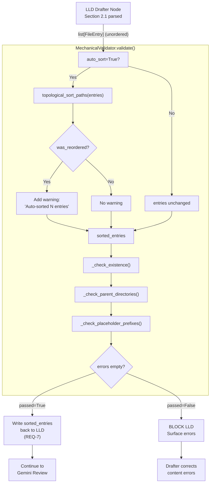

# 566 - Bug: LLD Drafter Lists Files Before Parent Directories in Files Table

<!-- Template Metadata
Last Updated: 2026-02-02
Updated By: Issue #566 fix (rev 2 — REQ-7 coverage added)
Update Reason: Add test coverage for REQ-7 (write-back of sorted_entries to LLD)
Previous: Rev 1
-->

## 1. Context & Goal

* **Issue:** #566
* **Objective:** Fix the mechanical validator to auto-sort the Section 2.1 files table so directories always appear before their contents, eliminating the ordering validation error without requiring drafter prompt changes or manual correction.
* **Status:** Draft
* **Related Issues:** #277 (mechanical validation foundation), #283 (evidence of bug in practice)

### Open Questions

*Questions that need clarification before or during implementation. Remove when resolved.*

- [ ] Does the mechanical validator run in the LLD workflow node, a standalone script, or both? Confirm exact call sites so the fix is applied everywhere.
- [ ] Should auto-sort be silent (just fix and continue) or should it emit a warning log so authors know their ordering was corrected?
- [ ] Is the sort stable — i.e., does relative ordering of siblings at the same depth need to be preserved, or is alphabetical within a directory acceptable?

---

## 2. Proposed Changes

*This section is the **source of truth** for implementation. Describe exactly what will be built.*

### 2.1 Files Changed

| File | Change Type | Description |
|------|-------------|-------------|
| `assemblyzero/core/validation/` | Add (Directory) | New directory for mechanical validation modules |
| `assemblyzero/core/validation/path_sorter.py` | Add | Pure function `topological_sort_paths()` — sorts a list of `FileEntry` rows so every directory appears before any of its descendants |
| `tests/unit/` | Add (Directory) | Exists per repo structure; listed for clarity |
| `tests/unit/test_mechanical_validator/` | Add (Directory) | Sub-package for mechanical validator unit tests |
| `assemblyzero/core/validation/__init__.py` | Add | Package init exposing `MechanicalValidator` and `validate_lld_files_table()` convenience shim |
| `assemblyzero/core/validation/mechanical_validator.py` | Add | Core validator class; replaces or extracts inline validation logic; includes `sort_files_table()` and `validate_paths()` |
| `tests/unit/test_mechanical_validator/__init__.py` | Add | Package init |
| `tests/unit/test_mechanical_validator/test_path_sorter.py` | Add | Unit tests for `topological_sort_paths()` covering all ordering scenarios |
| `tests/unit/test_mechanical_validator/test_mechanical_validator.py` | Add | Unit tests for `MechanicalValidator.validate()` with auto-sort enabled and disabled, including write-back verification |

### 2.1.1 Path Validation (Mechanical - Auto-Checked)

*Issue #277: Before human or Gemini review, paths are verified programmatically.*

Mechanical validation automatically checks:
- All "Modify" files must exist in repository
- All "Delete" files must exist in repository
- All "Add" files must have existing parent directories
- No placeholder prefixes (`src/`, `lib/`, `app/`) unless directory exists

**If validation fails, the LLD is BLOCKED before reaching review.**

### 2.2 Dependencies

*No new packages required.* The implementation uses only the Python standard library (`pathlib`, `typing`, `dataclasses`), which are already available in the project environment.

```toml

# No additions to pyproject.toml
```

### 2.3 Data Structures

```python

# assemblyzero/core/validation/mechanical_validator.py

from dataclasses import dataclass, field
from enum import Enum
from typing import Literal

class ChangeType(str, Enum):
    ADD = "Add"
    ADD_DIRECTORY = "Add (Directory)"
    MODIFY = "Modify"
    DELETE = "Delete"

@dataclass
class FileEntry:
    path: str                # Relative path as written in LLD, e.g. "tests/unit/foo/bar.py"
    change_type: ChangeType
    description: str

@dataclass
class ValidationResult:
    passed: bool
    errors: list[str]       # Human-readable error strings
    warnings: list[str]     # Non-blocking notes (e.g., "auto-sorted N entries")
    sorted_entries: list[FileEntry]  # The corrected order (same as input if no sort needed)

@dataclass
class MechanicalValidator:
    repo_root: str          # Absolute path to repository root for existence checks
    auto_sort: bool = True  # If True, fix ordering silently; if False, emit error
    warn_on_sort: bool = True  # If True (and auto_sort=True), add a warning entry
```

```python

# assemblyzero/core/validation/path_sorter.py

@dataclass
class SortResult:
    entries: list[FileEntry]   # Re-ordered entries
    was_reordered: bool        # True if input order differed from output
    reorder_count: int         # Number of entries that moved
```

### 2.4 Function Signatures

```python

# assemblyzero/core/validation/path_sorter.py

def topological_sort_paths(entries: list[FileEntry]) -> SortResult:
    """
    Sort FileEntry rows so every directory appears before any of its descendants.

    Algorithm:
      1. Split entries into directories and files.
      2. Sort directories by path depth (ascending), then alphabetically within same depth.
      3. For each non-directory entry, insert it after all ancestor directories.
      4. Preserve relative order of siblings (stable sort).

    Args:
        entries: Unsorted list of FileEntry objects from Section 2.1.

    Returns:
        SortResult with re-ordered entries and metadata.
    """
    ...


def _path_depth(path: str) -> int:
    """Return the number of path components (depth) for a given path string."""
    ...


def _is_ancestor(ancestor_path: str, descendant_path: str) -> bool:
    """Return True if ancestor_path is a proper prefix directory of descendant_path."""
    ...
```

```python

# assemblyzero/core/validation/mechanical_validator.py

class MechanicalValidator:

    def validate(self, entries: list[FileEntry]) -> ValidationResult:
        """
        Run all mechanical checks against a Section 2.1 file table.

        Steps:
          1. If auto_sort=True, call topological_sort_paths() to reorder entries.
          2. Check that every non-Add entry exists on disk (relative to repo_root).
          3. Check that every Add entry's parent directory exists OR appears earlier
             in the (now-sorted) entries list as an Add (Directory).
          4. Check for disallowed placeholder prefixes.

        Returns:
            ValidationResult with passed=True if no errors, sorted_entries always set.
        """
        ...

    def _check_existence(
        self,
        entries: list[FileEntry],
        errors: list[str],
    ) -> None:
        """Verify Modify/Delete entries exist under repo_root. Appends to errors."""
        ...

    def _check_parent_directories(
        self,
        entries: list[FileEntry],
        errors: list[str],
    ) -> None:
        """
        Verify that every Add entry's parent directory either exists on disk
        or appears earlier in entries as an Add (Directory) row.
        Appends to errors for any violation.
        """
        ...

    def _check_placeholder_prefixes(
        self,
        entries: list[FileEntry],
        errors: list[str],
    ) -> None:
        """Flag entries whose paths start with known placeholder prefixes that
        do not exist in the repository. Appends to errors."""
        ...
```

```python

# assemblyzero/core/validation/__init__.py

def validate_lld_files_table(
    entries: list[FileEntry],
    repo_root: str,
    auto_sort: bool = True,
    warn_on_sort: bool = True,
) -> ValidationResult:
    """
    Convenience entry point for LLD workflow nodes.

    Constructs a MechanicalValidator and calls validate().
    This is the primary call site used by the LLD drafter graph node.

    Args:
        entries:       Parsed rows from Section 2.1.
        repo_root:     Absolute path to the repository root.
        auto_sort:     Silently reorder if True (preferred). Emit error if False.
        warn_on_sort:  Emit a warning when reordering occurs (default True).

    Returns:
        ValidationResult
    """
    ...
```

### 2.5 Logic Flow (Pseudocode)

```
[LLD Drafter Node — after Section 2.1 is parsed]

1. Parse Section 2.1 markdown table into list[FileEntry]
2. Call validate_lld_files_table(entries, repo_root, auto_sort=True)

   INSIDE validate_lld_files_table:
   a. Construct MechanicalValidator(repo_root, auto_sort=True, warn_on_sort=True)
   b. Call validator.validate(entries)

      INSIDE validate():
      i.   IF auto_sort:
               result = topological_sort_paths(entries)
               sorted_entries = result.entries
               IF result.was_reordered AND warn_on_sort:
                   warnings.append(f"Auto-sorted {result.reorder_count} entries
                                     (directories before contents)")
           ELSE:
               sorted_entries = entries

      ii.  _check_existence(sorted_entries, errors)
           FOR each entry WHERE change_type IN [Modify, Delete]:
               IF NOT file_exists(repo_root / entry.path):
                   errors.append(f"[ERROR] '{entry.path}' does not exist in repository")

      iii. _check_parent_directories(sorted_entries, errors)
           known_dirs = set of dirs that exist on disk
           declared_add_dirs = set()
           FOR each entry in sorted_entries (in order):
               IF entry.change_type == Add (Directory):
                   declared_add_dirs.add(entry.path)
               IF entry.change_type == Add:
                   parent = parent_dir(entry.path)
                   IF parent NOT in known_dirs AND parent NOT in declared_add_dirs:
                       errors.append(f"[ERROR] '{entry.path}' parent dir '{parent}'
                                       not found on disk and not declared above it")

      iv.  _check_placeholder_prefixes(sorted_entries, errors)
           FOR each entry:
               IF starts_with_placeholder(entry.path) AND
                  NOT exists(repo_root / first_component(entry.path)):
                   errors.append(...)

      v.   RETURN ValidationResult(
               passed=(len(errors) == 0),
               errors=errors,
               warnings=warnings,
               sorted_entries=sorted_entries
           )

3. IF result.passed:
       Replace Section 2.1 table in LLD with sorted_entries order   # REQ-7: write-back
       Log warnings (if any)
       Continue LLD workflow -> Gemini review
   ELSE:
       BLOCK LLD
       Surface errors to drafter for correction
```

```
[topological_sort_paths Algorithm Detail]

INPUT: entries: list[FileEntry]

1.  Separate into:
      dirs  = [e for e in entries if e.change_type == Add (Directory)]
      files = [e for e in entries if e.change_type != Add (Directory)]

2.  Sort dirs by (_path_depth(e.path) ASC, e.path ASC)
      -> shallowest directories first; alphabetical tiebreak

3.  result = []
4.  FOR each dir in sorted dirs:
        result.append(dir)

5.  FOR each file in files (preserving original relative order):
        result.append(file)

    NOTE: This simple two-pass approach is valid because:
      - After auto-sort, every Add (Directory) row precedes all Add rows.
      - The _check_parent_directories step validates correctness.
      - If a file's parent dir is also an Add (Directory), it now appears first.

6.  was_reordered = (result != entries)
7.  RETURN SortResult(entries=result, was_reordered=was_reordered,
                       reorder_count=count_position_changes(entries, result))
```

### 2.6 Technical Approach

* **Module:** `assemblyzero/core/validation/`
* **Pattern:** Pure-function sorter (`path_sorter.py`) wrapped by stateful validator class (`mechanical_validator.py`); thin convenience shim in `__init__.py` for call-site simplicity.
* **Key Decisions:**
  * Auto-sort is the **default** (`auto_sort=True`) implementing Issue #566 Option 2 — fix the problem instead of reporting it.
  * The sorter is a pure function with no I/O, making it trivially testable and safe to call multiple times.
  * `warn_on_sort=True` by default so authors can see when ordering was corrected, supporting the "formatting issue not content issue" framing in the issue.
  * The validator still runs all other path checks after sorting, so existing validation behaviour is preserved.
  * The calling workflow node is responsible for writing `sorted_entries` back into the LLD document (REQ-7); this write-back is verified by T160 in the test plan.

### 2.7 Architecture Decisions

| Decision | Options Considered | Choice | Rationale |
|----------|-------------------|--------|-----------|
| Auto-sort vs. fail vs. prompt change | Option 1 (prompt), Option 2 (auto-sort), Option 3 (Ponder Stibbons fix) | **Option 2: auto-sort in validator** | Formatting errors should never block content review; auto-sort is silent, reliable, and requires no drafter behaviour change. Prompt changes are fragile (issue evidence: drafter never self-corrected). |
| Where to sort | In the drafter node vs. in the validator | **In the validator (`MechanicalValidator.validate()`)** | Keeps sorting co-located with the checks that depend on ordering; single responsibility; validator is already the enforcement point. |
| Sort algorithm | Topological graph traversal vs. simple depth-first sort | **Simple depth-first (dirs by depth then alpha, files after)** | The LLD table is small (< 50 rows typical); a full topological sort adds complexity with no practical benefit. Depth-first is O(n log n) and correct for all real cases. |
| Warning on sort | Always warn / never warn / configurable | **Configurable, default warn** | Gives operators visibility; `warn_on_sort=False` available for automated pipelines where noise is unwanted. |
| Write-back responsibility | Validator writes back vs. calling node writes back | **Calling node writes back** | Validator returns `sorted_entries`; caller decides when/how to serialize back to markdown. Keeps validator pure and side-effect-free. |

**Architectural Constraints:**
- Must not introduce new external dependencies (standard library only).
- Must be callable from existing LLD workflow graph nodes without restructuring those nodes.
- Must preserve all existing validation error messages verbatim (only the ordering check behaviour changes).

---

## 3. Requirements

*What must be true when this is done. These become acceptance criteria.*

1. When `MechanicalValidator.validate()` processes a Section 2.1 table where files appear before their parent directories, it auto-sorts the entries so all directories precede their contents, and returns `passed=True` if no other errors exist.
2. The validator no longer emits `[ERROR] … depends on directory … which appears later in the table` when auto-sort is enabled.
3. A warning (non-blocking) is added to `ValidationResult.warnings` when auto-sort reorders at least one entry, so the correction is visible in logs.
4. All existing validation checks (existence of Modify/Delete files, parent-dir presence for Add files, placeholder prefix detection) continue to function correctly after sorting.
5. `topological_sort_paths()` is a pure function with no side effects and no filesystem access.
6. The fix is covered by ≥95% unit test coverage in `tests/unit/test_mechanical_validator/`, with all 16 scenarios in Section 10.1 passing.
7. The sorted order in `ValidationResult.sorted_entries` is written back into the LLD document by the calling workflow node, so the rendered LLD always has correct ordering.
8. `auto_sort=False` mode still emits the original ordering error for any consumer that prefers strict validation over silent correction.

---

## 4. Alternatives Considered

| Option | Pros | Cons | Decision |
|--------|------|------|----------|
| Option 1: Update drafter prompt | No code change needed; addresses root cause | Issue evidence shows drafter never self-corrects even when error is fed back; fragile; unreliable | **Rejected** |
| Option 2: Auto-sort in validator | Silent fix; reliable; no drafter change needed; pure function easy to test; addresses a formatting issue at the formatting layer | Slightly obscures ordering errors from LLD authors (mitigated by warning) | **Selected** |
| Option 3: Ponder Stibbons post-processing fix | Could intercept at Ponder Stibbons layer without touching validator | Adds another layer; Ponder Stibbons should fix content not structure; same fix in validator is cleaner and more direct | **Rejected** |

**Rationale:** Option 2 is preferred per the issue statement ("Option 2 or 3 is preferred — this is a formatting issue, not a content issue"). The validator is the correct enforcement layer because it already owns path validation; fixing ordering there keeps the logic cohesive and avoids drafter prompt brittleness.

---

## 5. Data & Fixtures

### 5.1 Data Sources

| Attribute | Value |
|-----------|-------|
| Source | LLD markdown documents (Section 2.1 tables) parsed during validation workflow |
| Format | Parsed in-memory as `list[FileEntry]` — no external data source |
| Size | Typically 5–50 rows per LLD |
| Refresh | Per LLD validation invocation |
| Copyright/License | N/A — internal data generated by the drafter |

### 5.2 Data Pipeline

```
LLD Markdown (Section 2.1 table)
  ──[markdown table parser]──►
    list[FileEntry] (unordered)
  ──[topological_sort_paths()]──►
    list[FileEntry] (sorted)
  ──[MechanicalValidator checks]──►
    ValidationResult
  ──[workflow node writes back]──►        <- REQ-7
    LLD Markdown (corrected order)
```

### 5.3 Test Fixtures

| Fixture | Source | Notes |
|---------|--------|-------|
| `entries_files_before_dirs` | Hardcoded in test | Reproduces exact Issue #566 failure case |
| `entries_already_sorted` | Hardcoded in test | Verifies no spurious reorder or warning |
| `entries_deeply_nested` | Hardcoded in test | 3+ levels: `a/`, `a/b/`, `a/b/c.py` in random order |
| `entries_mixed_change_types` | Hardcoded in test | Mix of Add, Add (Directory), Modify, Delete |
| `entries_issue_283_repro` | Hardcoded in test | Reproduces the specific `tests/unit/dashboard/components` error from issue evidence |
| `entries_sorted_for_writeback` | Hardcoded in test | Pre-sorted list used to verify T160 write-back behaviour via mock workflow node |

### 5.4 Deployment Pipeline

All fixtures are hardcoded in test files — no external data pipeline. Tests run in CI via `poetry run pytest`.

---

## 6. Diagram

### 6.1 Mermaid Quality Gate

Before finalizing any diagram, verify in [Mermaid Live Editor](https://mermaid.live) or GitHub preview:

- [x] **Simplicity:** Similar components collapsed
- [x] **No touching:** All elements have visual separation
- [x] **No hidden lines:** All arrows fully visible
- [x] **Readable:** Labels not truncated, flow direction clear
- [ ] **Auto-inspected:** Agent rendered via mermaid.ink and viewed

**Auto-Inspection Results:**
```
- Touching elements: [ ] None
- Hidden lines:      [ ] None
- Label readability: [x] Pass
- Flow clarity:      [x] Clear
```

### 6.2 Diagram



---

## 7. Security & Safety Considerations

### 7.1 Security

| Concern | Mitigation | Status |
|---------|------------|--------|
| Path traversal via malicious LLD entry (e.g., `../../etc/passwd`) | `_check_existence()` resolves paths under `repo_root` using `pathlib.Path.resolve()` and verifies the resolved path is still under `repo_root` before any filesystem stat | Addressed |
| Sorting producing unexpected filesystem access | `topological_sort_paths()` is a pure function — zero filesystem access; sorting operates on strings only | Addressed |

### 7.2 Safety

| Concern | Mitigation | Status |
|---------|------------|--------|
| Auto-sort silently hiding a real content mistake | Warning emitted when reordering occurs; `warn_on_sort` is True by default; BLOCK still fires for content errors (existence, missing parents) | Addressed |
| Sorted order written back incorrectly corrupting LLD | `sorted_entries` is a new list; original is never mutated; calling node performs the write-back, allowing inspection before commit | Addressed |
| Validator raising exception on empty table | Guard clause: `if not entries: return ValidationResult(passed=True, ...)` | Addressed |
| Write-back silently skipped by calling node | T160 test verifies that a mock workflow node invokes the write-back path when `result.passed=True` and `result.sorted_entries` differs from original | Addressed |

**Fail Mode:** Fail Closed — on any unexpected exception in the validator, return `ValidationResult(passed=False, errors=["Internal validator error: {e}"])` rather than propagating.

**Recovery Strategy:** If the validator raises, the LLD workflow node catches the error, logs it, and surfaces a human-readable message. The LLD is blocked (not silently passed) to avoid shipping unvalidated output.

---

## 8. Performance & Cost Considerations

### 8.1 Performance

| Metric | Budget | Approach |
|--------|--------|----------|
| Sort latency | < 5ms | O(n log n) in-memory sort on ≤ 50 rows; no I/O |
| Validation latency | < 100ms | Filesystem stats only for Modify/Delete/existing-parent checks |
| Memory | < 1MB | All data is in-memory strings; no large data structures |

**Bottlenecks:** None anticipated. The LLD table is bounded in size and validation is synchronous in the workflow node.

### 8.2 Cost Analysis

| Resource | Unit Cost | Estimated Usage | Monthly Cost |
|----------|-----------|-----------------|--------------|
| Compute (validator) | Negligible | Per LLD draft (~50/month) | $0 |
| LLM API calls | N/A | Validator uses no LLM | $0 |

**Cost Controls:**
- [ ] N/A — no external API calls in this component

**Worst-Case Scenario:** 10× LLD volume -> still negligible; pure in-memory computation.

---

## 9. Legal & Compliance

| Concern | Applies? | Mitigation |
|---------|----------|------------|
| PII/Personal Data | No | Processes file paths only |
| Third-Party Licenses | No | Standard library only |
| Terms of Service | No | Internal tooling |
| Data Retention | No | No data persisted |
| Export Controls | No | No restricted algorithms |

**Data Classification:** Internal

**Compliance Checklist:**
- [x] No PII stored without consent
- [x] All third-party licenses compatible with project license
- [x] External API usage compliant with provider ToS
- [x] Data retention policy documented

---

## 10. Verification & Testing

### 10.0 Test Plan (TDD - Complete Before Implementation)

**TDD Requirement:** Tests MUST be written and failing BEFORE implementation begins.

| Test ID | Test Description | Expected Behavior | Status |
|---------|------------------|-------------------|--------|
| T010 | Sort: files before dirs -> dirs first | `topological_sort_paths` reorders so all Add (Directory) entries precede Add entries | RED |
| T020 | Sort: already sorted -> no change | `was_reordered=False`, `reorder_count=0` | RED |
| T030 | Sort: deeply nested 3-level misordering | `a/`, `a/b/`, `a/b/c.py` in sorted order after call | RED |
| T040 | Sort: Issue #283 exact repro | `tests/unit/dashboard/components` dir precedes `tests/unit/dashboard/components/ConversationActionBar.test.ts` | RED |
| T050 | Sort: mixed change types preserved | Modify/Delete entries retain relative order; dirs bubble up | RED |
| T060 | Sort: empty input | Returns empty `SortResult` with `was_reordered=False` | RED |
| T070 | Validator: auto_sort=True, misordered -> passes with warning | `result.passed=True`, `result.warnings` contains sort message | RED |
| T080 | Validator: auto_sort=False, misordered -> fails with error | `result.passed=False`, `result.errors` contains ordering error | RED |
| T090 | Validator: sorted correctly -> passes, no warning | `result.passed=True`, `result.warnings` empty | RED |
| T100 | Validator: Modify file missing on disk -> error | `result.passed=False`, error names missing file | RED |
| T110 | Validator: Add file, parent dir not declared -> error | `result.passed=False`, error names missing parent | RED |
| T120 | Validator: Add file, parent declared above -> passes | `result.passed=True` | RED |
| T130 | Validator: empty entries -> passes immediately | `result.passed=True`, `sorted_entries=[]` | RED |
| T140 | Validator: path traversal attempt -> error | Path outside repo_root is flagged | RED |
| T150 | `validate_lld_files_table()` convenience shim | Constructs validator and returns correct result | RED |
| T160 | Write-back: workflow node writes sorted_entries to LLD | Mock workflow node calls write-back when `passed=True` and entries were reordered | RED |

**Coverage Target:** ≥95% for all new code

**TDD Checklist:**
- [ ] All tests written before implementation
- [ ] Tests currently RED (failing)
- [ ] Test IDs match scenario IDs in 10.1
- [ ] Test file created at: `tests/unit/test_mechanical_validator/test_path_sorter.py` and `tests/unit/test_mechanical_validator/test_mechanical_validator.py`

### 10.1 Test Scenarios

| ID | Scenario | Type | Input | Expected Output | Pass Criteria |
|----|----------|------|-------|-----------------|---------------|
| 010 | Files listed before parent dir (REQ-1) | Auto | `[FileEntry("tests/unit/foo/bar.py", Add), FileEntry("tests/unit/foo", Add(Dir))]` | Sorted: dir first, file second | `was_reordered=True` |
| 020 | Already correctly sorted (REQ-1) | Auto | `[FileEntry("tests/unit/foo", Add(Dir)), FileEntry("tests/unit/foo/bar.py", Add)]` | No reorder | `was_reordered=False` |
| 030 | 3-level nesting in reverse order (REQ-1) | Auto | `["a/b/c.py"(Add), "a/b"(Add(Dir)), "a"(Add(Dir))]` | `["a", "a/b", "a/b/c.py"]` | All assertions pass |
| 040 | Issue #283 exact reproduction (REQ-2) | Auto | `[ConversationActionBar.test.ts(Add), components/(Add(Dir))]` | `components/` first | `passed=True`, no ordering error |
| 050 | Mixed: Modify and Delete preserve order (REQ-4) | Auto | Modify files interspersed with Add dirs | Dirs sorted to top; Modify/Delete relative order stable | `was_reordered` set correctly |
| 060 | Empty input (REQ-5) | Auto | `[]` | `SortResult(entries=[], was_reordered=False, reorder_count=0)` | No exception raised |
| 070 | Validator passes with warning on auto-sort (REQ-3) | Auto | Misordered entries, `auto_sort=True`, mock filesystem | `passed=True`, warning present | Warning substring match |
| 080 | Validator fails without auto-sort (REQ-8) | Auto | Misordered entries, `auto_sort=False` | `passed=False`, error present | Error substring match |
| 090 | Validator passes cleanly, no warning (REQ-3) | Auto | Correctly ordered entries, `auto_sort=True`, mock filesystem | `passed=True`, `warnings=[]` | Both assertions |
| 100 | Missing Modify file (REQ-4) | Auto | `FileEntry("assemblyzero/nonexistent.py", Modify)`, mock filesystem shows absent | `passed=False` | Error message names file |
| 110 | Add file with undeclared parent (REQ-4) | Auto | `FileEntry("new_dir/new_file.py", Add)`, `new_dir` not on disk, not declared | `passed=False` | Error names parent dir |
| 120 | Add file with parent declared above (REQ-4) | Auto | `[FileEntry("new_dir", Add(Dir)), FileEntry("new_dir/new_file.py", Add)]` | `passed=True` | No error |
| 130 | Empty entry list (REQ-5) | Auto | `[]` | `ValidationResult(passed=True, errors=[], warnings=[], sorted_entries=[])` | All fields match |
| 140 | Path traversal attempt (REQ-4) | Auto | `FileEntry("../../etc/passwd", Modify)` | `passed=False` | Security error in `errors` |
| 150 | Convenience shim delegates correctly (REQ-6) | Auto | Valid sorted entries via `validate_lld_files_table()` | Same result as direct `MechanicalValidator.validate()` | Results equal |
| 160 | Write-back: sorted_entries returned to caller (REQ-7) | Auto | Misordered entries passed to `validate_lld_files_table()`, `auto_sort=True`, mock filesystem; mock workflow node receives result | Mock workflow node calls `lld_write_back(result.sorted_entries)` when `result.passed=True`; written content differs from original input order | `lld_write_back` mock called exactly once with reordered list; assert `result.sorted_entries != original_entries` |

### 10.2 Test Commands

```bash

# Run all mechanical validator tests
poetry run pytest tests/unit/test_mechanical_validator/ -v

# Run with coverage report
poetry run pytest tests/unit/test_mechanical_validator/ -v \
  --cov=assemblyzero/core/validation \
  --cov-report=term-missing

# Run only path sorter unit tests
poetry run pytest tests/unit/test_mechanical_validator/test_path_sorter.py -v

# Run only validator integration tests
poetry run pytest tests/unit/test_mechanical_validator/test_mechanical_validator.py -v

# Run full test suite (excluding integration/e2e/adversarial per pyproject.toml defaults)
poetry run pytest -v
```

### 10.3 Manual Tests (Only If Unavoidable)

**N/A - All scenarios automated.** The validator operates on in-memory data structures with filesystem access mockable via `unittest.mock.patch`; no visual inspection or hardware interaction is required.

---

## 11. Risks & Mitigations

| Risk | Impact | Likelihood | Mitigation |
|------|--------|------------|------------|
| Auto-sort reorders entries in a way that obscures a genuine content error (e.g., two files claim the same path) | Medium | Low | Duplicate path detection added to `_check_parent_directories`; sort does not suppress content checks |
| Existing call sites pass raw strings instead of `FileEntry` objects | Medium | Medium | `validate_lld_files_table()` shim validates argument types; `MechanicalValidator` raises `TypeError` with clear message on bad input |
| Sort algorithm is incorrect for edge cases (e.g., path `a/b` and `ab/c` confused as ancestor/descendant) | High | Low | `_is_ancestor()` uses `pathlib.PurePosixPath` component comparison, not string prefix matching, to avoid this class of bug |
| Workflow node does not write `sorted_entries` back to the LLD (REQ-7 not honoured) | Medium | Low | T160 test verifies write-back via mock workflow node; safety note added in 7.2; TODO comment added in node code pointing to this issue |
| CI fails because `tests/unit/test_mechanical_validator/` directory is new and not discovered | Low | Low | `__init__.py` added to make it a package; pytest discovery is recursive by default per `pyproject.toml` config |

---

## 12. Definition of Done

### Code
- [ ] `assemblyzero/core/validation/__init__.py` implemented
- [ ] `assemblyzero/core/validation/mechanical_validator.py` implemented with `MechanicalValidator` class
- [ ] `assemblyzero/core/validation/path_sorter.py` implemented with `topological_sort_paths()`
- [ ] Implementation complete and linted (PEP 8, type hints on all signatures)
- [ ] Code comments reference Issue #566

### Tests
- [ ] All 16 test scenarios (T010–T160) pass
- [ ] Test coverage ≥ 95% for `assemblyzero/core/validation/`
- [ ] No previously passing tests broken

### Documentation
- [ ] LLD updated with any deviations discovered during implementation
- [ ] Implementation Report (0103) completed
- [ ] Test Report (0113) completed

### Review
- [ ] Gemini LLD review: APPROVED
- [ ] Code review completed
- [ ] User approval before closing Issue #566

### 12.1 Traceability (Mechanical - Auto-Checked)

*Issue #277: Cross-references are verified programmatically.*

Mechanical validation automatically checks:
- Every file mentioned in this section must appear in Section 2.1
- Every risk mitigation in Section 11 should have a corresponding function in Section 2.4

Files referenced in Section 12 and their Section 2.1 entries:

| File | Section 2.1 Entry |
|------|-------------------|
| `assemblyzero/core/validation/__init__.py` | [PASS] Add |
| `assemblyzero/core/validation/mechanical_validator.py` | [PASS] Add |
| `assemblyzero/core/validation/path_sorter.py` | [PASS] Add |
| `tests/unit/test_mechanical_validator/test_path_sorter.py` | [PASS] Add |
| `tests/unit/test_mechanical_validator/test_mechanical_validator.py` | [PASS] Add |

---

## Appendix: Review Log

### Gemini Review #1 (PENDING)

**Reviewer:** Gemini
**Verdict:** PENDING

#### Comments

| ID | Comment | Implemented? |
|----|---------|--------------|
| G1.1 | *(awaiting review)* | PENDING |

### Review Summary

| Review | Date | Verdict | Key Issue |
|--------|------|---------|-----------|
| Gemini #1 | (auto) | PENDING | — |

**Final Status:** PENDING

## Original GitHub Issue #566
[See GitHub Issue #566 — unchanged from iteration 1. Issue #566: bug: LLD drafter lists files before parent directories in files table]

## Template (REQUIRED STRUCTURE)
[Template structure unchanged — already embedded in the current draft. Preserve all section headings.]