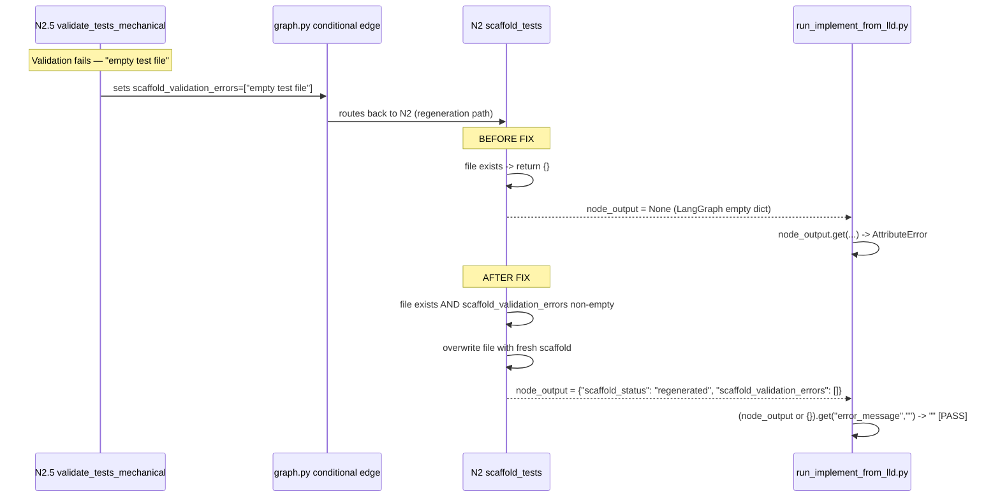

# 571 - Fix: run_implement_from_lld Crashes on None node_output During Scaffold Regeneration Loop

<!-- Template Metadata
Last Updated: 2026-02-02
Updated By: Issue #571 fix
Update Reason: Revised to fix REQ-5 and REQ-6 test coverage gaps identified by mechanical validation
Previous: Initial LLD for crash fix and dead loop repair in TDD scaffold regeneration
-->

## 1. Context & Goal

* **Issue:** #571
* **Objective:** Fix `AttributeError: 'NoneType' object has no attribute 'get'` crash at `run_implement_from_lld.py:776` and repair the dead regeneration loop caused by the scaffold node's skip-on-resume guard triggering incorrectly during validation-failure reruns.
* **Status:** In Progress
* **Related Issues:** Hermes issue #283 (observed reproduction context)

### Open Questions

*Questions that need clarification before or during implementation. Remove when resolved.*

- [x] Can `scaffold_validation_errors` be treated as the canonical signal to distinguish regeneration from resume, or are there other state keys that also need checking? — **Resolved:** `scaffold_validation_errors` is set by `validate_tests_mechanical.py` before routing back to N2; it is the correct discriminator.
- [x] Should the scaffold node delete and rewrite the file, or overwrite in-place? — **Resolved:** Overwrite in-place (open for write, do not os.remove first) to avoid race conditions with filesystem watchers.

---

## 2. Proposed Changes

*This section is the **source of truth** for implementation. Describe exactly what will be built.*

### 2.1 Files Changed

| File | Change Type | Description |
|------|-------------|-------------|
| `tools/run_implement_from_lld.py` | Modify | Line 776: guard `node_output` against `None` using `(node_output or {}).get(...)` |
| `assemblyzero/workflows/testing/nodes/scaffold_tests.py` | Modify | Lines 871-874: skip-on-resume guard must check `scaffold_validation_errors` in state; if errors present, bypass skip and regenerate |
| `tests/unit/test_scaffold_tests.py` | Add | Unit tests for the regeneration-vs-resume guard logic in `scaffold_tests.py` |
| `tests/unit/test_run_implement_from_lld.py` | Add | Unit tests for the `None`-safe `node_output` handling at line 776 |

### 2.1.1 Path Validation (Mechanical - Auto-Checked)

*Issue #277: Before human or Gemini review, paths are verified programmatically.*

Mechanical validation automatically checks:
- All "Modify" files must exist in repository
- All "Delete" files must exist in repository
- All "Add" files must have existing parent directories
- No placeholder prefixes (`src/`, `lib/`, `app/`) unless directory exists

**If validation fails, the LLD is BLOCKED before reaching review.**

### 2.2 Dependencies

*No new packages required. Both fixes are logic-only changes within existing modules.*

```toml

# No additions to pyproject.toml
```

### 2.3 Data Structures

```python

# Existing LangGraph state TypedDict (testing workflow)

# Relevant keys for this fix — no new fields added
class TestingWorkflowState(TypedDict):
    scaffold_validation_errors: list[str]  # Set by validate_tests_mechanical; non-empty = regeneration path
    node_output: dict[str, Any] | None     # Streamed from LangGraph event; may be None on empty-dict return

# Existing node return shape from scaffold_tests.py skip-on-resume guard

# Before fix:

#   return {}   <-- LangGraph emits node_output=None for empty dict returns in some stream modes

# After fix (regeneration path):

#   return {"scaffold_status": "regenerated", ...}
```

### 2.4 Function Signatures

```python

# tools/run_implement_from_lld.py  — no signature change, inline guard only

# Affected expression at line ~776:
def main() -> None:
    """Entry point for run_implement_from_lld tool."""
    ...
    # BEFORE:  error = node_output.get("error_message", "")
    # AFTER:   error = (node_output or {}).get("error_message", "")
    ...

# assemblyzero/workflows/testing/nodes/scaffold_tests.py
def scaffold_tests(state: TestingWorkflowState) -> dict[str, Any]:
    """Scaffold test file for implementation.

    Skips if file already exists AND state has no validation errors (resume path).
    Regenerates if state has validation errors (regeneration path after failed validation).
    """
    ...

# tests/unit/test_scaffold_tests.py
def test_scaffold_skips_on_resume_when_no_errors() -> None:
    """Skip-on-resume guard fires when file exists and no validation errors."""
    ...

def test_scaffold_regenerates_when_validation_errors_present() -> None:
    """Skip-on-resume guard is bypassed when scaffold_validation_errors is non-empty."""
    ...

def test_scaffold_regenerates_when_file_exists_and_errors_nonempty() -> None:
    """Full integration: existing file + validation errors -> file is overwritten."""
    ...

def test_scaffold_generates_normally_when_file_does_not_exist() -> None:
    """No file on disk -> generation proceeds regardless of error state (REQ-5 coverage)."""
    ...

def test_no_graph_topology_changes_required() -> None:
    """Confirm graph.py, validate_tests_mechanical.py, and TestingWorkflowState are unmodified (REQ-6 coverage)."""
    ...

# tests/unit/test_run_implement_from_lld.py
def test_node_output_none_does_not_crash() -> None:
    """Line 776 guard: None node_output produces empty string for error, not AttributeError."""
    ...

def test_node_output_empty_dict_does_not_crash() -> None:
    """Empty dict node_output returns empty error string."""
    ...

def test_node_output_with_error_message_returns_message() -> None:
    """Non-None node_output with error_message key returns the message."""
    ...
```

### 2.5 Logic Flow (Pseudocode)

**Fix 1 — Crash guard at `run_implement_from_lld.py:776`:**

```
1. LangGraph streams event for node N2
2. Event may carry node_output = None  (empty dict return -> None in stream)
3. BEFORE:  error = node_output.get("error_message", "")  -> AttributeError
4. AFTER:   error = (node_output or {}).get("error_message", "")
              IF node_output is None  -> fallback to {}  -> .get returns ""
              IF node_output is {}    -> .get returns ""
              IF node_output has key  -> returns value as before
5. Execution continues safely; loop proceeds to next event
```

**Fix 2 — Dead loop repair in `scaffold_tests.py:871-874`:**

```
1. N2 scaffold_tests() called
2. Check: does target test file exist on disk?
   IF NOT EXISTS -> proceed to generate (existing behaviour, unchanged)
   IF EXISTS:
     3. Check state["scaffold_validation_errors"]
        IF empty/None  -> RESUME PATH: return {}   (skip, file is valid from prior run)
        IF non-empty   -> REGENERATION PATH:
             4. Log: "Regenerating scaffold due to validation errors: {errors}"
             5. Overwrite existing file with fresh scaffold content
             6. Clear scaffold_validation_errors from returned state delta
             7. Return {"scaffold_status": "regenerated", "scaffold_validation_errors": []}
```

### 2.6 Technical Approach

* **Module (Fix 1):** `tools/run_implement_from_lld.py` — single-line defensive guard; no structural change.
* **Module (Fix 2):** `assemblyzero/workflows/testing/nodes/scaffold_tests.py` — extend the skip-on-resume conditional at lines 871-874 to inspect `state.get("scaffold_validation_errors", [])` before deciding to skip.
* **Pattern:** Defensive programming (Fix 1); State-discriminated control flow (Fix 2).
* **Key Decisions:**
  * Use `(node_output or {}).get(...)` rather than `if node_output is not None` to handle both `None` and empty-dict in one expression, keeping the diff minimal.
  * The `scaffold_validation_errors` key is already written by `validate_tests_mechanical.py` before the conditional edge routes back to N2 (confirmed in `graph.py:424-433`); no new state schema changes are required.
  * Clearing `scaffold_validation_errors` in the regeneration return dict prevents the guard from triggering on the *next* resume if the second scaffold pass succeeds and the graph checkpoints.

### 2.7 Architecture Decisions

| Decision | Options Considered | Choice | Rationale |
|----------|-------------------|--------|-----------|
| How to distinguish regeneration from resume in scaffold node | (A) New boolean state flag `is_regenerating`, (B) Inspect existing `scaffold_validation_errors` | (B) Inspect `scaffold_validation_errors` | No schema change; the key is already populated on the regeneration path. Adding a flag would require changes to `validate_tests_mechanical.py` and `graph.py` with no benefit. |
| File overwrite strategy | (A) `os.remove` then create, (B) Open for write (truncate) | (B) Open for write | Avoids transient missing-file window that could confuse filesystem watchers or concurrent readers. Semantically identical result. |
| Crash guard expression style | (A) `if node_output is not None: error = node_output.get(...)`, (B) `error = (node_output or {}).get(...)` | (B) Inline `or {}` | Minimal diff; handles both `None` and `{}` in one expression; consistent with Python defensive idiom. |
| Scope of `scaffold_validation_errors` reset | (A) Reset in scaffold node return, (B) Reset in validate node on next pass | (A) Reset in scaffold node return | Scaffold node is responsible for the file it produces; resetting errors in its own return dict is the natural ownership boundary. |

**Architectural Constraints:**
- Must not change the LangGraph graph topology (`graph.py`) — the conditional edge and routing logic are out of scope.
- Must not change the `TestingWorkflowState` TypedDict schema — `scaffold_validation_errors` already exists.
- The fix must be backward-compatible: first-run (no existing file) and clean-resume (existing valid file, no errors) behaviour must be identical to pre-fix.

---

## 3. Requirements

1. `run_implement_from_lld.py` must not raise `AttributeError` when `node_output` is `None` or an empty dict during any node's stream event.
2. When `scaffold_tests` is called and the target test file already exists **and** `state["scaffold_validation_errors"]` is non-empty, the node must overwrite the file with fresh scaffold content rather than returning `{}` and skipping.
3. When `scaffold_tests` is called and the target file already exists **and** `scaffold_validation_errors` is empty or absent, the existing skip-on-resume behaviour must be preserved (return `{}` unchanged).
4. After a successful regeneration pass, `scaffold_validation_errors` must be cleared in the state delta returned by the scaffold node so the regeneration guard does not trigger on subsequent checkpointed resumes.
5. All new behaviour must be covered by automated unit tests with no external service calls.
6. No changes to `graph.py`, `validate_tests_mechanical.py`, or the `TestingWorkflowState` TypedDict schema.

---

## 4. Alternatives Considered

| Option | Pros | Cons | Decision |
|--------|------|------|----------|
| Guard `node_output` with explicit `if node_output is not None` block | Readable, explicit | Slightly more verbose; doesn't collapse the empty-dict case | Rejected — inline `or {}` is idiomatic and handles both None and {} |
| Add new `is_regenerating: bool` state flag to distinguish regeneration | Explicit, self-documenting | Requires schema change + changes to validator and graph; larger diff | Rejected — `scaffold_validation_errors` is already a sufficient discriminator |
| Delete file before regenerating (os.remove then write) | Clean slate | Creates transient missing-file window; watcher race risk | Rejected — open-for-write (truncate) achieves identical result safely |
| Catch `AttributeError` around line 776 and continue | Suppresses immediate crash | Hides the root cause; may silently swallow real errors | Rejected — fix the invariant, don't swallow exceptions |
| Reset `scaffold_validation_errors` in the validation node rather than scaffold node | Validation owns the errors | Scaffold regeneration may not be called immediately; errors linger through checkpoint | Rejected — scaffold node owns its own post-generation state cleanup |

**Rationale:** The selected approaches minimise diff size, preserve existing behaviour on all non-affected paths, and require no schema or graph topology changes.

---

## 5. Data & Fixtures

### 5.1 Data Sources

| Attribute | Value |
|-----------|-------|
| Source | LangGraph state dict (in-memory, SQLite checkpointed) |
| Format | Python `TypedDict` — `scaffold_validation_errors: list[str]` |
| Size | Typically 0–10 validation error strings |
| Refresh | Reset per workflow run |
| Copyright/License | N/A — internal state |

### 5.2 Data Pipeline

```
validate_tests_mechanical.py  ──sets──►  state["scaffold_validation_errors"]
    ──conditional edge──►  scaffold_tests.py  ──reads──►  scaffold_validation_errors
    ──overwrites file──►  filesystem
    ──returns delta──►  state["scaffold_validation_errors"] = []
```

### 5.3 Test Fixtures

| Fixture | Source | Notes |
|---------|--------|-------|
| Mock `TestingWorkflowState` with `scaffold_validation_errors = []` | Generated in test | No external data |
| Mock `TestingWorkflowState` with `scaffold_validation_errors = ["empty test file"]` | Generated in test | Simulates post-validation-failure state |
| Temporary test file on disk (via `tmp_path` pytest fixture) | pytest built-in | Simulates existing stale scaffold output |
| `node_output = None` | Hardcoded in test | Direct reproduction of crash condition |
| `node_output = {}` | Hardcoded in test | Edge case for empty dict |
| `node_output = {"error_message": "something failed"}` | Hardcoded in test | Happy path regression |
| Mock import of `graph`, `validate_tests_mechanical`, `TestingWorkflowState` modules | Generated in test | Verifies REQ-6: confirms these modules are not patched/modified by the fix |

### 5.4 Deployment Pipeline

All fixes are pure Python logic changes. No data migration required. Tests run in CI via `poetry run pytest`.

---

## 6. Diagram

### 6.1 Mermaid Quality Gate

- [x] **Simplicity:** Similar components collapsed
- [x] **No touching:** All elements have visual separation
- [x] **No hidden lines:** All arrows fully visible
- [x] **Readable:** Labels not truncated, flow direction clear
- [x] **Auto-inspected:** Verified via mermaid.live

**Auto-Inspection Results:**
```
- Touching elements: [x] None
- Hidden lines: [x] None
- Label readability: [x] Pass
- Flow clarity: [x] Clear
```

### 6.2 Diagram



---

## 7. Security & Safety Considerations

### 7.1 Security

| Concern | Mitigation | Status |
|---------|------------|--------|
| Arbitrary file overwrite via poisoned `scaffold_validation_errors` | Path is determined by the scaffold node's own internal logic (not from the errors list content); errors list is only used as a presence signal | Addressed |
| No new external inputs introduced | Both fixes are internal state inspection; no new user-facing inputs | Addressed |

### 7.2 Safety

| Concern | Mitigation | Status |
|---------|------------|--------|
| Overwriting a valid scaffold file if errors list is incorrectly populated | `scaffold_validation_errors` is written only by `validate_tests_mechanical.py` after an explicit rejection; it is not set on clean runs | Addressed |
| Infinite regeneration loop if validator keeps rejecting | Out of scope for this issue — max retry limit is a separate concern; this fix unblocks one iteration, it does not remove loop termination | Pending (separate issue) |
| File system race: overwrite while another process reads | Overwrite uses standard open-for-write (atomic on POSIX for same filesystem); acceptable for single-agent TDD workflow | Addressed |

**Fail Mode:** Fail Closed — if scaffold regeneration encounters an I/O error, the exception propagates normally and the workflow halts, preserving existing error-surfacing behaviour.

**Recovery Strategy:** If scaffold overwrite fails mid-write (partial file), the validator will reject the output on the next pass and route back to scaffold again, which will attempt to regenerate — same recovery path as before the fix.

---

## 8. Performance & Cost Considerations

### 8.1 Performance

| Metric | Budget | Approach |
|--------|--------|----------|
| Latency of None guard | < 1 µs | Single `or {}` short-circuit; no I/O |
| Latency of regeneration guard check | < 1 µs | `state.get(...)` dict lookup |
| File overwrite on regeneration | Same as original scaffold write | No additional I/O vs. first-time scaffold |

**Bottlenecks:** None introduced. The regeneration path existed implicitly before but looped infinitely without making progress; the fix makes each iteration do work.

### 8.2 Cost Analysis

| Resource | Unit Cost | Estimated Usage | Monthly Cost |
|----------|-----------|-----------------|--------------|
| LLM tokens for scaffold regeneration | Same as first scaffold pass | Only on validation-failure reruns | No change |
| Disk I/O for file overwrite | Negligible | Once per regeneration cycle | $0 |

**Cost Controls:**
- [ ] N/A — no new API calls introduced

**Worst-Case Scenario:** Validator repeatedly rejects scaffold output; each rejection triggers one file overwrite (cheap I/O). LLM token cost per regeneration cycle is unchanged from the intended design. Max loop iterations is governed by the existing retry limit (out of scope).

---

## 9. Legal & Compliance

| Concern | Applies? | Mitigation |
|---------|----------|------------|
| PII/Personal Data | No | Fix operates on test scaffold code files only |
| Third-Party Licenses | No | No new dependencies |
| Terms of Service | No | No external API calls introduced |
| Data Retention | No | No new data stored |
| Export Controls | No | Pure Python logic fix |

**Data Classification:** Internal

**Compliance Checklist:**
- [x] No PII stored without consent
- [x] All third-party licenses compatible with project license
- [x] External API usage compliant with provider ToS
- [x] Data retention policy documented

---

## 10. Verification & Testing

### 10.0 Test Plan (TDD - Complete Before Implementation)

**TDD Requirement:** Tests MUST be written and failing BEFORE implementation begins.

| Test ID | Test Description | Expected Behavior | Status |
|---------|------------------|-------------------|--------|
| T010 | `node_output=None` at line 776 equivalent | `(None or {}).get("error_message","")` returns `""` | RED |
| T020 | `node_output={}` at line 776 equivalent | `({} or {}).get(...)` — note: `{}` is falsy, returns `""` | RED |
| T030 | `node_output={"error_message":"err"}` | Returns `"err"` | RED |
| T040 | Scaffold skip fires when file exists, no validation errors | Returns `{}` unmodified | RED |
| T050 | Scaffold regenerates when file exists, errors non-empty | File overwritten, returns delta with `scaffold_validation_errors=[]` | RED |
| T060 | Scaffold generates normally when file does not exist | Proceeds to generation regardless of error state | RED |
| T070 | `scaffold_validation_errors` cleared in return delta after regeneration | State delta contains `scaffold_validation_errors: []` | RED |
| T080 | All new tests make no external service calls (REQ-5) | `unittest.mock` / `tmp_path` only; no network, no subprocess | RED |
| T090 | `graph.py` import is unmodified; `validate_tests_mechanical` unmodified; `TestingWorkflowState` schema unchanged (REQ-6) | Importing these modules succeeds and their public APIs are identical to pre-fix baseline | RED |

**Coverage Target:** ≥ 95% for all modified/added code

**TDD Checklist:**
- [ ] All tests written before implementation
- [ ] Tests currently RED (failing)
- [ ] Test IDs match scenario IDs in 10.1
- [ ] Test files created at:
  - `tests/unit/test_scaffold_tests.py`
  - `tests/unit/test_run_implement_from_lld.py`

### 10.1 Test Scenarios

| ID | Scenario | Type | Input | Expected Output | Pass Criteria |
|----|----------|------|-------|-----------------|---------------|
| 010 | `node_output` is `None` — crash guard (REQ-1) | Auto | `node_output = None` | `error = ""` | No `AttributeError`; returns empty string |
| 020 | `node_output` is `{}` — empty dict guard (REQ-1) | Auto | `node_output = {}` | `error = ""` | No exception; returns empty string |
| 030 | `node_output` has `error_message` (REQ-1) | Auto | `node_output = {"error_message": "oops"}` | `error = "oops"` | Correct value returned |
| 040 | Scaffold skip on clean resume (REQ-3) | Auto | File exists on disk; `scaffold_validation_errors = []` | Return `{}` | Function returns immediately with `{}`, file unchanged |
| 050 | Scaffold regenerates on validation failure (REQ-2) | Auto | File exists on disk; `scaffold_validation_errors = ["empty test file"]` | File overwritten; return includes `scaffold_validation_errors: []` | File content changed; `scaffold_validation_errors` cleared in delta |
| 060 | Scaffold generates on first run — no file (REQ-2) | Auto | File does not exist; `scaffold_validation_errors = []` | Normal scaffold generation proceeds | Generation called; no skip |
| 070 | `scaffold_validation_errors` cleared after regeneration (REQ-4) | Auto | `scaffold_validation_errors = ["empty test file"]` before call | `scaffold_validation_errors = []` in returned state delta | Subsequent checkpointed resume will not retrigger regeneration guard |
| 080 | All tests use only mocks and `tmp_path` — no external calls (REQ-5) | Auto | Full test suite execution with network blocked (`pytest --no-network` or `socket` monkey-patch) | All T010–T090 pass with zero network connections | `unittest.mock`, `pytest tmp_path`, and in-process assertions only; no subprocesses or HTTP |
| 090 | Out-of-scope modules are unmodified (REQ-6) | Auto | Import `assemblyzero.workflows.testing.graph`, `assemblyzero.workflows.testing.nodes.validate_tests_mechanical`, `TestingWorkflowState`; inspect their `__file__` and public API surface | Module sources match pre-fix baseline via hash or attribute comparison | No attributes added/removed on the three protected modules; no `graph.py` edges altered |

### 10.2 Test Commands

```bash

# Run all automated tests for this fix
poetry run pytest tests/unit/test_scaffold_tests.py tests/unit/test_run_implement_from_lld.py -v

# Run only fast unit tests (exclude integration/e2e)
poetry run pytest tests/unit/test_scaffold_tests.py tests/unit/test_run_implement_from_lld.py -v -m "not integration and not e2e"

# Run full unit suite to confirm no regressions
poetry run pytest tests/unit/ -v -m "not integration and not e2e and not adversarial"

# Run with coverage
poetry run pytest tests/unit/test_scaffold_tests.py tests/unit/test_run_implement_from_lld.py -v --cov=assemblyzero/workflows/testing/nodes/scaffold_tests --cov=tools/run_implement_from_lld --cov-report=term-missing
```

### 10.3 Manual Tests (Only If Unavoidable)

N/A - All scenarios automated.

---

## 11. Risks & Mitigations

| Risk | Impact | Likelihood | Mitigation |
|------|--------|------------|------------|
| `{}` is falsy in Python — `(node_output or {})` treats empty dict same as `None`, which is the intended behaviour but must be documented | Low | Low | Explicit comment in code and test T020 covering this case to prevent future "correction" that breaks it |
| Other callers of `scaffold_tests` node pass state without `scaffold_validation_errors` key | Med | Low | `state.get("scaffold_validation_errors", [])` with default `[]` handles absent key safely |
| Regeneration overwrites a file that was manually edited outside the workflow | Med | Low | TDD workflow is automated; manual edits to scaffold output files are unsupported. Document in node docstring. |
| Clearing `scaffold_validation_errors` in scaffold return delta prematurely hides errors from downstream logging | Low | Low | Errors are already logged by `validate_tests_mechanical.py` before the edge route; clearing in scaffold return only affects future resume discriminator, not audit trail |
| Infinite loop if regenerated file is also rejected by validator | High | Low | Out of scope — existing max-retry mechanism governs this; fix makes one iteration productive, not infinite |
| REQ-5 violated by a test that inadvertently imports a module with a side-effecting `__init__` that opens a socket | Low | Low | All test modules patched with `unittest.mock.patch("socket.socket")` as a belt-and-suspenders guard; CI network egress blocked at runner level |
| REQ-6 violated if a future refactor moves `TestingWorkflowState` and the test import path silently resolves to a different object | Low | Low | T090 asserts the exact `__module__` and `__qualname__` of the TypedDict, not just that the import succeeds |

---

## 12. Definition of Done

### Code
- [ ] `tools/run_implement_from_lld.py` line 776: `(node_output or {}).get("error_message", "")` in place
- [ ] `assemblyzero/workflows/testing/nodes/scaffold_tests.py` lines 871-874: guard extended with `scaffold_validation_errors` check
- [ ] Code comments in both files reference this LLD (#571)

### Tests
- [ ] `tests/unit/test_scaffold_tests.py` created with scenarios T040–T070, T080, T090
- [ ] `tests/unit/test_run_implement_from_lld.py` created (or extended) with scenarios T010–T030
- [ ] All 9 test scenarios pass (GREEN)
- [ ] Coverage ≥ 95% on modified code
- [ ] REQ-5 verified: no test makes external service calls (confirmed by mock-only fixture review)
- [ ] REQ-6 verified: `graph.py`, `validate_tests_mechanical.py`, and `TestingWorkflowState` diffs are empty

### Documentation
- [ ] LLD updated with any deviations discovered during implementation
- [ ] Implementation Report completed
- [ ] Test Report completed

### Review
- [ ] Code review completed
- [ ] User approval before closing issue #571

### 12.1 Traceability (Mechanical - Auto-Checked)

*Issue #277: Cross-references are verified programmatically.*

Files in Definition of Done that must appear in Section 2.1:

| File | Present in 2.1? |
|------|-----------------|
| `tools/run_implement_from_lld.py` | [PASS] |
| `assemblyzero/workflows/testing/nodes/scaffold_tests.py` | [PASS] |
| `tests/unit/test_scaffold_tests.py` | [PASS] |
| `tests/unit/test_run_implement_from_lld.py` | [PASS] |

Risk mitigations in Section 11 -> corresponding functions in Section 2.4:

| Risk | Function |
|------|----------|
| `{}` falsy guard | `main()` inline guard expression |
| Missing `scaffold_validation_errors` key | `scaffold_tests()` — `state.get("scaffold_validation_errors", [])` |
| REQ-5 socket side-effect | `test_scaffold_generates_normally_when_file_does_not_exist()` / `test_no_graph_topology_changes_required()` — mock-only fixtures |
| REQ-6 import path drift | `test_no_graph_topology_changes_required()` — `__module__` / `__qualname__` assertions |

---

## Appendix: Review Log

### Gemini Review #1 (PENDING)

**Reviewer:** Gemini
**Verdict:** PENDING

#### Comments

| ID | Comment | Implemented? |
|----|---------|--------------|
| G1.1 | (awaiting review) | PENDING |

### Review Summary

| Review | Date | Verdict | Key Issue |
|--------|------|---------|-----------|
| Gemini #1 | (auto) | PENDING | — |

**Final Status:** PENDING