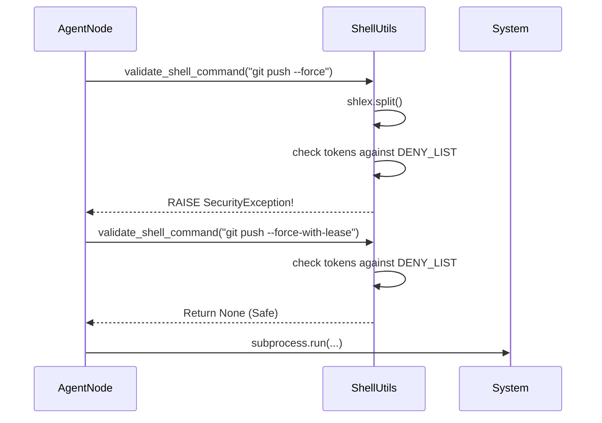

# 598 - Feature: Permissible Command Middleware

<!-- Template Metadata
Last Updated: 2026-02-02
Updated By: Issue #598 implementation
Update Reason: Initial LLD for Permissible Command Middleware
-->

## 1. Context & Goal
* **Issue:** #598
* **Objective:** Implement a mechanical "firewall" utility to validate shell commands and block dangerous flags (`--admin`, `--force`, `-D`, `--hard`) before execution.
* **Status:** Draft
* **Related Issues:** #595 (Restricted Auth)

### Open Questions
- [ ] Should we block these flags if they appear inside quoted strings (e.g., commit messages)? *Assumption: No, we parse commands properly to only block active flags.*
- [ ] Is `--force-with-lease` allowed? *Assumption: Yes, per Standards 0003, only `--force` is strictly forbidden. We will use exact token matching.*

## 2. Proposed Changes

### 2.1 Files Changed

| File | Change Type | Description |
|------|-------------|-------------|
| `assemblyzero/utils/shell.py` | Add | New utility module for shell command validation and execution safety. |
| `tests/unit/test_shell_security.py` | Add | Unit tests for command validation logic. |

### 2.1.1 Path Validation (Mechanical - Auto-Checked)

- `assemblyzero/utils/` exists.
- `tests/unit/` exists.

### 2.2 Dependencies

No new external dependencies. Uses standard library `shlex`.

### 2.3 Data Structures

```python

# assemblyzero/utils/shell.py

class SecurityException(Exception):
    """Raised when a command violates security policies."""
    pass

PROHIBITED_FLAGS: set[str] = {
    "--admin",
    "--force",
    "-D",
    "--hard"
}
```

### 2.4 Function Signatures

```python

# assemblyzero/utils/shell.py

def validate_shell_command(command: str | list[str]) -> None:
    """
    Validates a shell command against the prohibited flags list.

    Args:
        command: The command string or list of arguments.

    Raises:
        SecurityException: If a prohibited flag is detected as a distinct token.
    """
    ...
```

### 2.5 Logic Flow (Pseudocode)

```
FUNCTION validate_shell_command(command):
    1. IF command is string:
        tokens = shlex.split(command)
    ELSE:
        tokens = command

    2. FOR token IN tokens:
        IF token IN PROHIBITED_FLAGS:
            RAISE SecurityException(f"Prohibited flag detected: {token}")

    3. RETURN None
```

### 2.6 Technical Approach

* **Module:** `assemblyzero/utils/shell.py`
* **Pattern:** Middleware / Validator
* **Key Decisions:**
    *   **Parsing Strategy:** Use `shlex.split()` to correctly parse command strings. This ensures that flags inside quotes (e.g., `git commit -m "Do not use --force"`) are treated as string arguments, not active flags.
    *   **Matching Strategy:** Use **Exact Token Matching** rather than substring matching. This is critical because `--force` is banned, but `--force-with-lease` is the recommended safe alternative (Standard 0003). Substring matching would incorrectly block the safe alternative.

### 2.7 Architecture Decisions

| Decision | Options Considered | Choice | Rationale |
|----------|-------------------|--------|-----------|
| **Validation Level** | Regex vs. Tokenizer | **Tokenizer (shlex)** | Regex is fragile with shell quoting rules. Tokenization accurately identifies command structure. |
| **Blocking Scope** | Substring vs. Exact Match | **Exact Match** | Substring blocking would prevent valid flags like `--force-with-lease` or `-Define`. |

**Architectural Constraints:**
- Must be a lightweight utility importable by any workflow node.
- Must not introduce heavy dependencies.

## 3. Requirements

1.  **Deny List Enforcement:** The utility must raise an exception if `--admin`, `--force`, `-D`, or `--hard` are present as command flags.
2.  **Safe Context Preservation:** The utility must NOT block these strings if they are part of a quoted argument (e.g., a commit message).
3.  **Specific Blocking:** The utility must NOT block longer flags that contain the banned string (e.g., `--force-with-lease` must remain allowed).
4.  **Integration Ready:** The function must be exposed for use by workflow nodes.

## 4. Alternatives Considered

| Option | Pros | Cons | Decision |
|--------|------|------|----------|
| **Regex Matching** | Simple to implement for basic cases. | Fails on complex quoting; prone to false positives. | **Rejected** |
| **Substring Search** | Very strict security. | Blocks safe derivatives (`--force-with-lease`) and text inside words. | **Rejected** |
| **`shlex` Tokenization** | Context-aware; handles quotes correctly. | Slightly more complex than simple string search. | **Selected** |

**Rationale:** Accuracy is paramount to avoid frustrating the user or agent. `shlex` provides the standard shell parsing logic needed to distinguish a flag from a string literal.

## 5. Data & Fixtures

### 5.1 Data Sources
N/A - Internal logic only.

### 5.2 Data Pipeline
N/A

### 5.3 Test Fixtures

| Fixture | Source | Notes |
|---------|--------|-------|
| `SAFE_COMMANDS` | Hardcoded list | Includes `--force-with-lease`, quoted flags. |
| `UNSAFE_COMMANDS` | Hardcoded list | Includes `gh pr merge --admin`, `git reset --hard`. |

### 5.4 Deployment Pipeline
Standard Python package deployment.

## 6. Diagram

### 6.1 Mermaid Quality Gate

**Auto-Inspection Results:**
```
- Touching elements: [ ] None / [x] Found: None
- Hidden lines: [ ] None / [x] Found: None
- Label readability: [ ] Pass / [x] Issue: None
- Flow clarity: [ ] Clear / [x] Issue: None
```

### 6.2 Diagram



## 7. Security & Safety Considerations

### 7.1 Security

| Concern | Mitigation | Status |
|---------|------------|--------|
| **Unauthorized Admin Actions** | Block `--admin` flag on GH CLI commands. | Addressed |
| **Destructive Git Actions** | Block `--force`, `--hard`, `-D` flags. | Addressed |
| **Bypass via Quoting** | `shlex` parsing ensures quoted flags are treated as arguments, but unquoted ones are caught. | Addressed |

### 7.2 Safety

| Concern | Mitigation | Status |
|---------|------------|--------|
| **False Positives** | Exact token matching ensures safe flags (`--force-with-lease`) are not blocked. | Addressed |
| **Command Injection** | This utility validates *intent*; it does not execute. Execution nodes still responsible for safe `subprocess` usage. | Addressed |

**Fail Mode:** Fail Closed - If validation fails, the command is completely blocked.

## 8. Performance & Cost Considerations

### 8.1 Performance

| Metric | Budget | Approach |
|--------|--------|----------|
| Latency | < 1ms | In-memory set lookup is O(1). Parsing is fast for short command strings. |

**Bottlenecks:** None expected.

### 8.2 Cost Analysis
N/A - Local computation.

## 9. Legal & Compliance

| Concern | Applies? | Mitigation |
|---------|----------|------------|
| Terms of Service | No | N/A |

## 10. Verification & Testing

### 10.0 Test Plan (TDD - Complete Before Implementation)

**TDD Requirement:** Tests MUST be written and failing BEFORE implementation begins.

| Test ID | Test Description | Expected Behavior | Status |
|---------|------------------|-------------------|--------|
| T010 | Validate safe command list | Returns None | RED |
| T020 | Validate prohibited flag (`--force`) | Raises SecurityException | RED |
| T030 | Validate prohibited flag (`--admin`) | Raises SecurityException | RED |
| T040 | Validate prohibited flag (`-D`) | Raises SecurityException | RED |
| T050 | Validate prohibited flag (`--hard`) | Raises SecurityException | RED |
| T060 | Validate safe derivative (`--force-with-lease`) | Returns None | RED |
| T070 | Validate flag in quotes (`"msg --force"`) | Returns None | RED |
| T080 | Validate command as list input | Handles list correctly | RED |

**Coverage Target:** 100% for `assemblyzero/utils/shell.py`.

### 10.1 Test Scenarios

| ID | Scenario | Type | Input | Expected Output | Pass Criteria |
|----|----------|------|-------|-----------------|---------------|
| 010 | Safe basic command | Auto | `"ls -la"` | None | No exception raised |
| 020 | Prohibited `--force` | Auto | `"git push --force"` | SecurityException | Exception caught |
| 030 | Safe `--force-with-lease` | Auto | `"git push --force-with-lease"` | None | No exception |
| 040 | Prohibited `--admin` | Auto | `"gh pr merge --admin"` | SecurityException | Exception caught |
| 050 | Prohibited `-D` | Auto | `"git branch -D feat"` | SecurityException | Exception caught |
| 060 | Prohibited `--hard` | Auto | `"git reset --hard HEAD"` | SecurityException | Exception caught |
| 070 | Flag inside quotes | Auto | `'git commit -m "Do not use --force"'` | None | No exception |
| 080 | Input as list | Auto | `['git', 'push', '--force']` | SecurityException | Exception caught |

### 10.2 Test Commands

```bash
poetry run pytest tests/unit/test_shell_security.py -v
```

### 10.3 Manual Tests
N/A - All scenarios automated.

## 11. Risks & Mitigations

| Risk | Impact | Likelihood | Mitigation |
|------|--------|------------|------------|
| **False Positives** | High | Low | Robust testing of edge cases (quoted strings, similar flags). |
| **Evasion via obscure shell syntax** | Med | Low | Agents use standard command generation; `shlex` covers most standard shell syntax. |

## 12. Definition of Done

### Code
- [ ] `assemblyzero/utils/shell.py` created with `validate_shell_command` and `SecurityException`.
- [ ] Prohibited flags logic implemented using `shlex`.

### Tests
- [ ] `tests/unit/test_shell_security.py` passes all scenarios.
- [ ] Coverage for `shell.py` is 100%.

### Documentation
- [ ] LLD updated.

### 12.1 Traceability (Mechanical - Auto-Checked)

- `assemblyzero/utils/shell.py` is in Section 2.1.
- `tests/unit/test_shell_security.py` is in Section 2.1.
- Mitigation for False Positives is addressed in Section 2.6 (Technical Approach).

---

## Appendix: Review Log

### Orchestrator Review #1 (PENDING)

**Reviewer:** Orchestrator
**Verdict:** PENDING

#### Comments
| ID | Comment | Implemented? |
|----|---------|--------------|
| | | |

### Review Summary

| Review | Date | Verdict | Key Issue |
|--------|------|---------|-----------|
| | | | |

**Final Status:** PENDING