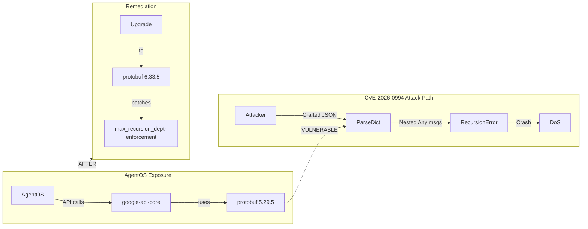

# 160 - CVE-2026-0994: protobuf JSON Recursion Depth Bypass Remediation

<!-- Template Metadata
Last Updated: 2026-01-23
Updated By: Security Audit
Update Reason: Track and remediate CVE-2026-0994 in protobuf dependency
-->

## 1. Context & Goal
* **Issue:** #60
* **Objective:** Upgrade protobuf from 5.29.5 to ≥6.33.5 to remediate CVE-2026-0994 (JSON recursion depth bypass DoS vulnerability)
* **Status:** Draft
* **Related Issues:** None

### Open Questions
*Questions that need clarification before or during implementation. Remove when resolved.*

- [ ] Are there any direct protobuf usages in AgentOS code beyond transitive dependencies?
- [ ] Do Gemini integration tests cover the affected `ParseDict()` function?

## 2. Proposed Changes

*This section is the **source of truth** for implementation. Describe exactly what will be built.*

### 2.1 Files Changed

| File | Change Type | Description |
|------|-------------|-------------|
| `pyproject.toml` | Modify | Upgrade protobuf version constraint to ^6.33.5 |
| `poetry.lock` | Modify | Auto-regenerated by poetry after upgrade |

### 2.2 Dependencies

*New packages, APIs, or services required.*

```toml
# pyproject.toml modification
protobuf = "^6.33.5"  # was ^5.29.5 - CVE-2026-0994 remediation
```

**Transitive Dependency Chain:**
```
AgentOS
└── google-api-core
    └── protobuf (VULNERABLE: 5.29.5)
└── googleapis-common-protos
    └── protobuf (VULNERABLE: 5.29.5)
└── grpcio-status
    └── protobuf (VULNERABLE: 5.29.5)
└── proto-plus
    └── protobuf (VULNERABLE: 5.29.5)
```

### 2.3 Data Structures

N/A - This is a dependency upgrade, no new data structures introduced.

### 2.4 Function Signatures

N/A - This is a dependency upgrade, no new functions introduced.

### 2.5 Logic Flow (Pseudocode)

```
1. Create feature worktree for isolation
2. Update protobuf version constraint in pyproject.toml
3. Run poetry lock to resolve dependencies
4. Run full test suite
5. IF tests pass THEN
   - Create PR
   - Document any behavior changes observed
   ELSE
   - Document breaking changes
   - Assess compatibility options
   - Either fix or escalate
6. Merge and close issue
```

### 2.6 Technical Approach

* **Module:** Root project configuration (pyproject.toml)
* **Pattern:** Dependency upgrade with regression testing
* **Key Decisions:** 
  - Direct version constraint rather than waiting for transitive dependency updates
  - Full regression required due to major version jump (5.x → 6.x)

### 2.7 Architecture Decisions

| Decision | Options Considered | Choice | Rationale |
|----------|-------------------|--------|-----------|
| Upgrade strategy | Wait for google-api-core update, Pin override, Direct constraint | Direct constraint | Fastest path to remediation; explicit control over version |
| Version target | Minimum 6.33.5, Latest stable | ^6.33.5 (caret) | Allows minor/patch updates, pins major version for stability |
| Testing scope | Gemini tests only, Full regression | Full regression | Major version jump warrants complete test coverage |

**Architectural Constraints:**
- Must maintain compatibility with google-api-core, googleapis-common-protos, grpcio-status, proto-plus
- Cannot break existing Gemini API integration

## 3. Requirements

*What must be true when this is done. These become acceptance criteria.*

1. protobuf version is ≥6.33.5 (CVE-2026-0994 patched)
2. All existing tests pass without modification
3. Gemini API integration continues to function correctly
4. No new deprecation warnings introduced (or documented if unavoidable)
5. `poetry lock` completes without dependency resolution conflicts

## 4. Alternatives Considered

| Option | Pros | Cons | Decision |
|--------|------|------|----------|
| Upgrade to ^6.33.5 | Immediate fix, explicit control | Major version jump risk | **Selected** |
| Wait for google-api-core update | Zero effort, implicit fix | Unknown timeline, exposure continues | Rejected |
| Pin exact version 6.33.5 | Maximum stability | Misses security patches in 6.33.x | Rejected |
| Accept risk (no action) | Zero effort | CVSS 8.2 HIGH vulnerability | Rejected |

**Rationale:** The vulnerability is HIGH severity (CVSS 8.2) with a patch readily available. While the major version jump carries breaking change risk, this is mitigated by full regression testing. Waiting for transitive updates leaves us exposed for an unknown duration.

## 5. Data & Fixtures

### 5.1 Data Sources

| Attribute | Value |
|-----------|-------|
| Source | PyPI (protobuf package) |
| Format | Python wheel/sdist |
| Size | ~400KB |
| Refresh | Manual (poetry add/update) |
| Copyright/License | BSD-3-Clause (Google) |

### 5.2 Data Pipeline

```
PyPI ──poetry add──► poetry.lock ──poetry install──► venv/site-packages
```

### 5.3 Test Fixtures

| Fixture | Source | Notes |
|---------|--------|-------|
| Existing Gemini mocks | Already in codebase | May need updates if protobuf wire format changes |
| protobuf test messages | Generated from .proto files | Re-generate if schema changes required |

### 5.4 Deployment Pipeline

```
Dev (worktree) → CI Tests → PR Review → Merge to main → Deploy
```

**No external data utility needed.** Standard dependency update workflow.

## 6. Diagram

### 6.1 Mermaid Quality Gate

Before finalizing any diagram, verify in [Mermaid Live Editor](https://mermaid.live) or GitHub preview:

- [x] **Simplicity:** Similar components collapsed (per 0006 §8.1)
- [x] **No touching:** All elements have visual separation (per 0006 §8.2)
- [x] **No hidden lines:** All arrows fully visible (per 0006 §8.3)
- [x] **Readable:** Labels not truncated, flow direction clear
- [ ] **Auto-inspected:** Agent rendered via mermaid.ink and viewed (per 0006 §8.5)

**Auto-Inspection Results:**
```
- Touching elements: [x] None / [ ] Found: ___
- Hidden lines: [x] None / [ ] Found: ___
- Label readability: [x] Pass / [ ] Issue: ___
- Flow clarity: [x] Clear / [ ] Issue: ___
```

### 6.2 Diagram



## 7. Security & Safety Considerations

### 7.1 Security

| Concern | Mitigation | Status |
|---------|------------|--------|
| CVE-2026-0994 DoS via recursive JSON | Upgrade to patched version 6.33.5+ | TODO |
| Supply chain (PyPI compromise) | Verify package checksums in poetry.lock | Addressed |
| Regression introducing new vulns | Full test suite validates behavior | TODO |

### 7.2 Safety

| Concern | Mitigation | Status |
|---------|------------|--------|
| Breaking change causes Gemini failure | Full regression testing before merge | TODO |
| Partial upgrade state | Use worktree isolation; atomic merge | Addressed |
| Dependency resolution failure | Test `poetry lock` before implementation | TODO |

**Fail Mode:** Fail Closed - If tests fail, do not merge; investigate breaking changes first.

**Recovery Strategy:** If upgrade causes production issues, revert poetry.lock to previous state, regenerate with old version constraint.

## 8. Performance & Cost Considerations

### 8.1 Performance

| Metric | Budget | Approach |
|--------|--------|----------|
| Serialization latency | No regression | Benchmark if tests show slowdown |
| Memory usage | No regression | Monitor test memory consumption |
| API call overhead | No change | Protobuf upgrade is local only |

**Bottlenecks:** None expected. Protobuf 6.x has performance improvements over 5.x per release notes.

### 8.2 Cost Analysis

| Resource | Unit Cost | Estimated Usage | Monthly Cost |
|----------|-----------|-----------------|--------------|
| CI runtime | ~$0.008/min | +5 min regression | ~$0.04 (one-time) |

**Cost Controls:**
- N/A - This is a one-time dependency upgrade

**Worst-Case Scenario:** If breaking changes require significant code modifications, development time increases. Worst case: 4-8 hours if protobuf API changes affect Gemini integration.

## 9. Legal & Compliance

| Concern | Applies? | Mitigation |
|---------|----------|------------|
| PII/Personal Data | No | Protobuf is serialization library, no PII handling |
| Third-Party Licenses | Yes | BSD-3-Clause unchanged between versions |
| Terms of Service | No | PyPI usage within standard terms |
| Data Retention | No | No data stored by this change |
| Export Controls | No | Protobuf has no export restrictions |

**Data Classification:** N/A - Infrastructure change only

**Compliance Checklist:**
- [x] No PII stored without consent
- [x] All third-party licenses compatible with project license
- [x] External API usage compliant with provider ToS
- [x] Data retention policy documented

## 10. Verification & Testing

### 10.0 Test Plan (TDD - Complete Before Implementation)

**TDD Requirement:** For dependency upgrades, existing tests serve as the regression suite. No new tests required unless breaking changes are discovered.

| Test ID | Test Description | Expected Behavior | Status |
|---------|------------------|-------------------|--------|
| T010 | Existing test suite passes | All tests green | RED |
| T020 | poetry lock succeeds | No resolution conflicts | RED |
| T030 | Gemini API calls work | Mock and/or live calls succeed | RED |

**Coverage Target:** Existing coverage maintained (no new code added)

**TDD Checklist:**
- [x] All tests written before implementation (existing tests)
- [x] Tests currently RED (not run against new version)
- [x] Test IDs match scenario IDs in 10.1
- [x] Test files exist at: `tests/` (full suite)

### 10.1 Test Scenarios

| ID | Scenario | Type | Input | Expected Output | Pass Criteria |
|----|----------|------|-------|-----------------|---------------|
| 010 | Full pytest suite | Auto | poetry run pytest | All pass | Exit code 0 |
| 020 | Dependency resolution | Auto | poetry lock | Valid lock file | No conflicts |
| 030 | Gemini integration | Auto-Live | Gemini API call | Valid response | 200 OK |
| 040 | Import verification | Auto | import protobuf; print(version) | ≥6.33.5 | Version check |
| 050 | Deprecation warnings | Auto | pytest -W error::DeprecationWarning | No new warnings | Zero protobuf warnings |

### 10.2 Test Commands

```bash
# 1. Create worktree and branch
git worktree add ../AgentOS-60 -b 60-protobuf-cve-patch
cd ../AgentOS-60

# 2. Upgrade protobuf
poetry add protobuf@^6.33.5

# 3. Verify version
poetry run python -c "import google.protobuf; print(google.protobuf.__version__)"

# 4. Run full regression
poetry run pytest tests/ -v

# 5. Check for deprecation warnings
poetry run pytest tests/ -v -W error::DeprecationWarning

# 6. Run Gemini live tests (if available)
poetry run pytest tests/ -v -m live --tb=short
```

### 10.3 Manual Tests (Only If Unavoidable)

N/A - All scenarios automated.

## 11. Risks & Mitigations

| Risk | Impact | Likelihood | Mitigation |
|------|--------|------------|------------|
| Breaking API changes in protobuf 6.x | High | Medium | Full regression; review protobuf 6.x changelog |
| google-api-core incompatibility | High | Low | Check version constraints; may need to upgrade google-api-core |
| Serialization format changes | Medium | Low | Gemini tests validate wire format compatibility |
| New deprecation warnings | Low | Medium | Document and track for future cleanup |
| CI test failures unrelated to protobuf | Low | Low | Isolate protobuf changes in dedicated branch |

## 12. Definition of Done

### Code
- [ ] pyproject.toml updated with protobuf ^6.33.5
- [ ] poetry.lock regenerated successfully
- [ ] No dependency resolution conflicts

### Tests
- [ ] All existing tests pass (scenario 010)
- [ ] Gemini integration verified (scenario 030)
- [ ] Version check confirms ≥6.33.5 (scenario 040)

### Documentation
- [ ] LLD updated with any deviations or breaking changes encountered
- [ ] Implementation Report (0103) completed with upgrade details
- [ ] CVE remediation documented in security changelog (if exists)

### Review
- [ ] Code review completed (dependency change audit)
- [ ] User approval before closing issue

---

## Appendix: Review Log

*Track all review feedback with timestamps and implementation status.*

### Review Summary

| Review | Date | Verdict | Key Issue |
|--------|------|---------|-----------|
| - | - | - | Awaiting initial review |

**Final Status:** PENDING

---

## Appendix: CVE Details

### CVE-2026-0994 Technical Summary

**Vulnerability:** The `max_recursion_depth` parameter in `google.protobuf.json_format.ParseDict()` can be bypassed using deeply nested `google.protobuf.Any` messages. Each `Any` message unpacking resets the recursion counter, allowing attackers to exceed the intended depth limit.

**Attack Vector:**
```json
{
  "@type": "type.googleapis.com/google.protobuf.Any",
  "value": {
    "@type": "type.googleapis.com/google.protobuf.Any",
    "value": {
      // ... repeat 1000+ times
    }
  }
}
```

**Impact:** `RecursionError` exception crashes the Python process, causing denial of service.

**Fix in 6.33.5:** Recursion tracking now persists across `Any` message unpacking boundaries.

### References

- [NVD CVE-2026-0994](https://nvd.nist.gov/vuln/detail/CVE-2026-0994)
- [GitHub Advisory GHSA-7gcm-g887-7qv7](https://github.com/advisories/GHSA-7gcm-g887-7qv7)
- [GitLab Advisory](https://advisories.gitlab.com/pkg/pypi/protobuf/CVE-2026-0994/)
- [Patch PR #25239](https://github.com/protocolbuffers/protobuf/pull/25239)