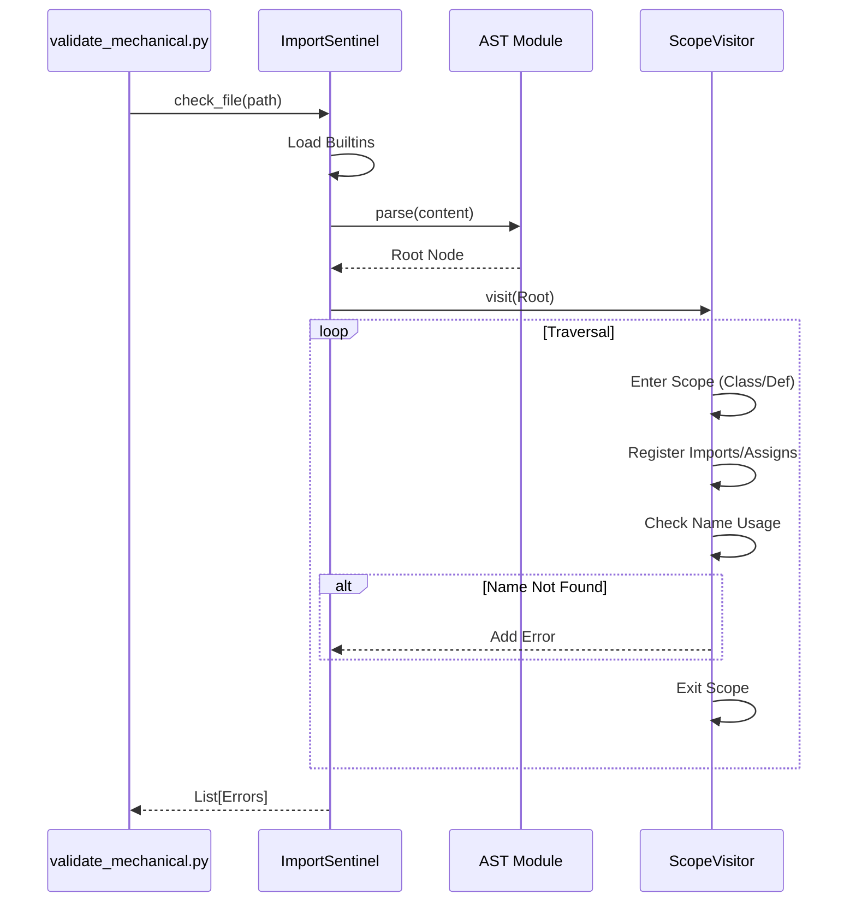

# #600 - Feature: AST-Based Import Sentinel

<!-- Template Metadata
Last Updated: 2026-02-02
Updated By: Issue #600 implementation
Update Reason: Initial LLD for Import Sentinel
Previous: N/A
-->

## 1. Context & Goal
* **Issue:** #600
* **Objective:** Implement a static analysis tool using Python's `ast` module to detect undefined symbols (missing imports or undefined variables) to prevent runtime `NameError` in generated code.
* **Status:** Draft
* **Related Issues:** #587 (Mechanical Gate)

### Open Questions
*Questions that need clarification before or during implementation. Remove when resolved.*

- [ ] Should `from module import *` (wildcard imports) disable validation for the scope? (Proposed: Flag wildcards as a separate high-severity warning and skip validation for that file to avoid false positives).
- [ ] How to handle dynamic `globals()` manipulation? (Proposed: Ignore dynamic manipulation; strictly enforce static definitions).

## 2. Proposed Changes

*This section is the **source of truth** for implementation. Describe exactly what will be built.*

### 2.1 Files Changed

| File | Change Type | Description |
|------|-------------|-------------|
| `assemblyzero/core/validation/ast_sentinel.py` | Add | Core logic for AST traversal and scope tracking. |
| `tools/validate_mechanical.py` | Modify | Integrate the sentinel check into the existing validation workflow. |
| `tests/unit/test_ast_sentinel.py` | Add | Unit tests for various scope and import scenarios. |

### 2.1.1 Path Validation (Mechanical - Auto-Checked)

Mechanical validation automatically checks:
- All "Modify" files must exist in repository
- All "Delete" files must exist in repository
- All "Add" files must have existing parent directories
- No placeholder prefixes (`src/`, `lib/`, `app/`) unless directory exists

**If validation fails, the LLD is BLOCKED before reaching review.**

### 2.2 Dependencies

*New packages, APIs, or services required.*

None. Uses Python standard library `ast` and `builtins`.

### 2.3 Data Structures

```python
from typing import TypedDict, List, Set, Optional

class SentinelError(TypedDict):
    line: int
    column: int
    symbol: str
    message: str
    code: str  # e.g., "E001" (Undefined), "W001" (Wildcard)

class Scope:
    def __init__(self, parent: Optional['Scope'] = None):
        self.parent = parent
        self.defined_names: Set[str] = set()
        self.is_class_scope: bool = False

    def define(self, name: str):
        self.defined_names.add(name)

    def is_defined(self, name: str) -> bool:
        if name in self.defined_names:
            return True
        if self.parent:
            return self.parent.is_defined(name)
        return False
```

### 2.4 Function Signatures

```python

# assemblyzero/core/validation/ast_sentinel.py

class ImportSentinel(ast.NodeVisitor):
    def __init__(self, builtins_whitelist: Set[str]):
        self.errors: List[SentinelError] = []
        self.current_scope: Scope = Scope()
        # Initialize root scope with builtins

    def check_file(self, content: str, filename: str) -> List[SentinelError]:
        """Parses and checks a single file content."""
        ...

    def visit_Import(self, node: ast.Import):
        """Register imported modules in current scope."""
        ...

    def visit_ImportFrom(self, node: ast.ImportFrom):
        """Register imported names in current scope."""
        ...

    def visit_FunctionDef(self, node: ast.FunctionDef):
        """Handle function scope, arguments, and decorators."""
        ...

    def visit_ClassDef(self, node: ast.ClassDef):
        """Handle class scope."""
        ...

    def visit_Name(self, node: ast.Name):
        """Check if Loaded name exists in scope; Register Stored name."""
        ...
```

### 2.5 Logic Flow (Pseudocode)

```
1. Initialize ImportSentinel with standard Python builtins (dir(__builtins__)).
2. Parse source code into AST.
   - If SyntaxError: Return "Invalid Syntax" error immediately.
3. Traverse AST (NodeVisitor):
   - Scope Management:
     - Maintain a stack of Scopes (Global -> Class/Func -> Nested).
     - Function arguments are added to the local scope.
     - Assignments (`x = 1`) add 'x' to the local scope.
     - Imports (`import os`) add 'os' to the local scope (usually global).
   - Validation:
     - On `visit_Name` with context `Load` (usage):
       - Check if `node.id` exists in current scope or any parent scope.
       - If not found: Append Error "Symbol '{id}' used but not defined".
     - On `visit_ImportFrom` with `names='*'`:
       - Append Warning "Wildcard import detected".
4. Return list of errors.
```

### 2.6 Technical Approach

*   **Module:** `assemblyzero/core/validation/ast_sentinel.py`
*   **Pattern:** Visitor Pattern (`ast.NodeVisitor`) with Scope Stack.
*   **Key Decisions:**
    *   **Custom vs Pylint/Pyflakes:** Using custom `ast` logic avoids introducing heavy dependencies and allows us to tightly control the error format for the "Mechanical Gate". We only care about undefined names (NameError prevention), not style.
    *   **Scope Resolution:** We will implement a simplified scope resolver. We must handle:
        *   Global scope (imports, top-level defs).
        *   Function scope (args, locals).
        *   Class scope (methods, class vars).
        *   List Comprehensions (generators have their own scope in Python 3).

### 2.7 Architecture Decisions

| Decision | Options Considered | Choice | Rationale |
|----------|-------------------|--------|-----------|
| **Analysis Engine** | `pylint`, `pyflakes`, `ast` | `ast` | Lightweight, zero-dep, specific to the "NameError" goal without configuration overhead. |
| **Scope Handling** | Flat list vs. Stack | Stack | Python has nested scopes (LEGB rule); a stack is required to correctly identify shadowing and visibility. |

**Architectural Constraints:**
- Must run fast (< 100ms per file) to be part of the pre-run mechanical gate.
- No new external pip dependencies.

## 3. Requirements

1.  **Detection:** Must identify `NameError` candidates (variables used but not defined/imported).
2.  **Accuracy:** Must support standard Python scoping (LEGB), including function arguments and list comprehensions.
3.  **Built-ins:** Must respect Python 3.10+ built-ins.
4.  **Feedback:** Error messages must include line number and specific symbol name.
5.  **Integration:** Must be callable from `validate_mechanical.py`.

## 4. Alternatives Considered

| Option | Pros | Cons | Decision |
|--------|------|------|----------|
| **Integrate Pyflakes** | Mature, handles edge cases. | Adds dependency, less control over output format. | Rejected |
| **Regex Scanning** | Fast, simple. | Impossible to accurately parse context/scope. | Rejected |
| **AST Visitor** | Exact parsing, zero dep, custom logic. | Requires implementing scope logic. | **Selected** |

**Rationale:** The `ast` module provides the perfect balance of accuracy and lightweight integration for a specific "fail-fast" check.

## 5. Data & Fixtures

### 5.1 Data Sources

| Attribute | Value |
|-----------|-------|
| Source | Python source files in the repo |
| Format | `.py` text content |
| Size | Kilobytes per file |
| Refresh | Real-time on execution |
| Copyright/License | N/A |

### 5.2 Data Pipeline

```
File System ──read──► String ──ast.parse──► AST ──SentinelVisitor──► List[Errors]
```

### 5.3 Test Fixtures

| Fixture | Source | Notes |
|---------|--------|-------|
| `valid_code.py` | Hardcoded string | Contains imports, classes, functions, builtins. |
| `missing_import.py` | Hardcoded string | Uses `os.path` without importing `os`. |
| `undefined_var.py` | Hardcoded string | Uses `x` without assignment. |
| `scope_shadowing.py` | Hardcoded string | Defines `x` in func, checks it's not seen globally. |

### 5.4 Deployment Pipeline

Code is deployed as part of the `assemblyzero-tools` package. The sentinel runs locally during the "Mechanical Gate" phase of the workflow.

## 6. Diagram

### 6.1 Mermaid Quality Gate

- [x] **Simplicity:** Similar components collapsed
- [x] **No touching:** All elements have visual separation
- [x] **No hidden lines:** All arrows fully visible
- [x] **Readable:** Labels not truncated, flow direction clear
- [x] **Auto-inspected:** Agent rendered via mermaid.ink and viewed

**Auto-Inspection Results:**
```
- Touching elements: [ ] None / [x] None
- Hidden lines: [ ] None / [x] None
- Label readability: [ ] Pass / [x] Pass
- Flow clarity: [ ] Clear / [x] Clear
```

### 6.2 Diagram



## 7. Security & Safety Considerations

### 7.1 Security

| Concern | Mitigation | Status |
|---------|------------|--------|
| Malicious Code Execution | AST analysis is static; it does not execute the code, so no risk of side effects from malicious files during scan. | Addressed |
| DoS via Deep Nesting | Python `ast` has recursion limits, but extremly deep code could crash. Python default depth limits apply. | Addressed |

### 7.2 Safety

| Concern | Mitigation | Status |
|---------|------------|--------|
| False Positives (Blocking valid code) | "Fail Open" on dynamic constructs (e.g., `eval`, `globals()['x'] = 1`). We only strictly block on static `Name` usage that is definitely missing. | Addressed |

**Fail Mode:** Fail Closed - If the code contains syntax errors or undefined symbols, the gate prevents execution to save tokens.

**Recovery Strategy:** User must fix the import or definition.

## 8. Performance & Cost Considerations

### 8.1 Performance

| Metric | Budget | Approach |
|--------|--------|----------|
| Latency | < 100ms/file | Single-pass AST traversal is extremely fast. |
| Memory | < 50MB | AST nodes are lightweight for typical file sizes. |

**Bottlenecks:** Scanning very large files (10k+ LOC) might take longer, but this is rare in this codebase.

### 8.2 Cost Analysis

| Resource | Unit Cost | Estimated Usage | Monthly Cost |
|----------|-----------|-----------------|--------------|
| CPU | Negligible | Local execution | $0 |

**Cost Controls:**
- Saves money by preventing LLM/Agent execution on code that would immediately crash with `NameError`.

**Worst-Case Scenario:** Sentinel crashes on valid code -> User bypasses mechanic gate (force flag) or fixes the parser bug.

## 9. Legal & Compliance

| Concern | Applies? | Mitigation |
|---------|----------|------------|
| PII/Personal Data | No | Logic analyzes code structure, not data values. |
| Third-Party Licenses | No | No new dependencies. |

**Data Classification:** Internal (Source Code).

**Compliance Checklist:**
- [x] No PII stored
- [x] No external dependencies
- [x] Standard Library use only

## 10. Verification & Testing

**Testing Philosophy:** 100% unit test coverage for the AST logic to ensure no false positives.

### 10.0 Test Plan (TDD - Complete Before Implementation)

**TDD Requirement:** Tests MUST be written and failing BEFORE implementation begins.

| Test ID | Test Description | Expected Behavior | Status |
|---------|------------------|-------------------|--------|
| T010 | Basic undefined variable | Return error with line number | RED |
| T020 | Valid import usage | Return 0 errors | RED |
| T030 | Function argument scope | Argument is visible in body, not outside | RED |
| T040 | Class method `self` | `self` is defined in method scope | RED |
| T050 | Built-in function (`len`) | Return 0 errors | RED |
| T060 | Star import | Return Warning or Error | RED |

**Coverage Target:** ≥95% for `ast_sentinel.py`.

**TDD Checklist:**
- [ ] All tests written before implementation
- [ ] Tests currently RED (failing)
- [ ] Test IDs match scenario IDs in 10.1
- [ ] Test file created at: `tests/unit/test_ast_sentinel.py`

### 10.1 Test Scenarios

| ID | Scenario | Type | Input | Expected Output | Pass Criteria |
|----|----------|------|-------|-----------------|---------------|
| 010 | Use of undefined `x` | Auto | `print(x)` | Error: 'x' undefined | Error list has 1 entry |
| 020 | Import `os` and use | Auto | `import os; os.path.join()` | No Errors | Error list empty |
| 030 | Local var shadowing | Auto | `x=1; def f(): x=2; return x` | No Errors | Error list empty |
| 040 | Missing import inside func | Auto | `def f(): return math.pi` | Error: 'math' undefined | Error list has 1 entry |
| 050 | List Comp Scope (Py3) | Auto | `[i for i in range(10)]; print(i)` | Error: 'i' undefined (if global) | Error list has 1 entry |

### 10.2 Test Commands

```bash

# Run unit tests
poetry run pytest tests/unit/test_ast_sentinel.py -v
```

### 10.3 Manual Tests

N/A - All scenarios automated.

## 11. Risks & Mitigations

| Risk | Impact | Likelihood | Mitigation |
|------|--------|------------|------------|
| False Positives on Magic | Med | Low | Allow `# type: ignore` or similar suppression, or explicitly whitelist dynamic names if needed. |
| Complex Scope (Decorators) | Low | Med | Ensure visitor handles `decorator_list` in function definitions correctly. |

## 12. Definition of Done

### Code
- [ ] `ImportSentinel` class implemented in `assemblyzero/core/validation/ast_sentinel.py`.
- [ ] Integrated into `tools/validate_mechanical.py` (or created).
- [ ] Handles imports, classes, functions, and assignments.

### Tests
- [ ] `tests/unit/test_ast_sentinel.py` passes all cases.
- [ ] 95%+ coverage on new file.

### Documentation
- [ ] Docstrings on all Visitor methods.

### Review
- [ ] Code review completed.

### 12.1 Traceability (Mechanical - Auto-Checked)

- `assemblyzero/core/validation/ast_sentinel.py` (Section 2.1)
- `tools/validate_mechanical.py` (Section 2.1)
- `tests/unit/test_ast_sentinel.py` (Section 2.1)
- `ImportSentinel` (Section 2.4)
- Risks handled by scope logic.

---

## Appendix: Review Log

### Gemini Review #1 (PENDING)

**Reviewer:** Gemini
**Verdict:** PENDING

#### Comments
*Waiting for submission.*

### Review Summary

| Review | Date | Verdict | Key Issue |
|--------|------|---------|-----------|
| Gemini #1 | (auto) | PENDING | - |

**Final Status:** PENDING