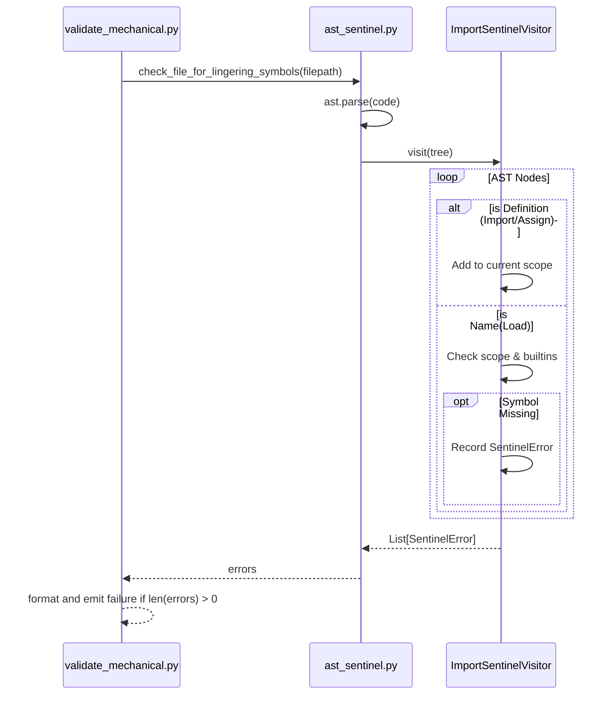

# 600 - Feature: AST-Based Import Sentinel

<!-- Template Metadata
Last Updated: 2026-02-02
Updated By: Issue #117 fix
Update Reason: Moved Verification & Testing to Section 10 (was Section 11) to match 0702c review prompt and testing workflow expectations
Previous: Added sections based on 80 blocking issues from 164 governance verdicts (2026-02-01)
-->

## 1. Context & Goal
* **Issue:** #600
* **Objective:** Enhance mechanical validation to catch "Lingering Symbols" (missing imports or undefined variables) before execution using AST analysis.
* **Status:** Draft
* **Related Issues:** #587

### Open Questions
- [ ] Should the sentinel fail the validation strictly, or just emit a warning for the LLM to auto-correct? (Assuming strict failure for mechanical gate).
- [ ] How deep should scope tracking go? (e.g., nested functions, comprehensions).

## 2. Proposed Changes

### 2.1 Files Changed

| File | Change Type | Description |
|------|-------------|-------------|
| `assemblyzero/core/validation/ast_sentinel.py` | Add | Core AST traversal, scope tracking, and validation logic. |
| `assemblyzero/workflows/requirements/nodes/validate_mechanical.py` | Modify | Integrate the AST sentinel to run on all modified Python files. |
| `tests/unit/test_ast_sentinel.py` | Add | Unit tests for AST symbol validation and edge cases. |

### 2.1.1 Path Validation (Mechanical - Auto-Checked)

Mechanical validation automatically checks:
- All "Modify" files must exist in repository
- All "Delete" files must exist in repository
- All "Add" files must have existing parent directories
- No placeholder prefixes (`src/`, `lib/`, `app/`) unless directory exists

### 2.2 Dependencies

```toml

# pyproject.toml additions (if any)

# None required. Uses Python standard library (`ast`, `builtins`).
```

### 2.3 Data Structures

```python
from typing import TypedDict, List, Optional, Set

class SentinelError(TypedDict):
    file_path: str
    line_number: int
    symbol_name: str
    error_message: str

class ScopeContext:
    def __init__(self, parent: Optional['ScopeContext'] = None):
        self.defined_names: Set[str] = set()
        self.parent: Optional['ScopeContext'] = parent
```

### 2.4 Function Signatures

```python
import ast
from typing import List

class ImportSentinelVisitor(ast.NodeVisitor):
    """Walks the AST to track defined symbols and check loaded Name nodes."""
    def __init__(self, file_path: str): ...
    def visit_Import(self, node: ast.Import) -> None: ...
    def visit_ImportFrom(self, node: ast.ImportFrom) -> None: ...
    def visit_Assign(self, node: ast.Assign) -> None: ...
    def visit_FunctionDef(self, node: ast.FunctionDef) -> None: ...
    def visit_Name(self, node: ast.Name) -> None: ...

def check_file_for_lingering_symbols(file_path: str) -> List[SentinelError]:
    """Parses a file into an AST and returns a list of undefined symbol errors."""
    ...

def check_code_for_lingering_symbols(code: str, file_path: str = "<unknown>") -> List[SentinelError]:
    """Core logic to check raw code string for missing symbols."""
    ...
```

### 2.5 Logic Flow (Pseudocode)

```
1. Receive code string and file_path.
2. IF code cannot be parsed (SyntaxError):
   - Return early (syntax errors handled by existing mechanical gates).
3. Initialize ImportSentinelVisitor with known Python builtins loaded into global scope.
4. Traverse AST:
   - On definition (Import, Assign, FunctionDef, ClassDef, arg):
     - Add symbol name to current scope.
   - On scope change (entering FunctionDef/ClassDef):
     - Push new local scope.
   - On leaving scope change:
     - Pop local scope.
   - On Name(ctx=Load):
     - Check if symbol exists in any active scope (local -> global -> builtins).
     - IF NOT exists:
       - Append SentinelError("Symbol '{name}' used on line {line} but not imported/defined.")
5. Return List[SentinelError].
6. In validate_mechanical.py: IF errors returned, format specific feedback and exit 1 (fail gate).
```

### 2.6 Technical Approach

* **Module:** `assemblyzero/core/validation/ast_sentinel.py`
* **Pattern:** Visitor Pattern (`ast.NodeVisitor`).
* **Key Decisions:** We use Python's built-in `ast` module rather than external linters (like `flake8` or `pylint`) to minimize dependency weight and tailor the error output to be perfectly formatted for LLM consumption (e.g., exact instructions on what line is missing what import).

### 2.7 Architecture Decisions

| Decision | Options Considered | Choice | Rationale |
|----------|-------------------|--------|-----------|
| Parser Engine | Regex, `ast` module, `symtable` module | `ast` module | `ast` provides exact line numbers and node contexts, avoiding the brittleness of regex. |
| Scope Tracking | Flat tracking, Stack-based scoping | Stack-based scoping | Necessary to handle local variables inside functions so we don't falsely flag local variables as missing. |

**Architectural Constraints:**
- Must not introduce significant latency to the mechanical validation gate.
- Must not require downloading external linter binaries.

## 3. Requirements

1. Must parse the target file using `ast.parse` and walk nodes using `ast.NodeVisitor`.
2. Every `ast.Name` node with `ctx=ast.Load()` must correspond to an `ast.Import`, `ast.ImportFrom`, built-in function, or local assignment/definition.
3. Errors must specifically state: "Symbol '{name}' used on line {line} but not imported."
4. Must be invoked directly within `assemblyzero/workflows/requirements/nodes/validate_mechanical.py`.
5. Must handle gracefully nested scopes and list comprehensions to minimize false positives.

## 4. Alternatives Considered

| Option | Pros | Cons | Decision |
|--------|------|------|----------|
| External Linter (Flake8) | Extremely robust, handles all edge cases | Heavy dependency, output formatting is rigid, overkill for token-saving gate | **Rejected** |
| AST module (`ast`) | Zero dependencies, highly customizable output, fast | Requires manual scope tracking | **Selected** |
| Regex parsing | Simple to write initially | Cannot handle scopes, multi-line imports, or distinguishing strings from code | **Rejected** |

**Rationale:** The `ast` module gives us the precise control needed to format LLM-friendly feedback while keeping the validation gate lightweight and fast.

## 5. Data & Fixtures

### 5.1 Data Sources

| Attribute | Value |
|-----------|-------|
| Source | Local Python source files modified in the active worktree |
| Format | `.py` code |
| Size | Typically < 1000 LOC per file |
| Refresh | Real-time during mechanical validation |
| Copyright/License | N/A |

### 5.2 Data Pipeline

```
Modified File ──read──► AST Parse ──visit──► Sentinel Verification ──format──► Validation Output
```

### 5.3 Test Fixtures

| Fixture | Source | Notes |
|---------|--------|-------|
| `missing_import.py` | Hardcoded in test | Code using `os.path` without `import os` |
| `valid_code.py` | Hardcoded in test | Code with complex but valid local scopes |
| `builtins_code.py` | Hardcoded in test | Code using `print()`, `len()`, `ValueError` |

### 5.4 Deployment Pipeline

No external deployment required. Operates locally during the developer/agent loop prior to commit/push.

## 6. Diagram

### 6.1 Mermaid Quality Gate

**Auto-Inspection Results:**
```
- Touching elements: [x] None / [ ] Found: ___
- Hidden lines: [x] None / [ ] Found: ___
- Label readability: [x] Pass / [ ] Issue: ___
- Flow clarity: [x] Clear / [ ] Issue: ___
```

### 6.2 Diagram



## 7. Security & Safety Considerations

### 7.1 Security

| Concern | Mitigation | Status |
|---------|------------|--------|
| Arbitrary Code Execution | `ast.parse` is safe and does not execute the code, unlike `eval()`. | Addressed |

### 7.2 Safety

| Concern | Mitigation | Status |
|---------|------------|--------|
| Malformed Python causing crash | Wrap `ast.parse` in a `try/except SyntaxError`. Return clean early exit (syntax errors caught elsewhere). | Addressed |
| False positives blocking valid code | Track scopes strictly. Ensure Python `builtins` are pre-loaded into the base scope. Handle edge case syntax gracefully. | Addressed |

**Fail Mode:** Fail Closed - If undefined variables are detected, the mechanical validation must fail to prevent broken code from proceeding to expensive LLM reviews or testing.
**Recovery Strategy:** The LLM receives the exact line number and symbol name, allowing an immediate targeted fix (e.g., adding the missing import).

## 8. Performance & Cost Considerations

### 8.1 Performance

| Metric | Budget | Approach |
|--------|--------|----------|
| Latency | < 100ms per file | `ast.parse` is written in C and executes in microseconds. Flat AST traversal is computationally trivial. |
| Memory | < 50MB overhead | Memory is limited to the AST tree representation for a single file at a time. |
| API Calls | 0 | Pure local execution. |

**Bottlenecks:** None expected. AST traversal of standard-sized Python files is exceptionally fast.

### 8.2 Cost Analysis

| Resource | Unit Cost | Estimated Usage | Monthly Cost |
|----------|-----------|-----------------|--------------|
| LLM API calls | $0 | Prevented by local execution | -$X (Saves money) |

**Cost Controls:**
- [x] Catching `NameError` locally prevents wasting expensive Gemini 3 Pro / Claude Opus tokens on structurally broken code during testing or review phases.

**Worst-Case Scenario:** Negligible impact. Checking 100 files locally takes < 1 second.

## 9. Legal & Compliance

| Concern | Applies? | Mitigation |
|---------|----------|------------|
| PII/Personal Data | No | AST parsing operates only on structural source code locally. |
| Third-Party Licenses | No | Uses only Python standard library `ast`. |
| Terms of Service | No | Runs entirely locally. |
| Data Retention | N/A | No data stored; transient parsing. |
| Export Controls | N/A | Internal tool extension. |

**Data Classification:** Internal (Source Code)

**Compliance Checklist:**
- [x] No PII stored without consent
- [x] All third-party licenses compatible with project license
- [x] External API usage compliant with provider ToS
- [x] Data retention policy documented

## 10. Verification & Testing

### 10.0 Test Plan (TDD - Complete Before Implementation)

| Test ID | Test Description | Expected Behavior | Status |
|---------|------------------|-------------------|--------|
| T010 | Valid code with imports | Returns empty error list | RED |
| T020 | Code with missing import | Returns `SentinelError` with correct line number | RED |
| T030 | Code using Python builtins | Ignores `print`, `len`, `Exception`, returns empty list | RED |
| T040 | Complex scope (locals) | Recognizes locally assigned variables, returns empty list | RED |
| T050 | Mechanical Gate integration | Gate exits non-zero and prints specific feedback | RED |

**Coverage Target:** ≥95% for all new code in `ast_sentinel.py`.

**TDD Checklist:**
- [ ] All tests written before implementation
- [ ] Tests currently RED (failing)
- [ ] Test IDs match scenario IDs in 10.1
- [ ] Test file created at: `tests/unit/test_ast_sentinel.py`

### 10.1 Test Scenarios

| ID | Scenario | Type | Input | Expected Output | Pass Criteria |
|----|----------|------|-------|-----------------|---------------|
| 010 | Happy path valid AST Analysis (REQ-1) | Auto | Code with `import os; os.path.join()` | `[]` | No errors emitted |
| 020 | Missing import verified (REQ-2) | Auto | Code with `json.dumps({})` but no import | `[SentinelError]` | Errors emitted correctly |
| 030 | Feedback specifically stated (REQ-3) | Auto | Code with missing import | `[SentinelError]` | Exact string: "Symbol 'json' used on line X but not imported." |
| 040 | Integration with mechanical validation (REQ-4) | Auto | Running gate on bad file | `sys.exit(1)` | Fails the gate check |
| 050 | Local definition nested scope resilience (REQ-5) | Auto | Code with `def foo(a): b = a; return b` | `[]` | Function arguments and local assignments recognized |

### 10.2 Test Commands

```bash

# Run the specific tests for the Sentinel
poetry run pytest tests/unit/test_ast_sentinel.py -v

# Run gate integration tests
poetry run pytest tests/unit/test_gate/ -v
```

### 10.3 Manual Tests (Only If Unavoidable)

N/A - All scenarios automated. Code parsing and validation is fully deterministic.

## 11. Risks & Mitigations

| Risk | Impact | Likelihood | Mitigation |
|------|--------|------------|------------|
| False positives on edge-case Python syntax (e.g. `global` keyword, walrus operators) | Med | Med | Expand `ImportSentinelVisitor` to cover `Global`, `Nonlocal`, and `NamedExpr` nodes. If a node is too complex, default to assuming the symbol is defined to avoid blocking valid code. |
| Star imports (`from module import *`) | Low | Low | Standard coding guidelines prohibit star imports. Sentinel can flag `*` imports or safely ignore them. For MVP, assume star imports define all unknown symbols to prevent false positives. |

## 12. Definition of Done

### Code
- [ ] Implementation complete and linted
- [ ] Code comments reference this LLD

### Tests
- [ ] All test scenarios pass
- [ ] Test coverage meets threshold

### Documentation
- [ ] LLD updated with any deviations
- [ ] Implementation Report (0103) completed
- [ ] Test Report (0113) completed if applicable

### Review
- [ ] Code review completed
- [ ] User approval before closing issue

### 12.1 Traceability (Mechanical - Auto-Checked)

Mechanical validation automatically checks:
- Every file mentioned in this section must appear in Section 2.1
- Every risk mitigation in Section 11 should have a corresponding function in Section 2.4 (warning if not)

---

## Appendix: Review Log

### Orchestrator Review #1 (FEEDBACK)

**Reviewer:** Automated Validation
**Verdict:** FEEDBACK

#### Comments

| ID | Comment | Implemented? |
|----|---------|--------------|
| R1.1 | "File marked Modify but does not exist: assemblyzero/core/validation/validate_mechanical.py. Did you mean: `assemblyzero/workflows/requirements/nodes/validate_mechanical.py`?" | YES - Updated path in Section 2.1 |

### Review Summary

| Review | Date | Verdict | Key Issue |
|--------|------|---------|-----------|
| Orchestrator #1 | (auto) | FEEDBACK | Fixed mechanical path error |

**Final Status:** PENDING