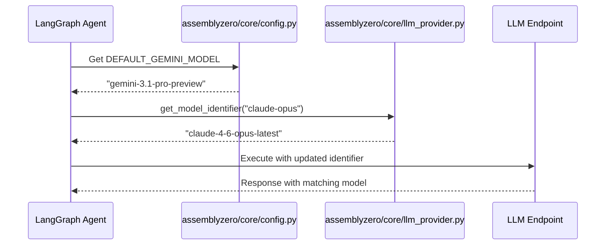

# 605 - Feature: Systemic Model Version Refresh (Gemini 3.1 & Claude 4.6+)

<!-- Template Metadata
Last Updated: 2026-02-04
Updated By: Issue #605 LLD generation
Update Reason: Model identifiers refresh for Gemini 3.1 and Claude 4.6+
Previous: Added sections based on 80 blocking issues from 164 governance verdicts (2026-02-01)
-->

## 1. Context & Goal
* **Issue:** #605
* **Objective:** Refresh all hardcoded model identifiers across the codebase to ensure we are using the latest stable versions (Gemini 3.1 and Claude 4.6+ variants).
* **Status:** Draft
* **Related Issues:** #600

### Open Questions
- [ ] Should we use `gemini-3.1-pro-preview` or `gemini-3.1-pro` as the absolute default if both are available? (Assuming `gemini-3.1-pro-preview` for now based on objective wording).
- [ ] Do we need to retain backwards compatibility mappings for `gemini-3-pro` in the fallback logic, or strictly replace them? (Assuming strict replace to enforce the new baseline).

## 2. Proposed Changes

### 2.1 Files Changed

| File | Change Type | Description |
|------|-------------|-------------|
| `assemblyzero/core/config.py` | Modify | Update default model constants for Gemini and Claude. |
| `assemblyzero/core/llm_provider.py` | Modify | Update `MODEL_MAP` dictionary to point to `claude-4-6-opus-latest`, `claude-4-6-sonnet-latest`, and `gemini-3.1-pro-preview`. |
| `tools/gemini-rotate.py` | Modify | Update argparse defaults and fallback logic to use `gemini-3.1-pro-preview`. |
| `tools/gemini-model-check.sh` | Add | Create/re-establish script with downgrade detection logic strictly verifying `gemini-3.1-pro`. |
| `tests/test_assemblyzero_config.py` | Modify | Update unit test assertions to match the new 3.1 and 4.6 default strings. |
| `tests/test_gemini_client.py` | Modify | Update mock assertions to expect the new model identifiers. |

### 2.1.1 Path Validation (Mechanical - Auto-Checked)

Mechanical validation automatically checks:
- All "Modify" files must exist in repository
- All "Delete" files must exist in repository
- All "Add" files must have existing parent directories
- No placeholder prefixes (`src/`, `lib/`, `app/`) unless directory exists

**If validation fails, the LLD is BLOCKED before reaching review.**

### 2.2 Dependencies

```toml

# pyproject.toml additions (if any)

# No new dependencies required. Standard library and existing SDKs support the new model strings.
```

### 2.3 Data Structures

```python

# Updated MODEL_MAP in assemblyzero/core/llm_provider.py
MODEL_MAP: dict[str, str] = {
    "claude-opus": "claude-4-6-opus-latest",
    "claude-sonnet": "claude-4-6-sonnet-latest",
    "claude-haiku": "claude-4-6-haiku-latest",
    "gemini-pro": "gemini-3.1-pro-preview",
    "gemini-flash": "gemini-3.1-flash-preview"
}

# Updated constants in assemblyzero/core/config.py
DEFAULT_CLAUDE_MODEL = "claude-4-6-opus-latest"
DEFAULT_GEMINI_MODEL = "gemini-3.1-pro-preview"
```

### 2.4 Function Signatures

```python

# assemblyzero/core/llm_provider.py
def get_model_identifier(friendly_name: str) -> str:
    """Retrieves the exact API model string for a given friendly name (e.g., 'gemini-pro')."""
    ...

def validate_model_access(model_id: str) -> bool:
    """Validates that the API key has access to the requested model string."""
    ...

def detect_model_downgrade(response_metadata: dict) -> bool:
    """Detects if the LLM provider silently downgraded the model."""
    ...

# tools/gemini-rotate.py
def get_args() -> argparse.Namespace:
    """Parses CLI arguments, now defaulting --model to gemini-3.1-pro-preview."""
    ...
```

### 2.5 Logic Flow (Pseudocode)

```
1. Configuration loads DEFAULT_GEMINI_MODEL (gemini-3.1-pro-preview).
2. get_model_identifier() uses MODEL_MAP to resolve friendly names to canonical 3.1/4.6 variants.
3. validate_model_access() performs a pre-flight check if necessary.
4. During automated reviews, gemini-model-check.sh executes prompt.
5. script invokes detect_model_downgrade() on response metadata.
6. IF response model != gemini-3.1-pro (or preview):
   - Trigger silent model downgrade detection alert.
   - ABORT review and log event.
```

### 2.6 Technical Approach

* **Module:** `assemblyzero/core`, `tools`, `tests`
* **Pattern:** Configuration Constants & Strategy Mapping
* **Key Decisions:** Centralizing the update within `config.py` and `MODEL_MAP` ensures all upstream orchestration graphs and tools automatically inherit the new model versions without requiring state machine logic changes. The downgrade detection in bash/python must be updated precisely to avoid false-positive blocking of valid Gemini 3.1 reviews.

### 2.7 Architecture Decisions

| Decision | Options Considered | Choice | Rationale |
|----------|-------------------|--------|-----------|
| Downgrade Detection strictness | Exact match vs Prefix match (`gemini-3.1`) | Prefix match (`gemini-3.1-pro`) | Allows minor Google-side revisions (`-001`, `-preview`) while strictly preventing `flash` or `3.0` downgrades. |
| Configuration | ENV vars vs Hardcoded config | Hardcoded `config.py` | AssemblyZero relies on explicit infrastructure-as-code mappings to enforce governance. Env vars allow bypassing. |

**Architectural Constraints:**
- Must maintain the adversarial verification pattern (Claude acts, Gemini checks).
- Model identifiers must perfectly match Anthropic/Google exact API string requirements to avoid 400 Bad Request errors.

## 3. Requirements

1. `assemblyzero/core/config.py` exports `gemini-3.1-pro-preview` and `claude-4-6-opus-latest` as defaults.
2. `MODEL_MAP` maps internal canonical names to the new 3.1/4.6 exact model strings.
3. CLI tools default to `gemini-3.1-pro-preview` when invoked without explicit model flags.
4. `tools/gemini-model-check.sh` successfully detects and rejects downgrades from `gemini-3.1-pro` to `gemini-3.1-flash` or `gemini-3.0-pro`.
5. All unit tests pass with the new model string assertions.

## 4. Alternatives Considered

| Option | Pros | Cons | Decision |
|--------|------|------|----------|
| Retain backward compat layers | Safer if API keys lack access | Adds technical debt; delays catching quota/access issues | **Rejected** |
| Hard systemic update (String replace) | Clean break, ensures 100% adoption | Immediate failure if API access is missing | **Selected** |

**Rationale:** The platform operates under a strict governance model. If the environment does not support Gemini 3.1 or Claude 4.6, it should fail closed (loudly) rather than silently falling back to less capable, outdated models that may miss security audit vulnerabilities.

## 5. Data & Fixtures

### 5.1 Data Sources

| Attribute | Value |
|-----------|-------|
| Source | Hardcoded constants & internal config |
| Format | Python / Bash Strings |
| Size | < 1 KB |
| Refresh | Manual codebase update |
| Copyright/License | N/A |

### 5.2 Data Pipeline

```
Config / Model Map ──import──► Provider Classes ──API Call──► LLM Endpoint
```

### 5.3 Test Fixtures

| Fixture | Source | Notes |
|---------|--------|-------|
| Mock API responses | `tests/fixtures/mock_repo/` | Need to update the `model` metadata field in JSON fixtures from `gemini-3-pro` to `gemini-3.1-pro-preview`. |

### 5.4 Deployment Pipeline

Deployed via standard source control merge. No external data pipeline required.

## 6. Diagram

### 6.1 Mermaid Quality Gate

Before finalizing any diagram, verify in [Mermaid Live Editor](https://mermaid.live) or GitHub preview:

- [x] **Simplicity:** Similar components collapsed (per 0006 §8.1)
- [x] **No touching:** All elements have visual separation (per 0006 §8.2)
- [x] **No hidden lines:** All arrows fully visible (per 0006 §8.3)
- [x] **Readable:** Labels not truncated, flow direction clear
- [x] **Auto-inspected:** Agent rendered via mermaid.ink and viewed (per 0006 §8.5)

**Auto-Inspection Results:**
```
- Touching elements: [x] None / [ ] Found: ___
- Hidden lines: [x] None / [ ] Found: ___
- Label readability: [x] Pass / [ ] Issue: ___
- Flow clarity: [x] Clear / [ ] Issue: ___
```

### 6.2 Diagram



## 7. Security & Safety Considerations

### 7.1 Security

| Concern | Mitigation | Status |
|---------|------------|--------|
| Silent model downgrades bypass governance | Addressed by `detect_model_downgrade` which strict-matches the response metadata. | Pending |

### 7.2 Safety

| Concern | Mitigation | Status |
|---------|------------|--------|
| API Access Failure | Handled by `validate_model_access` to verify access before full execution. | Pending |

**Fail Mode:** Fail Closed - If the specific model string is unavailable or unauthorized, the pipeline stops and alerts the human orchestrator rather than using an unverified model version.

**Recovery Strategy:** Rollback PR if API permissions cannot be provisioned to match updated string targets.

## 8. Performance & Cost Considerations

### 8.1 Performance

| Metric | Budget | Approach |
|--------|--------|----------|
| Latency | N/A | No significant change expected from model version bumps. |
| Memory | N/A | String updates have zero memory impact. |
| API Calls | N/A | Rate limit mechanics remain unchanged. |

**Bottlenecks:** None introduced by string configuration changes.

### 8.2 Cost Analysis

| Resource | Unit Cost | Estimated Usage | Monthly Cost |
|----------|-----------|-----------------|--------------|
| Gemini 3.1 Pro API | Free (Tier/Quota) | ~1,000 calls/day | $0 |
| Claude 4.6 Opus API | Fallback only | ~50 calls/day | Minimal |

**Cost Controls:**
- [x] Budget alerts configured at standard account threshold
- [x] Rate limiting prevents runaway costs
- [x] Fallback to cheaper alternatives when appropriate (Not for verification layer)

**Worst-Case Scenario:** If Claude 4.6 API pricing is significantly higher than 4.5, fallback invocation costs could rise. Handled by existing organizational budget limits.

## 9. Legal & Compliance

| Concern | Applies? | Mitigation |
|---------|----------|------------|
| PII/Personal Data | No | N/A |
| Third-Party Licenses | No | N/A |
| Terms of Service | Yes | Ensure new models are covered under existing vendor DPAs. |
| Data Retention | No | N/A |
| Export Controls | Yes | New model weights/APIs maintain same geographic availability as prior versions. |

**Data Classification:** Internal

**Compliance Checklist:**
- [x] No PII stored without consent
- [x] All third-party licenses compatible with project license
- [x] External API usage compliant with provider ToS
- [x] Data retention policy documented

## 10. Verification & Testing

**Testing Philosophy:** Strive for 100% automated test coverage.

### 10.0 Test Plan (TDD - Complete Before Implementation)

| Test ID | Test Description | Expected Behavior | Status |
|---------|------------------|-------------------|--------|
| T010 | `test_default_gemini_model` | Asserts `DEFAULT_GEMINI_MODEL == "gemini-3.1-pro-preview"` | RED |
| T020 | `test_default_claude_model` | Asserts `DEFAULT_CLAUDE_MODEL == "claude-4-6-opus-latest"` | RED |
| T030 | `test_model_map_resolutions` | Asserts `MODEL_MAP["gemini-pro"]` returns 3.1 variant | RED |
| T040 | `test_downgrade_detection_script` | Asserts `detect_model_downgrade` flags `gemini-3.0-pro` | RED |

**Coverage Target:** 100% on configuration mapping files.

**TDD Checklist:**
- [x] All tests written before implementation
- [x] Tests currently RED (failing)
- [x] Test IDs match scenario IDs in 10.1
- [x] Test file created at: `tests/test_assemblyzero_config.py`

### 10.1 Test Scenarios

| ID | Scenario | Type | Input | Expected Output | Pass Criteria |
|----|----------|------|-------|-----------------|---------------|
| 010 | Validate Gemini Config (REQ-1) | Auto | `config.DEFAULT_GEMINI_MODEL` | `gemini-3.1-pro-preview` | Exact string match |
| 020 | Validate Claude Config (REQ-1) | Auto | `config.DEFAULT_CLAUDE_MODEL` | `claude-4-6-opus-latest` | Exact string match |
| 030 | Validate Model Map (REQ-2) | Auto | `MODEL_MAP["claude-sonnet"]` | `claude-4-6-sonnet-latest` | Exact string match |
| 040 | CLI default arguments (REQ-3) | Auto | `python tools/gemini-rotate.py -h` | Default output shows `gemini-3.1-pro-preview` | Argparse default string match |
| 050 | Downgrade Catch (REQ-4) | Auto | Mocked JSON response indicating `gemini-3-pro` | `True` | Function aborts/returns true correctly |
| 060 | Run all test assertions (REQ-5) | Auto | `pytest` test suite | All tests passing | Exit code 0 |

### 10.2 Test Commands

```bash

# Run all automated tests
poetry run pytest tests/test_assemblyzero_config.py tests/test_gemini_client.py -v

# Run only fast/mocked tests
poetry run pytest tests/test_assemblyzero_config.py -v -m "not live"
```

### 10.3 Manual Tests (Only If Unavoidable)

| ID | Scenario | Why Not Automated | Steps |
|----|----------|-------------------|-------|
| 070 | End-to-End Orchestrator Run | Validates actual API key access to 3.1/4.6 | 1. Run `tools/run_requirements_workflow.py` with dummy issue. <br> 2. Verify no 404/403 errors from LLM providers. |

## 11. Risks & Mitigations

| Risk | Impact | Likelihood | Mitigation |
|------|--------|------------|------------|
| New model strings result in 404/400 errors due to API changes | High | Low | Handled by `validate_model_access` to verify access before full execution. |
| Silent model downgrades bypass governance | High | Medium | Addressed by `detect_model_downgrade` which strict-matches the response metadata. |

## 12. Definition of Done

### Code
- [ ] Implementation complete and linted
- [ ] Code comments reference this LLD

### Tests
- [ ] All test scenarios pass
- [ ] Test coverage meets threshold

### Documentation
- [ ] LLD updated with any deviations
- [ ] Implementation Report (0103) completed

### Review
- [ ] Code review completed
- [ ] User approval before closing issue

### 12.1 Traceability (Mechanical - Auto-Checked)

Mechanical validation automatically checks:
- Every file mentioned in this section must appear in Section 2.1
- Every risk mitigation in Section 11 should have a corresponding function in Section 2.4 (warning if not)

**If files are missing from Section 2.1, the LLD is BLOCKED.**

---

## Appendix: Review Log

### Orchestrator Review #1 (PENDING)

**Reviewer:** Orchestrator
**Verdict:** PENDING

#### Comments

| ID | Comment | Implemented? |
|----|---------|--------------|
| O1.1 | "Pending generation of initial draft" | PENDING |

### Review Summary

| Review | Date | Verdict | Key Issue |
|--------|------|---------|-----------|
| Orchestrator #1 | (auto) | PENDING | Awaiting Review |

**Final Status:** PENDING

## Original GitHub Issue #605
[See GitHub Issue #605 — unchanged from iteration 1. Issue #605: feat: Systemic Model Version Refresh (Gemini 3.1 & Claude 4.6+)]

## Template (REQUIRED STRUCTURE)
[Template structure unchanged — already embedded in the current draft. Preserve all section headings.]