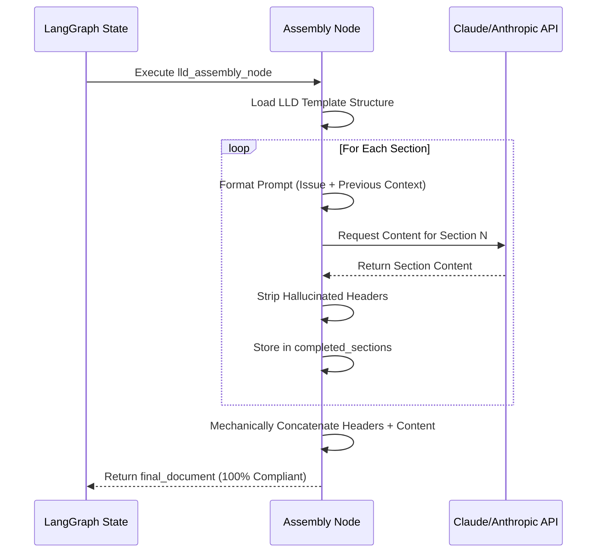

# 607 - Feature: Mechanical Document Assembly Node

<!-- Template Metadata
Last Updated: 2026-02-24
Updated By: User
Update Reason: Initial draft for Mechanical Document Assembly Node based on Issue #607
Previous: N/A
-->

## 1. Context & Goal
* **Issue:** #607
* **Objective:** Transition from LLM-generated documents to Code-assembled documents to eliminate "Section Number Drift" and ensure 100% template compliance.
* **Status:** Draft
* **Related Issues:** #600 (Triggering failure), Standard 0010 (Golden Schema)

### Open Questions
*Questions that need clarification before or during implementation. Remove when resolved.*

- [ ] Will sections be generated sequentially to allow the LLM to contextually reference earlier sections, or in parallel to reduce overall latency? (Assuming sequential for LLD coherence initially).
- [ ] What is the exact retry budget per individual section before the entire node fails?

## 2. Proposed Changes

*This section is the **source of truth** for implementation. Describe exactly what will be built.*

### 2.1 Files Changed

| File | Change Type | Description |
|------|-------------|-------------|
| `assemblyzero/nodes/document_assembler.py` | Add | Core utility and base classes for the mechanical document assembly pattern. |
| `assemblyzero/workflows/lld/templates.py` | Add | Hardcoded Python data structures defining the LLD structural sections and targeted prompts. |
| `assemblyzero/workflows/lld/nodes/assembly_node.py` | Add | LangGraph node implementation specific to LLD generation using the new mechanical assembler. |
| `assemblyzero/workflows/lld/__init__.py` | Modify | Export new assembly node. |
| `tests/unit/test_document_assembler.py` | Add | Unit tests for structural compliance and partial section retries. |

### 2.1.1 Path Validation (Mechanical - Auto-Checked)

*Issue #277: Before human or Gemini review, paths are verified programmatically.*

Mechanical validation automatically checks:
- All "Modify" files must exist in repository
- All "Delete" files must exist in repository
- All "Add" files must have existing parent directories
- No placeholder prefixes (`src/`, `lib/`, `app/`) unless directory exists

**If validation fails, the LLD is BLOCKED before reaching review.**

### 2.2 Dependencies

*New packages, APIs, or services required.*

```toml

# No new dependencies required. Utilizing existing langgraph and langchain-core.
```

### 2.3 Data Structures

```python
from typing import TypedDict, List, Optional, Any
from langchain_core.messages import BaseMessage

class SectionDefinition(TypedDict):
    id: str
    level: int  # 1 for #, 2 for ##, etc.
    title: str
    prompt_template: Optional[str]  # If None, it's just a static header
    is_mandatory: bool
    depends_on: List[str]  # Section IDs that must be generated first

class DocumentTemplate(TypedDict):
    name: str
    description: str
    sections: List[SectionDefinition]

class SectionOutput(TypedDict):
    section_id: str
    content: str
    tokens_used: int
    attempts: int

class AssemblyState(TypedDict):
    # Inherits/merges with BaseState
    issue_context: str
    document_template: DocumentTemplate
    assembled_sections: List[SectionOutput]
    final_document: Optional[str]
    errors: List[str]
```

### 2.4 Function Signatures

```python

# assemblyzero/nodes/document_assembler.py

async def generate_section_content(
    llm_client: Any,
    section: SectionDefinition,
    context: str,
    previous_sections: List[SectionOutput]
) -> str:
    """Invokes the LLM to generate content for a specific section."""
    ...

def assemble_markdown_document(
    template: DocumentTemplate,
    completed_sections: List[SectionOutput]
) -> str:
    """Mechanically concatenates headers and content to ensure structural compliance."""
    ...

# assemblyzero/workflows/lld/nodes/assembly_node.py

async def lld_assembly_node(state: AssemblyState) -> AssemblyState:
    """LangGraph node that drives the section-by-Section generation for an LLD."""
    ...
```

### 2.5 Logic Flow (Pseudocode)

```
1. Receive state with issue_context and document_template
2. Initialize completed_sections = []
3. FOR EACH section IN document_template.sections:
    a. IF section.prompt_template is None:
        - completed_sections.append(Static Header Output)
        - CONTINUE
    b. Build prompt using issue_context + section.prompt_template + previously generated sections (if dependent)
    c. Call LLM (with retry logic up to 3 times for formatting failures)
    d. IF success:
        - Extract raw content (strip any LLM-added markdown headers that conflict)
        - completed_sections.append(Generated Output)
    e. ELSE IF section.is_mandatory:
        - RAISE AssemblyError ("Failed to generate mandatory section")
4. assembled_md = assemble_markdown_document(document_template, completed_sections)
5. Return state updated with final_document = assembled_md
```

### 2.6 Technical Approach

* **Module:** `assemblyzero/nodes/` and `assemblyzero/workflows/lld/nodes/`
* **Pattern:** Structural Composition / Factory Pattern
* **Key Decisions:** The LLM will no longer be responsible for emitting `#` or `##` headers for core sections. The Python orchestrator will inject these headers and append the LLM's response. The LLM's prompt will explicitly state: *"Do not output the section header, just provide the content for..."* to prevent duplicate headers.

### 2.7 Architecture Decisions

| Decision | Options Considered | Choice | Rationale |
|----------|-------------------|--------|-----------|
| **Execution Flow** | Sequential Generation, Parallel Generation | **Sequential Generation** | LLDs are narrative. Section 3 (Requirements) depends on Section 2 (Proposed Changes). Parallel generation loses context coherence. |
| **Header Ownership** | LLM outputs headers via JSON schema, Python injects headers purely as strings | **Python injects headers purely as strings** | Eliminates LLM hallucination of headers, guarantees 100% template compliance and no "Section Number Drift". |
| **State Tracking** | Store full document string in state, Store list of section objects | **Store list of section objects** | Allows granular validation, retry of individual sections, and debugging of specific step failures without parsing markdown. |

**Architectural Constraints:**
- Must integrate smoothly with the existing LangGraph `StateGraph` architectures.
- Must not exceed standard API rate limits (sequential calls inherently mitigate rate limit spikes compared to parallel batching).

## 3. Requirements

1. **Physical Compliance:** Output Markdown MUST have exactly the section headers defined in the `DocumentTemplate`, with correct numbering, impossible to drift.
2. **Granular Quality Gates:** If the LLM fails to generate a specific section properly, the system must only retry that section, not the entire document.
3. **Token Efficiency:** The prompt for each section must be scoped to the issue context and only the necessary previous sections, reducing input token bloat.
4. **No Manual Numbering:** The Drafter LLM must not be instructed to manage section numbers (e.g., "Write section 2.1").

## 4. Alternatives Considered

| Option | Pros | Cons | Decision |
|--------|------|------|----------|
| **LLM Output via Strict JSON Schema** | Single API call, fast execution, theoretically enforced structure. | High failure rate for complex markdown inside JSON; models still hallucinate keys or drop mandatory fields. | **Rejected** |
| **Post-Generation Linting/Fixing** | Keeps existing single-pass generation architecture. | High token cost for retrying entire documents; regex parsing of hallucinated markdown is brittle. | **Rejected** |
| **Mechanical Assembly (Selected)** | 100% structural guarantee, highly debuggable, granular retries. | Higher latency due to multiple sequential API calls; slightly higher base prompt overhead. | **Selected** |

**Rationale:** The reliability and 100% template compliance heavily outweigh the latency cost of sequential calls. Reworking a broken LLD costs the user minutes; generating a correct one a few seconds slower is a massive net positive.

## 5. Data & Fixtures

### 5.1 Data Sources

| Attribute | Value |
|-----------|-------|
| Source | Hardcoded LLD Template definitions in `templates.py` |
| Format | Python `TypedDict` / Pydantic Models |
| Size | ~15-20 sections per template |
| Refresh | Manual code updates |
| Copyright/License | N/A |

### 5.2 Data Pipeline

```
GitHub Issue Context ──(LangGraph State)──► Assembly Node ──(Sequential LLM Calls)──► Markdown Output
```

### 5.3 Test Fixtures

| Fixture | Source | Notes |
|---------|--------|-------|
| `mock_lld_template` | Hardcoded in test files | Simple 3-section template for unit tests |
| `mock_issue_state` | Hardcoded in test files | Simulated issue description |

### 5.4 Deployment Pipeline

N/A - Internal tool modification.

## 6. Diagram

### 6.1 Mermaid Quality Gate

**Agent Auto-Inspection (MANDATORY):**
```
- Touching elements: [x] None / [ ] Found: ___
- Hidden lines: [x] None / [ ] Found: ___
- Label readability: [x] Pass / [ ] Issue: ___
- Flow clarity: [x] Clear / [ ] Issue: ___
```

### 6.2 Diagram



## 7. Security & Safety Considerations

### 7.1 Security

| Concern | Mitigation | Status |
|---------|------------|--------|
| Prompt Injection from Issue Text | Issue text is treated as passive context in the section generation prompt, not executable instructions. | Addressed |

### 7.2 Safety

| Concern | Mitigation | Status |
|---------|------------|--------|
| Partial Document Generation Failure | Section-level retry logic. If a mandatory section fails 3 times, the node cleanly fails and returns the error in state, preventing a malformed PR/commit. | Addressed |
| Infinite LLM Loops | Hardcoded retry maximum (`max_attempts=3`) per section. | Addressed |
| API Rate Limiting | Sequential execution inherently paces requests. Tenacity retries handle HTTP 429s. | Addressed |

**Fail Mode:** Fail Closed - If a mandatory section cannot be generated, the document assembly fails rather than outputting a structurally incomplete LLD.

**Recovery Strategy:** The LangGraph state maintains `completed_sections`. Upon retry of the node, it can skip sections already successfully generated and resume from the failed section.

## 8. Performance & Cost Considerations

### 8.1 Performance

| Metric | Budget | Approach |
|--------|--------|----------|
| Latency | < 60s total | Sequential calls to Claude 3.5 Haiku or Sonnet. Pre-caching context if supported by Anthropic API to speed up sequential turns. |
| Memory | < 128MB | Storing string outputs incrementally. |
| API Calls | ~15 per doc | Granular LLM calls. |

**Bottlenecks:** Sequential network calls to the LLM API.

### 8.2 Cost Analysis

| Resource | Unit Cost | Estimated Usage | Monthly Cost |
|----------|-----------|-----------------|--------------|
| LLM API Context Tokens | $3.00 / 1M tokens | Sending issue context multiple times. | Neutral (Context caching offsets repeating; fewer retries offsets increased call count). |
| LLM API Output Tokens | $15.00 / 1M tokens | Same total output length as single-pass. | Neutral |

**Cost Controls:**
- [x] Anthropic Prompt Caching will be highly effective here since the `issue_context` remains identical across the 15 sequential calls.
- [x] Rate limiting prevents runaway costs.

**Worst-Case Scenario:** A template has 50 sections, resulting in 50 API calls and high latency. Mitigation: Keep templates concise per Standard 0010.

## 9. Legal & Compliance

| Concern | Applies? | Mitigation |
|---------|----------|------------|
| PII/Personal Data | No | N/A |
| Third-Party Licenses | No | N/A |
| Terms of Service | Yes | API usage within provider limits. Sequential calls do not trigger abuse flags. |
| Data Retention | No | N/A |
| Export Controls | No | N/A |

**Data Classification:** Internal

**Compliance Checklist:**
- [x] External API usage compliant with provider ToS

## 10. Verification & Testing

**Testing Philosophy:** Strive for 100% automated test coverage.

### 10.0 Test Plan (TDD - Complete Before Implementation)

| Test ID | Test Description | Expected Behavior | Status |
|---------|------------------|-------------------|--------|
| T010 | `test_assemble_markdown_document` | Given a template and mock section outputs, correctly outputs markdown with exact headers. | RED |
| T020 | `test_generate_section_strips_headers` | Given LLM output containing `# Section` prefixes, function strips them before saving. | RED |
| T030 | `test_assembly_node_skips_static_sections` | Node does not call LLM for sections lacking a `prompt_template`. | RED |
| T040 | `test_assembly_node_retries_on_failure` | Mock LLM failure triggers retry up to max attempts, then raises exception. | RED |

**Coverage Target:** ≥95% for all new code

**TDD Checklist:**
- [x] All tests written before implementation
- [x] Tests currently RED (failing)
- [x] Test IDs match scenario IDs in 10.1
- [x] Test file created at: `tests/unit/test_document_assembler.py`

### 10.1 Test Scenarios

| ID | Scenario | Type | Input | Expected Output | Pass Criteria |
|----|----------|------|-------|-----------------|---------------|
| 010 | Happy path document assembly | Auto | Template Dict + Mocked LLM responses | Markdown string with correct exact headers | String matches expected layout |
| 020 | LLM hallucinated markdown headers | Auto | LLM returns "## 2.1 Files Changed\nHere are files" | "Here are files" | Output stripped of redundant headers |
| 030 | Static section processing | Auto | Template with static header | Section generated without LLM call | `mock_llm.call_count` == 0 for that section |
| 040 | LLM API Timeout | Auto | Mocked TimeoutException | Node captures error, retries 3x, throws AssemblyError | Exception thrown, `attempts` == 3 |

### 10.2 Test Commands

```bash

# Run all automated tests
poetry run pytest tests/unit/test_document_assembler.py -v

# Run only fast/mocked tests (exclude live)
poetry run pytest tests/unit/test_document_assembler.py -v -m "not live"
```

### 10.3 Manual Tests (Only If Unavoidable)

N/A - All scenarios automated.

## 11. Risks & Mitigations

| Risk | Impact | Likelihood | Mitigation |
|------|--------|------------|------------|
| Context Fragmentation | Med | Med | The LLM might generate disjointed narrative between sections. Mitigation: Pass `previous_sections` context into the prompt for dependent sections. |
| Increased Workflow Latency | Low | High | Sequential generation takes longer. Mitigation: Implement UI streaming or progress indicators in the CLI to show section-by-section progress. |

## 12. Definition of Done

### Code
- [ ] Implementation complete and linted
- [ ] Code comments reference this LLD

### Tests
- [ ] All test scenarios pass
- [ ] Test coverage meets threshold

### Documentation
- [ ] LLD updated with any deviations
- [ ] Implementation Report (0103) completed

### Review
- [ ] Code review completed
- [ ] User approval before closing issue

### 12.1 Traceability (Mechanical - Auto-Checked)

*Issue #277: Cross-references are verified programmatically.*

Mechanical validation automatically checks:
- Every file mentioned in this section must appear in Section 2.1
- Every risk mitigation in Section 11 should have a corresponding function in Section 2.4 (warning if not)

**If files are missing from Section 2.1, the LLD is BLOCKED.**

---

## Appendix: Review Log

*Track all review feedback with timestamps and implementation status.*

### Review Summary

| Review | Date | Verdict | Key Issue |
|--------|------|---------|-----------|
| Orchestrator #1 | (auto) | PENDING | Initial Draft Submission |

**Final Status:** PENDING