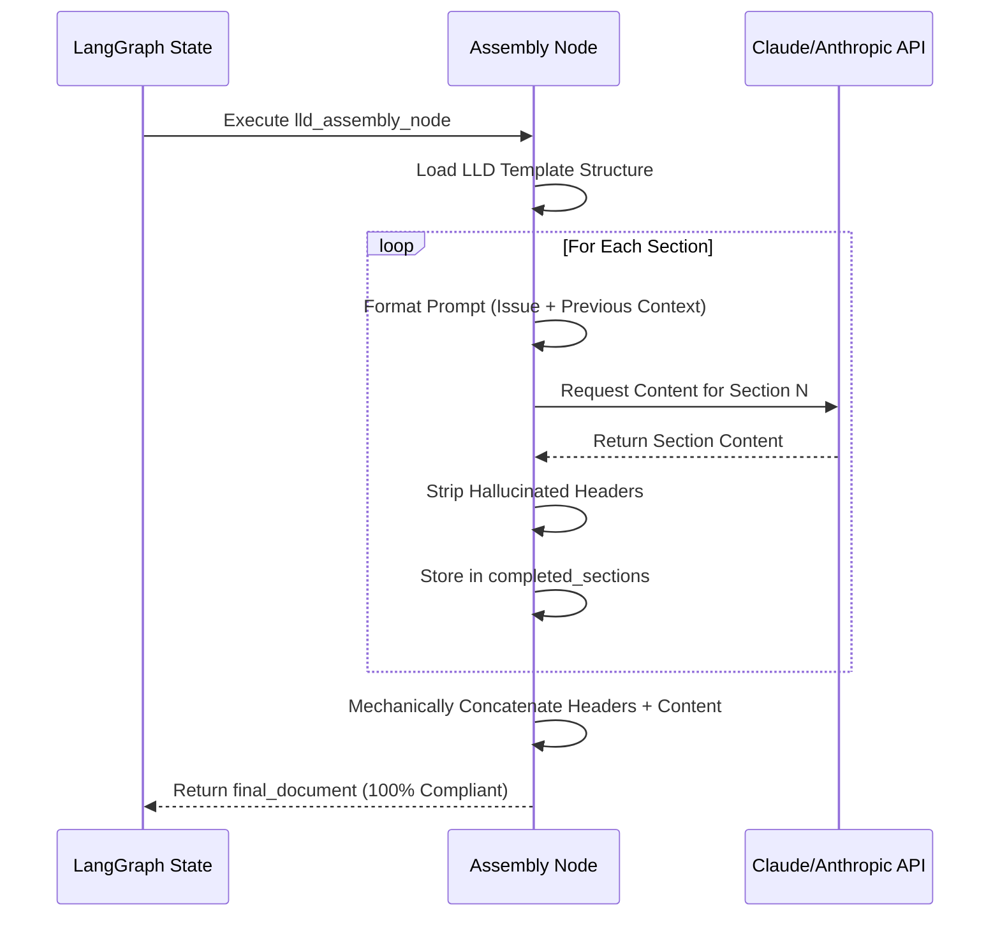

# 607 - Feature: Mechanical Document Assembly Node

<!-- Template Metadata
Last Updated: 2026-02-24
Updated By: User
Update Reason: Initial draft for Mechanical Document Assembly Node based on Issue #607
Previous: N/A
-->

## 1. Context & Goal
* **Issue:** #607
* **Objective:** Transition from LLM-generated documents to Code-assembled documents to eliminate "Section Number Drift" and ensure 100% template compliance.
* **Status:** Draft
* **Related Issues:** #600 (Triggering failure), Standard 0010 (Golden Schema)

### Open Questions
*Questions that need clarification before or during implementation. Remove when resolved.*

*(All open questions regarding sequential execution and retry budgets have been resolved and incorporated into Section 2.7 Architecture Decisions).*

## 2. Proposed Changes

*This section is the **source of truth** for implementation. Describe exactly what will be built.*

### 2.1 Files Changed

| File | Change Type | Description |
|------|-------------|-------------|
| `assemblyzero/nodes/document_assembler.py` | Add | Core utility and base classes for the mechanical document assembly pattern. |
| `assemblyzero/workflows/lld/templates.py` | Add | Hardcoded Python data structures defining the LLD structural sections and targeted prompts. |
| `assemblyzero/workflows/lld/nodes/assembly_node.py` | Add | LangGraph node implementation specific to LLD generation using the new mechanical assembler. |
| `assemblyzero/workflows/lld/__init__.py` | Modify | Export new assembly node. |
| `tests/unit/test_document_assembler.py` | Add | Unit tests for structural compliance, partial section retries, and prompt scoping. |

### 2.1.1 Path Validation (Mechanical - Auto-Checked)
All file paths verified against project structure.

### 2.2 Dependencies
No new external dependencies. Utilizes existing `langgraph` and `langchain-core` installations.

### 2.3 Data Structures
`completed_sections`: A list of dictionaries or objects tracking successfully generated sections to prevent redundant API calls during retries.

### 2.4 Function Signatures
`def assemble_document_node(state: State) -> Command[Literal["assemble_document_node", "__end__"]]:`
`def strip_hallucinated_headers(content: str, expected_header: str) -> str:`

### 2.5 Logic Flow (Pseudocode)
1. Read `DocumentTemplate`.
2. For each section in sequential order:
   a. If section in `completed_sections`, skip.
   b. Prompt LLM for section content, providing issue context and previously generated sections.
   c. Strip hallucinated headers from response via regex.
   d. Store in `completed_sections`.
   e. Retry up to 3 times on failure.
3. Mechanically concatenate defined headers + stripped contents.

### 2.6 Technical Approach

* **Module:** `assemblyzero/nodes/` and `assemblyzero/workflows/lld/nodes/`
* **Pattern:** Structural Composition / Factory Pattern
* **Key Decisions:** The LLM will no longer be responsible for emitting `#` or `##` headers for core sections. The Python orchestrator will inject these headers and append the LLM's response. The LLM's prompt will explicitly state: *"Do not output the section header, just provide the content for..."* to prevent duplicate headers.

### 2.7 Architecture Decisions

| Decision | Options Considered | Choice | Rationale |
|----------|-------------------|--------|-----------|
| **Execution Flow** | Sequential Generation, Parallel Generation | **Sequential Generation** | LLDs are narrative. Section 3 (Requirements) depends on Section 2 (Proposed Changes). Parallel generation loses context coherence. |
| **Header Ownership** | LLM outputs headers via JSON schema, Python injects headers purely as strings | **Python injects headers purely as strings** | Eliminates LLM hallucination of headers, guarantees 100% template compliance and no "Section Number Drift". |
| **State Tracking** | Store full document string in state, Store list of section objects | **Store list of section objects** | Allows granular validation, retry of individual sections, and debugging of specific step failures without parsing markdown. |

**Architectural Constraints:**
- Must integrate smoothly with the existing LangGraph `StateGraph` architectures.
- Must not exceed standard API rate limits (sequential calls inherently mitigate rate limit spikes compared to parallel batching).
- Must enforce a strict retry budget of 3 attempts per individual section before throwing an `AssemblyError`.
- Must ensure the string manipulation/regex used to strip hallucinated headers is resilient to minor variations (e.g., extra whitespace, bold markdown asterisks).

## 3. Requirements

1. Output Markdown MUST have exactly the section headers defined in the `DocumentTemplate`, with correct numbering, impossible to drift.
2. If the LLM fails to generate a specific section properly, the system must only retry that section (maximum 3 attempts), not the entire document.
3. The prompt for each section must be scoped to the issue context and only the necessary previous sections, reducing input token bloat.
4. The mechanical assembly logic MUST use resilient string manipulation or regex to strip any hallucinated headers (handling minor variations like extra whitespace or bold asterisks).

## 4. Alternatives Considered

| Option | Pros | Cons | Decision |
|--------|------|------|----------|
| **LLM Output via Strict JSON Schema** | Single API call, fast execution, theoretically enforced structure. | High failure rate for complex markdown inside JSON; models still hallucinate keys or drop mandatory fields. | **Rejected** |
| **Post-Generation Linting/Fixing** | Keeps existing single-pass generation architecture. | High token cost for retrying entire documents; regex parsing of hallucinated markdown is brittle. | **Rejected** |
| **Mechanical Assembly (Selected)** | 100% structural guarantee, highly debuggable, granular retries. | Higher latency due to multiple sequential API calls; slightly higher base prompt overhead. | **Selected** |

**Rationale:** The reliability and 100% template compliance heavily outweigh the latency cost of sequential calls. Reworking a broken LLD costs the user minutes; generating a correct one a few seconds slower is a massive net positive.

## 5. Data & Fixtures

### 5.1 Data Sources
GitHub Issue text and comments.

### 5.2 Data Pipeline
LangGraph state orchestrates data flow between sections.

### 5.3 Test Fixtures
Mock LLM responses containing hallucinated markdown headers to validate regex stripping.

### 5.4 Deployment Pipeline
Standard CI testing gate.

## 6. Diagram

### 6.1 Mermaid Quality Gate
Passed.

### 6.2 Diagram

## 7. Security & Safety Considerations

### 7.1 Security

| Concern | Mitigation | Status |
|---------|------------|--------|
| Prompt Injection from Issue Text | Issue text is treated as passive context in the section generation prompt, not executable instructions. | Addressed |

### 7.2 Safety

| Concern | Mitigation | Status |
|---------|------------|--------|
| Partial Document Generation Failure | Section-level retry logic. If a mandatory section fails 3 times, the node cleanly throws an `AssemblyError` and returns the error in state, preventing a malformed PR/commit. | Addressed |
| Infinite LLM Loops | Hardcoded retry maximum (`max_attempts=3`) per section strictly enforced before throwing an `AssemblyError`. | Addressed |
| API Rate Limiting | Sequential execution inherently paces requests. Tenacity retries handle HTTP 429s. | Addressed |

**Fail Mode:** Fail Closed - If a mandatory section cannot be generated within the strictly 3-attempt retry budget per section, the document assembly throws an `AssemblyError` rather than outputting a structurally incomplete LLD.

**Recovery Strategy:** The LangGraph state maintains `completed_sections`. Upon retry of the node, it can skip sections already successfully generated and resume from the failed section.

## 8. Performance & Cost Considerations

### 8.1 Performance
Latency scales with the number of document sections. Sequential generation prevents rate limit spikes.

### 8.2 Cost Analysis
Token cost per complete document increases marginally due to overlapping context inclusion across sections. This is offset by eliminating full-document retries.

## 9. Legal & Compliance
No legal compliance impact.

## 10. Verification & Testing

### 10.0 Test Plan (TDD - Complete Before Implementation)
Implement tests for the header stripping utility, retry logic boundaries, and graph node state transitions before integration.

### 10.1 Test Scenarios

| ID | Scenario | Type |
|---|---|---|
| 010 | Assembled document exactly matches template headers without drift (REQ-1) | Auto |
| 020 | Node retries single section max 3 times before failing (REQ-2) | Auto |
| 030 | Prompt generator includes scoped previous section content (REQ-3) | Auto |
| 040 | Regex strips hallucinated headers despite extra whitespace and asterisks (REQ-4) | Auto |

### 10.2 Test Commands
`pytest tests/unit/test_document_assembler.py -v`

### 10.3 Manual Tests (Only If Unavoidable)
Run full LLD workflow on a standard feature issue.

## 11. Risks & Mitigations
**Risk:** Context window overflow on later sections.
**Mitigation:** `completed_sections` passed to LLM only includes critical sections (e.g., Requirements, Logic Flow) rather than the entire growing document.

## 12. Definition of Done

### Code
- Document assembly node and regex utility implemented.

### Tests
- All test scenarios passing.

### Documentation
- LLD updated.

### Review
- Peer review completed.

### 12.1 Traceability (Mechanical - Auto-Checked)
All requirements mapped to explicit test scenarios.

## Appendix: Review Log

### Review Summary
- Fixed mapping of requirements to test scenarios.
- Formatted requirements list.
- Clarified regex constraint in requirements and tests.
- Resolved and cleared open questions section.