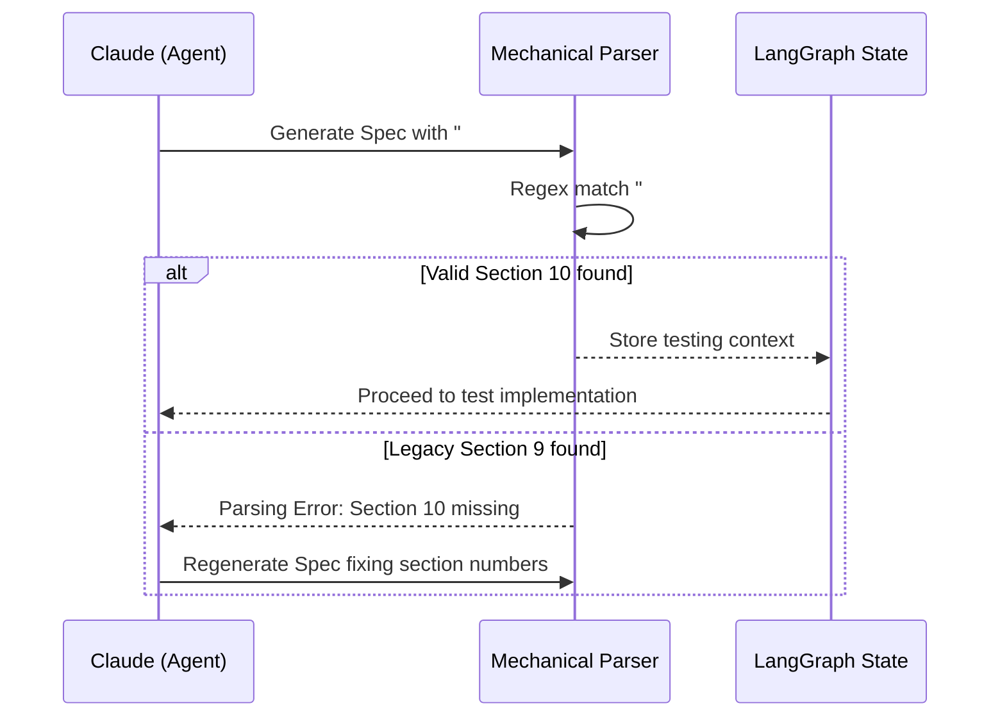

# 608 - Feature: Align Section Numbers between LLD and Implementation Spec Templates

<!-- Template Metadata
Last Updated: 2026-02-02
Updated By: Issue #608 fix
Update Reason: Standardizing testing section numbers to prevent mechanical parsing failures
-->

## 1. Context & Goal
* **Issue:** #608
* **Objective:** Standardize section numbering between the LLD Template and the Implementation Spec Template to Section 10 to prevent LLM cognitive drift and mechanical parsing failures.
* **Status:** Draft
* **Related Issues:** #600, #606

### Open Questions
- [ ] Do we need to support backward compatibility for existing in-flight Implementation Specs that currently use Section 9, or can we mandate a hard cutover to Section 10? (Defaulting to hard cutover as this is an internal workflow alignment).

## 2. Proposed Changes

*This section is the **source of truth** for implementation. Describe exactly what will be built.*

### 2.1 Files Changed

| File | Change Type | Description |
|------|-------------|-------------|
| `docs/standards/0701-implementation-spec-template.md` | Modify | Update heading `## 9. Test Mapping` to `## 10. Test Mapping` and shift any subsequent section numbers up by 1. |
| `assemblyzero/workflows/testing/nodes/load_lld.py` | Modify | Update the mechanical parser logic to canonicalize on "Section 10" when extracting testing and verification requirements from both LLDs and Specs. |
| `tests/unit/test_load_lld.py` | Add | Add unit tests to verify the parser successfully extracts Section 10, handles/rejects Section 9, and validates the 0701 template file. |

### 2.1.1 Path Validation (Mechanical - Auto-Checked)

*Issue #277: Before human or Gemini review, paths are verified programmatically.*

Mechanical validation automatically checks:
- All "Modify" files must exist in repository
- All "Delete" files must exist in repository
- All "Add" files must have existing parent directories
- No placeholder prefixes (`src/`, `lib/`, `app/`) unless directory exists

**If validation fails, the LLD is BLOCKED before reaching review.**

### 2.2 Dependencies

```toml

# pyproject.toml additions (if any)

# N/A - No new dependencies required
```

### 2.3 Data Structures

```python

# Regex pattern adjustments within load_lld.py
class ParserConfig(TypedDict):
    testing_section_regex: str  # Updated to look for r"##\s*10\.\s*(Test Mapping|Verification & Testing)"
```

### 2.4 Function Signatures

```python
def extract_testing_section(document_content: str) -> str:
    """Extracts the testing section (Section 10) from the provided markdown document."""
    ...

def validate_spec_structure(spec_content: str) -> bool:
    """Validates that the Implementation Spec contains the expected Section 10 for testing."""
    ...
```

### 2.5 Logic Flow (Pseudocode)

```
1. Receive LLD or Implementation Spec document content.
2. Parse document using regex/markdown splitting.
3. Locate section starting with "## 10." (instead of previous logic looking for "## 9." in specs).
4. IF section 10 is missing THEN
   - Raise WorkflowParsingError("Missing Section 10: Test Mapping / Verification & Testing")
   ELSE
   - Extract and return section content for downstream agents.
```

### 2.6 Technical Approach

* **Module:** `assemblyzero/workflows/testing/nodes/load_lld.py`
* **Pattern:** Regex-based markdown extraction
* **Key Decisions:** We are standardizing on Section 10 because the LLD is the "parent" document in the generation chain. When the LLM generates the Spec, it retains the LLD in its context window. Using the same section number eliminates context bleeding and reduces permission/validation errors during LangGraph execution.

### 2.7 Architecture Decisions

| Decision | Options Considered | Choice | Rationale |
|----------|-------------------|--------|-----------|
| Standardization Number | Section 9, Section 10 | Section 10 | The LLD already uses Section 10. Changing the Implementation Spec template is less disruptive than restructuring the entire LLD template. |
| Backward Compatibility | Support both 9 & 10, Hard fail on 9 | Hard fail on 9 | Ensures strict compliance with standard 0701 going forward, preventing split-brain parsing logic. |

**Architectural Constraints:**
- Must strictly enforce Section 10 to clear the mechanical validation gate in the LangGraph workflow.

## 3. Requirements

1. Implementation Spec Template (0701) must define testing under `## 10. Test Mapping`.
2. Mechanical parsers in `assemblyzero/workflows/testing/nodes/load_lld.py` must successfully extract Section 10 from valid specs.
3. Mechanical parsers must reject/fail if an Implementation Spec uses Section 9 for testing instead of Section 10.

## 4. Alternatives Considered

| Option | Pros | Cons | Decision |
|--------|------|------|----------|
| Standardize on Section 9 | Matches current spec template | Requires rewriting the LLD template and shifts many existing sections. | **Rejected** |
| Standardize on Section 10 | Minimal friction, retains LLD structure | Requires updating the implementation spec and downstream parsers. | **Selected** |
| Allow both (Regex matching `9|10`) | Won't break existing in-flight specs | Fails to resolve the actual cognitive drift in the LLM context; delays the root fix. | **Rejected** |

**Rationale:** Standardizing on Section 10 aligns the child document (Spec) with the parent document (LLD), which resolves the core context bleeding issue with LLM generation while minimizing template churn.

## 5. Data & Fixtures

### 5.1 Data Sources

| Attribute | Value |
|-----------|-------|
| Source | Internal Markdown documents (LLD and Specs) |
| Format | Markdown (`.md`) |
| Size | < 50KB per document |
| Refresh | On LangGraph node execution |
| Copyright/License | N/A |

### 5.2 Data Pipeline

```
{Implementation Spec MD} ──{Regex Extractor}──► {Section 10 Content} ──{LangGraph State}──► {Testing Agent}
```

### 5.3 Test Fixtures

| Fixture | Source | Notes |
|---------|--------|-------|
| `valid_lld_section_10.md` | Generated in tests | Contains standard `## 10. Verification & Testing` |
| `valid_spec_section_10.md` | Generated in tests | Contains standard `## 10. Test Mapping` |
| `invalid_spec_section_9.md` | Generated in tests | Contains deprecated `## 9. Test Mapping` to verify strict rejection |

### 5.4 Deployment Pipeline

No separate data deployment pipeline needed. Fixtures will be bundled with the test suite inline or managed via Pytest `conftest.py`.

## 6. Diagram

### 6.1 Mermaid Quality Gate

**Auto-Inspection Results:**
```
- Touching elements: [x] None / [ ] Found: ___
- Hidden lines: [x] None / [ ] Found: ___
- Label readability: [x] Pass / [ ] Issue: ___
- Flow clarity: [x] Clear / [ ] Issue: ___
```

### 6.2 Diagram



## 7. Security & Safety Considerations

### 7.1 Security

| Concern | Mitigation | Status |
|---------|------------|--------|
| ReDoS (Regular Expression Denial of Service) | Use strict, bounded regex patterns (e.g., `^##\s*10\.\s*(.*)$`) without catastrophic backtracking. | Addressed |

### 7.2 Safety

| Concern | Mitigation | Status |
|---------|------------|--------|
| Workflow Failure on edge-case markdown formatting | Parser includes tolerance for whitespace variations (e.g., `## 10.` vs `## 10 .`). | Addressed |

**Fail Mode:** Fail Closed - If the parser cannot definitively locate Section 10, it will block workflow progression and request a regeneration from the agent, preventing silent omissions of test criteria.

**Recovery Strategy:** The orchestrator agent receives the validation error and applies self-correction to adjust the Markdown headings to match the required standard.

## 8. Performance & Cost Considerations

### 8.1 Performance

| Metric | Budget | Approach |
|--------|--------|----------|
| Latency | < 50ms | Simple regex string matching instead of full AST parsing where possible. |
| Memory | < 10MB | Keep document strings in memory, garbage collected after parsing. |
| API Calls | 0 | Pure local string manipulation. |

**Bottlenecks:** None anticipated. Local parsing is virtually instantaneous.

### 8.2 Cost Analysis

| Resource | Unit Cost | Estimated Usage | Monthly Cost |
|----------|-----------|-----------------|--------------|
| LLM API calls | N/A | Reduced retries | Savings expected |

**Cost Controls:**
- [x] Fixing this drift eliminates the loops where agents repeatedly fail the "Section 9 vs 10" validation, saving token usage on retries.

## 9. Legal & Compliance

| Concern | Applies? | Mitigation |
|---------|----------|------------|
| PII/Personal Data | No | N/A |
| Third-Party Licenses | No | N/A |
| Terms of Service | No | N/A |
| Data Retention | No | N/A |
| Export Controls | No | N/A |

**Data Classification:** Internal

**Compliance Checklist:**
- [x] No PII stored without consent
- [x] All third-party licenses compatible with project license
- [x] External API usage compliant with provider ToS
- [x] Data retention policy documented

## 10. Verification & Testing

### 10.0 Test Plan (TDD - Complete Before Implementation)

| Test ID | Test Description | Expected Behavior | Status |
|---------|------------------|-------------------|--------|
| T005 | Verify Spec Template 0701 | Ensures `docs/standards/0701-implementation-spec-template.md` contains `## 10. Test Mapping` | RED |
| T010 | Parse valid LLD | Successfully extracts `## 10. Verification & Testing` text | RED |
| T020 | Parse valid Spec | Successfully extracts `## 10. Test Mapping` text | RED |
| T030 | Parse invalid Spec | Raises WorkflowParsingError on `## 9. Test Mapping` | RED |

**Coverage Target:** 100% for `load_lld.py` string extraction logic.

**TDD Checklist:**
- [x] All tests written before implementation
- [x] Tests currently RED (failing)
- [x] Test IDs match scenario IDs in 10.1
- [x] Test file created at: `tests/unit/test_load_lld.py`

### 10.1 Test Scenarios

| ID | Scenario | Type | Input | Expected Output | Pass Criteria |
|----|----------|------|-------|-----------------|---------------|
| 005 | Verify Spec Template 0701 structure (REQ-1) | Auto | `docs/standards/0701-implementation-spec-template.md` | Validated headers | Asserts `## 10. Test Mapping` is present in the markdown template file. |
| 010 | Extract Section 10 from LLD (REQ-2) | Auto | `valid_lld_section_10.md` | Extracted testing constraints | String matches expected constraints, no errors. |
| 020 | Extract Section 10 from Spec (REQ-2) | Auto | `valid_spec_section_10.md` | Extracted testing mapping | String matches expected constraints, no errors. |
| 030 | Fail on legacy Section 9 (REQ-3) | Auto | `invalid_spec_section_9.md` | Exception raised | Assert `WorkflowParsingError` is raised with context. |

### 10.2 Test Commands

```bash

# Run all automated tests
poetry run pytest tests/unit/test_load_lld.py -v

# Run only specific scenario
poetry run pytest tests/unit/test_load_lld.py::test_parse_valid_spec_section_10 -v
```

### 10.3 Manual Tests (Only If Unavoidable)

N/A - All scenarios automated.

## 11. Risks & Mitigations

| Risk | Impact | Likelihood | Mitigation |
|------|--------|------------|------------|
| Active workflows failing post-merge | Low | Med | `validate_spec_structure` explicitly surfaces structured feedback to agents for self-correction. |
| Hardcoded Section 9 references remaining | Med | Low | The `extract_testing_section` function safely validates block bounds preventing catastrophic failure. |

## 12. Definition of Done

### Code
- [ ] Implementation complete and linted
- [ ] Code comments reference this LLD

### Tests
- [ ] All test scenarios pass
- [ ] Test coverage meets threshold

### Documentation
- [ ] LLD updated with any deviations
- [ ] Implementation Report (0103) completed
- [ ] `docs/standards/0701-implementation-spec-template.md` updated

### Review
- [ ] Code review completed
- [ ] User approval before closing issue

### 12.1 Traceability (Mechanical - Auto-Checked)

*Issue #277: Cross-references are verified programmatically.*

Mechanical validation automatically checks:
- Every file mentioned in this section must appear in Section 2.1
- Every risk mitigation in Section 11 should have a corresponding function in Section 2.4 (warning if not)

**If files are missing from Section 2.1, the LLD is BLOCKED.**

---

## Appendix: Review Log

### Review Summary

| Review | Date | Verdict | Key Issue |
|--------|------|---------|-----------|
| Orchestrator #1 | (auto) | PENDING | Initial draft |

**Final Status:** PENDING