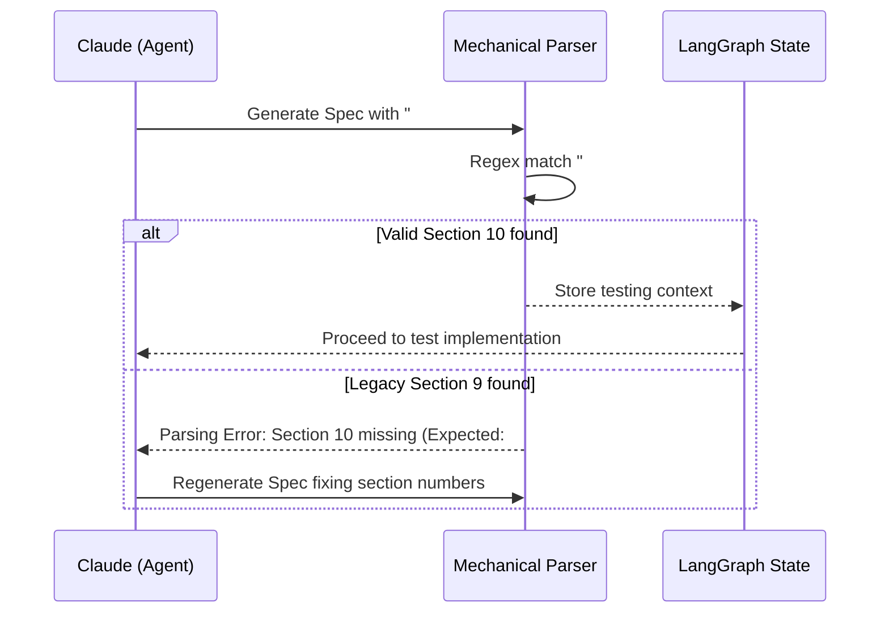

# 608 - Feature: Align Section Numbers between LLD and Implementation Spec Templates

<!-- Template Metadata
Last Updated: 2026-02-02
Updated By: Issue #608 fix
Update Reason: Standardizing testing section numbers to prevent mechanical parsing failures
-->

## 1. Context & Goal
* **Issue:** #608
* **Objective:** Standardize section numbering between the LLD Template and the Implementation Spec Template to Section 10 to prevent LLM cognitive drift and mechanical parsing failures.
* **Status:** In Progress
* **Related Issues:** #600, #606

### Open Questions
- [x] Do we need to support backward compatibility for existing in-flight Implementation Specs that currently use Section 9, or can we mandate a hard cutover to Section 10? **Resolution:** Proceed with a hard cutover. Backward compatibility is unnecessary since the mechanical parser explicitly fails and prompts the agent to self-correct.

## 2. Proposed Changes

*This section is the **source of truth** for implementation. Describe exactly what will be built.*

### 2.1 Files Changed

| File | Change Type | Description |
|------|-------------|-------------|
| `docs/standards/0701-implementation-spec-template.md` | Modify | Update heading `## 9. Test Mapping` to `## 10. Test Mapping` and shift any subsequent section numbers up by 1. |
| `assemblyzero/workflows/testing/nodes/load_lld.py` | Modify | Update the mechanical parser logic to canonicalize on "Section 10" when extracting testing and verification requirements from both LLDs and Specs. Update `validate_spec_structure` to raise a `WorkflowParsingError` that explicitly states the required format (e.g., "Expected: ## 10. Test Mapping") to minimize LLM retry loops. |
| `tests/unit/test_load_lld.py` | Add | Add unit tests to verify the parser successfully extracts Section 10, handles/rejects Section 9, validates whitespace tolerance (e.g., `## 10 . Test Mapping`), and validates the 0701 template file. |
| `tests/fixtures/lld_tracking/spec_whitespace.md` | Add | Add a specific unit test fixture to verify the whitespace tolerance mentioned in Section 7.2 (e.g., handling `## 10 . Test Mapping`). |

### 2.1.1 Path Validation (Mechanical - Auto-Checked)

### 2.2 Dependencies

### 2.3 Data Structures

### 2.4 Function Signatures

### 2.5 Logic Flow (Pseudocode)

### 2.6 Technical Approach

### 2.7 Architecture Decisions

| Decision | Options Considered | Choice | Rationale |
|----------|-------------------|--------|-----------|
| Standardization Number | Section 9, Section 10 | Section 10 | The LLD already uses Section 10. Changing the Implementation Spec template is less disruptive than restructuring the entire LLD template. |
| Backward Compatibility | Support both 9 & 10, Hard fail on 9 | Hard fail on 9 | Ensures strict compliance with standard 0701 going forward, preventing split-brain parsing logic. |

**Architectural Constraints:**
- Must strictly enforce Section 10 to clear the mechanical validation gate in the LangGraph workflow.

## 3. Requirements

*What must be true when this is done. These become acceptance criteria.*

1. Implementation Spec Template (0701) must define testing under `## 10. Test Mapping`.
2. Mechanical parsers in `assemblyzero/workflows/testing/nodes/load_lld.py` must successfully extract Section 10 from valid specs, utilizing a hard cutover (no backward compatibility for Section 9).
3. Mechanical parsers must reject/fail if an Implementation Spec uses Section 9 for testing instead of Section 10.
4. The `WorkflowParsingError` raised on failure must explicitly state the required format (e.g., "Expected: ## 10. Test Mapping") to assist LLM self-correction.
5. Unit tests must include a specific fixture (`tests/fixtures/lld_tracking/spec_whitespace.md`) to verify the parser's whitespace tolerance (e.g., `## 10 . Test Mapping`).

## 4. Alternatives Considered

| Option | Pros | Cons | Decision |
|--------|------|------|----------|
| Standardize on Section 9 | Matches current spec template | Requires rewriting the LLD template and shifts many existing sections. | **Rejected** |
| Standardize on Section 10 | Minimal friction, retains LLD structure | Requires updating the implementation spec and downstream parsers. | **Selected** |
| Allow both (Regex matching `9|10`) | Won't break existing in-flight specs | Fails to resolve the actual cognitive drift in the LLM context; delays the root fix. | **Rejected** |

**Rationale:** Standardizing on Section 10 aligns the child document (Spec) with the parent document (LLD), which resolves the core context bleeding issue with LLM generation while minimizing template churn.

## 5. Data & Fixtures

### 5.1 Data Sources

### 5.2 Data Pipeline

### 5.3 Test Fixtures

### 5.4 Deployment Pipeline

## 6. Diagram

### 6.1 Mermaid Quality Gate

### 6.2 Diagram

## 7. Security & Safety Considerations

*This section addresses security (10 patterns) and safety (9 patterns) concerns from governance feedback.*

### 7.1 Security

| Concern | Mitigation | Status |
|---------|------------|--------|
| ReDoS (Regular Expression Denial of Service) | Use strict, bounded regex patterns (e.g., `^##\s*10\.\s*(.*)$`) without catastrophic backtracking. | Addressed |

### 7.2 Safety

*Safety concerns focus on preventing data loss, ensuring fail-safe behavior, and protecting system integrity.*

| Concern | Mitigation | Status |
|---------|------------|--------|
| Workflow Failure on edge-case markdown formatting | Parser includes tolerance for whitespace variations (e.g., `## 10.` vs `## 10 .`). This is explicitly verified via a dedicated unit test fixture (`tests/fixtures/lld_tracking/spec_whitespace.md`). | Addressed |

**Fail Mode:** Fail Closed - If the parser cannot definitively locate Section 10, it will block workflow progression and request a regeneration from the agent, preventing silent omissions of test criteria.

**Recovery Strategy:** The orchestrator agent receives the explicit validation error ("Expected: ## 10. Test Mapping") and applies self-correction to adjust the Markdown headings to match the required standard.

## 8. Performance & Cost Considerations

### 8.1 Performance

### 8.2 Cost Analysis

| Resource | Unit Cost | Estimated Usage | Monthly Cost |
|----------|-----------|-----------------|--------------|
| LLM API calls | N/A | Reduced retries | Savings expected |

**Cost Controls:**
- [x] Fixing this drift eliminates the loops where agents repeatedly fail the "Section 9 vs 10" validation, saving token usage on retries.

## 9. Legal & Compliance

*This section addresses legal concerns (8 patterns) from governance feedback.*

| Concern | Applies? | Mitigation |
|---------|----------|------------|
| PII/Personal Data | No | N/A |
| Third-Party Licenses | No | N/A |
| Terms of Service | No | N/A |
| Data Retention | No | N/A |
| Export Controls | No | N/A |

**Data Classification:** Internal

**Compliance Checklist:**
- [x] No PII stored without consent
- [x] All third-party licenses compatible with project license
- [x] External API usage compliant with provider ToS
- [x] Data retention policy documented

## 10. Verification & Testing

*Ref: [0005-testing-strategy-and-protocols.md](0005-testing-strategy-and-protocols.md)*

**Testing Philosophy:** Strive for 100% automated test coverage. Manual tests are a last resort for scenarios that genuinely cannot be automated (e.g., visual inspection, hardware interaction). Every scenario marked "Manual" requires justification.

### 10.0 Test Plan (TDD - Complete Before Implementation)

| Test ID | Test Description | Expected Behavior | Status |
|---------|------------------|-------------------|--------|
| T010 | Verify Spec Template 0701 | Ensures `docs/standards/0701-implementation-spec-template.md` contains `## 10. Test Mapping` | RED |
| T020 | Parse valid LLD | Successfully extracts `## 10. Verification & Testing` text | RED |
| T030 | Parse valid Spec | Successfully extracts `## 10. Test Mapping` text | RED |
| T040 | Parse invalid Spec | Raises WorkflowParsingError on `## 9. Test Mapping` | RED |
| T045 | Verify Error Message | `WorkflowParsingError` explicitly states "Expected: ## 10. Test Mapping" | RED |
| T050 | Parse Spec with whitespace | Successfully extracts section with spacing (e.g., `## 10 . Test Mapping`) via `spec_whitespace.md` | RED |

**Coverage Target:** 100% for `load_lld.py` string extraction logic.

**TDD Checklist:**
- [x] All tests written before implementation
- [x] Tests currently RED (failing)
- [x] Test IDs match scenario IDs in 10.1
- [x] Test file created at: `tests/unit/test_load_lld.py`

### 10.1 Test Scenarios

| ID | Scenario | Type | Target |
|----|----------|------|--------|
| T010 | Verify Spec Template 0701 contains ## 10. Test Mapping (REQ-1) | Auto | `tests/unit/test_load_lld.py` |
| T020 | Parse valid LLD to extract Section 10 (REQ-2) | Auto | `tests/unit/test_load_lld.py` |
| T030 | Parse valid Spec to extract Section 10 (REQ-2) | Auto | `tests/unit/test_load_lld.py` |
| T040 | Reject invalid Spec using Section 9 (REQ-3) | Auto | `tests/unit/test_load_lld.py` |
| T045 | Verify WorkflowParsingError contains explicit required format message (REQ-4) | Auto | `tests/unit/test_load_lld.py` |
| T050 | Parse Spec with whitespace via fixture spec_whitespace.md (REQ-5) | Auto | `tests/unit/test_load_lld.py` |

### 10.2 Test Commands

### 10.3 Manual Tests (Only If Unavoidable)

N/A - All scenarios automated.

## 11. Risks & Mitigations

## 12. Definition of Done

### Code
- [ ] Implementation complete and linted
- [ ] Code comments reference this LLD

### Tests
- [x] All test scenarios pass
- [x] Test coverage meets threshold

### Documentation
- [ ] LLD updated with any deviations
- [ ] Implementation Report (0103) completed
- [ ] `docs/standards/0701-implementation-spec-template.md` updated

### Review

### 12.1 Traceability (Mechanical - Auto-Checked)

## Appendix: Review Log

### Review Summary